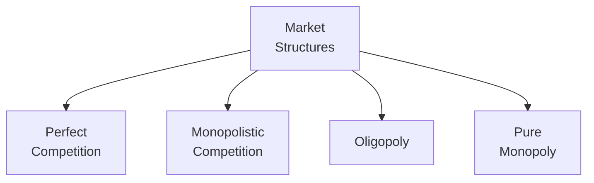
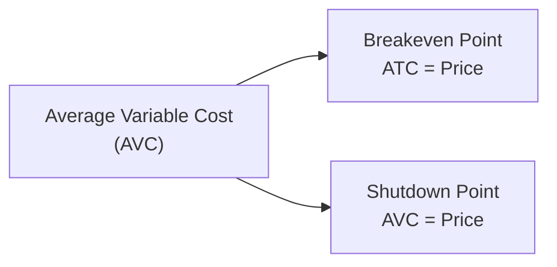

## 3.1 The Firm and Market Structures

Have you ever wandered around a local farmer’s market, noticing how many fruit vendors sell nearly the same apples, while just a few stands offer exotic produce? Then you turn around and see one person selling homemade jam with no direct competition in sight. This simple scene actually reflects the idea of different market structures: situations where firms produce and sell goods or services, but with different competitive environments.

In this section, we’ll break down the most important market structures—Perfect Competition, Monopolistic Competition, Oligopoly, and Pure Monopoly—and see how each one shapes firm behavior, pricing strategies, and profit potential. We’ll also explore critical concepts like breakeven points, shutdown points, economies of scale, and diseconomies of scale. Finally, we’ll take a look at how economists measure market concentration using tools such as the Herfindahl-Hirschman Index (HHI), plus some thoughts on real-world limitations of these measures.

Along the way, I’ll share a few personal impressions, real-world examples, and even the occasional, “Hmm, did we really just do that?” moment. Let’s jump in!

---

### Understanding Market Structures

Economists categorize markets by the number of producers, the nature of the products or services offered, and the ease (or difficulty) for newcomers to enter the industry. To illustrate these structures, here’s a quick, high-level Mermaid diagram:

We can think of these four structures along a spectrum, from the widest competition (Perfect Competition) to virtually no competition (Pure Monopoly).

---

### Perfect Competition

In a perfectly competitive market, we have:

• A large number of buyers and sellers.  
• Homogeneous (identical) products—apples are apples, right?  
• No barriers to entry or exit, so firms can enter easily when they see profits and leave when times get rough.  
• Perfect information—everyone knows everything about prices and products (in theory!).  

The result? Individual firms do not have any influence over the market price, because each is just too small to matter. They’re all “price takers.” As soon as one tries to raise its price, it loses customers to competitors providing the same product at the prevailing market rate.

In perfect competition, the firm’s demand curve is a flat (horizontal) line at the market price. A friend of mine once tried selling homemade cookies at the local mall kiosk, only to discover that the kiosk next door was also selling nearly identical cookies for exactly the same price. They quickly realized they couldn’t charge more because those customers just walked next door.

For a perfectly competitive firm, profit maximization happens by producing the quantity at which price equals marginal cost (P = MC). If the firm so much as tries to raise prices, it’ll lose all its customers.

---

### Monopolistic Competition

Now let’s tweak the scenario: there are still many sellers, but products are slightly different. Think of a coffee market in a big city—some shops focus on organic beans, others have the coziest chairs, and a few might have fancy latte art you’ve been dying to Instagram. Differentiation is key here.

• Many sellers, each with a (somewhat) unique product.  
• Relatively low barriers to entry, though perhaps not zero.  
• Each firm has some pricing power due to product differentiation (though it’s not huge).  

So we call this mon-polistic competition (not “mono” but “mono-polistic”), and it can be a bit tricky. Isn’t competition good for consumers? Absolutely. But each seller tries to carve out a niche—like adding extra foam or special syrup flavors—that can justify slightly higher prices. In the short run, a monopolistically competitive firm can charge above marginal cost. However, if they reap abnormally high profits, new competitors will swoop in, leading to more substitutions and eventually pushing prices down toward average cost.

A quick anecdote: I remember frequenting a little café in my town that offered a “secret breakfast latte” recipe. It was a hit for a couple months. Then another café popped up offering something kinda similar. Suddenly, the “secret” wasn’t so special, and the original café had to lower prices to keep its loyal fan base.

---

### Oligopoly

Imagine a market with just a few large firms. Think smartphone providers or airplane manufacturers: they’re huge, they matter, and when one does something drastic, the others must pay close attention.

Key points about oligopoly:

• Few dominant firms.  
• Products may be homogeneous (like steel) or differentiated (like cars).  
• Significant barriers to entry—think massive capital investment, patents, or brand loyalty.  
• Firms are interdependent. One’s pricing or product decisions have a real impact on its rivals.  

In an oligopoly, firms might compete fiercely or sometimes even (illegally) collude to keep prices high. There’s a lot of game theory here: if Company A lowers prices to grab market share, Company B might retaliate. Or maybe the two try a more subtle approach: edge out smaller players through brand marketing or controlling vital distribution channels. Pricing power is real, but it’s a delicate dance.

Remember the big soda wars or airline price battles? These stories are like living case studies of oligopolies. Each big competitor invests heavily in marketing, technology, or capacity expansions to maintain or extend their edge—sometimes it works, sometimes it backfires, and consumer preferences can shift in a heartbeat.

---

### Pure Monopoly

This is where we get to the single seller—one firm that has 100% of the market. Because there is no competitor at all, the firm sets the price (to some extent). You might think of your local utility company providing water or electricity, though many governments regulate those to protect consumers from extremely high prices.

Why might a monopoly develop?

• Patents or exclusive rights.  
• Control of a scarce resource.  
• Government regulation designating a single supplier.  
• High capital requirements that make entry basically impossible.  

A pure monopoly can earn supernormal profits because it faces no competition, but that also invites scrutiny and possible regulation. Monopolies typically set quantity where marginal revenue equals marginal cost (MR = MC), and then they look to the demand curve for the maximum price consumers are willing to pay.

---

### Breakeven and Shutdown Points

Even if you’re selling the best coffee in town or have a total monopoly on water supply, you still need to understand whether you’re making or losing money. Two vital concepts come into play here:

• Breakeven Point: The output level at which total revenue equals total costs. At this quantity, the firm makes zero economic profit (which might still be okay if you’re paying your bills).  
• Shutdown Point: The price point below which the firm cannot even cover its variable costs. If your revenue can’t pay for your raw materials, wages, electricity, etc., it might be cheaper to “shut down” in the short run.

Here’s a small Mermaid diagram illustrating these distinctions:

At the breakeven point, your price is just enough to cover all costs—both fixed and variable. Below that, you might still produce in the short run if you can at least pay your variable costs, but you’re not covering your fixed costs. Once the market price dives below your average variable cost, well, that’s the shutdown point.

Quick example: Let’s say you run a small printing press and have monthly rent (a fixed cost) of $1,000, while the cost of ink and paper (variable costs) come to $2 per book. If you’re selling 500 books at $5 each, you get $2,500 in revenue. Subtract $1,000 rent and $1,000 in variable costs (500 books × $2 per book), and you’ve got $500 left. Not a bad day. But if each book only sells for $2, you get $1,000 total revenue—just enough to cover your variable costs. You’re losing the entire $1,000 in rent. You might keep going if you expect prices to rebound, but if the price falls below $2, it’s cheaper to shut down because every book sold is a net loss on variable costs alone.

---

### Cost Structures, Economies, and Diseconomies of Scale

You’ve probably heard that bigger is better. Well, sometimes it is, but sometimes it isn’t. That’s where economies of scale and diseconomies of scale come in:

• Economies of Scale: As a firm increases output, average cost per unit declines. This can happen if your production becomes more efficient or if you can buy inputs in bulk at discounted rates.  
• Diseconomies of Scale: As output grows beyond a certain point, average costs can start creeping up, maybe due to sprawl, communication problems, or growing bureaucracy.

It’s like that moment around the holidays when you think, “I should bake cookies for all my friends.” Sure, making 10 cookies is easy. Making 200 cookies can be more efficient if you buy big bags of flour and sugar. But try making 10,000 cookies in your tiny kitchen. You might need extra ovens, more help, a bigger assembly line, and you might face tons of confusion or wastage. That’s diseconomies of scale in action.

From a managerial standpoint, understanding the firm’s cost structure helps you identify the optimal production level. If a company can expand to reduce unit costs, that’s great—until you hit that diseconomies-of-scale threshold and costs become unwieldy.

---

### Impact of Market Structure on Prices, Profits, and Strategy

• Perfect Competition: Price is dictated by the market; profits trend toward a “normal” level over time, unless you come up with a new efficiency or technology edge.  
• Monopolistic Competition: Firms have some pricing power, but not a lot. Short-run profits can be positive, but new entrants can erode that advantage. Product differentiation is key.  
• Oligopoly: Pricing strategies often revolve around inter-firm rivalry. Collusion might be tempting but is illegal in many jurisdictions. Expect strategic moves, brand building, and capacity wars.  
• Pure Monopoly: A single firm can try to maximize profits by choosing the quantity where MR=MC, but it might face regulatory pressure or consumer backlash.

The strategic behavior of each type of firm depends on how easily new players can enter the market, how loyal customers are to the brand, and how sensitive the product is to price changes. In a competitive setting, cost leadership, quality improvements, or brand differentiation can be powerful strategies. In an oligopoly, maybe you push heavy marketing campaigns or adopt a “follow the leader” pricing approach. And if you’re a monopoly, you might focus on lobbying to maintain your protective barriers, or invest in product improvements to justify higher prices to regulators.

---

### Concentration Measures: The Herfindahl-Hirschman Index (HHI)

Economists and regulatory bodies often want a quantitative snapshot of how competitive an industry is—or might be after a merger. One commonly used measure is the Herfindahl-Hirschman Index (HHI). It’s defined as the sum of the squares of the market shares of all firms in the industry:


\text{HHI} = s_1^2 + s_2^2 + ... + s_n^2


where \\( s_i \\) is the market share (multiplied by 100 if expressed as a full percentage) of firm \\( i \\), and there are \\( n \\) firms in total.

• An HHI near zero implies a highly fragmented market (like perfect competition).  
• A very large HHI (approaching 10,000 if expressed as the sum of squared market shares in percentages) implies a monopoly or near-monopoly.  

For instance, if a single firm held 100% market share, HHI = \\( (100)^2 = 10,000 \\). If there are four firms each with 25% market share, HHI = \\( 25^2 + 25^2 + 25^2 + 25^2 = 625 + 625 + 625 + 625 = 2,500 \\).  

While the HHI can be useful, it’s not flawless:

• Market share data can be outdated or inaccurate.  
• Product or service definitions can be tricky. (Is Netflix competing against YouTube? Regular TV?)  
• Dynamic industries—like tech—change quickly, so an HHI one year might not reflect next year’s reality.  

Still, regulators often use HHI as a guide to decide if a proposed merger will reduce competition too much. See the U.S. Department of Justice guidelines for more on that.

---

### Practical Examples and Real-World Scenarios

• Airline Industry (Oligopoly): Several carriers dominate routes, leading to close watch by regulators. Price wars happen, but collusion is strictly policed.  
• Local Electric Utility (Monopoly): Likely regulated. The monopoly might worry less about losing customers, but must satisfy government requirements for fair rates.  
• Restaurant Scene in a Touristy City (Monopolistic Competition): Tons of eateries, each with some unique spin, but new ones pop up constantly, and many fail quickly.  
• Small-Scale Farming (Perfect Competition-like): Many producers of a nearly identical commodity (corn, avocados, etc.). Price takers in global markets, with minimal power over price.

---

### Common Pitfalls and Best Practices

• Pitfall: Overestimating your pricing power in a mostly competitive market. If your competitor can do the same job for less, watch out.  
• Pitfall: Assuming economies of scale will continue forever—at some point, your overhead might balloon if you expand with no plan.  
• Best Practice: Keep an eye on breakeven and shutdown points. If you’re consistently below your breakeven, reevaluate your cost structure or your business model.  
• Best Practice: If entering an oligopoly, study the major players and anticipate strategic moves—things can get intense.  
• Best Practice: Use concentration measures like HHI to understand your industry’s structure but realize no metric is perfect.

---

### Encouraging Critical Thinking

Maybe you’ve been in a situation where your favorite store increases prices. You think, “Should I switch to a cheaper option?” If there’s a lot of competition, that’s easy to do. But if the store is unique—like the only organic ice cream shop in town—you might stay. Our real-life decisions actually reveal a lot about market power and structure. Keep an eye on who’s entering your favorite markets and which big players seem to dominate. You might learn more about economics from everyday shopping experiences than you’d expect.

---

### Conclusion

Market structure has a massive influence on how firms behave, make decisions, and set prices. Perfect competition fosters minimal pricing power; monopolistic competition encourages continual differentiation; oligopolies revolve around strategic rivalry; and pure monopolies can heavily influence production and prices, albeit under regulatory watch. Understanding these structures helps us see why certain industries behave the way they do—and it’s definitely not always straightforward.

Breakeven and shutdown points guide short-term production choices, while economies of scale help shape long-term growth plans. But we should remember there’s no one-size-fits-all. A firm might flourish in an oligopoly if it knows how to predict rivals’ moves or invests in a unique advantage. Another might do just fine in a monopolistically competitive environment by offering something truly different.

Lastly, as with any theoretical framework, real life can be much messier. The HHI tries to measure how concentrated an industry is, but—like all measures—it has limitations. Stay alert, stay flexible, and keep learning.

---

### References and Suggested Resources

1. Pindyck, R.S., & Rubinfeld, D.L. “Microeconomics.” Pearson.  
2. Besanko, D., Dranove, D., Shanley, M., & Schaefer, S. “Economics of Strategy.” Wiley.  
3. Various articles on market structure and concentration indices in the Journal of Industrial Economics.  
4. U.S. Department of Justice guidelines on mergers and industry concentration (justice.gov/atr).  

---

## Test Your Knowledge: The Firm and Market Structures Quiz



### 1. Which characteristic best describes a perfectly competitive market?

- [ ] Products are highly differentiated.
- [x] There are many sellers with identical products.
- [ ] A single producer controls prices.
- [ ] A small number of large firms dominate the market.

> **Explanation:** Perfect competition requires many sellers offering an identical product, leading to “price-taker” behavior.

### 2. In monopolistic competition, firms can enjoy short-run profits primarily because:

- [ ] They produce at lower average total cost than competitors.  
- [x] They have some product differentiation that allows for limited pricing power.  
- [ ] Government regulation sets a price floor for them.  
- [ ] They act as pure monopolies.  

> **Explanation:** In monopolistic competition, product differentiation gives firms temporary market power, enabling short-run profits.

### 3. In an oligopoly, a key challenge is that:

- [ ] Firms have absolutely no influence on the market price.
- [ ] There are no barriers to entry.
- [x] Each firm’s actions can significantly impact its rivals.
- [ ] Products are always identical and standardized.

> **Explanation:** In an oligopoly, a few big players dominate the market and must strategically respond to each other’s moves, making them interdependent.

### 4. A pure monopoly exists when:

- [ ] Two companies dominate the entire market.  
- [ ] Many companies collude on price.  
- [x] A single seller supplies the entire market.  
- [ ] Multiple firms share equally small market shares.

> **Explanation:** A pure monopoly is characterized by a single firm that meets the entire demand for a product or service.

### 5. At the breakeven point:

- [x] Total revenue equals total costs.
- [ ] Marginal revenue equals average variable cost.
- [x] Economic profit is zero. 
- [ ] Price is below average variable cost.

> **Explanation:** A firm breaks even when total revenue equals total costs, resulting in zero economic profit (normal profit).

### 6. The shutdown point is best described as:

- [x] The point where price covers average variable costs but not necessarily fixed costs.
- [ ] The point where total revenue equals total costs.
- [ ] Any point below the breakeven level of output.
- [ ] A point only relevant in monopolies.

> **Explanation:** If price drops below average variable cost, the firm can’t even cover its variable expenses; shutting down is cheaper in the short run.

### 7. Which statement about economies of scale is accurate?

- [x] Increasing output can lead to lower average costs up to a certain point.
- [ ] Increasing output always leads to rising average costs.
- [x] They stem from efficiency gains in production or bulk purchasing of inputs.
- [ ] They are strictly short-term phenomena.

> **Explanation:** Firms often experience lower unit costs with larger output due to operational efficiencies and discounts on bulk purchases.

### 8. Diseconomies of scale occur when:

- [x] Larger production volumes lead to higher average costs.
- [ ] Prices fall below the breakeven point.
- [ ] The firm operates as a pure monopoly.
- [ ] No new entrants occur in the market.

> **Explanation:** Diseconomies of scale can happen when an organization grows so large that inefficiencies or management complexities raise costs.

### 9. The Herfindahl-Hirschman Index (HHI) is calculated by:

- [ ] Adding the sum of market shares of all firms.  
- [ ] Taking the square root of each firm’s market share.  
- [x] Summing the squares of the market shares of all firms.  
- [ ] Dividing total market share by the number of firms.  

> **Explanation:** HHI sums the squares of each firm’s market share, providing a measure of overall industry concentration.

### 10. True or False: A high HHI implies a more competitive market.

- [ ] True
- [x] False

> **Explanation:** A high HHI indicates significant concentration or even monopoly. Low HHI values signal a more competitive market.


