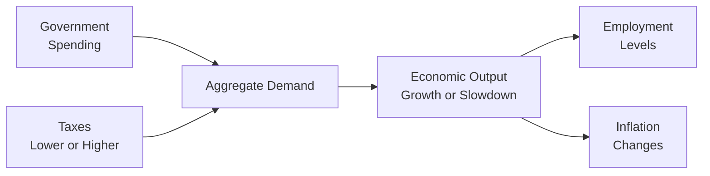

## 3.3 Fiscal Policy

Let’s talk about fiscal policy. It might sound like some dry, technical concept, but it’s basically all about how governments fiddle with their budgets—through spending and taxation—to shape the economy. You know that awesome new school your town just built? Or that big highway expansion you see every morning? Those are real-world examples of how fiscal decisions can affect our everyday lives, whether we realize it or not. In this section, we’ll dive into how this works, why it matters, and some of the big debates around it.

Before we jump right in, let’s do a quick refresher: in Chapter 3 (Economics), we’ve been talking about various macroeconomic forces that influence the health and direction of the economy. Fiscal policy is a major piece of that puzzle. Pair it with monetary policy—the central bank’s domain of interest rates and money supply—and you have two of the most important levers that policymakers use to steer an economy.

Focus: Comparing Fiscal Policy with Monetary Policy  
------------------------------------------------

A quick side-by-side:  
• Fiscal Policy = Government spending + Taxation.  
• Monetary Policy = Central bank setting interest rates, reserve requirements, open market operations, and such.

I remember my first real taste of this comparison back in college when one professor dramatized it like a tag-team wrestling match: fiscal policy was the big government folks who might jump into the ring waving their spending bills and tax reforms, and monetary policy was the quieter, more technical central bankers adjusting interest rates behind the scenes. In reality, both are crucial, but they operate quite differently.

• Fiscal policy is driven by elected officials (e.g., legislators, finance ministers) and can be influenced by partisan politics or broader social goals.  
• Monetary policy is typically executed by a central bank, which, in many countries, is designed to be more independent of the political process.  

Fiscal policy can specifically target certain groups or regions (think funding a job-training program in a high-unemployment area), whereas monetary policy tools generally filter through the entire economy by affecting overall borrowing costs and liquidity.

Roles and Objectives of Fiscal Policy  
-------------------------------------

Fiscal policy aims to:  
• Stabilize the economy (fight recessions or curb overheating).  
• Influence aggregate demand, often to address unemployment or inflation.  
• Pursue social objectives like funding education, healthcare, or infrastructure.  
• Redistribute income (through progressive taxes, social welfare programs, etc.).

Some policymakers focus on the public goods aspect—like building roads, hospitals, and schools—while others lean on fiscal policy as a lever to smooth out the business cycle. When a downturn hits, governments can increase spending or cut taxes to “goose” the economy, hopefully spurring consumer demand and restoring confidence. Conversely, in a booming economy with inflationary pressures, governments might look to scale back spending or raise taxes as a way to cool things off.

Let’s say I grew up in a region where the local government invested heavily in education programs after the financial crisis. While some folks criticized the additional cost to taxpayers, my community saw a ton of new job opportunities pop up a few years later (like teaching jobs, administrative positions, etc.). That’s fiscal policy in motion: expansions in government spending to promote social objectives and economic stability, ideally leading to improved aggregate demand.

The Debate: National Debt and Long-Term Growth  
----------------------------------------------

One of the most heated fiscal policy debates is about the national debt. If you read the news, you’ve probably come across dire headlines about governments drowning in debt. The big question: “How much is too much?” This is often discussed in terms of the debt-to-GDP ratio, which compares the total amount a government owes to the total value of goods and services it creates each year.

• Debt-to-GDP Ratio = (Total Government Debt) ÷ (Gross Domestic Product).

When this ratio grows, some argue that it’s a major red flag: more debt could mean higher future taxes, crowding out private investment, or higher interest rates that stifle growth. For others, debt can be a necessary tool—especially if borrowed funds finance productive investments (think roads, schools, research) that help the economy grow down the road. So maybe it’s not the debt itself that’s the problem, but rather how the funds are used.

Let’s do a quick hypothetical. Suppose Country X doubles its debt to build high-speed rail links between major cities. If the project enables businesses to operate more efficiently and spurs tourism, the economy might grow faster, potentially offsetting the costs. But if the government wastes the borrowed funds on poorly planned projects, you can end up with the same high debt without the added growth—and that can become a burden on future generations.

Tools of Fiscal Policy: Strengths and Weaknesses  
------------------------------------------------

Fiscal policy uses four main sets of tools, each with unique advantages and drawbacks:

1. Government Spending (Discretionary Spending)  
   Governments can choose to build bridges, fund healthcare initiatives, or hire more public servants. Strengths? It’s direct and targeted. Weaknesses? It can be slow to implement (you don’t erect a bridge in two weeks), and politics might muddy the water as different interest groups fight over the budget.

2. Automatic Stabilizers  
   These are programs like unemployment insurance and progressive taxes that increase or decrease automatically based on economic conditions. Picture this: when unemployment rises, more people qualify for benefits without new legislation. This helps stabilize incomes somewhat so consumer demand doesn’t collapse. Strength? They require no additional “decision-making” once set in law. Weakness? They may not be large enough to offset a deep recession fully, and they often rely on existing policies that might not be flexible enough for certain crises.

3. Taxes  
   Adjusting tax rates is another major lever. Cutting taxes leaves more money in consumers’ and businesses’ pockets. This can stimulate investment and consumption. But to be effective, tax changes need to be carefully timed and structured; otherwise, they could increase deficits without significantly boosting demand. Also, raising taxes might cool an overheated economy but risks fomenting political backlash.

4. Government Borrowing  
   Governments borrow by issuing bonds. This can finance extraordinary spending during crises, such as fiscal stimulus during a recession. But ballooning borrowing can push up the national debt and, over time, risk higher interest payments. If the central bank is worried about inflation, interest rates could rise, meaning it costs even more to service the debt.

These tools often come with a tricky “multiplier effect.” In short, when the government spends $1, the total impact on the economy might be more than $1, because that dollar circulates among various parties. Formally:

$$k = \frac{1}{1 - MPC}$$

where k is the multiplier and MPC is the marginal propensity to consume (the fraction of each additional dollar of income that people spend). But, watch out: the multiplier doesn’t always work the same way, especially if the economy is near full capacity or savers choose not to spend.

Expansionary vs. Contractionary Fiscal Policy  
---------------------------------------------

Depending on the situation, government actions should either expand or contract aggregate demand.

• Expansionary Fiscal Policy is the go-to move when growth has slowed or there’s a recession lurking. Policymakers might boost spending programs and lower taxes to inject more money into the economy. The goal is to increase aggregate demand and reduce unemployment.  
• Contractionary Fiscal Policy is intended to slow the economy down. Governments might cut spending, raise taxes, or do both when inflation is climbing too quickly or when they believe the economy needs to cool off.

Below is a simple table to illustrate typical differences:

| Objective                           | Expansionary                                                      | Contractionary                                                      |
|------------------------------------|-------------------------------------------------------------------|---------------------------------------------------------------------|
| Primary Goal                        | Increase aggregate demand                                          | Decrease aggregate demand                                           |
| Government Spending                | Higher                                                             | Lower                                                                |
| Taxes                              | Lower                                                              | Higher                                                               |
| Typical Outcome                     | Reduced unemployment (may risk higher inflation)                   | Tamed inflation (may risk higher unemployment)                      |
| Usual Policy Context                | Recessionary or weak growth environments                           | Overheated or bubble-like economy                                   |

So, if you hear that your local government just announced a big summer “infrastructure blitz,” building highways and fixing up public spaces, that sounds like good old expansionary fiscal policy at work.

Implementation Challenges  
--------------------------

Now, you might wonder: “If fiscal policy can do all these neat things, why doesn’t the government just wave its wand and fix everything?” Well, there are serious hurdles:

• Political Constraints  
  Any changes—like raising taxes on certain groups or choosing one region for new infrastructure—can be unpopular and meet political resistance. Constructing a new budget plan can get bogged down in legislative gridlock, meaning decisions might not be made quickly.

• Time Lags  
  Even if a policy is approved promptly, spending can take time. Infrastructure projects require planning, bidding, and construction. Tax changes might be relatively quicker to announce but can still take months before you see real behavioral change. Meanwhile, the economic context might shift, meaning the policy is too late or too early.

• Uncertain Multipliers  
  Policymakers can guess how effective a certain tax break or infrastructure push will be, but real-world outcomes could surprise. Consumers might save more than anticipated instead of spending, or businesses might invest overseas instead of domestically.

• Crowding Out  
  If the government ramps up borrowing to pay for spending, it could push interest rates higher or soak up capital that could have gone to private projects. The private sector might then pull back on investment, partially offsetting the stimulus.  

• Potential Over-Borrowing  
  Governments may be tempted to keep spending (because it’s popular) even after growth picks up. This can balloon the debt and lead to future dilemmas—like having to slash spending or face high interest payments in better times.

I once chatted with a municipal budget officer who confessed that by the time they actually got rolling on a “stimulus road repair” plan, the national economy had already recovered. That’s a classic time-lag story: the policy was set up to spark growth in a downturn, but it wound up happening too late. Sure, it was still beneficial for the local infrastructure, but the cyclical effect wasn’t all that policymakers had hoped for.

Diagram: Fiscal Policy Flow  
---------------------------

Below is a simplified Mermaid diagram that outlines how government spending and taxation can influence aggregate demand. Notice that government decisions feed into the broader economy through different channels—consumption, investment, and so forth.

Glossary  
--------

• Fiscal Policy: Government decisions on taxation and spending to influence economic activity.  
• National Debt: The total amount of money a government owes to creditors.  
• Debt-to-GDP Ratio: A key metric comparing a country’s total debt to its gross domestic product.  
• Automatic Stabilizers: Programs that automatically adjust to economic conditions (like unemployment insurance).  
• Expansionary Fiscal Policy: Policy measures that boost aggregate demand (more spending or tax cuts).  
• Contractionary Fiscal Policy: Policy measures that reduce aggregate demand (less spending or higher taxes).

References and Suggested Resources  
----------------------------------

• “Principles of Economics” by N. Gregory Mankiw (Cengage Learning)  
• International Monetary Fund (IMF) Publications on Fiscal Policy:  
  https://www.imf.org/en/Publications  
• Congressional Budget Office (CBO) Research on the Effects of Government Spending and Taxation:  
  https://www.cbo.gov/

For more broad discussions on the trade-offs between fiscal and monetary measures, you can also take a look at how monetary policy is covered in central bank reports—just to get that contrasting perspective.  

Regardless of where you stand, fiscal policy is a critical lever. Whether you’re a student, a financial analyst, or just someone who’s curious about how governments work, understanding fiscal policy can help you interpret the headlines, vote in elections with more insight, and anticipate how policy changes might affect businesses, jobs, and the economy’s overall direction.  

## Test Your Knowledge: Fiscal Policy Essentials



### Which of the following is an example of automatic stabilizers in fiscal policy?

- [ ] A newly approved bridge-building project.  
- [x] Unemployment benefits that increase when more people lose their jobs.  
- [ ] Temporary loan programs for small businesses.  
- [ ] A special presidential decree on infrastructure spending.  

> **Explanation:** Automatic stabilizers, such as unemployment benefits, adjust automatically during economic ups and downs without the need for new legislative action.  

### What is the primary difference between fiscal policy and monetary policy?

- [x] Fiscal policy involves government spending and taxation, while monetary policy involves central bank activities such as setting interest rates.  
- [ ] Fiscal policy focuses on export/import regulations, while monetary policy deals with exchange rates.  
- [ ] Fiscal policy is aimed at only raising money for national defense, and monetary policy targets consumer protection.  
- [ ] Fiscal policy is handled by private institutions, while monetary policy is solely guided by public referendums.  

> **Explanation:** Fiscal policy is managed by the government via spending and taxation, whereas monetary policy is handled by central banks through tools such as rate adjustments and open market operations.  

### Which of the following is generally regarded as an expansionary fiscal policy?

- [x] An increase in government spending along with a decrease in tax rates.  
- [ ] A reduction in both government spending and taxes.  
- [ ] A reduction in government spending but an increase in taxes.  
- [ ] A balanced budget with no change in spending or taxes.  

> **Explanation:** Expansionary fiscal policy aims to increase aggregate demand. A common approach is to raise spending and lower taxes simultaneously.  

### A high debt-to-GDP ratio raises concerns about:

- [x] The sustainability of government debt levels.  
- [ ] Easier access to international financial markets.  
- [ ] Lower interest costs.  
- [ ] Elimination of all future tax liabilities.  

> **Explanation:** When debt grows too large relative to GDP, there are concerns about the government’s ability to manage its obligations and potential upward pressure on interest rates.  

### Which of the following best describes the “multiplier effect” of government spending?

- [x] A single dollar of government spending can generate more than one dollar’s worth of economic output.  
- [ ] Government spending has zero net effect on the economy.  
- [x] The effect can vary based on the marginal propensity to consume (MPC).  
- [ ] It reduces the overall demand in the economy by crowding out investment.  

> **Explanation:** Fiscal stimulus can lead to a multiplied effect on overall economic output, depending on how much consumers spend of each additional dollar. Both statements about the dollar’s effect and the MPC are correct.  

### Which of the following is most likely a contractionary fiscal measure?

- [x] Cutting back on infrastructure projects.  
- [ ] Offering more comprehensive unemployment benefits.  
- [ ] Reducing the national sales tax.  
- [ ] Increasing infrastructure spending by 25%.  

> **Explanation:** Reducing government spending is typically a contractionary measure aimed at lowering aggregate demand.  

### What is a common challenge faced by policymakers when implementing fiscal policy?

- [x] Time lags between policy decisions and their actual economic impact.  
- [ ] Lack of any public debate or scrutiny regarding policy measures.  
- [x] Political constraints that delay or water down the proposed policy.  
- [ ] Zero need for legislative approval.  

> **Explanation:** Fiscal policy is often subject to time lags and political considerations, making it difficult to implement quickly and effectively. Both time lags and political constraints are correct.  

### Which of the following might be considered a benefit of expansionary fiscal policy?

- [x] Reduced unemployment during a recession.  
- [ ] Immediate reduction in the debt-to-GDP ratio.  
- [ ] Lower inflation in overheated economic conditions.  
- [ ] Eased legislative approval given universal political support.  

> **Explanation:** Expansionary fiscal measures often help reduce unemployment by increasing aggregate demand, especially during economic downturns.  

### Crowding out refers to:

- [x] A situation where increased government borrowing leads to higher interest rates, reducing private investment.  
- [ ] Lower government borrowing because of private investment.  
- [ ] Decreased advertising budgets in the private sector.  
- [ ] Public anxiety about rising unemployment.  

> **Explanation:** Crowding out occurs when government borrowing raises the cost of capital (interest rates), thereby dissuading private firms from investing.  

### Fiscal policy can be considered “contractionary” if:

- [x] True  
- [ ] False  

> **Explanation:** Yes, if the government raises taxes or cuts spending to dampen aggregate demand, that policy is considered contractionary.  


