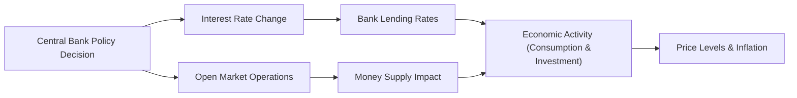

## 3.4 Monetary Policy

So, let’s talk about monetary policy. It’s one of those topics that people sometimes think is super scary—something best left to economists on the nightly news. But once you start seeing how central banks manage interest rates, money supply, and expectations to shape the economy, it becomes really fascinating. I recall way back in college, when I first learned about the power of simply adjusting a short-term interest rate and how it ripples through the entire financial system. It felt like magic. "Wait, you tweak one rate and the economy can speed up or slow down?" But yes, as we’ll see, it’s far more nuanced than that. Anyway, let’s dig in.

### The Objectives and Roles of Central Banks

A central bank is the monetary authority of a country, generally tasked with controlling the money supply, ensuring the stability of the financial system, and sometimes overseeing the banking sector. Depending on the specific nation or economic union, the central bank’s responsibilities might vary, but the typical overarching goals are:

- Price Stability: Most central banks view this as priority number one. Keeping inflation at a stable, predictable level—often around 2% per year in many advanced economies—is believed to support long-term economic growth.  
- Controlling Inflation: Yes, this is linked to price stability. When inflation spirals upward, it can erode purchasing power. I remember traveling abroad a few years ago during a bout of high inflation; I realized the local currency lost value so fast that dinner cost almost double by the end of that year. Crazy times. Central banks strive to prevent these episodes by keeping inflation in check.
- Supporting Economic Growth: Central banks also factor in employment and economic growth. They may set policies that aim to prevent the economy from overheating but also try to avoid recessionary downturns.  
- Financial System Stability: Many central banks have supervisory and regulatory functions. They monitor banks, coordinate responses to crises, and act as lenders of last resort.  

The interplay of these goals can get tricky. Sometimes, focusing heavily on controlling inflation can slow growth, whereas overly focusing on growth can allow inflation to creep up. Balancing these simultaneously is part art, part science, and a whole lot of accountability.

### Tools of Monetary Policy

Central banks have several tools at their disposal to influence interest rates, the money supply, and market expectations. I like to think of these tools as the central bank’s "bag of tricks," though it’s all quite serious business, of course. Let’s highlight the main ones:

#### Open Market Operations (OMO)

Open Market Operations are perhaps the most commonly known instrument, at least in textbooks. It involves buying and selling government securities in the open market.  
- When a central bank buys government bonds from commercial banks, it injects reserves into the banking system, increasing the money supply. This usually causes interest rates to drop (at least in the short run) because banks have more liquidity to lend out.  
- Conversely, when it sells government bonds, it sucks reserves out of the banking system, reducing the money supply and nudging interest rates higher.

This policy lever is typically used daily or weekly to keep the short-term interest rate close to a target rate set by the central bank. For instance, the Federal Reserve in the United States might have a target for the federal funds rate, while other central banks may focus on their own key policy rates.

#### Setting Policy Interest Rates

This one might be the easiest to see. If you read the financial press, you’ll often see headlines like, “The Fed raised rates by 25 basis points.” That’s central bank speak for “We’re adjusting our target interest rate by 0.25%.”  

- A lower policy rate makes borrowing cheaper for banks, which theoretically encourages them to expand lending to businesses and consumers. More lending, more spending, more economic activity—hopefully.  
- A higher policy rate makes borrowing more expensive, which slows down lending and spending, thus cooling off an overheating economy or tamping down inflationary pressures.  

Central banks typically pick a "benchmark" or "overnight" interest rate that influences many other rates in the economy—like on mortgages, car loans, and corporate debt. These changes ripple quickly, albeit not always perfectly, through the entire financial system.

#### Reserve Requirements

Some central banks require commercial banks to keep a certain percentage of their deposits as reserves, either in vault cash or on deposit at the central bank. Adjusting this requirement changes how much banks can lend out.  
- A lower reserve requirement frees up more funds for lending, effectively increasing the money supply and potentially stimulating the economy.  
- A higher reserve requirement tightens credit availability, reduces lending power, and can slow an overheating economy.  

However, banks often hold excess reserves beyond the minimum to manage their liquidity risks. So, changes in reserve requirements may not always have a straightforward effect unless banks are operating close to that minimum. In recent years, many central banks have moved away from using reserve requirement changes as a frequent policy tool. But it still holds a place in the standard toolkit.

#### Forward Guidance

Forward guidance is a relatively newer practice. Rather than just announcing an interest rate decision, central banks also share their outlook on future policy actions or economic trends. They might say something like, “We expect to keep rates low for an extended period” or “We anticipate two more rate hikes this year.”  

This approach influences market expectations about future interest rates. If investors believe rates will stay low for a while, they might borrow more aggressively. Conversely, if a central bank signals it’s ready to raise rates, markets may become more cautious. Forward guidance tries to reduce uncertainty. But it’s also a tricky tightrope—too much guidance, and the bank might lock itself into a path; too little, and markets remain in the dark.

### Monetary Transmission Mechanism

So how do these tools—open market operations, interest rate changes, reserve requirements, and forward guidance—filter through the economy? That’s where the monetary transmission mechanism comes in. It’s basically the process through which a change in monetary policy influences variables like interest rates, investment, consumption, inflation, and more.

A simplified version often looks like this:
- Central bank policy decision → Changes in short-term interest rates → Adjustments in the money supply or credit availability → Influences on bank lending rates → Implications for business investment and consumer spending → Impacts on aggregate demand → Ultimately affects inflation and economic growth.

Below is a quick visualization. Don’t worry if it looks a tad abstract. The idea is simply to see how central banks have multiple pathways to affect inflation, growth, and employment:

Generally, if the central bank wants to stimulate the economy:
- It buys securities, lowers interest rates, or signals a more accommodative stance.
- This leads to easier credit conditions, more borrowing, and higher consumption and investment.
- Over time, inflation may drift higher if the economy runs near or above capacity.

If the central bank wants to cool the economy:
- It sells securities, raises interest rates, or signals a tighter policy stance.
- This tightens credit conditions, reduces borrowing, and tempers consumption and investment.
- Inflationary pressures can ease as the economy cools.

### Impact of Monetary Policy on Key Variables

#### Inflation

Monetary policy targets inflation directly or indirectly. Lower interest rates can stoke demand, pushing prices upward, while higher rates can moderate demand, helping contain inflation. Central banks, especially those with inflation-targeting mandates, focus on expected or forecasted inflation. If inflation is climbing above target, they may act preemptively to raise rates.

#### Interest Rates

Movements in the central bank’s policy rate typically cascade to other market interest rates (e.g., mortgage, corporate bond, and interbank lending rates). But the degree of pass-through can vary, and sometimes broader economic conditions or risk premiums might overshadow a simple policy rate shift.

#### Exchange Rates

Exchange rates are also sensitive to monetary policy. If a central bank raises interest rates, its domestic currency might appreciate because foreign investors seek higher returns in that currency. Conversely, a central bank that is loosening policy will often see its currency depreciate. That’s why some economies explicitly target exchange rates; for instance, smaller open economies may peg their currency to a major currency to stabilize trade relationships.

#### Economic Growth

An expansionary monetary stance typically promotes economic growth in the short to medium term by stimulating spending and investment. A contractionary stance pulls the reins, slowing down growth (but presumably keeping inflation in check). Balancing these outcomes is the ongoing juggling act for central banks worldwide.

### Qualities of Effective Central Banks

A strong central bank tends to exhibit a handful of characteristics essential to effective monetary policy:

- Independence: The ability to set policy free from political pressure. This fosters credibility. Markets trust that the bank will do what’s best for the economy’s long-run health, rather than year-to-year political conveniences.  
- Accountability: Although independent, central banks must still be accountable to the public and government. Releasing statements, regular press conferences, and testimonies to legislative bodies are common means of accountability.  
- Transparency: Publishing minutes, providing forward guidance, and offering articulate explanations of decisions help the public and markets understand the rationale behind policy actions.  
- Credibility: When a central bank says it intends to keep inflation at 2%, the public should believe it. Credible central banks anchor inflation expectations and reduce the risk of extreme inflation or deflation episodes.

### Different Policy Targets

Some central banks have explicit inflation targets. Others concentrate on stabilizing their currency’s exchange rate. Still others might adopt some hybrid approach:

- Inflation Targeting: Many industrialized nations, such as the UK, Canada, and New Zealand, explicitly target a specific inflation rate (often around 2%). The idea is to anchor peoples’ inflation expectations so that wages and prices adjust steadily rather than leap unexpectedly.  
- Exchange Rate Targeting: Smaller, open economies sometimes fix their currency to a more stable or major currency (like the U.S. dollar or the euro) to reduce exchange rate volatility and attract foreign investment. This can bring discipline to monetary policy, but also restricts the central bank’s ability to respond to domestic economic conditions.  

Remember, using the exchange rate as a kind of anchor means giving up some freedom to pursue independent monetary policies. It’s a trade-off: stability in exchange rates vs. the flexibility to react to domestic booms or busts.

### Limitations of Monetary Policy

That said, monetary policy isn’t almighty. Several limitations exist:

- Zero (or Negative) Lower Bound: When short-term interest rates get close to zero, the central bank’s conventional tools to stimulate the economy may lose traction. We can see examples from the 2008 Global Financial Crisis, when major central banks slashed interest rates to near zero. Some even dipped into negative territory.  
- Deflationary Trap: If people anticipate falling prices, they might hoard cash rather than spend or invest. This scenario can become self-reinforcing. The central bank might find it challenging to push inflation expectations back up.  
- Time Lags: Monetary policy doesn’t operate instantly. It typically acts with a lag—often cited as 12 to 18 months—so central banks must anticipate future economic conditions. Over-tightening or over-loosening can result if forecasts prove incorrect.  
- Global Capital Flows: In an increasingly interconnected world, capital can flow across borders swiftly. A central bank’s attempts to raise or lower interest rates might be buffered if global investors react in unexpected ways.  
- Political and External Pressures: Even an "independent" central bank is rarely free from all political influence or external economic shocks. Sometimes it must coordinate, or at least converse, with the government about policy alignment.

### Interaction with Fiscal Policy

Monetary policy is only one side of the coin. Fiscal policy (government spending and taxation) can either reinforce or conflict with monetary efforts. For instance, if the central bank is trying to curb inflation by raising interest rates, but the government is simultaneously ramping up spending with large deficits, it might push the economy in the opposite direction. Timing and coordination matter.

- Complementary Policies: When fiscal and monetary policies align, they can be effective in stabilizing growth and inflation.  
- Conflicts: Sometimes, fiscal stimulus might stoke inflationary pressures just as the central bank tries to cool them. This is a bit like stepping on the gas and brake pedals at the same time. Not recommended unless you want a messy ride!  

From a broader viewpoint, communication between the treasury or finance ministry and the central bank can help optimize outcomes and offer clarity to markets.

### Practical Examples and Case Studies

Let’s talk briefly about a couple of examples:

- The Federal Reserve during the COVID-19 Pandemic: The Fed brought interest rates down close to zero, engaged in large-scale asset purchases (quantitative easing), and provided forward guidance indicating supportive policy until economic conditions improved. It aimed to boost lending and spending amid unprecedented shutdowns.  
- The European Central Bank (ECB) and Negative Rates: The ECB introduced negative deposit facility rates in the mid-2010s to combat persistently low inflation. Banks were essentially charged for holding excess reserves with the ECB, nudging them to lend more to the economy instead.  

These examples underscore how flexible monetary policy had to become in unique crises. They also highlight that not all expansions or contractions in policy have the desired results right away—human behavior isn’t always linear or predictable.

### A Quick Note on the Quantity Theory of Money

You might have come across the simple identity in economics textbooks:


M \times V = P \times Y


Where:  
- \\( M \\) = money supply  
- \\( V \\) = velocity of money (the rate at which money changes hands)  
- \\( P \\) = general price level  
- \\( Y \\) = real output (real GDP)  

In plain language, the total amount of money in an economy times how many times it’s spent should equal how many goods and services are produced times their average price. Early monetarists treated \\( V \\) as relatively constant, implying that an increase in \\( M \\) leads primarily to higher \\( P \\) over time (inflation). Modern views recognize \\( V \\) can fluctuate based on interest rates, technology (like digital payments), and consumer preferences. But the identity at least frames the idea that a central bank’s control over \\( M \\) (the money supply) is closely tied to dynamics of future inflation and economic activity.

### Best Practices and Strategies to Overcome Challenges

- Maintain Clear and Consistent Communication: Minimizing policy surprises helps anchor expectations.  
- Use Multiple Tools, Not Just One: When interest rates hit zero, central banks can try quantitative easing, forward guidance, or other unconventional measures.  
- Coordinate (But Don’t Merge) with Fiscal Policy: Transparency and communication with the government can help avoid working at cross-purposes.  
- Acknowledge Uncertainty: Economic conditions can turn on a dime. Being ready to adapt if assumptions change is key.  

### Glossary

Below are some helpful definitions for quick reference:

- **Central Bank:** The monetary authority of a country, typically responsible for currency issuance, monetary policy, and financial system stability.  
- **Open Market Operations (OMO):** Buying and selling of government securities by the central bank to influence the money supply and interest rates.  
- **Monetary Transmission Mechanism:** The process through which monetary policy decisions affect the economy, including output and inflation.  
- **Inflation Targeting:** A central bank policy of aiming for a specific inflation rate using monetary tools.  
- **Exchange Rate Targeting:** A central bank policy of fixing or managing the value of the domestic currency relative to another currency or basket of currencies.  

### References and Suggested Resources

- Mishkin, Frederic S. “The Economics of Money, Banking, and Financial Markets.” (Pearson)  
- Bank of International Settlements (BIS) Research Papers: https://www.bis.org/  
- Federal Reserve Board Publications: https://www.federalreserve.gov/publications.htm  

This is a big topic, and it can feel overwhelming. But, in my experience, getting comfortable with the basics—understanding the aims of monetary policy, the essential tools, and how the transmission mechanism works—opens the door to a wide appreciation of how modern economies are managed. Perhaps the best way to truly grasp it is to keep an eye on daily news about central banks, read official policy statements, and watch how markets react. Little by little, you’ll start connecting the dots.

-----

## Test Your Knowledge: Monetary Policy Essentials



### Which of the following is a primary goal of a central bank?

- [ ] Maximizing tax revenue
- [ ] Establishing fixed foreign exchange rates with all trading partners
- [ ] Maximizing stock market returns
- [x] Controlling inflation to achieve price stability

> **Explanation:** Central banks typically focus on maintaining price stability (i.e., controlling inflation), among other goals such as supporting economic growth and ensuring financial stability.

### What is the most frequently used tool of monetary policy by many central banks?

- [ ] Reserve requirement changes
- [ ] Tax policy
- [x] Open market operations
- [ ] Trade restrictions

> **Explanation:** Central banks conduct open market operations regularly to manage liquidity in the banking system and maintain their target interest rate.

### How might a central bank encourage economic growth if it fears a recession?

- [x] Lower its policy interest rates
- [ ] Increase its policy interest rates
- [ ] Reduce government spending
- [ ] Implement higher reserve requirements

> **Explanation:** Lower interest rates generally make credit cheaper and can encourage borrowing, investment, and spending, thus potentially stimulating economic growth.

### What is forward guidance in the context of monetary policy?

- [ ] A legally binding contract between central banks
- [ ] A strategy to fix the exchange rate
- [x] Communication of future policy intentions to influence market expectations
- [ ] A method of eliminating foreign currency risk

> **Explanation:** Forward guidance involves signaling future policy moves or outlooks to guide financial markets and influence economic behavior.

### A central bank sells government securities in the open market. What is the immediate expected effect?

- [ ] Reduction in interest rates
- [x] Decrease in the money supply
- [x] Increase in market interest rates
- [ ] Increase in the money supply

> **Explanation:** Selling government securities takes reserves out of the banking system, which reduces the money supply and pushes interest rates up.

### Which of the following best describes the zero lower bound problem?

- [x] Interest rates cannot effectively go below zero (or only slightly below zero), limiting monetary policy’s stimulative power
- [ ] Inflation rates cannot exceed 2%
- [ ] A situation where tax rates cannot be lowered
- [ ] A scenario in which banks refuse to lend despite unlimited liquidity

> **Explanation:** The zero lower bound restricts how much central banks can lower interest rates before they become negative, making conventional policy less effective.

### Which characteristic is vital for a central bank’s credibility and effectiveness?

- [x] Independence from political pressures
- [ ] Acting only when instructed by the executive branch
- [x] Transparency in communication
- [ ] Pegging exchange rates to every major currency

> **Explanation:** Independence and transparency are crucial. Independence allows for unbiased policy decisions, and transparency helps anchor market expectations.

### Which of the following is a potential conflict between monetary and fiscal policy?

- [x] Fiscal expansion (increased government spending) while the central bank tries to raise interest rates to combat inflation
- [ ] Both monetary and fiscal policy working to reduce inflation
- [ ] Central bank setting a higher inflation target in tandem with government spending cuts
- [ ] Government enacting trade agreements consistent with the central bank’s foreign exchange strategy

> **Explanation:** Fiscal expansion can stimulate the economy (and inflation), conflicting with a central bank’s attempt to tighten monetary conditions and contain inflation.

### Which statement about inflation targeting is correct?

- [x] The central bank announces a specific inflation goal and adjusts policy to achieve it
- [ ] Inflation targeting always involves a currency peg
- [ ] It is a fiscal policy tool
- [ ] It only applies to emerging-market economies

> **Explanation:** Under inflation targeting, the central bank publicly sets an inflation rate goal—like 2%—and uses its monetary tools to steer inflation toward that target.

### Monetary policy can influence exchange rates primarily because:

- [x] Changes in interest rates affect the demand for the domestic currency
- [ ] Monetary policy is unrelated to foreign exchange markets
- [ ] Governments typically fix exchange rates alongside inflation-targeting regimes
- [ ] Domestic interest rates have no effect on international capital flows

> **Explanation:** A higher domestic interest rate often attracts foreign capital, boosting demand for that currency and leading to a stronger exchange rate, and vice versa.


