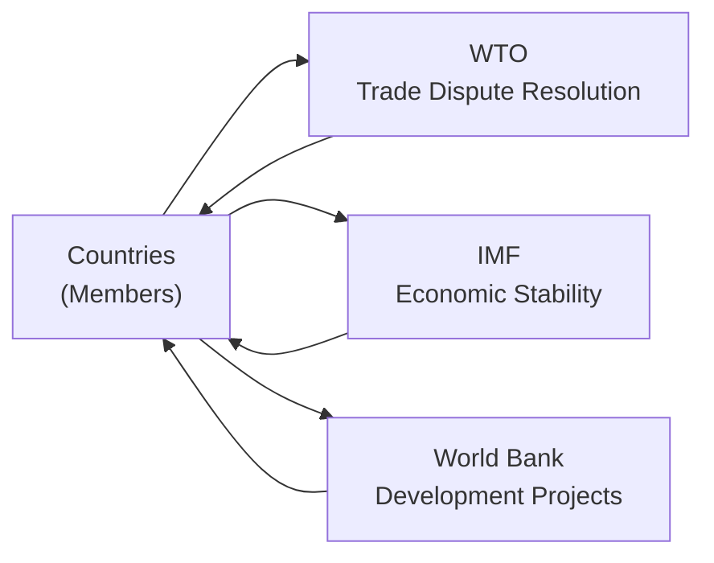
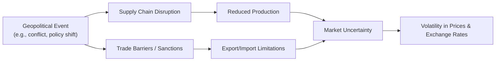

## 3.5 Introduction to Geopolitics

Geopolitics might sound like a hefty term, but—trust me—once you see it in action, it becomes a fascinating lens to examine the world. I remember traveling to a border region between two countries that historically had tense relations, and, wow, you could almost sense how decades of shifting alliances and trade policies had shaped everything from the local economy to the masked resentment in everyday conversations. The interplay of political power, resources, and cultural dynamics was truly something to behold. In this section, we’ll dig into that interplay by defining geopolitics, exploring the concept of geopolitical risk, and seeing how all these complexities shake up markets and investment strategies. We'll also consider the major international organizations that attempt—perhaps bravely—to keep this global train on the rails.

## Defining Geopolitics: Cooperation vs. Competition

So, what exactly is geopolitics? In simple terms, geopolitics focuses on how the geography, economics, history, and sociology of a region shape the power dynamics among nations. Sometimes it helps to think of it as the big chessboard on which countries move their pieces (think alliances, economic agreements, or even military positioning) to protect and advance national interests. 

At its core, geopolitics is about cooperation as much as competition. Nations can join forces to tackle common problems—like climate change, trade disputes, or global pandemics—and sometimes they compete fiercely for resources, influence, and market share.  

• Cooperation often leads to alliances, partnerships, and trade agreements.  
• Competition can involve imposing tariffs, sanctions, or even flexing military might.

When this competition becomes heated, risk levels expand. Financial markets can turn jittery if major geopolitical players threaten each other with economic reprisals or, let’s hope not, any sort of conflict. Then we stand there asking ourselves, “How does this tension trickle down to our portfolios?”  

## Globalization and Interdependence

Globalization is the process by which countries become increasingly interconnected by way of economic, cultural, and technological exchanges. Over the last few decades, this interdependence has grown dramatically—if you look at your smartphone, chances are some components were designed in one country, assembled in another, and then sold worldwide. 

Many of us assume (or used to assume) that globalization would mean a warm-and-fuzzy era of cooperation. In some ways, it has. But the flip side is that the stronger the economic ties, the bigger the potential ripple effect if something goes awry. One example is witnessing how supply chain disruptions in one part of the world—say, a semiconductor factory shutting down—can severely impact car manufacturers in another region hundreds or thousands of miles away.

### Shifting Geopolitical Balances

As countries evolve economically, their influence on the global stage changes. Consider the recent shifts in Asia, Africa, and Latin America, where many economies have been on the rise. This rebalancing of power can create tension as established world powers adjust to up-and-coming powers that demand a bigger say in global trade rules or environmental policy. Sometimes these tensions manifest through trade wars, intellectual property disputes, currency manipulation claims, or even the plain old-fashioned war of words between political figures.  

This constant flux in power balances is precisely why paying attention to geopolitics is crucial for anyone involved in international finance.  

## Roles and Objectives of Major International Organizations

It can feel comforting to know that there are structured organizations trying to keep the peace—or at least reduce friction. A handful of major international bodies play significant roles in maintaining economic stability, facilitating trade, and encouraging development worldwide.

### The World Bank

Founded in the aftermath of World War II, the World Bank’s main goal is to reduce global poverty and support development projects. It provides financing (often low-interest loans or grants) to countries for infrastructure (think roads, bridges, electric grids), education, health care, and other development needs. The World Bank also offers policy advice and technical assistance. 

> In practice, the World Bank’s projects might be something like constructing a new dam that provides clean energy to remote regions. By helping regions grow, these projects in turn open up new investment opportunities in many emerging markets.

### The International Monetary Fund (IMF)

The IMF is all about ensuring the stability of the international monetary system—basically the network of exchange rates and international payments that lets countries transact with each other. If a nation faces a currency crisis or a spiraling debt crisis, the IMF often steps in with financial support, policy guidance, and sometimes broad structural reform requirements. 

For instance, if a country’s currency is collapsing, the IMF might provide a rescue package. That rescue package often comes with conditions like cutting government spending, reducing inflation, or implementing tax reforms. This helps stabilize the nation's economy—and by extension, the global economy—but it can also be controversial if harsh reforms weigh heavily on local populations.

### The World Trade Organization (WTO)

The WTO sets the rules of international trade (importantly, focusing on how nations reduce trade barriers), resolves disputes, and promotes trade liberalization. If Country A believes that Country B is unfairly dumping cheap goods and creating an uneven playing field, they can file a complaint with the WTO. The WTO then investigates, mediates, and issues rulings that member countries agree to follow.

For example, if you’ve ever heard about tariff escalations between countries, it’s often the WTO that tries to step in to keep everything from spiraling out of control. In an ideal world, a stable global trade environment fosters economic growth and reduces uncertainties—though, let’s be real, it doesn’t always look that smooth in practice.

Below is a small diagram that shows how these organizations often interact (very simplistically) with member countries:

Each arrow indicates a two-way relationship: countries are members and also beneficiaries/influencers of these institutions.

## The Concept of Geopolitical Risk

Geopolitical risk includes the various uncertainties that arise from political, military, or diplomatic actions around the world. A sudden change in government, an unpredictable election result, or mounting tensions in a border region can all create market jitters. I remember a time when just a rumor of a major conflict caused commodity prices to spike within hours—oil in particular shot up as investors worried about supply disruptions.

Geopolitical risks can lead to:
- Volatile currency movements  
- Rising commodity prices  
- Shifts in investor sentiment toward “safer” or “riskier” assets  
- Supply-chain uncertainties  

### Political Instability

Regime changes, social unrest, or civil wars can disrupt local economies and scare off foreign capital. Even the possibility of nationalization of industries or expropriation of assets can keep investors on the sidelines.  

### Conflicts and Tensions

Tensions might not always boil over into war, but the threat of conflict can raise insurance costs and curb willingness to invest. Think about airline routes needing to circumvent hostile airspace, or developers pausing billion-dollar projects until tensions ease.

### Policy Uncertainty

Policy changes—like trade tariffs, new taxes, or restrictions on cross-border investments—can pop up quickly and catch businesses by surprise. Investors find it nerve-wracking to commit capital when they can’t predict tomorrow’s regulatory environment.

Check out this simplified illustration of how geopolitical risk can flow through to global markets:

## Common Geopolitical Tools: Sanctions, Tariffs, and Alliances

Countries frequently use a variety of tools—some say “weapons”—to achieve foreign policy objectives that can have significant economic repercussions. And it’s not always about going to war. Here are some of the favorites:

### Sanctions

Sanctions are penalties or trade barriers that one or more countries impose on another. These can range from freezing assets, limiting trade, restricting access to technology, or outright embargoes. The idea is to pressure a nation or group into changing behavior without resorting to direct conflict. However, sanctions can impact not only the targeted nation but also global supply chains—just imagine what happens if a major energy exporter is sanctioned and can’t sell to its usual markets.

### Tariffs

Tariffs are taxes on imported goods—like a barrier to making foreign products more expensive relative to domestic ones. They aim to protect local industries, but can lead other countries to retaliate with tariffs of their own. This escalation often ends up hurting businesses and consumers on both sides. Economists usually argue that excessive tariffs distort trade, reduce efficiency, and can hamper global growth in the long run.

### Alliances

Alliances refer to formal agreements between two or more nations—including trade pacts, military treaties, or economic partnerships. On the bright side, alliances can reduce uncertainty by clarifying who cooperates with whom, producing stable trade flows or combined security efforts that foster investment. On the downside, alliances sometimes create powerful blocs that can challenge other blocs, adding more friction to the international scene.

## Geopolitical Tensions in Investment Decisions and Risk Assessment

Alright, so how does all of this shape the way we invest our money or evaluate risk?  

1. **Asset Allocation:** If a region is embroiled in political instability, many investors scale back their equity or debt holdings there. However, if a region is stable and forging beneficial trade deals, it may attract strong capital flows.  
2. **Risk Premiums:** The interest rate or return required to invest in certain bonds might increase if the issuing country faces high political risk. Nobody wants to buy the bonds of a government likely to default due to regime collapse—so yields go up.  
3. **Diversification:** Geopolitical tensions can encourage global diversification since investing in only one country’s markets can expose you more heavily to that region’s political risks. By spreading investments across geographies, industries, and currencies, you aim to offset potential losses.  
4. **Opportunities Amid Chaos:** Sometimes, major disruptions create surprising opportunities. For instance, if sanctions bar certain nations from selling commodities in typical markets, alternative suppliers might benefit from higher demand. Investors who spot these shifts (carefully and ethically, of course) can capitalize on them.

In my opinion, developing a global mindset becomes almost mandatory for modern investors. It’s less about memorizing every hot-spot around the world and more about adopting a systematic way to incorporate geopolitical scenarios into your risk analysis.

## Conclusion

Geopolitics is this ever-present background hum that can erupt into a cacophony at any moment. As we’ve seen, cooperation and competition among nations shape global trade patterns, influence investment opportunities, and steer economic policies—and it’s largely guided by how countries position themselves in terms of power and resources. Globalization ties us all together in a big tapestry, making it impossible for major events in one region not to impact others.

The leading international organizations—World Bank, IMF, and WTO—each do their best to maintain stability and mediate differences. But the tools countries use, from sanctions to tariffs to alliances, can swiftly compound or reduce tensions. For investors, factoring in geopolitical risk is about understanding how that big chessboard’s moves can influence everything from commodity prices to yield spreads.  

None of us can perfectly forecast these dynamics, but by paying attention, we can at least anticipate possible outcomes. Think about it the next time a major geopolitical headline crosses your news feed—it might be more than just politics; it could be your finances as well.

## Glossary

• Geopolitics: The influence of factors such as geography, economics, and demographics on the politics and relations of nations.  
• Globalization: The increasing interconnection of the world’s economies through trade, investment, technology, and cultural exchange.  
• Geopolitical Risk: Uncertainties arising from political, military, or diplomatic actions affecting global supply chains, trade routes, and market stability.  
• Sanctions: Penalties or trade barriers imposed by one or more countries on another to achieve foreign policy objectives.  
• Alliance: A formal agreement between two or more parties to cooperate for specific purposes, often military or economic in nature.

## References and Suggested Resources

• Tim Marshall, “Prisoners of Geography” (Scribner)  
• Geopolitical risk analyses by Eurasia Group:  
  https://www.eurasiagroup.net/  
• World Bank: https://www.worldbank.org/  
• International Monetary Fund (IMF): https://www.imf.org/  
• World Trade Organization (WTO): https://www.wto.org/  

## Test Your Knowledge: Global Geopolitics and Economics



### Which of the following statements best describes "geopolitics"?  
- [ ] The study of meteorological impacts on trade outcomes.  
- [ ] A term exclusively referring to military alliances.  
- [x] The analysis of how geography, economics, and demographics shape political relations among nations.  
- [ ] A concept solely concerning the political union of neighboring countries.  

> **Explanation:** Geopolitics considers the interplay between geographic, economic, and demographic factors and how they affect power relations and alliances among countries.

### What is the primary role of the IMF in the global economy?  
- [ ] Funding large infrastructure projects around the world.  
- [ ] Mediating trade disputes between major industrial powers.  
- [x] Ensuring the stability of the international monetary system and offering financial support.  
- [ ] Restricting the use of tariffs in international trade.  

> **Explanation:** The IMF’s main function is promoting monetary cooperation and offering financial assistance to countries facing currency or debt crises.

### How might heightened geopolitical risk typically affect investments in a specific region?  
- [x] Investors may require a higher risk premium or reduce exposure.  
- [ ] Investors become more eager to invest without due diligence.  
- [ ] Currency values typically remain unaffected.  
- [ ] Equity prices always rise when geopolitical tensions spike.  

> **Explanation:** When uncertainty grows, investors usually demand higher returns to compensate for the added risk or they reduce exposure to protect themselves.

### Which of the following could be considered an economic impact of a country imposing heavy tariffs on imported goods?  
- [ ] Lower prices for consumers on imported goods.  
- [ ] Immediate increase in foreign direct investment.  
- [x] Potential retaliation from trade partners and higher consumer prices.  
- [ ] Reduction in domestic production costs.  

> **Explanation:** Tariffs generally make imported goods more expensive, leading to potential retaliation and higher prices for consumers.

### Select the correct statements about globalization and geopolitical power balances (choose two):  
- [x] Globalization fosters interdependence among countries.  
- [ ] Globalization exclusively reduces political tensions.  
- [x] Changing economic powers can shift global alliances and trade patterns.  
- [ ] Globalization never affects local supply chains.  

> **Explanation:** While globalization integrates economies, shifting power dynamics can lead to friction, changing alliances, and new trade patterns.

### Which international organization is primarily responsible for providing funding and technical assistance to development projects?  
- [x] The World Bank  
- [ ] The IMF  
- [ ] WTO  
- [ ] NATO  

> **Explanation:** The World Bank’s core mission revolves around providing financial and advisory support to stimulate economic development and reduce poverty worldwide.

### Which of the following is NOT an example of geopolitical risk? (Select two)  
- [x] A minor uptick in consumer demand for smartphones.  
- [ ] Rising policy uncertainty about trade tariffs.  
- [x] An internal glitch in social media user interface design.  
- [ ] Political instability in a major oil-exporting country.  

> **Explanation:** Glitches in a social media platform or slight changes in smartphone demand are not political or military uncertainties. Political instability and policy uncertainty, however, are directly tied to geopolitics.

### Alliances among countries can lead to:  
- [x] Reduced uncertainty due to clarified cooperative relationships.  
- [ ] Automatic decreases in global commodities prices.  
- [ ] Forced merger of all national currencies.  
- [ ] Guaranteed elimination of all trade barriers.  

> **Explanation:** Alliances can create a supportive environment and reduce some risks, but they do not universally eliminate trade barriers, unify currencies, or change commodity prices automatically.

### How might sanctions imposed on a major energy exporter affect global markets?  
- [x] Limit the exporter’s ability to sell oil or gas, leading to potential global price increases.  
- [ ] Have no impact on the exporter’s cash flows or market share.  
- [ ] Automatically result in decreased energy prices.  
- [ ] Guarantee reduced volatility in commodity markets.  

> **Explanation:** Restricting a top producer’s market access often decreases supply, pushing prices higher and creating turbulence in global energy markets.

### True or False: Geographic proximity is the only factor that matters in geopolitics.  
- [ ] True  
- [x] False  

> **Explanation:** Geography is important, but so are economic strength, political objectives, cultural ties, and technological capabilities.


