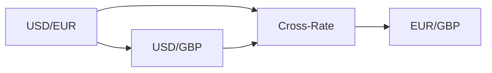
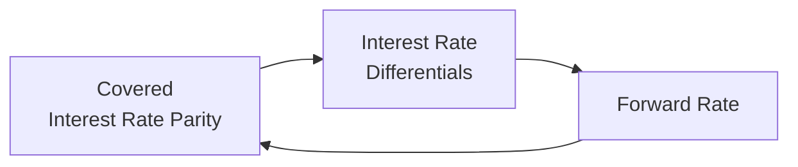

## 3.8 Exchange Rate Calculations

Have you ever found yourself fumbling through airport kiosks, trying to figure out how many Euros you can buy with your US Dollars? I remember traveling to London for the first time with only my US wallet, feeling a bit lost as I checked the exchange window’s rates. Well, that’s the small-scale version of a massive global phenomenon involving all sorts of participants—governments, corporations, hedge funds, tourists—everyone wrestling with exchange rates. This section delves into how exchange rates work, how to calculate them, and why they matter. Beyond the traveler’s perspective, understanding these concepts is crucial for international investing, hedging strategies, and even for analyzing interest rate differentials between countries.

### Why Exchange Rates Matter

Exchange rates serve as the linchpin of international economics. They connect countries’ financial markets, enable global businesses to pay for imports and accept payments from exports, and represent the price at which one currency can be exchanged for another in both the short run (spot transactions) and the future (forward contracts). If you are wondering, “How does this impact my day-to-day or my financial analysis?”—the short answer is that exchange rates color all sorts of global transactions, from everyday purchases abroad to sophisticated currency speculation. They also affect what we pay for imported goods, how companies hedge their foreign sales, and where investors put their money to earn higher returns.

### Understanding Cross-Rates

A cross-rate is basically an exchange rate derived from two other exchange rates that share a common currency. Suppose you have the rate for USD/EUR (US Dollar to Euro) and also a rate for USD/GBP (US Dollar to British Pound). You might want to know how many Euros one Pound is worth, so you’d compute EUR/GBP. Or you might want, yes, you guessed it, the inverse: how many Pounds one Euro can buy (GBP/EUR).

The formula for cross-rates is straightforward:
  
If  
USD/EUR = 1.20,  
USD/GBP = 1.40,  

then

EUR/GBP = (USD/GBP) ÷ (USD/EUR) = 1.40 ÷ 1.20 ≈ 1.1667.

In other words, one Pound is worth about 1.1667 Euros. This approach works similarly for practically any pair of currencies, as long as the currency in the numerator (the top part of your fraction) matches up with the currency in the denominator (the bottom part).

It can be helpful to think of this in a flow perspective. Imagine converting your USD to EUR, then you convert your USD to GBP, and you’re comparing the two. The cross-rate is basically the ratio of how many Euros correspond to one Dollar relative to how many Pounds correspond to one Dollar.

Here’s a quick Merlin-esque visual in Mermaid that might help:

In that diagram, we see how USD/EUR and USD/GBP feed into computing EUR/GBP as the cross-rate. It’s a small puzzle that, once you get the hang of it, opens doors to all sorts of currency calculations.

### Spot Rates, Forward Rates, and Arbitrage

Spot rates and forward rates are intimately connected. The spot rate is basically the going price for immediate (or near-immediate) delivery of a currency. A forward rate is a contractually agreed-upon price for delivery at a future date. Arbitrage arises if you can exploit mismatched prices in different markets or times. In a perfect, frictionless market, these potential mispricings get weeded out quickly.

Sometimes, though, especially if the interest rate in one country is higher than in another, you might get a sense that there’s a “free lunch”—borrowing in the low-interest currency and investing in the high-interest currency. But hold on, the forward rate usually adjusts to offset the interest rate differential. If it didn’t, arbitrageurs would swoop in and profit until equilibrium (no more free lunch) is reestablished.

### Forward Discounts and Premiums

If you peek at currency quotations, you might see a currency’s forward rate trading at a higher or lower level than the spot rate. This difference can be expressed in terms of forward points (a numerical difference) or as a forward discount/premium (a percentage difference). If the forward rate is higher than the spot rate, we often say the base currency is trading at a forward premium. If it is lower, it’s a forward discount.

Maybe you’re thinking, “So why do I care if the Japanese Yen is trading at a forward discount versus the US Dollar?” Well, from a corporate perspective, a multinational might want to hedge future payments or receipts in Yen. Knowing the forward discount or premium tells them how much it’ll cost (or save) to lock in a price now, as opposed to dealing with uncertainty later.

Let’s illustrate with a quick example. Suppose the spot rate for USD/JPY is 100.00. The one-year forward rate is quoted as 99.00. Then the forward discount in percentage terms is:

Forward discount % ≈ [(Forward rate – Spot rate) ÷ Spot rate] × 100  
= [(99.00 – 100.00) ÷ 100.00] × 100 = –1.0%.

So the Yen is trading at about a 1% premium compared to the Dollar (or the Dollar is at a discount relative to the Yen). In direct speak, you get fewer Yen per Dollar in the forward market compared to the spot market.

### Computing Forward Exchange Rates Using Forward Points or Percentages

Forward points are often quoted as additional “pips” or basis points to be added (or subtracted) from the spot rate. Perhaps you see:

Spot rate for EUR/USD: 1.2000  
Forward points for 3 months: +15 pips  

Pips are typically the fourth decimal place in many currency quotations, so +15 pips means +0.0015. So the 3-month forward EUR/USD rate might be 1.2000 + 0.0015 = 1.2015. Sometimes, you’ll see negative values, which indicate a discount. The logic is the same; just add or subtract from the spot rate to get your forward rate.

This can also be expressed as a forward percentage. Suppose the annualized forward premium or discount is 2%. Then for a 3-month (quarter-year) contract, the approximate forward rate would be:

Forward Rate = Spot Rate × [1 ± (annualized forward premium × (3/12))].

The sign (plus or minus) depends on whether it’s a premium or discount.

### Covered Interest Rate Parity

Covered Interest Rate Parity (CIP) is a neat little concept that ensures no risk-free arbitrage opportunities exist when you can hedge currency exposure via forward contracts. Essentially:

F(d/f) = S(d/f) × (1 + i_d) / (1 + i_f),

where  
F(d/f) is the forward rate of domestic (d) per foreign (f) currency,  
S(d/f) is the spot rate,  
i_d is the domestic interest rate,  
i_f is the foreign interest rate.

If for some reason the forward rate drifted away from that ratio, then an arbitrageur could borrow in one currency, convert, invest in the other currency at the higher rate, and lock in a guaranteed profit with a forward contract that reverts them to the original currency. Before long, these activities push exchange rates back to equilibrium. So, you might say CIP is the big policeman in global currency markets. The concept underscores how exchange rates and interest rates are inextricably linked in international finance. Spots, forwards, and relative interest rates all dance in tandem to keep the system balanced—unless something like capital controls or other market frictions get in the way.

Here’s another quick diagram showing the cyclical relationship:

### The Role of Exchange Rate Forecasts

In our world of interconnected financial markets, forecasting exchange rates can be pretty important (and tricky!). Corporations want to hedge their currency exposure. Portfolio managers might try to guess movements for short-term gains or to manage the currency risk of their international investments. Economists track them to gauge competitiveness of exports and imports.

Forecasting methods range from basic fundamental analysis, like checking a country’s interest rates, inflation, trade balances, and GDP growth, to technical analysis, like spotting patterns on currency charts. Some folks use complicated econometric models, while others rely on sentiment or news-based approaches. But be warned, even the best forecasts can be upended by unpredictable events—political changes, sudden shifts in monetary policy, or global crises.

Yet, it’s super valuable for, say, a company that’s selling big in foreign markets to have a handle on possible currency fluctuations. Locking in forward contracts or using options can mitigate risk, providing some stability in revenue despite currency volatility.

### Common Pitfalls and Best Practices

• Misidentifying the Base Currency: Always be careful to keep track of which currency is on top (numerator) and which currency is in the denominator. A good rule of thumb is to name the exchange rate after the currency in the numerator. For instance, EUR/USD means “Euros in terms of US Dollars.”

• Double Conversion Errors: Sometimes when dealing with a chain of conversions, students or practitioners might inadvertently multiply when they should divide. Write down the steps explicitly; don’t rely on memory or guesswork.

• Interest Rate Parity Oversights: CIP holds under ideal assumptions (no capital controls, no transaction costs, perfect capital mobility, etc.). In the real world, these conditions might be relaxed, leading to slight deviations. But big systematic deviations are typically short-lived.

• Forward Price Quotations: Understand whether forward points are quoted as “add to the spot” or “subtract from it.” The direction can flip based on market convention or whether you’re talking about direct or indirect quotes.

• Relying on a Single Forecasting Method: Forecasting is tricky. Combining fundamental, technical, and scenario-based models can give a broader perspective.

### Practical Example: Corporate Hedging Decision

Imagine a US-based company that expects to receive EUR 1 million in six months. The spot rate is 1.20 USD/EUR. They see the six-month forward for USD/EUR quoted at 1.22. Now the question is, do they wait for the spot rate in six months or lock in 1.22 now?

If the company believes the Euro might weaken, locking in the forward rate ensures they get 1.22 million US Dollars. If they are comfortable with the potential fluctuation and suspect the Euro might appreciate, they might choose not to hedge. Such decisions typically also consider interest rates, macro outlook, and risk appetite.

### A Personal Note

I once tried to be “clever” by buying some currency forwards just as I was about to travel overseas for a few months, thinking I’d beat the local exchange kiosk. Turned out, the kiosk fees in that country were cheaper than I expected, and my forward contracted rates were basically the same as if I’d waited—plus I had some fees for the forward contract. My best lesson from that? Even small transactions can go sideways if you don’t do the math carefully. Corporate-level transactions run into these issues on a grand scale, which is why they rely heavily on currency specialists and thorough analysis.

### Glossary

Cross-Rate: An exchange rate determined by using two other exchange rates involving a common third currency.  
Spot Rate: The current market price for exchanging currencies immediately (or nearly so).  
Forward Rate: The agreed-upon exchange rate for currency exchange at a specified future date.  
Forward Discount/Premium: The difference between the forward rate and the spot rate, indicating whether a currency is expected to depreciate (discount) or appreciate (premium).  
Covered Interest Rate Parity (CIP): A theoretical condition stating that exchange rate movements should offset interest rate differentials across countries when you hedge currency exposure with forward contracts.

### References and Suggested Resources

“International Financial Management” by Eun, Cheol S. & Resnick, Bruce G. (McGraw-Hill).  
CFA Institute Research Foundation on Exchange Rate Theories:  
https://www.cfainstitute.org/research/foundation  
Practical examples of currency arbitrage from finance journals and investment guides.  

## Test Your Knowledge: Exchange Rate Calculations and Parity Concepts



### If you know USD/EUR = 1.10 and USD/GBP = 1.32, how do you calculate EUR/GBP?

- [ ] Multiply 1.32 by 1.10
- [ ] Multiply 1.10 by 1.32, then divide by 2
- [x] Divide 1.32 by 1.10
- [ ] Take the inverse of 1.10 and multiply by 1.32

> **Explanation:** EUR/GBP = (USD/GBP) ÷ (USD/EUR) = 1.32 ÷ 1.10 ≈ 1.20.

### Which best describes a forward discount?

- [x] When the forward rate is lower than the spot rate
- [ ] When the forward rate is equal to the spot rate
- [ ] When the base currency is expected to appreciate
- [ ] When spot and forward rates are both at par

> **Explanation:** A forward discount occurs if the forward rate is lower than the current spot rate, indicating the currency may depreciate relative to the other currency.

### Covered Interest Rate Parity requires:

- [x] No capital controls and no transaction costs
- [ ] Central banks to provide fixed exchange rates
- [x] The use of forward contracts for hedging currency risk
- [ ] Permanently high interest rates in the domestic currency

> **Explanation:** CIP is based on the principle that you can hedge away currency risk using forwards in an environment of free capital mobility and negligible transaction costs.

### A currency trading at a forward premium implies:

- [x] The forward rate is higher than the spot rate
- [ ] The currency is always weaker than the base currency
- [ ] Spot rate must be declining
- [ ] Arbitrage is guaranteed

> **Explanation:** If the forward rate for a currency pair is higher than the spot rate, that currency is trading at a forward premium.

### To calculate a 3-month forward rate from a known annualized premium rate, you should:

- [x] Multiply the spot rate by (1 + annualized premium × 3/12)
- [ ] Multiply the spot rate by 3
- [x] Adjust the annualized rate for the fraction of the year
- [ ] Ignore the time fraction since the premium is annual

> **Explanation:** The forward rate is S × [1 + (annualized premium × fraction of the year)]. The fraction for three months is 3/12.

### Suppose the 1-year spot rate for USD/EUR is 1.25, and the 1-year forward rate is 1.30. The forward premium is:

- [x] (1.30 – 1.25) ÷ 1.25
- [ ] 1.30 ÷ 1.25
- [ ] 1.25 ÷ 1.30
- [ ] (1.25 + 1.30) ÷ 1.25

> **Explanation:** Forward premium (decimal form) is (F – S) / S = (1.30 – 1.25) ÷ 1.25 = 0.05 ÷ 1.25 = 4%.

### Which of the following can break covered interest rate parity?

- [x] Capital controls
- [ ] Zero interest rates in both countries
- [x] Excessive transaction costs
- [ ] Identical interest rates in both countries

> **Explanation:** CIP relies on free capital flows and minimal transaction costs. Barriers like capital controls or excessive fees prevent covered interest arbitrage.

### What is a possible advantage of using a forward contract for hedging currency exposure?

- [x] Locking in an exchange rate ahead of time
- [ ] Guaranteeing currency appreciation
- [ ] Eliminating basis risk
- [ ] Predicting future exchange rates perfectly

> **Explanation:** A forward contract can help a firm lock in an exchange rate for a future payment or receipt, reducing uncertainty regarding currency fluctuations.

### If you see a quotation of 1.25 ± 0.0005 for USD/EUR forward points, the forward rate could likely be:

- [x] 1.2495 or 1.2505
- [ ] 1.255 or 1.2050
- [ ] 1.125 or 1.375
- [ ] 1.0000 or 1.2500

> **Explanation:** A ±0.0005 means you either add or subtract 0.0005 from the spot rate of 1.25.

### Forward discount implies that in the future:

- [x] The currency might be cheaper relative to the other currency
- [ ] The currency will definitely strengthen
- [ ] Interest rates in the base currency must be zero
- [ ] The spot price will remain the same

> **Explanation:** A forward discount suggests that the currency may be cheaper in the forward market than the spot market, reflecting expectations of depreciation or interest rate differentials.


