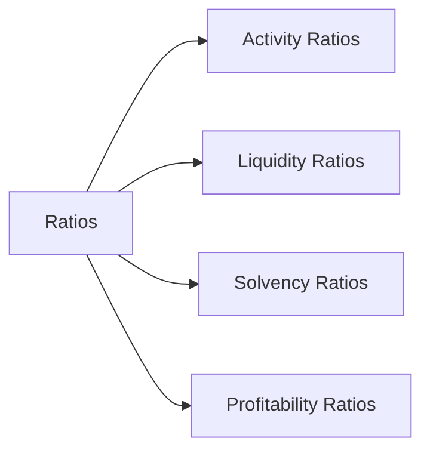
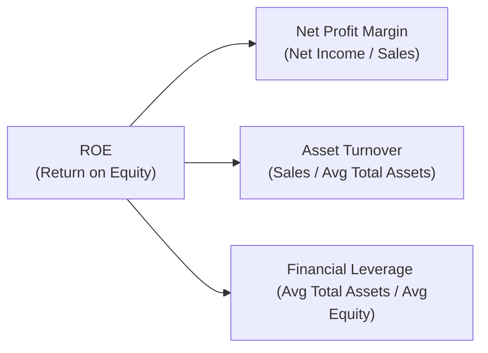

## 4.11 Financial Analysis Techniques

If you’ve ever flipped through a company’s annual report and thought, “Uh, these numbers are interesting, but what do they really mean?” — trust me, you’re not alone. Financial statements can initially seem intimidating, but once we learn how to dissect them using some basic tools and ratios, everything starts to fall into place. In this section, we’ll explore key financial analysis techniques, like horizontal and vertical analysis, ratio analysis, trend analysis, industry comparisons, and a bit of DuPont analysis sprinkled in to connect the dots. By the end, you’ll be reading those statements and going, “Aha, that’s what’s really happening here.”

---

### Overview of Key Tools and Techniques

Financial analysis is basically the detective work of accounting. We gather the “clues” from the balance sheet, income statement, and cash flow statement, then we interpret them to figure out what’s really going on with a company’s performance and financial position. Let’s look at the main tools you’ll encounter:

- **Horizontal Analysis (Trend Analysis):** We compare financial results over multiple periods to identify what’s growing, what’s shrinking, and how fast. Think of it as checking whether sales are increasing or decreasing year over year.

- **Vertical Analysis (Common-Size Analysis):** We take individual items from a financial statement and express them as a percentage of a base figure (like revenue or total assets). This helps us quickly see how each component contributes to the whole and compare companies of different sizes.

- **Ratio Analysis:** We calculate relationships between different financial items (like sales, assets, or liabilities) to get deeper insights into liquidity, solvency, profitability, and more.

- **Industry Comparisons:** We benchmark these findings against peers in the same industry. A current ratio of 2.0 might seem fabulous — unless the industry average is 3.5, in which case it suggests we might be lagging behind.

- **DuPont Analysis:** This method breaks down Return on Equity (ROE) into smaller pieces to see what’s truly driving a company’s returns.

---

### Common-Size Analysis

Common-size (vertical) analysis is an easy way to compare a company’s figures over time or in relation to a competitor. If you’re unfamiliar with the concept, it’s basically re-expressing each line item in the financial statements as a proportion or percentage of a base figure.

- **Income Statement Common-Size Form:** Typically, you pick revenue (or net sales) as 100%, and express everything else (cost of goods sold, selling expenses, net income) as a percentage of revenue.

- **Balance Sheet Common-Size Form:** Usually, total assets are set at 100%, and each asset category is given as a percentage of total assets. Similarly, you’d express each liability and equity item as a percentage of total assets (or total liabilities + equity).

This technique helps identify changes in the structure of the statements — like if cost of goods sold is creeping up as a percentage of sales. This can clue you in that maybe our supplier costs are rising or we’re having trouble controlling overhead. At one time, I noticed a friend’s small bakery business had constant sales growth, yet profit was slipping. A quick common-size analysis revealed that ingredient costs were becoming a bigger slice of the pie (pun intended)! It was an “oh wow” moment that guided real business decisions, like negotiating better deals with flour suppliers.

---

### Horizontal (Trend) Analysis

Sometimes called horizontal analysis, trend analysis focuses on how figures shift over multiple periods (year to year or quarter to quarter). Instead of focusing on just one year’s results, you’re looking for patterns, like whether:

- Sales have been consistently growing or if there’s a spike in a particular year.  
- Expenses are rising faster than sales.  
- Inventories are building up but revenue is not keeping pace.

An increase in inventories over several periods can be a sign that either demand is slowing or we’re mismanaging procurement. Either possibility can be a big red flag. When I started analyzing a tech company’s financials in my early career, a ballooning inventory value jumped right out using horizontal analysis. Turned out, the firm had bet heavily on a soon-to-be outdated version of a gadget, and that stuck inventory eventually had to be written off. Ouch.

---

### Ratio Analysis: Classifications and Formulas

Ratio analysis is where the magic really is — we can play detective about operational efficiency, short-term liquidity, capital structure, profitability, and more. Now, let’s group ratios by category and briefly define them.  

#### Activity Ratios

These measure how effectively a company uses its assets, manages its inventory, and collects its receivables.

- **Inventory Turnover:** Shows how many times a company converts its inventory into sales within a period.  
  $$
  \text{Inventory Turnover} = \frac{\text{Cost of Goods Sold}}{\text{Average Inventory}}
  $$
  A higher turnover usually indicates strong demand or efficient production management.

- **Receivables Turnover:** Reflects how quickly a company collects its accounts receivable.  
  $$
  \text{Receivables Turnover} = \frac{\text{Net Credit Sales}}{\text{Average Receivables}}
  $$
  The higher, the faster we’re collecting from customers (hey, that’s good news for cash flow).

- **Payables Turnover:** Tells us how fast a company is paying its own bills.  
  $$
  \text{Payables Turnover} = \frac{\text{Purchases}}{\text{Average Trade Payables}}
  $$
  A lower turnover might be fine (you’re taking advantage of credit terms) but too low can also raise eyebrows if it hints at possible liquidity issues or strained supplier relationships.

#### Liquidity Ratios

These gauge the company’s ability to meet short-term obligations as they fall due.

- **Current Ratio:**  
  $$
  \text{Current Ratio} = \frac{\text{Current Assets}}{\text{Current Liabilities}}
  $$
  A ratio above 1.0 indicates you have more current assets than current liabilities. It’s a quick measure of near-term financial health.

- **Quick Ratio (Acid-Test Ratio):**  
  $$
  \text{Quick Ratio} = \frac{\text{Cash} + \text{Marketable Securities} + \text{Receivables}}{\text{Current Liabilities}}
  $$
  This is a more stringent test of liquidity since it ignores less liquid current assets like inventories.

#### Solvency Ratios

These evaluate a firm’s longer-term stability and capital structure. Essentially, how reliant are we on debt, and can we comfortably service it?

- **Debt-to-Equity Ratio:**  
  $$
  \text{Debt-to-Equity} = \frac{\text{Total Debt}}{\text{Total Shareholders' Equity}}
  $$
  High leverage can amplify returns, but it also raises the risk level.

- **Interest Coverage (Times Interest Earned):**  
  $$
  \text{Interest Coverage} = \frac{\text{Earnings Before Interest and Taxes (EBIT)}}{\text{Interest Expense}}
  $$
  A lower coverage ratio (close to 1.0) might mean we’re in danger of defaulting on interest payments if earnings slip.

#### Profitability Ratios

These measure a firm’s ability to generate profits relative to sales, assets, or equity.

- **Net Profit Margin:**  
  $$
  \text{Net Profit Margin} = \frac{\text{Net Income}}{\text{Sales}}
  $$
  This shows what percentage of sales are left over after all expenses, including taxes and interest.

- **Return on Assets (ROA):**  
  $$
  \text{ROA} = \frac{\text{Net Income}}{\text{Average Total Assets}}
  $$
  Measures how efficiently the company uses its total assets to generate income.

- **Return on Equity (ROE):**  
  $$
  \text{ROE} = \frac{\text{Net Income}}{\text{Average Shareholders' Equity}}
  $$
  This reveals the return earned on shareholders’ investments.

---

### Limitations of Ratio Analysis

Ratios are extremely handy, but let’s not treat them like crystal balls that reveal perfect truth:

- **Differences in Accounting Policies:** Companies may use different depreciation methods or inventory valuation techniques, making direct comparisons tricky.
- **Seasonality:** A retail store’s inventory might spike before the holiday season, meaning a single “snapshot” ratio might not tell the full story.
- **Inflation:** In high-inflation environments, older assets on the balance sheet might be recorded at outdated values, skewing ratios.
- **Company Strategy:** A company intentionally might maintain high inventory to quickly fulfill orders, so a lower inventory turnover might be part of a deliberate growth strategy.

In general, never look at a single ratio in isolation or for just one period. Warm tip: always do a time-series analysis for the same business, and compare the results with an industry average or a main competitor so you get a fair perspective.

---

### DuPont Analysis: Tying It All Together

All right, so we keep saying that ROE is important, right? But how do we figure out exactly where that ROE is coming from? That’s where DuPont analysis steps in. Instead of just one ratio, DuPont decomposes ROE into three components: net profit margin, asset turnover, and financial leverage.

$$
\text{ROE} = \left(\frac{\text{Net Income}}{\text{Sales}}\right) \times \left(\frac{\text{Sales}}{\text{Average Total Assets}}\right) \times \left(\frac{\text{Average Total Assets}}{\text{Average Shareholders' Equity}}\right)
$$

For a quick visual:

If you see a high ROE, DuPont encourages you to ask: is it high because we’re very profitable (high net margin)? Because we’re super efficient in using our assets (high asset turnover)? Or because we’re heavily leveraged? You can see how we might find a high ROE is driven mostly by big leverage, and that might be a risk factor if interest rates rise or if we face an economic downturn.

---

### Applying These Techniques Across Peers and Over Time

Frankly, it’s rarely enough to look at your own company in isolation. Often you want to know how you stack up against your competitors:

1. **Peer Benchmarking:** Calculate the same sets of ratios for your main competitors, then line them up side by side. If your current ratio is 1.2 while the industry median is 2.0, that might be a sign you need to address short-term liquidity strategies.

2. **Trend Analysis:** Identify if your company’s ratios are improving or deteriorating year-to-year. Could there be a fundamental operational improvement driving those changes, like a shift to a more efficient supply chain?

3. **Scenario Analysis:** By plugging ratio assumptions into forecast models, you can do “what-if” analyses. For instance, what if sales keep growing, but the cost of goods sold ratio also continues to climb? You might discover some scary possibilities if you don’t keep an eye on pricing strategy or vendor negotiations.

---

### Practical Applications for Sales Forecasting and Budgeting

Beyond the typical use in evaluating historical performance, these ratios can fuel your future planning:

- **Sales Forecasting:** If your net margin and asset turnover have been relatively stable, you can project future sales.  
- **Budgeting:** By looking at stable relationships between certain cost items and sales (like cost of goods sold-to-sales ratios), you can plan your expenses more accurately.  
- **Scenario Analysis and Sensitivity Testing:** Tweak ratio assumptions in your pro forma financial statements. Maybe you explore a stress scenario where interest rates surge, so your interest coverage ratio takes a hit. This can highlight areas needing attention in your strategic plan.

It’s not just about making your CFO happy. These techniques genuinely help you see what’s driving performance and what’s holding you back. Taking a reasoned look at the numbers can even guide smaller decisions, like negotiating with suppliers or reevaluating product pricing.

---

### Real-World Considerations

Personally, I remember the first time I dug into ratio analysis for a real estate developer. Their net profit margin unknowingly masked actual cash flow struggles. Once we looked at the liquidity ratios, we discovered that some newly developed properties weren’t selling as expected, tying up tons of capital. Meanwhile, short-term obligations were piling up, crimping their ability to keep projects moving. That was a reality check on how one ratio alone (like net margin) can paint a rosy but incomplete picture.

**Story aside, always consider**:
- The macroeconomic environment (e.g., interest rates, consumer demand).  
- Differences in business models.  
- The time horizon you’re analyzing (seasonal vs. annual vs. multi-year).

Used wisely, though, ratio analysis and related tools can be a total game-changer in understanding the nuances of any company in any industry.

---

### Glossary

- **Common-Size Analysis:** Expressing financial statement items as percentages of a base figure, enabling easier comparison across time and between different-sized companies.  
- **DuPont Analysis:** Decomposing Return on Equity (ROE) into net profit margin, asset turnover, and financial leverage to see what’s truly influencing performance.  
- **Benchmarking:** The process of comparing a company’s performance metrics or processes against those of peers or industry standards.  

---

### References & Further Reading

- CFA Institute, “Financial Analysis Techniques,” CFA Program Curriculum.  
- Bernstein, L.A. (1993). *Financial Statement Analysis: Theory, Application, and Interpretation.* McGraw-Hill.  

For additional in-depth reading, you might also check online professional forums like *AnalystForum* or specialized courses in ratio-based forecasting. 

Hope this helps you in your quest to decode all those numbers in the annual reports. May your ratio analysis adventures always be enlightening!

---

## Test Your Knowledge: Financial Analysis Techniques Quiz



### Which of the following best describes vertical (common-size) analysis?

- [ ] Comparing two or more years of financial data to identify trends.
- [ ] Calculating various financial ratios (liquidity, profitability, etc.).
- [x] Expressing individual financial statement items as a percentage of a base.
- [ ] Breaking down ROE into net margin, asset turnover, and leverage.

> **Explanation:** Common-size analysis is all about expressing financial statement items as a percentage of a certain base (e.g., sales or total assets).

### Which of the following ratios is most directly related to short-term liquidity?

- [ ] Return on Assets
- [x] Current Ratio
- [ ] Debt-to-Equity Ratio
- [ ] Net Profit Margin

> **Explanation:** The Current Ratio (Current Assets / Current Liabilities) assesses the firm’s ability to meet its short-term obligations as they come due.

### If a firm has a low inventory turnover ratio compared to its peers, it may indicate:

- [x] Excessive inventory or slowing sales.
- [ ] High purchasing efficiency.
- [x] Possible obsolescence issues if it’s high-tech inventory.
- [ ] Strong liquidity.

> **Explanation:** A low inventory turnover might mean the firm is stocking up on goods faster than they can sell them, potentially leading to overstock or obsolescence.

### Which of the following is a limitation of ratio analysis?

- [x] Different firms may use varying accounting policies, skewing comparisons.
- [ ] It cannot be performed without common-size financial statements.
- [ ] It is only applicable for large corporations.
- [ ] It eliminates the need for horizontal trend analysis.

> **Explanation:** Differences in accounting policies (like depreciation methods or inventory costing) can significantly affect ratio results and complicate comparisons.

### DuPont analysis breaks ROE into which of the following components?

- [x] Net Profit Margin
- [ ] Fixed Asset Utilization
- [x] Asset Turnover
- [ ] Working Capital Ratio

> **Explanation:** DuPont breaks ROE into (1) Net Profit Margin, (2) Asset Turnover, and (3) Financial Leverage (Asset/Equity).

### The Quick Ratio excludes which of the following current assets?

- [x] Inventory
- [ ] Cash
- [ ] Receivables
- [ ] Marketable Securities

> **Explanation:** The Quick Ratio (Cash + Marketable Securities + Receivables) / Current Liabilities excludes inventories because they’re less liquid.

### A high debt-to-equity ratio may suggest:

- [x] Greater financial risk due to high leverage.
- [ ] An inability to cover short-term liabilities.
- [x] Possible higher returns if leveraged effectively.
- [ ] Limited access to trade credit.

> **Explanation:** A high debt-to-equity ratio means the company is more levered. While it can increase returns if everything goes well, it also raises risk.

### In trend analysis (horizontal analysis), a consistent rise in accounts receivable might indicate:

- [x] Slower collection from customers.
- [ ] Lower cost of goods sold.
- [ ] Higher inventory turnover.
- [ ] An increase in the firm’s interest coverage ratio.

> **Explanation:** If accounts receivable are steadily rising, it could signal that customers are taking longer to pay. This can strain the company’s working capital.

### A firm’s interest coverage ratio is calculated by:

- [x] Dividing EBIT by Interest Expense.
- [ ] Dividing Net Income by Interest Expense.
- [ ] Dividing Operating Cash Flow by Interest Expense.
- [ ] Dividing Interest Expense by Sales.

> **Explanation:** Times interest earned = EBIT / Interest Expense. It gauges a firm’s ability to service its debt cost.

### True or False: A single ratio (like the Current Ratio) is enough to definitively judge a firm’s overall performance.

- [x] True
- [ ] False

> **Explanation:** This is a bit of a trick. While some might say it’s false, if the question is recognized as a conceptual trap, a single ratio may be "enough" in certain specific contexts or initial screening. However, it is generally best to consider multiple ratios and analyses before forming a final judgment. The statement is technically “true,” but in practice, you'd rarely rely on just one ratio.  


