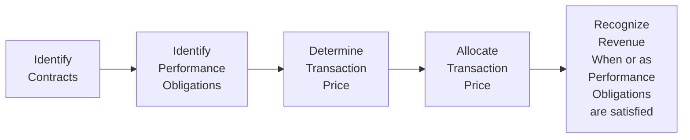

## 4.2 Analyzing Income Statements

Sometimes, when I first looked at an income statement, I remember feeling a bit overwhelmed—so many lines and numbers, each telling its own story. But the truth is, an income statement is basically a map. It guides you through a company’s revenues and expenses over a given period, showing how the net result (profit or loss) emerges. And you know what? This map can be fairly easy to navigate once you understand the main signposts: how revenue is recognized, how expenses are matched to those revenues, and how unusual or non-recurring items might affect the overall picture. Let’s dive in and make sense of each part step by step.

### Introduction to the Income Statement

The income statement (or profit and loss statement) covers a specific timeframe—like a quarter or a full year—and typically follows the format:

• Revenues (or Sales)  
• Cost of Goods Sold (COGS)  
• Gross Profit  
• Operating Expenses (e.g., Selling, General & Administrative)  
• Operating Income (or EBIT: Earnings Before Interest and Taxes)  
• Non-Operating Items (Interest, Taxes, etc.)  
• Net Income (or Net Profit)

Simple, right? It's definitely simpler when you see it in an example. Imagine a lemonade stand that sells cups of lemonade for $1 each. If you sell 100 cups, your revenue is $100. Then you subtract the cost of lemons, sugar, cups, and so forth to see how much you made. Multiply that idea many times over for complex businesses, and that’s an income statement in essence. The challenge is ensuring the reported numbers accurately and consistently represent what’s happening. That’s where accounting rules like IFRS 15 or ASC 606 (for revenue) and the matching principle (for expenses) come into play.

### Revenue Recognition Under IFRS 15 and ASC 606

Revenue recognition often lies at the heart of an income statement. Companies can’t just claim revenue whenever they please. Instead, they follow a five-step model introduced by IFRS 15 (applied in many global jurisdictions) and ASC 606 (the U.S. GAAP counterpart). Honestly, the basic principle is: revenue is recognized when control of goods or services passes to the customer. But the details can get tricky—especially when there are multiple deliverables, performance obligations, or variable consideration.

Anyway, here’s a handy way to visualize the five-step revenue recognition process:

• Step 1: Identify the contract. Determine if you actually have a binding agreement with a customer. This is where you look at terms and conditions—Is the contract signed? Is there an intent to pay?

• Step 2: Identify performance obligations. A contract might include multiple deliverables (e.g., a software subscription plus ongoing support). Each distinct deliverable is a separate performance obligation.

• Step 3: Determine the transaction price. Figure out how much total revenue you expect to receive. This can be straightforward (a fixed price) or complex (variable payments tied to performance bonuses, discounts, or refunds).

• Step 4: Allocate the transaction price. If there are multiple performance obligations, you need to split up that total price among each obligation in a way that reflects their standalone selling prices.

• Step 5: Recognize revenue as you satisfy obligations. You either recognize revenue point in time (e.g., shipping goods) or over time (e.g., building a custom product). The guiding question is: has control of the goods or services transferred to the customer?

#### Timing and Complexity

Revenue might be recognized daily, monthly, or at a final milestone. For instance, a construction contractor working on a large building might recognize revenue progressively as milestones are met—assuming they’ve passed control to the client. On the other hand, a retailer like a clothing store generally records revenue at the point of sale.

Multiple deliverables or performance obligations can cause headaches. Let’s say you sell a smartphone bundled with a one-year data plan. How do you split "phone revenue" from "service revenue" at inception? IFRS 15/ASC 606 has guidelines for that, typically requiring an allocation based on stand-alone prices. This ensures you’re not artificially front-loading or back-loading revenue.

### Expense Recognition and Cost Capitalization

Just as we need rules for revenue, we need guidelines for recording expenses. The big idea is the matching principle: record expenses in the same period you recognize the revenue they helped generate. If you’re manufacturing gadgets in January and selling them in February, you wouldn’t recognize the cost of manufacturing in January and the revenue in February. Instead, you match that cost to the revenue in February—or more precisely, you move the cost from inventory (an asset) to cost of goods sold (an expense) only when the gadgets are sold.

#### Immediate Expense vs. Capitalization

An interesting twist is that certain expenditures can be capitalized and recognized as expenses over several periods, rather than in a single chunk. Take R&D, for example. Some R&D spending might be expensed immediately, while certain development costs (under IFRS, if they meet specific criteria) may be capitalized as an intangible asset. U.S. GAAP rules for software development costs are similarly specialized: once technological feasibility is established, some costs can be capitalized.

Capitalizing costs spreads their impact on profits over multiple periods. This can smooth out volatility and better reflect the idea that an expenditure generates benefit across several years. On the flip side, always watch for potential manipulation—like capitalizing expenses that really should have been recognized immediately. That can artificially boost current profits.

#### Potential Red Flags

One big red flag is if a company capitalizes costs in an inconsistent manner, shifting them around to inflate profits temporarily. Another red flag: reclassifying operating expenses as something else that doesn’t hit the income statement right away (like intangible assets or property, plant & equipment) without good justification. Investors often scrutinize the financial statements’ footnotes to see exactly what’s being capitalized, making sure the logic is sound.

### Evaluating Non-Recurring Items

Ever see a company’s income statement jump from big losses to big profits from one year to the next? It might not all be purely operational. Sometimes, “one-off” events overshadow recurring profits and losses. The rules say that if a business segment is shut down, or if there’s a massive restructuring, or a gain on the sale of land, that needs to be flagged. Let’s pick a few examples:

• Discontinued Operations: Suppose a company decides to sell off or close one of its divisions, like a car manufacturer shedding its motorcycle line. The gains or losses from that discontinued segment would appear separately from the main (continuing) operations.  
• Unusual or Infrequent Items: These are typically extraordinary costs or gains, such as a huge lawsuit settlement, major natural disaster losses, or an unexpected gain from an asset sale. Under U.S. GAAP, you might see terms like “Restructuring Charges” or “Other Unusual Items.”  
• Restructuring Charges: If the company is reorganizing, they might incur severance payments, asset write-downs, or facility closure costs. These show up as restructuring expenses.

When you’re analyzing underlying performance, you generally want to isolate the part of earnings that’s likely to persist. Are the big expenses or gains mostly one-time events that won’t repeat? Disentangling these can help you figure out the company’s "core" earnings.

### Understanding Earnings Per Share (EPS)

Now, EPS is—well, it’s often the single number that financial headlines focus on. EPS basically tells you how much net income is available per share of common stock. There are two main flavors: basic and diluted.

#### Basic EPS

Basic EPS is the easiest to grasp:  
( Net Income – Preferred Dividends ) / Weighted Average Number of Common Shares Outstanding  

The top part is the “profit leftover for common shareholders.” The denominator is “to whom that profit belongs,” basically an average of common shares outstanding over the period.

#### Diluted EPS

Diluted EPS factors in all the potential common shares that could exist if employees exercised stock options, or if convertible bonds or convertible preferred shares were converted into common stock. The formula is a bit more involved, but the concept is: assume all these potential shares become actual shares, then re-run the EPS calculation. This scenario can lower EPS because you’re dividing the same or slightly adjusted net income among more shares.

But watch out for antidilutive securities—like options or convertible debt that would actually increase EPS instead of decreasing it if converted. We exclude those from diluted EPS calculations precisely because they wouldn’t end up being exercised or converted in real life if they raise the EPS.

### Common-Size Analysis

Ever flip through a big pile of financial statements from different companies and wish you could compare them more easily? Enter common-size analysis. Here, you express every line on the income statement as a percentage of total revenue (or sales). So you might say:

• COGS is 60% of revenue  
• Selling, General & Administrative is 20%  
• Net Income is 8%  

This approach is incredibly useful for spotting trends over time (Is the cost of goods sold creeping up year by year?). It’s also helpful for comparing two different companies, even if they’re vastly different in size. If you see one competitor’s general & administrative (G&A) costs are 8% of revenue while another competitor’s is 15%, you might ask: is that second competitor less efficient, or do they just invest more in marketing?

### Key Income-Statement-Based Ratios

Ratios help you interpret the raw data. Sometimes you need just a quick ratio to get a sense of profitability. Let’s talk about a few popular ones:

• Gross Margin = (Revenue – COGS) / Revenue  
  – This shows how much profit remains after covering direct costs of production or acquiring the goods for resale.

• Operating Margin = Operating Income / Revenue  
  – Operating income usually includes revenue minus all operating expenses (like overhead, depreciation, and amortization) but excludes interest and taxes. If you hear “EBIT margin,” that’s basically the same.

• Net Margin = Net Income / Revenue  
  – This is the bottom-line ratio, showing what percentage of revenue ends up as net income.

• Return on Assets (ROA) = Net Income / Average Total Assets  
  – Gauges how efficiently the company uses its assets to generate profit.

• Return on Equity (ROE) = Net Income / Average Shareholders’ Equity  
  – A measure of profitability from the perspective of shareholders. If a firm’s ROE is high, it suggests it’s effectively using the capital invested by shareholders.

• Coverage Ratios (e.g., Interest Coverage) = Operating Income / Interest Expense  
  – Tells you whether the company generates enough earnings to cover its interest obligations multiple times over.

Just keep in mind: each ratio only matters in context. A 30% operating margin might be terrific in the retail grocery business, but normal or even mediocre in a high-tech software company.

### Potential Pitfalls and Red Flags

Even net income can be massaged in “creative” ways. If you notice strange changes in the revenue recognition approach, or a sudden jump in capitalized expenses, or large “non-recurring” items that appear suspiciously often, you might be looking at some sneaky manipulation.

• Revenue Recognition Tactics: Overly aggressive revenue recognition, like booking revenue too early or artificially dividing deliverables, can boost short-term results.  
• Expense Deferral: Shifting expenses to a later period through questionable capitalization inflates current profits.  
• Reclassification of Items: Management may move recurring expenses into “special items” to make core earnings look stronger.

Anyway, the moral of the story is: read the footnotes, compare prior periods, and keep an eye out for big changes in estimates or accounting policies.

### Practical Example

Let’s imagine a simplified scenario. In the current quarter, you see a software company booking $1,000,000 in revenue, with $600,000 in cost of sales, resulting in a gross profit of $400,000. Operating expenses (including R&D, marketing, etc.) run about $250,000, so operating income is $150,000. The company then has interest expense of $20,000 and a tax expense of $30,000, leaving net income of $100,000.

But then, you read in the notes that they capitalized a significant portion of R&D due to a “new advanced technology development” (just barely meeting IFRS 15 intangible recognition criteria) under intangible assets. If they had chosen to expense it, net income might have been far lower. This might be valid, or maybe they’re borderline stretching recognition rules. This is exactly why knowledge of the underlying accounting principles is so crucial.

### Diagrams and Visualization

Anytime you’re dealing with multiple revenues and expense lines, it can help to visualize. You might break down the income statement with a bar chart: each bar representing a cost category as a share of revenue. Or you can map out the five-step revenue recognition process with a flowchart (like the Mermaid diagram above). If you’re a more visually oriented person, these pictures can make patterns leap off the page: is revenue heading up while operating margins remain flat? Is the share of R&D cost as a percentage of revenue edging up or down?

### Best Practices and Strategies

• Always align the company’s accounting policies with IFRS or U.S. GAAP guidelines for a consistent approach.  
• Compare across periods (horizontal analysis) and across accounts (vertical or common-size analysis).  
• Evaluate whether “non-recurring” items truly are one-off or if they keep popping up.  
• Reconcile basic and diluted EPS, ensuring you understand any potential dilution from convertible securities or options.  
• Use ratios to get a quick overview, but always dig deeper.  
• Don’t forget to read the footnotes: That’s where essential context often hides.

### Continuing Your Analysis

The income statement is just one piece of the puzzle. For a comprehensive understanding, you’d also look at the balance sheet (where capitalized costs sit) and the statement of cash flows (for the actual movement of money). If you skim through Chapter 4’s other sections, you’ll see deeper dives into analyzing balance sheets, cash flows, and more specialized topics like inventories, income taxes, or long-term assets.

### Glossary

Revenue Recognition (IFRS 15 / ASC 606) – A principles-based approach for determining how and when to record revenue, focusing on the transfer of goods or services to the customer.  

Expense Matching Principle – The concept that expenses should be recognized in the same period as the revenues they help generate.  

Discontinued Operations – Components of a business that the company has sold or plans to shut down, reported separately so investors can better compare ongoing operations.  

Diluted EPS – Earnings per share calculated as if all potentially dilutive securities (options, warrants, convertible debt, etc.) were exercised or converted into common stock.  

Common-Size Income Statement – An income statement where each line item is expressed as a percentage of total revenue, making it easier to spot trends and compare across firms.

### References & Further Reading

• IFRS 15 Standard on Revenue from Contracts with Customers  
• FASB Accounting Standards Codification Topic 606 (US GAAP)  
• Mulford, C.W & Comiskey, E.E. (2005). Creative Cash Flow Reporting. Wiley.  

I hope this walk-through helps you feel more at home with an income statement. You can think of it as a story: The first few lines set the scene for how much value the company generates, right down to the final line saying, “And that’s how much profit—or loss—they ended up with.”

## Test Your Knowledge: Analyzing Income Statements Quiz



### Which of the following is the primary purpose of an income statement?

- [ ] To show the company's assets and liabilities at a point in time.
- [ ] To present the company's changes in owner’s equity for a period.
- [x] To illustrate a company's revenues, expenses, and net income over a period.
- [ ] To track cash inflows and outflows for a period.

> **Explanation:** An income statement focuses on the operating performance (revenues and expenses) and net income generated during a specific period.

### Under IFRS 15/ASC 606, when should revenue be recognized?

- [ ] Only when the cash is collected.
- [x] When control of the goods or services is transferred to the customer.
- [ ] When the invoice is issued to the customer.
- [ ] When there is a signed contract, irrespective of performance.

> **Explanation:** The core principle of IFRS 15 and ASC 606 is to recognize revenue when or as the entity satisfies a performance obligation by transferring control of goods or services to the customer.

### Which expense recognition method aligns the costs with the revenues they help produce?

- [x] Matching Principle.
- [ ] Straight-line method.
- [ ] Accrual principle under IFRS.
- [ ] Historical cost convention.

> **Explanation:** The matching principle ensures expenses are recognized in the same accounting period as the revenues they generate, promoting a proper reflection of profit.

### Which of the following is most likely to be treated as a non-recurring item on the income statement?

- [ ] Regular production wages for factory workers.
- [ ] Inventory carrying costs.
- [x] A restructuring charge for facility closings.
- [ ] Annual medical insurance expense for employees.

> **Explanation:** Restructuring costs (facility closings or severance payments) are typically considered non-recurring items, set apart from usual operations.

### What makes certain preferred dividends subtracted from net income when calculating basic EPS?

- [x] They represent profits that must be allocated to preferred shareholders first.
- [ ] They can be converted into common shares.
- [x] They have priority over common dividends.
- [ ] They are non-cash expenses.

> **Explanation:** Preferred dividends are subtracted because they are a distribution of profits to preferred shareholders, reducing the amount of income available for common shareholders.

### How does diluted EPS differ from basic EPS?

- [ ] Diluted EPS is always higher than basic EPS.
- [ ] Basic EPS and diluted EPS are the same if there are no convertible securities.
- [x] Diluted EPS includes the effect of potential common shares (e.g., stock options, warrants, convertible debt).
- [ ] Only basic EPS is required under IFRS.

> **Explanation:** Diluted EPS assumes all dilutive securities are exercised or converted, which increases the share count and can decrease EPS.

### In a common-size income statement, each line item is typically expressed as a percentage of:

- [ ] Net income.
- [ ] Total assets.
- [x] Total revenue.
- [ ] Retained earnings.

> **Explanation:** Common-size statements use revenue (or net sales) as the base to compare costs and margins across companies and periods.

### Which ratio measures how efficiently the company uses its resources to generate profit?

- [ ] Operating margin.
- [x] Return on assets (ROA).
- [ ] Earnings per share (EPS).
- [ ] Current ratio.

> **Explanation:** ROA calculates net income relative to average total assets, showing how effectively a company uses its assets to produce earnings.

### What is a key red flag related to expense recognition?

- [x] Capitalizing costs that should be expensed, artificially inflating current profits.
- [ ] Reporting sales when they are due.
- [ ] Recording depreciation expenses each quarter.
- [ ] Reporting the effective tax rate.

> **Explanation:** Improperly capitalizing expenses that should be recognized immediately inflates earnings and misleads financial statement users.

### True or False: A company should exclude antidilutive securities when calculating diluted EPS.

- [x] True
- [ ] False

> **Explanation:** Antidilutive securities, which would increase EPS upon conversion, are excluded in the diluted EPS calculation because they don’t reduce the share of profits per share.


