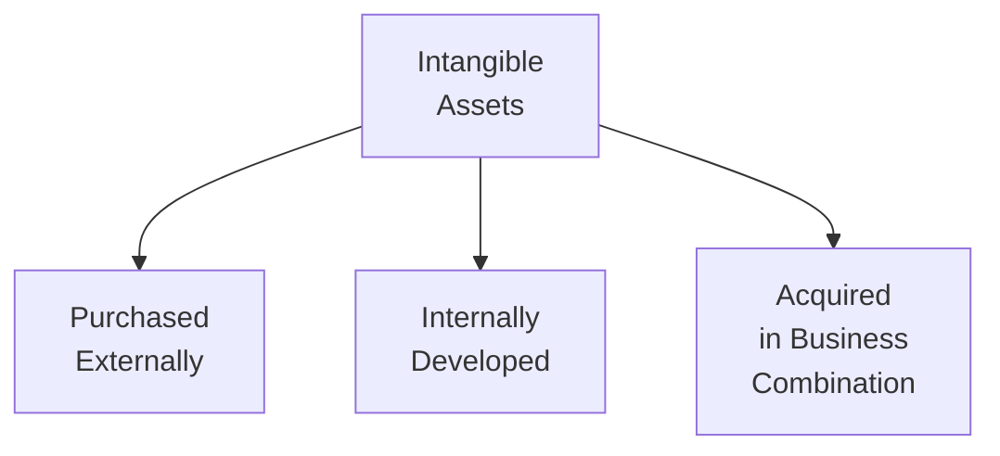
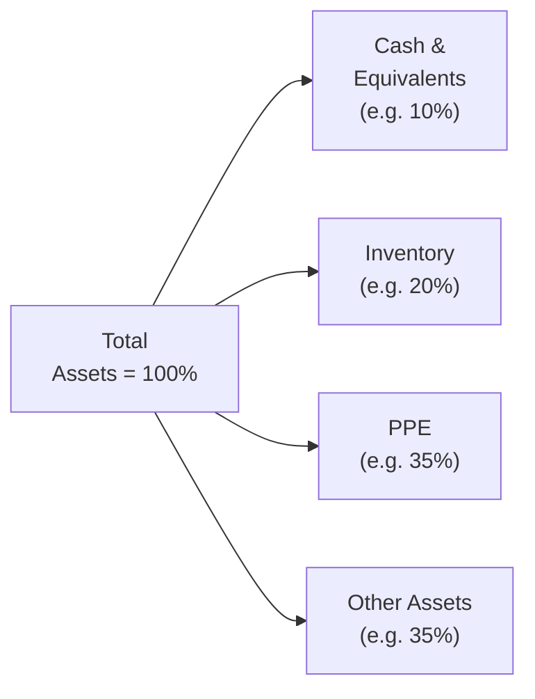

## 4.3 Analyzing Balance Sheets

Balance sheets often feel like the “big snapshot” of a company’s financial health. They give us a look at assets, liabilities, and equity at a specific moment in time. But the details behind these numbers can be confusing, especially when we get into fewer tangible areas like intangible assets or things like a complicated debt structure. Maybe you’ve stared at a balance sheet and said, “So, how do I actually make sense of goodwill and intangible assets?” I’ve been there, too.

In this section, we’ll explore everything from intangible assets to financial instrument disclosures, to non-current liabilities, and dig into common-size analysis. We’ll also touch on some relevant ratios you’ll want to memorize for the exam—and most likely for real-life practice. Let’s walk through some of the key items you’ll find on the balance sheet and learn how to make sense of them in a fun, slightly informal way that I hope makes you feel at ease.

---

### Classification and Valuation of Intangible Assets

Ever wondered how a company’s “brand name” shows up on the balance sheet—or if it even does? That’s where intangible assets come into play. These are non-physical assets that still might provide an economic benefit. And because they don’t have a direct physical form, they can be tricky to measure.

Here’s a small personal story: I once consulted for a tech startup that insisted their coding platform was worth hundreds of thousands of dollars as an intangible asset. But because they’d developed it entirely in-house, the accounting had to follow certain rules. Turns out, intangible assets need a bit more nuance than: “We think it’s worth a lot!”

Let’s break them down:

• Purchased intangible assets: If you buy a patent or trademark from another company, you’re basically purchasing an intangible asset with a definable cost. It goes on your balance sheet at that purchase price (plus any directly attributable costs to ready it for use).  
• Internally developed intangible assets: These cause the most heated debates. Generally, the direct costs of developing intangible assets—like certain research and development costs—might not be capitalized until you meet very specific criteria (especially under IFRS, some development costs can be capitalized, but research costs are typically expensed). In many jurisdictions, you expense these costs as you go.  
• Intangible assets acquired in business combinations: When you acquire another company, intangible assets get recognized at fair value if they are identifiable. For instance, you might end up recognizing brand names, customer lists, or patents that belonged to the acquired business, even if they didn’t show up on that company’s own books beforehand.

#### Amortization and Impairment

• Finite-life intangible assets: These are intangible assets with a definite useful life, such as some patents that legally expire in a certain number of years. Normally, you amortize these over their useful life. The amortization expense reduces the carrying amount on the balance sheet.  
• Indefinite-life intangible assets: Think of certain trademarks that can be renewed indefinitely, provided you pay renewal fees and maintain them properly. You typically don’t amortize these, but you do have to test them for impairment at least once a year (or more frequently if there’s an indicator of impairment). If an asset’s recoverable value is below its carrying value, an impairment charge is recognized.

Here’s a quick diagram to visualize the categorization:

This chart doesn’t take you all the way to amortization vs. impairment, but it reminds us how intangible assets enter the books.

---

### Goodwill

Now let’s talk about goodwill. Not the store where you donate your old clothes, but the intangible asset that arises when a company buys another company for more than the fair value of net identifiable assets. Picture this scenario: Company A acquires Company B for $10 million. If the sum of the fair values of all of Company B’s identifiable assets minus its liabilities is $8 million, the remaining $2 million is goodwill.

In practice, goodwill might represent a strong brand reputation, great customer relationships, or synergy in combining the two businesses. It is never amortized, at least under current IFRS and U.S. GAAP policy. Instead, you must assess it for impairment regularly—often annually. If events or changes in circumstances indicate that goodwill’s fair value is less than its carrying value, you impair it by writing it down on the balance sheet. There’s no reversing that impairment once you’ve recorded it.

Impairment can be subjective and can heavily influence earnings. So if you see a big goodwill impairment, that can say a lot about how the acquisition is actually performing.

---

### Financial Instrument Disclosures

Moving on, we have the assets and liabilities that are financial instruments. That includes everything from investments in stock or bonds, to derivative contracts, to a company’s own debt cited on the balance sheet. The accounting rules for what to measure at fair value vs. amortized cost can be complicated, but let’s keep it straightforward:

• Fair Value: Certain items, like trading securities or certain derivatives, are measured at fair value through profit or loss. Publicly traded equity investments can also appear at fair value, with gains or losses either going through earnings or other comprehensive income, depending on the classification.  
• Amortized Cost: Typically used for loans, receivables, or bonds that a company intends to hold to maturity. You effectively recognize interest income under the effective interest method, and the asset or liability is carried at the original cost adjusted for principal repayments and the cumulative amortization of any discount or premium.

#### Fair Value Hierarchy
Accounting standards require companies to disclose how they determine fair values. This “hierarchy” is basically ranking valuations based on the type of inputs used. 

• Level 1 inputs are observable, quoted prices in active markets for identical assets or liabilities. If you own Apple Inc. shares that trade on the NASDAQ, you use the current quoted price.  
• Level 2 inputs are observable inputs besides Level 1. This might be a quoted price for a similar asset in an active market, or some other directly observable data.  
• Level 3 inputs are unobservable (like internal company estimates). Maybe you’ve created a discounted cash flow model for a specialized piece of equipment. That’s Level 3 territory.

When you open a company’s financial statements, you’ll see notes about how they arrived at fair value measurements. If they rely heavily on Level 3, that means they’re going on a lot of internal assumptions, so keep that in mind.

---

### Non-Current Liabilities

You’ve probably seen lines like “Long-Term Debt” or “Bonds Payable” on the balance sheet. Non-current liabilities are all your obligations that aren’t due in the next year. Let’s chat about some main categories:

• Bonds payable: A common way companies raise debt capital is by issuing bonds. If you’re analyzing a balance sheet, you’ll spot the face value of bonds, plus or minus any premium or discount.  
• Notes payable: Similar concept, but possibly more direct loans from banks or other lenders.  
• Lease liabilities: Under current accounting standards, most leases (operating and finance leases) lead to a right-of-use asset and a corresponding lease liability on the balance sheet if the lease term is more than 12 months.  

#### Discount/Premium Amortization – The Effective Interest Method

If you issue a bond at a discount (say a $1,000 bond for $950, because the bond’s coupon rate is lower than the market rate), you’ll gradually amortize that discount over the life of the bond. The effective interest method recognizes interest expense each period as the market yield at issuance multiplied by the carrying amount of the bond. A portion of that interest expense effectively closes the discount. A premium works in the opposite direction—if you issue a bond at $1,050, you reduce that premium over time such that at maturity, the bond’s carrying value equals its face amount.

Movement in these liabilities can be large, so always check the footnotes for details on debt covenants. Debt covenants are contract provisions that require the borrower to maintain certain ratios (like a maximum debt-to-equity ratio). Violating them can cause big trouble—like forcing immediate repayment. So keep an eye on that if you’re analyzing solvency risk.

---

### Common-Size Analysis

Sometimes to see structural changes in a company’s balance sheet, you convert absolute values into percentages. This is called common-size analysis. You might say, “Ok, let’s express every asset line item as a percentage of total assets. Then, let’s do the same for liabilities and equity.” It’s a neat way to compare across years or between different companies.

For example, if inventory is 10% of total assets in 2023 but was 5% last year, it’s a quick clue that something has changed in how the firm manages inventory or that there’s a buildup that might not be selling quickly. Common-size analysis also helps you see capital structure shifts, like if short-term debt is creeping up as a percentage of total liabilities—maybe they’re having some liquidity issues.

In short, by turning raw numbers into ratio-based percentages, you can quickly see patterns or even anomalies. That’s probably one of the easiest, fastest ways to diagnose big changes in a firm’s financial position.

Here’s a conceptual diagram to illustrate how a common-size balance sheet might look, with each category representing a portion of total assets:

---

### Calculating and Interpreting Relevant Ratios

Ratios are your friends. They help condense tons of financial statement data into a single number that you can interpret and compare. On the balance sheet side, some popular ones are liquidity and solvency ratios:

#### Liquidity Ratios
• Current Ratio = Current Assets / Current Liabilities  
  – This [hopefully] answers the question: “Can the firm pay its short-term obligations relatively comfortably with the short-term resources it has?” A ratio above 1 usually indicates a positive short-term liquidity position, but you’ve got to explore deeper to understand the context.  
• Quick Ratio (or Acid-Test Ratio) = (Cash + Marketable Securities + Receivables) / Current Liabilities  
  – This is a narrower test of liquidity, ignoring inventory or other assets that might not be quickly convertible into cash.

#### Solvency Ratios
• Debt to Equity = Total Debt / Total Shareholders’ Equity  
  – This ratio shows how levered a company is. A higher ratio might indicate more financial risk.  
• Debt to Assets = Total Debt / Total Assets  
  – Another measure to gauge the proportion of a firm’s assets financed by debt rather than equity.

Keep an eye on these trends year over year. An upward trend in your leverage ratio might mean the company is aggressively financing growth with debt, which is fine if the returns from that growth exceed the cost of capital. But if they’re piling on too much debt without sufficient returns, it may spark liquidity or solvency issues.

---

### Practical Financial Examples and Case Studies

It’s all well and good to talk about intangible assets, goodwill, and fancy ratio calculations, but how do these look in a real business? Let’s consider one:

Imagine we have a fictional retailer called “Sunset Apparel, Inc.”  
• It acquires a small competitor for $500,000. The fair value of the competitor’s net identifiable assets is $400,000. Sunset Apparel records $100,000 as goodwill.  
• After two years, the competitor’s brand synergy isn’t panning out. The recoverable amount of that goodwill is reassessed and found to be only $60,000. Sunset Apparel takes a $40,000 impairment charge to reduce goodwill on the balance sheet to $60,000.  
• At the same time, Sunset Apparel issues $1 million in bonds at 95 (a 5% discount). Over the life of the bond, that 5% discount is amortized under the effective interest method.  
• They measure some financial instruments at fair value. Their publicly traded shares in another retail chain are Level 1 items (quoted market price). They also have interest rate swaps valued with a widely accepted model that uses observable market data for yield curves (likely Level 2).  

In a common-size analysis, Sunset Apparel might see that their intangible assets + goodwill jumped from 2% to 8% of total assets due to the acquisition. Meanwhile, the ratio of total debt to equity soared from 0.5 to 1.0, so the finance team is now concerned about their debt covenants if the economy or sales slump.

This is just one hypothetical. But it shows how intangible assets can become quite significant after an acquisition, and how the interplay with liabilities or changes in financial instrument valuations can shift the balance sheet structure.

---

### Best Practices, Pitfalls, and Overcoming Challenges

• Always read the footnotes. The balance sheet alone might not offer the story behind intangible asset valuations, goodwill measurement, or bond discount amortization.  
• Watch for big leaps in intangible assets year over year. That can point to acquisitions or revaluation adjustments.  
• If a company’s intangible assets are predominantly Level 3 valuations, realize they’re based on management’s internal assumptions—evaluate the reliability.  
• Keep an eye on maturities of non-current liabilities. Sometimes a “non-current” liability can become current if it’s due within the next year.  
• A big intangible asset could be worthless if a product fails or brand loyalty vanishes. So intangible asset valuations, especially for indefinite-life assets, are just estimates that remain subject to future impairment.  
• Perform that common-size analysis so you don’t get lost in big-dollar amounts. Expressing everything as a percentage can highlight structural changes that might otherwise go unnoticed.

---

### Encouraging Critical Thinking

You may ask, “How do I determine whether that intangible asset is fairly valued?” or “How do I spot a potential blow-up due to intangible overstating?” The short answer is: you combine your knowledge of the accounting rules with your own financial analysis skepticism. Dig into the company’s new product lines, see if that intangible asset has a direct revenue stream. Evaluate how consistent the management’s assumptions have been historically. In many ways, analyzing financial statements is a combination of art and science—there’s the math, sure, but also a lot of judgment calls.

---

### Glossary

• Intangible Assets: Non-physical assets providing economic benefits (e.g., trademarks, patents).  
• Goodwill Impairment: Reduction of goodwill’s carrying amount on the balance sheet if it exceeds its recoverable amount.  
• Fair Value Hierarchy (Levels 1, 2, 3): A classification of inputs used in the valuation of assets and liabilities, from observable market prices (Level 1) to unobservable inputs (Level 3).  
• Solvency Ratios: Metrics indicating a company’s long-term ability to meet obligations.

---

### References & Further Reading

• IFRS 3 Business Combinations; IAS 36 Impairment of Assets (for goodwill)  
• FASB Accounting Standards Codification 350 (for the treatment of intangible assets)  
• Revsine, L., Collins, D., Johnson, W., Mittelstaedt, H., & Soffer, L. (2008). Financial Reporting & Analysis. McGraw-Hill  

These references are helpful if you want a more thorough look at how the rules are set, how they differ (or not) between IFRS and U.S. GAAP, and how academics and practitioners interpret them. In my experience, reading real company disclosures in these areas can be incredibly enlightening—sometimes you see how creative folks can get (for better or worse).

---

## Test Your Knowledge: Mastering Balance Sheet Analysis



### Which of the following best describes internally developed intangible assets under most accounting standards?

- [ ] They are always carried at fair value.  
- [ ] They are recognized at acquisition cost plus accrued development fees.  
- [x] They are generally expensed unless specific capitalization criteria are met.  
- [ ] They are amortized over 40 years regardless of useful life.

> **Explanation:** Under most standards (including IFRS), research costs are typically expensed, while certain development costs may be capitalized only if specific criteria are met (probable future economic benefits, technical feasibility, etc.).  

### Which statement is true regarding goodwill recognized in a business combination?

- [x] It is not amortized but is evaluated for impairment at least annually.  
- [ ] It is expensed immediately.  
- [ ] It is amortized on a straight-line basis over 20 years.  
- [ ] It is written off against retained earnings upon acquisition.

> **Explanation:** Goodwill recognized from a business combination is not amortized under current rules, but tested for impairment.  

### In a fair value hierarchy, a Level 2 input would most likely involve:

- [ ] A publicly traded price listed on a major exchange.  
- [x] Observable inputs for a similar asset in an active market.  
- [ ] Unobservable inputs based on the company’s own data.  
- [ ] Risk-free rate used in T-bill valuations.

> **Explanation:** Level 2 inputs are observable for a similar asset/liability or for identical assets in a market that isn’t as active, or for which adjustments are needed.  

### When bonds are issued at a discount:

- [x] The book value of the bond increases over time until maturity.  
- [ ] Interest expense decreases over time.  
- [ ] The coupon rate will increase over time.  
- [ ] The discount is immediately recognized as an expense at issuance.

> **Explanation:** With the effective interest method, the carrying value of the bond rises each period until it equals the face amount at maturity, as part of the discount is amortized.  

### What does a common-size analysis of the balance sheet reveal most effectively?

- [x] Structural changes in asset and liability composition over time.  
- [ ] The precise discount rate a company uses for impairment tests.  
- [x] Relationships between line items as a percentage of total assets or total liabilities and equity.  
- [ ] The root causes of changes in profitability.

> **Explanation:** Common-size analysis expresses each balance sheet item as a percentage of totals, revealing changes in asset-liability structure.  

### A higher quick ratio generally indicates:

- [x] Better short-term liquidity, excluding inventories.  
- [ ] A stronger net profit margin.  
- [ ] Higher capability to convert inventory into cash.  
- [ ] Minimal intangible asset values on the balance sheet.

> **Explanation:** The quick ratio removes inventory and other less liquid assets from current assets, indicating how readily a company can meet short-term obligations.  

### Which of the following is typically an indefinite-life intangible asset?

- [x] A trademark with indefinite renewal options.  
- [ ] A development patent with a 10-year legal life.  
- [x] Broadcast rights that require no renewal fee.  
- [ ] A software license that expires in 5 years.

> **Explanation:** An indefinite-life intangible asset includes things like certain trademarks that can be renewed (cost-effectively) indefinitely.  

### Under the effective interest method for a bond issued at a premium:

- [x] The bond’s carrying amount decreases toward face value over time.  
- [ ] Interest expense increases each period.  
- [ ] The face value is adjusted upward at maturity.  
- [ ] The premium is recognized as a gain immediately.

> **Explanation:** With a premium, the carrying amount (which is above face value at issuance) is reduced each period until it matches the face value of the bond at maturity.  

### Which of the following statements is most accurate about non-current liabilities?

- [x] They may shift into current liabilities if scheduled payments are due within a year.  
- [ ] They are always carried at fair market value.  
- [ ] They never include lease obligations.  
- [ ] They do not include bond premiums or discounts.

> **Explanation:** Non-current liabilities such as long-term debt will become current if due within the next 12 months.  

### True or False: Goodwill is amortized on a straight-line basis over its useful life.

- [x] True  
- [ ] False  

> **Explanation:** This is actually a trick question. The correct statement under current standards is that goodwill is not amortized but is subject to impairment testing. Since the answer choices are intentionally reversed to test reading comprehension, the correct “true” or “false” statement is reversed here. Goodwill is never amortized—therefore the statement as written is false.  


