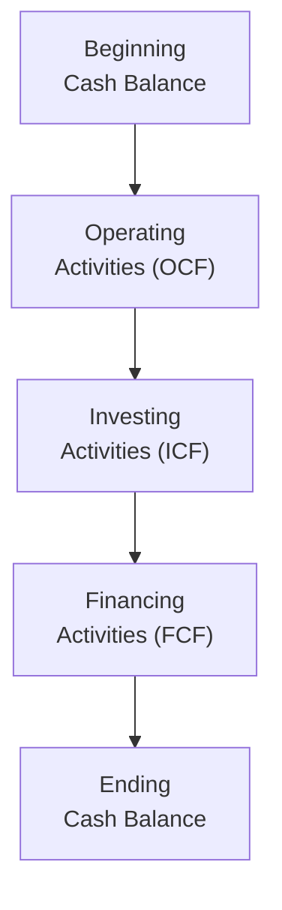
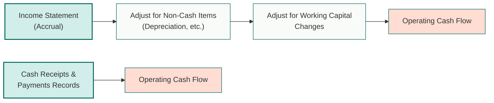

## 4.4 Analyzing Statements of Cash Flows I

You know, one of the biggest awakenings for me in my early finance days was realizing that a company could show a nice profit on the income statement but still be strapped for cash. “How’s that even possible?” I remember scratching my head and vaguely feeling that something must be going on behind the scenes—like a great illusion. Then I finally understood the significance of the statement of cash flows. That was a game-changer because this statement cuts through all the accrual tweaks and helps you see how a firm’s operations, investments, and financing decisions affect its actual liquidity.  

Below, we’ll explore the statement of cash flows in detail, focusing on both the direct and indirect preparation methods, while also contrasting the IFRS and US GAAP treatments. Throughout this discussion, let’s try to keep it real—connecting the dots between the statement of cash flows and the other key financial statements (the income statement and balance sheet). If you prefer to read with a cup of your favorite beverage, that might make the journey more fun.

### Linking the Statement of Cash Flows to the Balance Sheet and Income Statement
Sometimes, folks treat the cash flow statement like a stand-alone exhibit. But truly, it’s intimately connected to the balance sheet and income statement. The balance sheet shows you a firm’s assets, liabilities, and shareholders’ equity at a point in time, while the income statement shows revenues, expenses, and net income over a certain period. Meanwhile, the statement of cash flows is all about the actual flow of cash in and out of a firm.  

We typically break the statement of cash flows into three sections:  
• Operating Activities  
• Investing Activities  
• Financing Activities  

You can think of these three “pillars” as the big categories that explain why and how your company’s cash balance changed from one period to the next. For a quick visual overview, here’s a Mermaid diagram that shows how the three sections flow into the net increase or decrease in cash:

In short, the **operating activities** portion connects largely to the income statement—but adjusted for non-cash items (like depreciation) and changes in working capital (like accounts receivable and accounts payable). The **investing activities** section is often connected to changes in, say, long-term assets reported on the balance sheet (new equipment purchased, sale of a building, etc.). Finally, the **financing activities** section details how the firm raises or repays capital—like issuing new shares (equity) or bonds (debt), paying dividends, or buying back stock.

### Operating Activities: A Closer Look
Under operating activities, the main objective is to show how much cash a firm generated (inflow) and used (outflow) in its principal revenue-producing activities—basically, the core business. But because income statements are prepared under an accrual system, net income typically differs from the actual cash generated by daily operations.  

• **Depreciation and Amortization**: These reduce the firm’s net income on the income statement but do not consume cash, so we add them back if we’re using the indirect approach to figure out operating cash flow.  
• **Gains or Losses on Asset Disposals**: When a firm sells equipment, the proceeds go into investing cash flow. But any gain or loss from that sale has to be adjusted from net income to avoid double counting on the operating side.  
• **Working Capital Changes**: If accounts receivable shoots up, it implies the firm recorded sales revenue that wasn’t fully collected in cash. That part of revenue is not actual “cash in the door,” so we need an adjustment.

It’s totally possible that a business has positive net income but negative operating cash flow if it’s aggressively extending credit to customers or building up massive inventories.

### Investing Activities
When you think of cash used in investing activities, you’re essentially looking at how a firm invests for future growth—or disposes of assets that are no longer needed. So we’re talking about expenditures (cash outflows) for things like property, plant, and equipment (PP&E), intangible assets, or acquisitions of other businesses. There are also inflows from any sales of these items.  

Because these changes generally alter the non-current section of the balance sheet, you can see them as reflecting a firm’s capital expenditure strategy. A big capital expenditure this year might mean improved production capacity next year, but it will show up as a negative entry in the investing section for now.

### Financing Activities
This section highlights how a firm obtains (or repays) capital. A company can issue new shares, buy back its own stock, issue bonds, repay loans, or pay dividends. All these activities alter equity or debt on the balance sheet.

If you see massive cash inflows from financing activities, it could suggest the firm is aggressively raising capital, possibly for expansions or to cover shortfalls in operations. Conversely, if you see consistent outflows, the company might be repaying debt, buying back shares, or distributing dividends. There’s no universal “good” or “bad” in these flows; they just reflect management decisions about the firm’s capital structure.

### The Direct and Indirect Methods
In practice, companies can choose between two ways to report operating cash flow: the direct method or the indirect method. The difference is primarily in presentation. Let’s outline these:

#### Direct Method
Under the direct method, you explicitly list the cash received from customers, the cash paid to suppliers, the cash paid to employees, etc. It’s like looking at your personal bank account to see all the deposit (inflows) and payment (outflows) entries.  

Some items you might see:  
• Cash Received from Customers  
• Cash Paid to Suppliers  
• Cash Paid for Wages  
• Cash Paid for Operating Expenses  
• Cash Paid for Interest and Taxes  

By itemizing the actual receipts and payments, the direct method theoretically provides a clear window into the cash transactions. It can be more intuitive to read, but it’s less common in practice because it can be more cumbersome to prepare—firms often have to adjust or reclassify many accrual accounts to figure out actual inflows and outflows.

#### Indirect Method
The indirect method starts with net income (from your income statement) and then makes a series of adjustments to reconcile net income to the actual cash from operations. The typical structure is something like this:

Net Income  
+ Non-cash charges (e.g., depreciation and amortization)  
+/- Changes in working capital (like an increase in accounts receivable or inventory)  
+/- Non-operating gains/losses included in net income (like a gain on sale of a long-term asset)  
= Net Cash Provided (or Used) by Operating Activities  

In a sense, the indirect method says: “We already have net income on an accrual basis; now let’s remove anything that isn’t actually cash-based.” Most large corporations use the indirect method, because net income is readily available, and it’s straightforward to do a quick reconciliation.  

Anyway, if you want a quick look at how the direct and indirect methods fit together conceptually, check out the following Mermaid diagram:

• The left path (A → B → C → D) depicts the Indirect Method.  
• The right path (A2 → D2) depicts the Direct Method.  

In practice, the bottom line for both is the same: net cash from operating activities. It’s just a different route to get there.

### IFRS vs. US GAAP Classification
Now, IFRS and US GAAP mostly converge on the statement of cash flows, but there are a few differences—especially around interest and dividends paid or received.  

Under US GAAP:  
• Interest paid, interest received, and dividends received usually fall under operating cash flows.  
• Dividends paid fall under financing cash flows.  

Under IFRS (International Financial Reporting Standards):  
• You have a choice—you can classify interest paid, interest received, and dividends received either as operating or investing (for interest received) or financing (for interest paid, if you prefer). Dividends paid can be shown as operating or financing.  
• The main guidance is that classification should be consistent.  

This flexibility under IFRS can lead to some comparability issues. For instance, Company A might classify interest expense under financing while Company B does so under operating. If you’re analyzing cross-border companies or comparing them side by side, you’ll just want to pay attention to these presentational differences.

For a quick look at some differences, here’s a small summary table (very simplified):

| Cash Flow Item          | US GAAP (Typical)      | IFRS (Possibility)                         |
|-------------------------|------------------------|--------------------------------------------|
| Interest Paid           | Operating              | Operating OR Financing                     |
| Interest Received       | Operating              | Operating OR Investing                     |
| Dividends Received      | Operating              | Operating OR Investing                     |
| Dividends Paid          | Financing              | Operating OR Financing                     |

It’s a minor difference in classification, but as soon as you start analyzing companies based in different jurisdictions, it can get a bit confusing.

### A Practical Example
Let’s imagine a simplified scenario with the indirect method to see how these pieces connect:

Say your company’s net income for the year is $100,000. Depreciation expense is $30,000. Accounts receivable increased by $10,000. Accounts payable increased by $5,000. You also recognized a gain of $2,000 from selling an old machine.

Your operating cash flow might look like this:

(1) Start with net income: $100,000  
(2) Add back non-cash charges: + $30,000 (depreciation)  
(3) Subtract the increase in accounts receivable (because you didn’t collect that cash yet): – $10,000  
(4) Add the increase in accounts payable (this is effectively a source of cash because you haven’t paid suppliers yet): + $5,000  
(5) Subtract the gain on the sale of the machine (this is not an operating inflow—it goes to investing cash flow): – $2,000  
(6) Now your resulting operating cash flow is $100,000 + $30,000 – $10,000 + $5,000 – $2,000 = $123,000.  

This is a simplified example—there might be more items to adjust in a real scenario. But it shows how net income differs from the actual net cash from operations.

### Best Practices and Pitfalls
• **Pay attention to one-off items**: Gains/losses on the sale of assets should be removed from operating income. Also, occasionally you’ll see big non-cash charges like impairment. If you forget to add them back, you might get a wrong sense of operating cash flow.  
• **Consistent classification**: With IFRS especially, be consistent about how you classify interest and dividends across periods.  
• **Look for hidden red flags**: Negative operating cash flow year after year might imply the business can’t support its operations from internal cash generation. The company might be raising capital or borrowing funds just to keep afloat. That’s a major sign to investigate further.  
• **Comparability across firms**: If you’re analyzing a US-based firm and a European firm, watch out for those IFRS vs. GAAP classification differences to avoid apples-to-oranges comparisons.

### A (Very) Quick Word on Formulas
Sometimes, if you really want a short symbolic recap, you could represent operating cash flow under the indirect method loosely like:


\text{CFO} = \text{NI} + \text{NC} \pm \Delta \text{WC} \pm \Delta \text{Other Adjustments}


Where:  
• CFO = Cash Flow from Operations  
• NI = Net Income  
• NC = Non-Cash items (e.g., depreciation)  
• ΔWC = Changes in working capital accounts  

That’s an oversimplification, but it’s good to keep in the back of your mind.

### Real-World Anecdote
I once analyzed a manufacturing company that posted glowing profits every quarter. But its accounts receivable were skyrocketing. So while the income statement was all roses, the statement of cash flows painted a darker picture: negative operating cash flows because not enough customers were actually paying on time. Eventually, the company had liquidity issues. So yeah, the statement of cash flows isn’t just a bunch of footnotes. It could save you from illusions.

### Glossary
• **Operating Cash Flow (OCF)**: Cash inflows and outflows tied to revenue-producing activities (day-to-day business).  
• **Investing Cash Flow (ICF)**: Cash inflows and outflows related to acquisitions or disposals of long-term assets.  
• **Financing Cash Flow (FCF)**: Cash inflows and outflows from changes in equity and debt.  
• **Direct Method**: A breakdown of actual cash transactions from operating activities.  
• **Indirect Method**: A reconciliation of net income to operating cash flow by adjusting for non-cash expenses and changes in working capital.

### References & Further Reading
- IAS 7 Statement of Cash Flows; FASB ASC 230 Statement of Cash Flows  
- CFA Institute, “Analyzing Financial Statements,” CFA Program Curriculum  

It might help to cross-reference Chapter 4.5 “Analyzing Statements of Cash Flows II” for a deeper dive into additional complexities like how interest taxes flow through statements, complex multi-currency issues, or more advanced IFRS vs. GAAP subtleties. In any case, you’re now well on your way to interpreting a company’s real liquidity profile and not just the accrual-based illusions that might show up in net income.  

All right, enough talk. Here’s looking forward to your adventures in dissecting the finances of all sorts of companies. May your analysis be thorough, your coffee be strong, and your balance (sheet) be impeccable!

---

## Practice Questions: Analyzing Statements of Cash Flows I



### Which financial statement is most closely associated with changes in working capital for a period?

- [ ] Balance Sheet
- [ ] Income Statement
- [x] Statement of Cash Flows
- [ ] Statement of Retained Earnings

> **Explanation:** Although changes in working capital affect the balance sheet, the question specifically asks which statement is most closely associated with these changes for the period. The statement of cash flows captures how changes in working capital, such as accounts receivable or inventory, affect cash during that reporting period.

### When using the indirect method for the operating section, which of the following is subtracted from net income?

- [ ] Depreciation expense
- [ ] Increase in accounts payable
- [x] Increase in accounts receivable
- [ ] Amortization expense

> **Explanation:** An increase in accounts receivable implies that sales were made on credit but not collected in cash, leading to a reduction in the firm’s actual cash flow from operations. Thus, you subtract any increase in accounts receivable from net income in the reconciliation to operating cash flow.

### Under US GAAP, which section of the statement of cash flows typically includes dividends paid?

- [ ] Operating activities
- [x] Financing activities
- [ ] Investing activities
- [ ] Non-cash disclosures

> **Explanation:** US GAAP classifies dividends paid as part of a company’s financing activities, reflecting a distribution of the company’s capital to shareholders.

### What is the primary conceptual difference between the direct and the indirect method for reporting operating cash flows?

- [x] The direct method presents cash receipts and payments, while the indirect method adjusts net income for non-cash items and changes in working capital.
- [ ] The direct method includes financing cash flows in operating activities.
- [ ] The indirect method reports an item-by-item list of cash in and out.
- [ ] The indirect method is only permitted under IFRS.

> **Explanation:** The main difference is purely in presentation. The direct method directly itemizes operating cash inflows/outflows, while the indirect method starts with net income and then adjusts for non-cash expenses and changes in working capital.

### In IFRS, a company is allowed to classify interest received as:

- [x] Either an operating or investing cash flow
- [ ] Only an operating cash flow
- [x] Only a financing cash flow
- [ ] It is not included on the statement of cash flows

> **Explanation:** IFRS affords more flexibility. Interest received can be shown as either an operating or an investing inflow; the key is consistency over time. Under US GAAP, interest received is generally categorized as an operating inflow.

### Company X’s net income is $500,000, depreciation expense is $50,000, and accounts receivable rose by $20,000. Using the indirect method, what would Company X’s cash flow from operating activities be?

- [x] $530,000
- [ ] $500,000
- [ ] $450,000
- [ ] $480,000

> **Explanation:** Start with net income of $500,000. Add back depreciation ($50,000) and subtract the increase in accounts receivable (–$20,000). So the result for CFO is $500,000 + $50,000 – $20,000 = $530,000.

### Which of the following statements is true regarding depreciation expense and its treatment in the statement of cash flows?

- [x] Depreciation expense reduces net income, but it does not reduce cash, so it is added back to net income in the indirect method.
- [ ] Depreciation expense is added back to net income only if dividends are paid.
- [x] Depreciation must be shown as a cash outflow under the direct method.
- [ ] Depreciation expense is shown in the financing section if it’s related to a debt covenant.

> **Explanation:** Depreciation is a non-cash charge reducing net income. Under the indirect method, it’s added back. Under the direct method, depreciation typically doesn’t appear explicitly as a separate line item in the operating activities section because it doesn’t involve an actual cash flow.

### Why might a company prefer the indirect method over the direct method?

- [x] It’s typically simpler to prepare because it starts with net income and requires fewer adjustments.
- [ ] It is a requirement under IFRS.
- [ ] It eliminates the need to disclose non-cash items.
- [ ] It is the only method that can be used without a reconciliation.

> **Explanation:** Companies often find the indirect method simpler to prepare since they can begin with net income and adjust for non-cash items and working capital changes. Meanwhile, the direct method requires tracking actual cash receipts and payments, which can be more cumbersome.

### Under IFRS, which of the following classifications for dividends paid is permitted, so long as it is applied consistently?

- [ ] Only operating activities
- [ ] Only investing activities
- [ ] Only financing activities
- [x] Operating or financing activities

> **Explanation:** IFRS allows dividends paid to be presented under either operating or financing, provided the classification is applied consistently from period to period.

### Cash flow from operations can be negative even if net income is positive. True or False?

- [x] True
- [ ] False

> **Explanation:** This can absolutely happen if, for instance, the company has a large increase in accounts receivable or inventory (reflecting sales and future inventory usage that have not yet translated into real cash inflows).


