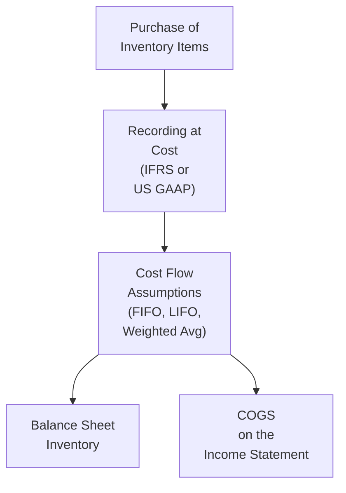

## 4.6 Analysis of Inventories

Let’s be real: inventory can sometimes feel less thrilling than, say, the latest tech gadget—yet it’s vital. If you’ve ever managed a tiny store or even had a rummage sale, you’ve dealt with the nuts and bolts of “what did I pay for that, and how much am I selling it for?” In financial statement analysis, inventory gets a little more formalized: we have cost flow methods, rules, write-downs, ratios, and some differences between IFRS and US GAAP to keep us on our toes. Anyway, let’s dive right in!

---

### Why Inventory Analysis Matters

Inventory, for many firms—especially retailers and manufacturers—can represent one of the largest items on their balance sheet. The way that inventory is **valued** affects:

• Reported Total Assets  
• Cost of Goods Sold (COGS)  
• Gross Profit and Net Income  
• Various financial ratios (inventory turnover, current ratio, etc.)

And these differences aren’t just academic. They can literally sway how investors, creditors, and regulators interpret a company’s health and profitability.  

---

### Overview of Common Inventory Costing Methods

Let’s say you own a small coffee-bean shop, and you’ve been purchasing beans at different prices throughout the year. How do you figure out the cost of the beans you’ve sold and the beans that remain on your shelves? That’s where inventory **cost flow** assumptions come in. Let’s look at the main methods.

#### 1. First-In, First-Out (FIFO)

• Under FIFO, the “first” items you purchased (i.e., the oldest costs) are assumed to be the first items sold.  
• The ending inventory on the balance sheet is valued more closely to the **most recent** (i.e., current) costs.  
• Typically, under inflationary conditions, FIFO will yield lower COGS and higher ending inventory (and thus higher net income) compared to other methods like LIFO.

In a coffee shop scenario, FIFO would assume you sell the oldest beans first, and your bean inventory on hand is from the more recent (and presumably pricier) purchases.

#### 2. Last-In, First-Out (LIFO)

• LIFO says that the “last,” or newly purchased, items are sold first.  
• Common under US GAAP, but not permitted under IFRS (sorry, IFRS fans—LIFO’s not allowed there).  
• In times of rising input costs (inflation), LIFO can lower reported net income because you’re matching the most recent, higher costs with your sales. In the US, that can create a tax benefit—though it might also understate the ending inventory you report on your balance sheet.

If your coffee supplier hikes prices often, LIFO means your cost of goods sold reflects those higher prices first, so your COGS is bigger and your reported taxable income is smaller.

#### 3. Weighted (or Moving) Average Cost

• Weighted Average Cost divides the total cost of goods available for sale by total units purchased to get a uniform “average cost” per unit.  
• Each sale is recorded at the same average cost, and ending inventory is also carried at that same average.  
• Less dramatic swings in COGS or ending inventory when compared to FIFO or LIFO specifically during volatile price changes.

If you’re not thrilled with the whipsaw effect of FIFO vs. LIFO, you might appreciate the smoothing that an average cost method provides.

---

### IFRS vs. US GAAP: Key Differences

We’ve already hinted at one big difference: IFRS doesn’t permit LIFO. That alone can be a game-changer. However, there’s more:

• **Inventory Write-downs:** Under both IFRS and US GAAP, if the inventory’s net realizable value (i.e., the amount you can reasonably expect to sell it for) falls below its cost, you have to write down the inventory.  
• **Reversal of Write-downs:** IFRS allows partial or full reversal of inventory write-downs if the net realizable value recovers in a subsequent period. US GAAP does not allow a reversal once inventory is written down.

From an investor’s perspective, if you see a big write-down under US GAAP, it sticks. IFRS-based firms might “bounce back” from that same scenario if market conditions improve.

---

### Lower of Cost and Net Realizable Value (LCNRV)

LCNRV helps make sure you’re not inflating your inventory’s value. If **Net Realizable Value (NRV)**—the estimated selling price minus the costs of completion and sale—drops below the cost on the books, you need to carry it at NRV and recognize a loss in the current period. Think of it as a reality check.

As we just noted, IFRS allows you to **reverse** that write-down (up to the original historical cost) if prices bounce back. US GAAP, on the other hand, simply says “nope,” once written down, it stays down.

---

### Impact of Inflation or Deflation on Inventory Valuations

Economies go through repeated cycles of inflation or deflation, and your choice of FIFO, LIFO, or average cost can create substantial differences:

• **Inflationary Environment**  
  – FIFO results in lower COGS and higher taxable income (and higher taxes).  
  – LIFO results in higher COGS and lower taxable income (tax advantage), but also a lower ending inventory on the balance sheet.

• **Deflationary Environment**  
  – The roles get reversed. If prices are going **down**, LIFO yields lower COGS (higher income) because you’re selling what was last purchased (and now cheaper).  

It’s crucial to be aware of these dynamics. A company that uses LIFO can see large year-to-year changes in net income if purchase costs swing widely.

---

### A Quick Example Comparing Methods

Suppose you run that coffee bean shop and you purchased 1,000 kilos of coffee beans at different prices:  

• 300 kilos @ $5 each = $1,500  
• 500 kilos @ $6 each = $3,000  
• 200 kilos @ $7 each = $1,400  

Your total cost of goods available for sale is $5,900 for 1,000 kilos. Now, let’s say at year-end you sold 600 kilos, leaving 400 kilos as ending inventory.

1) **FIFO**  
   - The first 600 kilos sold are the oldest.  
   - COGS: (300 kilos @ $5) + (300 kilos @ $6) = $1,500 + $1,800 = $3,300  
   - Ending Inventory: 100 kilos @ $6 + 200 kilos @ $7 = $600 + $1,400 = $2,000  

2) **LIFO** (not IFRS-friendly)  
   - The first 600 kilos sold are the newest.  
   - COGS: (200 kilos @ $7) + (400 kilos @ $6) = $1,400 + $2,400 = $3,800  
   - Ending Inventory: 300 kilos @ $5 + 100 kilos @ $6 = $1,500 + $600 = $2,100  

3) **Weighted Average Cost**  
   - Average Cost: Total cost $5,900 / 1,000 kilos = $5.90/kilo (rounded)  
   - COGS: 600 kilos * $5.90 = $3,540  
   - Ending Inventory: 400 kilos * $5.90 = $2,360  

Notice how COGS ranges from $3,300 (FIFO) to $3,800 (LIFO) to $3,540 (Weighted Average). That difference—$500 between FIFO and LIFO—means net income under FIFO can look significantly higher if everything else in the income statement remains the same. So the choice of method matters!

---

### Inventory Disclosures to Watch

Analyzing those financial statements? Then pay attention to these:

1. **Footnotes on Inventory Policies:**  
   – Verify the cost flow assumption (FIFO, LIFO, Weighted).  
   – Check if a company changed methods during the year and why—sometimes a sudden shift can raise eyebrows.  

2. **Write-down and Write-up Disclosures:**  
   – If IFRS-based, check if previously written-down inventory is now reversed.  
   – Evaluate whether management’s assumptions about net realizable value are realistic.

3. **Consistency Over Time:**  
   – Ideally, the same cost flow method is used year-over-year unless there’s a compelling reason to change.  
   – If they did change, see how it affects comparability and whether they have restated prior statements for clarity.

4. **Excess or Obsolete Inventory:**  
   – Some companies bury disclaimers about slow-moving or obsolete inventory in the footnotes. That can be a big red flag for potential future write-downs.

---

### Key Ratios and Measures

Ratios can help you see if the company is efficiently managing its inventory or just hoarding goods in a warehouse. Here are three commonly used measures:

1. **Inventory Turnover Ratio**  
   – Formula: Inventory Turnover = COGS / Average Inventory  
   – Interpretation: The higher, the better, generally, because it indicates you’re selling inventory quickly. A dropping ratio might mean slow sales or potential obsolescence building up.

2. **Days of Inventory on Hand (DOH)**  
   – Formula: DOH = 365 / Inventory Turnover  
   – Interpretation: Tells you the average number of days it takes to sell or use the inventory on hand. If it’s skyrocketing from year to year, the firm might need to investigate why goods aren’t moving as swiftly.

3. **Gross Margin Analysis**  
   – Formula: Gross Margin = (Revenue – COGS) / Revenue  
   – Interpretation: Observing if gross margin remains stable when the firm changes inventory methods or during commodity price fluctuations can provide insight into pricing strategy and cost management.

Consider reviewing these ratios in context: you want to compare them against industry peers and the company’s own historical trends. A single ratio in isolation might mislead you.

---

### Visualizing the Inventory Accounting Flow

To illustrate the typical steps in accounting for inventory, here’s a simple flowchart. Sometimes, pictures help us “get it.”

The moment you purchase an item, you record it at cost (which includes all costs necessary to get that inventory ready for sale—like shipping, handling, and so on). Your chosen cost flow assumption decides which units you “match” to COGS and which remain on the balance sheet.

---

### Best Practices and Potential Pitfalls

• **Management Manipulation:** Inventory costing choices can shift earnings. Analysts need to see if management’s choice lines up with industry practice or if they’re trying to manage income.  
• **Inflationary Pressures:** A switch to LIFO in the US might reduce taxable income in an inflationary environment. Conversely, showing higher inventory balances can look better to investors.  
• **Obsolete Goods and Write-down Risk:** If an industry is quickly evolving (like tech or fashion), the risk of unsellable inventory is real. Always check footnotes for these disclaimers.  
• **Comparing Across Borders:** Because IFRS disallows LIFO, watch out when comparing a US-based firm (using LIFO) with an IFRS-based firm (using FIFO or Weighted Average). Combining the two can be apples and oranges.

---

### Personal Anecdote (Because Why Not?)

I used to help a family member who ran a small clothing boutique. We never used anything as fancy as LIFO or FIFO in a formal way—just a mental note: “Yes, that stack over there’s from two seasons ago, better put them on sale.” But if you’re a public company, you can’t be that casual. The cost flow method you adopt influences net income, taxes, and your entire financial snapshot. It’s pretty handy to see a real-life reflection of how these methods play out in a smaller setting, though, especially when a new shipment’s pricing has inched up and your older inventory is still priced at last season’s discount.

---

### Conclusion

Inventory might sound like a dull patch of the accounting world, but it’s truly a foundation of financial statements for many businesses. If you understand how FIFO, LIFO, and average cost each impact the bottom line, as well as how IFRS and US GAAP treat write-downs, you’re already a step ahead in making sense of a company’s performance.  

Take time to examine footnotes, watch for changing inventory methods, and check ratio fluctuations. All these will give you a deeper picture of business realities behind the numbers on a page.  

---

### Glossary

• **FIFO (First-In, First-Out):** Assumes the oldest inventory costs are sold first, leaving recent purchases in inventory. Higher income in inflationary times, typically.  
• **LIFO (Last-In, First-Out):** Assumes the newest inventory is sold first. US GAAP only; helpful for reducing taxable income in inflation but not allowed under IFRS.  
• **LCNRV (Lower of Cost and Net Realizable Value):** Ensures inventory is not carried above what it can realistically sell for. Under IFRS, write-downs can be reversed if values recover.  

---

### References & Further Reading

• **IAS 2 Inventories**: IFRS guidance on accounting for inventories, including measurement and disclosures.  
• **FASB ASC 330 Inventory**: US GAAP standard for inventory valuation and disclosures.  
• White, G.I., Sondhi, A.C., & Fried, D. (2003). **The Analysis and Use of Financial Statements**. Wiley.  

---

## Test Your Knowledge: Inventory Valuation & Analysis Quiz



### A company using LIFO during a period of rising prices will most likely report which of the following compared to a company using FIFO?

- [ ] Higher net income and higher inventory balances.
- [x] Lower net income and lower inventory balances.
- [ ] Lower net income and higher inventory balances.
- [ ] Higher net income and lower inventory balances.

> **Explanation:** Under LIFO in an inflationary environment, the most recent (highest) costs go into COGS, so profit is lower, and ending inventory is lower because the cost of older (cheaper) inventory remains on the balance sheet.

---

### If the net realizable value of inventory declines below its recorded cost, what must a firm generally do according to IFRS?

- [x] Write down the inventory to the lower value and recognize a loss.
- [ ] Keep the inventory at historical cost but disclose the difference in footnotes.
- [ ] Write down the inventory, but only after two reporting periods.
- [ ] Do nothing until the inventory is sold.

> **Explanation:** IFRS requires that if the net realizable value (NRV) is lower than cost, the carrying value of inventory must be reduced to that NRV, with a corresponding loss recognized in the income statement.

---

### For a manufacturing firm, which ratio best helps in assessing how quickly inventory is sold?

- [x] Inventory Turnover (COGS / Average Inventory)
- [ ] Current Ratio (Current Assets / Current Liabilities)
- [ ] Debt-to-Equity Ratio (Total Debt / Total Equity)
- [ ] Return on Equity (Net Income / Shareholders’ Equity)

> **Explanation:** The inventory turnover ratio directly measures how many times the firm sells and replaces its inventory in a period—an essential indicator of efficiency in managing stock levels.

---

### Under US GAAP, if an inventory write-down occurs due to obsolescence and the market later recovers, what can happen to that previously written-down inventory value on the books?

- [ ] It can be partially reversed up to the original cost.
- [ ] It can be fully reversed up to the original cost.
- [x] It cannot be reversed once written down.
- [ ] It must be reversed and revalued at market price.

> **Explanation:** US GAAP prohibits the reversal of inventory write-downs, even if the inventory recovers in value later. IFRS, in contrast, does allow limited reversals.

---

### Which of the following statements about weighted average cost (WAC) is correct?

- [x] It smooths out the impact of cost fluctuations by assigning a uniform average cost to all units sold and on hand.
- [ ] It always results in the highest ending inventory value.
- [x] It is prohibited under both IFRS and US GAAP in periods of deflation.
- [ ] It matches the most recent costs with current revenues.

> **Explanation:** Weighted average cost assigns an average per-unit cost to each sale and remaining inventory, smoothing out variations during the period. It’s permitted under both IFRS and US GAAP. It does not always result in the highest inventory value or match the most recent costs.

---

### In a period of deflation, which method might report higher net income if a company were allowed to use both FIFO and LIFO?

- [x] FIFO
- [ ] LIFO
- [ ] Weighted Average
- [ ] Specific Identification

> **Explanation:** In deflationary periods, FIFO uses older (higher) costs in COGS, hence COGS is higher, and net income would be lower. But LIFO uses more recent (lower) costs first, making COGS lower and net income higher. However, the question states “might report higher net income,” so in deflation, LIFO leads to higher net income than FIFO.

---

### An analyst wants to compare two firms, one using LIFO (US GAAP) and one using FIFO (IFRS). What adjustment might the analyst consider making?

- [x] Converting the LIFO-based inventory amounts to a FIFO basis using the LIFO reserve.
- [ ] Using the highest inventory value for both firms.
- [ ] Ignoring differences if both are in the same industry.
- [ ] Writing off older inventory at standard cost.

> **Explanation:** To achieve comparability, analysts often adjust LIFO-based financials back to FIFO using the disclosed LIFO reserve. This makes it easier to compare across firms using different methods.

---

### Which of the following footnote disclosures is most critical for understanding the potential impact of inventory on future earnings?

- [ ] The location of the warehouses storing the inventory.
- [x] The method used to value inventory (FIFO/LIFO/Weighted Average) and any write-downs recorded.
- [ ] The list of all inventory SKUs item by item.
- [ ] The identity of the suppliers providing raw materials.

> **Explanation:** The inventory valuation method and information about write-downs have the biggest impact on current and future earnings. The other details can be informative but are usually less crucial to evaluating earnings potential.

---

### A company notices that its days of inventory on hand (DOH) has dramatically increased from one year to the next. What might this indicate?

- [x] The company is struggling to sell current stocks or is holding excess inventory.
- [ ] The company has accelerated sales and is nearly out of inventory.
- [ ] The company changed from weighted average cost to FIFO.
- [ ] The company is incorrectly recording sales as inventory purchases.

> **Explanation:** A substantially higher DOH typically suggests slower inventory turnover. That could imply that the firm is having difficulty selling its products or has built up too much inventory.  

---

### In an inflationary environment, which statement is generally true about FIFO vs. LIFO?

- [x] FIFO tends to show higher taxable income than LIFO.
- [ ] LIFO typically reports higher inventory asset values than FIFO.
- [ ] LIFO is more suitable under IFRS.
- [ ] FIFO typically leads to lower gross margins.

> **Explanation:** FIFO matches older, cheaper costs to current sales, resulting in lower COGS and higher taxable income. LIFO, conversely, uses the newest, more expensive (inflationary) purchases, producing higher COGS and thus lower taxable income.


