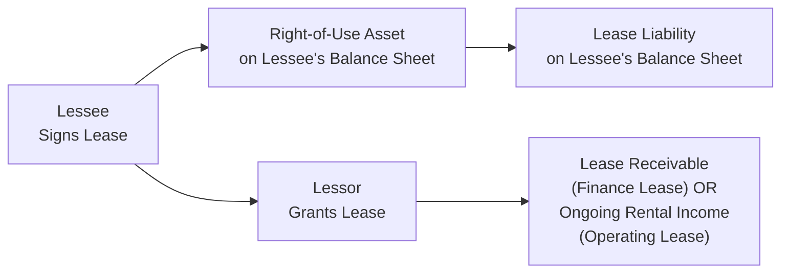
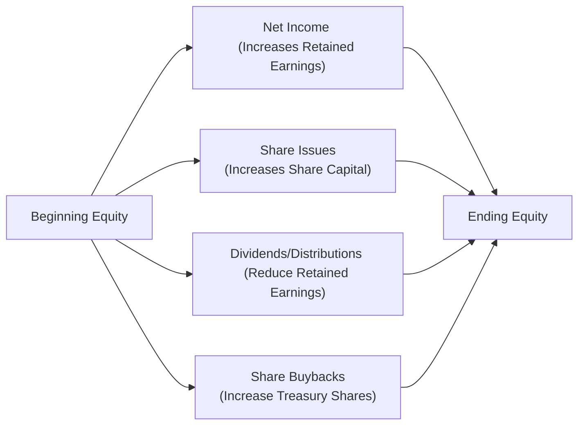

## 4.8 Topics in Long-Term Liabilities and Equity

It’s funny how, back when I first started analyzing company balance sheets, I’d skim right over leases, pensions, and stock-based compensation—assuming, “Ah, that’s just detail.” But oh my, was I mistaken! These items can significantly affect a firm’s financial health, especially when you roll them all together. So in this section, we’ll take a deep dive into the important stuff: lease accounting (from both the lessee and lessor perspectives), the labyrinth of defined benefit vs. defined contribution pension plans, and the intriguing world of stock-based compensation. We’ll also explore how these topics impact disclosures of long-term liabilities and equity—things like share capital, treasury shares, and retained earnings. Let’s jump right in.

---

### Key Considerations in Lease Accounting

Let’s start with leases. Why are they so important? Because leases often represent significant financing and operating arrangements that can drastically shift a company’s reported assets and liabilities. On top of that, under both IFRS and US GAAP, the rules have changed over the years to bring more leases onto the balance sheet. The upshot is that you, as an analyst, need to be aware of how these rules influence reported debt levels, profitability metrics, and overall solvency.

#### Lease Accounting Under IFRS and US GAAP

Under IFRS (International Financial Reporting Standards), the main standard for lease accounting is IFRS 16. US GAAP has its own standard, ASC 842. Both sets of rules require most leases—except for some short-term or low-value exceptions—to be recognized on the balance sheet at the present value of future lease payments (i.e., as a Right-of-Use asset with a corresponding Lease Liability).

• Under IFRS 16:
  – Lessees generally classify all leases as “finance” from the lessee perspective, meaning they bring a right-of-use asset and a liability onto the balance sheet.  
  – Lessor accounting remains more or less consistent with older standards, distinguishing between operating and finance leases based on whether the risks and rewards of ownership have substantially transferred.

• Under US GAAP (ASC 842):
  – Lessees have two classifications of leases: finance leases and operating leases.  
  – Both finance and operating leases are recorded on the balance sheet (Right-of-Use asset and a lease liability). However, the pattern of expense recognition in the income statement differs:  
    • Finance lease expenses are split between depreciation of the asset and interest on the liability.  
    • Operating lease expenses are recorded typically as a single lease expense recognized straight-line over the lease term, even though the asset and liability are physically on the balance sheet.  
  – Lessor accounting still distinguishes between sales-type, direct financing, and operating leases, depending on the degree of risk and reward transferred.

Here’s a quick visual representation of how a simple lease might look for a lessee versus a lessor:

Even though that diagram might seem straightforward, the actual accounting can get complicated. But the high-level gist is: The lessee usually ends up capitalizing the lease and recognizing a related liability, while the lessor shows either a receivable if it’s a finance lease (plus any residual asset, if applicable) or continues to show the leased asset if it’s an operating lease.

#### Impact on Financial Ratios

Once you start capitalizing leases, the company’s balance sheet can look quite different:

• **Debt Ratios**: Because lease liabilities are recognized on the balance sheet, the reported debt often shoots up, making leverage (Debt-to-Equity) ratio higher. If you’re using older statements from pre-IFRS 16 or pre-ASC 842 eras, be extra cautious when comparing to more recent statements.

• **Asset Turnover**: Capitalizing a lease increases total assets due to the Right-of-Use asset. That typically reduces asset turnover ratios (e.g., Sales/Total Assets), possibly making the company look less efficient if you don’t factor in the new reporting rules.

• **Profitability**: Under finance lease accounting, earlier years see higher interest expense (as the liability is larger initially) and higher depreciation, sometimes front-loading expenses. But with operating lease classification under US GAAP, the single straight-line expense can look different, making direct comparisons a bit tricky.

In sum, if you’re analyzing two companies with identical economic realities but different lease classifications, you might see major disparities in their reported debt or profitability. So keep an eye out for that.  

---

### Defined Contribution vs. Defined Benefit Pension Plans

Now, let’s pivot to pension plans. At a previous job, I remember the CFO telling me: “Don’t let the pension footnotes fool you—there’s a lot going on behind the scenes.” And, well, it’s so true.

#### Defined Contribution Plans

Defined contribution (DC) plans are the simpler arrangement. The employer promises to contribute a fixed amount (e.g., a percentage of each employee’s salary) to a retirement account, often matching employee contributions up to a point. Once the company makes its required contribution, the liability from the employer’s perspective is basically done. The investment risk rests with the employee, who controls the retirement account.

From an accounting standpoint, that means:
• The employer’s expense is recognized in the period the contribution is made.  
• There’s no large ongoing pension liability to record, because the company has no further obligation beyond making those contributions.

So if you see a company that has mostly DC plans, then pension complexities are usually low.  

#### Defined Benefit Plans

Defined benefit (DB) plans, on the other hand, promise employees a specific payout at retirement—often described through a formula that takes into account factors such as final salary, years of service, etc. Because the employer guarantees this benefit, the responsibility for funding it rests with the company. And here’s where the fun begins.

• **Actuarial Assumptions**: The company has to estimate life expectancy, discount rates, employee turnover, expected returns on plan assets, and salary increases. Small changes in these assumptions can create big swings in the plan’s funded status.  
• **Funded Status**: The difference between the pension plan’s assets and the present value of the pension obligation. On the balance sheet, this can be shown as a net pension asset (if plan assets exceed obligations) or a net pension liability (if obligations are higher than plan assets).

In KaTeX terms, a basic representation of the net pension liability (or asset) is something like:


\text{Net Pension Liability (Asset)} = \text{Projected Benefit Obligation} - \text{Plan Assets}


Where:
- Projected Benefit Obligation (PBO) is the actuarial present value of all future pension benefits owed to current and future retirees, based on expected salary growth.
- Plan Assets represent the investments held in trust to meet the future retirement benefits.

If the result is positive, you’ve got a net pension liability. If it’s negative, you’ve got a net pension asset (overfunded plan). The degree of underfunding or overfunding can significantly affect the company’s solvency outlook. 

#### Analyzing the Funding Status and Actuarial Assumptions

You’ll want to look closely at the pension footnotes for:
• Discount rates used in valuing the obligation.  
• Expected long-term rate of return on plan assets.  
• Demographic assumptions (e.g., mortality rates, workforce turnover).  
• Contribution history and the company’s plans to remedy underfunding, if any.

These assumptions can have a huge effect on reported net income, especially because gains or losses on plan assets might show up in other comprehensive income or directly on the income statement depending on the standards. So from an analytical standpoint, watch out for changes in assumptions used to “manage” earnings.

---

### Stock-Based Compensation

Let’s talk about stock-based compensation next. I distinctly recall a friend who joined a tech startup a few years ago; he was so excited about his stock options but had almost no idea how they’d be accounted for. From a corporate perspective, stock-based compensation can be a powerful way to align employee incentives with shareholders—while also raising interesting accounting questions about expense recognition and equity dilution.

#### Measuring Fair Value

Under IFRS 2 (Share-Based Payment) and US GAAP (ASC 718, Compensation—Stock Compensation), companies must measure the fair value of equity awards (like stock options or restricted shares) at the grant date. For stock options, this often involves option-pricing models such as Black-Scholes or binomial models. Key assumptions include the stock’s volatility, the risk-free interest rate, and expected dividend yield, among others.

#### Expense Recognition Over Vesting Period

Companies typically spread the total grant-date fair value of an award as an expense over the vesting period, matching the period in which the employee is providing services. So, for a four-year vesting schedule, the expense is recognized (straight-line, unless there’s a different pattern of vesting) over four years. This can cause an incremental decrease in reported net income each year, but it’s not going to consume cash flows because, well, it’s not an immediate cash expense.

#### Dilutive Effect on Earnings Per Share

One important consideration is the dilutive effect on earnings per share (EPS). Because employees can exercise their options (or earn their restricted shares) over time, the weighted-average number of shares outstanding might increase. This will lower the company’s EPS calculation if you’re dealing with a large number of stock awards. Be sure to look at the footnotes to see the reconciliation between basic and diluted EPS. If you see a big difference, that might indicate the presence of significant stock options, warrants, or convertible securities that are dilutive.

---

### Disclosures for Long-Term Liabilities and Equity

By now, you might be feeling that there’s a whole universe of detail around long-term liabilities and equity. Maybe you’re thinking, “So, where do I find all this stuff?” The answer is typically in the notes to the financial statements. Let’s break it down.

#### Long-Term Liabilities

• **Lease Liabilities**: You’ll find a maturity analysis that shows how many lease payments are due within one year, between one and five years, and beyond five years. This helps you understand cash flow commitments.  

• **Pension Obligations**: Companies must disclose things like the fair value of plan assets, the projected benefit obligation, the discount rate used, expected return assumptions, and contributions. The footnote might also mention sensitivity analyses (e.g., how much the PBO changes if the discount rate goes up or down by 1%).

• **Other Long-Term Debt**: Any bonds payable, notes, or debentures with their respective interest rates, maturities, and covenants.

#### Share Capital, Treasury Shares, and Retained Earnings

Equity is, in many ways, the lifeblood of a corporation—representing ownership interests. Most of the time, the disclosure will show:

• **Share Capital (Common Stock / Preferred Stock)**: Disclosures often include the number of authorized shares, the number of shares issued, and the par value.  

• **Treasury Shares**: These are shares the company has repurchased. They reduce shareholders’ equity on the balance sheet. Many companies buy back shares to return capital to shareholders or to offset dilution from stock-based compensation programs.  

• **Retained Earnings**: This is the cumulative net income the company has kept rather than distributed as dividends. Watch for any large or unexpected changes, which might be explained by unusual charges, changes in pension assumptions, or other comprehensive income items. 

When companies repurchase stock (treasury shares), it reduces the amount of outstanding stock in the market. That often increases metrics like EPS (and we all know managers love a good EPS boost!). But it also increases the company’s leverage if the buyback was financed with debt. So you might see changes in solvency ratios and returns on equity.

---

### Practical Example: Lease Buyback and Impact on Ratios

Imagine a scenario where Company X has opted to lease a large warehouse for 10 years. Under the new lease standards, it recognizes a Right-of-Use asset of $2 million and a corresponding Lease Liability of $2 million. This increases both assets and liabilities by the same amount initially. The CFO then decides to repurchase $500,000 worth of common shares using existing cash. Now, you have:

• Higher debt (from the added lease liability).  
• Slightly lower equity (since the buyback reduces share capital or increases negative treasury shares).  
• Possibly better EPS in the short run, because you have fewer outstanding shares, but your total leverage position is riskier.

So analyzing the combined effect on leverage ratios (Debt/Equity), coverage ratios (EBITDA/Interest Expense), and EPS is key. Companies sometimes manage these signals carefully.

---

### Mermaid Diagram of Equity Movements

Let’s illustrate the typical movements in equity with a simplified diagram:

This is, of course, a very simplified look. Actual footnotes will detail each movement in the statement of changes in equity.

---

### Best Practices and Common Pitfalls

• **Lease Classification**: Make sure you understand whether it’s operating or finance (capital) under GAAP. Comparisons across IFRS vs. US GAAP can be tricky if you don’t carefully parse the footnotes.  
• **Pension Analysis**: Watch out for large assumptions that significantly affect the projected benefit obligation. Companies might use a higher expected return on assets to reduce pension expense, but that might not be realistic.  
• **Stock-Based Comp**: Overlook the incremental share count at your peril! As new stock-based awards vest, they can dilute ownership and EPS.  
• **Disclosures**: Always read them. Sounds obvious, but it’s tempting to skip. The best insights often hide in the footnotes describing the nature of the obligations, the terms, and the assumptions.  

---

### Encouraging Continuous Learning

We’ve covered a lot of ground. If you find some of these issues puzzling—like “Why does a small change in discount rate blow up the pension liability?” or “How do managers decide between an operating lease and a finance lease classification for intangible assets?”—don’t worry. It takes time, repeated exposure, and, sure, an occasional head-scratching moment to get comfortable.

---

### Glossary

• **Finance Lease (Capital Lease)**: A lease in which substantially all risks and rewards of ownership are transferred to the lessee.  
• **Defined Benefit Plan**: A pension plan guaranteeing a specific retirement benefit; it’s subject to both actuarial and investment risk from the employer’s perspective.  
• **Stock-Based Compensation**: Non-cash compensation to employees/executives using shares, options, or other equity instruments, typically measured at fair value and expensed over the vesting period.

---

### References & Further Reading

• **IFRS Standards**:  
  – IAS 19 “Employee Benefits”  
  – IFRS 2 “Share-Based Payment”  
  – IFRS 16 “Leases”  

• **US GAAP (FASB ASC)**:  
  – ASC 715 “Compensation—Retirement Benefits”  
  – ASC 718 “Compensation—Stock Compensation”  
  – ASC 842 “Leases”  

These are well worth reviewing if you want a deeper dive or the official word on the intricacies of these topics.

---

## Test Your Knowledge: Comprehensive Long-Term Liabilities & Equity Quiz



### 1. Under IFRS 16, how are most leases classified from the lessee’s perspective?

- [ ] Operating leases recognized off-balance sheet.  
- [x] All significant leases recognized as a right-of-use asset and a corresponding liability.  
- [ ] Only short-term leases recognized as liabilities.  
- [ ] Sales-type leases recognized as intangibles only.  

> **Explanation:** IFRS 16 generally requires lessees to recognize a right-of-use asset and a lease liability for virtually all leases (except for short-term or low-value ones).

### 2. When analyzing a company's leverage, what effect does capitalizing an operating lease (under ASC 842 or IFRS 16) typically have?

- [x] It increases both total assets and total liabilities.  
- [ ] It only increases total assets, leaving liabilities unchanged.  
- [ ] It only impacts equity.  
- [ ] It decreases the debt-to-equity ratio.  

> **Explanation:** Capitalizing a lease brings an asset and a liability onto the balance sheet, increasing both assets and liabilities and thus often increasing leverage ratios.

### 3. Which of the following best describes a defined contribution pension plan?

- [ ] The employer promises a fixed retirement benefit based on salary and service.  
- [ ] The employer bears the entire investment risk of the plan assets.  
- [ ] Actuarial assumptions are required for measuring the pension liability.  
- [x] The employer’s obligation is limited to the contributions it commits to make.  

> **Explanation:** In a defined contribution plan, the company’s obligation is limited to its contributions. Investment risk falls on the employee.

### 4. Under a defined benefit plan, the net pension liability on the balance sheet is determined by:

- [ ] The difference between the total employee contributions and total plan payments.  
- [x] Projected benefit obligation (PBO) minus fair value of plan assets.  
- [ ] Present value of future healthcare costs.  
- [ ] The difference between actuarial gains and losses over several periods.  

> **Explanation:** The most relevant formula is: Net Pension Liability (Asset) = PBO – Plan Assets. A positive amount indicates an underfunded plan.

### 5. For stock-based compensation, why is the fair value of an option typically measured at the grant date?

- [x] Because that is when the employee has the right to receive the future benefit, and the cost is established.  
- [ ] Because waiting until exercise provides the most accurate measure of actual cost.  
- [ ] Regulatory requirements specify measuring at vesting, not grant date.  
- [ ] The expense is not recognized until the employee actually exercises.  

> **Explanation:** Both IFRS and US GAAP require measuring the fair value of the equity instrument at the grant date, as that is when the employer-employee agreement is effectively made.

### 6. Which statement best describes the impact of stock-based compensation on a company’s EPS?

- [ ] It has no impact on EPS once the options are granted.  
- [ ] It reduces basic EPS but does not affect diluted EPS.  
- [x] It dilutes the weighted-average number of shares, thereby potentially reducing diluted EPS.  
- [ ] It only affects EPS after the award fully vests.  

> **Explanation:** Stock-based awards generally increase the potential number of shares outstanding, thus diluting EPS (particularly diluted EPS).

### 7. A firm repurchases its own shares (recording treasury stock). Which of the following is a direct consequence?

- [x] The number of outstanding shares decreases.  
- [ ] The number of authorized shares decreases.  
- [x] Shareholders’ equity is reduced.  
- [ ] Liabilities increase directly by the repurchase amount.  

> **Explanation:** A share buyback immediately decreases the outstanding shares in the market. The purchase of treasury shares reduces shareholders’ equity.

### 8. Under IFRS or US GAAP, which disclosures are you most likely to see for a lease liability?

- [x] Maturity analysis of lease payments due in different time segments.  
- [ ] Details about the CEO’s personal guarantee of lease payments.  
- [ ] A separate line item for each monthly lease payment.  
- [ ] No disclosures beyond the total present value of payments.  

> **Explanation:** Lease liability notes typically include a breakdown by due dates (1 year, 2-5 years, etc.), interest rate assumptions, and any termination or extension options.

### 9. Why might a company with a large unfunded pension liability appear riskier to creditors?

- [x] Because the pension liability competes with other creditors’ claims on the company’s assets.  
- [ ] Because it always means the company has insufficient cash to pay dividends.  
- [ ] Because the discount rate used is always too high.  
- [ ] Because it reflects a short-term issue only.  

> **Explanation:** A large unfunded pension liability can reduce the firm’s available assets for paying off other creditors if the pension funding needs rise, indicating a higher risk to lenders.

### 10. When a firm reports stock-based compensation, it is:

- [x] True that it typically represents a non-cash expense that reduces net income.  
- [ ] False; stock-based compensation does not affect net income at all.  

> **Explanation:** Although stock-based compensation doesn’t require an immediate cash outflow, it’s still recognized as an expense, reducing reported net income over the vesting period.


