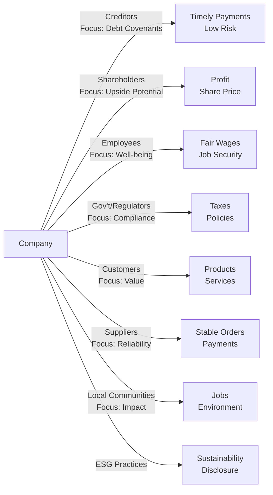

## 5.2 Investors and Other Stakeholders

Sometimes when I'm chatting with friends or colleagues about corporate finance, I get asked questions like, “So, who actually has a stake in a big company’s decisions?” The short answer is: a LOT of people. It’s not just the folks who own shares in the company (though they’re obviously a big part of the picture!). You’ve got lenders, employees, regulators, the communities around company facilities, and so on. Now, I’ll admit, it can be a bit overwhelming to think about all these different perspectives at once. But if you’re aiming to be a well-rounded finance professional, understanding each of these perspectives is a total game-changer.

Below, we’ll examine the various stakeholder groups that typically surround a corporate issuer, compare their motivations, discuss potential conflicts, and show how aligning (or at least partially aligning) everyone’s interests can preserve or even boost the overall value of a firm. After all, when your employees are unhappy, your customers might eventually feel that tension, and that can trickle into the bottom line. Let’s walk through the major groups—plus a few that might surprise you—and see just what they want from a company.

---

### Identifying Key Stakeholders

One simple way to think of stakeholders is any person or entity with something to gain—or lose—from a company’s activities. By that definition, we have a big tent of interested parties. Let’s break them down.

#### Lenders (Creditors)

Lenders are institutions or individuals that provide debt financing, such as banks that issue commercial loans or investors who buy corporate bonds. Yeah, these folks are mostly concerned with one question: “Will I get my money back?” They want timely interest payments and eventual repayment of principal. 

• Claim on Assets: In general, lenders have a higher priority claim on the company’s assets than shareholders, particularly if the company folds.  
• Main Motivation: They are primarily focused on lower default risk, consistent cash flow coverage, and compliance with covenants.  

Frankly, if you think about it from a lender’s perspective—whether it’s a bank or an individual bondholder—they don’t care if the company’s share price doubles overnight. Their main concern is that the company never defaults on interest or principal. That’s it: stable returns, minimal risk.

#### Shareholders (Equity Investors)

Shareholders, by contrast, typically provide equity funding in exchange for fractional ownership in the company.  
• Claim on Assets: They are last in line when it comes to claims on assets if a firm liquidates.  
• Main Motivation: Shareholders aim to maximize the company’s value, which ideally translates to a rising share price and possibly dividends along the way.  
• Upside: Unlike creditors, there is no cap on how much they can earn if the company grows.  

Now, I recall a friend who invested in a tiny startup that ended up getting acquired for millions of dollars. The lenders just got their interest plus principal, sure, but the shareholders? They walked away with a handsome chunk of profit. That’s the magic of equity ownership—though it does come with higher risk.

#### Employees

I guess it’s easy to forget that many companies’ biggest fans—and critics—are their own employees. They invest their time, talent, and labor in the firm.  
• Main Interests: Fair compensation, career growth, job security, and sometimes intangible factors like company culture or social impact.  
• Influence: Skilled employees can influence company strategy (especially at higher levels or within specialized roles).  

A company that fosters a healthy relationship with its employees may see high productivity, innovation, and loyalty. If employees are feeling ignored or short-changed, though, it can lead to turnover, low morale, and a negative reputation—none of which is profitable in the long run.

#### Customers

No matter how sophisticated a company’s financing strategy is, it can’t survive without customers.  
• Main Interests: Quality products or services, fair pricing, reliability, good customer support, and brand trust.  
• Influence: Feedback loops, public reviews, and social media can make or break reputations quickly.  

Personally, I always read a ton of reviews before purchasing electronics. If I see that customers are ranting about poor quality, I’ll skip that brand immediately. So, it’s not rocket science that companies need to manage customer relationships carefully.

#### Suppliers

Suppliers provide the raw materials, components, or services that companies need. And they’re not just passive participants.  
• Main Interests: Consistent orders, timely payments, and stable relationships.  
• Influence: A crucial supplier can cause major headaches if it decides to stop working with you—or raises prices.  

For instance, a smartphone maker relies heavily on chip manufacturers. If that chip supply chain gets disrupted or the supplier demands more money, the phone maker could face lower profit margins or production halts. Thus, maintaining strong relationships with suppliers is often mission-critical.

#### Government and Regulators

Companies don’t exist in a vacuum. Governments and regulatory bodies set the playing field—and they can blow the whistle if a firm breaks rules.  
• Main Interests: Collecting taxes, ensuring compliance with laws, protecting the public interest (e.g., environmental safeguards, antitrust rules), and maintaining fair markets.  
• Influence: Regulations, licensing, fines, or litigation can drastically impact corporate strategies.  

I once witnessed a firm that had to pay a massive environmental fine. Management had overlooked some local compliance requirements. The aftermath? A serious dent in profits and a tarnished reputation. Ultimately, that’s a big reason why investor relations teams keep an eye on regulatory changes.

#### Local Communities

It’s easy to forget the communities around company offices or factories, but local residents are definitely stakeholders.  
• Main Interests: Job opportunities, minimal environmental impact, economic development, and social contributions.  
• Influence: Public opinion, local activism, or lobbying can significantly shape a company’s operational decisions.  

A firm that invests in local community infrastructure—like building schools or healthcare centers—can earn goodwill, attract better employees, and strengthen local ties. On the other hand, environmental mishaps, layoffs, or negative headlines can spark outrage and hamper future expansion plans.

---

### Comparing Lenders and Shareholders: Motivations and Financial Claims

Two groups that are often at odds—or at least have different priorities—are lenders and shareholders. Financially, they hold different claims on a firm’s assets and returns.

• Creditors:  
  – Priority in Liquidation: They are first in line when a company is liquidated.  
  – Fixed Income: They earn interest at a rate the company promises in the loan terms or bond indenture.  
  – Risk Profile: They are relatively lower risk and get no direct share of corporate upside beyond the agreed-upon interest.  

• Equity Investors:  
  – Residual Claim: If the business dissolves, they are last to get paid—if anything remains.  
  – Potential Unlimited Upside: If the business soars, shareholders can see their shares appreciate dramatically.  
  – Risk Profile: Potentially higher risk, but with higher reward.  

To capture this difference in more formulaic terms, we can think of the core “residual” equation:


E = A - L


Where:  
• \\( E \\) = Equity value.  
• \\( A \\) = Assets of the company.  
• \\( L \\) = Liabilities (to lenders/creditors).  

If \\( A \\) grows significantly while \\( L \\) stays constant, \\( E \\) grows substantially. This directly reflects how equity valuation can benefit from growth in the firm’s asset base, while lenders still receive a fixed return.

---

### Stakeholder Interests in Depth

Although shareholders and creditors hog the spotlight in many corporate finance discussions, other stakeholders bring crucial dimensions to the table.

• Shareholders: Typically want higher share prices, consistent or growing dividends, and robust governance to prevent management from misusing resources.  
• Lenders (Creditors): Want the company to maintain healthy cash flows and conservative leverage so they can be sure they’ll be repaid.  
• Employees: Might seek not just compensation but also stability, career development, and a positive work environment.  
• Customers: Want reliability, good pricing, and decent service.  
• Communities: Care about environmental footprints, community development, and local employment opportunities.  

On top of that, many stakeholders pay closer attention than ever to corporate ethics and sustainability. This is where ESG considerations become critical.

---

### ESG (Environmental, Social, and Governance) Factors

I remember back when the term “ESG” hardly ever made it into mainstream finance discussions. Now? You see it everywhere—from marketing brochures to board meeting agendas. ESG stands for Environmental, Social, and Governance:

• Environmental: Greenhouse gas emissions, carbon footprints, water usage, recycling initiatives, and overall climate impact.  
• Social: Labor conditions, diversity and inclusion, product safety, supply chain ethics, and philanthropic efforts.  
• Governance: Board structure, shareholder rights, executive compensation, internal controls, and anti-corruption measures.  

Investors and lenders increasingly assess ESG performance to gauge risk and identify long-term value. Why? Because a company that, say, dumps toxic chemicals into a river might eventually face lawsuits or lose customers, which can negatively impact financial performance. Meanwhile, a firm with robust employee wellness programs and a forward-thinking board might attract top talent and reduce legal and reputational risks.

Let’s illustrate a simple conceptual map of stakeholders and how ESG touches each area:

This kind of holistic, integrated perspective helps you see that ESG isn’t just a “nice-to-have.” It interacts with how each stakeholder perceives and supports the company.

---

### Conflicts Among Stakeholders

Alright, let’s dig into the messy part: conflicts. Because let’s be real, with so many voices in the room, not everyone will agree on everything.

• Shareholders vs. Creditors: A classic conflict arises when company management decides to pay out big dividends (or to repurchase shares) rather than reinvest in the business or reduce debt. This benefits shareholders in the short-term but can create risk for creditors, making them uneasy about future calls on capital.  

• Management vs. Employees: Suppose a company faces lean times. Management might cut wages, reduce benefits, or downsize staff to keep margins afloat, but that obviously clashes with employee interests for stable employment and compensation.  

• Management vs. Shareholders: While not strictly covered above, there’s also the principal-agent problem, where managers might pursue personal agendas—extravagant executive perks, empire-building expansions—over maximizing shareholder wealth.  

• Local Communities vs. Shareholders: A company might want to build a new facility to expand production, but communities may oppose it if they’re worried about pollution or noise.  

Any one of these conflicts can blow up if not handled carefully, leading to reputational damage or costly legal battles (both of which make lenders and investors quite nervous).

---

### Methods of Aligning Stakeholder Interests

If you’re thinking, “Ugh, so many conflict points—how do companies survive?” well, they do indeed have a few strategies:

#### Covenants in Loan Agreements

Covenants are contractual stipulations often included in bond indentures or loan agreements. For instance, creditors might require that a firm maintain a certain debt-to-equity ratio or restrict how much it can pay out in dividends. This helps ensure that shareholders (and management) don’t undermine the company’s ability to repay debts by funneling too many resources away from the business.

#### Managerial Incentive Plans

Executive compensation can be tied to specific performance goals (e.g., earnings per share, return on equity, ESG targets) rather than just short-term stock price spikes. By making management partly accountable for environmental or social performance, companies can reduce the risk that managers turn a blind eye to issues that might harm the firm’s long-term value.

#### Corporate Social Responsibility (CSR) Initiatives

CSR programs like volunteer efforts, charitable donations, or philanthropic investments in the local community can build goodwill and trust. It might feel altruistic, but in many cases, it’s also strategic—companies want to maintain a strong reputation and avoid negative public sentiment that can hurt the bottom line.

Whether it’s awarding employees stock options or establishing committees to address community concerns, there are multiple ways to reduce friction among stakeholders. It’s far from perfect—nobody’s illusions about that—but these structures lessen the risk that one group’s interests overshadow everyone else’s.

---

### Analyzing Stakeholders from the Investment Perspective

So, from an investor’s standpoint, what do you do with this knowledge? When you’re researching a potential investment—be it a bond or an equity stake in a company—you want to look at how the company manages its stakeholder relationships and whether there are any big red flags.

• Conflict Identification: Are there major tensions between management and labor that could disrupt production?  
• ESG Reporting: Does the company disclose relevant environmental or social metrics, and is it transparent?  
• Covenant Compliance: Are credit ratios healthy, indicating low default risk, and is the company abiding by all covenant requirements?  

Reading annual reports, sustainability reports, or engaging in shareholder activism are all ways to gather intelligence about how well a firm juggles its stakeholder relationships. If you see significant friction or lawsuits, that might be your cue to think twice about investing—or at minimum discount your valuation.

---

### Impact of Stakeholder Relationships on Firm Value

Let’s be practical: can strong stakeholder relationships actually boost a company’s value? Yes. Actually, it can:

• Reduced Litigation Risk: Good environmental practices and mindful employee relations can reduce the risk of lawsuits or regulatory fines.  
• Positive Brand Image: Satisfied customers and supportive communities enhance brand reputation, indicating smoother operations and less friction.  
• Higher Employee Productivity: If employees are engaged and well-compensated, they typically perform better, innovate more, and reduce turnover costs.  
• Lower Financing Costs: Creditors might charge lower interest rates if they see prudent risk management and stable stakeholder relationships.  

In short, building a balanced stakeholder culture can translate to lower business risks and more consistent cash flows, which often leads to a higher valuation multiple. Of course, it’s not a foolproof formula—plenty of complexities exist—but it’s a path that more modern companies consider essential rather than optional.

---

### Glossary

• **ESG (Environmental, Social, Governance):** Criteria used to evaluate a company’s sustainability and societal impact.  
• **Creditors (Lenders):** Individuals or institutions that extend credit to a firm, expecting interest and principal repayment.  
• **Debt Covenant:** Contractual stipulation in a debt agreement designed to protect lender interests.  
• **CSR (Corporate Social Responsibility):** Corporate initiatives that promote positive social and environmental impact.  
• **Stakeholder:** Any party with a vested interest in the firm’s activities or outcomes (including shareholders, employees, suppliers, etc.).  
• **Conflict of Interest:** A situation where a party’s obligations to different stakeholders may be at odds.  
• **Shareholder Activism:** Owners using their equity stake to influence corporate governance or strategic direction.  
• **Sustainability Reporting:** Formal disclosure of a company’s environmental, social, and governance performance.

---

### References and Further Reading

- CFA Institute Level I Curriculum (Corporate Issuers).  
- “Corporate Governance and Stakeholder Conflict,” Journal of Business Ethics.  
- “ESG Integration in Corporate Finance” by CFA Institute Research Foundation.  

If you’re keen on diving deeper, the official CFA Institute curriculum is always an excellent starting point. In my opinion, it’s super thorough on the mechanics of stakeholder management and the ways it intersects with governance. All in all, as you progress in your studies or career, remember that companies—like any ecosystem—are composed of a network of interdependent interests. Recognizing and balancing them can truly be the difference between a company that thrives and one that flounders.

---

## Test Your Knowledge: Investors and Other Stakeholders Quiz



### Which stakeholder group is primarily focused on timely interest payments and principal repayment?

- [ ] Shareholders
- [x] Lenders/Creditors
- [ ] Employees
- [ ] Customers

> **Explanation:** Lenders (or creditors) care most about receiving interest payments and eventually having their principal repaid. This is in contrast to shareholders who invest for potential capital appreciation and dividends.

### Why do shareholders generally have an “unlimited upside” in a firm’s success?

- [ ] They are first in line for repayment in bankruptcy.
- [ ] They receive fixed interest payments on their equity.
- [x] Their returns increase with the company’s profits and share price appreciation.
- [ ] They are not required to comply with market regulations.

> **Explanation:** Equity holders have a residual claim on the firm's assets and income. After paying all other obligations, any additional revenue or profit can lead to share price increases, giving shareholders uncapped growth potential.

### Employees, as stakeholders, are most likely to be concerned about which of the following?

- [ ] Changes to the prime lending rate
- [ ] Dividends and share price volatility
- [ ] Regulatory changes affecting product labeling
- [x] Job security, fair compensation, and growth opportunities

> **Explanation:** Employees typically focus on maintaining or improving their wages, benefits, and career development, making these their primary concerns in any corporate setting.

### From a corporate perspective, which stakeholder group typically cares most about product quality and reliability?

- [ ] Suppliers
- [ ] Government
- [x] Customers
- [ ] Communities

> **Explanation:** Customers evaluate a firm based on the value, quality, and reliability of the products and services provided.

### A firm decides to increase dividends significantly instead of paying off debt. Which stakeholder group’s interests might be most negatively impacted?

- [x] Lenders/Creditors
- [ ] Employees
- [ ] Customers
- [ ] Suppliers

> **Explanation:** This move might increase the company's financial risk by diverting cash that could have been used to repay or reduce debt. Thus, creditors see higher risk regarding debt repayment.

### Which of the following best describes the “principal-agent” problem in a corporation?

- [x] A conflict where managers act in their own interests rather than shareholders’ interests
- [ ] Lenders refusing to extend credit due to covenant concerns
- [ ] Employees negotiating for higher wages
- [ ] Government regulators enforcing environmental laws

> **Explanation:** The principal-agent problem arises when corporate executives (agents) make decisions that do not align with the best interests of the shareholders (principals).

### Why might a government or regulator be considered a key stakeholder of a firm?

- [ ] They grant stock options to employees.
- [ ] They cannot influence corporate behavior.
- [x] They ensure compliance with laws, collect taxes, and enforce regulations.
- [ ] They provide unlimited financing to corporations.

> **Explanation:** Government and regulators are stakeholders because they impose rules, collect taxes, and oversee compliance. Their actions directly affect how a company operates.

### Which approach can help align the goals of management and shareholders?

- [ ] Reducing transparency in financial statements
- [ ] Paying zero dividends
- [ ] Providing unlimited executive bonuses without performance criteria
- [x] Linking executive compensation to specific performance targets

> **Explanation:** When management’s compensation is tied to performance metrics (e.g., earnings per share, share price, ESG goals), it better aligns managers’ interests with shareholders’ objectives.

### How might local communities benefit from strong stakeholder relationships with a firm?

- [ ] By receiving direct dividends from the firm’s profits
- [x] Through job creation, community programs, and minimized environmental damage
- [ ] By setting all corporate governance standards
- [ ] By having no accountability over the firm’s operations

> **Explanation:** Local communities often benefit from employment opportunities, community development, and lower environmental risks when a company maintains robust stakeholder engagement.

### True or False: A misalignment of stakeholder interests can reduce a firm’s value.

- [x] True
- [ ] False

> **Explanation:** Severe conflicts among stakeholders—such as creditors vs. shareholders or management vs. employees—can lead to inefficiencies, lawsuits, reputational damage, and other issues that erode corporate value.


