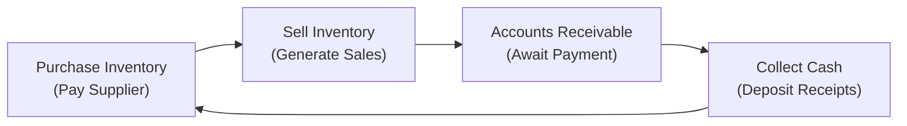

## 5.4 Working Capital and Liquidity

Working capital and liquidity management can sometimes feel like a mystery, especially when you’re first learning about corporate finance. I remember helping a friend who ran a small cafe: They were confused about having cash in the bank one week, then being short the next. So let's slow down, take a closer look, and demystify what working capital is all about, why it matters, and how finance professionals juggle these pieces daily.

### Understanding Working Capital

Working capital, in its simplest form, is all about making sure a firm can cover its day-to-day operations without running out of cash. It is traditionally defined as:


\text{Working Capital} = \text{Current Assets} - \text{Current Liabilities}.


• Current Assets might include things like cash, marketable securities, accounts receivable, and inventory—basically, assets that can be converted to cash within one year (or one operating cycle if that’s longer).  
• Current Liabilities are obligations the company must settle in the same period—like short-term debt, accounts payable, and accrued expenses.

Strong working capital management means the company has enough cash and near-cash resources to handle its short-term obligations—like paying salaries, stocking up on inventory, or covering immediate bills. It also provides a buffer for unexpected emergencies. If a firm runs out of working capital, it’s like running out of gas mid-journey.

### The Cash Conversion Cycle (CCC)

Another way to see how effectively a company manages its short-term resources is by measuring the length of time it takes to convert resources (inventory, payables, receivables) into cash. That’s the Cash Conversion Cycle (CCC). It tracks the span from paying suppliers for inventory to collecting money from customers. Generally, a shorter CCC indicates more efficient working capital management because money isn’t tied up in the process for too long.

You’ll often see the CCC broken down like this:


\text{CCC} = \text{Days Sales Outstanding (DSO)} + \text{Days Inventory on Hand (DOH)} - \text{Days Payables}


• Days Sales Outstanding (DSO) captures the average number of days it takes for customers to pay their invoices.  
• Days Inventory on Hand (DOH) estimates how long inventory sits on the shelf (or in the warehouse) before it gets sold.  
• Days Payables measures how long a company can wait before it must pay its suppliers or vendors.

If you’re anything like me, you might think, “Ah, so we actually want each of these to be as efficient as possible—lower DSO, lower DOH, and higher Days Payables—but not so high that we stress relationships with suppliers.”

### Liquidity Assessment

When I was first studying for finance exams, the liquidity ratios seemed like magical barometers of a firm's short-term strength. Let’s look at the big two:

• Current Ratio


\text{Current Ratio} = \frac{\text{Current Assets}}{\text{Current Liabilities}}


This ratio takes into account all current assets and divides them by all current liabilities. A ratio above 1 often suggests that the firm has enough resources to pay off its short-term debts. But bigger isn’t always better; a very high ratio might mean you’re not deploying resources efficiently.

• Quick (Acid-Test) Ratio


\text{Quick Ratio} = \frac{\text{Cash + Marketable Securities + Receivables}}{\text{Current Liabilities}}


This ratio excludes inventory and other less-liquid assets to focus on truly liquid stuff—assets that can quickly be converted to cash. Generally, a quick ratio of less than 1 might be a red flag that the firm could struggle with sudden obligations.

### Managing Accounts Receivable

Accounts Receivable (AR) represents money owed by customers. If your credit terms are too lax, you might be waiting forever and risking bad debts. If they’re too strict, you might drive away potential customers who prefer more flexible payment terms. It’s a balancing act.

• Credit Policy: A company’s credit policy involves deciding how much credit to extend, for how long, and what discounts (if any) to offer for early payment. For instance, some companies offer “2/10, net 30,” meaning a 2% discount if the customer pays in 10 days, or the total is due in 30 days.  
• Collection Practices: Monitoring AR aging schedules is crucial. If unsettled invoices pile up, your liquidity can take a hit, even if your sales are strong. Many firms implement user-friendly digital invoicing systems or even factor their receivables to speed up cash inflows.

### Inventory Management

The trick with inventory is straightforward in theory: hold enough to meet demand, but not so much that it gathers dust. In practice, it can get complicated—like a game of Tetris where each piece has a cost of holding and potential revenue gain.

• Just-in-Time (JIT): A strategy to keep minimal inventory by timing purchases and production precisely, reducing holding costs.  
• Economic Order Quantity (EOQ): A formula that aims to minimize the total of ordering costs and holding costs by calculating the optimal order size.  

But real life can get in the way—sometimes you’ll run out of a key component if you’re too lean on inventory. On the other hand, too much stock can tie up working capital. Anyway, the best approach is to tune your models frequently, watch fluctuations in demand, and coordinate with suppliers for timely deliveries.

### Accounts Payable Management

I once talked to a supply chain manager who joked: “We love to pay suppliers as late as humanly possible without damaging our relationships.” That sums it up nicely: delayed payment improves your firm’s liquidity, but you have to weigh that approach against potential supplier disruptions or lost discounts.

• Trade Credit: The credit you get from suppliers is a big part of working capital. Efficiently managing payables might involve taking advantage of early-payment discounts if they yield a higher return than other investments, or negotiating longer terms if you need extra breathing room.  
• Avoiding Late Payments: Late payments can wreck relationships. If you can’t pay on time, communicate clearly and address it. Some suppliers might even cut you off if they suspect you can’t meet obligations reliably.

### Working Capital Financing

Short-term financing is like a safety net that covers the periodic gaps when payables are due but receivables haven’t come in yet. It’s that scenario we want to avoid—having to beg for cash at the worst possible moment.

• Lines of Credit: A standby arrangement with a bank to give you access to funds up to a certain limit. You only pay interest on the portion you draw.  
• Bank Overdrafts: Like dipping slightly below a zero balance in your checking account—often for a fee.  
• Commercial Paper: Larger, creditworthy corporations can issue short-term unsecured promissory notes to investors.  
• Factoring Receivables: Selling your AR to a factor at a discount for immediate cash.  

Long-term financing (e.g., issuing bonds) can be used for more permanent needs. Matching the financing duration to the asset’s life is often considered a best practice—short-term financing for short-term assets and long-term financing for long-term assets.

### Common Liquidity Management Methods

If you’ve ever watched a cashier quickly deposit the day’s sales to prevent losing them in the safe overnight, you get the core concept: accelerate collections, delay disbursements, and don’t keep idle cash lying around.

• Lockbox Systems: Payments are mailed to a bank-managed PO box. The bank deposits checks quickly, reducing mail and processing float.  
• Zero-Balance Accounts (ZBA): Corporations keep separate disbursement accounts at zero balance. Funds are transferred from a master account only when needed, minimizing idle cash in sub-accounts.  
• Cash Forecasting: Firms often forecast daily, weekly, or monthly cash inflows and outflows, so they can decide whether they need short-term borrowing or if they have surplus cash to invest.  

### Best Practices, Pitfalls, and Strategies

Companies manage working capital differently based on their business model, industry, and risk tolerance. Let’s look at a few suggestions (and potential pitfalls) to keep in mind:

– Maintain Frequent Communication: Keep your sales, purchasing, and finance teams aligned. Inventory, new customer orders, or payment defaults can adversely affect your working capital if you’re not all on the same page.  
– Watch Out for Overly Aggressive Targets: Pushing DSO too low by over-collecting can damage client relationships. Similarly, delaying payment to suppliers just to pad your liquidity can come back to haunt you if your supplier refuses further credit or discounts.  
– Leverage Technology: Automated accounting systems with real-time dashboards often help you detect small problems before they balloon.  
– Be Prepared for the Unexpected: A healthy cushion of working capital can protect your firm from sudden shocks—like an unplanned equipment failure or natural disaster.  
– Balance Short-Term vs. Long-Term Financing: It can be tempting to finance a new computer system with short-term credit, but if you can’t pay off the loan before the asset starts generating sufficient returns, you could end up with a liquidity crunch.

### Real-World Example: The Seasonal Retailer

Imagine a company that sells beachwear primarily in the summer season. During winter, they must maintain enough working capital to purchase inventory well ahead of peak season. Even though sales are slow in the off-season, expenses like salaries, rent, and marketing continue. They rely heavily on lines of credit to finance early inventory. Meanwhile, come summer, the revenue floods in, allowing them to pay down the line of credit rapidly.

In this scenario, the Cash Conversion Cycle fluctuates dramatically across seasons. The strategic approach is to ensure there is enough financing to support the high-volume inventory build, while quickly collecting from retail partners and direct customers. If the summer is surprisingly cold, well, that’s why you keep some extra cushion.

### Visualizing the Working Capital Cycle

To illustrate how funds loop through a business’s working capital, here’s a simple Mermaid diagram showing the flow:

This cycle continues, reflecting the ongoing nature of working capital management and the key role timing plays in maintaining healthy liquidity.

### Conclusion

Working capital is the lifeblood of a company’s daily operations, and good management practices help prevent liquidity crises. By tracking metrics like the Cash Conversion Cycle, maintaining healthy liquidity ratios, and deploying effective strategies for accounts receivable, inventory, and accounts payable, firms can ensure they remain fluid and flexible. Sometimes, a firm’s survival depends less on long-term profitability and more on the ability to pay the bills right now. And remember, there is no “one-size-fits-all” approach—environments differ by industry, company size, risk profile, and even business culture. After all, working capital management is as much art as it is science.

---

### Glossary

• Working Capital: The firm’s short-term liquidity reserve to handle day-to-day operations.  
• Cash Conversion Cycle (CCC): The interval of time needed to convert investments in inventory back into cash flows from sales.  
• Days Sales Outstanding (DSO): The average number of days required to collect cash from credit sales.  
• Liquidity: A firm’s ability to meet short-term obligations promptly.  
• Trade Credit: Credit extended by suppliers, forming part of accounts payable.  
• Financial Flexibility: A company’s capacity to adapt its financing strategies in response to market changes or internal needs.  
• Lockbox System: A cash management tool to accelerate the deposit of customer checks.  
• Just-in-Time (JIT): An inventory strategy minimizing holding costs by receiving goods only as needed to meet production or sales.

### References and Further Reading

• CFA Institute Level I Curriculum (Corporate Issuers).  
• Brigham and Ehrhardt, “Financial Management: Theory and Practice.”  
• Gitman, “Principles of Managerial Finance,” chapters on working capital management.

---

## Practice Questions: Working Capital and Liquidity Fundamentals



### Which of the following best describes the concept of working capital?

- [x] The difference between current assets and current liabilities
- [ ] The sum of all long-term assets
- [ ] The difference between total assets and total liabilities
- [ ] The portion of liabilities payable after 12 months

> **Explanation:** Working capital focuses specifically on short-term assets and liabilities to measure the firm’s day-to-day liquidity.

### A shorter Cash Conversion Cycle (CCC) generally indicates:

- [ ] The company has high-profit margins
- [x] The firm is able to convert inventory to cash more efficiently
- [ ] The firm uses extended payment terms with lenders
- [ ] The company's capital expenditures are lower

> **Explanation:** A short CCC means the firm’s processes — from inventory procurement to customer collection — are streamlined, thus converting investment in working capital back into cash faster.

### If a company’s current ratio is 1.2 while its quick ratio is 0.6, which of the following would likely explain this discrepancy?

- [ ] The company holds very few receivables
- [x] The company holds a large amount of inventory
- [ ] The company’s accounts payable have recently doubled
- [ ] The company has minimal cash balances

> **Explanation:** A large inventory balance can raise the current ratio (since it’s part of current assets) but not the quick ratio (which excludes inventory).

### A firm offers its customers “2/10, net 30” terms. One potential advantage of this policy is:

- [x] Earlier collection of cash, enhancing liquidity
- [ ] Higher overall revenue from sales
- [ ] Stronger inventory turnover
- [ ] Lower cost of labor

> **Explanation:** A discount for early payment encourages customers to pay sooner, reducing days sales outstanding and freeing up cash faster.

### In a Just-in-Time (JIT) inventory system:

- [x] Inventory is obtained just as it is needed for production or sales
- [ ] Inventory is purchased in bulk to take advantage of volume discounts
- [x] Holding and storage costs are minimized
- [ ] Inventory turnover decisions are based solely on supply chain credit terms

> **Explanation:** JIT aims to reduce the amount of inventory on hand and minimize the costs of storing it, though this can raise the risk of stockouts if supply chains are disrupted.

### Which is a practical reason a company might delay payments to suppliers (without pushing beyond agreed terms)?

- [x] To conserve cash for other immediate obligations
- [ ] To increase inventory turnover
- [ ] To maximize revenue from sales
- [ ] To raise its quick ratio intentionally

> **Explanation:** Delaying supplier payments within allowed terms helps the company hold on to cash longer, improving short-term liquidity flexibility.

### Which of the following is an example of short-term financing used specifically for daily liquidity needs?

- [x] Bank overdraft facility
- [ ] 10-year corporate bond issuance
- [x] Line of credit
- [ ] Common stock issuance

> **Explanation:** Bank overdrafts and lines of credit are classic short-term funding solutions, primarily used to bridge temporary liquidity gaps.

### One key advantage of utilizing a lockbox system is:

- [x] Speeding up the processing time for incoming payments
- [ ] Increasing the company's time to pay its own bills
- [ ] Offering extended credit terms to customers
- [ ] Improving the firm's acid-test ratio only

> **Explanation:** A lockbox system ensures that customer checks are deposited quickly, reducing float and improving cash availability.

### A zero-balance account (ZBA) setup is mainly designed to:

- [x] Maintain minimal or no idle cash in separate business accounts
- [ ] Accelerate accounts payable
- [ ] Extend collection times for receivables
- [ ] Provide trade credit to customers

> **Explanation:** ZBAs keep a zero balance in subsidiary accounts by transferring just enough from a master account as disbursements are made, minimizing idle cash.

### A company notices that its Days Sales Outstanding (DSO) has increased significantly over the past quarter. True or False: This likely indicates a slowing rate of customer payments.

- [x] True
- [ ] False

> **Explanation:** DSO measures how many days it takes to collect from customers. A rising DSO typically signals that customers are taking longer to pay.


