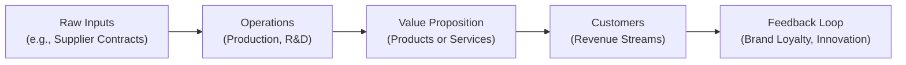
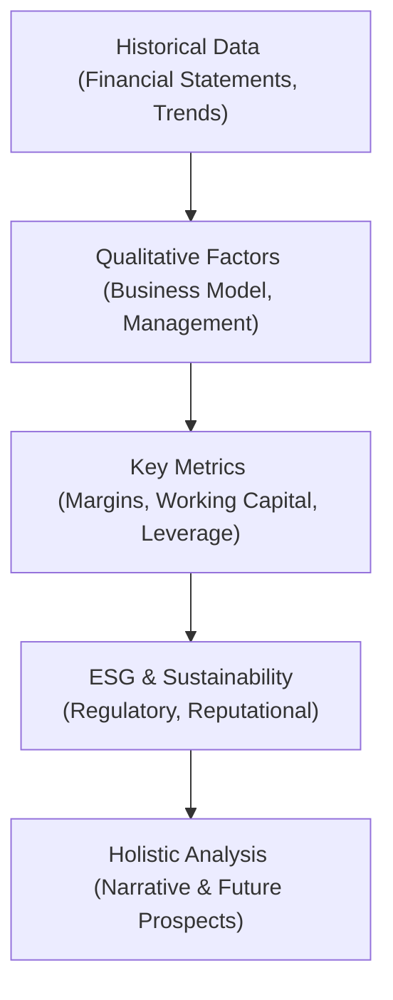

## 6.5 Company Analysis: Past and Present

Sometimes, when I think about analyzing a company, I recall my very first attempt at evaluating a small neighborhood coffee shop—“Uncle Joe’s Beans”—as part of a college project. I tried to figure out where their money was coming from, where it was going, and what made them different from the big chain store just a few blocks away. In my enthusiasm (and perhaps a bit of confusion), I forgot to check a few major things, like how strong their relationships were with local suppliers and how quickly their customers were paying their bills. Anyway, that’s how I first realized that company analysis is much more than combing through an income statement. It’s about capturing a complete picture of a business: from its business model and revenue drivers to management quality, capital structure, and ESG considerations.

Below, we’ll explore the key elements of performing a comprehensive company analysis. The goal is to equip you with a framework that helps you piece together the past (historical performance) and the present (current market dynamics), and then form an educated view of the road ahead.

---

### Introduction: Why Past and Present Both Matter

For starters, when we talk about “company analysis,” we’re essentially looking into the firm’s ability to generate value over time. Checking out a firm’s history shows us important events—like expansions, product launches, or even crises—that influenced how it operates today. Meanwhile, looking at the present state helps us figure out where the firm stands in the industry landscape, right here and right now.

When we connect the two, we go beyond just the typical “number-crunching” mentality. We also capture wisdom about the company’s adaptability, innovation, and resilience. After all, a stellar product launch 10 years ago can carry brand recognition into the present, but it doesn’t guarantee success if new competitors with better technology or lower prices have come onto the scene. So, we combine both historical data and current developments to get a more complete perspective on where the company might be heading.

---

### Key Components of a Thorough Company Report

While every analyst might approach a company report with a slightly different mindset, some essential elements tend to appear in all solid analyses. These elements help ensure that we’re leaving no stone unturned. They can be summarized as follows:

- Business model (How does the company make money, and what value does it offer to customers?)
- Products or services (What exactly is being sold? What’s unique about it?)
- Competitive landscape (Who are the main rivals, and how crowded or consolidated is the market?)
- Management quality (Are the executives competent, experienced, and trustworthy?)
- Financial statements (Are the numbers telling a story of growth or decline? Do they match management’s narrative?)
- Strategic outlook (Where is the company hoping to be in 5 or 10 years? What’s the plan to get there?)

How you organize your final report may vary, but you’ll likely want to weave these threads together in a cohesive story. Let’s look deeper into the main areas, focusing on how the past paves the way to the present, and how that might shape the future.

---

### Understanding the Business Model

The business model is the core blueprint of how a firm creates, delivers, and captures value. It’s almost like the DNA of the company. A sustainable business model will show, in fairly simple terms, the rationale behind how the company makes (and, hopefully, retains) money.

If you think of a popular streaming service as an example, it typically generates revenue by charging monthly subscription fees, invests heavily in content creation or licensing, and differentiates itself with a unique library of shows and movies. The model is heavily reliant on subscription renewal and customer retention.

For a moment, let’s do a quick, high-level diagram of how the core of a business model might look. We’ll use Mermaid.js to represent different aspects that feed into the value creation process.

This diagram shows that business models aren’t just a once-and-done approach. They evolve through a cycle of feedback and adaptation. And in analyzing “past and present,” you’ll want to answer: How has the business model changed (or stayed consistent) over the years, and what’s different about it now?

#### Target Market and Differentiation Strategy
A key part of understanding a company’s business model is figuring out who the target customers are and what the firm does to stand out. Is it a cost-leader in a commoditized market? Or does it have a premium brand, charging higher prices but delivering higher-quality goods or services?

If a company was once purely brick-and-mortar but has now developed a robust e-commerce presence, that indicates an adaptive approach. Conversely, if the firm’s competition has moved online but the company has stayed locked into the old model, that might be a red flag (or a sign of opportunity if management has a plan to catch up).

---

### Evaluating Revenue Drivers and Pricing Power

Let’s talk about revenue drivers. These are the factors—like volume growth, product mix, and pricing—that influence how much money the company brings in. Personally, I get excited analyzing these because they show you what’s really fueling top-line growth. Is it all from one best-selling product? Are there multiple streams, each contributing steadily?

In a cyclical industry (like automobiles or real estate), demand often fluctuates based on economic conditions. During booms, revenue might surge, but during downturns, it can drop like a stone. Meanwhile, in more stable sectors (like utilities or consumer staples), revenue is often less volatile but might also grow more slowly.

#### Pricing Power
Pricing power refers to a company’s ability to push prices higher without losing a bunch of customers. This is a big deal. If you’ve got strong pricing power—like a luxury brand with a loyal following—you’re less sensitive to competitive pricing pressures. If your product is easily replaced, you’ll be forced to match competitor discounts or risk losing business.

Looking at how pricing power shifted from the past to now can be enlightening. A company that once had a near-monopoly might have had strong pricing power, only to lose it after new entrants flooded the market.

---

### Analyzing Operating Profitability and Working Capital

Alright, let’s shift to the guts of the financial statements. Two big considerations stand out: (1) operating profitability, and (2) working capital management.

#### Operating Profitability
Operating profitability shows how efficiently a firm is converting revenue into profit, excluding expenses like interest and taxes. One widely watched metric is the operating margin (Operating Income ÷ Revenue). You might have come across other variants, like EBIT margin or EBITDA margin, which remove certain non-cash or non-operating expenses.

If a company’s margin historically hovered around, say, 15% but has dropped to 10% recently, you need to dig into why. Is it because raw material prices skyrocketed? Did the firm invest in new equipment that hasn’t yet proven worthwhile? Understanding margin trends over time is crucial to determining whether the current state is a blip or the beginning of a structural challenge.

And if we want to get a bit mathy for a moment, we can represent an operating margin formula like this:


\text{Operating Margin} = \frac{\text{Operating Income}}{\text{Revenue}}


It’s a simple ratio, but it packs a huge amount of information about the balance between top-line growth and operating costs.

#### Working Capital
Working capital can be thought of as the lifeblood of the firm’s day-to-day operations. It’s (Current Assets – Current Liabilities). A company with poor working capital management might run the risk of liquidity crises, even if it posts healthy profits on paper.

Navigating working capital involves looking at:
- Days of sales outstanding (DSO): How long does it take to collect payments?
- Days inventory outstanding (DIO): How long is inventory sitting on shelves?
- Days payable outstanding (DPO): How long is the company taking to pay suppliers?

These metrics can tell a very different story over time. Maybe a company that was once super flexible with its customers (long credit terms) has tightened payment policies to improve cash flow in the present. This might boost short-term liquidity but potentially irritate some customers.

---

### Capital Investments and Structure

When you think about analyzing a company’s capital structure and investments, you’re looking at what the firm invests in and how those investments are financed. This ties directly to the concepts discussed in Chapter 5 (Corporate Issuers) and Chapter 7 (Fixed Income), where we talk about debt financing, equity, and the cost of capital.

- **Capital Expenditure (CapEx) Plans:** Is the company spending heavily on new facilities or technology? Is it ramping up R&D spending to develop next-gen products? These moves could set the stage for future growth—assuming they don’t overstretch resources.
- **Leverage Levels:** How much debt is on the balance sheet, and what are the repayment terms? A company might have thrived on low-interest rates in the past but could face challenges if rates rise. 
- **Cost of Capital:** Debt is cheaper than equity for many firms (especially in low-interest environments), but too much debt increases financial risk. Equity avoids the risk of default but dilutes ownership. Gauging this mix over time can show whether management is conservative or aggressive in their financing approach.

Ultimately, you want to see if these investments are generating returns above the company’s cost of capital. Why does that matter? Because if the firm invests \$1 million in a project that yields 8% returns, but the weighted average cost of capital (WACC) is 10%, that’s value-destroying. Over time, poor investment decisions eat into shareholders’ wealth.

---

### Sustainability and ESG Factors

Nowadays, it’s pretty standard to include environmental, social, and governance (ESG) considerations in company analysis. You might scratch your head and wonder: “Does that actually affect financials?” Well, yes—it often does. Companies with poor ESG track records might face regulatory fines, reputational damage, or difficulty raising capital in today’s socially conscious environment.

- **Environmental:** How is the firm managing its carbon footprint or waste disposal? 
- **Social:** Does the company treat employees and local communities fairly? Are there controversies around labor practices?
- **Governance:** Is the board structured in a way that protects shareholder interests? Are executive compensation packages aligned with long-term performance?

Over time, these sustainability metrics can heavily impact brand reputation and revenue growth. Or consider a manufacturing firm that historically polluted local rivers—maybe they got away with it 30 years ago, but in the present day, that’s guaranteed negative press and likely expensive remediation requirements.

---

### Using Financial Statements to Tell a Story

Financial statements are your main window into how a company fared historically and how it’s doing at the moment. You’ll usually analyze:

- **Income Statement** for revenue, margins, net income.
- **Balance Sheet** for assets, liabilities, shareholder equity, and of course, that all-important capital structure.
- **Cash Flow Statement** for operational cash flows, investing activities, and financing activities.

Look for trends in these statements over a multi-year period. As you do this, tie them back to the qualitative factors you’ve already noted—the business model, management decisions, capital expenditures, and so on. Ask yourself: Does the story the financial statements tell you align with management’s narrative?

---

### Management Quality: People Behind the Numbers

Numbers aside, we can’t forget about the folks who actually run the show—management. I remember reading a CEO’s letter to shareholders once that promised “an era of unprecedented growth.” Yet the firm’s capital expenditures were being slashed, and R&D spending was cut to the bone. That discrepancy quickly raised a red flag.

Management quality can be gauged in terms of:
- Track record: Have they successfully led other companies? How have they responded to past crises?
- Transparency: Do they communicate well with investors, or are they prone to spin?
- Strategic coherence: Are their decisions consistent with the stated mission/vision?

If you discover that leadership churn has been high, or that past promises never materialized, you might suspect that the present (and future) strategic outlook is shaky.

---

### Putting It All Together: A Holistic View

Once you’ve analyzed the business model, revenue drivers, margins, working capital, capital structure, and ESG factors—and you’ve assessed management—what next? Well, you tie it all together in a narrative. Maybe we talk about a hypothetical company, “TruTech Devices,” that ran on a lower profit margin for years while it invested in new product lines. Now, with those products hitting the market, revenue is surging, and the margin is creeping up. The company also raised a bit of long-term, fixed-rate debt when rates were low, so it’s enjoying the benefits of cheap capital. The CEO has a track record of forging successful partnerships with other tech players. So overall, the story might be that TruTech Devices, once overshadowed by bigger rivals, is poised to capture more market share. 

On the other hand, if we see contradictions—like a cloudy strategic vision, a shaky capital structure, or poor ESG practices that have triggered regulatory probes—we might draw a more cautious conclusion.

---

### A Quick Mermaid Diagram of the Analytical Flow

Let’s illustrate the overall process using a simple flowchart:

The idea is that each step feeds into the next, eventually converging into your final assessment. If you think about it, this approach is iterative—you might circle back to re-check assumptions if something doesn’t add up.

---

### Common Pitfalls in Company Analysis

Before wrapping up, let’s take a quick look at some typical mistakes that can hamper a good company analysis:

- **Relying Too Much on Historical Data:** Past performance is important, but it’s not always a predictor of the future—especially in rapidly changing industries.
- **Ignoring Macro Factors:** Don’t overlook how interest rates, exchange rates, or global supply chain disruptions might affect the company.
- **Focusing Solely on Financials:** Corporate culture, reputation, and intangible assets (like brand value) often don’t appear plainly in the statements. You can’t ignore them.
- **Overemphasizing One Metric:** If you obsess over, say, the P/E ratio and ignore everything else, you might miss serious red flags (like mounting debt).
- **Failing to Revisit Assumptions:** Analysis isn’t a one-and-done event. Markets evolve, and so do companies.

---

### Encouraging Critical Thinking

Whether you’re analyzing a small company or a global juggernaut, remain curious. Question management’s statements. Compare the company to its peers (cross-referencing Chapter 6.6 on Industry and Competitive Analysis is a solid way to do that). Look for trends that are emerging—and maybe not fully priced into the market. And always be aware of personal biases. Sometimes, we get excited about a charismatic CEO or a product that we personally love. But does the data reinforce that excitement?

---

### Real-World Example: Streaming Wars

A quick real-world scenario that showcases “past and present” is the so-called “streaming wars” among video streaming providers. Historically, a handful of legacy entertainment studios dominated content creation, distributing films primarily through theaters and traditional TV. Then along came streaming platforms that started as distribution channels but quickly shifted to producing their own content. Over time, big studios launched their own platforms, and the market is now highly competitive.

- **Past:** One platform (let’s say Netflix) had first-mover advantage, ramped up content production, and enjoyed plenty of subscriber growth. 
- **Present:** New entrants (like Disney+, Amazon Prime Video, and many more) are fighting for user attention, each investing billions in original shows. That drastically affects Netflix’s pricing power and growth strategy. 
- **Future Outlook:** Analysts now examine how these different services handle their debt loads for content production, how well they execute on bundling strategies, and whether user demand can sustain multiple subscriptions in each household.

This real scenario maps directly to everything in our analysis framework: business model evolution, pricing power, capital structure, management strategy, and ESG (for instance, content that meets certain social or cultural standards).

---

### Conclusion

Company analysis is not a static activity. You’re taking a living, breathing entity (the firm) and examining how its history has shaped its present stance in the marketplace, and how that might inform its future trajectory. By being thorough—covering everything from the company’s core business model to its financial statements, competitive environment, and ESG posture—you’re putting together a piece of dynamic research that can help in making investment decisions or crafting strategic recommendations.

The bottom line is that companies evolve, and strong analysis recognizes patterns of resilience or weakness over time. It pays to weave past lessons and current realities into a cohesive narrative that gives you (and your stakeholders) clarity and insight.

---

## Glossary

Business Model  
A framework by which a company creates, delivers, and captures value for customers and stakeholders. It explains how a firm earns revenue, structures costs, and differentiates itself.

Pricing Power  
A firm’s ability to raise prices without substantially losing customers or market share. Strong pricing power often arises from brand loyalty, a unique product, or high barriers to entry.

Working Capital  
The difference between current assets and current liabilities, measuring short-term financial health and efficiency in managing receivables, inventory, and payables.

---

## References and Further Reading

- McKinsey & Company. (2020). Valuation: Measuring and Managing the Value of Companies.  
- Damodaran, A. (2012). Investment Valuation.  
- CFA Institute. (2020). CFA Program Curriculum, “Company Analysis: Past and Present.”  
- Chapter 6.6 in this text for deeper Industry and Competitive Analysis.  
- Chapters 7.1–7.19 for more on bond issuance and analyzing debt structures.

---

## Test Your Knowledge: Mastering Company Analysis



### Which element is NOT generally considered part of a comprehensive company report?

- [ ] The competitive landscape
- [ ] Management quality
- [x] Detailed macroeconomic policy discussions unrelated to the company's operations
- [ ] Financial statements

> **Explanation:** While macroeconomic trends can be relevant, a detailed macro policy discussion with no connection to the company is not typically essential for a focused company report.

### When analyzing pricing power, which factor is most indicative of a company’s ability to raise prices without losing market share?

- [x] Brand loyalty or a deeply differentiated product
- [ ] Severe cost-cutting reductions
- [ ] Shifting to a high-debt capital structure
- [ ] Growing faster than its industry average

> **Explanation:** Brand loyalty or strong product differentiation is key to pricing power because it reduces customer sensitivity to price changes.

### In analyzing working capital, which metric primarily measures how lengthy a firm takes to collect cash from its credit sales?

- [x] Days of sales outstanding (DSO)
- [ ] Days of inventory outstanding (DIO)
- [ ] Days payable outstanding (DPO)
- [ ] Operating margin

> **Explanation:** DSO is a metric focused on how many days it takes a firm to collect payment from customers. The other metrics measure different aspects of the operating cycle.

### A firm invests heavily in a new production facility but generates a return below its cost of capital. Which of the following statements best describes this situation?

- [ ] The project will significantly improve shareholder value.
- [x] The project destroys shareholder value because the return does not cover the cost of capital.
- [ ] The project’s benefit is unclear until the debt is repaid.
- [ ] The project is automatically a net positive due to asset growth.

> **Explanation:** If the return on the project is lower than the firm’s cost of capital, the net present value is negative, leading to the destruction of shareholder value.

### What is a key attribute to look for when assessing management quality?

- [x] Consistency between strategic planning and capital allocation decisions
- [ ] Board members with no financial expertise at all
- [x] Transparent communication of performance metrics
- [ ] Always paying out all earnings as dividends

> **Explanation:** A good management team shows consistency between stated strategy and its actions (including how it allocates resources) and maintains transparency in communication. That indicates alignment with long-term shareholder interests.

### A company that historically focused on in-store sales but has recently ramped up e-commerce channels is showing:

- [x] An evolving business model in response to market changes
- [ ] A lack of competitive instinct
- [ ] A sign of uncertain strategy
- [ ] Inability to generate stable revenue

> **Explanation:** Diversifying sales channels to include online platforms generally indicates adaptation to evolving consumer preferences and technology shifts, reflecting a more agile business model.

### Which of the following best describes a disadvantage of ignoring ESG factors?

- [x] Heightened regulatory or reputational risks
- [ ] Reduced brand differentiation due to cost leadership
- [x] Potential difficulty accessing certain capital markets
- [ ] Elimination of future revenue streams

> **Explanation:** Poor ESG practices can result in regulatory fines, reputational damage, and even limited financing options in today’s socially conscious climate, whereas ignoring ESG doesn't necessarily guarantee elimination of future revenue streams but does elevate risk.

### When considering the past vs. present of company analysis, which method helps illustrate how a firm’s profitability has trended over time?

- [x] Examining multi-year operating margins
- [ ] Using a single year’s net income figure
- [ ] Skipping historical data in favor of forward guidance
- [ ] Focusing exclusively on the stock price

> **Explanation:** Looking at operating margins (and other metrics) across multiple years reveals trends in profitability better than focusing on a single period or ignoring history altogether.

### Management turnover can be a red flag if:

- [x] Leaders have not stayed long enough to implement strategic plans
- [ ] The board of directors is diverse
- [ ] The company invests in R&D
- [ ] The CEO has industry experience

> **Explanation:** High leadership turnover disrupts strategic continuity, raises concerns about internal issues, and often indicates instability in executing the firm’s vision.

### True or False: Past performance alone guarantees a company’s current and future success.

- [x] True
- [ ] False

> **Explanation:** Actually, it’s a deliberate trick. This statement is false because past performance does NOT guarantee present or future success. (If you selected True for fun, you’re correct that it’s false in actual meaning. It highlights how we must combine past data with current realities and forward-looking analysis.)


