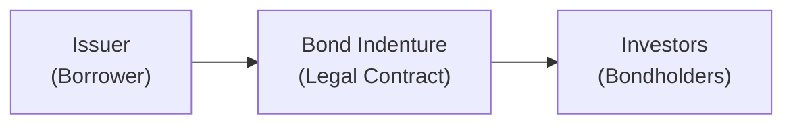

## 7.1 Fixed-Income Instrument Features

Let’s talk about fixed-income instruments in a way that feels like we’re chatting over coffee—albeit with a big old textbook in front of us. I sometimes remember discovering bonds for the first time and feeling, “Wait, so I get regular interest, and then I (hopefully) get my money back at the end?” That sounded both reassuring and, well, not quite as glamorous as some other investments. But understanding how bonds actually work is super-important for any aspiring finance guru (and for anyone else who doesn’t mind stable interest payments).

Understanding fixed-income instruments begins with the basics: a lender (an investor) provides money to a borrower (an issuer) in exchange for periodic interest payments—commonly called coupons—and the repayment of principal at maturity. Everything that defines this investment—like coupon rate, maturity date, or embedded features—lives in the bond’s indenture, which is the legal contract or “trust deed,” if you prefer the more formal name.

Let’s break down the essential features:

### Function of the Bond Indenture
The bond indenture is kind of like the blueprint for the bond, and it’s a pretty hefty legal document. It specifies practically everything about the bond, including:

• Coupon rate and frequency: The interest rate you’ll receive and how often (annually, semiannually, or maybe monthly).  
• Maturity date: When you can expect your principal back.  
• Principal amount (Face value or Par value): The sum the issuer promises to repay.  
• Any special provisions or embedded options: For instance, “callable” bonds that let the issuer repay early or “convertible” bonds that let investors convert to shares.

To visualize the relationship:

The indenture sits in the middle, governing all terms between the issuer and the bondholders.

### Affirmative and Negative Covenants
Okay, so we have the “Covenants.” These are basically rules and promises included in the indenture. Affirmative covenants compel the issuer to do something—like providing regular audited financial statements, maintaining proper insurance, or meeting certain financial ratios. Negative covenants, on the other hand, prevent the issuer from exceeding certain limits or engaging in certain actions. For example, a negative covenant might restrict the issuer from issuing more debt beyond a defined threshold.

• Affirmative Covenant Example: The issuer must maintain a debt-to-equity ratio below a certain level.  
• Negative Covenant Example: The issuer cannot pay dividends beyond a specified amount if certain profit benchmarks aren’t met.

Covenants protect you and me as investors. They reduce the chance that the issuer (borrower) will do something risky that might jeopardize repaying us.

### Roles of Trustees, Paying Agents, Auditors, and Rating Agencies
Remember those times at family gatherings when an older relative would gently nudge you, checking if you did your chores—and you kind of dreaded it but knew it kept you accountable? Well, the trustee plays a similar role for the bondholders. The trustee is usually a financial institution that ensures all the conditions in the bond indenture are followed. They police the issuer in the interest of the bondholders.

• Trustee: Oversees compliance, triggers protective actions on behalf of bondholders if something goes south.  
• Paying Agent: Handles the practical side of making actual coupon and principal payments to bondholders.  
• Auditors: Provide independent assurance that the company’s financial statements (and thus the covenant compliance) are fairly presented.  
• Rating Agencies (e.g., S&P Global Ratings, Moody’s, Fitch): Assign credit ratings to the issuer and the issue, signaling the relative likelihood of default. A AAA rating suggests very low credit risk, whereas a lower rating—like B or CCC—indicates higher risk. Let’s be honest: those rating agencies aren’t perfect, but they are definitely an influential part of the bond world.

### Legal Structures and Classification of Bonds
Different bonds have different legal structures—secured or unsecured, senior or subordinated. These distinctions matter a lot if the issuer faces financial trouble.

• Secured Bond: Backed by specific collateral, such as real estate or equipment. If the issuer defaults, holders of a secured bond have a claim to the underlying collateral.  
• Unsecured Bond (or Debenture in some markets): Rely on the blanket promise of the issuer’s creditworthiness, no specific asset backing the bond.  
• Senior vs. Subordinated: Senior bonds stand at the top rung in the repayment hierarchy (ahead of subordinated bonds). Subordinated bonds are essentially “junior,” meaning if the issuer defaults, these bondholders get paid only after all senior obligations are met.

A simplistic ranking in the event of default:

1. Secured Bonds.  
2. Unsecured Senior Bonds.  
3. Subordinated Bonds.  
4. Equity holders (shareholders) come last.

### Importance of Documentation: Pricing and Risk Management
The documentation provided by all these features—covenants, legal structure, maturity schedule, interest-rate arrangements—is critical for the pricing of the bond. Investors need clarity on the credit risk (likelihood of default) and all sorts of embedded option risk (call features, put features, convertibility). Let’s say you see a bond with an attractive yield, but the covenants are basically non-existent, or it’s deeply subordinated with no collateral. That yield is presumably high for a reason—reflecting heightened risk. Properly dissecting the bond’s legal documentation is crucial to understanding its risk–reward profile.

### Cross-Border Regulations, Local Laws, and Tax Considerations
One of the more exciting complexities in the bond world: cross-border regulations and local constraints. You could end up investing in a Eurobond denominated in a currency that mirrors neither the issuer’s nor the investor’s home currency. Or perhaps the bond is governed by different legal jurisdictions. That stuff can be confusing, but it matters:

• Local Laws: Some countries have strict regulations for how much interest can be paid, or how defaults and bankruptcies are handled.  
• Tax Treatments: The approach to withholding tax (on coupon income), capital gains tax, or specialized tax incentives for certain bond types can vary widely across jurisdictions.  
• Currency Risk: If an investor invests in a bond denominated in a foreign currency, changes in exchange rates can drastically affect actual returns.

Anyway, if all that detail sounds overwhelming, don’t stress. The main takeaway is that the intricacies of where and how a bond is issued (plus your local tax regime) have a direct impact on your after-tax yield and your risk level.

### Personal Reflections
I recall my first foray into international bonds—there was a sense of, “Should I buy this bond in foreign currency? The coupon is higher, but, oh man, currency fluctuations could eat up all that extra yield.” My confusion was resolved after reading (and re-reading) the bond’s documentation, plus a few disclaimers about currency risk. That was a big aha moment—bond features aren’t just about the coupon or maturity. They’re about the entire legal, regulatory, and operational framework in which the bond lives.

### Quick Reference Table

| Bond Feature              | Description                                                        |
|---------------------------|--------------------------------------------------------------------|
| Indenture (Trust Deed)    | Legal agreement detailing bond structure, covenants, and features. |
| Affirmative Covenant      | Action issuer must do (e.g., provide statements, insure assets).    |
| Negative Covenant         | Action issuer must avoid (e.g., limit new debt issuance).          |
| Secured Bond              | Backed by specific collateral (e.g., property, equipment).         |
| Unsecured Bond (Debenture)| Backed only by issuer’s general credit.                            |
| Senior vs. Subordinated   | Hierarchy of claims if the issuer defaults.                        |
| Trustee                   | Oversees bond indenture compliance on behalf of bondholders.       |
| Rating Agency             | Evaluates issuer and assigns credit ratings (e.g., AAA, BBB).      |

### Why It Matters
Truth is, bonds might seem super-straightforward, but the fine print can change everything. It could be the difference between being first in line for repayment when times get tough or barely getting any scraps. And from an investor standpoint, reading the indenture is not always the most exciting weekend activity, but I promise you it’s an empowering step that could save you from painful surprises. The nature of your bond’s covenants, its seniority, whether it’s secured or unsecured, and your after-tax yield all come into play when you decide if it’s right for you.

Remember, the bond market is vast—providing capital across governments, corporations, municipalities, and even supranational organizations. By knowing how bond features work, you’ll be better positioned to weigh credit risks, navigate covenants, and figure out if that shiny new bond issue really is the safe harbor or the yield boost your portfolio needs.

So, be curious. Explore different types of bonds—some might be incredibly safe, some might be downright speculative. But at least you’ll know where your money is flowing, and you’ll be able to measure risk intelligently.

---

## Test Your Knowledge: Fixed-Income Instrument Features Quiz



### Which of the following best describes an indenture in the context of bonds?
- [ ] A formal rating assigned by a rating agency.  
- [x] A legal contract specifying all the terms between issuer and bondholders.  
- [ ] A preliminary prospectus for potential investors.  
- [ ] An informal memo listing financial covenants.  

> **Explanation:** An indenture (or trust deed) is the legally binding agreement that outlines the bond’s features, covenants, and other key provisions.

### What is the main purpose of covenants in a bond agreement?
- [ ] To increase the coupon rate.  
- [ ] To determine the maturity date of the bond.  
- [x] To protect bondholders by setting rules on the issuer’s activities.  
- [ ] To designate the credit rating agency.  

> **Explanation:** Covenants are rules embedded in the bond agreement, helping reduce risks by obligating or restricting the issuer’s actions.

### Which role is primarily responsible for ensuring the issuer complies with the terms of the indenture?
- [ ] Auditor  
- [ ] Rating Agency  
- [x] Trustee  
- [ ] Paying Agent  

> **Explanation:** The trustee monitors and enforces the indenture on behalf of bondholders.

### In the event of default, which type of bond generally has the highest claim on assets?
- [ ] Subordinated unsecured bond  
- [ ] Senior unsecured bond  
- [x] Secured bond  
- [ ] Equity shares  

> **Explanation:** Secured bonds are backed by collateral assets, giving them a higher claim than unsecured bonds or equity during default.

### Which of the following is an example of an affirmative covenant?
- [x] The issuer must submit audited financial statements annually.  
- [ ] The issuer cannot issue new debt beyond a specified level.  
- [x] The issuer must maintain certain liquidity ratios.  
- [ ] The issuer cannot pay dividends exceeding a certain threshold.  

> **Explanation:** Affirmative covenants specify actions the issuer must perform, such as providing financial statements and keeping certain ratios.

### An unsecured bond is generally referred to as:
- [x] A debenture.  
- [ ] A mortgage bond.  
- [ ] A convertible note.  
- [ ] An insured bond.  

> **Explanation:** In many markets, an unsecured bond with no collateral is known as a debenture.

### Which statement about senior vs. subordinated debt is correct?
- [x] Senior debt holders have priority of repayment over subordinated debt holders.  
- [ ] Subordinated bondholders have the highest priority in liquidation.  
- [x] Subordinated bondholders often require a higher coupon to compensate for added risk.  
- [ ] Senior debt is typically not ranked in the event of default.  

> **Explanation:** Senior bondholders get paid first in default scenarios, while subordinated bondholders are paid after seniors and thus bear more risk.

### How do rating agencies influence bond pricing?
- [x] A higher rating generally leads to lower yield demands from investors.  
- [ ] They determine the bond’s maturity date.  
- [ ] They directly enforce covenants.  
- [ ] They collect coupon payments.  

> **Explanation:** Higher ratings reflect lower perceived credit risk, so investors typically require lower yields for such bonds.

### What could be a major consideration for investors in cross-border bonds?
- [ ] Coupon payments are always adjusted to inflation.  
- [x] Currency exchange rates and tax regimes can significantly affect returns.  
- [ ] No regulatory differences exist between countries.  
- [ ] Interest is never taxed in foreign jurisdictions.  

> **Explanation:** Currency fluctuations, international tax laws, and regulatory requirements can all have a large impact on the net return.

### True or False: Negative covenants are clauses that require the issuer to perform a specific action, such as providing audited statements.
- [ ] True  
- [x] False  

> **Explanation:** Negative covenants restrict issuers from certain actions. Affirmative covenants place requirements on the issuer.


