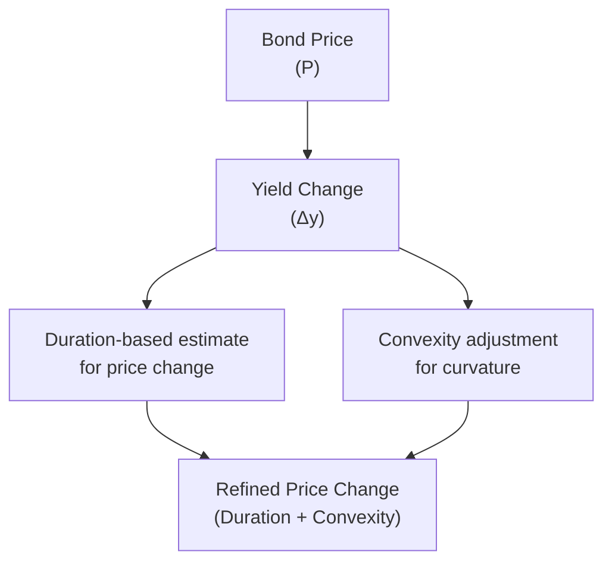

## 7.12 Yield-Based Bond Convexity and Portfolio Properties

Picture this: You’re sitting at your kitchen table, trying to figure out why your seemingly stable bond investment is acting all weird when interest rates change. Maybe it’s not deviating wildly, but you notice that a simple duration estimate of price moves just isn’t cutting it. If you’ve ever been in that situation, or just curious about how to really refine yield-based price change estimates, you’ve come to the right spot. This idea of “convexity” helps capture how a bond’s sensitivity (or duration) actually changes as yields go up or down. In other words, it’s that extra bit in the math that tries to say, “Wait a minute—duration is helpful, but it’s not the whole story.”

This section dives deeper into yield-based bond convexity and how it affects portfolio properties. We’ll chat about all things positive and negative convexity, how to factor in convexity when yields shift significantly (rather than just dipping your toe in a small yield change), and finally how to add it all up in a real portfolio context. And, sure, we’ll keep it a bit informal—like you and I are just hanging out with a cup of coffee, discussing the finer points of bond mathematics. Let’s get going, shall we?

### Why Convexity Matters

Many of us have heard that the bond price–yield relationship is convex (pricier bonds become even more sensitive—up to a point—as yields move, and so on). So let’s suppose you spent some serious time understanding duration in the previous section (7.11). Duration is a linear approximation: it estimates a bond’s percentage price change in response to a small change in yield. But eventually, you notice that for bigger interest rate shifts, “linear” just isn’t enough. The curve that depicts the price–yield relationship isn’t a straight line; it’s shaped like a bowl (convex) or, in some cases, shaped the other way (concave). 

This shape is precisely what “convexity” tries to measure. In a plain-vanilla bond, you’ll almost always see “positive convexity,” meaning the price–yield curve is upward-bending (like a smile). But if you have a callable bond, a mortgage-backed security (MBS), or something similar, parts of that price–yield curve might bend the other way and produce “negative convexity.“

To get an intuitive sense, let’s say you hold a non-callable Treasury Bond. When yields go down, the price goes up more than you might expect from a simple duration estimate. When yields go up, the price goes down less than your linear approximation might suggest. That’s positive convexity. If you’re dealing with an MBS, the bond’s price might actually rise less than expected when rates go down—because of prepayment risk—and might fall more than expected when rates go up. That’s negative convexity. Umm, sounds a bit painful, right?

Anyway, that’s the big “why” behind factoring in convexity: it’s the second piece of the puzzle that helps refine your pricing model beyond just duration alone.

### The Price–Yield Curve at a Glance

Visually, the bond price–yield relationship for a standard bond looks something like a classic convex curve sloping downward to the right. The vertical axis is bond price; the horizontal axis is yield. Let’s do a quick (and admittedly simplistic) conceptual Mermaid diagram that shows the relationship between bond price, duration, and convexity:

The idea is that if you only used duration, you’d have a straight line from P to yield changes, ignoring curvature. When yields move significantly, the linear approximation can produce either an overstated or understated estimate of the bond’s price shift. Therefore, you tack on convexity to refine that estimate.

### Defining Convexity and Its Calculation

Convexity is basically the rate of change of duration with respect to yield. In formula form, it’s sometimes described as the second derivative of the bond price with respect to yield (where duration is the first derivative). But, let’s not get too lost in the math. We can use an approximate formula that’s fairly common among practitioners.

If you recall, an approximate formula for the bond’s (effective) duration uses the following approach:

1. Bump the yield up by a small amount Δy.
2. Bump the yield down by that same amount Δy.
3. See how the bond price changes in both scenarios, then compare both to the current price at the current yield.

Something similar holds for approximate convexity. The typical formula is:

$$
\text{Approximate Convexity} = 
\frac{P_{+} + P_{-} - 2 P_0}{P_0 (\Delta y)^2}
$$

where:  
• \\(P_{+}\\) is the bond’s price if the yield is increased by \\(\Delta y\\).  
• \\(P_{-}\\) is the bond’s price if the yield is decreased by \\(\Delta y\\).  
• \\(P_0\\) is the current bond price, at the current yield.  
• \\(\Delta y\\) is the yield change (expressed as a decimal).

In practice, you might see this formula multiplied by \\( \frac{1}{(1+y)^2} \\) or similar factors to annualize or scale the measure to a per-year basis. The exact formula can vary slightly in notation, but the concept is the same: you want to see how the price changes in both the up and down yield scenarios, figure out the net difference, and then normalize by the current price and the square of the yield change.

If you prefer a more advanced explanation, you could say the second partial derivative of price with respect to yield is capturing that curvature. But for the average day-to-day analysis, we rely on this approximate measure to get the job done quickly.

### Positive Convexity

Positive convexity typically applies to plain-vanilla bonds—like Treasuries, corporate bonds (without embedded options), and other typical “bullet” structures that pay a coupon and return principal at maturity in a single chunk. The price–yield curve bows outward (like a bowl). This means that for a given interest rate drop, the bond’s price goes up more than the linear (duration-only) estimate. Conversely, for an equivalent-sized increase in interest rates, the price will drop less than the linear estimate. 

Let’s put this in a simple scenario: Suppose a 10-year non-callable corporate bond is priced at 100 (par), and you estimate the duration to be 7. When you’re modeling a yield increase of 1%, your linear estimate might say, “The price is going to fall by about 7%.” But your actual price might only fall by 6.8% or so, because of positive convexity. Similarly, if yields go down by 1%, maybe instead of rising 7%, the price might rise by 7.2%. This “extra rise” (and “less fall”) phenomenon is exactly what makes a typical bond attractive from a convexity perspective. It helps buffer your losses when rates rise, and it gives you a little extra push when rates fall.

### Negative Convexity

Now for the part that can sometimes puzzle people: negative convexity. If a bond has an embedded call option or a homeowner’s prepayment option (in the case of MBS), the price–yield relationship changes character. With negative convexity, the price–yield curve can bend inward (like a frown), meaning that if yields decline enough, the issuer might call the bond, or homeowners might refinance and pay off their mortgages early. So your bond or MBS will not enjoy the full price appreciation that a non-callable bond would. When rates rise, however, you still eat the full brunt of the decline. That’s unfortunate for investors, because when yields jump by 1%, your bond might go down 7.2%, but if yields drop by 1%, your bond might only go up 6.5%. This is an oversimplified example, but that’s the general drift.

It might help to share a personal anecdote. One time, a friend of mine got excited about mortgage-backed securities because they had “such nice yields.” He quickly learned that when rates started dropping and folks refinanced their homes, his MBS got partially called away at par. That effectively capped the bond’s upside price potential. When rates went suddenly higher, the MBS ratio in his portfolio fell quite a bit, because no one was refinancing. So he was stuck with the bond at lower prices. Lesson learned: always watch out for negative convexity.

### Incorporating Convexity into Price Estimates

We can refine the typical duration-based price change estimate by adding in a convexity term. The standard formula you’ll see is along these lines:

$$
\Delta P \approx 
\Bigl[-(\text{Duration})(\Delta y)\Bigr] 
+ \frac{1}{2} \bigl(\text{Convexity}\bigr)(\Delta y^2)\times P_0
$$

(You’ll sometimes see the “Duration” in a modified or effective form, and likewise, “Convexity” might be annualized or scaled differently. Details aside, the conceptual idea remains the same.)

If you think about it, duration alone is the first-order approximation (the slope), while convexity is the second-order approximation (the curvature). Not everyone uses that second term if they expect yields to shift by just a few basis points, because the difference might be small. But if the yield shift is large or if the security has certain option-like features, you definitely want to factor in that convexity term.

One way to see how big of a difference this can make is to do a quick scenario analysis. Suppose:

• Your bond has a duration of 6.  
• Its convexity is 50.  
• The price is \$1,000, and yields shift up by 1% (i.e., 100 basis points).  

Applying only duration:

ΔP (from duration) = –(6) × (0.01) × \$1,000 = –\$60.  
So you might predict the bond price goes from \$1,000 down to \$940.

Now adding in convexity:

Extra Price Adjustment = ½ × (50) × (0.01²) × \$1,000 = ½ × 50 × 0.0001 × \$1,000 = \$2.50.

Hence the total change, using both duration and convexity, is –\$60 + \$2.50 = –\$57.50. So your refined estimate for the new price is \$942.50, which is notably higher than \$940. That extra \$2.50 might not seem like a big difference, but in real institutional portfolios, or when large basis point shifts happen, that difference becomes quite material. If yields drop by 1%, you’d see the same formula but with a positive sign for duration effect plus the convexity effect that might push the new price to slightly more than \$1,060. Once you scale that across millions (or billions) of dollars in assets, you see why executives, portfolio managers, and risk managers pay attention to convexity.

### Portfolio Duration and Convexity

Up until now, we focused on single bonds. In real life, of course, we often hold a diversified bond portfolio. To get a handle on your entire portfolio’s sensitivity to interest rates, you can compute the portfolio’s duration by weighting each bond’s duration by its market value as a proportion of the total portfolio. That’s the standard approach for portfolio duration: a weighted average. 

Convexity at the portfolio level works pretty much the same way. You consider each individual bond’s convexity, multiply by its weight in the portfolio, and sum it up. The result is your “portfolio convexity.” 

So if you have:

• Bond A with duration of 5, convexity of 40, and it’s 25% of your portfolio by market value.  
• Bond B with duration of 7, convexity of 60, and it’s 50% of your portfolio.  
• Bond C with duration of 10, convexity of 80, and it’s 25% of your portfolio.  

Then your portfolio duration is:

Duration_portfolio = (5 × 0.25) + (7 × 0.50) + (10 × 0.25) = 1.25 + 3.5 + 2.5 = 7.25.

Your portfolio convexity would be:

Convexity_portfolio = (40 × 0.25) + (60 × 0.50) + (80 × 0.25) = 10 + 30 + 20 = 60.

And that’s it. Now you have single, summary measures for how your portfolio reacts (in a linear sense) to yield changes (that’s the duration part) and the second-order effect that refines it (that’s the convexity). 

In practice, portfolio managers must do some aggregated scenario analysis to see how the combination of positive- and negative-convexity bonds plays out. For instance, if you have MBS in your portfolio, that might reduce the overall portfolio-level convexity. You might offset it with some higher-convexity Treasuries or other structures so that on net, your portfolio still behaves in a generally favorable manner.

### Positive Convexity vs. Negative Convexity in Portfolios

Positive convexity is generally a “good” thing from the investor’s vantage point. When you add highly convex (positively convex) bonds, you’re giving yourself that protective cushion if rates rise and that little boost if rates go down. But, of course, those come with a price—often, highly convex securities, all else being equal, might offer a lower yield, since you’re paying for the embedded advantage.

Negative convexity is basically a risk factor. If you hold a lot of negative-convexity securities (like MBS or callable bonds) and yields begin to shift, your portfolio can respond in a less desirable way than predicted by a simple linear measure. Now, that doesn’t mean you avoid them at all costs; it just means you better be prepared and factor it into your risk analysis. Some portfolio managers actually want negative convexity if it serves a specific purpose or if the yield pick-up is high enough to compensate for that negative convexity. 

### Real-World Example: Large Yield Changes in 2020–2021

Let’s be a bit anecdotal again. In 2020 and 2021, we saw some dramatic decreases in yields, partly due to central bank actions. Investors holding standard, bullet U.S. Treasuries saw their bond prices rally more than they might have predicted with a naive duration approach. Meanwhile, those with mortgage-backed securities often witnessed the dreaded negative convexity effect, especially for certain pools with higher coupons. Borrowers refinanced mortgages en masse, limiting MBS price appreciation. 

Portfolio managers who neglected convexity adjustments were sometimes confused by the mismatch between their linear (duration-based) price change predictions and the actual results. On the flipside, those who integrated convexity analysis likely had a better handle on what was happening and possibly hedged themselves more effectively.

### Practical Points and Pitfalls

• Precision vs. Simplicity: Some bond managers only apply convexity for large yield changes because small changes don’t always justify the complexity. But if your portfolio is sensitive to options, prepayments, or embedded calls, you probably need to do convexity analysis more often.

• Modeling Complexity: If you hold large positions in callable or putable bonds, or if you have structured products, your convexity measure might fluctuate significantly as rates move. So do realize that even the standard approximate formula might get oversimplified for big yield changes or complex embedded options.

• Negative Convexity Hedge: If you hold MBS, you might invest in interest rate options or other derivatives to offset that negative convexity. That’s a strategy that advanced portfolio managers sometimes employ: they might buy interest rate calls or swaptions to recolor the portfolio’s overall interest rate exposure.

• Changing Market Liquidity: During volatile market conditions, bond prices might behave slightly differently than theoretical measures. That said, convexity is still a helpful concept. Just be aware of real-world frictions like liquidity constraints, transaction costs, and so on.

### Bringing It All Together

So, in a nutshell, convexity is the second-order measure that captures the curvature of the price–yield relationship, refining the duration estimate, especially over large yield changes. Positive convexity is generally investor-friendly, negative convexity is typically riskier from a price volatility standpoint, and each type can be found in different shapes and sizes of bonds. Aggregating at the portfolio level is essential for real-world management, because that’s where your overall interest rate risk and potential convexity benefits (or drawbacks) become truly visible.

If you need a final summary: always consider both duration and convexity. Use duration to get that quick, first “what if rates move by a small amount?” sense. Then factor in convexity to see how that story changes if rates move by more than a few basis points, or if your security is definitely no vanilla bond. Trust me, your risk management approach will thank you later.

### References and Further Reading

• Bodie, Z., Kane, A., & Marcus, A. “Investments.” McGraw-Hill. Concentrate on sections discussing bond convexity concepts.  
• CFA Institute Level I Curriculum, reading on fixed-income securities, especially the parts covering convexity.  
• Fabozzi, F. J. “Fixed Income Analysis.” CFA Institute Investment Series. See sections on option-adjusted spreads, negative convexity, and mortgage-backed securities.  

## Test Your Knowledge: Bond Convexity and Portfolio Risk Management



### Which best describes bond convexity?

- [x] A measure of the curvature of a bond’s price–yield relationship.
- [ ] The first derivative of a bond’s price with respect to yield.
- [ ] The bond’s weighted average time to maturity.
- [ ] A measure of the expected default risk of a bond.

> **Explanation:** Convexity is all about the curvature in the price–yield relationship, reflecting how duration changes as yields shift.

### A bond with positive convexity tends to:

- [x] Rise more in price than duration suggests when yields drop.
- [ ] Fall more in price than duration suggests when yields drop.
- [ ] Show no difference in price sensitivity compared to a simple duration-based approach.
- [ ] Remain unaffected by large yield changes.

> **Explanation:** Positive convexity means that the bond’s price rises more (and often drops less) than duration alone would predict when yields move significantly.

### A callable bond often exhibits negative convexity because:

- [x] Its price appreciation is limited when rates decline due to the possibility of call.
- [ ] Its coupon payments are fixed and cannot be changed.
- [ ] Investors are guaranteed a higher yield in all scenarios.
- [ ] Duration cannot be calculated on callable bonds.

> **Explanation:** A callable bond has an embedded option for the issuer to call it away, limiting upside potential when rates fall, thus creating negative convexity.

### The approximate formula for convexity uses:

- [x] The bond price at yields up and down, minus twice the current price, divided by the price and (Δy)².
- [ ] Simulated returns under various yield environments, minus the average yield times the face value.
- [ ] A bond’s effective duration multiplied by its weighted average coupon rate.
- [ ] A ratio of the coupon payment to its yield.

> **Explanation:** The standard approximate convexity formula is (P_+ + P_- - 2P_0) / (P_0(Δy²)).

### Portfolio-level duration is calculated by:

- [x] Summing the product of each bond’s duration and its weight in the portfolio.
- [ ] Taking the simple average of each bond's duration ignoring market values.
- [ ] Using only the bond with the highest duration.
- [ ] Multiplying the portfolio’s yield by the total par value.

> **Explanation:** Portfolio duration is the market-value-weighted average of the durations of individual bonds in the portfolio.

### If yields move significantly, duration alone can be insufficient because:

- [x] The price–yield relationship is curved and not perfectly linear.
- [ ] The bond’s coupon payments suddenly become zero.
- [ ] The duration measure becomes negative.
- [ ] Regulators disallow duration calculations over large yield changes.

> **Explanation:** A larger yield move introduces curvature effects, making a linear duration estimate less accurate without considering convexity.

### Negative convexity means:

- [x] Bond price appreciates less than linear estimates when yields fall but can decrease more when yields rise.
- [ ] The bond is guaranteed to default if interest rates move.
- [x] Certain embedded options cause limited upside and extended downside.
- [ ] The bond has no coupon payments.

> **Explanation:** Negative convexity is typical of callable or prepayable bonds, limiting upside benefits and often exacerbating downside moves.

### Which statement best describes the difference between duration and convexity?

- [x] Duration is a first-order measure, while convexity refines that estimate by accounting for curvature.
- [ ] They are synonymous and can be used interchangeably.
- [ ] Convexity applies only to zero-coupon bonds, whereas duration applies only to callable bonds.
- [ ] Convexity is a simpler and more common measure than duration.

> **Explanation:** Duration measures the linear sensitivity to yield changes, while convexity measures the second-order (curvature) effect.

### Combining duration and convexity:

- [x] Improves accuracy in estimating bond price changes for large yield moves.
- [ ] Results in a higher coupon rate for corporate bonds.
- [ ] Reduces default risk on government bonds.
- [ ] Is irrelevant for MBS securities.

> **Explanation:** Duration plus convexity together form a more accurate measure of interest rate risk. This approach is highly relevant, especially for large yield changes or complex bond structures.

### The statement “A bond with high positive convexity is generally more forgiving if yields rise” is:

- [x] True
- [ ] False

> **Explanation:** Positive convexity means price declines are somewhat tempered when yields increase, offering extra cushion compared to a purely linear measure.




