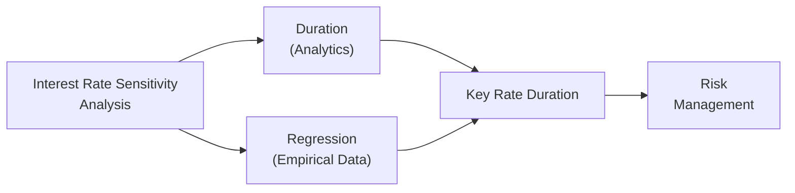
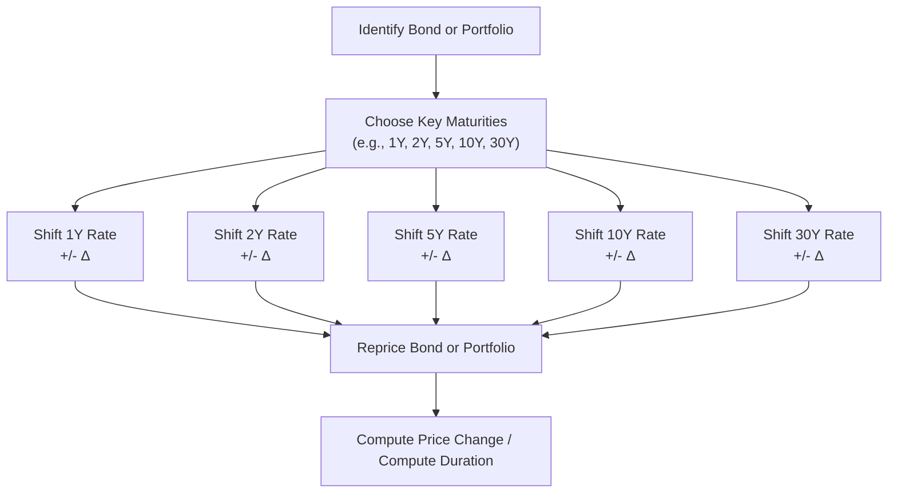

## 7.13 Curve-Based and Empirical Fixed-Income Risk Measures

Bonds can get pretty tricky. I remember the first time I tried to adjust a portfolio of callable bonds for interest rate risk, I thought, “So, I’ll just calculate duration and that’s it, right?” Well, not quite. In reality, we often face embedded options, partial shifts in the yield curve, or rapidly changing market data suggesting that the simple yield-to-maturity approach isn’t telling the whole story.

In previous parts of this chapter (for instance, 7.11 on yield-based bond duration measures and 7.12 on yield-based convexity), we’ve already laid quite a bit of groundwork. Here, we’re going to take a deeper, more nuanced look at the wonderful world of curve-based and empirical fixed-income risk measures—in other words, how to measure (and manage) interest rate risk when your bond’s price might be influenced by more than one factor on the yield curve or when historical data can shed light on a bond’s sensitivity.

This broad category of risk measures includes effective duration—particularly for those sneaky callable or putable bond structures—and key rate durations to see how price changes for specific maturities affect portfolio value. We’ll also compare the good old analytical formula-driven durations versus the more data-based approaches (often called empirical or regression-based durations). It’s a lot to chew on, so let’s break it down step by step.

---

### Revisiting the Concept of Duration

Before plunging too deep into curve-based and empirical measures, let’s do a quick refresher. Duration essentially measures the sensitivity of a bond’s price to changes in interest rates (and we often say yields, but there are subtleties). A large portion of the earlier sections covered various formulas for duration—Macaulay duration, modified duration, and so on. Conventional, yield-based duration tells you, “If the yield changes by X%, the bond’s price will change by approximately Y%.” 

But there’s a problem if the bond includes an embedded call or put provision, because the future cash flows may change if the issuer calls the bond early (or if the holder puts it back to the issuer). In that case, the old yield-based duration might be misleading. That’s when effective duration steps in.

---

### Effective Duration: Handling Embedded Options

If you’ve ever faced a “callable bond fiasco,” you know that issuer call rights can drastically change a bond’s expected cash flows whenever interest rates shift. A simple yield-to-maturity assumption might incorrectly project the timing and amount of cash flows. That’s where effective duration enters the scene.

• Definition:  
  Effective duration measures how a bond’s price will change in response to a parallel shift in the yield curve, explicitly taking into account that future cash flows may differ if interest rates move enough to trigger embedded options.

• Practical Example:  
  Imagine a callable bond that pays an annual coupon of 5% and can be called at par if rates drop to, say, 3%. If market rates fall significantly, your bond is likely to be called (the issuer refinances at a cheaper rate). In that scenario, your cash flows end early and you get your principal back sooner. A standard yield-based duration doesn’t neatly capture that effect because it typically assumes fixed coupon payments until maturity. Effective duration uses scenario analysis (or pricing models) to measure how the price changes when yields shift up or down, factoring in the chance of early redemption.

So next time you see a bond with an embedded option—callable, putable, or convertible—and you’re itching to measure interest rate risk, take a moment to consider effective duration. It’s got your back because it captures the optionality embedded in real-life bond structures.

---

### Analytical Duration vs. Empirical Duration

You might be curious: “Don’t we always rely on formulas?” Many times, yes. The “analytical” approach to duration is typically formula-driven, using yield-to-maturity and a bond’s expected payment schedule. But sometimes the best approach is to look at real market data—historical price and yield movements—and do a regression to see how the bond’s price has actually responded. That’s called empirical or regression-based duration.

#### Analytical (Traditional) Duration

• Based on yield to maturity and contractual cash flows.  
• Easier to compute than empirical duration if you have the bond’s coupon, maturity, and yield.  
• Probably more widely taught, especially in academic settings.  

But it can be limited because it often assumes a parallel shift in the yield curve and stable future cash flows (unless you specifically incorporate scenario-based techniques like with effective duration for embedded options). 

#### Empirical (Regression) Duration

• Uses historical data of how bond prices change relative to yields.  
• It’s a purely statistical approach—regress the price changes on yield changes and find the slope (which is effectively the bond’s sensitivity).  
• Potentially captures real-world complexities that the idealized yield-to-maturity framework doesn’t fully reflect, such as changes in credit spreads, liquidity conditions, or non-parallel yield curve shifts.  

##### When Might You Use Empirical Duration?

1. Highly illiquid or complex bonds where standard pricing models don’t do a great job predicting price changes.  
2. Situations where the yield curve is not shifting in a parallel manner, or you suspect that changes in credit risk or other factors influence bond prices.  
3. Historical calibration: If you want to measure “actual” price movements over time to see how a bond or portfolio typically responds to real market conditions.  

Of course, a major caveat is that historic relationships might not hold in future market regimes. Let’s say you measure empirical duration over a low-volatility period. If the next year is extremely volatile, your historical measure might be off. So, it’s often wise to treat empirical duration as a complement to (but not a perfect replacement for) the analytical approach.

---

### How They Differ in Practice

A one-liner difference could be: Analytical duration is more theoretical, based on an internal yield-based formula or model, while empirical duration is a reflection of how prices actually respond in the market. Honestly, if you run a large bond portfolio, you might look at both and see if they diverge significantly. If they do, that’s probably your signal to investigate further—maybe the bond has embedded features or is influenced by credit spreads more than you thought.

---

### Introducing Key Rate Duration

Now we get to the “curve-based” part of our show. Duration is wonderful at telling us how a bond (or portfolio) might change if we assume the entire yield curve moves up or down by a certain amount—like a parallel shift. But in real life, yield curves twist and turn in all kinds of ways. That’s where key rate duration steps in.

• Definition:  
  Key rate duration measures a bond’s (or portfolio’s) sensitivity to interest rate changes at specific maturity points on the yield curve. Instead of saying, “Everything shifts by 50 basis points,” you see how your bond reacts if the 2-year spot rate moves, or the 5-year spot rate moves, or the 10-year spot rate, etc.

Think of it like a piecewise approach to measuring interest rate risk. You break down the curve at key maturities—often 1, 2, 5, 10, 30 years, for example—and measure how your bond or entire portfolio’s value changes if only that segment changes by a small amount, while everything else remains the same. 

#### Why is it useful?

1. **Yield Curve Management**: If you believe short-term rates will spike while long-term rates remain stable, you can measure how that specific shift might affect your holdings.  
2. **Identifying Risk Concentration**: You might see that your portfolio has a big exposure to swings in 5-year rates, less so in 10-year rates, and virtually no exposure to changes in 30-year rates.  
3. **Building Hedge or Overlay Strategies**: If you’re hedging interest rate risk, you can use derivatives (like forwards, futures, or swaps) that specifically target the portion of the curve you think is most likely to move in an adverse way.

#### Graphical Representation

Below is a simple Mermaid.js diagram illustrating how we might integrate analytics vs. empirical data and then measure key rate duration:

In short, we can approach interest rate sensitivity from two sides—analytical or empirical—and unite them under the concept of measuring sensitivity at different points (key rate durations). Then we figure out how to manage or hedge that risk. 

---

### Partial Durations and Why They Matter

Key rate duration is often described as a “partial duration” because it focuses on how a particular portion of the yield curve might shift. But partial duration can also refer to other ways of slicing up a bond’s sensitivity:

• **By Maturity Segment**  
  Maybe you break your yield curve into short (0–3 years), medium (3–7 years), and long (7+ years). Then measure how your overall portfolio responds within each segment.  

• **By Factor Model**  
  If you’re using a multi-factor model of the yield curve, you might measure partial durations to the parallel shift factor, the steepening factor, or the curvature factor.  

This can be helpful if you strongly suspect that a certain part of the curve—say the 2-year area—is going to move a lot due to central bank actions, but you’re less worried about the 10-year area. Instead of hedging your entire interest rate exposure, you can simply hedge the part that might move the most.

---

### Yield Curve Management Strategies Using Partial Durations

One of the coolest aspects of partial or key rate durations is that they allow you to go beyond a single number that lumps everything together. If you’re a portfolio manager (or even just an enthusiast), you can shape your positions to emphasize or de-emphasize certain maturity buckets. 

For instance:

• **Butterfly Trades**  
  A butterfly strategy is basically where you go long bonds at the wings (like the short end and the long end) of the curve and short bonds in the middle, or vice versa. You might do this if you think the curve’s middle segment will shift differently than the short or long segments. Calculating the partial duration for each segment helps you estimate potential P&L from that shape change.  

• **Barbell vs. Bullet**  
  A barbell strategy concentrates on the short- and long-end maturities and less in the middle. A bullet strategy does the opposite—it concentrates in a single maturity. Key rate durations let you see how each strategy might behave if certain points on the yield curve shift more or less than others.

By analyzing partial or key rate durations, traders and investors can plan trades around their convictions about how the yield curve might move rather than just betting on a parallel shift.

---

### Common Pitfalls and Challenges

1. **Non-Parallel Shifts**: Relying only on a single measure of duration (like modified duration) might misrepresent your risk if the yield curve does something funky (like a steepening or flattening).  
2. **Misinterpretation of Effective Duration**: Effective duration is a scenario-based measure. If your interest rate shift scenario is way bigger or smaller than what you tested, your result might be off. 
3. **Over-Reliance on Historical Data for Empirical Duration**: Past performance is no guarantee, as the saying goes. If you measure empirical duration in calm markets and then face a sudden crisis, your measure might fail to predict price moves.  
4. **Ignoring Credit Spreads**: Some corporate bonds are highly sensitive to credit spreads, which might overshadow interest rate sensitivity in a risk-off market environment. That’s something you might pick up in an empirical approach, but not always.  

---

### Strategies to Overcome Common Issues

• **Combine Approaches**: Use both an analytical approach for clarity and an empirical approach to incorporate real market data.  
• **Scenario Analysis**: Try multiple interest rate scenarios (small moves, large moves, parallel, non-parallel) to see how your bond or portfolio might behave under different conditions.  
• **Refresh Empirical Data Periodically**: If you use regression-based durations, keep re-estimating them when market conditions change.  
• **Monitor Option-Adjusted Spreads (OAS)**: For callable or putable bonds, look at option-adjusted spread measures that incorporate the effect of optionality in a more dynamic fashion.  

---

### A Small Case Study: Callable Corporate Bond

Let’s imagine you’re analyzing a 10-year callable corporate bond with a 4% coupon. The call provision allows the issuer to call the bond at par in year 5 if market rates are below 3%. Here’s how you might proceed:

1. **Analytical Duration**: You compute the standard measure. You find it’s about 7 years.  
2. **Effective Duration**: You do a two-step scenario analysis: yields up 50 bps and yields down 50 bps. You discover that when yields drop, the bond’s price doesn’t rise as much as a non-callable bond (because the call is more likely). After calculations, you find the effective duration is only 5.5 years, reflecting that call risk.  
3. **Empirical Duration**: You check historical data from the last two years when yields have varied from 2.5% to 5%. You run a regression of bond price changes on yield changes. That gives you an empirical duration of 6 years.  
4. **Interpretation**: The difference between the standard measure (7 years) and the scenario-based measure (5.5 years) indicates the bond is less sensitive to rates than a plain vanilla bond. However, the empirical measure is 6, maybe because, historically, the issuer’s credit spread changed, or the call wasn’t perceived as super-likely.  

Armed with these three different views, you can better judge your real risk. If you strongly believe rates are heading down, the effective duration measure might be your best bet because that’s when the call feature is most relevant. If you think the issuer’s credit spread might widen or stay stable, your empirical measure might be more relevant.

---

### Application to Portfolio Management

Once you have partial durations or key rate durations for each bond in your portfolio, you can sum them up to get a sense of the entire portfolio’s exposure to each key maturity point. Then:

• If you see you have a massive exposure to the 5-year rate, you can choose to hedge part of that exposure by taking an offsetting position in 5-year Treasury futures or interest rate swaps.  
• If your yield curve view is that the front end will rise but the back end will remain anchored, you can reduce your short-end exposure and possibly increase your exposure on the long end.  

Essentially, curve-based risk measures let you fine-tune your interest rate bets or hedge with surgical precision.

---

### Diagram of How Key Rate Durations Are Calculated

To illustrate how you might go about computing key rate durations for a single bond or a portfolio, consider the following simplified flow:

In each step, you tweak just one point on the curve by a small amount (like +10 bps and -10 bps) and measure the new price of the instrument or portfolio. That gives you the partial duration for that key rate. Then you do the same for all the other key maturities. Eventually, you can combine them to see your total risk profile.

---

### Practical Tips and Real-World Considerations

• **Frequency of Recalculation**: Some portfolio managers update key rate durations monthly or weekly, especially in volatile markets.  
• **Software Tools**: Because these computations can be quite data-intensive, specialized fixed-income analytics software (like Bloomberg’s PORT function or other advanced risk systems) is often used.  
• **Communication with Stakeholders**: Telling your clients or management, “Our duration is 6” might not be as informative as saying, “We have a duration of 6 concentrated mostly in the 5-year bucket, so if the 5-year yield rises, we might be more vulnerable.” Key rate durations empower you to communicate more precisely.  

---

### Incorporating Convexity and Other Measures

Duration, whether analytical or empirical, is a first-order measure. For significant changes in interest rates, or for bonds with embedded options, you might also need to consider second-order effects, which is where convexity (or effective convexity) comes in. Key rate convexities exist too, though that’s an advanced concept we won’t dwell on too much here. Just note that if you’re managing a large fixed-income portfolio, you’ll likely want to consider both duration and convexity in tandem, especially for complex instruments.

---

### Encouraging Critical Thinking

Let’s pause for a second and remind ourselves that these metrics—effective duration, empirical duration, key rate duration—are still just models or data-driven snapshots of a bond’s risk sensitivity. They help us summarize how prices might react, but they’re not the gospel truth about future market behavior.

In practice:

• Don’t let a single metric lull you into complacency.  
• Use scenario analyses to see how your instruments fare under multiple yield curve shifts.  
• Keep your ear to the ground on credit risk, liquidity risk, and macroeconomic factors that might make yield curves shift in surprising ways.

---

### Conclusion

Curve-based and empirical fixed-income risk measures open up a new dimension of insight for bond investors and portfolio managers. Instead of relying solely on a one-size-fits-all measure of price sensitivity, you can dig deeper. Effective duration helps you handle bonds with embedded options. Empirical duration offers a real-world look at how a bond has actually performed in the past. And key rate durations let you break down your interest rate exposure into slices of the yield curve—so you can tailor your strategy to the parts that matter most.

If you’re anything like me, you might find these concepts especially useful when the market goes a bit crazy (you know, that feeling when rates are moving in unexpected ways). After all, the more finely you can tune your risk measures, the better chance you have at successfully navigating the ups and downs of fixed-income investing.

---

### References and Further Reading

• Tuckman, B., & Serrat, A. “Fixed Income Securities.” This classic text delves into advanced yield curve strategies.  
• CFA Institute Level I Curriculum. See relevant chapters on key rate duration and effective duration for a deeper dive.  
• Fabozzi, F. “Handbook of Fixed Income Securities.” Offers a broad overview of multi-factor risk measures and partial durations.  

---

## Test Your Knowledge: Curve-Based and Empirical Fixed-Income Risk Measures



### Which duration measure is particularly suitable for bonds with embedded options like calls or puts?

- [ ] Modified duration
- [ ] Macaulay duration
- [x] Effective duration
- [ ] Nominal duration

> **Explanation:** Effective duration incorporates potential changes in cash flows resulting from embedded options, making it more suitable for callable or putable bonds.

### Which statement best describes the difference between analytical duration and empirical (regression) duration?

- [x] Analytical duration is formula-based, whereas empirical duration is based on observed historical relationships.
- [ ] Analytical duration accounts for non-parallel yield curve shifts, whereas empirical duration assumes parallel shifts.
- [ ] Empirical duration only applies to short-term bonds, whereas analytical duration is for long-term bonds.
- [ ] They are actually the same measure but use different terminology.

> **Explanation:** Analytical duration relies on a yield-based formula approach, while empirical duration uses regression on price and yield data from the market.

### Key rate duration is used primarily to measure a bond’s or portfolio’s sensitivity to:

- [ ] Overall parallel shifts in the yield curve only.
- [x] Changes in the yield curve at specific maturities.
- [ ] Changes in inflation expectations.
- [ ] Variations in currency exchange rates.

> **Explanation:** Key rate duration breaks down the sensitivity to shifts at specific points on the yield curve.

### If an investor suspects the 5-year rate is going to increase substantially, which risk measure would help them quantify the impact on their portfolio?

- [ ] Macaulay duration
- [ ] Empirical duration
- [x] Key rate duration
- [ ] Effective convexity

> **Explanation:** Key rate duration addresses changes at specific maturities, so it’s most relevant for shifts in the 5-year rate.

### Why might empirical (regression-based) duration differ substantially from analytical duration?

- [x] It incorporates historical factors, such as credit spreads and liquidity, that the analytical method might ignore.
- [ ] It disregards bond coupons entirely.
- [x] It can capture non-parallel yield curve movements and market anomalies.
- [ ] The mathematics required is less robust.

> **Explanation:** Empirical duration is an observed measure that can reflect real-world influences, while the analytical approach often assumes idealized, stable conditions.

### Which duration measure uses a scenario-based approach to price the bond under changing rates (especially for callable bonds)?

- [ ] Nominal duration
- [x] Effective duration
- [ ] Macaulay duration
- [ ] Key rate duration

> **Explanation:** Effective duration re-prices the bond under different interest rate scenarios to incorporate possible shifts in cash flows.

### Which risk measure specifically examines how a bond responds to changes at selected maturities along the yield curve?

- [ ] Empirical duration
- [x] Key rate duration
- [x] Partial duration
- [ ] Z-spread

> **Explanation:** Key rate duration (a type of partial duration) isolates sensitivity to discrete points on the yield curve.

### True or False: Key rate duration only applies to government bonds and cannot be used for corporate bonds.

- [x] False
- [ ] True

> **Explanation:** Key rate durations can be calculated for any bond or portfolio to measure sensitivity at specific maturities, whether government or corporate issues.

### A “butterfly trade” typically involves:

- [ ] Simultaneously shorting all maturities of the curve.
- [x] Being long at two ends of the curve and short the middle, or vice versa.
- [ ] Hedging only with derivatives.
- [ ] Buying and holding a single bond regardless of maturity.

> **Explanation:** A butterfly trade generally involves taking positions at the short and long ends of the yield curve while taking an opposite position in the mid-range maturities.

### Effective duration is best described as:

- [x] A scenario-based measure that accounts for changing cash flows when interest rates move.
- [ ] A measure of how quickly a bond pays back its principal.
- [ ] A bond’s price divided by its accrued interest.
- [ ] A technique to calculate portfolio Sharpe ratio.

> **Explanation:** Effective duration estimates how sensitive a bond’s price is under varying interest rate scenarios, especially for bonds with embedded options.


