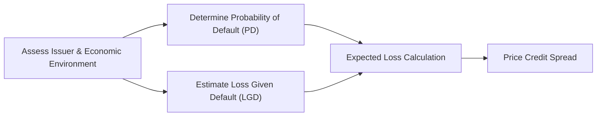

## 7.14 Credit Risk

“Credit risk” might sound a little ominous, right? Well, it certainly can be—because it’s essentially the risk that a bond issuer (or borrower of any kind) might fail to pay back interest or principal in a timely manner, or perhaps not at all. But let’s break it down with some friendly chatter to keep it accessible.

Credit risk in the context of fixed-income securities is the possibility that the issuer will default or otherwise fail to meet its contractual obligations, such as coupon payments or the return of principal at maturity. When we talk about bonds, loans, or other debt instruments, credit risk is front and center because, hey, if you’re lending money, you’d like to be relatively sure you’ll get it back—plus some return for your trouble.

This section explores the two main components of credit risk, Probability of Default (PD) and Loss Given Default (LGD), and it looks at how credit spreads move in response to market and economic factors. You’ll also see a few real-life examples, some personal anecdotes, and a friendly tone that (I hope) helps make this dense material more approachable.

---

Introduction

I remember being startled the first time I heard someone say, “We’re about to buy this high-yield bond because we think the probability of default is low.” I thought, “Wait, how can a ‘junk bond’ have a low probability of default?” Then someone explained that a bond’s rating (like CCC or B) signals a higher chance of default than, say, AAA or AA. But it's still a matter of “expected” or “probabilistic” events. So sometimes, a bond in the “junk” category might have a relatively low chance of default compared to others in that category, which can yield a pretty decent return if things go well. But phew, it’s not always as cut-and-dried as textbooks make it seem.

Remember from earlier in Chapter 7 (Fixed Income) that the yield or return on a bond includes not just the underlying risk-free rate, but also any compensation for additional risk. With credit risk, that “additional” piece is called the credit spread.

---

Credit Risk and Its Two Main Components

Credit Risk in a nutshell is the risk of financial loss if an issuer fails to make required coupon or principal payments. Now, to navigate credit risk, practitioners often break it down into two complementary concepts:

• Probability of Default (PD): The likelihood that an issuer (or borrower) will fail to pay its obligations—like coupons or principal—over a certain time horizon.  
• Loss Given Default (LGD): The actual financial loss incurred if a default occurs. This is typically expressed as a percentage of your total exposure to the issuer.

If you’re thinking, “Hmm, it’s like car insurance, right? Probability of an accident multiplied by how bad the damage is,” you’re on the right track. When combined, PD and LGD produce the expected loss on holding a particular bond.

---

Understanding Probability of Default

Probability of Default (PD) is, quite simply, the chance that an issuer is going to throw up its hands and say, “Sorry, I can’t pay anymore.” From a friend’s perspective, think of a buddy who sometimes borrows money from you and sometimes doesn’t pay back. You’d probably keep a mental note in your head: “This friend has a 20% chance of ghosting me every time he borrows.” That’s your “PD.” Finance folks, of course, formalize it with rating models, historical data, etc.

To assess an issuer’s PD, analysts look at:  
• The issuer’s financial ratios (like leverage, interest coverage, or liquidity).  
• Macroeconomic factors (like recessions, interest-rate environments, or commodity prices for relevant businesses).  
• Industry factors (competition, regulatory changes, industry cycles).  
• issuer-specific “soft” factors like management quality or corporate governance.

PD can vary widely based on these conditions. The deeper we are into an economic downturn or if the issuer is facing legal trouble or some big new competitor, the higher the PD. In that sense, PD is a forward-looking measure, because it tries to capture how likely a borrower will default in the future, not just what’s happened in the past.

---

Loss Given Default

Now, suppose an issuer does default (which might be a small or large chance). The question then becomes: “How big is my loss?” Technically, LGD is the portion of the exposure that’s lost in the event of default. If you do manage to recover some portion through bankruptcy proceedings, that reduces your ultimate loss.

For example, if you have lent $1 million to an issuer and it defaults, but you’re eventually able to get $200,000 back through asset liquidation or restructuring, your loss is $800,000, or 80%. Hence, LGD = 80%. This metric is linked to recoveries—higher recoveries reduce your LGD, so that’s good from a creditor’s perspective. Of course, the entire process can be quite complicated, especially if multiple creditors fight over the same assets in court. But that’s real life, I guess.

---

Combining PD and LGD into Expected Loss

The big synergy here is that expected loss (EL) can be boiled down to:

EL = Probability of Default (PD) × Loss Given Default (LGD) × Exposure at Default (EAD)

(If you’re super new to the Exposure at Default concept, it’s basically how much you stand to lose if the default happens—like the total face amount still at risk.)

So if your bond’s PD is 5% over a year, and you believe that if default happens you’ll lose half your money (LGD = 50%), with an exposure of $1 million, your expected loss for that year is:

EL = 0.05 × 0.50 × \$1,000,000 = \$25,000

It’s not that you will lose exactly $25,000. It’s a probabilistic concept. But it shows that out of $1 million invested, your expected credit-related loss is $25,000. This concept sets the stage for how credit spreads get priced:

Investors want to be compensated for these expected losses—plus they want some extra compensation for the uncertainty (and possibly the risk that actual losses might be higher than expected).

---

The Credit Spread as Compensation for Credit Risk

The “credit spread” is the difference in yield between a bond that carries credit risk and a default-free bond of comparable maturity. Typically, U.S. Treasury bonds are considered “default-free,” so if a corporate bond yields 6.5% while the comparable Treasury yields 4%, we say the credit spread is 2.5% (sometimes referred to as 250 basis points).

Why do we see these yield differentials? Because the corporate bond investor is taking on the chance that the issuer might not pay back—the PD. The investor also risks that if default happens, they won't get as much money back as they hoped—LGD. The credit spread is the market’s price of risk, which can fluctuate, sometimes dramatically, based on supply-demand conditions, panic modes, euphoria modes, or changes in interest rates.

On a personal note, I once watched the credit spreads for a major auto manufacturer blow out from around 100 basis points to 1,000 basis points in about a year. People got worried that the company would go belly-up. Eventually, the company got government assistance, restructured, and bondholders ended up not losing everything. If you’d had nerves of steel (and a strong stomach for risk) and bought that bond at the right time, you could have made a tidy profit. But oh my goodness, that volatility was not for the faint of heart.

---

How Yield Spreads Widen or Tighten

Credit spreads are not static. As the economy moves through expansion, peak, recession, and recovery (which we also discuss in Chapter 3, Economics – Understanding Business Cycles), risk appetite changes. During boom times, yields on riskier bonds might come down as investors chase yields and assume default rates will remain low. So credit spreads “tighten.” During a recession or credit crisis, investors flee to safety, which reduces demand for riskier bonds, pushing their prices down and yields up. That makes credit spreads “widen.”

• Macro conditions: High unemployment, rising interest rates, or a bank liquidity problem can create a risk-off environment that widens spreads.  
• Industry fundamentals: If the industry is facing new regulations or disruptive technologies, that might raise PD for an entire swath of issuers.  
• Issuer-specific events: An accounting scandal or a product recall can quickly raise an issuer’s PD, forcing credit spreads on their bonds to spike.

---

Industry Fundamentals and Credit Risk

A lot of times, you can’t just look at one company in isolation. If you hold a bond in an oil and gas company, the entire industry can be hammered by falling commodity prices, thereby making everyone's PD jump at once. The flip side is that if energy prices rise and the macro environment is stable (for the time being), the entire sector’s perceived risk might drop. You often see credit spreads for industry peers move in tandem, only diverging if a particular company has unique news or stronger fundamentals that set it apart.

This means that analyzing credit risk usually goes beyond the corporate balance sheet into a broader perspective, including commodity markets, global competition, technological shifts, or even geopolitical tensions. 

---

Issuer-Specific Events

We should also factor in unique, unpredictable events:  
• A major lawsuit or regulatory penalty  
• A serious data breach or cybersecurity meltdown  
• A sudden leadership change or scandal  
• A leveraged buyout that significantly increases debt levels

Any of these scenarios might quickly alter the market’s perception of default risk, changing the bond’s yield spread almost overnight. I remember a time a mid-sized company with which I was familiar faced a regulatory fine for environmental issues. Out of nowhere, its credit spreads soared from about 300 to 700 basis points, simply because no one was sure if the fine would cripple the company. Eventually, they reached a settlement that wasn’t too damaging, and the spreads narrowed again—but for a short period, it was a roller coaster.

---

Practical Example: A Corporate Bond

Let’s walk through a hypothetical scenario, but one that’s grounded in real processes. Suppose you’re looking at a five-year corporate bond issued by “XYZ Corp.” You note:

• The current 5-year U.S. Treasury yield is 3%.  
• XYZ Corp. has a credit spread of 2%, meaning your yield to maturity would be 5%.  
• You estimate (through rating agencies and your own analysis) that the probability of the company defaulting over the next five years is around 4%.  
• If they default, you anticipate an LGD of 60% (meaning you lose 60% of what’s exposed).  

If you buy $100,000 worth of this bond, your expected loss is PD × LGD × EAD. Over the 5-year horizon, you might approximate something like:

EL = 0.04 × 0.60 × \$100,000 = \$2,400

Now, that’s extremely simplified because default can take place anytime in that 5-year window, and discounting those losses back to present value would refine the calculation. But you get the picture. The reason the bond yields 5% (rather than 3%) is primarily to compensate you for that expected loss (and some additional risk premium for potential volatility, plus overall market conditions).

---

Another Real-World Example: Securitized Debt

In structured finance (like mortgage-backed securities or asset-backed securities), credit risk analysis gets even more nuanced because the underlying pool might have thousands of mortgages and consumer loans. In that sense, PD spreads out across many obligors, and the LGD might depend on collateral (like houses or cars) or on insurance enhancements. We address structured products more deeply in other parts of Chapter 7 and in the final sections on Securitization (7.17) and ABS (7.18). But just know that the same fundamental formula and logic apply: measure PD, measure LGD, multiply, then see if the spread is high enough to justify the risk.

---

Diagram: The Relationship Among PD, LGD, and Expected Loss

Below is a simple flowchart in Mermaid.js to help visualize how Probability of Default (PD) and Loss Given Default (LGD) come together in establishing credit risk and expected loss:

You can think of the “Assess Issuer &amp; Economic Environment” node as that big soup of credit analysis: financial statements, rating agency opinions, macro data, competitive landscape, and so on.

---

How Spreads React Over Time

One tricky part about credit spreads is that they can change quickly, sometimes in ways that seem disconnected from the fundamentals. Short-term market psychology, liquidity constraints, or forced selling by certain funds can all create short-term distortions. Over the long run, though, credit spreads typically reflect the market’s view of the underlying PD and LGD.

It’s helpful to remember that the credit spread you earn also includes compensation for other factors—like the uncertainty around the estimate of PD and LGD, or potential changes in interest rates that disproportionately affect corporate issuers compared to Treasuries.

---

Best Practices (and a Few Pitfalls)

When analyzing credit risk, you want to avoid some common mistakes:

• Overconfidence in estimates: PD and LGD might seem precise if you’ve run a fancy model, but the future never obeys our best guesses with 100% fidelity.  
• Ignoring liquidity risk: Sometimes, an issuer might be solid, but if the market for its bonds is tiny or dislocated, you could lose money just because it’s hard to sell the bond at a fair price.  
• Focusing only on credit ratings: Rating agencies provide valuable insights, sure, but they can lag behind reality. Always do your own research and stay current on developments.  
• Missing the bigger economic picture: Even a healthy issuer can face higher PD if the entire economy (or its sector) goes into a tailspin.

Some folks like to keep large spreadsheets or advanced software that models out thousands of scenarios. Others just stick to simpler ratio analysis. The key is to remain curious and skeptical—like a detective hunting for red flags. 

---

Encouragement for Further Learning

Credit risk analysis can feel overwhelming because it involves a mixture of fundamental analysis, macroeconomic forecasting, and a dash of subjective judgment. We see more advanced approaches in the Basel Accords (for banks) that precisely define how to estimate PD and LGD. If you’re diving deeper, consider looking up the Basel Committee on Banking Supervision’s documents on PD/LGD frameworks; or skim some Edward Altman research on default probabilities and Z-scores to refine your credit selection skills.

---

References and Further Reading

• Altman, E. “Credit Risk and High-Yield Bond Analysis.” An excellent resource for advanced credit risk modeling.  
• CFA Institute Level I Curriculum on credit risk fundamentals.  
• Basel Committee on Banking Supervision documents for PD/LGD frameworks (https://www.bis.org).

---

Conclusion

As you can see, credit risk analysis is about more than just labeling a bond “safe” or “risky.” It’s about measuring the chance something might go wrong (PD), how bad it could get (LGD), and determining if the yield (plus credit spread) justifies taking on that risk. Markets vary, companies evolve, and your risk appetite might shift, so credit risk is never “one and done.” You watch for changes in issuer fundamentals, market sentiment, and, yes, the global economy. 

If you’re feeling a bit uneasy, that’s normal—we all do at times. But credit risk is like any other big finance topic: you read, you practice, you watch markets, and eventually it starts to click. Maybe you’ll even start to see new opportunities in the credit market that you once would have overlooked. And hey, that’s part of the thrill of investing.

---

## Mastering Credit Risk: Test Your Knowledge



### Which of the following best describes credit risk?  
- [ ] The risk of inflation eroding bond returns.  
- [ ] The risk of changes in interest rates adversely affecting bond prices.  
- [x] The likelihood that an issuer might default on its obligations.  
- [ ] The possibility of bond prices dropping due to market volatility.  

> **Explanation:** Credit risk refers specifically to the possibility that an issuer might fail to meet interest or principal payments, leading to a potential loss for investors.

### Which of the following expressions best represents expected loss?  
- [x] (Probability of Default) × (Loss Given Default) × (Exposure at Default)  
- [ ] (Risk-Free Rate) × (Duration)  
- [ ] (Yield Spread) × (Liquidity Premium)  
- [ ] (Recovery Rate) ÷ (Interest Coverage)  

> **Explanation:** Expected Loss = PD × LGD × EAD. This formula combines the chance of default, the proportion of exposure lost if default occurs, and the total amount at risk.

### A corporate bond has a 3% probability of default annually and an LGD of 50%. If you hold a $100,000 position in that bond, what is the annual expected loss?  
- [ ] $1,000  
- [x] $1,500  
- [ ] $3,000  
- [ ] $5,000  

> **Explanation:** Expected Loss = PD × LGD × Exposure = 0.03 × 0.50 × $100,000 = $1,500.

### The difference in yield between a corporate bond and a default-free government bond of the same maturity is known as what?  
- [x] Credit spread  
- [ ] LIBOR spread  
- [ ] Duration premium  
- [ ] Recovery rate  

> **Explanation:** The credit spread captures the extra yield demanded by investors to compensate for the credit risk associated with a particular issuer relative to a default-free benchmark.

### Which factor is most likely to widen credit spreads across most corporate bonds?  
- [ ] A broadly improving economic outlook  
- [x] A global liquidity crunch or risk-off environment  
- [x] A sudden surge in default fears  
- [ ] A drop in central bank policy rates  

> **Explanation:** Credit spreads often widen in risk-off environments or times of liquidity crunch when investors become more cautious. Investor appetite shifts toward safer assets, which drives up yields for riskier bonds, thereby widening spreads.

### During an economic expansion, credit spreads generally:  
- [ ] Widen significantly for all issuers.  
- [x] Tighten because investor risk appetite usually increases.  
- [ ] Become irrelevant as default risk disappears.  
- [ ] Remain fixed, unaffected by market conditions.  

> **Explanation:** In expansion phases, investors are often more willing to take on risk, so credit spreads tend to decrease (tighten).

### If a major scandal significantly increases a company's Probability of Default (PD) but the company's collateral value rises at the same time, what might happen to Loss Given Default (LGD)?  
- [ ] It will always rise above 80%.  
- [ ] It must offset the PD entirely.  
- [x] It might decrease because higher collateral value improves recovery.  
- [ ] It remains fixed, unaffected by collateral values.  

> **Explanation:** If the collateral value is higher, then in the event of default, investors might recover more, reducing LGD even though PD might have gone up.

### Issuer-specific factors that can lead to rapid widening of a bond’s credit spread include:  
- [x] Accounting scandals.  
- [ ] Benchmark Treasury yields dropping.  
- [ ] Investor risk appetite across all markets.  
- [ ] A general decline in commodity prices for non-related industries.  

> **Explanation:** An accounting scandal is a direct, issuer-specific event that can quickly raise an issuer’s perceived risk of default and cause credit spreads for that issuer to widen sharply.

### Which of the following statements best explains how macroeconomic conditions affect credit spreads?  
- [x] Recessions generally increase credit spreads as investors fear defaults.  
- [ ] Strong economic expansions always cause credit spreads to widen.  
- [ ] Macroeconomic conditions have no bearing on credit risk.  
- [ ] Credit spreads only move when inflation changes significantly.  

> **Explanation:** During recessions or economic contractions, default risk is perceived to be higher, causing credit spreads to widen as investors demand higher yields for taking on additional risk.

### True or False: Credit ratings from agencies are a flawless and real-time indicator of an issuer’s creditworthiness.  
- [ ] True  
- [x] False  

> **Explanation:** Credit ratings provide a helpful but sometimes lagging or incomplete view. They are not flawless and can be slow to adjust to new developments, so analysts should conduct their own comprehensive credit research as well.


