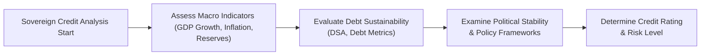

## 7.15 Credit Analysis for Government Issuers

Hey there—so today, we’re diving into something that can sometimes feel intimidating yet is super central to global finance: credit analysis for government issuers. It covers a wide range of topics, from large-scale macroeconomic measures (like GDP growth or inflation) all the way to the potential for local governments to collect taxes or rely on transfer payments from a central authority. In short, we want to figure out: When a government borrows money, can they (and will they) actually pay it back?

Now, if you’re reading this, my guess is you either want to impress your pals with your macro know-how or you genuinely need to get a grip on how government bonds work for your next finance exam. Either way, let’s walk through the fundamentals together. And yes, I’ll throw in a couple of personal stories about my own run-ins with government debt markets—just to keep things a bit more real.

---

### Understanding Government Credit Analysis

Credit analysis for government issuers differs from corporate credit analysis in some unique ways:

• Governments can tax citizens or issue currency (at least if we’re dealing with a sovereign in its own currency) to raise revenues.  
• Political and policy considerations often drive government financial decisions.  
• In a pinch, a government may have the option to reduce its expenditures—or even print additional money—to service its debts.  

But it’s not always as simple as “They’ll just print more money!” because different elements—like political stability—can seriously affect willingness to pay. Perhaps the government is stable but chooses to prioritize other spending over debt service. Or maybe it’s dealing with large foreign currency liabilities that it can’t just cover by printing local currency. All these factors matter.

---

### The Sovereign vs. Non-Sovereign Distinction

Before we get lost in the weeds, let’s clarify something: A “sovereign” bond typically refers to debt issued by a national government. A “non-sovereign” government bond might be issued by a local or municipal authority (such as a city, region, or state). Think of it this way:

• Sovereign Issuers: The “federal” or “national” level—the big guys.  
• Non-Sovereign Issuers: The smaller levels—states, provinces, municipalities, or special districts.  

Both sets of issuers need a credit analysis, but each has different dynamics. A local government can’t necessarily print money and might rely in part on transfers from the national government.

---

### Sovereign Credit Analysis: Ability and Willingness

When analyzing a sovereign credit, we often talk about a government’s ability and willingness to repay. Ability is mostly about economic capacity—like the tax base, foreign reserves, or the potential for generating surpluses. Willingness can be trickier: It’s about whether the government sees debt repayment as a priority, particularly in times of political or economic stress.

Personally, I remember researching Argentina’s debt crisis some years back. Argentina, with top-notch farmland and what seemed like reasonable growth at times, had a solvency path that looked workable on paper—until it wasn’t. Political decisions, currency pressures, and external trade imbalances came together to shape the outcome.

#### Local Currency vs. Foreign Currency Debt

Sovereigns can issue debt denominated in local currency or foreign currency (often USD or EUR). Local currency debt may be repaid, in theory, by printing more local currency—although that can create inflation risks. Foreign currency debt is trickier because a government typically can’t just print foreign currency; it must earn or borrow it, typically through exports, foreign direct investment, or borrowing on international capital markets.

---

### Evaluating Macroeconomic Indicators

When you do a deep-dive on the creditworthiness of a government issuer, you track a broad set of macro indicators. Let’s highlight some big ones:

1. **GDP Growth**  
   You want robust GDP growth because it can expand the country’s tax base, thereby boosting government revenues. A higher GDP (in real terms) usually points to greater capacity to service debt.

2. **Inflation**  
   Inflation can help or hurt. In moderate doses, inflation may reduce the real burden of existing nominal debt. However, high or runaway inflation can scare away investors, weaken the currency, and create political turmoil.

3. **Foreign Reserves**  
   For sovereigns that must repay foreign currency debt, foreign reserves are vital. Low reserves signal potential liquidity risks; robust reserves show a stronger buffer for external shocks.

4. **External Debt Levels**  
   External debt is essentially money owed to foreign creditors. If this gets too large relative to GDP, or relative to export earnings, then the possibility of default can go up—especially if currency depreciation hits.

5. **Government Revenues and Fiscal Balances**  
   We look at how the government is collecting money. Is the budget balanced, in surplus, or in a large deficit? Persistent deficits could be financed by more debt, but that might become a vicious cycle if debt grows faster than GDP.

Below is a simple table summarizing (in an ultra-quick snapshot) a few macro indicators often used in sovereign credit analysis:

| Indicator         | Relevance to Credit Analysis                                           |
|-------------------|------------------------------------------------------------------------|
| GDP Growth        | Higher growth → stronger tax base, better ability to service debt      |
| Inflation         | Moderate → can reduce debt burden; High → can lead to instability      |
| Foreign Reserves  | Key buffer for external debt; reduces default risk on foreign currency |
| External Debt/GDP | Higher ratio → potential solvency issues                               |
| Fiscal Balance    | Deficits → might indicate rising borrowing needs                       |

---

### Debt Sustainability Analysis (DSA)

Debt sustainability is basically the idea that a government can keep paying its obligations without continuously increasing its debt-to-GDP ratio to unsustainable levels or defaulting. If you’ve peeped at any IMF-report (I used to do that a lot in grad school—admittedly, weird hobby, but hey), you’ll see they do a “Debt Sustainability Analysis.” They project future GDP, fiscal balances, and interest costs, then check whether debt remains stable or not.

A typical DSA includes:

1. **Baseline Projections** of GDP, interest rates, exchange rates, and primary balances (the budget balance before interest payments).  
2. **Stress Tests** that see what happens if growth is 2% lower than expected or if interest rates rise more than forecast.  
3. **Policy Recommendations** to maintain a sustainable debt path, like raising taxes, cutting spending, or implementing structural reforms.

---

### Political Stability, Policy Frameworks, and External Factors

Ability and willingness to pay also hinge on political factors—does the government have stable leadership, or is it subject to frequent changes that hamper consistent policy? Are there ongoing conflicts or is there civil unrest that might redirect spending? All these circumstances affect credit risk.

#### Political Stability

Politically stable nations, with clear rule of law and established institutions, typically have a lower risk profile. The political environment shapes not only immediate economic policy but also the population’s tolerance for austerity measures. A stable environment might more consistently prioritize debt repayment because sudden policy reversals are less likely.

#### Policy Frameworks & Currency Issuance

Some governments can’t use monetary policy flexibly to finance deficits because they might be part of a currency union (think Eurozone members). Others, like the U.K. or Japan, can issue currency at will—though that could create other risks (hello inflation!). It’s not automatically “safe” to rely on printing money, but it does reduce the chance of a nominal default for local-currency debt.

#### External Factors: Commodity Dependence & Trade Relations

A government heavily reliant on oil exports or other commodities might face more volatile revenues. Big swings in global commodity prices can disrupt fiscal and external accounts. Also, trade relationships can be crucial—if a major trading partner imposes sanctions or tariffs, that can seriously dent export earnings and hamper the ability to service foreign currency debt.

---

### Non-Sovereign Issuers (Municipal Bonds and Similar)

Alright, so not all government-issued bonds come from the national level. Think about your local city or state. If they decide to build a new school or fix roads, they might issue “municipal bonds.” These can be:

• **General Obligation Bonds (GOs)**: Repaid from the general tax revenues of the local government.  
• **Revenue Bonds**: Secured by revenues from a specific project, like a toll road or a water utility.  

Non-sovereign government issuers (e.g., municipalities) generally have more constrained revenue bases. They can’t just produce new money. Their creditworthiness often links with the health of the regional economy, property values (since property taxes often matter), or the presence of robust local industries. Another big factor: Some local governments partially rely on subventions or transfers from the national or state-level government. In certain regions, a city might be on pretty shaky footing without those higher-level grants.

I once visited a city council session in my local community, curious about how they’d finance an upcoming infrastructure plan. They basically had to get approval for a bond issue that hinged on projected property tax revenues for the next 10 years. If the area’s property values fell drastically, that could blow a hole in their ability to service debt. So analyzing municipal debt means you have to keep an eye on local job growth, real estate trends, demographic shifts, and political willingness to raise taxes (which, let’s face it, isn’t always popular).

---

### Comparing Sovereign and Non-Sovereign Government Issuers

In short:

• **Sovereign**:  
  - Potential to raise money via taxation at a national level.  
  - May have the ability to issue its own currency.  
  - Political risk is typically broader, encompassing global diplomacy and trade.  

• **Non-Sovereign**:  
  - Revenue base is narrower (e.g., local taxes, fees, state-level transfers).  
  - No direct control over currency issuance.  
  - Credit quality can vary significantly from city to city or region to region.  

---

### Sample Mermaid Diagram of Credit Analysis Steps

To get a visual sense of this credit analysis process, here’s a simple flowchart:

The flow is similar for non-sovereign entities, but with a heavier emphasis on local economic conditions, legislative constraints, and sometimes the degree of financial support from higher tiers of government.

---

### Challenges and Common Pitfalls

• **Ignoring Political Will**: Don’t forget that the best economic fundamentals might not save a bond if the government decides to default for political reasons.  
• **Excessive Reliance on Currency Printing**: Yes, a sovereign can technically print money for local-currency debt, but high inflation and currency devaluation can erode investor confidence.  
• **Overlooking Contingent Liabilities**: Government balance sheets may hide big liabilities. For instance, if a government heavily guarantees public company debts, that can come back to bite them.  
• **Underestimating External Shocks**: Commodity prices, exchange rate moves, or global economic downturns can quickly reverse a promising fiscal trajectory.

---

### Practical Example: Greece’s Debt Crisis

In the early 2010s, Greece faced a massive debt crisis despite being part of the Eurozone. It couldn’t just print more euros to pay back its debt. Economic growth slowed, government deficits ballooned, and the country needed bailouts from international organizations. The crisis was made worse because:

• Greece had limited control over monetary policy (the European Central Bank managed the euro).  
• Political bickering and social unrest made austerity measures hard to implement.  
• Investors viewed Greek bonds as far riskier than, say, German bonds (also denominated in euros) because of fear that Greece might exit the euro or default.

This example highlights how the policy framework (a single currency area) can limit a sovereign’s options and intensify credit risk.

---

### Best Practices

• **Incorporate Multiple Scenarios**: If you’re analyzing government bonds, do scenario analysis around economic growth, commodity prices, and interest rates.  
• **Monitor News and Policy Announcements**: Governments can quickly change borrowing plans and fiscal policies. Keep an eye on legislative changes, upcoming elections, and policy statements.  
• **Leverage Rating Agency Methodologies**: Agencies like Moody’s, S&P, and Fitch provide frameworks that systematically evaluate sovereign credit traits. Use them as a reference point—not necessarily as the final word.  
• **Don’t Ignore Market Signals**: Watch yield spreads relative to benchmark bonds. If a government bond starts trading at a big premium to the risk-free rate, the market might be pricing in higher default risk.

---

### Encouraging Critical Thinking

You know, it’s super easy to just glance at a government bond rating and call it a day. But in practice, if you’re a portfolio manager or analyst, you should do your own diligence. Why does Moody’s or S&P assign that rating? What’s changed since the last rating decision? For instance, if a country depends heavily on copper exports and the global copper price is tanking, do you think that rating might be a bit outdated?

Remain curious and keep learning—scour IMF reports, dig into a government’s budget documents, and watch out for sudden shifts in the political winds. The more you practice this, the more you’ll see patterns and (hopefully) avoid pitfalls.

---

### Glossary

• **Sovereign Debt**: Debt issued by a national government, often with different risk profiles depending on whether it’s local or foreign currency.  
• **Debt Sustainability**: A government’s long-term ability to service its debts without default or restructuring.  
• **Municipal Bond (Muni)**: Issued by local entities (cities, states). Repayment often depends on taxes or specific project revenues.

---

### References & Further Reading

• **IMF Country Reports and Debt Sustainability Analyses (DSA)**: The IMF regularly publishes country-specific analyses, an invaluable resource for anyone wanting to see real-life DSA applications.  
• **“Sovereign Rating Methodology” by Moody’s and S&P**: Check out these rating agencies’ detailed frameworks for how they gauge sovereign risk.  
• **CFA Institute Level I Curriculum**: Contains robust sections on both corporate and government credit analysis.  

---

Anyway, that’s it. Government credit analysis is all about balancing the big macro forces with the nitty-gritty of local policies, politics, and structural frameworks. If you can master it, you’ll be able to look at a scenario, connect the dots, and form a reasoned view on the probability of default and potential returns.  

If it feels overwhelming, trust me: It gets clearer with practice. Keep digging into those economic data points, watch the political environment, and always be curious. Good luck, and I hope your next venture into sovereign or municipal bonds feels a whole lot less daunting.  

---

## Practice Questions: Mastering Government Credit Analysis



### Which of the following macroeconomic indicators is most commonly examined when assessing a government's ability to service its debt?

- [ ] Sales growth
- [ ] Market share
- [x] GDP growth
- [ ] Profit margin

> **Explanation:** GDP growth is a key indicator of a government’s economic output and tax base. It is widely used in sovereign credit analysis as it essentially shows whether the economy is expanding or contracting, which helps determine the government's capacity to generate revenue for debt repayment.

### In sovereign credit analysis, “willingness to pay” can be influenced by:

- [x] Political factors and policy priorities
- [ ] The number of local banks operating in the country
- [ ] A single year’s budget deficit
- [ ] Stock market performance alone

> **Explanation:** Political factors and policy priorities often determine the government's willingness to honor its debt obligations, especially in times of economic or political stress. Even with an adequate tax base, a government might choose to allocate funds differently if there is insufficient political will to repay.

### One main difference between sovereign debt and corporate debt is that:

- [ ] Corporations can always print more money to cover their liabilities.
- [ ] Governments are legally obligated to run balanced budgets.
- [x] Sovereigns may issue currency to repay local-currency denominated debt.
- [ ] Corporate bonds cannot be sold in foreign markets.

> **Explanation:** Sovereign governments that issue their own currencies have the option of creating new money to meet debt obligations (denominated in that currency). This ability does not exist for corporations, which must rely on external funding or operational cash flows.

### Which of the following most accurately describes non-sovereign (municipal) debt?

- [ ] It is repaid only by printing currency.
- [x] It is often serviced through local taxes or project revenues.
- [ ] It cannot default because the issuer is a government entity.
- [ ] It is guaranteed to have a lower yield than federal debt.

> **Explanation:** Municipal debt usually relies on a smaller revenue base—like property taxes or fees from projects. Unlike a sovereign, a local government can’t just print its own currency.

### Within debt sustainability analysis (DSA), which scenario tests are typically performed?

- [x] Stress tests on key variables like GDP growth and interest rates
- [ ] Stress tests on management turnover in local corporations
- [x] Tests that model potential exchange rate movements
- [ ] Tests that only factor in foreign direct investment

> **Explanation:** A debt sustainability analysis involves projecting multiple scenarios and stress tests. Common stress variables include GDP growth, interest rates, and exchange rates. These stress tests help analysts see how debt metrics could change under adverse conditions.

### Why might political instability increase the credit risk of a sovereign issuer?

- [x] Because unstable regimes may shift policy priorities away from debt repayment
- [ ] Because political instability boosts foreign direct investment
- [ ] Because government expenses always decline
- [ ] Because stable governments usually default more often

> **Explanation:** When there is political instability, policy can change abruptly, and a government may deprioritize debt repayment or face difficulties implementing fiscally responsible measures. This volatility increases credit risk.

### How can commodity dependence impact a sovereign’s creditworthiness?

- [x] Commodity price swings can cause volatile government revenues
- [ ] Commodity-dependent countries never face default risks
- [x] Declining commodity prices reduce export earnings
- [ ] Commodity-based economies are immune to inflation

> **Explanation:** If a government relies heavily on a single commodity (e.g., oil exports) for revenue, drops in that commodity’s price can severely reduce funds available to service debt. That volatility often raises the sovereign’s credit risk.

### Which factor is crucial for analyzing municipal bond issuers but might be less critical for a true sovereign analysis?

- [x] Reliance on intergovernmental transfers
- [ ] Central bank monetary policy
- [ ] The country’s main commodity export
- [ ] National-level political stability

> **Explanation:** Municipalities often rely on transfers or grants from higher levels of government to supplement their budgets. In sovereign credit analysis, the question of intergovernmental support is not typically the same dynamic, as the sovereign is the top authority.

### An economy sees its external debt levels rise relative to GDP, and the local currency is depreciating. What does this situation imply about credit risk?

- [x] The risk could be increasing, especially for foreign currency debt
- [ ] The risk is automatically lower due to cheaper exports
- [ ] There is no impact on debt sustainability
- [ ] It indicates a default is impossible

> **Explanation:** If external debt is growing relative to GDP and the currency is weakening, it becomes more challenging to service foreign-denominated debt obligations. These factors typically raise the sovereign’s credit risk.

### True or False: A sovereign that issues its own currency can never default on local-currency debt.

- [x] True
- [ ] False

> **Explanation:** Technically, a sovereign that issues a fiat currency can always print more money to pay off local-currency debt, making a nominal default unnecessary. However, this might trigger inflation and other economic distortions, and some governments might still choose to restructure rather than face hyperinflation. In the strict sense, though, running out of local currency is not a concern.


