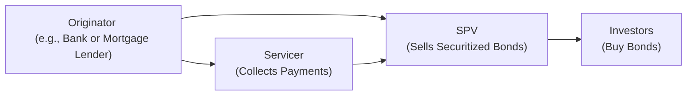

## 7.17 Fixed-Income Securitization

Securitization might sound like some fancy technical process, and, well, in a certain sense, it is—but don't let that intimidate you. The idea behind securitization is actually quite straightforward: Take a bunch of loans or other illiquid financial assets (like mortgage loans, auto loans, or credit card receivables), bundle them up, and then transform them into marketable bonds that can be sold to investors. 

I remember the first time I heard about securitization in a finance class. I thought, “Wait, you’re telling me that thousands of individual mortgages can be crammed into a neat little package and sold off as bonds? But how does that even work?” It turns out that for many lenders, securitization is an elegant way to convert their loans into cash, free up capital, and transfer some of their risk to the broader market. And for investors, it’s a chance to gain exposure to a diversified pool of assets that—in theory—can offer a predictable flow of interest and principal over time.

This section sheds light on the mechanics, rationale, and risks of fixed-income securitization. We'll go through the origin of the deals, how they’re structured, and some of the important concepts that make these transactions possible.

---

### Why Securitization?

• Transforming Illiquid Assets Into Tradable Securities  
• Diversifying Risk by Spreading it Across Multiple Investors  
• Lowering Funding Costs for Originators  
• Streamlining the Capital Market

Securitization is a big deal in finance. It helps solve a classic problem: Many institutions (think banks, mortgage lenders, or even auto dealerships that finance cars) end up holding a ton of loans on their balance sheets. These loans tie up capital. By pooling these loans together in something known as an asset pool and then selling pieces of that pool to investors, the originator (the entity that created the loans in the first place) gets back a bunch of cash, thereby freeing up capital and fueling new lending. 

Lower funding costs can also come into play here. Because the assets are pooled and often structured with various risk layers, the senior-most bonds might get high credit ratings. Higher ratings typically mean lower interest rates, which helps the originator secure cheaper financing than they might be able to on their own.

You might be asking: “What’s the catch?” or “Isn’t there more complexity here?” Indeed, there’s a lot that can happen behind the scenes—different credit enhancements, legal structures, and the possibility that something might go wrong, like borrowers defaulting in large numbers. Still, the basics remain consistent: Securitization is about unlocking value from a pile of loans and transferring that risk/return package to investors in bond form.

---

### Key Players in Securitization

Let’s highlight the major players involved in creating these securitized products:

• Originator  
• Servicer  
• Special Purpose Vehicle (SPV)  
• Credit Rating Agencies  
• Investors  

Think of them like the cast in a play—each has a distinct role that needs to be performed well for the final “performance” (the securitized bond) to be successful:

**Originator**  
This is the entity that originally extended the loans—like a bank providing mortgages or an auto finance company offering car loans. Once they have a pool of loans, they can initiate the securitization process. They might sell these assets (the loans) to an SPV in exchange for cash.

**Servicer**  
After the loans are sold, someone has to collect the monthly payments, make sure borrowers aren’t defaulting, handle late fees, and maybe even foreclose or repossess assets if borrowers fail to pay. The servicer does all this. Sometimes the originator continues to act as the servicer; other times, servicing duties might be outsourced to a specialized firm.

**Special Purpose Vehicle (SPV)**  
The SPV is a legal entity created specifically for the securitization. It’s “bankruptcy remote,” which means that if the originator goes bankrupt, the assets in the SPV are still insulated from creditors. This separation (sometimes referred to as a “true sale” of the assets) is vital for investors and credit rating agencies, because it ensures that the bond payments depend primarily on the performance of the asset pool, not the solvency of the originator.

**Credit Rating Agencies**  
Before investment banks or other entities market these securitized bonds to potential investors, credit rating agencies come in to assess their creditworthiness. They look at the underlying assets—like mortgages or auto loans—and try to figure out the likelihood of default or prepayments. Based on this analysis (and also on any structural features of the deal, such as credit enhancements or tranching), the rating agency assigns a rating. This rating heavily influences both the cost of the bonds (for the issuer) and the yield for investors.

**Investors**  
Finally, these bonds must be purchased by investors. Investors can include mutual funds, pension funds, insurance companies, hedge funds, or even individuals—basically anyone looking for yield (potentially higher than comparably rated corporate bonds, depending on the structure). Because most securitized products carry some form of credit enhancement and are structured around a diversified asset pool, they can be an attractive addition to a fixed-income portfolio.

---

### The Securitization Chain: Conceptual Diagram

To illustrate how the originator, SPV, and investors interact, check out this Mermaid diagram:

- The originator packages loans that it owns and sells them to the SPV.  
- The SPV issues bonds (Asset-Backed Securities or Mortgage-Backed Securities, etc.) to investors.  
- Investors pay cash to the SPV in order to buy these securities.  
- The servicer collects monthly payments (principal and interest) from borrowers and channels them back to the SPV.  
- The SPV then uses that cash flow to pay interest and principal to investors.

This neat little loop is what transforms illiquid assets into more liquid capital market instruments.

---

### The Mechanics of Securitization

There are some mechanics that bring everything together:

• **Pooling of Assets**: A selection (pool) of loans or receivables is identified. The pool may have certain characteristics—for instance, a group of mortgage loans all issued within a certain region, or auto loans with similar maturities.  
• **Transfer to SPV**: The asset pool is sold to an SPV. This SPV is a separate, bankruptcy-remote entity.  
• **Structuring and Tranching**: The SPV can slice and dice the pool’s cash flows into multiple tranches with different priorities (more on this next).  
• **Distribution of Securities**: The SPV then issues securities to investors—usually bond-like instruments.  
• **Servicing**: A servicer is appointed to ensure collections from underlying borrowers.  
• **Payment to Investors**: As underlying borrowers pay their loans, these cash flows pass through to investors according to the contractual terms of each tranche.

---

### Tranching and Waterfall Structures

One of the hallmark features of securitization is “tranching.” Instead of issuing a single class of securities, the SPV may issue several tranches—think of them like layers in a cake (or maybe a fancy dessert with different layers of cream, fruit, and cake). Each layer (tranche) comes with different risk and return profiles.

Well, let's say you have:

• **Senior Tranche:** Top of the capital structure, highest claim on cash flows, typically the lowest risk but offers the lowest yield.  
• **Mezzanine Tranche:** Middle layer, moderate risk, moderate yield.  
• **Equity/Junior Tranche:** Bottom layer, often highest risk, but also the highest potential yield.  

The SPV sets a “waterfall” structure to allocate incoming cash. The senior tranches get paid first; only when they’re fully satisfied do the mezzanine tranches get their payments, and then if there’s anything left, the equity tranche receives its share. Likewise, if there are defaults in the underlying asset pool, the equity or junior trenches typically absorb losses first, then mezzanine, and so on, preserving the senior tranches as much as possible.

It’s this tiered approach to distributing cash (and absorbing losses) that can allow a single pool of loans to appeal to a broader range of investors with different risk tolerances. If you’re a very conservative investor, you might buy the senior tranche. If you’re comfortable with higher risk for higher returns, you might go for the mezzanine or equity tranche.

---

### Credit Enhancements

Credit enhancement is any technique that the SPV or the deal sponsor uses to make the securities more attractive or to provide additional security to a certain tranche. Some common forms:

• **Subordination:** One of the simplest forms—structuring the deal so that certain tranches first absorb losses, protecting the senior tranches.  
• **Overcollateralization:** Pledging a larger amount of assets than needed so that even if some of the assets underperform, there’s enough collateral to pay the investor.  
• **Excess Spread:** If the interest collected on the underlying assets is significantly higher than what the SPV pays out on its bonds, there’s a cushion (the “excess spread”) that can be used to absorb defaults.  
• **External Guarantee:** Sometimes, a third-party guarantee (e.g., a monoline insurer) might wrap part of the deal, pledging to ensure timely payments if underlying borrowers default.

---

### Types of Assets Commonly Securitized

• **Residential Mortgages:** Often leading to Mortgage-Backed Securities (MBS), including pass-throughs, collateralized mortgage obligations (CMOs), and others—but more detail on these can be found in sections like 7.19.  
• **Commercial Mortgages:** Typically form Commercial Mortgage-Backed Securities (CMBS).  
• **Auto Loans:** The underlying loans for auto purchases.  
• **Credit Card Receivables:** Ongoing receivables from credit card balances.  
• **Student Loans, Equipment Leases, etc.:** Almost any predictable cash flow can be securitized.  

Each type of underlying asset brings its own flavor of risk—mortgages carry prepayment risk if homeowners refinance or sell early; credit cards carry higher credit risk if cardholders default. But in principle, the mechanics of packaging these cash flows are relatively similar.

---

### Unique Risks of Securitized Products

While securitized products can offer diversification, yield, and potentially high-return opportunities, they also come with unique risks. Let’s take a look:

**Prepayment Risk**  
In mortgage-backed securities, borrowers can pay off their loans ahead of schedule (usually when interest rates drop and they want to refinance). If prepayments spike, investors might get principal back earlier than they planned, depriving them of future interest. This can be particularly painful if they end up reinvesting those principal payments in a lower-rate environment.

**Default Risk**  
Yes, it’s spread out, but default risk remains. If a recession hits and many borrowers can’t pay, the pool might see skyrocketing default rates. The senior tranches might still be fine (depending on the severity of the defaults), but mezzanine or equity tranches can be wiped out.

**Extension Risk**  
Opposite of prepayment risk: If interest rates rise (or if borrowers can’t refinance for other reasons), loans in the pool might be paid off more slowly. That means investors receive their principal later than expected, effectively locking them in to a lower rate when the broader market might be offering higher interest rates on new securities.

**Market Liquidity Risk**  
Although securitized products are generally recognized by the market, they can become less liquid in times of stress, making it harder for investors to sell quickly at a fair price.

**Legal/Structural Risk**  
Because securitization deals are heavily dependent on legal isolation of assets, any challenge to that structure—such as a bankruptcy court ignoring the SPV’s separation—can cause serious problems.

---

### Comparison with Corporate Bonds

Although both corporate bonds and securitized products are fixed-income instruments, there are notable differences:

• **Underlying Cash Flows:** Corporate bond payments come from a company’s overall revenue, backed by the company’s promise to pay. Securitized bonds are backed by the cash flows from a specific pool of assets, like mortgages or auto loans.  
• **Credit Risk Assessment:** For corporate bonds, it’s primarily about the firm’s profitability and solvency. For securitized bonds, it’s about the performance of the asset pool, the structural features of the deal, and the credit enhancements in place.  
• **Prepayment Risk:** Corporate bonds don’t generally face the same prepayment risk as something like a mortgage-backed security, where the homeowners can decide to pay off their loans early.  
• **Asset Isolation:** With securitized bonds, the assets are legally isolated from the originator’s operational and credit risk. With corporate bonds, you’re exposed to the issuing corporation’s overall financial viability.

Securitized products can thus provide diversification benefits, but they introduce complexities that trained analysts have to understand—and that's exactly why we devote time to them in fixed-income study.

---

### Practical Example / Case Study

Let’s run through a simple example, somewhat simplified of course, but it should get the logic across:

Imagine Bank ABC has originated 1,000 mortgages. Each mortgage’s average principal is about $200,000. The total face value of the pool is $200 million. The bank’s plan:

1) Package all these mortgages into a pool.  
2) Sell the pool to an SPV for $200 million.  
3) The SPV pays $200 million to Bank ABC, but it doesn’t just have that money lying around. To get the cash, the SPV sells multiple tranches of bonds to investors. Let’s say it sells:  

   • $160 million in Senior A Tranche rated AAA.  
   • $30 million in Mezzanine B Tranche rated BBB.  
   • $10 million in Equity/Subordinated piece, unrated, often kept by the sponsor (or sold to a smaller set of risk-oriented investors).  

4) The SPV collects monthly mortgage payments from all the homeowners through the servicer (which could be Bank ABC). It uses those funds to pay interest on the Senior A Tranche first, then the Mezzanine B Tranche, and if enough cash is left, it pays the Equity Tranche. If the underlying borrowers default, the equity tranche is impacted first, absorbing losses.  

From the bank’s vantage point, they’ve turned a big chunk of mortgages into cash. They can use that money to fund yet more loans, or for other business operations (assuming they make good underwriting decisions). Investors get distinct layers of risk and return. If you’re an insurance company that wants something safe, you’d buy that AAA-rated senior tranche. If you’re a hedge fund comfortable with risk and aiming for higher yields, you might dabble in the mezzanine or equity tranches.

---

### Practical Insights

• **Data Analytics**: Monitoring the performance of each loan in the pool requires robust data. Loan-level reporting has become more common, which helps investors assess ongoing pool health.  
• **Due Diligence**: Before investing, it’s essential to understand the underwriting standards used to originate those loans. Looser underwriting might imply greater default risk.  
• **Regulatory Environment**: Securitizations have faced increased regulation in many jurisdictions following the Global Financial Crisis, limiting some of the riskier structures.  
• **Market Conditions**: As with nearly all fixed-income instruments, interest rates matter. Refinancing waves (when rates drop) can accelerate prepayments. Rising rates can extend durations. Understanding macroeconomic changes is key.  

I recall a friend who once invested in mortgage-backed securities without fully grasping how prepayments could rapidly change the actual yield experienced—getting calls from the bank saying, “Hey, your bonds are returning principal way earlier than you expected,” which was a great boon at first. But then they realized they had to reinvest at lower rates. That was an eye-opening experience.

---

### Best Practices and Potential Pitfalls

Nothing is risk-free, and securitized products certainly require caution and education:

**Best Practices**  
• Study the underlying pool’s composition and borrower characteristics.  
• Understand the structure (waterfall) fully—that’s half the game.  
• Keep an eye on correlation risk: If the assets are from a particular region or sector, you might face correlated defaults.  
• Perform scenario analyses, especially regarding prepayment and default risk under varying economic conditions.

**Common Pitfalls**  
• Relying purely on credit ratings, ignoring the underlying collateral quality.  
• Underestimating extension or prepayment risk.  
• Not carefully investigating the servicer’s capabilities; a poor servicer can fail to collect properly, or handle modifications/foreclosures.  
• Overlooking the complexities of the legal structure and any potential for a “true sale” challenge in bankruptcy.

---

### Conclusion

Securitization is an innovative way to turn a bunch of loans into bonds. It’s made capital more widely available, given investors more vehicle choices for yield and diversification, and—when operating properly—benefited a wide range of stakeholders. Of course, the complexity and the inherent credit and prepayment risks mean securitized products aren’t for the unprepared investor or analyst. But by really getting your hands around the concept of pooling assets, tranching, and distributing cash flows, you can begin to grasp a whole world of structured finance that spans beyond just mortgages, touching autos, credit cards, even intangible assets.

Anyway, watch out for changes in the interest rate environment and macroeconomic cycles, since these can rapidly alter the risk-and-return profile of securitized investments. And keep in mind: The details of these deals can get pretty complicated, so a thorough read of the prospectus and a strong understanding of the possible scenarios is crucial.

---

### Glossary

**Securitization**: The process of pooling various forms of debt (mortgages, credit card receivables, etc.) and selling them as bonds to investors.  
**Special Purpose Vehicle (SPV)**: A legal entity created to isolate the financial assets from the originator’s balance sheet.  
**Tranche**: A segmented portion of the securitized deal that carries different risk/return priorities. The cash flows to each tranche are structured according to a predefined waterfall.  
**Waterfall Structure**: The priority scheme in which cash flows are allocated to different tranches. Senior tranches get paid first, while junior tranches receive the residual but absorb losses first.  

---

### References and Further Reading

• Fabozzi, F. “Handbook of Mortgage-Backed Securities.”  
• CFA Institute Level I Curriculum.  
• “Asset Securitization Report” from SourceMedia for ongoing industry updates.  

You might also explore the next few sections, including 7.18 on Asset-Backed Security (ABS) Instruments and 7.19 on Mortgage-Backed Security (MBS) Instruments, for deeper dives into specific securitized products and their market features.

---

## Test Your Knowledge: Key Aspects of Fixed-Income Securitization



### Which of the following best describes securitization?

- [ ] A process by which a company issues new equity shares to refinance its operations.  
- [x] A process that involves pooling illiquid financial assets and issuing securities backed by those assets.  
- [ ] The action of securing loans from a central bank to support liquidity needs.  
- [ ] A method of swapping variable interest rates for fixed interest rates using derivatives.  

> **Explanation:** Securitization converts illiquid assets (like mortgages, credit card receivables) into tradable securities through an SPV, allowing the originator to free up capital and spread risk to investors.

---

### In a typical securitization transaction, which party is primarily responsible for collecting payments and managing defaulted loans?

- [ ] The Special Purpose Vehicle (SPV).  
- [x] The Servicer.  
- [ ] The Credit Rating Agency.  
- [ ] The Bond Trustee.  

> **Explanation:** The servicer is in charge of collecting monthly loan payments from borrowers and managing delinquencies. Although the SPV legally owns the loans, it usually delegates servicing to a specialized entity.

---

### Which statement most accurately describes a “waterfall” structure in securitization?

- [ ] It is an arrangement where all tranches receive equal payments simultaneously.  
- [x] It is a structure where senior tranches receive scheduled payments first, with subordinated tranches receiving payments only if funds remain.  
- [ ] It is a technique used to increase the coupon rates of all tranches.  
- [ ] It is an agreement to pass through prepayments directly to equity holders only.  

> **Explanation:** A waterfall structure prioritizes which tranches receive payments first and which absorb losses first, ensuring senior tranches have higher credit protection.

---

### If interest rates fall and many homeowners refinance earlier, which risk is most relevant for mortgage-backed securities (MBS)?

- [x] Prepayment risk.  
- [ ] Default risk.  
- [ ] Interest rate risk.  
- [ ] Extension risk.  

> **Explanation:** When homeowners refinance, they prepay their loans early. This means investors get principal back sooner, often leading to lower total interest income than expected.

---

### Which form of credit enhancement involves selling multiple tranches with junior tranches absorbing losses first?

- [x] Subordination.  
- [ ] Overcollateralization.  
- [ ] Excess Spread.  
- [ ] Monoline Insurance.  

> **Explanation:** Subordination means that certain tranches are junior or subordinate to others, thereby providing credit enhancement to senior tranches by bearing losses first.

---

### What is a key benefit to an originator of loans when they opt to securitize rather than hold loans on their balance sheet?

- [ ] Higher default rates.  
- [ ] Guaranteed legal immunity.  
- [x] Lower funding costs and improved liquidity.  
- [ ] Immediate elimination of all credit risk.  

> **Explanation:** By securitizing loans, originators can often lower their funding costs (because of better credit ratings achieved by the SPV) and free up their balance sheets for additional lending.

---

### Which of the following might be a pitfall for investors in securitized products?

- [ ] They automatically get paid first in all circumstances.  
- [x] They may underestimate the impact of prepayment and default risk on the cash flows.  
- [ ] Their investments are risk-free if the SPV is well-structured.  
- [ ] They are not required to understand underlying collateral.  

> **Explanation:** Investors risk focusing only on yield or ratings and not fully analyzing how prepayments, defaults, or extension risk can change the timing and amount of their cash flows.

---

### In a securitization transaction involving residential mortgages, who typically provides credit ratings for the different tranches?

- [ ] The Servicer.  
- [x] Independent Credit Rating Agencies.  
- [ ] The SPV itself.  
- [ ] The Originator only.  

> **Explanation:** Independent credit rating agencies (e.g., Moody's, S&P, Fitch) assign ratings to each tranche based on the underlying collateral performance and structural features.

---

### How does securitization help in diversifying risk from the originator’s perspective?

- [x] By allowing the originator to transfer the risk of default to various investors through the SPV structure.  
- [ ] By consolidating multiple loan portfolios into one extremely large pool that the originator retains.  
- [ ] By eliminating all defaults in the underlying portfolio.  
- [ ] By ensuring the government insures all payments.  

> **Explanation:** When the originator sells the assets to the SPV, it no longer directly bears the risk of default (apart from any retained tranches); hence, that risk is spread among different investors who buy the securitized bonds.

---

### A “true sale” of assets to the SPV in securitization primarily serves to:

- [x] Legally isolate the assets from the originator’s potential bankruptcy.  
- [ ] Guarantee a government bailout in case of crisis.  
- [ ] Provide a direct refund to borrowers on loan interest rates.  
- [ ] Remove the need for any trustee or servicer.  

> **Explanation:** A true sale ensures that if the originator files for bankruptcy, the securitized assets remain with the SPV and are not subject to claims by the originator’s creditors.


