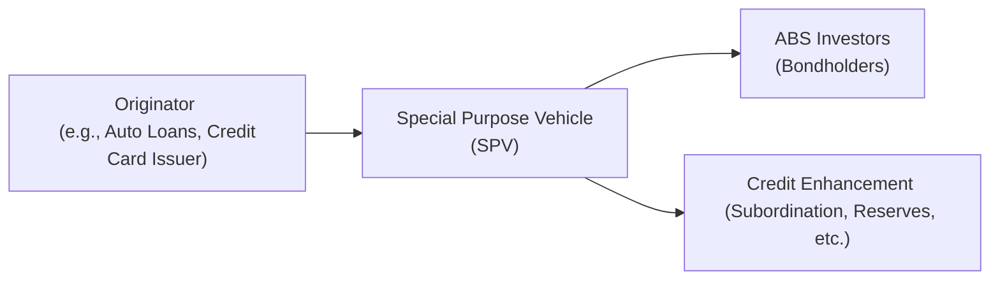

## 7.18 Asset-Backed Security (ABS) Instrument and Market Features

Have you ever stopped and thought, “What else can be securitized aside from those typical residential mortgage bonds everyone seems to talk about?” Well, let me tell you, there’s a whole world of other interesting pools of financial assets out there—like auto loans, credit card receivables, and even student loans—that underlie something called non-mortgage Asset-Backed Securities (ABS). It’s kind of fascinating, really. The idea is fairly simple: gather up a bunch of relatively similar individual debt obligations, pop them into a special legal wrapper, and sell them off to investors in the form of bonds. While it might sound straightforward, the details can get pretty intricate.

In this section, we’ll explore the nitty-gritty of ABS based on non-mortgage assets, check out how credit enhancements work, look at unique repayment structures, and ponder some of the key risks and features that set different ABS pools apart from each other. We’ll also take a peek at the “seasonality” and default patterns within these deals (who knew that holiday shopping might impact your credit card ABS?). Finally, we’ll walk through prepayment considerations—because let’s face it, sometimes we all prefer to pay things off early (such as that car loan we just want to get rid of sooner).

I can still recall how a classmate once financed his very first car using what he thought was a “simple” auto loan. A few years later, that loan—along with thousands of others—had likely been bundled into an ABS structure. It’s surprising how our everyday financial decisions can find themselves connected to large institutional investors through these asset-backed deals. So let’s dive in and see what we can learn together.

---

### Non-Mortgage ABS: An Introduction

When someone says “ABS,” there’s sometimes a reflex to think “mortgages.” But in the strict sense, asset-backed securities may also refer to instruments backed by collateral other than home mortgages (the latter is typically referred to as Mortgage-Backed Securities, or MBS). Non-mortgage ABS can include pools of:

• Auto loans (both prime and subprime)  
• Credit card receivables  
• Student loans  
• Equipment leases  
• Other specialized financing deals (e.g., timeshare loans, small business loans)  

Now, each of these underlying assets is unique. Think about it: an auto loan has a different pattern of monthly payments and default behavior compared to a revolving credit card balance. Meanwhile, student loans can have major legislative and policy influences that shift default rates. When these debts are packaged into an ABS, you’ll see a wide variety of risk profiles. It becomes a bit like choosing from (and analyzing) a box of chocolates—some sweet, some bitter, some with surprising fillings.

Regardless of the asset in question, though, the entire point of creating an ABS is to provide financing to the originators (the lenders) at potentially better rates by transferring the risk to capital market investors. If you think about your credit card company: they make loans to millions of customers, but to keep the pipeline open, they might want to repackage those existing receivables into bonds and get the liquidity sooner. Investors who buy these bonds get exposure to the credit performance and subsequent cash flows from the underlying loans.

---

### Key Components of an ABS Transaction

Before we get to credit enhancements and repayment structures, let’s set the stage with a general view of how an ABS is formed. At a high level:

1. **Originator**: This is the institution that originally extends credit to borrowers. In the case of auto loans, it might be the auto finance company or the bank.

2. **Special Purpose Vehicle (SPV)**: The originator groups the receivables (e.g., auto loans or credit card balances) and sells these assets to a bankruptcy-remote entity—an SPV. The SPV issues securities (bonds) to investors, with the underlying asset pool functioning as collateral.

3. **Servicer**: Typically, the originator or another entity will continue to “service” the loans—collect payments, track delinquency, handle defaults, etc. The servicer then passes the cash flows to the SPV or trustee, which then pays the bondholders.

4. **Investors**: They purchase the ABS bonds, receiving periodic interest and principal payments (subject to the structure’s terms) from the underlying pool’s cash flows.

Let’s visualize this in a simple flowchart.

In the above diagram, the originator sells the pool of assets to the SPV, which issues ABS bonds to investors. To protect investors (and achieve certain credit ratings), credit enhancements are added. This entire framework helps mitigate the risk that borrowers might default on their car or credit card loans, for instance.

---

### Credit Enhancements in ABS

At the heart of these deals lies a critical question: how do we protect bondholders from losses when some of these underlying borrowers inevitably fail to pay? Enter “credit enhancements.”

Credit enhancements make the ABS more palatable to investors and rating agencies, lowering the yield the SPV must offer and thereby lowering the financing cost for the originator. Here are some of the common methods:

#### Overcollateralization

Overcollateralization means the face value of the underlying loans (assets) is higher than the face amount of the ABS issued. For example, if an SPV issues $90 million in bonds but the auto loan pool is $100 million in principal, you have a $10 million “cushion.” If a fraction of those loans default, the extra collateral can absorb those losses before the ABS bondholders see any disruption in their principal or interest payments—at least up to a certain point.

#### Reserve Funds

Sometimes the SPV sets aside a cash reserve fund at issuance, basically a rainy-day fund. If a wave of defaults or some other unexpected shortfall occurs, the SPV can tap into this reserve fund to ensure timely payments on the bonds. These funds might come from the originator’s initial contribution, or from the excess spread (the difference between interest received on the loans and interest paid to bondholders) that is diverted to build up the fund over time.

#### Senior-Subordination Structures

This approach is sometimes called a “waterfall” or “tranching” structure. The ABS might come in different classes (e.g., Class A, Class B, Class C), each with a different level of subordination. Class A is “senior” and gets paid first. Lower tranches (like Class B or C) might absorb losses first. This effectively shifts a portion of the credit risk away from Class A investors. The subordination structure can be quite sophisticated, but the simple premise is that losses get allocated following a strict hierarchy, with certain classes bearing the first wave of defaults.

Think of it as forming a line outside the door for a new iPhone release. The Class A folks are at the front and get served first, while Classes B and C wait in the back. If there aren’t enough phones to go around (i.e., if the collateral underperforms), those at the back of the line suffer. This structure satisfies different investor appetites for risk and yield.

---

### Repayment Structures: Bullet, Soft-Bullet, and Controlled Amortization

Asset-backed securities vary in how the principal is repaid to investors—are the investors going to be paid all their principal at once on the bond’s maturity date, or is it going to trickle through in installments? Different deals might follow different approaches, commonly described as bullet, soft-bullet, or controlled amortization.

#### Bullet Structure

A bullet structure is where principal is scheduled to be repaid in full at the final maturity date. Interest is paid out more frequently (e.g., monthly or quarterly), but the entire principal amount effectively comes due as a lump sum. While this is reminiscent of a corporate bond structure, it can be trickier for ABS where the underlying pool (like auto loans) might be paying down principal at a steady clip, so the SPV must manage those payments and reinvest them or hold them in a “principal accumulation account” until the bullet date. 

#### Soft-Bullet Structure

A soft-bullet sets a certain expected maturity date for the final principal payment, but it also provides an extended legal final maturity date. The difference is that if the principal can’t be fully repaid by the expected maturity date (maybe because of higher default rates or slower repayment from the underlying assets), the deal structure allows extra time to repay. It’s intended to protect the transaction—and calm investors—by saying, “Well, we plan to pay you off by this date, but if the pool’s performance is slower, we have a little buffer.”

#### Controlled Amortization

In a controlled amortization structure, principal repayment occurs in a controlled, scheduled manner, often starting after some lockout period. Let’s say for a credit card ABS, you might have a period of time during which principal payments made by credit card holders are simply reinvested in new receivables (allowing the pool to revolve). Then, once the “amortization period” starts, principal payments are passed through to investors in a planned schedule. 

The choice of repayment structure can significantly affect the risk and yield characteristics of the ABS. If an investor prefers a more predictable schedule, they might lean toward a controlled amortization structure, whereas a bullet or soft-bullet might introduce a bit more uncertainty (especially with how partial prepayments and defaults feed into the overall pool performance).

---

### Different Underlying Asset Profiles

An ABS’s performance – and the nature of its risks – is heavily influenced by the underlying assets. Each asset class has its own quirks:

#### Auto Loans

Auto loans typically include fixed monthly payments, and the final maturity isn’t usually too far out. Borrowers may prepay if they sell or trade in their vehicles, or just decide to throw extra cash to pay off the loan faster. Defaults also can happen if borrowers face hardships. Seasonality might show up if, for example, certain times of year see higher or lower default rates (holidays or tax-refund seasons can play a role in people’s ability or willingness to pay).

Additionally, the recovery on a defaulted auto loan might involve repossessing and selling the car. The car’s value therefore matters—a big drop in used car prices can reduce the recovery amount. 

#### Credit Card Receivables

Credit card ABS differ in that the underlying balances are revolving. Borrowers can continue charging new purchases or pay down their balances monthly, which can fluctuate widely. The structure of a credit card ABS typically includes a “revolving period,” where principal payments get reinvested in new receivables, followed later by an amortization period. 

Credit card default patterns can be influenced by economic conditions, unemployment trends, and consumer behavior. Policy changes like adjustments to credit card regulations can also shift the risk profile. Another interesting note is that credit card debt is usually unsecured, so recoveries on defaulted balances might be minimal.

#### Student Loans

Student loans can be complicated by government guarantees, payment deferrals, or income-based repayment plans. Federal student loans might have a different risk profile from private student loans. Regulatory or policy changes—such as changes in forgiveness programs—can drastically alter the expected cash flows. If you remember a few years back when large policy debates or COVID-19 forbearance measures changed how millions of students repaid their loans, you can see how that might ripple through the ABS market. 

---

### Seasonality and Default Patterns

You might be wondering why we keep referencing seasonality. Well, consumer behavior can fluctuate throughout the year. For instance:

• **Auto Loans**: End-of-year holiday promotions might spur more car purchases, meaning more new loans entering the pool, but also potential changes in delinquency after the holidays if consumers are stretched.  
• **Credit Cards**: Spending ramps up around back-to-school and holiday seasons, and sometimes delinquencies spike in the months following big shopping seasons.  
• **Student Loans**: Borrowers might enter repayment cycles after graduation in certain months, or they might take advantage of grace periods that align with academic calendars.  

These patterns matter because they can affect the timing of cash flows into the ABS. The “average” or “expected” performance might differ significantly from actual monthly performance. ABS structures are designed to handle these ebbs and flows, but investors certainly look at the data to see if delinquencies are trending upwards.

---

### Prepayment Considerations

Prepayment risk isn’t just for mortgages! With auto loans, you can pay off your car early—maybe you got a big bonus at work, or you refinanced to a better rate. In that scenario, an ABS investor receives principal earlier than anticipated, which can lead to reinvestment risk (having to reinvest at a possibly lower interest rate). It can also alter the composition of the remaining pool. If the borrowers who prepay early are those with stronger credit, the remaining pool might have a higher proportion of weaker credits, potentially increasing default risk. 

Credit card receivables, on the other hand, involve more unpredictable repayment patterns. Borrowers might pay off the entire balance in one shot, or they might revolve for months or years. Although it’s a bit different from a typical “prepayment,” the effect of paying down a revolving balance is akin to returning principal to the pool.

You might think: “But wait, if prepayment is so uncertain, how do we manage it?” That’s where the structure’s cash-flow mechanics come into play. Excess spread might get used to cover pool losses or build reserves, or principal might get locked out from repayment to bondholders during the revolving period. Each pool’s documentation is a potential labyrinth, so understanding each deal’s approach is crucial if you’re considering investing in or analyzing this type of security.

---

### Practical Examples and Case Studies

Let’s run through a couple of real-world styled examples:

1. **Auto Loan ABS – 2018 Vintage**  
   • **Deal Setup**: A major auto finance company originating predominantly prime auto loans with a typical maturity of 60 months.  
   • **Credit Enhancement**: Overcollateralization of 5%, a 2% cash reserve fund, and senior-subordinated tranches with Class A, B, and C.  
   • **Performance**: Six months into the deal, default rates were slightly below initial projections, giving comfort to bondholders. Several borrowers prepaid after receiving tax refunds—leading to an earlier-than-expected principal return. The sponsor used a controlled amortization structure, ensuring Class A noteholders were shielded from volatility.  

2. **Credit Card ABS – 2020 Vintage**  
   • **Deal Setup**: A global credit card issuer bundling $500 million in receivables, with a revolving period of 2 years and a soft-bullet maturity date at year 5.  
   • **Credit Enhancement**: Excess spread of about 8% (net interest margin), plus a cash reserve built from the monthly excess spread.  
   • **Performance**: The deal experienced higher than normal delinquencies as unemployment rose, but strong excess spread coverage allowed the trust to maintain principal and interest payments to bondholders. The sponsor extended the revolving period to maintain receivables volume (subject to the original deal documentation), and the soft-bullet maturity date gave a protective cushion.  

These examples underscore the interplay of structure, credit enhancement, and underlying collateral performance. 

---

### Best Practices, Pitfalls, and Strategies

• **Analyze the Underlying Collateral**: Don’t just look at the rating. Delve into the composition of the loan pool—what’s the average borrower credit score? Are these loans seasoned or brand-new? Any geographical or industry concentration?  

• **Evaluate Credit Enhancement Levels**: Overcollateralization or subordination might look fine on the surface, but is it sufficient for a worst-case economic scenario? Ratings agencies will stress-test these deals, but prudent investors do their own scenario analysis.  

• **Understand the Cash-Flow Priorities**: The waterfall matters. Who gets paid first and under what conditions do lower tranches start absorbing losses?  

• **Keep an Eye on Prepayment Trends**: Early payoffs can erode the pool’s interest income or leave behind a weaker cohort of obligors.  

• **Regulatory and Policy Risks**: Especially relevant for student loan ABS or certain specialized equipment leases, changing government policies can create “headline risk” or alter cash flows significantly.  

• **Operational Risk**: The servicer’s ability to collect from borrowers is crucial. A financially weak servicer can sometimes pose operational or even reputational risks to the ABS.  

• **Watch out for Seasonality**: If you see delinquencies spike each holiday season, build that into your projections.  

---

### Common Challenges and How to Overcome Them

1. **Data Complexity**: Sometimes deals provide thousands of pages of data on historical performance. Focus on the key performance metrics—delinquency rates, recovery rates, net losses, and prepayment speeds.  

2. **Model Uncertainty**: Even the best models can’t predict everything. Be prepared for black swan events—like a sudden economic downturn or a pandemic.  

3. **Liquidity Risk**: Secondary market liquidity for certain niche ABS can be thin. Investors might face wider bid-ask spreads, especially during market stress.  

4. **Structural Nuances**: Each deal can have idiosyncratic triggers, such as “early amortization events” for credit card ABS if performance deteriorates beyond certain thresholds. Stay alert to these triggers in the prospectus.  

---

### Encouraging Critical Thinking and Continuous Learning

Every time I examine a new ABS transaction, I’m reminded that no two deals are exactly alike. I think it’s healthy to keep questioning: “What if default rates double?” or “What if prepayments spike?” or “How might policy changes affect the pool’s performance?” Consider realistic stress scenarios to see how robust the structure is. 

Even if you’re not an active ABS investor, understanding the dynamics of consumer finance and structured products can broaden your view of the fixed-income landscape. The link between everyday life—like paying off a credit card or finishing a student loan—and global capital markets is more direct than many people realize.

---

### Diagrams, Charts, and Tables

Often, analysts use tables to summarize pool characteristics. For instance:

| Asset Type   | Average Borrower FICO | Current Collateral $   | Coupon (Approx) | Overcollateralization | Reserve %  |
|--------------|-----------------------|------------------------|-----------------|-----------------------|------------|
| Auto Loans   | 690                   | \$1 Billion            | 3.50%           | 5%                    | 2%         |
| Credit Cards | 720                   | \$500 Million          | 4.25%           | None (Excess Spread)  | 1%         |
| Student Loans| 650                   | \$600 Million          | 5.00%           | 3%                    | 1%         |

This type of table can help you quickly compare different deals. Meanwhile, credit enhancement and cash flow prioritization charts (often in the offering documents) can make it easier to see how these deals distribute principal and interest each month.

---

### Conclusion

Asset-Backed Securities backed by non-mortgage assets—like auto loans, credit card balances, or student loans—play a vital role in modern finance. They connect everyday borrowing needs to large institutional investors, providing liquidity to originators while offering a potentially attractive, diversified investment opportunity to buyers. At the same time, these structures aren’t without complexity: credit enhancements, repayment mechanics, prepayment risks, and unique regulatory or policy considerations all factor into the equation.

What should be your main takeaways? First, always look beneath the surface to understand the collateral’s nature. Second, pay close attention to the structure’s protective layers (credit enhancements) and how the cash flows are allocated by seniority or subordination. Finally, appreciate that no single “one-size-fits-all” approach exists—each transaction can be quite distinct, reflecting the unique traits of borrowers and lenders in the underlying market. 

And with that, we wrap up our visit to the world of non-mortgage ABS. Next time you swipe your credit card or think about that auto loan, remember there could be a bunch of fixed-income analysts out there, eyes glued to monthly performance reports, trying to predict if you’ll pay a day late or a month early.

---

### References & Further Reading

- Fabozzi, F. “Collateralized Debt Obligations and Structured Finance.”  
- CFA Institute Level I Curriculum, Non-Mortgage ABS Product Structures.  
- SIFMA Insights on the U.S. ABS Market: <https://www.sifma.org/>

If you’re itching to learn more, definitely check out those resources. Fabozzi’s work is an excellent deep dive into structured finance, and SIFMA offers real-time market data and insights for U.S. dealers and investors. Keep learning—and remember that curiosity is your best friend in this field.

---

## Mastering Non-Mortgage Asset-Backed Securities: 10 Practice Questions



### Which of the following is typically a type of underlying asset for a non-mortgage ABS?
- [ ] Residential mortgages
- [ ] Commercial mortgage loans
- [x] Auto loans
- [ ] Farm land leases

> **Explanation:** Non-mortgage ABS commonly include auto loans, credit card receivables, and student loans, among others. Residential or commercial mortgage loans are used in mortgage-backed securities (MBS or CMBS).

### Which of the following is NOT a credit enhancement technique typically seen in ABS structures?
- [ ] Overcollateralization
- [ ] Reserve funds
- [x] Equity share buybacks by the originator
- [ ] Senior-subordinated structures

> **Explanation:** Overcollateralization, reserve funds, and the senior-subordinated structure are all standard credit enhancement methods. An equity share buyback by the originator is not a typical credit enhancement in the ABS space.

### In a senior-subordination structure, which tranche absorbs default losses first?
- [ ] Senior tranche (Class A)
- [x] Subordinated tranche (e.g., Class B or C)
- [ ] Mezzanine tranche only
- [ ] They absorb losses proportionally

> **Explanation:** Subordinated tranches absorb losses first, protecting the senior tranche.

### A "bullet" repayment structure in ABS refers to:
- [ ] A structure where principal is paid pro-rata each month
- [x] Principal repayment occurring in one lump sum at maturity
- [ ] Principal repayment whenever defaults occur
- [ ] Immediate repayment of the entire principal at issuance

> **Explanation:** The “bullet” structure pays interest periodically but repays principal in one lump sum, typically at final maturity.

### Which type of ABS commonly contains a "revolving period" during which principal payments are reinvested in new receivables?
- [ ] Auto loan ABS
- [x] Credit card ABS
- [ ] Equipment lease ABS
- [ ] None; all ABS must have a static pool

> **Explanation:** Credit card ABS typically have revolving periods to accommodate the constantly changing balances (new purchases and principal paydowns) of consumer credit card activity.

### Overcollateralization implies:
- [x] The loan pool’s principal exceeds the face value of the ABS
- [ ] The ABS face value equals the total pool balance
- [ ] Interest payments are waived for some bondholders
- [ ] Investors have unlimited exposure to credit losses

> **Explanation:** Overcollateralization means there is more collateral than the par value of the bonds issued, providing a cushion against potential defaults.

### A soft-bullet structure provides:
- [x] An expected maturity date and a legal final maturity date
- [ ] Immediate full repayment at issuance
- [x] Additional time if not fully repaid by the expected maturity
- [ ] No time cushion or extension possible

> **Explanation:** A soft-bullet designates a target redemption date but also allows an extended final maturity if payments from the collateral are insufficient by the expected date.

### Which statement regarding auto loan ABS is TRUE?
- [x] Default recoveries often depend on the resale value of vehicles after repossession
- [ ] They usually feature no credit enhancement
- [ ] They have no risk of prepayment
- [ ] They do not experience any seasonality in repayment

> **Explanation:** When a borrower defaults on an auto loan, the lender may repossess and sell the vehicle. The sale price (or resale value) determines the recovery. Auto loan ABS also often feature credit enhancements, and borrowers can prepay. Seasonal factors can influence payment behavior.

### Prepayments in auto loan ABS can lead to:
- [x] Investors receiving principal earlier than expected
- [ ] Loss of coupon payments for the SPV
- [ ] No impact on the deal’s cash flows
- [ ] Automatic extension of the bond’s final maturity

> **Explanation:** With auto loan ABS, borrowers who pay off their loans early reduce the principal balance more quickly, so investors receive earlier-than-scheduled principal payments, leading to reinvestment risk and changes in the pool composition.

### True or False: Credit card ABS typically have no risk associated with credit card holders paying off their balances early.
- [x] True
- [ ] False

> **Explanation:** While it's not “prepayment risk” in the traditional mortgage sense, credit card holders can pay down or even pay off balances at any time. The ABS structure usually treats these paydowns similarly to prepayments in other asset classes, influencing cash flow timing.


