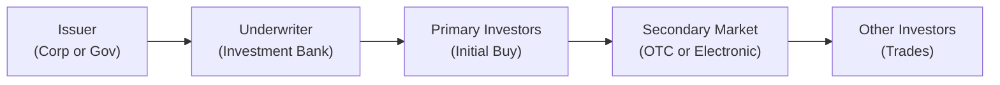

## 7.3 Fixed-Income Issuance and Trading

Ever find yourself at a fancy dinner party and someone starts talking about how bonds are issued and traded, and you’re like, "Uh... I’d rather talk about literally anything else"? If so, this section is for you! Together, we’re going to walk through the ways new bonds come to life in the primary market, how they find their way into investors’ hands, and how those same bonds later change hands in the secondary market. Think of this as diving into the behind-the-scenes story of your favorite show—except here, the show is the incredible world of bond markets, and you’re about to see all the drama and excitement that goes into bringing a fixed-income security from the issuer’s desk to your portfolio.

Let’s start with a quick overview. When companies or governments want to borrow money, they may choose to issue bonds. The first time those newly minted bonds are sold to investors is called the primary market. After that, if an investor wants to sell these bonds to someone else, those transactions happen in the secondary market. Easy enough, right? But how does the whole process really work? Let’s take a look, step by step.

---
  
### Primary vs. Secondary Markets

If you’ve already peeked at Section 7.1 or 7.2, you might remember we talked about bond features and valuations. Now we’re venturing into the actual mechanics of selling those bonds.

• The **Primary Market** is where new bonds are created and sold by the issuer (e.g., a corporation, a municipality, or a sovereign government) to investors.  
• The **Secondary Market** is where existing bonds (those issued previously) are then traded among investors—meaning the issuing entity is no longer directly involved.

Okay, so maybe that doesn’t sound too complicated, but let’s emphasize something: the primary market is crucial. It’s how issuers actually raise funds to build bridges, open new plants, or sometimes pay off older debts. Investors considering a primary market transaction must rely on the issuer’s creditworthiness, the structure of the deal, and of course, the yield. After that, in the secondary market, different forces come into play—liquidity, trading volumes, interest rate movements, credit rating changes, etc. All these factors influence bond prices.

Think of the primary market as the "birth" of a bond. The issuer crafts prospectuses, engages underwriters, and tries to set an attractive price (or yield) to appeal to investors. The secondary market is basically the "life" of the bond, allowing it to change hands (hopefully many times) at different price points until maturity or call.

---

### Public Offerings vs. Private Placements

Now, how do bonds actually enter the market? Typically, we talk about **public offerings** versus **private placements**:

• **Public Offerings:** These are widely marketed to the general investing public. For instance, a large corporation might issue a new bond that’s open for subscription by institutions, high-net-worth individuals, and sometimes even retail investors. Public offerings require detailed disclosures, regulatory filings, and a formal prospectus.  

• **Private Placements:** These are sold to a small group of select investors (often institutional). This method has fewer disclosure requirements and is more flexible, but the trade-off is that you typically can’t just go buy these private bonds as a retail investor. They’re "private," after all. Private placements can sometimes be an efficient way for smaller entities, or those with a unique business model, to raise funds without the expense and complexity of a full-blown public issue.

I once had a friend—well, let’s call him Darren—who invested in a private placement bond from a local manufacturing firm. He was all excited about the favorable yield. But guess what? Two years later, he needed liquidity and realized that this bond didn’t trade on any secondary market. He learned the hard way that private placements can be illiquid, and dumping them early can be tricky (or downright impossible). Lesson learned: we must always weigh the cost-benefit of lower disclosure and potentially higher yields vs. the inconvenience of low liquidity in private placements.

---

### Role of Underwriters and Syndicates

When an issuer wants to raise capital through a bond issuance, they usually work with **underwriters** — typically investment banks or bank syndicates. These folks help structure the bond, set the interest rate or coupon, and price it for the market. If the issue is quite large, the underwriter often forms a **syndicate**—a group of banks that share the risk (and rewards) of placing the new bonds with investors.

• The underwriter(s) commits to buy the entire issue (or a large portion) from the issuer at a set price and then resell it to the investors at a slightly higher price. The difference is their underwriting fee or spread.  
• In some cases, underwriters don’t fully commit to purchase everything but agree to use "best efforts" to sell as many bonds as possible. The actual arrangement can vary, but typically there’s some risk on the underwriter’s side if not enough investors subscribe.

---

### Book-Building and Pricing

Ever wonder how the coupon rate or yield of a new bond is decided? That’s where **book-building** comes in. The underwriter (or lead manager) reaches out to potential investors, collecting "orders" or indications of interest—basically asking, "Hey, would you buy, say, $10 million of this new 5-year bond if it yields around 4%?" By gathering these responses, the underwriter determines:

1. The demand for the bond.  
2. The yield or coupon necessary to attract enough buyers.  

Based on investor feedback, they might tweak the yield slightly. Once the book (i.e., list of potential orders) is sufficiently filled, the underwriter finalizes the pricing. And voila, the new bond is ready to be born. That moment can be quite dramatic—like the moment your favorite sports team recruits a new player and announces them to the world.

---

### Auctions for Sovereign Debt

The process for government bonds is similar, but there is often a more standardized **auction** approach. Sovereigns (federal governments) might hold a Treasury auction where investors (including primary dealers and big institutional investors) submit bids on the yield they’re willing to accept. Then the government sets a "stop-out" rate and all successful bidders get the bond at (or around) that yield.

These auctions can be competitive (where bidders specify the yield or price they want) or non-competitive (where smaller investors simply accept the yield determined by the auction). Auctions are common for U.S. Treasuries, British Gilts, Japanese Government Bonds (JGBs), etc. They’re typically well covered in the financial press, so you can actually see in real-time whether demand for a country’s debt is strong or weak.  

I still remember my finance professor telling me to watch U.S. Treasury auctions to see how the market is feeling about macroeconomic conditions. For instance, high demand in an auction might indicate investor preference for "safe" assets, possibly reflecting uncertainty or concern about riskier markets.

---

### Secondary Market Overview: Over-the-Counter (OTC)

Now let’s talk about the **secondary market**, where the vast majority of bond trading takes place. Corporate and government bonds typically do not trade on a centralized exchange like equities (with a few exceptions). Instead, they are bought and sold through **over-the-counter (OTC) markets**. This usually involves direct communication—via phone or electronic messaging—between buyers and sellers (or broker-dealers representing them).

• **OTC is Decentralized:** There isn’t one giant physical trading pit for most bonds. Instead, many financial institutions hold inventories of bond positions and stand willing to buy or sell.  
• **Prices May Vary:** Because the market is decentralized, you can see slight discrepancies in prices quoted by different dealers.  
• **Drink Some Coffee (or Two…):** If you’ve ever watched a bond trader’s desk, you might notice they need lots of coffee because they’re constantly on calls or at terminals checking quotes, trades, and positions. It’s a fast-paced environment.

While OTC remains the dominant platform, there’s a shift toward more **electronic trading** for improved transparency, smaller transaction costs, and faster execution. That said, the bond market is still more fragmented than the stock market, and liquidity can vary from one bond to another.

---

### Electronic Trading Platforms

There’s been a notable movement toward electronic trading platforms over the last decade. These platforms aim to centralize quotes and bids, making it easier for institutions to find counter-parties and trade bonds. Sometimes referred to as electronic communication networks (ECNs) for bonds, these platforms can provide:

- Anonymous trading.  
- Greater transparency of quotes.  
- Automated matching of buy and sell orders.  

Despite this, the market is still quite different from an equity exchange. Many larger trades are still negotiated privately, especially for corporate bonds, where the issue size could be smaller, or there are unique features that make the bond less liquid.

---

### Liquidity Differences Among Market Segments

Keep in mind: not all bonds are created equal in terms of liquidity. Some major government bonds (like U.S. Treasuries, German Bunds) are extremely liquid, meaning you can buy or sell them with minimal price impact. Meanwhile, a small corporate bond issue might barely trade at all after the initial sale in the primary market.

• **Government Bonds:** Often the most liquid. Large volumes, tight bid-ask spreads, and robust secondary market coverage.  
• **Investment-Grade Corporate Bonds:** Fairly liquid, but less so than government paper. Liquidity typically better for well-known issuers or large issuance sizes.  
• **High-Yield (Junk) Bonds:** Lower liquidity. You might struggle to find a buyer or might have to accept a bigger discount to sell quickly.  
• **Private Placements:** Generally do not trade freely in the secondary market and can be quite illiquid.

Just as I mentioned with my friend Darren, liquidity can be a huge factor if you’re an investor who might need to offload your holdings in a hurry. The less liquid a bond is, the wider the spread you might face and the more difficulty you might have finding a ready buyer.

---

### How Bond Prices Are Quoted

Bonds can be quoted in three common ways:

• **Price per 100 of Par Value:** A bond quoted at "98" means it is trading at $98 per $100 of face value (or par). This is a discount to par.  
• **Yield (Yield to Maturity):** Sometimes, traders talk primarily in terms of yield. "I’m seeing that new 10-year bond at 4.2%" basically means the yield to maturity is 4.2%.  
• **Spread Over a Benchmark:** Corporate bonds, especially, might be quoted as "T+ 200," meaning the yield is 200 basis points (2%) above the yield on a benchmark Treasury security with a similar maturity.

You might also hear about "bid" and "offer" spreads—where the "bid" is the price at which the dealer will buy your bond, and the "offer" (or ask) is the price at which they’ll sell the bond to you. The difference (bid-offer spread) is smaller for highly liquid bonds (like treasuries) and larger for less liquid ones.

If you look at a bond screen on a Bloomberg terminal (or any bond trading platform), you might see multiple quotes for the same bond from different dealers, each with slightly different prices. This phenomenon occurs precisely because the OTC market is decentralized.  

---

### Visualizing Bond Issuance and Trading

Below is a simple Mermaid diagram showing the journey of a bond from issuance in the primary market to investor trades in the secondary market.

In this simplified flow:

1. The Issuer (a corporation or government) works with investment banks to structure and price the new bond.  
2. The underwriter (or syndicate) purchases the bond issue and sells it on to a broad group of initial investors (primary market).  
3. After the primary issuance, investors can trade that bond among themselves in the secondary market. This can happen via direct dealer-to-dealer phone calls or through electronic platforms, eventually reaching many other investors.  

---

### Practical Examples and Case Studies

• **Case Study: Apple Inc. Bond Issuance**: Apple, known for strong credit ratings, might bring a multi-billion-dollar bond issue to market. Underwriters collect indications of interest. Demand is huge due to Apple’s reputation, so the coupon might be relatively low. Once issued, these bonds often trade frequently in the secondary market. Liquidity is generally good because it’s a large, well-known issuer.

• **Case Study: Emerging Market Government Bonds**: Let’s say the government of Country X issues new sovereign bonds denominated in U.S. dollars. They do an auction or a roadshow to meet with global investors for book-building. Once priced, the bonds might trade heavily at first—especially if big hedge funds want in or out quickly. After some months, liquidity might thin if the country is smaller or overshadowed by bigger markets.

• **Case Study: Private Placement by a Real Estate Group**: RRG (Random Real Estate Group) does a private placement, offering 7% annual yield to just 10 large institutional investors. Because there’s no broad marketing or exchange listing, the transaction costs are lower for the issuer, but the secondary market is practically nonexistent. This structure appeals to institutional investors who plan to hold the bond until maturity.

---

### Common Pitfalls and Best Practices

• **Ignoring Liquidity Risks**: A bond that yields 7% might look great on paper, but if you can’t sell it later, that extra yield might not be worth it.  
• **Misunderstanding Spreads**: Quoting a bond at T+200 basis points might sound like a good deal, but if the underlying Treasury yield has recently spiked, you might be paying a higher absolute yield than you thought.  
• **Under- or Overestimating Demand**: In the primary market, poor book-building can lead to overpriced or underpriced bonds, either shortchanging the issuer or causing them to overpay on coupon rates.  
• **Underwriting Conflicts**: Sometimes, underwriters have an incentive to sell the bonds quickly and might push down the price, so always watch out for potential conflicts of interest.

Best practices include thorough research on the issuer’s creditworthiness, a strong understanding of the current interest rate environment, comparison shopping among different bonds, and paying attention to the size of the issue (which often correlates with liquidity). Conducting stress tests (e.g., how does the bond hold up if interest rates jump 1%) is also wise.

---

### References and Next Steps

If you want to dive deeper, here are a few places to continue your journey:

• **International Monetary Fund (IMF) Reports** – “International Capital Markets: Developments and Prospects” provides insight into global trends in debt issuance.  
• **CFA Institute Level I Curriculum** – Contains official methodologies on how issuance mechanics work and deeper details about bond math (also see Chapter 7.2 and upcoming sections on yield and credit).  
• **Securities Industry and Financial Markets Association (SIFMA)** – Visit <https://www.sifma.org> for market data, statistical tables, and research on bond markets.  
• **Chapter 7.4 and beyond** – We’ll look at corporate vs. government bond issuance and trading across markets. If you want an even deeper dive into calculating bond prices and yields, check out Chapter 7.6 and 7.7.  

Anyway, that’s the gist. At this point, hopefully you have a stronger grasp of how a bond gets issued and how it typically trades afterward. Remember, the bond market, large as it is, can seem mysterious, but it’s really a network of issuers, underwriters, and investors, all bound together by the desire to lend and borrow money under mutually beneficial terms.

---

## Test Your Knowledge: Fixed-Income Issuance and Trading Quiz



### Which of the following best describes the primary market for bonds?

- [ ] The market where bonds are bought and sold by large pension funds only.
- [ ] The market where stocks are initially offered.
- [x] The market in which new bond issues are first sold to investors.
- [ ] The over-the-counter market where bonds change hands among investors.

> **Explanation:** The primary market is where new bonds are introduced and sold to investors for the first time.

### What is a key characteristic of private placement bonds compared to publicly offered bonds?

- [ ] They can be freely traded by any retail investor in the secondary market.
- [x] They are sold to a small set of select (usually institutional) investors.
- [ ] They must be listed on a major exchange immediately after issuance.
- [ ] They are always less risky than publicly offered bonds.

> **Explanation:** Private placements involve the sale of bonds to a relatively small group of institutional or accredited investors, often with fewer disclosure requirements and more flexible terms.

### In the context of bond issuance, what is “book-building”?

- [ ] A process where underwriters keep a log of all bond transactions after issuance.
- [x] A process by which underwriters gauge investor demand and interest before finalizing the bond's coupon and offering price.
- [ ] A process used exclusively by governments to set auction prices.
- [ ] A process by which investors supervise the underwriters’ daily trading activities.

> **Explanation:** Book-building is when underwriters gather indications of interest from potential investors to help determine the most appropriate yield or price for a new bond issue.

### How are government bonds such as U.S. Treasuries typically issued?

- [ ] They are always privately placed with large institutions.
- [ ] They are sold by dealers at a fixed price that never changes.
- [ ] They are announced but never auctioned.
- [x] They are often issued via a formal auction process involving competitive and non-competitive bids.

> **Explanation:** Many sovereign bonds, including U.S. Treasuries, are distributed to investors through an auction process, where yields and amounts are determined by investor bids.

### In an OTC (over-the-counter) bond market:

- [x] Trading often occurs via phone or electronic messaging between buyers and sellers.
- [ ] All trades are executed on a centralized exchange at a single quoted price.
- [x] Prices can vary among different dealers due to market fragmentation.
- [ ] It generally stipulates retail investors cannot participate.

> **Explanation:** OTC markets are decentralized. Trades are negotiated directly, so prices can differ among various market participants.

### What is one primary reason bid-ask spreads for bonds can widen?

- [x] Decreased liquidity, making it harder to find counterparties willing to trade.
- [ ] Government regulation that sets minimum spreads.
- [ ] The presence of too many market makers offering quotes.
- [ ] The use of automated algorithms in electronic trading platforms.

> **Explanation:** When bonds are less liquid, dealers face more inventory risk, so they typically widen the bid-ask spread to compensate.

### Which of the following is correct about public offerings vs. private placements?

- [x] Public offerings require more regulatory disclosures, while private placements require fewer disclosures.
- [ ] Both public offerings and private placements require zero regulatory disclosure.
- [ ] Private placements always yield less than public offerings due to lower risk.
- [x] Public offerings are marketed to a broad base of investors, while private placements are often narrowly placed.

> **Explanation:** Public offerings must observe strict disclosure requirements and generally target the wider investing public, whereas private placements are limited in scope and have fewer regulatory requirements.

### How is the initial price or yield for a new bond generally determined?

- [ ] Strictly based on credit ratings issued by rating agencies.
- [ ] Randomly assigned by the issuing firm to maximize profit.
- [ ] By referencing the issuer’s stock price performance.
- [x] Through underwriters’ assessments of investor demand during the book-building process.

> **Explanation:** Underwriters collect market feedback from potential investors to decide on the final yield or coupon to ensure the new bond is attractive to the market while meeting the issuer’s objectives.

### Why might an investor consider the “T+ spread” when evaluating a corporate bond?

- [ ] It shows the total price an investor will pay for government bonds.
- [ ] It helps measure changes in operational efficiency of the issuing company.
- [ ] It indicates whether the bond’s coupon rate will remain fixed.
- [x] It indicates how many basis points the corporate bond’s yield is above a benchmark Treasury security.

> **Explanation:** A corporate bond’s yield is often quoted as some spread over a government benchmark yield (e.g., T+200), allowing investors to compare relative value.

### In many bond markets, the dominant trading mechanism is:

- [x] Over-the-counter (OTC) trading.
- [ ] A centralized electronic exchange only available to retail investors.
- [ ] A continuous open outcry pit system.
- [ ] A national clearinghouse that guarantees all trades.

> **Explanation:** Bond markets (particularly corporate bonds) typically trade through a decentralized OTC system where broker-dealers negotiate trades directly.  



---

*Happy studying!* Bonds may not always garner the media attention that flashy stocks or crypto tokens do, but they’re foundational to the global financial system—and, hopefully, to your deeper understanding of portfolio management and strategic investing.
