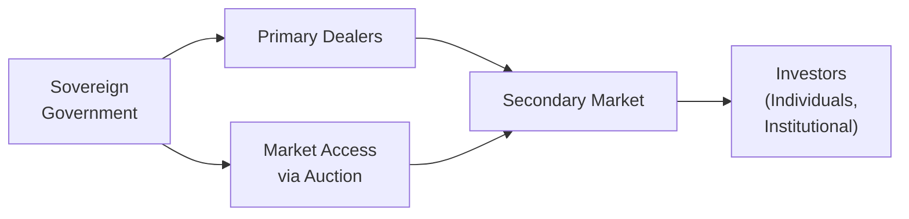
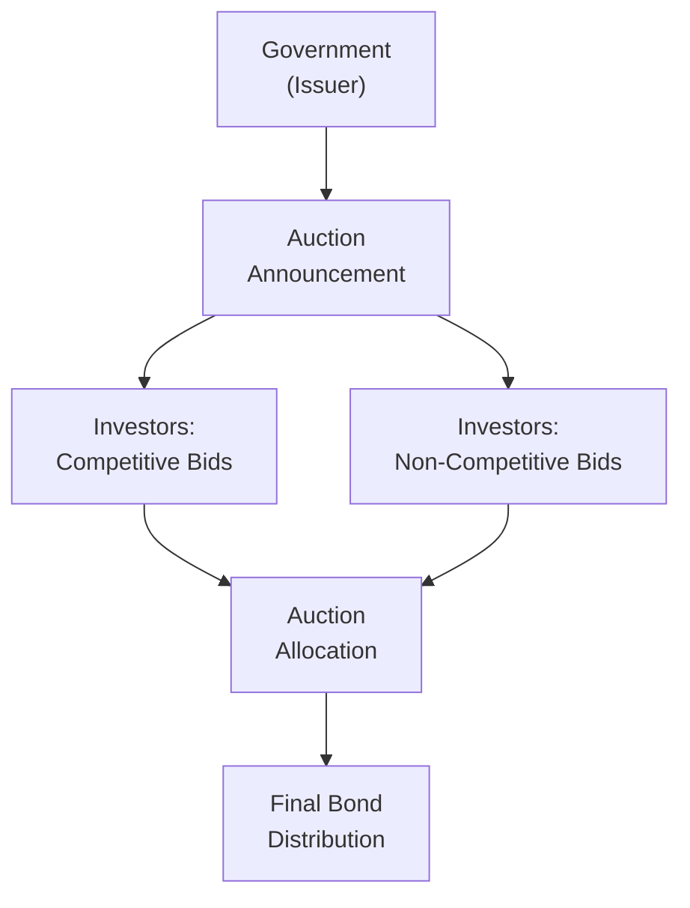

## 7.5 Fixed-Income Markets for Government Issuers

Let’s dive right in. Fixed-income markets for government issuers can at first feel like a complicated tangle of acronyms, processes, and structures. I remember, years ago, one of my earliest attempts at exploring these markets—I accidentally mixed up T-bonds (longer-dated U.S. government bonds) with some local municipal debt and couldn’t figure out why the yield difference was so darn significant. Turned out, I was ignoring the fact that municipal bonds and U.S. Treasuries carry very different credit characteristics and tax treatments. So, let’s learn these terms carefully.

Below, we’ll look at how sovereign and non-sovereign governments raise money, the essential differences between these bond types, and the processes governments typically use to auction or sell these securities to investors. We’ll also explore quasi-government or government-sponsored entities (GSEs), illustrate with a few practical examples, and chat about best practices and potential pitfalls. Hopefully, by the end, you’ll feel more confident about navigating the government side of fixed-income markets.

---

### Overview of Government Fixed-Income Markets

When we talk about government debt, we’re usually referring to bonds or bills issued by:
• Sovereign governments (e.g., U.S., Japan, Germany, U.K.).  
• Non-sovereign governments (e.g., U.S. states, municipalities, or provinces; or local councils in some non-U.S. jurisdictions).  
• Quasi-government or government-sponsored entities (GSEs), sometimes with partial backing from the central government.

Governments generally issue this debt to fund public expenditures, infrastructure projects, or even day-to-day operational needs. The nature of the guarantee behind each bond can vary significantly—from an explicit government promise to repay (often viewed as close to “risk-free” in local currency terms) to partial guarantees or dedicated revenue streams from specific projects (as is often the case with municipal projects).

Below is a short Mermaid diagram that provides a basic visual overview of some of the main players in the government bond market:

In this simple diagram:
• The sovereign government issues bonds through an auction.  
• Primary dealers (often large banks or broker-dealers) participate in these auctions and facilitate distribution.  
• A robust secondary market emerges, enabling institutional or retail investors to buy and sell.  

For non-sovereign or quasi-government bond markets, the shape is similar, though the degree of government backing and the scope of the auction system might differ.

---

### Sovereign Bonds: The Foundational Building Blocks

Sovereign bonds form the cornerstone of many fixed-income portfolios. They are often called “risk-free” when denominated in the government’s own currency, though “risk-free” is a bit of a shorthand. There’s still the possibility of inflation, currency fluctuations, and political instability. However, generally, if a government can print its own money (like the U.S. does with Treasuries in USD or Japan does with JGBs in JPY), default risk is widely perceived as minimal—though not zero.

#### Credit Perspective

Because a sovereign issuer can usually levy taxes or print money to repay its debt, the credit risk (i.e., the risk of default) is considered lower compared to other types of borrowers. That said, foreign currency sovereign bonds—like a developing country issuing debt in U.S. dollars—can carry elevated default risk if the issuer’s domestic currency falls dramatically, making it tough to accumulate enough foreign reserves to meet payments.

#### Currency Risk for Foreign Investors

As a foreign investor, if you invest in a sovereign bond that’s not in your home currency, you face currency risk. For example, a U.K. investor buying U.S. Treasuries in USD gets a “risk-free” USD return but must convert those dollars back to British pounds at some point, which introduces exchange-rate variability. Sometimes, funds designate a currency-hedging strategy (like forward currency contracts) to mitigate that risk. But that’s a story for another chapter (particularly 7.8 or 7.9, which talk about yield and yield spreads for floating-rate instruments and the term structure).

---

### Non-Sovereign Government Bonds (Municipal, State, Local)

Now, let’s look at lower-level or regional governmental debt. In many countries, local governments issue bonds to raise funds for schools, infrastructure, healthcare facilities, or to cover budget deficits. In the U.S., these bonds are generally called “municipal bonds.” In other places, they might have different names, like “sub-sovereign bonds,” “local authority debt,” or “provincial bonds.”

A few highlights:

• **Credit Backing:** Unlike a sovereign that can raise taxes broadly or print money, municipalities, counties, or regions have limited authorities. That means their ability to service debt is often tied to local tax revenue (property, sales, etc.), which can fluctuate more significantly than a national tax base.  
• **Tax Benefits:** In the U.S. specifically, municipal bonds often come with tax advantages—interest can be exempt from federal taxation, and sometimes even state and local taxes, if one resides in the issuing state. This can make them very appealing to certain investors, although yields might be lower, reflecting the tax-exempt feature.  
• **Risk Levels:** Credit risk can vary greatly, depending on the financial health of the region that issues them. Some municipalities default more frequently than central governments, especially during economic downturns, when local tax receipts dry up.

---

### Quasi-Government or Government-Sponsored Entities (GSE)

A quasi-government entity, sometimes referred to as a GSE, is an organization with partial government backing. In the U.S., examples include Fannie Mae (the Federal National Mortgage Association) and Freddie Mac (the Federal Home Loan Mortgage Corporation). They were created to boost the availability of funding in certain sectors, like housing.

Now, GSE debt can be a bit confusing. It is not always explicitly guaranteed by the sovereign (i.e., the government may not be obliged to repay GSE debt), but historically, governments sometimes step in with support if the entity’s default would harm the wider financial system. So:

• **Credit Considerations:** GSE debt typically trades with yields slightly above direct sovereign debt, reflecting a modest premium for credit risk.  
• **Market Influence:** GSE debt can be quite large in advanced markets, offering liquidity levels that may be substantial but still typically less than sovereign bonds.  
• **Comparisons:** When you look at a direct U.S. Treasury bond, you know it’s basically the federal government’s full faith and credit behind it. Compare that to a Fannie Mae note—wholly separate legal entity, but with an implicit government link, especially in times of systemic stress (like the 2008 financial crisis, when the government placed Fannie Mae and Freddie Mac into conservatorship).  

---

### Government Bond Auctions and the Bidding Process

So, how do governments actually issue these bonds? While details vary from country to country, one of the most common methods is via an auction. Central banks or treasuries announce an upcoming auction for certain maturities—maybe 3-month T-bills or 10-year T-bonds. Interested buyers may place:

• **Competitive Bids:** Large institutions (often primary dealers) specify the yield they’re willing to accept, or equivalently, the price they want to pay. The auction sets a “stop-out yield” based on supply and demand.  
• **Non-Competitive Bids:** Smaller investors can basically say, “I’ll buy the bond at whatever the average or winning yield ends up being.” They are guaranteed an allocation, but they don’t influence the yield or price.

Here’s a quick Mermaid diagram to illustrate a simplified version of the auction process:

In short:  
1. The government announces an auction, specifying details like maturity, coupon (or no coupon for T-bills), and total amount.  
2. Investors submit bids. Large institutional players typically do so competitively.  
3. The government ranks bids from lowest yield (highest price) to highest yield (lowest price).  
4. The final (“stop-out”) yield is set where the bond is fully subscribed. Bids that come in below that yield win at their bid, while bids above do not get filled. Non-competitive bidders generally receive the securities at the final, averaged yield.

In the U.S., these auctions happen regularly—every week or even multiple times a week for shorter maturities like T-bills, and periodically for notes and bonds. Other countries have their own cadence. The general idea is the same.

---

### Common Terms and Typical Maturities

Government bonds around the world have unique nicknames, though the underlying idea—“the government owes you money and pays you interest”—is consistent. Let’s see some common references:

• **T-Bills (U.S.):** Short-term debt (maturities of a few days up to 1 year). Typically sold at a discount to par; yield is implied by the difference between purchase price and par value.  
• **T-Notes (U.S.):** Maturities of 2, 3, 5, 7, or 10 years. They pay semiannual coupons.  
• **T-Bonds (U.S.):** Typically 20- or 30-year maturities; pay semiannual coupons.  
• **Gilts (U.K.):** U.K. government bonds. “Conventional gilts” have fixed coupons, while “index-linked gilts” are adjusted for inflation.  
• **Bunds (Germany):** The German federal government bonds. Very popular in Europe as a “benchmark risk-free” asset in euros.  
• **JGBs (Japan):** Japanese government bonds. Known for extremely low yields in a low-interest-rate environment.

Municipal bonds might have their own names, or they might be referred to simply as “munis” (in the U.S.). The maturities can vary widely, from 1-year notes to 30-year bonds. Some municipalities even issue “serial bonds” with staggered maturity dates.  

GSEs, on the other hand, might name their bonds or notes differently, but typically, the structure (coupon, maturity, face value) remains pretty standard in the fixed-income universe.

---

### Risk Considerations

Though many consider sovereign bonds in the issuer’s own currency to be among the safest investments, each type of government bond (sovereign, non-sovereign, or quasi-government) comes with distinct risks:

• **Credit/Default Risk:** Higher for municipalities than for a strong central government, but it can vary widely by country.  
• **Currency Risk:** If you’re buying a bond that’s outside your home currency (or your “operating currency”), you face fluctuations in exchange rates.  
• **Liquidity Risk:** Government bonds of large economies (like the U.S. or Japan) tend to have robust liquidity. Smaller municipal issues or developing country sovereigns may have thinner markets, leading to wider bid-ask spreads.  
• **Inflation Risk:** A fixed coupon may not keep pace with rising inflation. Some governments issue inflation-linked bonds (like TIPS in the U.S. or index-linked gilts in the U.K.).  
• **Interest Rate Risk:** Falling interest rates typically push bond prices up, while rising rates push them down. Longer maturities contain more price sensitivity (i.e., higher duration).

---

### Practical Example: U.S. Treasury Auction

Imagine the U.S. Treasury wants to raise $20 billion via 10-year Treasury notes. It announces an auction date, the coupon (or references a standard coupon if it’s reopening an existing note), and the settlement date. Primary dealers and big institutions gather forecasts of yields. Some might submit bids at, say, 3.50% yield, while another might come in at 3.45% or 3.55%. The Treasury aggregates all the bids, starting with the lowest yield to fill the issue. If the final stop-out yield ends up at 3.53%, that’s the yield that clears the market. Any competitive bid above 3.53% doesn’t get allocated. Non-competitive bids just pay the average of winning yields (or the stop-out yield). Then, the notes are distributed, and they begin trading in the secondary market almost immediately.

---

### Case Study: Emerging Market Sovereigns

Perhaps you’ve heard something about a developing country issuing a “dollar-denominated bond” to global investors. That can get complicated quickly. Such bonds, ironically, carry higher default risk because the country can’t just print U.S. dollars. They might rely on export earnings or foreign exchange reserves to service the debt. If their economy takes a hit, default or restructuring can happen.

Also, interest rates in these markets can be higher to compensate for perceived country risk (political, economic, currency). Over time, some developing countries build a strong track record and see yields converge closer to developed-market benchmarks. Others suffer repeated default cycles that lead to very high yields whenever they return to issue new bonds.

---

### Government-Sponsored vs. Direct Sovereign: A Quick Comparison

Let’s do a quick side-by-side:

| Aspect                | Direct Sovereign Bond            | Quasi-Government / GSE Bond         |
|-----------------------|----------------------------------|-------------------------------------|
| Guarantee             | Usually the full faith & credit  | Often implied or partial backing    |
| Yield                 | Typically lower                  | Slightly higher than sovereign      |
| Liquidity             | High; big global market          | High to moderate                    |
| Examples              | U.S. Treasuries, Gilts, Bunds    | Fannie Mae, Freddie Mac, etc.       |
| Credit Risk           | Minimal (depending on country)   | Slightly more than sovereign        |

In times of crisis, GSE or quasi-government paper may be repriced if investors worry the government may not step in. Direct sovereign bonds, however, remain the ultimate reference for local currency stability.

---

### Best Practices, Challenges, and Pitfalls

• **Best Practices:**  
  – Research the tax implications: For municipal bonds, tax advantages might be crucial in determining your net yield.  
  – Pay attention to the auction schedule: In some markets, auctions are frequent (like U.S. Treasuries), so you can average in over multiple auctions to manage interest rate risk.  
  – Consider currency hedging: If you’re a foreign investor in a local currency bond, it might be wise to hedge if you can’t stomach currency volatility.  

• **Challenges:**  
  – Political and policy risk: Government policy changes or political turmoil can dramatically affect bond yields.  
  – Liquidity in non-major markets: Emerging or smaller economies might have patchy liquidity, making it tough to exit a position quickly.  

• **Common Pitfalls:**  
  – Overlooking currency risk: Even “risk-free” local currency bonds can expose you to foreign exchange losses.  
  – Mixing up the credit backing: Some investors assume GSE debt is as safe as sovereign debt. That’s typically not the case, so yields and risk levels can differ.  
  – Ignoring tax law differences: If you’re buying municipal bonds in a different state or country, you might not get the same tax benefits as local investors.

---

### Conclusion: Summing It All Up

Government bond markets are vast, dynamic, and central to global finance. Sovereign bonds lay a foundation of “risk-free” returns in their local currency, while municipal, state, and quasi-government issuers offer a variety of yields, risk profiles, and structures that can fit different investor needs. By understanding the credit backing, how auctions work, the differences between competitive and non-competitive bids, and the unique features of each type of government bond, you’ll be better equipped to navigate fixed-income markets.

It’s helpful to stay curious. Keep an eye on how governments respond to fiscal demands over time, how their auctions are received by the market, and how agencies like GSEs evolve. I’ve always found it fascinating that something as seemingly mundane as a “debt auction” can bring together every angle of macroeconomics, finance, geopolitics, and investor psychology. And it’s a story that unfolds every day in capital markets around the world.

---

### References for Further Exploration

• “European Government Bond Markets”: Explore research on the secondary market behavior and regulatory frameworks published by the European Central Bank.  
• U.S. Treasury website (https://www.treasurydirect.gov): Contains updates on auctions, announcements, and educational resources about T-bills, T-notes, and T-bonds.  
• CFA Institute Level I Curriculum: Delve into official content on government bond issuance, credit risk, and yield curve analysis.  

If you’re curious about even more detail on yield spreads or yield curve construction, check out Sections 7.6 through 7.9 in this same chapter. And when you’re ready, treat yourself to more advanced discussions like interest rate risk in 7.10 or credit analysis in 7.14 onward. These are all puzzle pieces that come together to form a comprehensive view of fixed-income markets.

---

## Test Your Knowledge: Government Bond Issuance and Markets



### Which type of government bond is typically seen as “risk-free” when issued in its own currency?

- [x] Sovereign bonds
- [ ] Municipal bonds
- [ ] Quasi-government bonds
- [ ] Corporate bonds

> **Explanation:** Sovereign bonds in the issuing government’s own currency are often viewed as “risk-free” because the government can tax its citizens or theoretically print more currency if needed.

### Which of the following statements best describes a municipal bond?

- [ ] It is always guaranteed by the national government.
- [ ] It is offered only in emerging markets.
- [x] It is issued by a local or state government, often with tax advantages.
- [ ] It pays no interest at all.

> **Explanation:** Municipal bonds are issued by state or local governments (like cities, counties, or provinces). In the U.S., interest on these bonds is frequently exempt from certain levels of taxes.

### What is the main difference between a competitive and a non-competitive bid in a government bond auction?

- [x] A competitive bid specifies the desired yield, while a non-competitive bid accepts the yield determined at auction.
- [ ] A competitive bid is always at lower yields than a non-competitive bid.
- [ ] Non-competitive bidders only buy bonds in the secondary market.
- [ ] Competitive bidders are retail investors only.

> **Explanation:** Competitive bidders state their preferred yield or price, influencing the final issuance rate. Non-competitive bidders accept whatever yield emerges from the auction.

### Which of the following best describes a government-sponsored enterprise (GSE)?

- [ ] It is a public company with no ties to the government. 
- [x] It is a partially government-backed entity that aims to enhance credit flow in specific sectors.
- [ ] It is a fully guaranteed debt instrument issued by the government. 
- [ ] It is another term for a municipality.

> **Explanation:** GSEs (like Fannie Mae or Freddie Mac in the U.S.) are not fully guaranteed by the government but carry support because they serve important public policy roles.

### True or False: All GSE debt has exactly the same level of credit risk as direct sovereign debt.

- [ ] True
- [x] False

> **Explanation:** GSEs are not generally backed by the “full faith and credit” of the sovereign. They often have slightly higher yields and credit risk than direct government obligations.

### Which of the following is least likely to be categorized as a significant risk for a local-currency sovereign bond issued by a stable government?

- [ ] Interest rate risk
- [ ] Inflation risk
- [x] Currency risk to domestic investors
- [ ] Political risk

> **Explanation:** For local investors in a stable government’s local-currency bond, currency risk is minimal. However, for a foreign investor, currency risk remains significant.

### A U.S. investor purchases Japanese Government Bonds (JGBs). Which risk is added compared to purchasing U.S. Treasuries?

- [ ] Decreased interest rate risk
- [ ] Decreased credit risk
- [x] Additional currency risk
- [ ] No secondary market liquidity

> **Explanation:** Purchasing JGBs in Japanese yen adds currency risk for the U.S. investor, because the investment must be converted from yen back into U.S. dollars.

### In many countries, short-term government securities that are issued at a discount and mature at par are often called:

- [ ] T-notes
- [ ] T-bonds
- [x] T-bills
- [ ] Gilts

> **Explanation:** T-bills (or treasury bills) mature in a year or less, are sold at a discount, and pay face value at maturity. The difference between purchase price and par is the investor’s return.

### Which entity is typically responsible for conducting government bond auctions and implementing monetary policy in many jurisdictions?

- [x] The central bank or treasury
- [ ] Commercial banks
- [ ] Corporate issuers
- [ ] Municipalities themselves

> **Explanation:** Central banks or treasuries typically manage the issuing and auctioning of sovereign bonds. In some nations, a separate debt management office exists but often works with the central bank.

### Which of the following is a reason why GSE or quasi-government bonds may offer slightly higher yields than sovereign bonds?

- [x] They lack the full faith and credit backing of the sovereign.
- [ ] They are free from interest rate risk.
- [ ] They are free from currency risk.
- [ ] They have more liquidity than sovereign bonds.

> **Explanation:** GSEs typically carry an implicit or partial government guarantee rather than a full guarantee; hence, investors require slightly higher yields due to the added credit risk.


