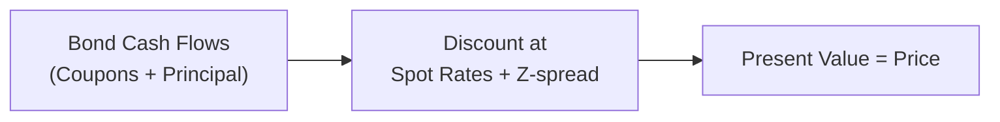
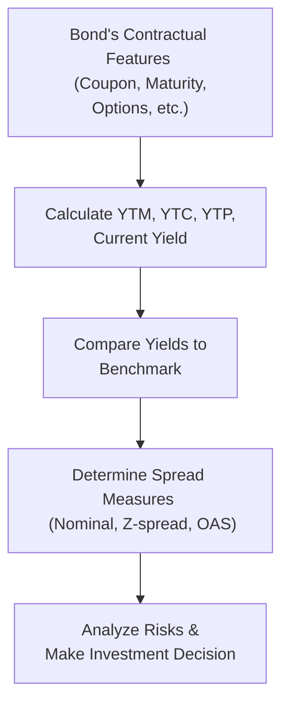

## 7.7 Yield and Yield Spread Measures for Fixed-Rate Bonds

Imagine you just bought a bond—maybe it’s from a well-known corporation—and you’re trying to figure out the annual return you might get if you hold it to maturity. You’ve probably heard people say, “Check the yield-to-maturity” or “Calculate the z-spread.” And you might be thinking, “Wait, what’s with all these different ‘yields’ and ‘spreads’?” Don’t worry; you are definitely not alone. In this section, we’re going to dissect these yield and spread measures and show how they help gauge the relative value and risk profile of fixed-rate bonds.

Sometimes, when I first started learning about bonds, I was honestly confused by all the yield metrics. Current yield sounded straightforward—just coupon divided by price—but then I saw yield-to-call, yield-to-put, yield-to-worst, and it felt like I was sorting through a deck of complicated playing cards. But hey, after a bit of practice (and a lot of restating the formulas to myself), things finally clicked! Let’s walk through these yields and spreads step by step, so you can see the entire picture too.

---

### Why Yield Measures Matter

Bond yields are central to investment decisions because they summarize an investor’s expected rate of return, considering the bond’s coupon payments, any premium or discount at purchase, and the bond’s final redemption value. For example, if you’re analyzing two bonds with essentially the same credit profile, you’d probably pick the one with the higher yield (all else equal). But the story goes deeper than that because embedded options, different call or put provisions, or even the frequency of coupon payments can significantly affect an investor’s actual return.

---

### Key Yield Measures

Let’s start with an overview of the yield measures that get mentioned most frequently.

#### Current Yield
• Definition: The ratio of the bond’s annual coupon payment to its current market price.  
• Formula:  
  Current Yield = (Annual Coupon Payment) / (Bond Price)  
• Why It’s Useful: It’s super easy to calculate and gives a quick snapshot of the bond’s income generation relative to price.  
• Major Limitation: Ignores time value of money and any capital gains or losses you might realize if you hold the bond to maturity or the next call date.

#### Yield-to-Maturity (YTM)
• Definition: The internal rate of return (IRR) that sets the present value (PV) of all future coupon payments and the redemption amount (usually the par value) equal to the bond’s current price.  
• Why It’s Useful: This is widely considered the “comprehensive” yield measure for a bond without embedded options. It factors in coupon rate, price, maturity, and redemption.  
• Interpretation: If you buy a bond at price P, hold it until maturity, and reinvest coupons at that same YTM (theoretically), you’ll earn the YTM on your investment.  
• Caveat: Real-world reinvestment rates might differ, and if the bond has callable or putable features, you might not actually hold it all the way to maturity if the issuer (or you) exercises an option.

#### Yield-to-Call (YTC)
• Definition: The IRR that equates the bond’s current price with its expected cash flows up to the (assumed) call date, plus the call price.  
• Why It’s Helpful: Many corporate or municipal bonds have call features, meaning the issuer can redeem the bond early on specified call dates at a call price (often at par or slightly above par). YTC helps you see what you could earn if the bond gets called.  
• Watch Out For: If rates decline or the issuer’s credit improves, a call is more likely because the issuer can refinance at a lower rate.

#### Yield-to-Put (YTP)
• Definition: The IRR that equates the bond’s current price with its expected cash flows up to the put date, where the investor can sell (or “put”) the bond back to the issuer.  
• Why It’s Helpful: Some bonds have a put option, giving you (the bondholder) the right to force the issuer to buy back your bond at par or a stated price. This can limit your downside if credit conditions turn sour.  
• Watch Out For: Investors usually want to see how soon they can exercise this put option and ensure the price is high enough to mitigate losses.

#### Yield-to-Worst (YTW)
• Definition: The lowest yield across all possible redemption scenarios (e.g., calls, puts, or final maturity).  
• Why It’s Important: YTW is a conservative measure. It answers, “What is the worst-case yield scenario under the existing bond structure?”  
• Personal Note: The first time I saw YTW, I was like, "Wait, that’s so negative-sounding!" But it’s actually a great risk management concept. It prevents you from overestimating your returns if the issuer calls the bond or if you have to exit early.

---

### Coupon Frequency and Compounding Conventions

Much of bond yield measurement also depends on the frequency of coupon payments and the convention used to annualize yields. A bond that pays coupons semiannually might quote yields on a bond-equivalent basis, meaning:

• Bond Equivalent Yield (BEY): Typically doubles the semiannual yield instead of compounding it.  
• Effective Annual Yield (EAY): Takes into account the effect of compounding. This might look like:  
  (1 + periodic rate)^number of periods in a year – 1  

For instance, if a six-month yield is 3%, the BEY is simply 2 × 3% = 6%. Conversely, the effective annual yield would be (1 + 0.03)^2 – 1 = 6.09%. This difference might seem small, but for large portfolios, these decimal points can add up over time.

---

### Taking It Further: Spreads

When we talk about yields, we often focus on the yield of a given bond in isolation. But relative measures—spreads—are just as important. A spread indicates how much extra yield an investor demands for taking on certain types of risk relative to a “risk-free” or benchmark rate (like a treasury yield). You could think of it as a premium for additional credit risk, liquidity risk, or other factors that might cause investors to say, “We want a higher return here.”

#### Nominal Spread
• Definition: The difference between the yield on a corporate bond and the yield on a government bond (often a Treasury bond) of the same maturity.  
• Example: If a 5-year Treasury yields 3.0% and a corporate bond with a comparable 5-year maturity yields 4.5%, the nominal spread is 1.5 percentage points (or 150 basis points).  
• Perspective: It’s quick and dirty. Nominal spread doesn’t adjust for the shape of the yield curve or embedded options.

#### Z-Spread (Zero-Volatility Spread)
• Definition: A constant spread added to each point (each spot rate) on the government (or benchmark) yield curve so that the present value of the bond’s cash flows equals its current price.  
• Why It’s Better: Z-spread adjusts for the entire yield curve, not just a single maturity point, giving a more accurate measure of the “extra yield” needed.  
• Connection to Chapter 7.9: In Section 7.9, we talk about the spot yield curve (spot, par, and forward rates). The Z-spread effectively layers a constant all along that curve.  
• Visual Representation:

The main idea is that you’re plugging in each cash flow on its own date on the curve, then adding a fixed spread to every single spot rate, so that summing all those discounted cash flows lines up precisely with the observed bond price.

#### Option-Adjusted Spread (OAS)
• Definition: The spread relative to a benchmark (like a Treasury curve), after the “option cost” is factored out from the bond’s cash flows.  
• Why It’s Critical: Many bonds come with embedded options (calls, puts, prepayment features, etc.). The OAS removes the “option value” portion from the bond’s overall yield, so you can compare the pure spread to other bonds without embedded options (or with different embedded options).  
• Example: Mortgage-backed securities (MBS) typically have prepayment risk. An OAS measure tries to neutralize the effect of that prepayment option to see the bond’s net yield advantage.  
• Another Quick Note: If a bond is callable, the call option belongs to the issuer, so that typically reduces the bond’s yield from the investor’s perspective. The OAS calculation attempts to break out that effect, letting you compare apples to apples across different structures.

---

### Practical Example: Bringing It All Together

Let’s suppose you’re looking at a fixed-rate corporate bond with these characteristics:

• Face Value: $1,000  
• Annual Coupon: 5% (paid semiannually, i.e., 2.5% every six months)  
• Maturity: 10 years  
• Current Price: $950  
• Call Feature: Callable in 5 years at 102% of par (i.e., $1,020)  

1. **Current Yield** = Annual coupon / Current price = (5% of $1,000) / $950 = $50 / $950 ≈ 5.26%.  
2. **Yield-to-Maturity** (semiannual compounding) would be the yield that sets the PV of all coupon payments plus $1,000 redemption = $950. You might solve for this with a financial calculator or in Excel. It might come out to around 5.7% on a bond-equivalent basis (just as an example).  
3. **Yield-to-Call** would use cash flows only until year 5, plus $1,020 redemption instead of $1,000. If that yield is more like 5.4%, you know the bond might be called if interest rates drop further.  
4. **Yield-to-Worst**: You compare YTM versus each call date’s YTC. Whichever is lowest is your YTW. Let’s say that’s 5.2%.  
5. **Nominal Spread**: If the 10-year Treasury yield is 3.2% and the bond’s YTM is 5.7%, your nominal spread is 2.5% (250 bps).  
6. **Z-Spread**: Might be, say, 2.4% after you apply a consistent spread to each spot rate along the curve.  
7. **OAS**: If you factor in the call option, maybe the OAS is around 2.1%, telling you that 0.3% is the cost associated with the issuer’s option to call the bond.

---

### How Spreads Reflect Relative Value and Credit Risk

Spreads are basically your reward for taking on extra risks. Think about it: If an issuer with shaky credit wants to raise money, they have to offer a bigger spread to entice investors. A narrowed spread (e.g., a high-yield bond whose spread has shrunk significantly) could indicate the market’s favorable view of that issuer’s credit improvements—or it could mean the bond is overpriced.

In short, you want to:

1. Compare a bond’s spread to its peers. If it’s significantly higher, maybe it’s undervalued or maybe the market sees higher risk you’re not accounting for.  
2. Look at patterns in spreads over time. Widening spreads often point to rising credit concerns or economic downturns. Narrowing spreads might signal a bull market or improved issuer credit strength.  
3. Use OAS for any bond with embedded options. That way, you’re removing the complexities of calls, puts, or prepayments and seeing a more “pure” measure of compensation for credit, liquidity, and other non-option risks.

---

### Best Practices and Common Pitfalls

• **Pitfall #1: Ignoring Potential Call or Put Features**  
  – Some new folks rely solely on yield-to-maturity but don’t realize the bond might be called away. Always check for YTW and YTC, especially in a declining-rate environment.

• **Pitfall #2: Mixing Up Nominal and Effective Yields**  
  – Don’t compare a semiannual YTM you computed as a bond-equivalent yield with another bond’s effective annual yield. That’s an apples-to-oranges scenario.

• **Pitfall #3: Overlooking Day-Count Conventions**  
  – A small detail, but different bond markets use different day-count bases (30/360 vs. Actual/Actual). This can tweak your yield calculations, especially if you’re trading internationally.

• **Pitfall #4: Misreading OAS**  
  – OAS is only as good as the model used to simulate or project bond prices and interest rate volatility. If you rely on a poorly calibrated model, your OAS might be misleading.

• **Pitfall #5: Failing to Monitor Spreads Over Time**  
  – A single snapshot in time can be misleading. It’s often more informative to watch how a bond’s spread evolves and compare that trend with similar issuers.

---

### Quick Mermaid Diagram: Yield Analysis Summary

Here’s a quick overview diagram that links the concept of yields and spreads:

---

### Glossary

• **Current Yield:** The annual coupon payment divided by the current market price.  
• **Yield-to-Call (YTC):** The yield of a callable bond if held until its call date and redeemed at the call price.  
• **Spread:** The difference in yield between two bonds, typically a risk-free benchmark and a credit security.  
• **Z-Spread (Zero-Volatility Spread):** A constant spread added to each point on the spot yield curve so that the present value of cash flows equals the bond’s price.  
• **OAS (Option-Adjusted Spread):** The spread that accounts for embedded options, often used to compare MBS or callable or putable bonds.

---

### References & Further Reading

• Fabozzi, F. “Bond Markets, Analysis, and Strategies” – Excellent coverage on yield spread analysis and bond valuation.  
• “Fixed Income Readings for the CFA Program” by CFA Institute – Delves deep into yield measures and practical bond pricing examples.  
• Bloomberg Terminal Tutorials – Hands-on steps to compute yields, spreads, and OAS for different bond structures.  
• Refer also to Chapter 7.9 (“The Term Structure of Interest Rates: Spot, Par, and Forward Curves”) for a more detailed treatment of the underlying yield curve.  

---

## Test Your Knowledge: Yield and Spread Fundamentals



### Which yield measure shows the basic income relative to the bond's price, ignoring price changes at maturity?

- [ ] Yield-to-Maturity (YTM)
- [ ] Yield-to-Call (YTC)
- [x] Current Yield
- [ ] Yield-to-Worst (YTW)

> **Explanation:** Current Yield = Annual Coupon Payment / Current Market Price. It’s a straightforward but incomplete measure because it doesn’t consider time value or any redemptions.

---

### A constant spread added to each relevant spot rate on the yield curve to match a bond’s price is known as:

- [ ] Nominal spread
- [ ] OAS (option-adjusted spread)
- [x] Z-spread
- [ ] BEY (bond-equivalent yield)

> **Explanation:** The Z-spread is a fixed spread applied along the entire spot curve so that the discounted cash flows equal the bond’s market price.

---

### For a callable bond, which yield measure is typically the most conservative for an investor?

- [ ] Yield-to-Maturity (YTM)
- [x] Yield-to-Worst (YTW)
- [ ] Nominal yield
- [ ] Current yield

> **Explanation:** Yield-to-Worst accounts for all possible call dates (and other options) and selects the lowest potential yield.

---

### When referencing the difference between a corporate bond’s YTM and a government treasury yield of the same maturity, we’re describing the:

- [ ] Z-spread
- [x] Nominal spread
- [ ] OAS
- [ ] Bond equivalent yield

> **Explanation:** The nominal spread is the simple yield difference between the corporate bond and a government bond of the same maturity.

---

### If a bond has an annual coupon of 4% (paid semiannually) and a six-month yield of 2%, which yield measure doubles the six-month yield, ignoring compounding?

- [x] Bond Equivalent Yield (BEY)
- [ ] Effective Annual Yield (EAY)
- [ ] Real Yield
- [ ] Par Yield

> **Explanation:** The bond-equivalent yield (BEY) simply doubles the semiannual rate, whereas the Effective Annual Yield would compound it.

---

### Which yield measure removes any value associated with embedded options, providing a cleaner comparison across different bond structures?

- [ ] Nominal spread
- [ ] Yield-to-Put
- [ ] Z-spread
- [x] OAS

> **Explanation:** The Option-Adjusted Spread (OAS) accounts for embedded options, stripping that value out to give an “option-free” yield spread.

---

### The primary difference between Z-spread and OAS for a callable bond is:

- [x] OAS subtracts the cost of the embedded option, while Z-spread does not.
- [ ] Z-spread accounts for the call option, while OAS does not.
- [x] OAS is larger than the Z-spread in all cases.
- [ ] Z-spread and OAS always equal each other.

> **Explanation:** OAS takes out the option cost (or option value) from the bond’s total spread, whereas the Z-spread does not.

---

### If a bond trades at $1,050, paying a $40 annual coupon, what is the bond’s current yield?

- [ ] 3.5%
- [ ] 5%
- [x] 3.81%
- [ ] 4.2%

> **Explanation:** Current yield = (Annual Coupon) / (Market Price) = 40/1050 = about 3.81%.

---

### If a callable bond becomes more likely to be called because interest rates drop significantly, which yield measure would likely become more relevant?

- [ ] Yield-to-Maturity
- [x] Yield-to-Call
- [ ] Current Yield
- [ ] Yield-to-Put

> **Explanation:** In a falling interest rate environment, the issuer may call the bond to refinance; investors look at yield-to-call to see their likely return.

---

### The value of a bond’s computed yield often depends on the assumed reinvestment rate of coupons. Which statement is TRUE?

- [x] YTM typically assumes coupons are reinvested at the same yield.
- [ ] Current yield includes reinvestment assumptions.
- [ ] Yield-to-put never assumes reinvestment of coupons.
- [ ] YTC doesn't rely on reinvestment assumptions.

> **Explanation:** Yield-to-Maturity theoretically assumes reinvestment of coupons at the same yield, although real-world conditions might differ.


