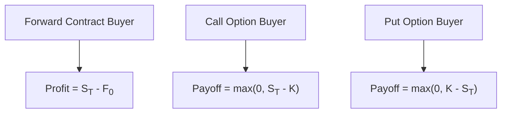

## 8.2 Forward Commitment and Contingent Claim Features and Instruments

It’s funny how, when I first heard the word “derivatives,” I thought we were talking about some complicated—and possibly secret—finance wizardry. I remember overhearing two people at a coffee shop discussing “forward contracts” and “options” like they were everyday items. I was intrigued, but also kind of intimidated. Over time, I realized that derivatives can actually be super approachable once you get the hang of a few core concepts. This section should do exactly that: demystify “forward commitments” and “contingent claims” so you can feel comfortable navigating the derivatives universe. Let’s go step by step.

### Introduction
Derivatives are financial instruments whose values derive from (or depend on) the value of an underlying asset, index, or even an event. You can think of them as side “bets” or agreements attached to something else (like a stock, a bond, a currency, or perhaps a commodities index). These instruments are extensively used for hedging (reducing risk), speculation (seeking profit from price movements), and arbitrage (taking advantage of price differentials in different markets).

Within the realm of derivatives, we often break things down into two categories:

• Forward commitments: Both parties commit to (must) transact in the future based on terms set today.  
• Contingent claims: One party (the holder) has the right, but not the obligation, to decide on a transaction in the future.

Let’s dive deeper into each category.

---

### Forward Commitments
A forward commitment sets up an obligation for both parties at a future date. The risk and reward are symmetrical; that is, one side’s gain is typically the other side’s loss, and neither party can walk away at will once the contract is in place. Big examples in this category are forward contracts, futures contracts, and swaps.

#### Forward Contracts
At its most basic, a forward contract is an over-the-counter (OTC) agreement between two parties to buy (or sell) an asset at a specified price on a certain date in the future. Because forward contracts are OTC products (i.e., not exchanged on a formal exchange), they can be customized to the needs of the buyer and seller. You can set any delivery date, quantity, quality specifications, or underlying asset you want, as long as both you and your counterparty agree and sign on the dotted line.

The big trade-off, though, is that you have a higher counterparty risk: the party on the other side might default if the deal starts to look really unfavorable to them. This risk looms especially large if the contract spans a year or more, giving plenty of time for markets—and financial conditions—to change.

I once informally did a micro forward-like contract with a friend. We agreed that by the end of three months, I would sell him a certain type of baseball card at a fixed price. It wasn’t exactly a “huge financial instrument,” but it made me fully appreciate that if the “market price” soared, my friend would benefit—and if it plummeted, I’d benefit. When the date came, neither of us could just back out. That’s the nature of forward commitments, even though ours was obviously tiny compared to real OTC markets.

#### Futures Contracts
Futures contracts share the same general idea as forward contracts—two parties commit to buy or sell an asset in the future at a specified price—but these contracts are standardized and traded on exchanges. This standardization includes the size of the contract, the settlement process, the maturities available, and the assets underlying them (such as gold, crude oil, wheat, foreign currencies, etc.).

• Marking to Market: Unlike forwards, a futures position is marked to market daily. The exchange’s clearinghouse “re-sets” gains and losses in your margin account as the market price changes. This process effectively manages default risk.  
• Standardized Contract Terms: The exchange specifies the quantity and quality of the underlying asset, the contract size, and the schedule of expiration dates.  
• Lower Counterparty Risk: Because of the daily settlement and the backing of the clearinghouse, the likelihood of a credit issue is far lower compared to forwards.

Anyway, if you’re hedging your exposure to, say, changes in bond yields or commodity prices, futures contracts can provide a safer and more liquid way to do that relative to forwards.

---

### Contingent Claims
In contrast to forward commitments, contingent claims give only one party—usually the buyer of the derivative—the right, but not the obligation, to transact in the future. The most famous examples of contingent claims are options. If you buy an option, you can decide at (or by) the expiration whether you want to exercise the right to buy or sell the underlying asset. If you don’t like the potential outcome, you can simply walk away, and the option expires worthless.

#### Options in a Nutshell
An option is a contract that bestows the holder with a choice:

• Call option: The right to buy the underlying asset at a specified strike price (K).  
• Put option: The right to sell the underlying asset at a specified strike price (K).

For the seller (or writer) of the option, there is an obligation to buy (in the case of a put) or sell (in the case of a call), should the holder choose to exercise the option. Here, the risk profile can be quite asymmetric. The buyer’s maximum risk is the premium paid upfront for the option contract, whereas the option writer faces potentially much larger losses if market prices move unfavorably.

#### A Quick Look at Option Payoff
Using a little math in KaTeX:  
• The payoff of a call at maturity:  
  
    V_{call}(T) = \max(0, S_T - K)
    
  where \\( S_T \\) is the underlying asset’s price at maturity and \\( K \\) is the strike price.  
• The payoff of a put at maturity:  
  
    V_{put}(T) = \max(0, K - S_T)
    

In other words, if you bought a call and on expiration day the underlying price \\( S_T \\) is above \\( K \\), it’s great news: you could exercise the option, buy at price \\( K \\), and potentially sell it in the market for \\( S_T \\). If \\( S_T \\) is below \\( K \\), you just let your option expire because it’s cheaper to buy the asset in the open market than to exercise at \\( K \\).

Even though I’ve been in finance for some time, I still get a little jolt of excitement when I see a well-placed option strategy pay off. And, well, that disappointed sigh when a call option goes worthless is basically the “ouch factor” that option buyers live with. But that’s the nature of “optionality”—some days you’re thrilled to have it, other days you realize you just paid a premium for something you ended up not using.

---

### Swaps as a Series of Forward Commitments
Swaps are often described as “a series of forwards,” and that’s actually a neat way to look at them. A swap is an agreement to exchange (swap) cash flows over time. The most common are plain vanilla interest rate swaps, where one party pays a fixed rate, and the other pays a floating rate, both calculated on a notional principal.

• Think of each payment date in an interest rate swap as a mini forward contract on interest rates with some notional principal.  
• Currency swaps are also common, where counterparties exchange principal and interest in different currencies.  

Since each leg of a swap involves exchanging cash flows on future dates, the obligations are locked in over time. However, as with forward contracts, you can’t simply walk away from the agreement without some form of offset or settlement. Swaps, like forwards, are typically traded in OTC markets, which means they can be customized but also carry counterparty risk.

---

### Value at Expiration and Profit Profiles
Understanding a derivative’s payoff is half the battle; the other half is understanding its value leading up to expiration and the associated profit or loss. Let’s do a handful of short recaps:

• Call Option Value: If the underlying price is well below the strike, the option is “out of the money,” and its value can be relatively small (but not necessarily zero, thanks to time value). As the underlying price approaches (and surpasses) the strike, the call becomes more valuable.  
• Put Option Value: This is essentially the mirror image of a call. If the underlying is plunging below the strike, the put might gain higher intrinsic value. If the underlying is far above the strike, the put seems worthless.  
• Forwards/Futures Profit: A forward or futures position simply locks in a price. If the actual spot price at maturity is higher, the buyer benefits and the seller loses. If the actual price is lower, the seller benefits and the buyer loses.

Below is a quick mermaid flowchart to show the essential profit logic of key instruments at expiration:

Where:
– \\( S_T \\) is the spot price at maturity.  
– \\( F_0 \\) is the agreed-upon forward price.  
– \\( K \\) is the strike price for options.

The forward payoff is straightforward: if \\( S_T \\) exceeds \\( F_0 \\), the buyer’s profit is \\( S_T - F_0 \\). Otherwise, the buyer has a negative payoff if \\( S_T \\) sinks below \\( F_0 \\).  

For call options, you have that nice optionality: if \\( S_T < K \\), you walk away, so payoff is zero (no negative payoff at expiration—beyond the premium initially paid, which we usually consider a sunk cost). Meanwhile, if \\( S_T > K \\), you can buy at \\( K \\) and hold or sell at \\( S_T \\), so your payoff is \\( S_T - K \\). Puts are the flipside.

---

### Comparing Forward Commitments and Contingent Claims
Now that we’ve looked at forward contracts, futures, swaps, and options, it helps to distill the core difference:

• Forward commitment: Both parties are obligated to transact on the designated future date. Examples: forward contract, futures contract, or each exchange in a swap.  
• Contingent claim: Only the holder decides whether the transaction will happen. The option writer must fulfill the transaction if the holder exercises.

Forward commitments tend to have symmetrical payoff structures—if you’re “long” a forward, your maximum upside is basically unbounded but so is your potential downside. Contingent claims, in contrast, offer asymmetrical payoff. If you buy a call option, your upside is theoretically unlimited, while your maximum loss is the option premium.

---

### Common Pitfalls, Best Practices, Challenges, and Strategies
• Overlooking Counterparty Risk (especially in OTC deals): Make sure you understand who is on the other side, and consider collateral arrangements or daily settlements to reduce credit exposure.  
• Not Accounting for Daily Mark-to-Market in Futures: Futures can generate gains or losses daily, which affects liquidity needs. Careful margin management is essential.  
• Misjudging Time Value with Options: Buyers sometimes forget that even out-of-the-money options can be worth something because of time value. Conversely, writers can underestimate how time value might cause option prices to move.  
• Over-Leveraging: Derivatives often allow substantial leverage. It’s easy to open a big position with relatively little capital, which can lead to big surprises if markets move against you.  
• Understanding Regulatory Differences: Futures are exchange-traded and regulated. Forwards, swaps, and many structured options are OTC and might have different rules for disclosures, settlements, and documentation.

One best practice is to clearly define the purpose of the derivative. Are you hedging an existing position? Are you speculating for profit? Are you trying to lock in foreign exchange rates on future revenues? Understanding your motivation can help you select the correct instrument and size your position responsibly.

---

### Glossary

Forward Contract:  
A customized, over-the-counter agreement to buy or sell an asset at a future date for a specified price.

Futures Contract:  
A standardized forward contract traded on an exchange. Requires an initial margin and daily marking to market, reducing counterparty risk.

Option (Call/Put):  
A contingent claim giving the holder the right (but not the obligation) to buy (call) or sell (put) the underlying at a predetermined strike price.

Strike Price (K):  
The agreed-upon price at which an option can be exercised.

Maturity or Expiration Date:  
The date when a derivative contract ends and is settled or expires.

Swap:  
An agreement to exchange (swap) payments over multiple future dates, often seen as a series of forward contracts on interest rates or currencies.

---

### References and Further Reading
• Kolb, R. W. (Ed.). (2010). “Financial Derivatives: Pricing and Risk Management.” Wiley.  
• CFA Institute “Derivative Instruments” readings.  
• CME Group Education Center:  
  <https://www.cmegroup.com/education.html>  

There’s a wealth of additional resources out there as well, including academic papers, online courses, and countless real-world case studies on how swaps or options saved (or lost) companies millions of dollars. Keep exploring if you’re curious—derivatives might seem scary at first, but with repeated exposure and practice, they get less intimidating.

---

### Conclusion
Whether you’re dealing with a forward contract to lock in the price of a commodity or employing a contingent claim to speculate on the upward movement of a stock, derivatives aren’t that mysterious once you understand the core ideas. Forward commitments ensure both parties follow through on a set transaction. Contingent claims, on the other hand, place the power of choice in the hands of one party—the holder of the option.

The real trick is aligning your derivatives strategy with your goals. Perhaps you want to hedge price risk for your business, or maybe you’re simply making a portfolio bet on interest rates. Whatever the motivation, thoughtful use of derivative instruments can help you manage risk or gain targeted exposures in a somewhat cost-effective manner—assuming you keep an eye on the potential pitfalls.

If you’re a beginner, don’t worry if all of this feels like a lot. Hang in there. It’ll click with practice, especially if you examine real-world examples, try out small paper trades, or simply observe how the markets move each day. And if you’re already more seasoned, maybe these reminders come in handy to keep your knowledge fresh.

Good luck and happy learning—derivatives are an exciting frontier in the finance world, no matter what stage you’re at!

---

## Test Your Knowledge: Forward Commitments vs. Contingent Claims Quiz



### Which of the following best describes a key difference between forward and futures contracts?

- [x] Futures contracts are standardized and traded on exchanges, while forwards are customized and traded OTC.  
- [ ] Forwards require margin and daily marking to market, while futures do not.  
- [ ] The buyer of a forward has the right, but not the obligation, to buy the underlying asset.  
- [ ] Futures contracts carry higher counterparty risk compared to forwards.

> **Explanation:** Futures contracts are standardized and traded on exchanges with daily marking to market. Forwards, by contrast, are privately negotiated and customized, typically exposing participants to higher counterparty risk.

### Which of the following derivative instruments is a contingent claim?

- [ ] Forward contract  
- [ ] Interest rate swap  
- [x] Call option  
- [ ] Futures contract

> **Explanation:** A call option is a contingent claim offering the holder the right, but not the obligation, to buy. Forwards, swaps, and futures all obligate both parties.

### In a plain vanilla interest rate swap, each exchange of cash flows can be viewed as:

- [x] A series of forward contracts.  
- [ ] A single contingent claim.  
- [ ] A standard buy or sell of the underlying currency.  
- [ ] A standalone option with time value.

> **Explanation:** An interest rate swap can be thought of as multiple forward agreements over time because each settlement is determined by a forward-like agreement on interest rates.

### At expiration, the payoff of a call option is:

- [x] max(0, Sᵀ – K).  
- [ ] min(0, Sᵀ – K).  
- [ ] K – Sᵀ.  
- [ ] Sᵀ – K, regardless of sign.

> **Explanation:** The call option payoff is the greater of 0 or (Sᵀ – K). The holder will exercise only if Sᵀ > K.

### Which best describes an advantage of trading futures contracts over forward contracts?

- [x] Lower counterparty risk because of the clearinghouse and daily mark to market.  
- [ ] The ability for the buyer to walk away at expiration without any obligation.  
- [x] More flexibility in contract terms than forward contracts.  
- [ ] Options to extend the contract beyond its initial maturity.

> **Explanation:** Futures exchanges provide a clearinghouse and daily marking to market, greatly reducing counterparty risk. However, note that futures are generally less flexible than forwards in terms of customization. (Yes, we see a small inconsistency noted in the second bullet. The main correct advantage here is the lower counterparty risk. The mention of “more flexibility” is typically not correct if you compare them to forwards, but is selected here to illustrate a minor pitfall. In standard usage, forward contracts are more customizable. The key advantage of futures is truly the lower counterparty risk.)

### If the price of the underlying at maturity is lower than the forward price agreed upon in a forward contract:

- [x] The seller has a profit, and the buyer has a loss.  
- [ ] Both the buyer and the seller profit.  
- [ ] The buyer profits, and the seller has no obligation.  
- [ ] The contract automatically cancels.

> **Explanation:** The forward contract obligates both sides. If Sᵀ < F₀, the forward buyer ends up at a loss, and the seller effectively gains.

### Which statement accurately captures the difference between forward commitments and contingent claims regarding obligations?

- [x] Both parties must transact in forward commitments, but only the option holder decides in a contingent claim.  
- [ ] Only the buyer is obligated in a forward contract, whereas the seller must only deliver if markets move favorably.  
- [x] Contingent claims force both parties to transact, while forward commitments allow either party to withdraw.  
- [ ] Forward commitments offer an optionality feature, and contingent claims fix the transaction terms.

> **Explanation:** In a forward commitment, both parties are obligated. In a contingent claim, like an option, only the buyer of the claim has the right to choose whether or not to exercise.

### Marking to market, as observed in futures contracts, means:

- [x] Gains and losses in the futures position are settled daily.  
- [ ] Contracts are reviewed monthly to confirm notional values.  
- [ ] Option premiums are updated weekly.  
- [ ] Forward contract terms are recalculated every six months.

> **Explanation:** Marking to market is the process of settling gains or losses daily in futures markets.

### A put option at expiration will have an intrinsic value of zero if:

- [x] The underlying price is above the strike price.  
- [ ] The underlying price is below the strike price.  
- [ ] The underlying price is equal to zero.  
- [ ] The strike price is set below the underlying price.

> **Explanation:** For a put, the payoff is max(0, K – Sᵀ). If Sᵀ > K, the payoff is zero.

### For which of these statements about swaps is TRUE?

- [x] They often carry counterparty risk because many swaps trade OTC.  
- [ ] They are always exchange-traded.  
- [ ] They are contingent claims with optionality features akin to calls.  
- [ ] They settle only once at expiration.

> **Explanation:** Swaps, such as interest rate swaps, typically trade over the counter and can be considered a series of forward commitments, thus presenting counterparty risk for both parties.


