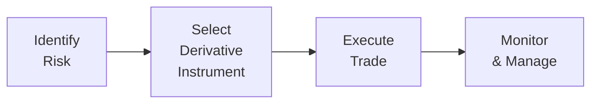

## 8.3 Derivative Benefits, Risks, and Issuer and Investor Uses

It’s funny how sometimes we’re so caught up in the day-to-day talk of “futures,” “swaps,” and “options” that we forget just how central these instruments can be to both tiny businesses and massive financial institutions. I used to think derivatives were some ultra-sophisticated financial wizardry that only the truly brave or truly foolish would touch. But as soon as I started working on, well, anything that involved managing risk, I realized derivatives aren’t some mysterious beast. They’re basically tools: you can do some incredible work with them, but if you’re not careful, you might end up hammering your own thumb.

This section offers a thorough look at why derivatives are so darn useful to different market participants—whether you’re an executive in charge of financing decisions or a fund manager aiming to secure that perfect hedge or bold speculation. We’ll cover the most common benefits and typical risks. We’ll also talk about the folks who issue derivatives (think corporate treasurers or financial institutions) and the ones who invest in or trade them (like hedge funds, pension funds, or individuals who love the thrill of a well-timed option trade). By the end, you’ll see that while derivatives can appear complicated, they ultimately revolve around the same central idea: transferring or transforming risk in a structured, contractual way.

### The Big Benefits of Derivatives

The first question is often: “Why do people even bother with these instruments?” Trust me, I used to ask the same thing until a friend of mine who imported chocolates from Switzerland told me about her woes with currency fluctuations. She found a simple forward contract to lock in the Swiss franc exchange rate. Problem solved. Let’s explore these benefits in more detail.

#### Hedging

At its core, hedging is about protection. If you run a business, market uncertainties can be downright terrifying. Whether you’re worried about the price of oil skyrocketing and wiping out your profit margin or the interest rates on your loans creeping upward, derivatives can step in to reduce or sometimes even eliminate that market risk.

• Example: Suppose you’re a large chain of coffee shops worried about coffee bean price fluctuations. You use futures contracts on coffee beans to lock in prices for the next six months. Even if global supply changes send coffee prices soaring, you’ve effectively capped your cost for the duration of your contract. Sure, if prices go down, you won’t get the windfall of cheaper inventory—but that’s the price of protection.

• Why it matters: With hedging, you can focus on what you’re best at (like marketing and selling that tasty latte) rather than fretting over whether the commodity markets are tilting against you day by day.

#### Speculation

Some market participants actually want the price movements that others are wary of. Speculators love turning a profit from correct predictions about where markets are headed. They don’t need an existing exposure to an underlying asset; they simply believe they have an edge or insight into which way the market’s going.

• Example: An oil trader might buy (go long) futures on Brent Crude if they think oil prices are about to spike, maybe because there’s a brewing geopolitical crisis or supply disruption. If the trader’s correct and prices rise, the value of those futures increases significantly. Because derivatives often involve leveraging, a small change in the underlying asset can produce big gains. Of course, the opposite scenario can produce equally large losses if the market turns a different direction.

• Why it matters: Speculators inject liquidity into the markets, enabling hedgers to enter and exit positions more easily. That said, speculation can be highly risky due to the leverage inherent in many derivative instruments.

#### Arbitrage

Now, arbitrage is the practice of profiting from price discrepancies in different but related markets. It’s basically the financial version of noticing you can buy a chocolate bar for $1 at the corner store and sell it for $1.25 at the shop across the street at the exact same moment.

• Example: If a particular stock trades on two different exchanges at slightly different prices, an arbitrageur could buy on the cheaper exchange, sell on the more expensive one, and pocket the difference—provided transaction costs don’t gobble up the profit.

• In derivatives, you might see a mismatch between a forward contract price on a currency and the spot price plus interest rates on that currency. If this mismatch violates certain theoretical bounds, arbitrageurs will quickly swoop in, snapping up risk-free gains.

• Why it matters: Arbitrage keeps markets efficient by aligning prices across related instruments. Without arbitrageurs, abnormal price spreads could persist, resulting in less accurate pricing across the board.

#### Price Discovery and Liquidity

Ever wonder why many commodity markets look to the futures exchanges for price signals? It’s because derivative markets sometimes lead the way in forming expectations about future prices of underlying assets. When you see the price of a June oil contract, that’s effectively the market telling you, “Here’s what we collectively think a barrel of oil might cost come June.”

• Example: In currencies, the forward rate (like a 90-day forward USD/EUR rate) can be a pretty decent indicator of market consensus about likely exchange rates, adjusted for interest rate differentials.

• Why it matters: By providing a forward look, derivative markets help shape broader market sentiment, which is invaluable for businesses, policymakers, and, yes, even speculators.

### The Risks of Derivatives

If derivatives are so shiny, what’s the catch? The short answer: plenty. These instruments can blow up in your face if misused. And “misuse” might simply mean failing to understand how they thrive on leverage or how a huge price swing in the underlying asset can lead to catastrophic losses.

#### Leverage Risk

Leverage is a two-edged sword. You can make big gains with a small initial capital outlay, but the losses can be equally magnified.

• Example: If you’re a speculator who invests $10,000 in an option contract giving you control over $100,000 worth of stock, even a small 5% move in the underlying stock can produce a 50% movement on your investment’s value. That can be thrilling or terrifying.

• Why it matters: If you don’t have the liquidity to meet margin calls, you can be forced to close out positions at unfavorable times, turning a paper loss into a real one. This can disrupt not just individual traders but, in extreme cases, entire institutions.

#### Counterparty Risk

Not all derivative transactions are structured the same way. Exchange-traded contracts typically benefit from clearinghouses that significantly reduce (though do not eliminate) the risk of counterparty default. In over-the-counter (OTC) derivatives—custom contracts between financial institutions—counterparty risk can be substantial.

• Example: During the Global Financial Crisis (2008-2009), the default of major players in credit default swaps (CDS) turned out to be a major systemic risk. People who thought they’d fully hedged their exposure discovered that the counterparties couldn’t pay up.

• Why it matters: Understanding the creditworthiness of your counterparty is critical in OTC markets. Even an excellent hedge loses its value if the other side can’t fulfill their obligations.

#### Liquidity Risk

Some derivatives are quite standard and trade on well-known exchanges, making them relatively easy to enter or exit. But an illiquid contract can be extremely difficult to sell at a fair price on short notice.

• Example: A company that enters into a very specialized interest rate swap with unique terms might have trouble finding another party to take over or “offset” the contract if it wants to exit early. This can happen if the terms are too custom or the market for that particular structure is limited.

• Why it matters: If liquidity dries up, you might be stuck with a position unless you’re willing to accept a big discount on it. Illiquidity can amplify your risk because you can’t adjust or close out losing positions as smoothly as you’d like.

#### Complexity of Pricing

Many derivatives require fairly intricate pricing models. That’s not to say you need a PhD in mathematics to trade them, but you certainly need to understand how these models work—or have someone you trust to handle them for you.

• Example: Options pricing typically uses models such as Black–Scholes or binomial trees. Incorrect assumptions about volatility or interest rates can lead to poor pricing and potentially big losses.

• Why it matters: Model risk (the risk that your model is wrong) and parameter risk (the risk of incorrect inputs) loom large when dealing with derivative instruments. Even small mistakes in the model’s volatility forecast can lead to big mispricing.

#### Operational Risk

Let’s not forget the unglamorous side: the operational details—confirming trades, ensuring compliance, or even having the right software in place. If someone punches in the wrong details on your derivatives trade, you could find yourself on the hook for a contract you never intended.

• Example: A large bank might discover a mismatch in the notional amount on one side of a swap, leading to a huge unhedged risk. This happened in multiple high-profile “fat-finger” trades that caused major financial pain.

• Why it matters: Operational risk is all about having the correct processes and systems in place. Even a single error in a spreadsheet or manual input can transform a hedge into a fiasco.

### Issuer and Investor Uses

Derivatives serve many masters, from corporate treasurers who want stable funding costs to asset managers who see a market opportunity they’d like to exploit. Let’s look at some roles and typical uses:

#### Issuers

When we talk about issuers, we’re often referring to corporate treasury teams responsible for raising capital, managing currency exposures, and locking in raw material prices.

• Use Case – Managing Interest Rates: A corporation might issue floating-rate debt but worry about rising interest rates. By entering into an interest rate swap to pay fixed and receive floating, they effectively convert their floating-rate liability into a fixed-rate one, securing their interest expense.

• Use Case – Currency Hedging: A multinational corporation expecting to receive foreign currency in a few months can lock in a favorable exchange rate with a forward contract, removing the risk of adverse currency movements.

• Use Case – Commodity Risk Management: Manufacturers reliant on metals or agricultural commodities can hedge input prices to protect their profit margins from suddenly spiking commodity costs.

#### Investors

Investors can mean a lot of different entities: hedge funds, pension funds, insurance companies, or simply individuals looking to juice their returns.

• Risk Management for Portfolios: Large institutional investors frequently use equity index futures to manage their market exposures. If they anticipate a short-term drop in the market, they may short index futures to protect the downside.

• Tactical Bets: Hedge funds might go long on Bitcoin futures if they believe digital assets are due for a spike or short credit default swaps on certain corporate bonds if they sense a higher default risk.

• Enhancing Returns: A portfolio manager might sell covered calls on a stock that they own, generating extra income. If the stock price rises above the strike price, the manager may have to deliver shares, but in exchange, they’ve received premium income upfront.

### Bringing It All Together in a Visual

Sometimes, it helps to see how somebody—be it a corporate treasurer or an investor—flows through the decision-making process of using derivatives. The diagram below is a simplified approach:

• Identify Risk: Determine if there’s an interest rate risk, currency risk, commodity risk, or equity market risk that needs addressing (or an opportunity you want to exploit).  
• Select Derivative Instrument: Pick the future, forward, option, or swap that best addresses your objective.  
• Execute Trade: Place the order on an exchange or negotiate terms in the OTC market.  
• Monitor & Manage: Keep an eye on your positions, make margin payments if required, and adjust trades as market conditions change.

### A Quick Note on Leverage Formulas

In many derivative pricing contexts, you’ll see formulas like the one for a simple forward price on a non-dividend-paying asset:


F_0 = S_0 \times (1 + r)^T


Where:  
• \\(F_0\\) is the forward price at inception.  
• \\(S_0\\) is the current spot price.  
• \\(r\\) is the risk-free interest rate (assumed constant).  
• \\(T\\) is the time to maturity in years.

Even though this looks simple, the real world is rarely so neat and tidy—interest rates can change, and carrying costs or benefits might come into play. Still, it’s handy to remember these fundamental relationships so you don’t get lost in the dizzying array of more advanced formulas.

### Glossary

• **Hedging:** Using derivative instruments to reduce or eliminate specific financial risks.  
• **Speculation:** Using derivatives to profit from directional moves in underlying assets.  
• **Arbitrage:** Exploiting price differentials between related instruments to capture risk-free or low-risk profit.  
• **Leverage:** Structuring a transaction so that gains or losses are amplified relative to the initial capital outlay.  

### Best Practices, Pitfalls, and Common Challenges

• **Best Practice:** Always start with a clear goal. Hedging requires understanding your exposures. Speculation requires a clear risk/reward framework.  
• **Common Pitfall:** Overusing leverage. The dreaded margin call can break your capacity to hold positions, forcing you to close at a loss.  
• **Pitfall:** Misestimating counterparty credit risk.  
• **Challenge:** Complexity of pricing and the possibility of model and operational errors.  
• **Strategy to Overcome:** Double-check your assumptions, ensure robust operational controls, and maintain appropriate capital reserves for margin requirements.

### Personal Takeaways

I once spoke to a CFO who thought her firm was “perfectly hedged” on interest receipts from a foreign client. Then the foreign client delayed payment, and the CFO discovered the forward contract had monthly settlement issues that she hadn’t accounted for. The company scrambled to roll that hedge into the next month’s forward contract, incurring extra costs. This story is a reminder that no matter how well you plan, approximations can happen, markets can shift, and operational details can cause real headaches.

But all that said, I’m a huge fan of derivatives—used responsibly, they’re like an insurance policy for your financial exposures. They can also be your chance to spice up a market view if you’re a risk-tolerant investor. The main point is knowledge. The more you dig into how derivatives truly function and how they can backfire, the more confident (and intelligent) you’ll be in your approach.

### References and Further Reading

• CFA Institute “Risk Management Applications of Derivatives” readings.  
• Hull, J. C. (2021). “Options, Futures, and Other Derivatives.” Chapters on Hedging Strategies.  
• Academic articles on derivatives risk management in JSTOR or SSRN (https://www.ssrn.com).  

For more context on pricing dynamics, you might want to revisit the discussions from earlier sections in this book. Specifically, see the introduction to derivatives pricing in Section 8.1 Derivative Instrument and Derivative Market Features, and the fundamentals of forward and futures pricing in 8.5 Pricing and Valuation of Forward Contracts and Underlying with Varying Maturities. If you’re considering advanced valuation techniques, the content in 8.9 Option Replication Using Put–Call Parity and 8.10 Valuing a Derivative Using a One-Period Binomial Model can be a great help.

-----

## Test Your Knowledge: Derivative Benefits, Risks, & Uses Quiz



### Which of the following is a primary advantage of using derivatives for Hedging?

- [ ] They eliminate all counterparty risk.  
- [x] They help offset or reduce specific financial risks.  
- [ ] They guarantee superior returns over the underlying asset.  
- [ ] They avoid all margin requirements.  

> **Explanation:** Hedging with derivatives is about mitigating or offsetting targeted risks, not eliminating them entirely. Also, derivatives never guarantee superior returns; they help manage volatility and risk.

### What is one key feature that differentiates an OTC derivative from an exchange-traded derivative?

- [ ] OTC derivatives have no counterparty risk.  
- [ ] Exchange-traded derivatives are never standardized in terms of contract size.  
- [x] OTC derivatives are privately negotiated, leading to potentially higher counterparty risk.  
- [ ] Exchange-traded derivatives are always more expensive.  

> **Explanation:** OTC (over-the-counter) derivatives are negotiated privately between parties, which can increase counterparty risk. Exchange-traded derivatives, on the other hand, are standardized and cleared through a central clearinghouse.

### In a highly leveraged derivatives position, a 5% negative move in the underlying often leads to a much larger loss. What is this phenomenon called?

- [ ] Counterparty risk  
- [ ] Liquidity risk  
- [x] Leverage risk  
- [ ] Operational risk  

> **Explanation:** Leverage amplifies both gains and losses relative to the notional exposure. A small change in the underlying price can produce far greater percentage changes in the trader’s capital.

### Which of the following best describes arbitrage in the derivatives market?

- [ ] Using derivatives to lock in a stable price for future transactions  
- [x] Exploiting price differentials in related markets to earn a risk-free profit  
- [ ] Taking directional bets on future price movements  
- [ ] Creating a perfect hedge to remove market risk  

> **Explanation:** Arbitrage is all about capitalizing on price inconsistencies between related instruments, aiming to profit with minimal or zero risk.

### What is a potential downside of speculation using leveraged derivatives?

- [ ] Guaranteed profit if the market moves in the desired direction  
- [x] Significant losses if the underlying asset moves against the position  
- [ ] Elimination of credit risk  
- [ ] Reduced transaction costs relative to cash trades  

> **Explanation:** The main drawback is the potential for outsized losses because leverage magnifies negative price moves.

### When an investor sells a covered call on a stock he already owns, the call premium earned serves what purpose?

- [ ] To eliminate all risk of holding the stock  
- [ ] To provide infinite upside potential if the stock rallies  
- [x] To generate additional income, with the trade-off of capping upside on the stock  
- [ ] To force the investor to buy more shares if the price falls  

> **Explanation:** Selling a covered call yields immediate premium income but caps upside gains at the strike price of the call.

### In a corporate treasury department, which derivative might be most commonly used to convert floating-rate debt to fixed-rate debt?

- [ ] Stock options  
- [ ] Commodity futures  
- [x] Interest rate swap  
- [ ] Currency forward  

> **Explanation:** An interest rate swap (pay fixed, receive floating) is the usual derivative to transform floating-rate debt exposure into a fixed-rate obligation.

### Which of the following risks is most closely associated with operational errors, such as mistyping contract details?

- [ ] Market risk  
- [ ] Liquidity risk  
- [ ] Leverage risk  
- [x] Operational risk  

> **Explanation:** Operational errors like incorrect data entry, misplaced trades, or settlement mishaps fall under operational risk rather than market-related risks.

### A company worried about rising steel prices for its production process might choose which derivative to hedge that risk?

- [x] Commodity futures  
- [ ] Equity options  
- [ ] Credit default swaps  
- [ ] Interest rate forwards  

> **Explanation:** For rising steel price risk, commodity futures on steel (if available) or metals indexes help lock in the purchase price, functioning as a hedge.

### True or False: One of the reasons derivative markets aid price discovery is that they reflect future expectations of asset prices.

- [x] True  
- [ ] False  

> **Explanation:** Derivative instruments, such as futures, indeed reflect the market’s collective view of an asset’s future value, aiding in price discovery.


