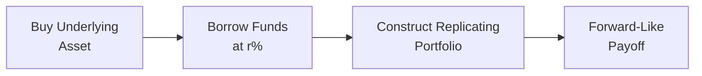
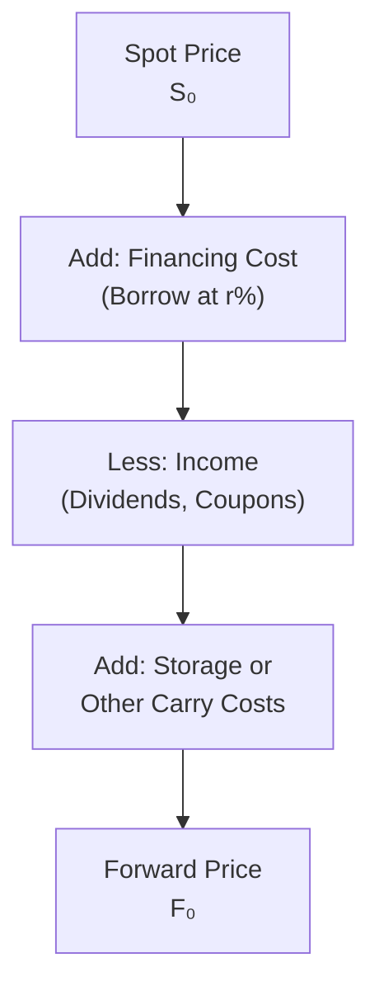

## 8.4 Arbitrage, Replication, and the Cost of Carry in Pricing Derivatives

Have you ever stumbled upon something in the market—maybe it’s a stock or a bond or even a digital asset—and wondered if there’s a way to quickly profit from a price imbalance? Well, welcome to the world of arbitrage, replication, and the cost of carry in derivative pricing. We’re about to dig into these core concepts that anchor much of the theoretical framework behind how derivatives get their prices. And yeah, I know some of this stuff can sound imposing at first, but let’s tackle it step by step, weaving in personal anecdotes and real-life analogies. Think of it like explaining the logic behind fidget spinner prices (back when they were a craze) or how you might replicate your favorite sandwich at home for cheaper than your local sub shop. 

Arbitrage, replication, and the cost of carry can unlock many “aha!” moments as you progress through your finance journey—especially if you’re unraveling how a forward or futures contract is priced. Let’s dive in.

## Introduction

Sometimes all of finance can feel like a big puzzle where each piece must fit perfectly. If you see a missing piece or a piece that’s misplaced (“Hey, that puzzle piece is cheaper than it should be!”), you’ve found an opportunity. Arbitrage is the pursuit of that perfect fit, ensuring that two identical items (or items that deliver identical payoffs) don’t trade at different prices. The guiding principle is straightforward: if they do trade at different prices, someone jumps in, buys the cheaper item, sells the more expensive one, and locks in a profit with no net risk. That’s arbitrage, plain and simple.

But how do we model fair values for complex derivatives like forwards, futures, or options? A big chunk stems from the idea of replicating these derivatives’ payoffs by constructing a portfolio of simpler instruments—like stocks, bonds, or even cash—and seeing what that portfolio costs today. The cost of that replicating portfolio should match the derivative’s price. If not, guess what? Arbitrage is lurking.

Finally, we can’t measure any derivative cost (or replicate it) without thinking about the carrying costs and benefits of the underlying asset. Maybe it’s a stock paying dividends, or maybe it’s a warehouse full of coffee beans that are expensive to store. Either way, these costs and benefits factor into fair pricing. Mix these concepts of arbitrage, replication, and the cost of carry together, and you’ve got the fundamental anchor for how derivatives get priced in efficient markets—those are markets where opportunities for free money (arbitrage) vanish as soon as they appear.

## Arbitrage and the Law of One Price

Arbitrage is grounded in a simple principle known as the Law of One Price. In short, the law says: “Identical items, trading in different places or disguised in different ways, should have the same price if markets are efficient and there are no major frictions.” If there’s any discrepancy, you might raise an eyebrow and say, “Um, that’s interesting. I can buy it cheaper here and sell it higher there. Let me do that quickly before prices adjust.”

### A Quick Real-World Anecdote

Years ago, a friend of mine was traveling abroad and noticed that a particular pair of sneakers was selling for almost half the price they sold for back home. He bought as many pairs as he could fit in his luggage (and maybe some trapped air in the overhead bin too), then sold them to friends back home at a nice profit. That’s arbitrage in everyday life. Of course, shipping costs, local taxes, currency exchange fees, and other friction might reduce (or even eliminate) that profit, but the principle stands.

In the derivatives world, we’re not lugging shoes through an airport, but the principle is the same. If we see a derivative that’s “mispriced,” we set up trades that lock in a guaranteed profit once we account for the initial costs, interest rates, dividends, or any other relevant factors.

### The Law of One Price in Action

Imagine you have two financial instruments that promise to pay identical amounts of money at the same future dates with the same risk. If one is cheaper than the other—and you can easily buy the cheaper one and sell the more expensive one—you can lock in a riskless profit. That’s effectively free money. Over time (very quickly in modern markets), these opportunities get obliterated by savvy market participants who jump on them. This collective effect keeps prices aligned and upholds the law of one price.

## Replication Approaches in Derivative Pricing

Replication is about building a portfolio—potentially made up of stocks, bonds, or other derivatives—that mimics the payoff of the target derivative. And if your replicating portfolio truly can’t be distinguished from the actual derivative at maturity, they must have the same cost today. Otherwise, there’s an arbitrage possibility lurking.

### Simplifying the Idea of Replication

Think about a plain-vanilla forward contract on a stock with no dividends. A forward gives you the right (and obligation, typically) to purchase the stock at a predetermined price (the forward price) in the future. To replicate that payoff, you might do the following:

1. Borrow some money today at an interest rate r.  
2. Buy the stock with that borrowed money.  
3. Wait until maturity.  

At maturity, you own the stock after paying back the borrowed amount plus interest. This is effectively the same outcome as having a forward contract. So if the forward contract is priced differently from the cost of that stock-plus-interest approach, there’s a potential arbitrage.

## The Cost of Carry: Breaking It Down

Cost of carry includes all the cash flows, costs, and benefits involved in holding (or “carrying”) an asset until a future date. For a forward or futures contract, the difference between its price and the spot price of the underlying is largely explained by the net cost of carry.

### Key Components

• Storage Costs  
• Financing Costs (interest rates or opportunity costs)  
• Yield or Income from the Asset (e.g., dividends on stocks, coupons on bonds, or convenience yield on commodities)  

The net cost of carry = Financing Costs + Storage Costs – Income Received.

If an investor must pay for storage and also must pay interest on any borrowed funds, that drives the cost of carry up. On the flip side, if the underlying asset pays a big dividend, that dividend reduces the net cost of carry (or can even make it negative if the dividend is large enough).

### An Informal Example

I once tried replicating a “cost of carry” scenario in my personal life, albeit unknowingly. I bought a big batch of a certain coffee brand from a warehouse club because it was on sale. Turns out I needed a storage place for all those coffee sacks. And I had to lay out cash upfront. If I accounted for the interest cost on my credit card, plus the annoyance of storing the coffee (and maybe the coffee going stale?), I realized my real bargain might not be as good as it initially looked. That, ironically, is cost of carry in everyday life.

### Incorporating the Cost of Carry Into Forward Pricing

If we assume a continuous compounding model (which is common in theoretical finance, though in practice we often use discrete compounding), the forward price \\( F_0 \\) for an underlying with a spot price \\( S_0 \\), risk-free rate \\( r \\), continuous dividend yield \\( q \\), and time to maturity \\( T \\) is often expressed as:


F_0 = S_0 e^{(r - q)T}.


In simpler terms (with discrete compounding), you can think of it like:


F_0 = S_0 \times (1 + r)^T - \text{Present Value of Dividends or Income}.


Either way, the concept is the same: Adjust for what it costs (or what you earn) to hold the underlying asset over time.

## Combining Cost of Carry and Replication in Forward Pricing

To see how cost of carry and replication team up in forward pricing, let’s walk through a commonly referenced scenario. Suppose you have a non-dividend-paying stock. The replicating strategy to create a forward contract at expiration is:

• Borrow the present value of the stock’s cost at the risk-free rate r for T years.  
• Use that borrowed amount to buy the stock now.  
• Hold the stock for T years, then deliver it at the forward price in the forward contract.  

The total cost to you in T years is the amount of the loan plus interest. That must match the forward price. Thus,


F_0 = S_0 (1 + r)^T


if we assume discrete compounding. If any dividend is paid, it reduces the forward price because you can reinvest that dividend (or you can receive that income during the carrying period), effectively lowering the net carrying cost.

## Real-World Case Studies

### Case Study 1: Gold Futures and Storage Costs

Let’s talk about gold. Investing in gold might require you to pay for secure storage, insurance, and so on—these are direct carrying costs. Gold doesn’t pay dividends, so it has no income offset. If gold futures were priced in a way that didn’t reflect these storage and insurance costs, you’d have a mispricing. Traders who have the capacity to store gold cheaply (maybe they own a super-secure safe, or they negotiate a better storage deal) can buy physical gold, short gold futures, and pocket that difference if the futures price is too high or low relative to the spot price plus carrying costs.

### Case Study 2: Stock Index Futures and Dividends

Now imagine a broad equity index with an expected dividend yield of 2% over the next year. The financing rate is 5%. If there are no other cost of carry components, the net cost of carry is approximately (5% – 2%) = 3%. So you’d expect the index futures price to be around 3% higher than the spot index level over that year, ignoring any compounding specifics. If that’s off by too much, an arbitrage arises: buy stocks (collect the 2% dividend), borrow money at 5% to finance it, then short the future. If the futures price doesn’t match the cost-of-carry equation, you can lock in a profit.

## Best Practices, Pitfalls, and Strategies

• Watch Out for Market Frictions: Real markets have transaction costs, liquidity issues, and taxes. A no-arbitrage pricing argument might fail if these costs are large enough.  
• Estimate Dividends (or Other Income) Carefully: Over or underestimating them can severely skew your forward/futures pricing.  
• Storage Costs Aren’t Always Straightforward: In some commodities markets, storage costs (and “convenience yields”) fluctuate significantly depending on market conditions.  
• Keep an Eye on Funding Costs: A sudden spike in interest rates or margin requirements might undermine an otherwise bulletproof replication trade.  
• Always Consider Real-Life Constraints: Like my friend with the sneakers, you can’t always fill your suitcase as much as you want. In financial markets, position limits or regulatory requirements can hamper that perfect arbitrage strategy.

## Visualizing the Relationship with Diagrams

Below is a simple flowchart that shows how one might construct a replicating portfolio for a forward contract on a stock. This diagram is purely conceptual, but it illustrates how the pieces fit together: you borrow at risk-free rate r, buy the underlying, and then see how at maturity you effectively have the same payoff as being in a forward contract.

At maturity, the forward-like payoff means you receive or deliver the underlying asset at a previously agreed-upon price— mirroring exactly what a forward contract would do.

### Another Look: Cost of Carry

Let’s see a small schematic that focuses on the cost of carry components—storage, financing, and so forth—and how they adjust the spot price into a forward price.

When huge storage costs or negative yields appear, the final price can shift dramatically.

## Encouraging Critical Thinking

Maybe you’re sitting there wondering: Could I always replicate derivatives in the real world? In practice, it’s not always so easy. Transaction costs, short-selling constraints, credit risk, operational constraints, and so on can hamper the pure arbitrage dream. Also, in some markets, you can’t short certain assets, or there might be contractual restrictions. Nonetheless, these theoretical arguments lay the foundation for derivative pricing models. They help us see how, in an efficient environment, the prices converge to those “fair” levels, pinned down by cost of carry, replication, and the unstoppable search for arbitrage opportunities.

If you suspect a mispricing, you want to do a thorough check: Are there hidden costs? Could the asset be illiquid? Maybe the data you’re using is outdated or your model is oversimplified. Sometimes an apparent arbitrage is swiftly drowned by real-world constraints. But the fundamental logic itself is ironclad: if two payoffs are identical, they must have the same cost (absent friction); otherwise, the market leaps in to close that gap.

## References and Further Reading

• CFA Institute, “Arbitrage-Free Valuation and the Law of One Price.”  
• McDonald, R. L. (2013). “Derivatives Markets.” Pearson; see chapters on pricing by arbitrage and cost of carry.  
• Academic white paper: “Arbitrage, Market Efficiency, and the Law of One Price.”  
• See also Chapter 2 (Quantitative Methods – especially Time Value of Money in Finance) and Chapter 7 (Fixed Income – especially interest rate concepts) for deeper background on interest rates and discounting principles.  

Feel free to keep exploring these ideas in a practical setting: peek at the quotes on a futures contract, check the underlying spot price, factor in dividends, storage, and interest rates, and see how it lines up. There’s nothing like real-world observation to make these concepts stick.

---

## Test Your Knowledge: Arbitrage, Replication, and Cost of Carry in Pricing Derivatives



### Which principle underpins the idea that two identical assets must trade at the same price in an efficient market?

- [ ] The Efficient Market Hypothesis
- [x] The Law of One Price
- [ ] Martin–Gale Principle
- [ ] Gauss–Markov Theorem

> **Explanation:** The Law of One Price states that two identical (or equivalent) assets must trade at the same price, otherwise arbitrage would be possible.

### You observe a dividend-paying stock forward price that's higher than what you'd expect from the cost-of-carry model. Which action can potentially lock in an arbitrage profit?

- [x] Buy the stock and finance at the risk-free rate, short the forward
- [ ] Sell the stock, borrow at the risk-free rate, and buy the forward
- [ ] Buy the forward and short the risk-free bond
- [ ] Take no action

> **Explanation:** If the forward is overpriced, an arbitrageur would buy the stock today (financed by borrowing), simultaneously short the forward, and lock in a riskless gain.

### Replication in derivative pricing suggests that:

- [x] Constructing a portfolio with the same payoff as the derivative helps determine its fair value
- [ ] We can only replicate options, not forwards
- [ ] Futures cannot be replicated because of daily settlement
- [ ] Derivative replication disregards the cost of carry

> **Explanation:** Replication is about building a portfolio that has exactly the same payoff as the derivative. If that portfolio’s cost today is different from the derivative’s price, arbitrage exists.

### Which of the following is NOT typically considered part of the cost of carry for a commodity?

- [ ] Storage costs
- [ ] Insurance or spoilage costs
- [x] Transaction fees for corporate bonds
- [ ] Financing costs

> **Explanation:** When we talk about carrying a commodity, we usually consider costs like storage, insurance, or financing. Transaction fees specific to other asset types, like corporate bonds, are generally not included in the commodity’s cost of carry.

### In continuous compounding form, which best represents the forward price F₀ of a stock with spot price S₀, risk-free rate r, dividend yield q, for a period T?

- [ ] F₀ = S₀ e^(rT)
- [x] F₀ = S₀ e^((r - q)T)
- [ ] F₀ = S₀ / e^(rT)
- [ ] F₀ = S₀ + (r - q) × T

> **Explanation:** When dividend yield q is accounted for, the forward price for a stock under continuous compounding is S₀ e^((r - q)T).

### Which of the following best describes arbitrage?

- [x] A riskless profit achieved by exploiting price discrepancies
- [ ] A high-risk strategy aimed at maximizing returns
- [ ] A mandatory purchase of derivatives by market makers
- [ ] An unwarranted speculation on volatile assets

> **Explanation:** Arbitrage is about locking in a riskless profit when prices for identical assets or payoffs differ between markets.

### If the forward price of a commodity is lower than the spot price plus storage costs minus income yield, you would:

- [x] Sell the commodity in the spot market and buy the forward
- [ ] Buy the commodity in the spot market and buy the forward
- [x] Borrow at the risk-free rate and buy the forward
- [ ] Sell the commodity in the spot market and sell the forward

> **Explanation:** If the forward is underpriced relative to spot plus carrying costs, you can sell the commodity now (or not buy it in the first place), invest the proceeds (or borrow at r if needed), and buy the cheaper forward to lock in the gain. Two correct elements might appear in a single question if there's more than one possible path to arbitrage.

### Which of the following best explains why arbitrage opportunities vanish so quickly in modern electronic markets?

- [x] High-frequency traders and advanced algorithms rapidly act on any mispricings
- [ ] Traditional floor trades are too slow to notice price differences
- [ ] Regulatory bodies prohibit arbitrage trades
- [ ] Markets do not have enough participants

> **Explanation:** In modern markets, advanced trading algorithms can spot and execute arbitrage strategies in microseconds, removing mispricing rapidly.

### If an investor finds that a forward price exceeds the theoretical cost-of-carry price significantly, which sequence of transactions would lock in profit?

- [x] Construct a replicating portfolio by buying the underlying with borrowed funds and shorting the forward
- [ ] Buy the forward and short the underlying asset
- [ ] Borrow money at 0% interest (somehow) and short the underlying
- [ ] Pay large transaction costs to offset the difference

> **Explanation:** A classic arbitrage to exploit an overpriced forward is to buy (or own) the underlying funded by borrowing, and simultaneously short the forward. This captures the overpricing as a riskless gain at maturity.

### A true statement about replication and the cost of carry in derivative pricing:

- [x] True
- [ ] False

> **Explanation:** They form the essential pillars of derivative pricing. Replication shows how to build the same payoff, and the cost of carry reveals how holding the underlying for that payoff is funded or benefits from income sources.


