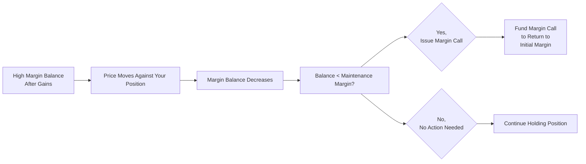

## 8.6 Pricing and Valuation of Futures Contracts

Hey there, welcome to our discussion on pricing and valuation of futures contracts. I vividly remember the first time I encountered the idea of a “futures contract.” Back then, I thought it was just some fancy piece of paper that said, “I’ll buy your corn next month for a set price.” But as I dug deeper, I realized how elaborate and crucial these contracts can be for financial markets, risk management, and speculation. In this section, we’ll explore how futures differ from forwards, how daily marking to market works, and how the value of a futures contract evolves over its life.

---
### Futures versus Forwards

If you’ve already checked out the previous section on forward contracts (reference the content in 8.5 if you need a quick refresher), you might be asking: “Aren’t futures basically the same as forwards?” Well, you’re not entirely wrong; they’re both agreements to buy or sell an asset at a future date for a price specified now. But oh boy, let’s see where they differ:

• Standardization and Exchange-Traded: Futures contracts trade on formal exchanges like the Chicago Mercantile Exchange (CME). They come with standardized contract sizes, expiration dates, and delivery procedures. Forward contracts, on the other hand, usually exist in the over-the-counter (OTC) market, meaning they’re privately negotiated between two parties.  
• Marking to Market: A futures contract is “marked to market” every single trading day. Gains or losses are credited or debited to your margin account daily. Forwards, in contrast, simply accumulate gains or losses until the settlement date.  
• Credit Risk and Collateral: Because futures settle daily, they usually have lower counterparty risk. In a forward contract, if your counterparty defaults on the settlement date, you might be out of luck (or stuck in a legal fight). With futures, exchanges act as intermediaries, requiring margins that help limit credit risk.  

You might see small pricing differences between futures and forwards due to these daily settlements and margin adjustments. The interest you earn—or the interest you owe—on your margin or the daily gains/losses can tweak the fair prices just a bit.

---
### Marking to Market (MTM)

One of the coolest features of the futures world is marking to market. On the day you enter a futures contract, you typically post an initial margin, kind of like a deposit that shows you’re serious about fulfilling your end of the bargain. Then each day, your contract’s value is recalculated based on the new settlement price. Let’s break down the process:

1. Daily Settlement: If the futures price moves in your favor, yay, you realize a gain, and that gain gets credited to your margin account. If the price moves against you, the loss is debited from your account. This is all done at the end of each trading day.  
2. Margin Account Adjustments: You start off with your initial margin. If your position moves against you and your margin balance dips below the maintenance margin, you get a margin call—as in, you have to deposit extra funds to bump your account back up to the initial margin level.  
3. No Large Unreconciled Exposures: Because of this daily settlement, large sums don’t pile up unaccounted for weeks or months. Each day, you’re effectively in a brand-new contract at the new settlement price.

Here’s a small diagram (in Mermaid syntax) showing the marking-to-market flow:

**Real-World Anecdote**  
I once had a friend who was shorting (betting on a price decline) a futures contract on a commodity. The market turned violently against him—bad weather in the growing region unexpectedly pushed prices up. Because of marking to market, he got margin calls three days in a row, eventually deciding to close out his position to stop the bleeding. If this had been a forward contract, the final P&L might have been the same, but he wouldn’t have faced incremental margin calls in the meantime.

---
### Convergence of Futures and Spot Prices

Another neat thing about futures prices is that they tend to converge toward the spot price of the underlying asset as the contract nears expiration. Let’s say you’re trading a futures contract on gold that’s going to expire in three days. By that point, there’s little reason for anyone to pay a significantly different price than what the gold spot market is offering, since that gold is about to be delivered or paid for in a few days anyway. This convergence is essential, ensuring the contract “settles” into the actual commodity or financial asset’s spot price. 

Convergence helps keep the momentum of arbitrage in check. If the futures price is way higher than the spot price near expiration, savvy traders could buy the asset on the spot market and deliver into the futures contract for an instant profit (or vice versa). That usually pushes the futures price back in line with the spot price.

---
### Pricing Relationships and the Cost of Carry

If you’ve read about forward pricing (section 8.5) or arbitrage and replication in general (section 8.4), you might recall the “cost-of-carry” model. We typically say something like:


F_0 = S_0 \times e^{(r + \text{storage costs} - \text{convenience yield}) \times T}


Where:  
• \\( F_0 \\) is the fair futures price at time 0.  
• \\( S_0 \\) is the spot price of the underlying asset at time 0.  
• \\( r \\) is the risk-free rate (continuously compounded) over the period \\( T \\).  
• “storage costs” might be relevant if you’re storing commodities.  
• “convenience yield” can apply if there are benefits to physically holding the commodity.  
• \\( T \\) is the time to maturity.

But here’s a twist: futures are marked to market daily. And these daily settlements can matter if interest rates and the underlying asset’s price exhibit high volatility. So, you might see slight differences in the actual futures price compared to the theoretical forward price because each day your margin balance changes, which in turn changes your opportunity to earn or pay interest on any gains or losses. 

This effect is “path dependent.” The total cost or benefit of daily settlement can vary depending on how the underlying price moves over time, how much your initial margin is, and what interest rate you can earn on it. In many stable markets, that difference can be negligible, but in highly volatile markets, it can become more noticeable.

---
### Value of a Futures Contract During Its Life

Now, here’s where some folks get confused. Technically, after each daily settlement, it’s said that the “value” of the futures contract itself resets to zero. That might sound bizarre—why is it zero? Let’s break it down:

1. At the End of Each Day: The exchange takes in the day’s gains and losses, transferring them between the margin accounts of the long and short positions.  
2. Reset of Contract Value: Because all gains or losses have been realized (i.e., they’re now in someone’s margin account), the contract starts the next day with no “embedded” gain or loss.  
3. Margin Account Changes: Even though the contract’s theoretical value resets to zero, your margin account could be well above your initial margin (if you’ve been profitable) or dangerously below it (if the market’s going against you).

In essence, the daily mark-to-market system creates a new contract each day at that evening’s settlement price. But obviously, overall you can be up or down based on how the price has moved since you first opened the position, as reflected by your margin balance.

---
### Putting It All Together: An Example

Let’s try a simplified example to bring these ideas to life. Suppose you go long on 10 S&P 500 E-mini futures contracts at a futures price of 4,000. The notional value is 50 times the index, so each point move is worth $50 per contract.

• Initial Margin: Let’s say your broker requires $15,000 per contract, so you put up $150,000 total.  
• Day 1 MTM: Suppose the settlement price goes to 4,010. That’s a 10-point gain in the contract price. You have 10 contracts, so that’s a 10 × $50 gain per contract = $500 gain per contract × 10 = $5,000 total. So your margin account goes from $150,000 to $155,000.  
• Day 2 MTM: Now let’s imagine the settlement price falls back to 3,999. That’s an 11-point drop from yesterday’s 4,010 settlement. You lose 11 × $50 × 10 = $5,500. Your margin account goes from $155,000 down to $149,500, which might trigger a margin call if the maintenance margin is, say, $149,750.

In reality, you can earn or pay interest on these daily changes, depending on the structure of your trading account. That’s where the slight difference from forward prices can come in.

---
### Common Pitfalls and Best Practices

• Ignoring Margin Calls: It’s easy to overlook margin requirements. But ignoring them could cause your position to be liquidated prematurely.  
• Underestimating Volatility: Futures can quickly move against you. If you’re used to less dynamic markets, watch out! Large price swings can do a number on your account balance in just a few hours.  
• Overlooking the Cost of Carry Nuances: With daily settlement, your cost of carry can differ from the theoretical forward contract pricing. If you’re relying on a formula that omits the nuances of interest on daily settlements, your analysis could be off.  
• Neglecting Liquidity Risk: Highly liquid futures like on the S&P 500 or major currencies are easy to trade. But some futures on niche commodities or less popular equity indices might have wide bid-ask spreads and low volume, which can add trading costs and hamper your ability to enter or exit.  

---
### Additional Mermaid Diagram: Margin Call Cycle

Below is another small diagram to illustrate a hypothetical margin call cycle, particularly if your updates go against you. People often want to visualize how your margin account might revolve:

---
### Glossary of Key Terms

• **Marking to Market**: The process by which futures positions are revalued to that day’s settlement price, ensuring daily gains or losses are realized in the margin accounts.  
• **Initial Margin**: The initial capital posted to open a futures position. Think of it like a “good faith” deposit.  
• **Maintenance Margin**: The minimum balance required in your margin account to keep the position open. If your daily losses shrink your account below this threshold, you’ll receive a margin call.  
• **Margin Call**: The request (sometimes more like a demand) from the broker or the exchange that you deposit additional capital to restore your margin balance. Failure to meet the margin call can lead to the broker liquidating your position.  
• **Convergence**: The phenomenon by which the futures price approaches the spot price of the underlying asset as expiration nears.  

---
### References and Further Reading

• [CME Group Education](https://www.cmegroup.com/education.html) – Great tutorials on futures mechanics, margining, and various product offerings.  
• CFA Institute materials on futures contracts – A solid resource for in-depth reading and practice questions.  
• Hull, J. C. (2021). Options, Futures, and Other Derivatives – Classic textbook with exhaustive coverage on futures and forwards.  

It’s always worth diving deeper. If you’re keen on real-life examples, especially for equity index futures or interest rate futures, the CME Group website has a treasure trove of free educational resources.

---
### Encouraging Thoughts

I know sometimes it feels like there’s a lot to absorb—daily accounting of gains and losses, margin calls, differences from forwards, cost of carry, and so on. Don’t stress too much. The mechanics do become intuitive with practice. Maybe watch some real-time quotes and see how prices update daily, or open a simulated account on a futures trading platform to get some hands-on experience (with virtual money, of course!). When you see these concepts in action, they tend to click much faster.

And, hey, the daily marking to market is not just a quirk—it’s a key mechanism that helps manage credit risk and ensure no participant accumulates massive unpaid losses. It makes the futures marketplace incredibly transparent and robust.

---

## Test Your Knowledge: Pricing and Valuation of Futures Contracts Quiz



### Which of the following is a unique feature of futures contracts compared to forward contracts?

- [ ] They specify an obligation to buy or sell the underlying asset.
- [x] They are standardized and exchange-traded with daily marking to market.
- [ ] They can only be settled at the end of the contract term.
- [ ] They carry no counterparty credit risk at all.

> **Explanation:** Both forward and futures contracts create an obligation to transact in the future. However, futures contracts are standardized, traded on exchanges, and marked to market daily, which differentiates them from forwards.

### What happens when a futures account falls below the maintenance margin?

- [ ] The contract is automatically closed and the trader is released from any liability.
- [ ] The position doubles in size to offset the loss.
- [x] The trader receives a margin call to restore the account balance to the initial margin.
- [ ] The broker pays the difference for the trader.

> **Explanation:** Once the margin account dips below the maintenance margin, traders receive a margin call and must deposit additional funds to restore it back to the initial margin level. Otherwise, the broker may liquidate the position.

### Why might futures and forwards on the same underlying asset, with the same expiration, have slightly different prices?

- [ ] There are usually no differences in prices under any circumstances.
- [ ] Futures are generally riskier than forwards.
- [ ] Exchanges add extra transaction fees that inflate futures prices.
- [x] Daily marking to market and potential interest earned on margin balances can create slight pricing differences.

> **Explanation:** Unlike forwards, futures are settled daily, which introduces cash flows that can be invested or borrowed at the risk-free rate, creating minor pricing discrepancies.

### What term describes how a futures price approaches the underlying spot price as expiration approaches?

- [x] Convergence
- [ ] Divergence
- [ ] Spread Compression
- [ ] Base Narrowing

> **Explanation:** Convergence describes how the futures price aligns more closely with the spot price of the underlying asset as the expiration date draws near.

### Which formula element in the cost-of-carry model typically reduces the fair value of a commodity futures price?

- [ ] The risk-free rate (r).
- [ ] Storage costs.
- [x] The convenience yield.
- [ ] Marking to market.

> **Explanation:** A convenience yield represents the benefit of holding the underlying commodity and typically lowers the fair futures price relative to the spot price because it offsets some of the cost of carry.

### After each day of trading, a futures contract is said to have “zero market value” because:

- [x] Gains and losses are realized daily through marking to market, resetting the contract’s value.
- [ ] The price of the contract drops to zero at the close of each trading session.
- [ ] The contract expires each day and is immediately replaced with a new one.
- [ ] The exchange covers all losses on the contract at the end of the day.

> **Explanation:** Marking to market ensures that all unrealized gains and losses are transferred each day, figuratively resetting the contract’s value to zero for the next trading day.

### In a market with stable prices and low volatility, how might futures prices typically compare to forward prices?

- [ ] Futures prices are always lower.
- [x] They’ll often be very similar because daily settlement cash flows have less effect.
- [ ] Futures prices will be extremely volatile compared to forwards.
- [ ] They are unrelated and cannot be compared.

> **Explanation:** When market volatility is low, the effect of daily marking to market is minimal, often making futures prices very close to equivalent forward contract prices.

### What is the primary purpose of an initial margin in a futures transaction?

- [ ] To pay the broker’s commission fees.
- [ ] To ensure a profit for the clearinghouse.
- [x] To serve as a good-faith deposit and cover potential losses.
- [ ] To lock in a guaranteed return for all parties involved.

> **Explanation:** The initial margin ensures that each party has sufficient funds on deposit to cover potential adverse price movements in the futures position.

### In a hypothetical scenario, if the maintenance margin is set at $10,000 and the initial margin is $15,000, when does a margin call occur?

- [ ] When the market moves in your favor.
- [ ] When your margin account balance reaches $12,500.
- [x] When the account balance drops below $10,000.
- [ ] When the account balance exceeds $15,000 by $5,000.

> **Explanation:** A margin call happens when the margin account balance falls below the maintenance margin—here, that threshold is $10,000.

### True or False: “Daily marking to market in futures contracts completely eliminates the possibility of any default risk.”

- [x] True
- [ ] False

> **Explanation:** While daily marking to market greatly reduces counterparty risk by settling gains and losses daily and requiring margins, it does not completely eliminate all default risk. However, it does significantly mitigate it compared to over-the-counter forward arrangements.



Enjoy exploring the intricacies of futures contracts! Continue practicing with real-world examples and keep an eye on how daily settlements occur. Make sure to review the references in this section, as they provide deeper insights and great practice problems. And remember—though daily margin calls can be stressful, they’re actually a key reason modern futures markets stay fair, transparent, and robust.
