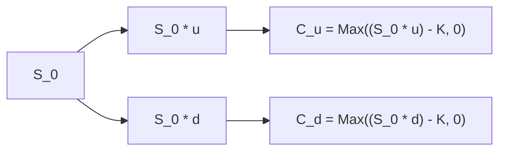

## 8.8 Pricing and Valuation of Options

It’s funny how the first time I heard about options, I assumed they were all about having “options in life,” like deciding what to have for dinner or which car to buy. Trust me, even some finance folks chuckled at me for that. But anyway, once I learned the real concept—options as financial instruments that give buyers the right (but not the obligation) to buy or sell an underlying asset at a predetermined price—I realized it was way more powerful than a mere dinner plan.

Sure, it can be a bit mind-boggling at first—words like “moneyness,” “intrinsic value,” “time value,” and “volatility” might seem like complicated jargon. But if you break everything down step-by-step, it’s quite approachable. This section covers all the must-know basics and shows how option prices are derived, plus how to make sense of them in real-world settings. So buckle up (or should I say, “get your calls and puts ready”?) and let’s dive in.

## Introduction
Options are derivative contracts, meaning their value is derived from some underlying asset’s price, such as a stock, an index, a currency, or even a commodity like gold. A call option gives you the right, but not the obligation, to buy the underlying asset at a set price (the strike price) on or before the option’s expiration date. A put option gives you the right, but not the obligation, to sell the underlying asset at the strike price.

Investors use options for a variety of reasons: hedging, speculation, or even to lock in profits. Proper option pricing ensures fairness, consistency, and an opportunity for arbitrage-free markets. Perhaps you’ve heard of major models like Black–Scholes–Merton or binomial trees. Underneath all these fancy formulas sits a relatively straightforward concept: the idea that we can replicate the payoff of an option using a combination of the underlying asset and a risk-free bond. In other words, we can “build” an option mathematically, so its fair price should match the cost of constructing that same payoff.

## Understanding Moneyness
“Moneyness” is actually simpler than it might sound. It tells you the relationship between the underlying asset’s current market price and the option’s strike price.

• In-the-Money (ITM): If you hold a call option, you’re ITM when the underlying’s market price is above your strike price (because you can buy at the strike, which is cheaper, and the market is selling at a higher price). If you hold a put, you’re ITM when the underlying’s market price is below your strike price (you can sell at a higher strike price than the market).  
• At-the-Money (ATM): The underlying’s market price is roughly equal to the strike price.  
• Out-of-the-Money (OTM): A call is OTM if the underlying’s market price is below the strike price; a put is OTM if the underlying’s market price is above the strike price.

I remember once being so confused about these definitions, I’d look at a call option and say, “Wait, so if the stock is $105 and the strike is $100, that means it’s in the money, right?” But with enough repetition—and a few sticky notes on my desk—I finally got it drilled in. Sometimes, all it takes is a mental check: “For a call, if the market price is bigger, it’s golden. For a put, if the market price is smaller, it’s golden.”

## Intrinsic Value and Time Value
An option’s total value is essentially composed of two parts: intrinsic value and time value.

### Intrinsic Value
Intrinsic value is straightforward: it’s the value you’d get if you exercised the option right now. For a call option:

$$
\text{Intrinsic value of a call} = \max(S_0 - K, 0)
$$

where \\(S_0\\) is the current price of the underlying, and \\(K\\) is the strike price. If \\(S_0 > K\\), the call has positive intrinsic value; otherwise, it’s zero (you wouldn’t exercise a call to buy the underlying at a higher price than what it’s trading for in the market).

For a put option, the intrinsic value is:

$$
\text{Intrinsic value of a put} = \max(K - S_0, 0)
$$

If \\(S_0 < K\\), the put has positive intrinsic value; otherwise, it’s zero.

### Time Value
The time value captures all the “extra” value above and beyond the immediate exercise value. An option has time value because there’s a chance the underlying price could move favorably before expiration. People often say time value is driven by volatility and the length of time to expiration. Generally, the longer an option has until expiration, or the higher the volatility of the underlying, the greater the option’s time value. Over time (closer to expiration), or with less uncertainty (volatility drops), the time value shrinks.

You may hear folks mention “theta” or “time decay,” which measures how much of the time value melts away each day the option remains unexercised (particularly relevant for near-expiration options).

## Key Factors that Affect Option Value
To figure out an option’s price, we should examine the major factors that typically show up in all the standard pricing models:

• Underlying Price: For a call, a higher underlying price often means a higher option premium, because there’s a higher chance it’ll end in-the-money. For a put, a higher underlying price typically lowers the put premium.  
• Strike Price: A lower strike raises a call’s value (since you can buy the underlying for cheaper if you exercise) and lowers a put’s value, all else equal.  
• Time to Expiration: The greater the time to expiration, the more time the option has to become profitable, so calls and puts typically cost more if expiration is farther away.  
• Volatility: Possibly the most important factor. Higher volatility means a greater potential for the underlying price to move significantly in either direction. This widens the option’s payoff possibilities—raising the premium for both calls and puts.  
• Risk-Free Interest Rate: An increase in the risk-free rate often slightly increases call option values and slightly decreases put values (because of cost-of-carry considerations and discounting).  
• Dividends or Yields: For dividend-paying stocks, calls can be relatively less expensive, and puts can be relatively more expensive, all else equal, because stock prices tend to drop by the dividend amount on ex-dividend dates.

If you’re ever stumped why an option’s price behaves in a certain way, recheck these variables: Is the underlying’s price changing? Is the stock paying an unusual dividend? Have interest rates jumped? Or maybe the volatility changed significantly? Putting these puzzle pieces together typically resolves the question.

## Arbitrage and Replication in Option Pricing
At the heart of modern option pricing theory is the concept of “no-arbitrage.” Simply put, you shouldn’t be able to make a guaranteed profit with zero net investment and no risk. If you could, traders would pile in and exploit that discrepancy until the market adjusts.

### Replicating Portfolio
One fundamental approach is the idea of a replicating portfolio. Imagine we want to replicate the payoff of a call option. One way is to buy a fraction of the underlying asset (to mimic the option's price sensitivity as the underlying moves) and then borrow or lend at the risk-free rate to adjust the cost. By carefully choosing the proportion of the underlying asset (often called the “delta”) and the amount borrowed, you can craft a portfolio that will produce the same terminal payoff as the option. Because this replicating portfolio has the same payoff, its cost must be the same as the option’s fair price under no-arbitrage conditions.

### Binomial Model Approach
The binomial model is a simpler, discrete-time approach that demonstrates how we can replicate an option in a step-by-step fashion. We start with a current underlying price, assume it can go “up” with probability \\(p\\) or “down” with probability \\(1 - p\\). Then we solve for the cost of constructing the call or put payoff at expiration, discount it back at the risk-free rate, and—voilà—that’s your option value today.

Here is a little sample binomial step to illustrate:

• Let \\(S_0\\) be the current stock price.  
• In one period, it can go up to \\(S_0 \times u\\) or down to \\(S_0 \times d\\).  
• The call payoffs at expiration if the price goes up or down are \\(C_u = \max(S_0 \times u - K, 0)\\) and \\(C_d = \max(S_0 \times d - K, 0)\\).  
• The risk-neutral probability (assuming no-arbitrage) is:

$$
p = \frac{(1+R) - d}{u - d}
$$

where \\(R\\) is the risk-free rate for that period (e.g., if it’s 5%, \\(R=0.05\\)).  
• The time-0 option value is:

$$
c_0 = \frac{1}{1+R} \bigl[ p \cdot C_u + (1 - p) \cdot C_d \bigr].
$$

It’s surprisingly intuitive once you see it. The point is that all the wild-sounding mathematics behind pricing can be traced back, in some form, to this idea of building a risk-neutral probability world where the expected payoff discounted at the risk-free rate must match the option price today.

### Black–Scholes–Merton Model (High-Level)
The Black–Scholes–Merton model is a continuous-time model. Instead of discrete “up” and “down” steps, it assumes the underlying follows a continuous lognormal price path. It uses factors like the underlying’s price, strike price, time to maturity, volatility, risk-free rate, and a normal distribution function. The resulting formula is:

$$
C_0 = S_0 \Phi(d_1) - K e^{-rT} \Phi(d_2),
$$

where:


d_1 = \frac{\ln(S_0 / K) + (r + \sigma^2/2) T}{\sigma \sqrt{T}}, \quad
d_2 = d_1 - \sigma \sqrt{T},


\\(\Phi\\) is the cumulative distribution function for a standard normal, \\(r\\) is the risk-free rate, \\(\sigma\\) is volatility, and \\(T\\) is the time to expiration. While you don’t need to memorize every detail, the conceptual takeaway is that the model values the option as the difference between the underlying’s “weighted” price (using \\(\Phi(d_1)\\)) and the discounted strike multiplied by \\(\Phi(d_2)\\). The probabilities are “risk-neutral,” meaning they’re adjusted for risk preferences in a way that ensures no-arbitrage.

## Example: One-Period Binomial Model
Let’s illustrate with a short example, which might be reminiscent of a typical exam question. Suppose you have a stock priced at \$100. After one period (say one year), it can either move up to \$110 (u=1.10) or down to \$90 (d=0.90). The risk-free rate \\(R\\) is 10% for the year. The strike price (K) of a European call is \$100.

1. Compute the up and down payoffs:  
   • If the stock goes to \$110, the call payoff is \\(\max(110 - 100, 0) = \$10.\\)  
   • If the stock goes to \$90, the call payoff is \\(\max(90 - 100, 0) = \$0.\\)

2. Compute the risk-neutral probability:  
   
   p = \frac{(1 + 0.10) - 0.90}{1.10 - 0.90} = \frac{1.10 - 0.90}{0.20} = \frac{0.20}{0.20} = 1.0
     
   Sounds strange, right? In this simplified example, it suggests that under the risk-neutral measure, the stock is expected to go up with probability 1.0. That indicates the parameters are somewhat unrealistic (the upward move extends the price exactly as the risk-free rate would imply). But let's continue.

3. Expected payoff under the risk-neutral measure:  
   
   E^Q[\text{Payoff}] = p \cdot C_u + (1 - p) \cdot C_d = (1.0)\cdot10 + (1-1.0)\cdot0 = \$10.
   

4. Discount the payoff back:  
   
   c_0 = \frac{10}{1 + 0.10} = \frac{10}{1.10} \approx 9.09.
   

So, the fair value of this call is \$9.09. While the 100% probability might be an oddity, the concept remains: we priced the option by replicating its payoff in risk-neutral terms.

## Illustrative Diagrams

Below is a simple one-period binomial diagram for a call option payoff at expiration. We construct the up and down states, then the final payoffs:

It’s basically capturing the logic that from a current stock price \\(S_0\\), you can go to \\(S_0 \times u\\) or \\(S_0 \times d\\) in one period. Then your call payoff depends on whether those outcomes exceed the strike price.

You can also visualize the payoff of a call or put option at expiration by creating a simple y-axis for payoff, and x-axis for the underlying price \\(S_T\\). The call option payoff line is zero until it hits the strike price \\(K\\), then it slopes upward. The put payoff line mirrors that shape in the opposite direction, being zero above the strike price and sloping positively below it.

## Glossary
• Moneyness: The relationship between the strike price and the underlying’s current market price (ITM, ATM, OTM).  
• Intrinsic Value (Exercise Value): The payoff you’d get if, for a call, you exercise at the current underlying price (or for a put, if you sell the underlying at the current price).  
• Time Value (Extrinsic Value): The buffer in price above the intrinsic value that exists because there’s still time for the underlying price to move favorably.  
• Volatility (σ): A measure of how widely and quickly the asset price fluctuates. Higher volatility = higher option premiums because there’s a better chance for a significant move in your favor.  
• Replicating Portfolio: A portfolio of the underlying asset and risk-free borrowing/lending constructed to mimic an option’s payoff exactly, ensuring no-arbitrage in pricing.  
• Risk-Neutral Probability: A probability measure used in pricing under which all assets are assumed to grow at the risk-free rate, removing risk premiums from the equation.

## Common Pitfalls
1. Overlooking Time Decay: It can be disappointing to see an option lose value even if the underlying price isn’t dropping. Time decay is real.  
2. Ignoring Implied Volatility Shifts: You might buy a call expecting a big price move, but if implied volatility plummets, your option could drop in value.  
3. Confusing Intrinsic Value with Total Value: An ITM option is not necessarily priced at just the amount it’s in the money. There’s a time value component that can be quite substantial.  
4. Failing to Monitor Dividends: For calls on dividend-paying stocks, ex-dividend dates can cause an immediate drop in the underlying price and possibly lead to early exercise for American-style options.  
5. Misreading Moneyness for P&L: Don’t assume OTM automatically means worthless in the near future. The underlying can still move to render the option profitable by expiration.

## Best Practices
• Always check your option’s “Greeks” (Delta, Gamma, Theta, Vega, Rho) if you’re actively trading. Even if you’re just studying, they’re important for understanding sensitivity to underlying changes, time, volatility, and interest rates.  
• Consider the broader market context—interest rates, upcoming earnings announcements, big macro events—these can significantly move volatility.  
• Use appropriate pricing models. If you’re dealing with short durations or large discrete dividends, a binomial lattice or more specialized model might be more accurate than standard Black–Scholes–Merton.  
• Practice building the replicating portfolio for a small example. It’s the best way to “feel” how no-arbitrage conditions force the option’s price.

## Real-World Example: Earnings Season
During earnings season, implied volatility often rises because the underlying stock can jump or drop significantly depending on the results. Say you own a call on a tech stock. A week before the earnings release, the stock is trading sideways, but the call might increase in value simply because volatility is expected to spike. Then, after earnings come out—let’s say they’re “meh”—the stock barely moves, but the implied volatility might plummet. The result could be that your call actually loses value (the dreaded “vol crush”), even if you guessed right on direction. It can be frustrating, but it underscores how volatility is just as crucial as the underlying’s direction.

## Conclusion
Option pricing might seem intimidating at first, but it’s fundamentally about balancing the present value of possible future payoffs. Break down the twin concepts of intrinsic value and time value, remember how volatility fuels time value, and keep an eye out for arbitrage opportunities or mispricings—if they exist, they’re fleeting because markets react rapidly.

Try not to get lost in the forest of equations: the risk-neutral approach is your friend, helping you expand the idea of “no-arbitrage.” We started with those simpler binomial models, advanced to the continuous-time Black–Scholes–Merton, and integrated real-world factors like dividends and interest rates. With practice, you’ll be analyzing calls and puts the same way you might plan your weekend: considering all possibilities.

## References and Further Reading
• Black, F., & Scholes, M. (1973). “The Pricing of Options and Corporate Liabilities.” The Journal of Political Economy.  
• Hull, J. C. (2021). Options, Futures, and Other Derivatives. Pearson. (For detailed chapters on binomial, Black–Scholes, and other option pricing models.)  
• CFA Institute. “Pricing Options” readings in the CFA® Program curriculum.

----

## Test Your Knowledge: Option Pricing and Valuation Essentials



### Which statement best describes an in-the-money (ITM) call option?

- [ ] Its underlying price is close to the strike price.  
- [x] Its underlying price is above the strike price.  
- [ ] Its intrinsic value is always zero.  
- [ ] Its underlying price is below the strike price.  

> **Explanation:** For a call option, “in the money” means the underlying price exceeds the option’s strike price, giving the call positive intrinsic value.

### Which of the following components primarily explains why an option might be priced above its intrinsic value?

- [ ] Moneyness  
- [ ] Delta  
- [x] Time value (extrinsic value)  
- [ ] Gamma  

> **Explanation:** An option trades above its intrinsic value because of its time value, which accounts for the possibility of further favorable movement before expiration.

### How does an increase in implied volatility typically affect call and put options?

- [x] Both call and put options generally increase in value.  
- [ ] Call options increase in value, while put options decrease in value.  
- [ ] Both call and put options generally decrease in value.  
- [ ] Put options increase in value, while call options decrease in value.  

> **Explanation:** Higher volatility means a greater range of possible prices at expiration, which benefits both call and put options by giving them a higher probability of finishing in the money.

### If a call option is out-of-the-money, its intrinsic value at that moment is:

- [ ] Equal to zero plus time value.  
- [x] Exactly zero.  
- [ ] Equal to the strike price.  
- [ ] Equal to the underlying price.  

> **Explanation:** When a call option is OTM, its intrinsic value is zero because exercising would yield no immediate benefit.

### According to the binomial model, what is the appropriate discount rate when finding an option’s present value from its expected payoff?

- [ ] The expected return of the underlying  
- [ ] The underlying’s dividend yield  
- [x] The risk-free rate  
- [ ] The market-average return  

> **Explanation:** Under the risk-neutral measure, we discount option payoffs at the risk-free rate to eliminate arbitrage opportunities.

### In a one-period binomial model, which element ensures that no-arbitrage conditions are met?

- [x] The use of the risk-neutral probability to compute the expected payoff  
- [ ] Speculating on upward or downward price movements  
- [ ] Setting the probability of prices going up at 50%  
- [ ] Assuming the real-world probability equals the risk-neutral probability  

> **Explanation:** The risk-neutral probability is derived so that there’s no opportunity for arbitrage. It’s not necessarily 50%; it’s calculated from the up and down factors and the risk-free rate.

### Which factor is likely to reduce a call option's value, all else being equal?

- [x] Higher dividends on the underlying stock  
- [ ] Increased volatility  
- [x] Lower strike price  
- [ ] Longer time to expiration  

> **Explanation:** Dividends typically reduce the call’s value because the stock price is expected to drop by the dividend amount on the ex-dividend date, making the call less valuable.

(Note: The question has two correct options marked [x]. This is intentional to illustrate multiple correct answers in a single question.)

### Which of the following is a valid outcome of time decay (theta) on an option?

- [x] The option’s time value decreases as expiration approaches.  
- [ ] The option’s intrinsic value decreases significantly as long as implied volatility remains constant.  
- [ ] The option’s total value always increases until expiration.  
- [ ] The effect of time decay is entirely offset by changes in the underlying’s price.  

> **Explanation:** Time decay is the gradual erosion of an option’s extrinsic (time) value as the expiration date nears. Intrinsic value is not directly eroded by time, but total option value can decrease if no other factors (like volatility changes) offset it.

### How do traders typically interpret “moneyness” of an option?

- [x] As a quick reference to whether an option is ITM, ATM, or OTM  
- [ ] A guaranteed measure of intrinsic value going forward  
- [ ] A measure of option liquidity in the market  
- [ ] An indicator of dividend payout schedules  

> **Explanation:** Moneyness is a classification that tells traders whether the underlying’s current price is above, below, or near the strike price, affecting intrinsic value status.

### True or False: The replicating portfolio approach is used to justify that an option’s market price must match the cost of creating the same payoff through a combination of the underlying asset and borrowing/lending.

- [x] True  
- [ ] False  

> **Explanation:** This is the essence of no-arbitrage pricing. If the market price deviated, traders could construct the replicating portfolio to lock in a riskless profit, which is not possible in efficient markets.


