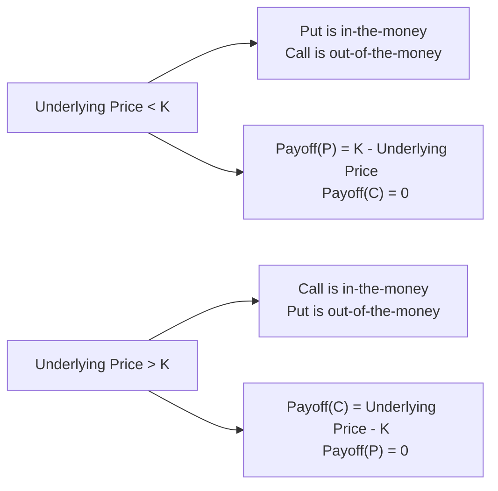
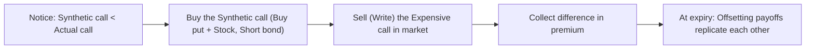

## 8.9 Option Replication Using Put–Call Parity

If I were to pick one concept that really made me pause and say, “Wait, that’s so elegant!” in my early days of studying derivatives, it would probably be put–call parity. I distinctly remember sitting with a study group at a campus café (coffee cups everywhere, obviously) and trying to figure out exactly how a call, a put, a zero-coupon bond, and the underlying asset could be combined in a way that reveals no-arbitrage pricing. It felt a bit like a magic trick at first. But once it clicked, oh man, it was so satisfying—like finally cracking a puzzle you’ve been staring at for hours.

Put–call parity is one of the most fundamental relationships in option pricing. It’s not just a random formula: it’s a statement about how European calls and puts must be priced relative to one another if markets are to remain free of arbitrage. Through this relationship, we can replicate a call or put in a way that ensures we don’t overpay or underpay relative to its theoretical fair value. Whenever the market strays from this theoretical relationship, there is an arbitrage opportunity waiting (for folks who act quickly enough).

Below, we’re going to explore the roots of this magic formula, highlight how you can replicate different option positions using it, talk a bit about put–call forward parity, and give a few real-world examples (with hopefully, enough detail to make it really stick). My goal is to deliver a thorough explanation, but also keep it approachable—like we’re chatting in that café all over again. Let’s dive right in.

### The Roots of Put–Call Parity

At its core, put–call parity describes a relationship between the price of a European call (C), the price of a European put (P), the price of the underlying asset (S₀), and a discounted strike price (K × e^(-rT))—where r is the continuously compounded risk-free rate and T is time to maturity. The standard formula we see in textbooks is:


C - P = S_0 - K e^{-rT}


This formula basically says that if you take a call and subtract a put (both on the same underlying with the same strike and same expiration), that’s equivalent in value to buying the underlying asset now (S₀) and financing it with a short position in a zero-coupon bond equal to K e^(-rT) (i.e., the present value of the strike price).

Informally, imagine you’re buying one call, selling one put, and simultaneously short-selling a zero-coupon bond (and using that money to buy the underlying). Or if that’s too mind-boggling, try to think of it as: “Pay the underlying’s price and cover the cost by borrowing an amount that will grow to K at maturity.” The difference between what you pay for the call less what you collect on the put should match the difference between the stock’s current price and the bond’s present value. If not, you’d have a free lunch (arbitrage scenario), which in efficient markets shouldn’t persist.

### Intuitive No-Arbitrage Logic

Let’s break it down in a more intuitive way:

• A European call option gives you the right (but not the obligation) to buy the underlying asset at price K at maturity.  
• A European put option gives you the right to sell the underlying asset at price K at maturity.  
• You can combine the underlying asset (long or short) with lending/borrowing at the risk-free rate to replicate payoffs.  

If the left side of the equation (call minus put) were bigger than S₀ - K e^(-rT), you could set up a series of trades—buy the cheaper side, sell the more expensive side—and (in an ideal frictionless world) lock in a riskless profit. Conversely, if it were smaller, you’d reverse your position. Because nobody likes to leave free money on the table, market participants would jump in, driving prices back in line.

In practice, transaction costs, bid-ask spreads, and other market frictions may reduce or even eliminate some of these obvious arbitrage trades. But the principle is the same—if mispricing is large enough to overcome those frictions, some keen arbitrageur will jump in and make it vanish.

### Constructing a Synthetic Call or Put

Maybe you’re wondering: “So how exactly do we replicate a call or put just using the other pieces?” The easiest approach is to solve the put–call parity equation for whichever piece you want to isolate.

• To replicate a call (C), rearrange the formula:  
  C = P + S₀ - K e^(-rT).

• To replicate a put (P), rearrange the formula:  
  P = C - S₀ + K e^(-rT).

Now, these expressions tell you how to get the payoff structure of a call or a put by combining the other assets. Let’s say you want a synthetic call. You could buy a put, buy the underlying S₀, and short a zero-coupon bond with face value K. The outcome at maturity will match that of a standard, plain-vanilla European call option.

One little side note: this also underpins a neat approach to option trading. Instead of just buying or selling calls or puts outright, a trader might prefer to set up synthetic positions if the cost is cheaper or if there is greater liquidity in the underlying or bond markets. For instance, if put options are relatively cheap or if the bond is trading at a slight discount, a trader might replicate a synthetic call and hope to beat the direct purchase of the real call.

### Put–Call Forward Parity

Now, let’s see how the conversation changes when dealing with forward contracts. Sometimes we don’t buy the asset spot; we sign an agreement to buy it at a future date for a certain price Fᵀ (the forward price). If we have calls and puts on a forward (rather than the spot asset), the parity relationship shifts slightly:


C(F, T) - P(F, T) = F^T e^{-rT} - K e^{-rT}


Here, F^T is the forward price agreed upon today for maturity T. Notice that, on the right side, we simply have the difference between the forward price and the strike price, both discounted back to the present. The logic is directly analogous: the difference between a call on the forward and a put on the forward is the same as the difference between the forward price and the strike, all in discounted terms. If there is any abnormal gap, an arbitrage strategy would form a synthetic equivalent and pocket free money.

### Arbitrage in Action

I recall an instance—just in a hypothetical sense, so not a personal trade—where someone noticed that calls on a certain index seemed “rich” compared to the corresponding puts. If you’re observing a mismatch, you can typically do the following:

• If you think the call is overpriced relative to the put, you can sell the call, buy the put, short the underlying (collect money now), and invest (or repay) the present value of the strike (K e^(-rT)).  
• If everything is reversed, you do the opposite side.  

As you hold this position, you check the final payouts at expiration and see if, net of all initial and final cash flows, you end up with a riskless gain. If the cost of setting this up is zero or negative (meaning you get paid at the start) and your payoff at maturity is never negative, you’ve discovered an arbitrage. Such trades don’t typically last very long in actively traded markets.

### Connecting to Other Chapters

While we are focusing on a derivatives concept here, it’s worth noting that some knowledge from chapters on:

• Basics in Time Value of Money (Chapter 2)  
• Market Efficiency (Chapter 6)  
• Arbitrage (this Chapter 8 and especially sections 8.4 and 8.5 for cost of carry and forward pricing)  

…all come in handy. If you’re fuzzy on discounting or wondered how we got that e^(-rT) factor, definitely check out the relevant info on discount factors in the Quantitative Methods chapters.

### Example with Real Numbers

Let’s lay out a numerical scenario to put the formula to work. Suppose:

• Current stock price (S₀) = $100  
• Strike price (K) = $105  
• Continuously compounded risk-free rate (r) = 5% per year  
• Time to maturity (T) = 1 year  
• European call price (C) = $7.50  
• European put price (P) = $2.00  

First, let’s compute K e^(-rT). We have T = 1, r = 0.05, so:


K e^{-rT} = 105 \times e^{-0.05} \approx 105 \times 0.9512 \approx 99.88


Now, compute the left side of put–call parity:


C - P = 7.50 - 2.00 = 5.50


Check the right side:


S_0 - K e^{-rT} = 100 - 99.88 = 0.12


Hmm, we get 5.50 on one side and about 0.12 on the other. That’s a huge discrepancy! This suggests a mispricing scenario. According to the standard parity relationship, the difference should be more or less the same (if no arbitrage opportunities existed). Are we missing something? Possibly implied dividends or the fact that this stock might be paying a large dividend. Or it might suggest an arbitrage if we verify the presence (or absence) of dividends.

If the stock pays no dividend, indeed, there is a suspected mispricing. With such large mispricing in real markets, it’s typically explained by: (1) the stock pays a big dividend, or (2) the call is priced with some big implied volatility difference, or (3) there’s a big market friction. In a frictionless world with no dividends, that difference spells out a big time arbitrage.

### Using a Diagram to Visualize

It can be pretty fun (yep, I said “fun”—I might be a finance nerd) to draw diagrams. Let’s do a quick payoff structure comparison at maturity for a call and put. Below is a simplified mermaid diagram that outlines the conceptual payoff of a call (C) and a put (P) at maturity, ignoring cost:

It’s a rough schematic: for underlying prices below K, the put has value at maturity, while the call does not. For prices above K, the call has value, while the put doesn’t. The put–call parity states that, once you factor in initial costs, the net difference in their values has to match S₀ - K e^(-rT). It’s basically an identity—almost like a seesaw.

### Common Pitfalls

• **Forgetting dividends:** If the underlying pays dividends, the standard put–call parity must be adjusted to reflect the present value of expected dividends over the option’s life.  
• **Mixing up American vs. European options:** This parity strictly holds for European options (those only exercisable at maturity). American options can be exercised early, which tweaks the relationships (and complicates things).  
• **Overlooking transaction costs:** Real-life arbitrage is limited by bid-ask spreads, brokerage fees, and short-selling constraints. The tidy formulas assume frictionless trading.  
• **Misinterpreting interest rates:** If you’re using a discrete rate instead of a continuously compounded one, you have to adapt the formula accordingly. Or you might be dealing with cheap borrowing that’s below the risk-free rate. That changes your discount factor.  

### Option Replication: The How-To

Let’s say we want to “create” a European call synthetically, without actually buying a call from an exchange. The formula:


C = P + S_0 - K e^{-rT}


is the blueprint. That is, we can purchase a put, buy the underlying stock itself, and short a zero-coupon bond. The net cost at initiation will (or should) equal the price of an actual call. At maturity, we end up with the same payoff as if we’d purchased a call directly. 

Hence, if you see that actual calls in the market are more expensive than your synthetic approach, you could just replicate them cheaply and sell the overpriced calls. That’s arbitrage 101. The same logic applies if you’re looking to replicate a put from calls, or replicate the underlying from calls and puts, and so on.

### Real-World Examples

1. **Index Options:** The equity index options on major indexes (S&P 500, etc.) often trade with good liquidity. If you see the difference between call and put prices deviate from the theoretical difference implied by S₀ - K e^(-rT), you might suspect that it’s related to an upcoming dividend from the underlying basket, or some major corporate earnings cycle that’s impacting implied vols. If you factor in the discounted value of these dividends or distributions, you typically get a tidy fit.  
2. **Currency Markets:** Put–call parity also manifests in currency options, but you have to account for the domestic and foreign risk-free rates, plus any interest rate parity relationships.  
3. **Hedging Strategies:** A portfolio manager might hold a stock but be concerned about a potential downside. They can purchase a put to limit risk. In that scenario, you can flip to the other side of the formula to see how that changes your overall payoff.  

### Another Mermaid Diagram for Arbitrage Flow

Consider a scenario where the synthetic call is cheaper than the real call. The flow of an arbitrage strategy might be:

Basically, you buy the synthetic (because it’s cheaper) and sell the real call. If everything plays out per put–call parity, you lock in an immediate profit with no net risk at maturity. If reality deviates, the discrepancy between synthetic and real call gets corrected by arbitrage traders.

### Encouraging Curiosity

Perhaps you’re now thinking, “All right, I get the formula, but how did it come about historically?” Some of it traces back to Bachelier’s early finance math, but Merton and others in the academic community built upon these ideas in formal option pricing theory. It’s super cool to see the synergy between pure math, economic theory, and real markets. In my opinion, it’s an exemplar of how finance can be precise and logical, yet also shaped by the real swirl of market participants, dividends, risk, and sentiment.

### Summary Thoughts

Put–call parity is a gem in derivatives theory. It elegantly ensures that calls, puts, bonds, and the underlying asset remain fairly valued relative to each other (assuming no dividends and no market frictions for the classic formula). Adjustments for dividends and forward prices are straightforward once you understand the underlying concept.

When you next see a call or a put quoted on a stock, maybe you’ll reflect on this relationship. There’s a hidden chain linking that call and that put together, whether you see it or not. Price them incorrectly, and someone can set up a no-risk profit. That’s the beauty—and the necessity—of put–call parity: it keeps the market in balance. 

### References and Further Reading

• CFA Institute, “Option Strategies” readings. These readings delve deeper into how option strategies can be built and used for different risk profiles.  
• Hull, J. C. (2021). Options, Futures, and Other Derivatives. Look specifically for his sections on put–call parity. Hull’s style is methodical and thorough.  
• Merton’s works on option pricing theory, for those who want to see the original academic frameworks.  

If you want to explore more advanced topics like American-style options, early exercise, or how put–call parity modifies for underlying assets that generate yields (like currencies, or stocks with dividends), definitely dig into chapters 8.1 through 8.8 in this text (on derivative instrument features, forward, futures, and swaps) and cross-reference with the advanced material in Hull’s textbooks. It’s quite an adventure!

And that’s basically the story of put–call parity and its role in option replication. If this was your first exposure, I hope the examples—plus a little bit of that “Oh wow!” moment—help it stick in your mind.  

## Test Your Knowledge: Put–Call Parity and Option Replication



### Which of the following is the correct formula for European put–call parity (assuming no dividends)?

- [ ] C - P = K e^(rT) - S₀
- [x] C - P = S₀ - K e^(-rT)
- [ ] C + P = S₀ + K e^(-rT)
- [ ] P - C = K e^(-rT) - S₀

> **Explanation:** The no-arbitrage put–call parity for European options is C - P = S₀ - K e^(-rT).  

### A synthetic call can be constructed by:

- [ ] Buying a call and a put while shorting the underlying.
- [ ] Buying a put and shorting the underlying.
- [x] Buying a put, buying the underlying, and shorting a zero-coupon bond.
- [ ] Buying a zero-coupon bond and shorting both a call and a put.

> **Explanation:** Rearranging put–call parity to isolate C shows that a long call can be replicated by a long put, a long position in the underlying, and a short position in a zero-coupon bond with face value K.  

### What role does the zero-coupon bond play in the typical put–call parity relationship?

- [ ] It replicates the payoff of a call.
- [x] It represents the discounted strike price component of the replication.
- [ ] It replicates the payoff of a put.
- [ ] It serves as an interest rate hedge for the underlying position.

> **Explanation:** In put–call parity, K e^(-rT) (via a zero-coupon bond) is the present value of the strike price that completes the replication strategy.  

### An investor finds that the synthetic call (constructed via a put, stock, and short ZCB) is cheaper than the actual call in the market. Which action might produce an arbitrage profit?

- [ ] Buy the overpriced call; short the synthetic call.
- [ ] Do nothing; no arbitrage is possible because of transaction costs.
- [x] Buy the synthetic call; sell (write) the overpriced call.
- [ ] Buy both the synthetic call and the actual call simultaneously.

> **Explanation:** If the synthetic is cheaper, you purchase it, then sell the more expensive “real” call, collecting the difference in cost as an arbitrage gain.  

### In the formula C(F, T) – P(F, T) = Fᵀ e^(-rT) – K e^(-rT), the term Fᵀ e^(-rT) represents:

- [x] The present value of the forward price.
- [ ] The future value of the strike price.
- [ ] The cost of carrying the underlying.
- [ ] The premium for early exercise rights.

> **Explanation:** Fᵀ e^(-rT) is simply the forward price discounted back to the present at the risk-free rate.  

### Which of the following is a key assumption in put–call parity?

- [ ] The underlying has high volatility.
- [ ] The options expire in more than one year.
- [ ] The underlying pays continuous dividends.
- [x] No-arbitrage condition holds with frictionless markets.

> **Explanation:** Standard put–call parity relies on the assumption of no-arbitrage in frictionless markets (no transaction costs, short-sale restrictions, or large bid-ask spreads).  

### Which statement best explains if put–call parity can hold for American options?

- [x] It might not hold perfectly because of potential early exercise benefits.
- [ ] It holds perfectly under any circumstances.
- [ ] It’s always stronger for American options.
- [ ] It only holds if the underlying is a bond.

> **Explanation:** American options can be exercised early, affecting their pricing. Put–call parity in its classic form applies to European options that can only be exercised at maturity.  

### In constructing a synthetic put, one would:

- [ ] Sell a call, buy the underlying, and buy a zero-coupon bond.
- [x] Buy a call, short the underlying, and buy a zero-coupon bond.
- [ ] Sell a call, short the underlying, and short a zero-coupon bond.
- [ ] Buy a call, buy the underlying, and short a zero-coupon bond.

> **Explanation:** Rearranging the put–call parity for P gives you P = C - S₀ + K e^(-rT). That means to replicate a put, you hold a long call, a short underlying, and a long bond position.  

### A forward contract on the underlying has a forward price Fᵀ. Calls and puts on this forward yield a relationship where:

- [x] C(F,T) - P(F,T) = (Fᵀ - K) e^(-rT)
- [ ] C(F,T) + P(F,T) = (Fᵀ + K) e^(-rT)
- [ ] C(F,T) - P(F,T) = (K - Fᵀ) e^(-rT}
- [ ] P(F,T) - C(F,T) = S₀ - Fᵀ

> **Explanation:** Put–call forward parity states that C(F,T) - P(F,T) = (Fᵀ - K) e^(-rT).  

### True or False: “If the put–call parity condition is violated, arbitrageurs can construct riskless profit opportunities.”

- [x] True
- [ ] False

> **Explanation:** That is precisely what put–call parity is about. If the relationship is violated, one can buy the underpriced side, sell the overpriced side, and lock in a riskless profit.


