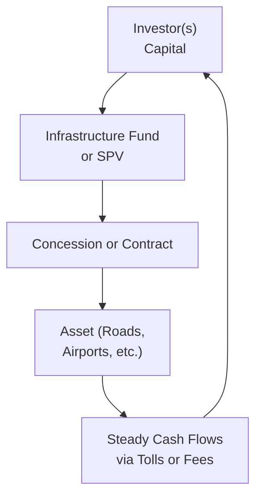

## 9.4 Real Estate and Infrastructure

Real estate and infrastructure investments are important components of many institutional and individual portfolios. They can offer steady cash flows, tangible ownership, and diversification benefits relative to traditional assets like stocks and bonds. Yet, as with any alternative investment, there are unique risks, liquidity concerns, and structural complexities to keep in mind. So, let's explore, in a slightly informal way, how real estate and infrastructure might fit into your portfolio (or your mental model if you’re just curious).

---

### Introduction to Real Estate Investing

Real estate is probably the first “alternative investment” many of us encounter in real life—maybe you’ve considered buying a house, or you’ve seen a family member rent out their newly purchased property. Real estate is tangible, you can literally touch it (though, watch out if it’s a hundred-year-old building with delicate brickwork!), and it can carry both emotional attachments and objective financial benefits.

Real estate as an asset class encompasses:
• Direct ownership (e.g., that nice little duplex you or your parents might rent out).  
• Real Estate Investment Trusts (REITs).  
• Private real estate funds.  
• Debt instruments secured by property, such as mortgages or mortgage-backed securities.  

#### Key Characteristics of Real Estate

1. **Tangibility**:  
   You’ve got something physical—like a building, land, or a warehouse. Because real estate is “real,” you might get rental income and potential appreciation over time. It can also serve as collateral for loans.

2. **Heterogeneity**:  
   No two pieces of real estate are identical. Even if they’re in the same neighborhood, they might have different footprints, zoning constraints, or rental potential. This uniqueness can lead to specialized acquisition strategies and sometimes less transparent pricing relative to, say, a stock that trades on an exchange.

3. **Low Liquidity**:  
   Buying and selling real estate can be slow and complicated—my friend once tried to sell a small apartment building, and it took nine months, plus an ocean’s worth of paperwork. Large capital commitments and lender approvals can also complicate deals.

---

### Types of Real Estate Investments

#### Direct Ownership of Properties

• **Residential**: Single-family homes, condos, small multi-family apartments.  
• **Commercial**: Office buildings, industrial properties, shopping centers, hotels.  
• **Mixed-Use**: Properties that combine residential, commercial, or even industrial elements.

Direct ownership allows you to control property decisions (renovations, tenant selection, financing structures), but you also handle any headaches—such as leaky roofs, tenant turnover, or broader economic downturns that can reduce demand.

#### Real Estate Investment Trusts (REITs)

REITs are typically publicly traded companies owning or financing income-producing properties. The beauty is, if you hold shares of a REIT, you effectively gain exposure to real estate without the burdens of hands-on management. 

1. **Equity REITs**: Own and operate properties for rental income.  
2. **Mortgage REITs**: Provide financing to real estate owners through mortgages or loans, earning interest.  
3. **Hybrid REITs**: Combine both equity and mortgage strategies.

Remember, REITs often must distribute a significant portion of earnings (often 90%+) as dividends to shareholders—great if you’re seeking yield. However, they’re still subject to interest rate and property market fluctuations.

#### Private Real Estate Funds

These funds pool investor capital to buy or develop real estate. They often have different strategies:

• **Core**: Lower-risk properties (well-located, stable tenants, high occupancy).  
• **Value-Add**: Properties that require moderate improvements or repositioning to drive higher returns.  
• **Opportunistic**: Higher-risk, often involving significant renovations, new developments, or special situations.

Private funds typically have lock-up periods (sometimes 5 to 10 years or more) and require high minimum investments. They may also use leverage, amplifying both returns and risks.

#### Mortgages and Bond Investments

If you prefer debt exposure, you can invest in loans secured by property or mortgage-backed securities (MBS). This, in theory, provides a more stable income stream with a known interest rate, but you might get hammered by credit risk if the borrower isn’t paying or the real estate collateral drops in value.

---

### Real Estate Investment Examples and Case Studies

• **Residential Rental**: Suppose you buy a duplex for $400,000 with a 25% down payment. You rent each unit, collecting monthly income that covers your mortgage payments, property taxes, and insurance. Over time, if you keep the place in good shape, you might enjoy appreciation, pay down the loan principal, and grow your equity.

• **Office Building REIT**: Consider a REIT focusing on Class A office towers in prime urban areas. Because the REIT invests in multiple properties, you gain diversification across multiple regions or tenant types. Public listings also mean liquidity is higher than typical direct real estate—if you want to exit, sell your REIT shares on the stock market.

• **Value-Add Private Fund**: This might purchase an older apartment complex, renovate common areas, upgrade interiors, and improve management. If successful, the fund can charge higher rent, increase net operating income, and exit at a profit in 5 to 7 years.

---

### Diversification and Real Estate

Real estate can help diversify a portfolio because it’s not perfectly correlated with stocks or bonds. Historically, real estate returns have had a moderate correlation with equities—sometimes they move in tandem, but often they reflect local property market conditions, vacancy trends, or interest rates. However, keep in mind correlation can spike in a severe market downturn as investors tend to sell off multiple asset classes simultaneously.

---

### Mermaid Diagram: Real Estate Investment Flow

Here’s a small visual of how capital flows into real estate, generating returns:

More complex structures may involve multiple layers of financing (like mezzanine debt, senior mortgages, etc.), but the above captures the essential idea of how your initial capital eventually provides returns.

---

### Infrastructure Investing

Now, shifting gears to infrastructure: the roads, bridges, airports, utilities, and renewable energy facilities that keep our world running. Infrastructure is typically characterized by:

1. **Stable, Predictable Cash Flows**  
   Many infrastructure projects enjoy long-term contracts (like 20-year energy purchase agreements) or government concession agreements that provide stable revenues.

2. **Lower Correlation**  
   Infrastructure can behave differently from equity or fixed-income investments, providing valuable diversification for a broader portfolio. However, watch out: certain regulatory, economic, or political events can weigh on infrastructure investments specifically.

3. **Political and Regulatory Risks**  
   Because infrastructure often relies on government partnerships, changes in regulations or political sentiment could impact asset valuations or reduce certain benefits. Infrastructure projects can also be heavily reliant on user fees or tax revenues, which can shift over time.

---

### Types of Infrastructure Investments

1. **Public or Private Infrastructure Funds**: These funds invest in large-scale infrastructure projects—like toll roads, pipelines, or telecommunication towers. You’ll see them marketed with stable yield, but the capital lock-up can be long.

2. **Direct Ownership**: Large investors (e.g., pension funds, sovereign wealth funds) often directly invest in building or operating an infrastructure asset, such as a solar farm. Individuals rarely do direct deals because these projects require huge sums of capital and specialized expertise (like negotiating with municipalities).

3. **Publicly Listed Entities**: Some companies specializing in infrastructure management or ownership trade on the stock market. For example, companies that operate toll roads, rail systems, transmission lines, or pipelines. Their share prices can fluctuate with the equity market.

4. **Co-Investment Structures**: Smaller investors sometimes participate alongside large institutions to gain access to deals they wouldn’t manage on their own.

---

### Greenfield vs. Brownfield Projects

• **Greenfield**: These are brand-new projects built from scratch—a new toll road, airport expansion, or wind farm. Risks are higher (construction costs, potential delays, no operational history), but if successful, returns can be substantial.

• **Brownfield**: An existing, operational asset that might need enhancements or upgrades. Because cash flows are already somewhat predictable, risk can be lower than with a greenfield approach, though the return potential might be more modest.

---

### Concession Agreements

Concession agreements are deals in which a government entity grants a private company (or consortium) the right to build or operate infrastructure for a set period. The private party collects revenues—through user fees or government payments—and after the contract term, the asset might revert back to public ownership. While concession agreements pave the way for stable returns, they also bring political risk—what if a newly elected government decides to renegotiate the terms?

---

### Real-World Infrastructure Example

Let’s say a pension fund invests in a local toll road project:
1. The government signs a 30-year concession.
2. The private operator invests $1 billion in construction and gets the right to collect toll revenue.
3. Annual traffic volumes dictate toll revenue; the operator aims to generate enough to cover maintenance, debt, and investor returns.

In a stable economic environment with consistent traffic, the operator might enjoy predictable annual cash flows. But if the region’s economy tanks or the government caps toll rates, that can quickly change the profitability picture.

---

### Diversification and Infrastructure

Infrastructure tends to have a lower correlation to equities (though sometimes it can be surprisingly correlated in serious downturns). The combination of stable long-term contracts and essential public services can make certain infrastructure assets behave more like “bond-like” or “utility-like” yields, though there is definitely no guarantee that means low risk in every scenario.

---

### Best Practices, Pitfalls, and Challenges

• **Valuation**: Real estate valuations can be subjective, reliant on appraisals or specific comparables. Infrastructure valuations might involve multiple scenario analyses and contract assumptions.  
• **Leverage**: Borrowed money can magnify returns, but down cycles may prompt margin calls or debt covenant breaches.  
• **Fees and Complexity**: Private real estate or infrastructure funds can charge hefty management and performance fees. Watch out for illiquidity and hidden transaction costs.  
• **Regulatory and Policy Shifts**: Real estate zoning or property taxes can change. Infrastructure deals often depend on government regulators authorizing fee structures or usage rates.  
• **Operational Expertise**: Managing physical assets (like a real estate property or a power plant) requires specialized knowledge. Weak or inexperienced management teams can ruin an otherwise promising project.  

I’ve definitely made mistakes personally—like overestimating how quickly a new commercial property would attract tenants. The reality? That prime location wasn’t so prime after all, and I had unexpected maintenance costs all around!

---

### Mermaid Diagram: Infrastructure Investment Structure

Often, a Special Purpose Vehicle (SPV) is formed to hold one specific project. This structure isolates risks (for instance, a single toll road) away from other projects in the fund.

---

### Glossary

• **Real Estate Investment Trust (REIT)**: A publicly traded corporation or trust that pools investor money to own or finance income-producing real estate. REITs often distribute most of their earnings as dividends.

• **Core, Value-Add, Opportunistic Real Estate**: A grading scale describing risk-return profiles. Core typically means stable, prime properties with lower returns. Value-add involves moderate improvements, while opportunistic is higher risk, often with big renovations or new developments.

• **Greenfield vs. Brownfield**: Greenfield refers to new infrastructure projects built from the ground up, while brownfield projects involve existing assets possibly in need of upgrades or refinancings.

• **Concession Agreement**: A contract granting private investors the rights to build or operate an infrastructure asset (like an airport or toll road) and collect revenues for a specified time.

---

### Strategies to Mitigate Risks

• **Due Diligence**: Conduct thorough property or project inspections, market analyses, and consider historical performance and occupant demand or usage patterns.  
• **Portfolio Diversification**: Don’t put all your capital in one building or one toll road. Spread your risk across multiple assets, property types, or geographic regions.  
• **Understand Capital Structure**: Know the debt levels, interest coverage ratios, or loan covenants. This applies to both real estate and infrastructure projects.  
• **Stay On Top of Regulations**: Monitor local zoning rules or government concessions. A single regulation change can disrupt entire business models.  
• **Insurance and Environmental Checks**: Protect your investment with property/casualty insurance, coverage against natural disasters, and environmental risk assessments.

---

### Conclusion and Learning Tips

Real estate and infrastructure often feel more tangible than stocks or bonds—seeing that building or driving through that toll road might make it more psychologically “real.” That can be a plus if you want a physical sense of your investments, but it’s also easy to get swayed by emotional attachments or the illusions of guaranteed returns.

Try to maintain a healthy skepticism. Crunch the numbers, read about local government policies, talk to multiple experts (in real estate, property management, construction, regulation, law). If you’re new to real estate investing, maybe start by exploring REITs or smaller-scale syndications with transparent track records. For infrastructure, keep an eye on large public funds or specialized vehicles with professional management teams.

Anyway, hopefully, this overview helps you connect the dots about how real estate and infrastructure can add diversification and stable income potential to portfolios—while acknowledging the sometimes big headaches that come with big, physical assets.

---

### References and Recommended Readings

• **CFA Institute Level I Curriculum**, “Real Estate Investments.”  
• **Commercial Real Estate Analysis and Investments** by David M. Geltner et al.  
• **Infrastructure as an Asset Class** by Barbara Weber and Hans Wilhelm Alfen.  
• **Nareit** (https://www.reit.com/) – Great resource for REIT research and market data.

---

## Test Your Knowledge of Real Estate and Infrastructure



### Which of the following correctly describes a primary risk of direct real estate investing?

- [ ] Rapid price discovery and high liquidity
- [ ] Guaranteed value appreciation
- [ ] Quick exit strategies and limited management effort
- [x] Higher transaction costs and lower liquidity

> **Explanation:** Direct property ownership tends to have higher transaction costs and lower liquidity, making exits time-consuming and costly.  

### What is the main benefit of investing in a REIT compared to owning physical properties?

- [x] Liquidity and ease of trading shares
- [ ] Unlimited personal control over property management
- [ ] No correlation to the broader equity market
- [ ] Guaranteed income regardless of occupancy rates

> **Explanation:** REIT shares can be bought or sold on an exchange, typically offering greater liquidity and fewer managerial burdens than direct property ownership.  

### Which description best fits a “core” real estate strategy?

- [x] Focuses on stable, fully leased properties in prime locations
- [ ] Relies on heavy renovation and repositioning to create value
- [ ] Invests only in vacant land for future development
- [ ] Entails a high degree of construction risk for big potential gains

> **Explanation:** Core strategies target lower-risk, income-producing properties that are already stabilized, often in established markets with credible tenants.  

### Which of the following differentiates greenfield from brownfield infrastructure projects?

- [ ] Brownfield always refers to abandoned real estate in urban zones
- [x] Greenfield involves building from scratch; brownfield involves existing assets
- [ ] Greenfield has no construction risk, while brownfield is extremely high risk
- [ ] Brownfield projects never generate predictable cash flows

> **Explanation:** Greenfield projects are built from the ground up (new construction), whereas brownfield projects involve assets that already exist, potentially requiring upgrades or expansions.  

### Which factor commonly contributes to infrastructure’s stable cash flows?

- [x] Long-term concession agreements or basic public-service demand
- [ ] Infinite growth potential with no government oversight
- [x] Grants from local governments and steady user-fee arrangements
- [ ] Daily adjustments in contract rates based on currency markets

> **Explanation:** Infrastructure investments often involve essential services (roads, utilities) and long-term concessions that structure stable revenues over lengthy periods.  

### What is a key diversification benefit of adding real estate to a traditional stock and bond portfolio?

- [ ] It is perfectly correlated with stocks and bonds, enhancing returns
- [x] It may have lower correlation, potentially reducing overall portfolio volatility
- [ ] It always appreciates at a higher rate than equities
- [ ] Real estate never reacts to macroeconomic factors

> **Explanation:** Real estate often has a moderate or lower correlation to equities and bonds, which can help reduce overall portfolio volatility.  

### Which statement about private real estate funds is most accurate?

- [x] They often have lock-up periods and higher minimum investment requirements
- [ ] They usually provide immediate liquidity, similar to public markets
- [x] They are exclusively regulated by central banks
- [ ] They carry no management fees or performance fees

> **Explanation:** Private real estate funds typically have long lock-up periods, higher minimum commitments, and a fee structure that may include both management and performance fees.  

### Why might an infrastructure asset experience political and regulatory risk?

- [ ] Infrastructure is never subject to governmental regulation
- [ ] All infrastructure deals are done across private lands
- [x] Governments can renegotiate concession terms, change fee structures, or impose new regulations
- [ ] Users have no choice but to pay unlimited fees

> **Explanation:** Infrastructure assets like toll roads or utilities often involve government oversight and can be affected by changing political or regulatory environments.  

### Which best describes a typical concession agreement in infrastructure?

- [ ] A short-term lease for an asset with no user fees
- [x] A contract granting operation rights for a set period, allowing private revenue collection
- [ ] A government guarantee of profit for the private investor
- [ ] A contract with guaranteed indefinite ownership

> **Explanation:** Concession agreements give a private entity rights to operate and collect revenue from an infrastructure asset over a stated number of years, after which the asset may revert to the government.  

### True or False: Infrastructure returns are always completely uncorrelated with equity markets.

- [x] True
- [ ] False

> **Explanation:** Although infrastructure can exhibit lower correlation with equities, it is not always zero. During significant market crises, correlations can increase, but compared to many asset classes, some infrastructure investments may hold relatively stable valuations.  


