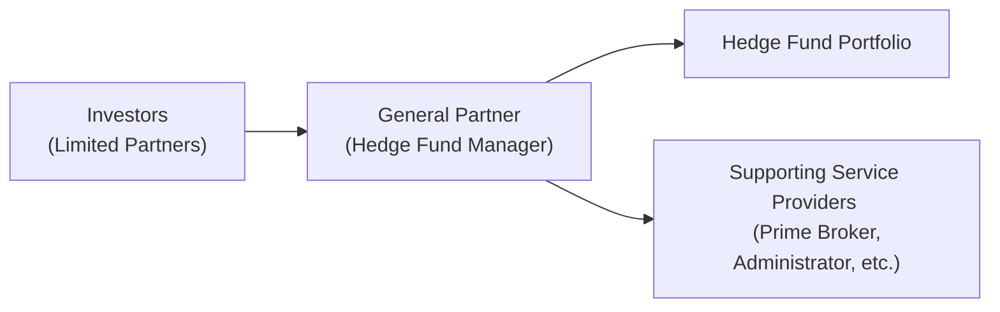

## 9.6 Hedge Funds

Imagine you're hanging out with a friend who casually mentions they've heard about hedge funds but aren't totally sure what they are—perhaps they've only heard stories of large returns, whispered secrets, high-profile managers, and somewhat mysterious strategies. You might lean in and say, “Well, hedge funds can be complicated, but at heart, they're just private investment vehicles that can pursue a wide range of strategies.” So let’s unpack the mystery surrounding these funds in a conversational way. Seriously, there's a lot going on under the hood.

Hedge funds have become an integral part of global financial markets, providing investors with potential absolute returns—meaning these managers often aim to make money in both rising and falling markets. They typically rely on strategies such as long/short equity, event-driven investments, relative value trades, and global macro themes. They can also use tools like leverage, derivatives, and short-selling. All of these can be neat or terrifying, depending on one’s perspective. But hey, let’s break these components down systematically so they’re not so weird or intimidating.

### Hedge Fund Overview

Hedge funds, by definition, are often structured to have fewer regulatory constraints than mutual funds or other retail-oriented vehicles. In many jurisdictions, these funds can only accept investments from accredited or qualified investors, which are typically high-net-worth individuals or large institutions. They’re called “private” because they’re not typically available to the general public. And that’s not just them being exclusive for exclusivity’s sake—many regulators require it to protect small investors from complex risks they may not fully understand.

Now, why are hedge funds so interesting? In theory, hedge fund managers strive to provide absolute returns that are uncorrelated (or at least less correlated) with the broader equity and bond markets. The idea is straightforward: a manager who’s really skilled may earn a positive return, regardless of the direction of the market. In reality, markets can be wild, and during systemic crises, correlations often surge across most asset classes, hedge funds included. But under normal circumstances, hedge funds can offer some diversification benefits that you just won’t find in standard stock or bond portfolios.

### Key Hedge Fund Features

Let’s consider the main features that define hedge funds:

• Light Regulatory Oversight:  
  Hedge funds often have lighter oversight compared to mutual funds. They aren’t required to disclose as much to regulators or the public, especially about daily holdings or strategy details. This lack of transparency can be strategic (nobody wants to reveal their brilliant or quirky trade idea to the whole world), but it also brings a degree of risk.

• Fee Structure—“2 and 20”:  
  Perhaps you’ve heard of managers strolling around in fancy suits collecting massive fees. Typically, hedge funds charge a management fee like 2% of assets under management plus a performance fee (in many cases 20%) on net new profits. So if a fund does really well, the managers are rewarded. Some funds might adjust this structure a bit—maybe 1.5 and 15 or 2.5 and 25. But you get the idea: a base fee plus a chunk of the returns.  
  - High-Water Mark: Many hedge funds include a “high-water mark” in their performance fee arrangements. In simple terms, the fund won’t charge a performance fee until it surpasses its highest previous value, ensuring investors aren’t double charged.

• Accredited Investors or Qualified Clients:  
  Because of the risk and complexity, hedge funds generally only accept money from “accredited” or “qualified” clients—investors with a certain net worth or professional investing experience. That’s partly (or mostly) to comply with regulations and partly to ensure that participants understand the potential pitfalls of investing in these vehicles.

• Use of Leverage, Short Selling, and Derivatives:  
  Hedge fund managers can use borrowed capital (leverage) to amplify returns or to hedge existing positions. They may short sell overvalued securities. They can also use a range of derivatives—options, swaps, futures—to enhance or reduce portfolio risk. With these extra tools, managers can capture returns from both sides of the market, but they also add some additional risks.

• Lock-Up Periods:  
  Many hedge funds have something called a lock-up period. This is basically a timeframe, often anywhere from a few months to a few years, where investors can’t redeem (pull out) their money. The manager might also impose redemption notice periods or gates to manage liquidity. These structures allow managers to invest in less liquid assets without worrying about short-term redemptions hurting the entire portfolio.

### Common Hedge Fund Structures

The most traditional structure is the limited partnership. The hedge fund manager serves as the general partner (GP), making investment decisions and typically holding unlimited liability (though practically, the manager entity might be set up as an LLC or limited liability company). The investors are limited partners (LPs), who can only lose up to the amount they invest.

Below is a diagram (using Mermaid) showing a simplified structure of a hedge fund:

In another variation, you might hear about “funds of funds.” Those are basically funds that bundle together investments in multiple hedge funds. It’s an interesting concept—investors get diversification across strategies and managers, but they typically pay an extra layer of fees. So you’ve got to be mindful of the “double-dip” on fees when evaluating them.

### Hedge Fund Strategies

So what do hedge funds actually do to (hopefully) make money? The number of strategies is almost as varied as the number of funds, but let’s highlight the main categories:

• Long/Short Equity:  
  Managers go long on undervalued stocks and short sell overvalued stocks (or entire sectors). They aim to generate alpha (excess return above a benchmark), regardless of the overall market direction. If the market goes up, hopefully the longs do better than the shorts. If the market drops, hopefully the shorts help offset losses from the long positions.

• Event-Driven:  
  This is all about capitalizing on corporate events—think mergers and acquisitions, bankruptcies, restructurings, or spin-offs. If a manager has special insight on a pending merger (they expect a higher or lower takeover price than the market), they can put on a position to profit from that scenario.

• Global Macro:  
  Picture a manager who looks at interest rates, currencies, global economic indicators, and invests across entire markets. Maybe they decide to go long the Japanese yen and short the British pound if they believe interest rate differentials or central bank policies favor that trade. Some managers also watch macro-level trends in commodities and equities. This approach can be very broad and often heavily uses derivatives.

• Relative Value:  
  A relative value manager looks at pricing relationships between securities. For example, in fixed income, they might notice mislabeled risk or mispriced coupon yields, and simultaneously buy an undervalued bond while shorting an overvalued one. The hope is that the spread between these instruments converges in the manager’s favor.

• Distressed Debt:  
  Similar to event-driven, but specifically focusing on the bonds or loans of financially troubled or bankrupt companies. The fund might buy the debt at very low prices, anticipating eventually being able to recover more than what they paid.

### Risk, Return, and Potential Diversification

Now, let’s talk risk. Hedge funds can lose money—there’s no guarantee of positive returns, even if the marketing pitch says “absolute return.” Managers might use leverage, which can magnify losses just as easily as it can magnify gains. If the fund invests in illiquid assets, it might impose redemption restrictions like side pockets for hard-to-value or illiquid positions so that redemptions don’t create chaos. Sometimes, an investor can get stuck if the manager invests in assets that cannot easily be sold when everyone’s running for the exits.

At the same time, hedge funds can play a valuable role in a portfolio by offering returns that don’t move in lockstep with traditional stocks and bonds—at least, that’s the theory. The correlation with traditional assets might be low during normal times, which can be helpful for diversification. However, you must consider that when markets crash in unison, correlations can spike. In 2008, for instance, many hedge funds were hammered by the same liquidity crunch that hit everyone else. So, while these strategies can help spread risk around, they’re not a magic bullet.

### Strategy Drift and Style Breakdown

Many hedge funds specialize in a single type of strategy, but managers might occasionally jump strategies if they sense a better opportunity. This can be great if they actually have the skill to adapt. However, from an investor’s perspective, it can sometimes be concerning because you might think you’re investing in a long/short equity fund, but then find your manager suddenly pursuing super-risky distressed debt after spotting some new trend. That’s “strategy drift.” It’s worth talking to the manager or reading through the documentation to see if style shifts are permitted. Surprise changes can quickly make your carefully constructed asset allocation less meaningful.

### Fees and Incentives

A big part of hedge fund investing is the alignment of interests through incentive fees. Because managers earn a cut of profits, you can bet they’re highly motivated to do well. Then again, if they swing big and lose, you can also lose your shirt. Fees can also erode returns, so you want to watch them closely. The “2 and 20” structure can be a substantial drag if the fund doesn’t consistently outperform. And if you’re in a fund of funds, you might be looking at “1 and 10” on top of that. Ouch.

### Fund of Funds

Speaking of “fund of funds,” let’s circle back to that. This approach invests in multiple hedge funds to give you diversification across strategies and managers. It sounds lovely in principle, especially if you’re not confident picking managers yourself. But be prepared for a second layer of fees. And sometimes, you might inadvertently take on higher correlation than you think. If each constituent hedge fund invests in similar assets (or if they all rely on credit lines from the same global prime broker), you might find your “diversification” isn’t so robust in a big downturn.

### Liquidity Constraints and Lock-Up Periods

Another real-world aspect is liquidity. Hedge funds often require that your capital stay put for a while. That’s the lock-up. Some funds allow quarterly (or even annual) redemptions, often with 30, 60, or 90 days’ notice. Others might only let you redeem once you’ve been invested for at least a year or two. Meanwhile, side pocket accounts can hold illiquid securities—meaning you can’t redeem that chunk of your investment until those illiquid assets are sold or otherwise monetized. So be sure you’re comfortable tying up your capital.

### Putting It All Together

In short, hedge funds can be powerful vehicles in an investment portfolio. They often have unique levers to pull—like short selling, derivatives, and event-driven opportunities. They strive for absolute returns, potentially offering a diversification boost. Yet, they also have higher fees, less transparency, and liquidity constraints that can lead to unpleasant surprises if you didn’t see them coming.

Let me just quickly share one personal anecdote: a friend of mine once came to me all excited about a hedge fund manager who was apparently “unstoppable”—the manager delivered double-digit returns for three consecutive years. My friend invested, ignoring the high fees. Then came a global shock, and a wave of redemptions forced that fund to freeze withdrawals and eventually close with significant losses. My friend was locked in for the entire fiasco. The point? Even if a fund or manager has a great track record, you’ve got to do thorough due diligence and be prepared for tough times as well.

### Glossary of Hedge Fund Terms

• Fund of Funds:  
  An investment vehicle that allocates capital to multiple hedge funds to achieve diversification benefits and manager selection advantages. Usually has an extra layer of fees.

• Absolute Return:  
  An investment strategy focused on generating positive returns in all market environments—though there’s no guarantee that will happen in every scenario.

• High-Water Mark:  
  A provision that ensures the manager only collects a performance fee on net new profits. If the fund’s net asset value drops, the manager must get the fund back above the previous peak before charging performance fees again.

• Side Pocket:  
  A separate accounting mechanism used by hedge funds to segregate illiquid or hard-to-value assets, preventing standard daily (or monthly) valuations and redemptions on that portion of the portfolio.

### Practical Examples and Case Studies

1. Long/Short Equity in a Volatile Market:  
   Suppose a manager identifies that Tech Company A is significantly undervalued due to short-term investor panic, while Auto Company B is likely poised to disappoint on earnings. The manager goes long on Tech Company A, anticipating a rebound, and shorts Auto Company B, expecting its share price to fall. By carefully sizing these positions, the manager tries to minimize overall market exposure and focus on stock-specific gains.

2. Event-Driven in a Merger Scenario:  
   Consider the hypothetical acquisition of WidgetCo by GadgetCorp. The announced deal price is $50 per share, but WidgetCo trades at $48 because the merger’s not yet guaranteed. If the manager believes the merger is highly likely, they might buy WidgetCo’s stock, expecting a small but quick profit once the deal closes at $50. If there’s a rumor that regulators might block the merger, a contrarian manager could decide to short GadgetCorp on the expectation that it will drop if the deal fails.  

3. Credit Opportunities During a Downturn:  
   A distressed debt manager might buy the bonds of a beleaguered shipping company at 40 cents on the dollar. If, after restructuring, bondholders eventually recover 70 cents, the fund reaps a substantial gain. But these deals can take time and might tie up capital for years.

4. Currency Play in a Global Macro Strategy:  
   A manager sees that Country X has an unsustainable currency peg. Instead of shorting the stock market, the manager uses currency futures to bet the peg will break. This position might also involve interest rate swaps or even bond positions if the manager thinks rates will change once that peg collapses.

### Best Practices and Pitfalls

• Thorough Due Diligence:  
  Check the manager’s track record, investment strategy, fee structure, risk controls, and operational setup. Hedge funds can be overshadowed by “star manager” reputations, but you want to see how they handle risk management in tough market conditions.

• Understand the Liquidity Terms:  
  Be aware of lock-up periods, redemption gates, and side pocket provisions. If you need emergency liquidity, you don’t want to be stuck in a multi-year lock-up.

• Monitor for Style Drift:  
  Confirm if the manager’s strategy remains consistent with what you originally invested in. If they’re pivoting from long/short equity to global macro, that might be a red flag (or an opportunity if you trust their skill).

• Diversification Doesn’t Mean Risk-Free:  
  Hedge funds can correlate to markets during stress. Understand how a particular hedge fund might behave during major market downturns. A manager who hedges well might limit losses, but there’s no magic bullet.

### Conclusion

Hedge funds aren’t a one-size-fits-all solution, but they’re definitely a key part of the modern financial landscape. Whether you’re interested for your own portfolio or just want to know more, it’s crucial to understand their strategies, risk profiles, fees, and liquidity constraints. If you decide to invest, keep your eyes open, do meaningful due diligence, and remember that these funds, while often sensationalized, are still shaped by the same market realities as everyone else.

It might sound a bit daunting, but hedge funds can be fascinating—like that secret dinner club that might or might not serve the best steak in town, you never know until you do your homework! Make sure you go in with your eyes wide open and a plan that fits your broader investment goals and risk tolerance.

### References and Recommended Readings

• CFA Institute Level I Curriculum, “Hedge Funds.”  
• Schwager, Jack D. “Hedge Fund Market Wizards.”  
• Hedge Fund Research (HFR): https://www.hedgefundresearch.com/  
  (Offers hedge fund indices and strategy performance data)

---

## Test Your Knowledge: Hedge Funds Strategies and Structures



### Hedge fund investments typically require which of the following?

- [ ] Spare funds from retail investors.  
- [x] Accredited or qualified investors with higher net worth.  
- [ ] Micro-investors at any time.  
- [ ] Daily public disclosures of core holdings.  

> **Explanation:** Hedge funds are usually available only to accredited or qualified investors due to regulatory and risk considerations.  

### Which best describes the fee structure for many hedge funds?

- [ ] 1% management fee, no performance fee.  
- [ ] 5% management fee, 50% performance fee.  
- [x] 2% management fee, 20% performance fee.  
- [ ] 0.5% management fee, 5% performance fee.  

> **Explanation:** The classic “2% and 20%” formula is common in the hedge fund industry, although other variations exist.  

### What is the "High-Water Mark" provision primarily designed to do?

- [ ] Ensure managers can take performance fees even if results are poor.  
- [x] Prevent charging performance fees until the fund's NAV exceeds its prior peak.  
- [ ] Increase management fees on previously earned returns.  
- [ ] Limit investors’ rights to withdraw capital.  

> **Explanation:** The high-water mark ensures that managers only earn performance fees on net new profits, preventing investors from being double-charged.  

### Which statement best describes the lock-up period in hedge funds?

- [x] It restricts investors from withdrawing funds for a set duration.  
- [ ] It allows daily withdrawals at a liquidity discount.  
- [ ] It ensures the manager invests in only liquid assets.  
- [ ] It refers to the fund’s daily published NAV.  

> **Explanation:** Many hedge funds have a lock-up period during which investors cannot redeem their capital, giving managers flexibility in implementing less liquid strategies.  

### Which of the following best characterizes a fund of funds?

- [ ] A single-manager hedge fund that invests in only one strategy.  
- [x] A fund that diversifies across multiple hedge fund managers.  
- [ ] A daily traded retail mutual fund.  
- [ ] An exchange-traded index focusing on alternative investments.  

> **Explanation:** A fund of funds invests in a variety of hedge funds to achieve a blend of strategies, albeit with an extra layer of fees.  

### Under which hedge fund strategy would a manager most likely trade currencies based on central bank policy signals?

- [ ] Long/Short Equity  
- [ ] Event-Driven  
- [x] Global Macro  
- [ ] Distressed Debt  

> **Explanation:** Global macro strategies typically involve analyzing macroeconomic trends and policies (central banks, interest rates, currencies, commodities) to inform investment positions.  

### A manager specializing in mispricing between two convertible bonds is likely employing what type of hedge fund strategy?

- [ ] Event-Driven  
- [ ] Global Macro  
- [ ] Long/Short Equity  
- [x] Relative Value  

> **Explanation:** Relative value strategies aim to capitalize on pricing discrepancies among related financial instruments, such as convertible bonds, corporate bonds, or equities.  

### Which of the following is a side pocket typically used for?

- [ ] Charging double the standard fees.  
- [ ] Tracking performance in real time.  
- [ ] Disclosing sensitive financial results to the public.  
- [x] Separately accounting for illiquid or hard-to-value assets.  

> **Explanation:** A side pocket allows hedge funds to segregate illiquid assets, ensuring that redemptions do not force the sale of those assets at unfavorable prices.  

### In times of systemic market stress, correlations across hedge fund strategies and traditional assets often:

- [ ] Stay exactly the same.  
- [ ] Stay near zero.  
- [x] Rise significantly.  
- [ ] Become negative.  

> **Explanation:** During major market sell-offs or credit crunches, correlations across asset classes frequently spike, reducing the diversification benefits of hedge funds.  

### True or False: A hedge fund can guarantee absolute returns regardless of market conditions.

- [ ] False  
- [x] True (with caution)  

> **Explanation:** While hedge funds often aim for absolute returns to generate positive performance in various market environments, no strategy can guarantee profits in every scenario. Even the most sophisticated hedge fund can incur losses.  


