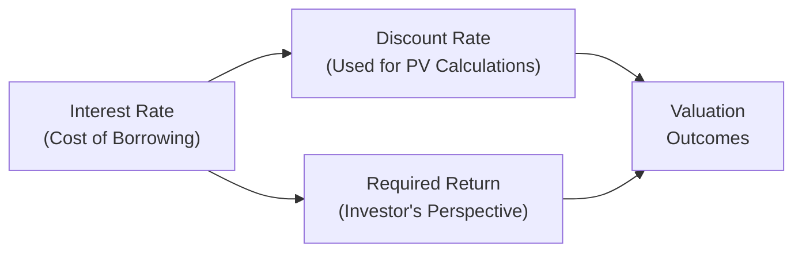

## Definition and Role of Interest Rates

Interest rates: you’ve probably heard about them on the news or maybe while chatting with friends about mortgage or credit card debt. But in the realm of finance, interest rates do a bit more than just tell you how much extra money you have to pay the bank. They’re about as central as it gets when it comes to valuing assets, making investment decisions, and understanding required returns.

In essence, an interest rate is the price of money. If someone borrows money from you over a period of time, the interest rate is the reward you earn for lending that money. If you’re the borrower, the interest rate is your cost to receive that money now rather than later. Surprisingly simple, right?

Interest rates also serve as the “shape-shifting” measure of risk and reward in financial markets. We often see them as:

• Required rates of return on an investment (that is, the minimum you want to earn to justify the risk you’re taking).  
• Discount rates used to convert future payments into present values.  
• Opportunity costs, because they show what you forgo when you choose one investment over another.

## Opportunity Cost Interpretation

Maybe you’ve heard the phrase: "Time is money." Well, in finance, we’d say: "Opportunity cost is money, too." Opportunity cost basically means the best alternative available to you. Let’s say you have two potential investments—one offers a 5% return and the other 6%. If you pass on the 6%-return investment to jump into the 5% one, your opportunity cost is that 1% difference.

That’s why interest rates are often said to capture opportunity costs: an investor considering a new investment wants to earn at least what they could earn somewhere else with similar risk. It’s like ordering a coffee at the café—if you’re paying four dollars, you expect a drink that’s at least as satisfying as some alternative beverage you could get for about the same price.

In a bond world, for instance, if government Treasury bonds pay 3% risk-free, a riskier corporate bond might have to pay 5% or 6% to lure investors away from that safer 3% option. This difference in yield, or “spread,” serves as compensation for taking on additional risk. The risk-free rate can be seen as the baseline, capturing the opportunity cost of investing in something that is (in theory) free from default risk.

## Margin and Spread Considerations

If you’ve ever looked at an advertisement for a loan, you might have seen something like “Prime Rate + 2%” or “LIBOR + 300bp.” This extra percentage on top of some reference rate (often called a benchmark rate) is the spread or margin. It reflects the unique risk features of the borrower. For bonds, it typically shows up as “yield spread,” which compensates for:

• Credit Risk – the likelihood that the borrower (or bond issuer) might not repay you in full or on time.  
• Liquidity Risk – the ease (or difficulty) of selling your investment at a fair price before maturity.  

The higher the risk, the bigger the spread demanded by investors. For example, a highly rated corporate bond might only be “2% above Treasury yields,” while a lower-rated junk bond might require “6% above Treasury yields.”

This dynamic ensures that interest rates (plus relevant spreads) reflect the required return. If a new bond issue doesn’t offer enough spread to make it worthwhile, investors just skip it and buy some other security that yields more—simple as that.

## Relationship to Discount Rates

You’ve probably come across discounted cash flow (DCF) analysis, or at least heard your colleagues talk about “applying a discount rate” to project an investment’s net present value. The discount rate, in many ways, is the interest rate you judge appropriate given the investment’s risk. If you’re dealing with something riskier—maybe a startup or an emerging-market bond—you typically apply a higher discount rate. That higher discount rate reduces the present value of all those future uncertain cash flows.

Mathematically, if \\( \displaystyle C_t \\) is a future cash flow at time \\( t \\) and \\( r \\) is the discount rate (a type of interest rate relevant to the investment’s risk), the present value (PV) is:


\displaystyle
PV = \frac{C_t}{(1 + r)^t}.


When \\( r \\) goes up, the denominator gets bigger and \\( PV \\) goes down, reflecting a higher required return for that investment. The key point: choosing the right discount rate is essential. Too low, and you might pay way too much for an investment. Too high, and you might pass on something that’s actually a solid deal.

## Required Return for Equity vs. Debt

If you bustle around Wall Street or any major financial center, you’ll find that the required return for equity is generally higher than for debt. Why? Equity holders typically take on more risk. If a company goes south, debt holders get paid off first in bankruptcy proceedings. Shareholders are closer to the “end of the line.” Because shareholders are taking on these extra uncertainties, they demand a higher return—this just makes sense from a risk-reward perspective.

That’s why, for instance, the average corporate bond might pay, let’s say, 5%, while the same corporation’s stock might be considered to have an expected return of 8% or 9%. This difference in returns directly reflects the difference in priority of claims and the uncertainty of the cash flows.

## Market Forces and Monetary Policy

Another time you might have heard about interest rates? Right—when the Federal Reserve or another central bank changes its policy rate. Central banks set short-term interest rates (policy rates) in an attempt to influence economic activity, inflation, and currency exchange rates. These moves, in turn, channel through the economy:

• If policy rates go up, borrowing becomes more expensive—investments that depended on cheap borrowing might get postponed. The cost of capital rises, meaning required returns for new projects also rise.  
• If policy rates fall, folks might be more eager to borrow and invest. Financial markets often rally, and discount rates used for valuations might decline.

This interplay between central bank actions and financial markets can be dramatic. In fact, large swings in interest rates—whether by policy shifts or market forces—can ripple through every asset class, from stocks to bonds to real estate.

## Inflation Expectations

Let’s not forget inflation. Inflation basically means that a dollar tomorrow might buy less than a dollar today. If you’re lending money, you want to be compensated not only for putting your money at risk but also for the “erosion of value” due to inflation. Hence, we typically talk about nominal interest rates (the stated rate that you see quoted on a loan or bond) and real interest rates (the “inflation-adjusted” rate).

In formula form:


\text{Nominal Rate} \approx \text{Real Rate} + \text{Inflation Expectation}.


If your nominal rate is 5% and inflation is running at 2%, your real return is about 3%. You can see why a surge in inflation expectations, without a corresponding rise in nominal rates, can leave lenders feeling shortchanged.

## Practical Application

Let’s be real: talking about interest rates in the abstract is useful, but what about applying it in everyday finance and investment decisions? Some examples:

• **Dividend Discount Model (DDM):** Suppose a stock is expected to pay dividends indefinitely. You can apply a required return \\( r \\) to discount those future dividends to the present. If the discount rate is too low, you might overvalue the stock; if it’s too high, you might undervalue it.  
• **Bond Pricing:** The bond’s coupon payments and principal redemption are discounted at a yield that matches the bond’s risk. This yield is effectively the combination of a risk-free rate plus a spread for credit risk, liquidity risk, etc.  
• **Project Valuation (Corporate Finance):** Firms use their weighted average cost of capital (WACC) to discount projected free cash flows. The equity portion of WACC often includes the capital asset pricing model (CAPM), which is just another way of saying: “We figure out the required return based on systematic risk.”

All these valuations critically hinge on the notion of interest rates acting as discount rates or target rates of return.

## Illustrative Example: Using Interest Rates in Valuation

Let’s do a quick example. Say you want to value a corporate bond with a \$1,000 face value, paying a 5% coupon annually, and it matures in 5 years. If similar-risk bonds in the market are offering 6% yields, you’d discount each payment at 6%. The coupon payment is \$50 (i.e., 5% of 1,000) each year. The present value would be:


\begin{aligned}
PV &= \frac{50}{1.06} + \frac{50}{(1.06)^2} + \frac{50}{(1.06)^3} + \frac{50}{(1.06)^4} \\
   &\quad + \frac{50 + 1000}{(1.06)^5}.
\end{aligned}


If interest rates (yields) in the market jump up to 7%, guess what? Your bond’s price goes down because you’re discounting those same \$50 coupon payments and \$1,000 final redemption at a higher rate. This is precisely why bond prices move inversely with interest rates.

## Additional Considerations: Best Practices and Pitfalls

• **Choosing the Appropriate Benchmark:** Do you use a short-term Treasury rate or a longer-term yield for discounting? Make sure the maturity of your benchmark rate aligns with your project’s or bond’s investment horizon.  
• **Accounting for Risk Properly:** Don’t underestimate credit risk. If you pick too low a spread, you may get burned if the company’s risk is higher than anticipated.  
• **Monitoring Monetary Policy and Macroeconomic Trends:** Interest rates can shift swiftly based on central bank announcements and changing inflation or growth forecasts. Always keep an eye on the bigger picture.  

## Quick Python Example for PV Calculations

Below is a simple Python snippet that shows how one might calculate the present value of a future sum given an interest rate:

```python
# given an annual discount rate r over T years.

def present_value(future_value, r, T):
    return future_value / ((1 + r)**T)

fv = 1000
discount_rate = 0.05
years = 3
pv = present_value(fv, discount_rate, years)
print(f"Present Value: {pv:.2f}")
```

If you run this code, you’ll get the present value of \$1,000 expected three years from now, discounted at 5%. This is a straightforward demonstration of how an interest rate influences valuation.

## Visualizing the Relationship

To help clarify how these concepts interact, let’s look at a simple flowchart:



• “Interest Rate (Cost of Borrowing)” drives both the discounted cash flow analysis and the expected return that investors demand (Required Return).  
• Both the discount rate and required return converge in how they affect the Present Value of those projected cash flows.

## Conclusion

Interest rates wear multiple hats in finance. They’re the cost of borrowing, the reward for lending, the discount rate for valuing future cash flows, and the reflection of opportunity cost. They also carry within them inflation expectations, credit risk, and liquidity considerations. In short, interest rates are a vital linchpin in both theoretical and applied finance.

When you see central banks announce rate changes, or your favorite tech company issue new bonds, you can bet the required returns, discount rates, and spreads are shifting accordingly. Knowing how to interpret these movements—and how to apply them to your valuation and investment decisions—can give you a serious edge in managing portfolios or analyzing potential projects.

## References

• Bodie, Z., Kane, A., & Marcus, A. (2017). Investments. McGraw-Hill Education.  
• Fabozzi, F. (2012). Bond Markets, Analysis, and Strategies. Pearson.  
• “Required Returns and Discount Rates,” Investopedia:  
  https://www.investopedia.com/terms/r/requiredrateofreturn.asp  

## Test Your Knowledge: Interest Rates and Required Returns



### Which of the following best describes the fundamental role of an interest rate in finance?

- [ ] It solely measures inflation changes.  
- [x] It represents the cost of borrowing and the reward for lending.  
- [ ] It is used only by central banks to set policy.  
- [ ] It is always lower than the inflation rate.  

> **Explanation:** An interest rate remains, at its core, the price of money—embodying both the cost of borrowing and the reward for lending.

### Which factor typically justifies the higher required return for an equity investment compared to a debt investment?

- [ ] The tax benefits associated with equity dividends.  
- [x] The greater risk borne by equity holders due to their residual claim.  
- [ ] The shorter maturity period of equity.  
- [ ] The direct control equity holders have over monetary policy.  

> **Explanation:** Equity holders carry a higher risk, especially in bankruptcy scenarios, since they’re lower in the capital structure priority than debt holders.

### How are inflation expectations typically reflected in nominal interest rates?

- [x] Nominal rates usually incorporate an inflation premium above the real rate.  
- [ ] Nominal rates and real rates always move in opposite directions.  
- [ ] Nominal rates are fully unaffected by inflation trends.  
- [ ] Nominal rates are discounted by deflationary factors.  

> **Explanation:** A nominal interest rate is essentially the sum of the real rate plus anticipated inflation.

### What happens to the present value of future cash flows when the chosen discount rate increases?

- [x] The present value decreases.  
- [ ] The present value remains unchanged.  
- [ ] The present value increases.  
- [ ] The present value first increases, then decreases.  

> **Explanation:** A higher discount rate increases the denominator used in discounting future cash flows, thus lowering their present value.

### Which statement best describes the role of a spread in bond yields?

- [x] It compensates investors for credit risk and liquidity risk above a benchmark rate.  
- [ ] It is a fixed percentage above the historical inflation rate.  
- [x] It builds in an adjustment for changes in currency values.  
- [ ] It reflects central banks’ short-term policy decisions.  

> **Explanation:** Spreads exceed a risk-free or benchmark rate to compensate for credit risk, liquidity concerns, and other issuer-specific factors.

### In applying a discounted cash flow (DCF) model, which of the following is most critical for determining the appropriate discount rate?

- [x] Accurately assessing the investment’s risk profile.  
- [ ] Using the ratio of current assets to current liabilities.  
- [ ] Matching last year’s interest rate used in a tax filing.  
- [ ] Selecting a discount rate lower than the market average.  

> **Explanation:** The discount rate should reflect the level of risk in the investment. Riskier cash flows need higher discount rates.

### Which of the following best characterizes the relationship between market interest rates and bond prices?

- [x] Bond prices move inversely to market interest rates.  
- [ ] Bond prices move in perfect unison with market interest rates.  
- [x] Bond prices are unaffected by short-term rate changes.  
- [ ] Bond prices do not respond to changes in required yields.  

> **Explanation:** When interest rates rise, bond prices drop; when rates decrease, bond prices increase.

### Which role do central banks play with respect to interest rates?

- [ ] They control only corporate bond yields but not Treasury yields.  
- [ ] They cannot influence market interest rates at all.  
- [x] They set policy rates that influence overall borrowing costs and liquidity conditions.  
- [ ] They only affect mortgage rates in real estate markets.  

> **Explanation:** Central banks set key policy rates—like the federal funds rate or discount rate—which, in turn, shape borrowing costs and broad liquidity in the economy.

### If an investor chooses an investment yielding 4% when a similar-risk investment yields 5%, how should we interpret this decision in terms of opportunity cost?

- [ ] The investor has no opportunity cost if the investment is profitable.  
- [ ] The opportunity cost is zero if inflation remains below 4%.  
- [ ] Opportunity cost does not apply to fixed income investments.  
- [x] The investor’s opportunity cost is 1%, representing the foregone 5% yield.  

> **Explanation:** The foregone return (1%) from the higher-yielding, similarly risky investment is the opportunity cost.

### True or False: Inflation expectations have no impact on the nominal interest rate.

- [x] False  
- [ ] True  

> **Explanation:** Inflation expectations are typically embedded in nominal rates. The higher the expected inflation, the higher the nominal rate demanded by lenders to preserve real returns.


