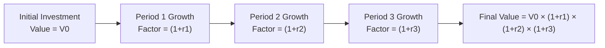

## Introduction

Measuring returns over time can feel like traveling across different landscapes if you’re not prepared. There are a few distinct ways to do it—ranging from simple “snapshot” measures to continuously compounded returns—and each has its own advantages and quirks. If you’ve ever caught yourself saying, “Um, I bought this stock in January, I got some dividends in March, then I sold it in July—so, what’s my return?” don’t worry, you’re not alone. This section explores methods for measuring returns, highlights key differences, and illuminates how these measurements fit into the broader dialogue of performance assessment, risk analysis, and comparisons to benchmarks.

## Holding Period Return (HPR)

Sometimes I think about my very first investment: a small biotech stock that skyrocketed after a promising drug trial (lucky me, right?). When I sold, I wanted to know my total profit relative to what I put in. That’s essentially the Holding Period Return (HPR). Formally, HPR captures the total return of an asset or portfolio over the period it’s held—whether that’s a week, a month, or 10 years.

In formula form, if you start with an asset price of P₀, end with a price of P₁, and receive any distribution D₁ (like a dividend or coupon), the HPR is:

$$
\text{HPR} = \frac{P_{1} - P_{0} + D_{1}}{P_{0}}.
$$

You can interpret HPR as a fraction or a percentage. If HPR is, say, 0.15 (or 15%), that means you earned 15% on your initial outlay—pretty straightforward. One big advantage of HPR is that it incorporates both price appreciation and any income you earn from holding the asset.

### Example: A Dividend-Paying Stock

Imagine you purchase a stock at $100, and over the next year, it rises to $105. You also receive a $2 cash dividend during that holding period. Then,

• Price increase: $105 − $100 = $5  
• Dividend: $2  
• HPR = ($5 + $2) / $100 = $7 / $100 = 0.07 = 7%.

So, your holding period return is 7%. (Pretty decent, but maybe not as wild as the biotech experience I had.)

## Discrete vs. Continuous Returns

Now, let’s talk about discrete vs. continuous returns. No, this isn’t a seminar on quantum physics and continuous space (though that might be intriguing, too). It has everything to do with how you measure growth.

• Discrete returns are the standard “percentage change” we typically see.  
• Continuous returns are based on the natural logarithm of price ratios.

### Discrete Returns

Also sometimes called simple returns, these are formulated by:

$$
r_{discrete} = \frac{P_{1} - P_{0}}{P_{0}}.
$$

If you tack on any cash flows like dividends, you include them in the numerator. Discrete returns are extremely common in financial reporting and straightforward to interpret.

### Continuously Compounded Returns

For more advanced modeling (often in fixed-income analytics or risk management), you might see continuously compounded returns. Here’s how they’re computed:

$$
r_{continuous} = \ln\left(\frac{P_{1}}{P_{0}}\right).
$$

The natural log-based approach is handy because it implies the return is being compounded infinitely many times in that interval. If that sounds too theoretical: well, it can be, but it also simplifies certain calculations in quantitative finance, especially when summing returns over consecutive periods. In practical settings, continuously compounded returns often come into play for derivative pricing or other advanced analytics. That said, if you’re a typical equity investor who logs into an account once in a while, discrete returns usually suffice.

## Arithmetic Mean Return

Sometimes, we have multiple periods’ worth of returns, like monthly returns for a year—r₁, r₂, …, rₙ—and we want a single number to describe “the average return.” The arithmetic mean return is:

$$
\bar{r} = \frac{r_{1} + r_{2} + \cdots + r_{n}}{n}.
$$

If returns in each period are independent and identically distributed, the arithmetic mean can be a good estimate of the expected return for a single period. The arithmetic mean return is especially helpful in certain risk and statistical models where summing returns (rather than compounding them) is the typical assumption.

### Caution: Overestimating Over Multiple Periods

One big caution I learned the hard way: the arithmetic mean might overestimate your actual multi-period growth. Why? Because it doesn’t factor in compounding across periods.

• If you want the expected growth of wealth over a series of periods, the arithmetic mean won’t fully capture the compounding effect.  

Imagine you have monthly returns of 10%, then −10%, then 10%, and so on. The arithmetic mean might suggest a decent overall rate, but your portfolio’s actual value might be disappointingly lower due to the negative periods dragging down returns.

## Geometric Mean Return

Enter the geometric mean return, which does incorporate the compounding effect. This is sometimes called the “compound average growth rate” (CAGR). We define it as:

$$
\bar{r}_{g} = \left(\prod_{i=1}^n (1 + r_i)\right)^{\frac{1}{n}} - 1.
$$

This formula takes the product of all the (1 + rᵢ) terms, raises it to the power of 1/n, and then subtracts 1 at the end. If that looks fancier than the arithmetic mean, it is—but it’s also often more representative of what happens to a real portfolio because returns multiply over time.

### Example: Growth Over Three Years

Let’s say:  
• Year 1 Return: 20% (r₁ = 0.20)  
• Year 2 Return: −10% (r₂ = −0.10)  
• Year 3 Return: 15% (r₃ = 0.15)

The arithmetic mean is (0.20 − 0.10 + 0.15) / 3 = 0.083̅ = 8.33%. But the geometric mean return is:

(1 + 0.20)(1 − 0.10)(1 + 0.15) = 1.20 × 0.90 × 1.15 ≈ 1.242.

Then,

1.242^(1/3) ≈ 1.074, or 7.4% after subtracting 1. That’s lower than 8.33%, but it actually shows the true growth rate of your investment after compounding the sequence of gains and losses.

## Linked Returns

Linked returns are a practical way to measure performance over multiple subperiods by “chaining” these subperiods together. If you have discrete returns for each period, you can chain them. For example, if the return in period 1 is r₁, and in period 2 is r₂, you can find the total linked (or chain-linked) return over both periods by:

$$
(1 + r_{1})(1 + r_{2}) - 1.
$$

This is effectively the same calculation the geometric mean relies on—except you don’t necessarily average it across periods. The chain-linking method is standard in many performance reports, especially when evaluating portfolio managers. It’s also used to handle mid-period cash flows or to roll up monthly returns into quarterly or annual returns.

### Mermaid Diagram: Chain-Linking Concept

Below is a simplified flowchart showing the chain-linking approach over three sequential returns. Notice how each period’s return multiplies with the next:

## Time-Consistency

There’s a subtle issue related to time-consistency, especially with certain return calculation methods. Arithmetic means, for instance, may not remain consistent over multiple intervals if there is volatility in returns. This is one reason investors and compliance standards often prefer a geometric linking approach. 

Similarly, some returns assume that all intermediate cash flows are reinvested at the same rate—a relevant detail in money-weighted returns or certain performance-attribution frameworks. So be aware of how timing of cash flows can skew your interpretation of the results.

## Comparability and Benchmarking

In practice, measuring returns is as much about comparing them as it is about computing them. Suppose your portfolio consistently churns out 10% a year—amazing, right? Well, not if the market benchmark is 12%. If you pick up an investment magazine or a mutual fund factsheet, you’ll likely see how they line up performance next to a relevant benchmark—like an index or a peer group. 

• Using the same methodology across all comparisons is crucial.  
• The best managers often highlight geometric (chain-linked) returns to match the investment experience of their clients.  

Whether you’re managing your own portfolio or you’re a consultant to institutional investors, consistent measurement methods ensure “apples-to-apples” comparisons.

## Use in Risk Assessment

Returns are half the saga. The other half is risk! Any conversation about performance can be misleading if we only focus on returns without acknowledging the volatility or downside the investor endures along the way.

• For a fuller risk assessment, pair returns (arithmetic or geometric) with standard deviation, Value at Risk (VaR), or downside risk measures.  
• Geometric mean returns especially shine when used in synergy with volatility measures, because high volatility dampens compound growth over time.

If your portfolio swings wildly from +30% to −25% and back to +40%, you might harbor a risk profile that goes well beyond what a typical portfolio can handle—even if the arithmetic average sounds high. Ask yourself, “Am I comfortable in the roller coaster seat?”

## Glossary

• **Holding Period Return (HPR):** Total return from owning an asset over its holding period, including price appreciation and any distributions.  
• **Arithmetic Mean Return:** The simple average of returns across multiple periods, useful for capturing expected single-period performance.  
• **Geometric Mean Return:** The compound average growth rate that accounts for the effect of sequential returns.  
• **Discrete Return:** A percentage gain or loss measured between two points in time (beginning and ending prices).  
• **Continuously Compounded Return:** A return measure using the natural log of price changes; important for certain analytical models.  
• **Chain-Linking Method:** A way of compounding periodic returns by multiplying growth factors over consecutive intervals.  
• **Benchmark:** A reference point (e.g., index) for measuring relative performance.  
• **Compounding Effect:** Generating returns on prior returns, leading to exponential growth in value (or losses).

## Best Practices & Common Pitfalls

• **Best Practice:** Match your return metric to your measurement goal. If you’re analyzing short-term performance or working with sums of returns, arithmetic mean may suffice. To capture real, compound growth over time, go geometric.  
• **Common Pitfall:** Using arithmetic mean returns to forecast multi-period results. You could overstate how your portfolio might grow.  
• **Pitfall Avoidance:** Evaluate your portfolio with both arithmetic and geometric returns. That way, you fully appreciate both short- and long-term dynamics.  

## Final Exam Tips

• Expect exam questions linking “representative average returns” to either arithmetic or geometric means. Know which scenario each measure is best suited for.  
• Be able to quickly do chain-linking calculations for multiple subperiods. “Attach” each subperiod’s growth factor (1 + r) to the next.  
• Watch for any mention of time-consistency or scheduling of cash flows (especially if the question references partial-year trades).  
• If an item set or prompt references “annual equivalents of monthly returns,” you’ll likely see chain-linking or geometric mean in the answer.  
• In essay (constructed-response) style, be prepared to justify why geometric returns are more appropriate over multiple periods.  

## References

• Maginn, J., Tuttle, D., Pinto, J., & McLeavey, D. (2007). Managing Investment Portfolios. CFA Institute.  
• Kritzman, M. (2014). Portfolio Analytics: Tools and Techniques for the Institutional Investor. Wiley.  
• “Measuring Portfolio Returns,” Fidelity Investments:  
  https://www.fidelity.com/learning-center/trading-investing/performance-measurement/measuring-portfolio-performance  

--------------------------------------------------------------------------------

## Test Your Knowledge: Measuring Returns over Time



### Which of the following best describes a holding period return (HPR)?

- [ ] The expected return over the next period based on historical averages.  
- [x] The total return on an asset during the time it is held, including price changes and any distributions.  
- [ ] The average annual return that accounts for compounding over multiple periods.  
- [ ] The difference between the asset's price and a stated benchmark.  

> **Explanation:** HPR specifically captures the total return (income plus capital appreciation) over a single holding period.

### An investor’s stock is purchased for $80 and sold 6 months later for $85, with a $2 dividend received. Which of the following is the discrete return?

- [x] (85 − 80 + 2) / 80  
- [ ] ln(85 / 80)  
- [ ] 2 / 85  
- [ ] 1 − (80 / 85)  

> **Explanation:** The discrete return is (Ending Price − Beginning Price + Dividends) / Beginning Price.

### Which return measure is typically used when summing returns across independent periods?

- [x] Arithmetic mean return  
- [ ] Geometric mean return  
- [ ] Time-weighted return  
- [ ] Money-weighted return  

> **Explanation:** Arithmetic mean returns are preferred when dealing with independent returns over short periods because they sum directly.

### When would you most likely prefer using a geometric mean return over an arithmetic mean return?

- [x] To measure the compound growth rate of an investment over multiple periods  
- [ ] When short-term fluctuations can be safely ignored  
- [ ] To measure the expected single-period return with no compounding  
- [ ] Whenever returns are consistently negative  

> **Explanation:** Geometric mean returns incorporate compounding and reflect the true multi-period growth rate.

### For a portfolio with monthly returns r₁ = 2%, r₂ = −1%, r₃ = 3%, which best describes the chain-linked return over all three months?

- [x] (1 + r₁)(1 + r₂)(1 + r₃) − 1  
- [ ] (r₁ + r₂ + r₃) / 3  
- [ ] (r₁ − r₂ + r₃)  
- [ ] None of the above  

> **Explanation:** Chain-linking multiplies (1 + each periodic return) and then subtracts 1 to get the overall growth factor.

### Continuously compounded returns are computed using:

- [x] ln(Ending Price / Beginning Price)  
- [ ] (Ending Price / Beginning Price) − 1  
- [ ] The average of discrete returns  
- [ ] (1 + r)ⁿ − 1  

> **Explanation:** By definition, continuous returns use the natural log of the price ratio.

### Which statement about time-consistency of returns is most accurate?

- [x] Some return measures (e.g., arithmetic mean) do not account for compounding between periods.  
- [ ] The chain-linked return is always less than the arithmetic mean return.  
- [x] Continuously compounded returns cannot be time-consistent.  
- [ ] Time-consistency depends solely on the benchmark chosen.  

> **Explanation:** Because arithmetic mean doesn’t incorporate compounding, its application over multiple periods can lead to inconsistencies.

### In performance measurement and benchmarking, consistent return measurement is crucial primarily because:

- [x] It ensures reliable comparisons across different portfolios or managers.  
- [ ] It prevents all forms of short-term market fluctuations.  
- [ ] Regulatory standards require discrete returns only.  
- [ ] It maximizes the absolute return for all investors.  

> **Explanation:** Aligning methodology across different funds and benchmarks is critical to fair performance comparisons.

### You observe that a portfolio’s 5-year geometric mean return is 8% per year, while its 5-year arithmetic mean return is 10% per year. Which statement is most plausible?

- [x] The portfolio experienced variability in returns, making the arithmetic mean higher than the geometric mean.  
- [ ] The portfolio must have had a negative annual return in each of the five years.  
- [ ] The two means should never deviate from each other under normal circumstances.  
- [ ] Both measures typically coincide if short-term fluctuations are large.  

> **Explanation:** Because of compounding, the geometric mean will generally be lower than the arithmetic mean if there is volatility in returns.

### A portfolio that has an annual arithmetic mean return higher than its geometric mean return suggests:

- [x] True  
- [ ] False  

> **Explanation:** When returns vary, the arithmetic mean is higher than the geometric mean due to the effect of negative compounding in volatile periods.


