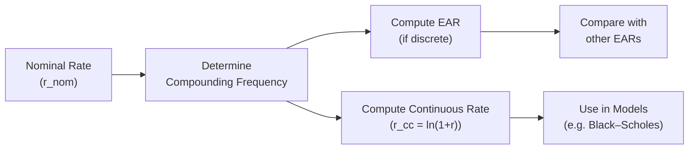

## Introduction

Sometimes, I still remember sitting in a café with a friend—who also happened to be studying finance—hearing them say, “Wait, so if I earn 2% in a month, that’s not really 24% over a year, is it?” That little moment sparked a friendly discussion on the subtleties of annualized returns and—yep—continuously compounded returns. In this section, we’ll walk through these ideas step by step, so you can see exactly how we move from a short-term return to an annual figure and why continuous compounding is commonly used in higher-level finance.  

Though these are standard concepts, you’d be surprised how often confusion arises. Especially when you throw around terms like effective annual rate (EAR) versus nominal rate, or when you see continuous compounding appear in derivative pricing models. It’s easy to get tangled up! Let’s unpack each concept carefully.

## Why Annualize Returns?

Investors typically like to compare performance on a common scale—annually. If you have a 3-month return on one investment and a 9-month return on another, comparing them directly can be misleading. Annualization is a way of standardizing the timeline. It answers: “What would the yearly return look like if the growth pattern in these shorter periods continued consistently over 12 months?”

• Consistency: It’s hard to compare monthly or quarterly returns without adjusting everything to the same horizon.  
• Decision-making: When evaluating a portfolio strategy or a new investment product, an annualized metric feels more intuitive.  
• Regulatory and performance reporting: Many compliance frameworks (including GIPS) often require annualized or standardized reporting of returns.

## Geometric Annualization Basics

If you earn a return r in a short period, you might be tempted to simply multiply by the ratio of “12 months / short period.” But that’s not quite right. Investors use geometric compounding. For example, if your monthly return is r_m, then the approximate annualized return, r_annual, under geometric compounding is:


  (1 + r_m)^{12} - 1.


If your monthly return was, say, 2%, your nominal approximation might have been 24% per year (2% × 12). However, geometric annualization properly accounts for returns compounding upon themselves:


  (1 + 0.02)^{12} - 1 \approx 0.2682 \text{ or } 26.82\%.


That’s obviously more than 24%.

## Effective Annual Rate (EAR)

The Effective Annual Rate (EAR) is the realized annual return taking into account the effect of compounding throughout the year. If you had a nominal or stated annual rate r_nom, but it compounds m times per year, then the EAR is:


  \text{EAR} = \left(1 + \frac{r_{\text{nom}}}{m}\right)^m - 1.


When m > 1, EAR > r_nom. The difference might look small for some moderate rates, but it can become quite significant at higher rates or with more frequent compounding. By using EAR, you capture the true effect of the reinvestment of gains, providing an apples-to-apples comparison across investments with different compounding frequencies.

### Why EAR Matters

• Helpful in evaluating credit card interest or short-term financing rates, where monthly or even daily compounding can cause higher effective costs.  
• Critical in comparing different banks’ savings accounts or money market products. One might advertise a nominal rate of 5% with quarterly compounding, while another might have 4.95% with monthly compounding. The second might actually yield a higher effective rate when you do the math.  
• In portfolio return calculations, you often see the annualization of monthly performance using the geometric approach, which leads to an EAR-based viewpoint.

## Nominal vs. Effective Rates

It’s often easy to confuse nominal rates with effective rates. “Nominal rate” usually refers to a rate that’s simply stated as an annual measure but doesn’t reflect the impact of compounding. Meanwhile, the effective rate fully incorporates the compounding effect.  

Nominal interest rates are more about quoting convention (“10% nominal, compounded quarterly”). Effective rates, on the other hand, tell you, “Here’s how much you actually end up with after compounding.”  

If you’ve ever had that frustrating moment looking at a bank statement—“Wait, I thought I’d earn more!”—you might have overlooked how the compounding was disclosed. (Don’t worry, we’ve all been there.)

## Continuous Compounding Basics

Okay, so compounding semi-annually, quarterly, monthly, daily… that’s all well and good. But what if we let the compounding periods shrink to infinitely small intervals? This concept is known as continuous compounding. And it uses the exponential function, e.

In many advanced areas of finance (like the Black–Scholes option pricing model, certain fixed-income analytics, or theoretical portfolio mathematics), continuous compounding is standard. Instead of compounding a discrete number of times per year, returns are compounded continuously.

For a continuously compounded rate \\( r_{cc} \\), the accumulation of 1 monetary unit over one year is:


  e^{r_{cc}}.


If you hear “our bond yield is 5% continuously compounded,” it means that your growth factor over one year is \\( e^{0.05} \approx 1.051271 \\). This is just a little bit higher than 1.05, which is what you’d get for 5% with annual compounding. The difference is small for moderate rates, but it can matter for more precise analytics.

### Mathematical Foundation

In calculus terms, continuous compounding arises from:


  \lim_{m \to \infty} \left(1 + \frac{r}{m}\right)^m = e^r.


As m grows, the compounding periods become finer and finer, eventually reaching the limiting process that yields the exponential function. Maybe this is bringing back memories of your calculus class—where you learned that “e” was approximately 2.71828. Indeed, that’s the exact concept.

## Converting Between Discrete and Continuous Rates

It’s pretty common to move back and forth between a simple “discrete” rate, r, and a continuously compounded rate, \\( r_{cc} \\). The formula that helps is:


  r_{cc} = \ln(1 + r).


When you see r expressed as a decimal—like r = 0.05 (5% as a discrete annual rate)—then


  r_{cc} = \ln(1.05) \approx 0.04879 \text{ (which is about }4.879\%\text{).}


Or if you know \\( r_{cc} \\) and want to find the equivalent discrete rate:


  r = e^{r_{cc}} - 1.


### Small Rate Approximation

For very small r (like 1%, or 2%), \\( \ln(1 + r) \approx r \\). So the difference between discrete compounding and continuous compounding is negligible in the short term. However, if we start looking at large rates or a multi-year horizon, that difference can become more meaningful.

## Comparison to Discrete Compounding Over Longer Terms

Let’s illustrate with a hypothetical 10% annual rate over 5 years. Compare three methods of compounding:

• Annual compounding: \\( 1 \times (1+0.10)^5 \approx 1.61. \\)  
• Quarterly compounding: \\( 1 \times \left(1 + \frac{0.10}{4}\right)^{20} \approx 1.63. \\)  
• Continuous compounding: \\( 1 \times e^{0.10 \times 5} = e^{0.5} \approx 1.65. \\)

So with continuous compounding, you end up with about 1.65. By the time we’re compounding daily or even weekly, we’d inch closer to that 1.65 figure. There’s a small but growing difference as we increase compounding frequency.

## Use Cases in Fixed Income and Derivatives

• Bond Pricing: Many fixed-income textbooks default to discrete compounding for corporate bonds or Treasuries, but continuous compounding can simplify certain analytics (like forward rate approximations or certain yield curve models).  
• Options (Black–Scholes Model): The original Black–Scholes formula uses continuously compounded rates for the risk-free rate and the underlying asset’s returns. It just makes the mathematics more tractable.  
• Commodities and Forex: In currency markets, forward points or forward prices can be derived using continuously compounded interest rates, especially when working with interest rate differentials in an exponential framework.  

When your employer’s modeling team says, “We use log-returns for everything in our risk system,” they usually mean continuously compounded returns—where log-return = ln(Price_end / Price_start). That measure is additive across time, making some statistical analyses simpler.

## Practical Examples and a Mermaid Diagram

Below is a small flow diagram illustrating how you might move from a nominal stated rate to either an effective or continuously compounded rate:

• From the nominal rate (A), you figure out how many times it’s being compounded per year (B).  
• If you’re staying in the discrete realm, you calculate your EAR (C) and then compare that with other investments (E).  
• If you want to switch to continuous compounding, you just do \\( r_{cc} = \ln(1 + r_{nom}) \\) (D), which is especially handy for derivatives modeling (F).

## Common Pitfalls

1. Mixing Up Rates: Quoting your boss a “7% continuously compounded” rate when you meant “7% annual with monthly compounding” can lead to big confusion. Always clarify the compounding assumption.  
2. Failing to Convert: Sometimes, a scenario analysis might have interest rates in nominal form but discount factors in log form. If you don’t convert them consistently, you’ll get incorrect valuations.  
3. Overlooking Impact at High Rates: The difference between discrete and continuous compounding is small for, say, 1% or 2%. But at 20% or 30%, the difference is quite substantial.  
4. Interpreting Log Returns Incorrectly: Log returns (continuous) add up directly over time, but simple returns don’t. If you treat a continuous rate as if it were a simple rate, you’ll miscalculate actual growth over multiple periods.

## Exam Tips and Professional Application

• Practice Derivation: Be comfortable with the formulas that link nominal, effective, and continuously compounded rates. In an exam, you might be asked to perform quick conversions.  
• Watch the Sign of the Log: A negative continuously compounded rate can be confusing at first glance (like ln(1 – 0.02)). Make sure you’re interpreting that carefully.  
• Time Management on Problems: If the exam question says “rates are expressed with continuous compounding,” that’s a strong hint you’ll need the exponential function or natural logs. Don’t overcomplicate it with discrete formulas.  
• Real-World Implementation: In practice, you’ll see discrete compounding more often in everyday banking and mortgage contexts, whereas continuous compounding pops up in derivatives and advanced portfolio modeling.  

In real portfolio management, you’ll have to jump between these higher-level analytics and more straightforward calculations (like monthly or quarterly returns turned into annual figures). Make sure you’re comfortable with both worlds.

## References and Further Reading

- Hull, J. (2014). Options, Futures, and Other Derivatives. Prentice Hall.  
- “Continuous Compounding Explained.” Investopedia:  
  https://www.investopedia.com/terms/c/continuouscompounding.asp  
- Copeland, T., Weston, F., & Shastri, K. (2005). Financial Theory and Corporate Policy. Pearson Education.  

## Test Your Knowledge: Annualized and Continuously Compounded Returns



### Which of the following best describes the Effective Annual Rate (EAR)?

- [ ] The rate agreed upon before interest is added.  
- [ ] The nominal rate stated by the bank.  
- [x] The interest rate that includes the effect of all compounding within the year.  
- [ ] The difference between nominal and real interest rates.  

> **Explanation:** EAR fully captures intrayear compounding, while nominal rates do not.

### A nominal annual rate of 6% with quarterly compounding implies which EAR?

- [ ] 6.00%  
- [ ] 6.09%  
- [ ] 7.00%  
- [x] 6.14%  

> **Explanation:** EAR = (1 + 0.06/4)^4 - 1 ≈ 0.0614 (6.14%).

### If a continuously compounded rate is 8%, what is the equivalent simple annual return?

- [ ] 8.00%  
- [x] e^0.08 - 1, which is about 8.33%  
- [ ] (1 + 0.08)^∞ - 1 = infinite  
- [ ] ln(1 + 0.08)  

> **Explanation:** Converting from continuously compounded to discrete: r = e^(0.08) - 1.

### You see a monthly rate quoted as 1%. What is the approximate annualized rate using geometric compounding?

- [ ] 12.00%  
- [ ] 12.68%  
- [x] (1 + 0.01)^12 - 1 = 12.68%  
- [ ] 11.88%  

> **Explanation:** The correct annualization uses geometric compounding: (1 + 0.01)^12 - 1.

### Which of the following statements is true about log returns?

- [x] They are additive over time.  
- [ ] They overstate the actual return relative to simple interest.  
- [x] They are also called continuously compounded returns.  
- [ ] They equal e^(1 + r).  

> **Explanation:** Log returns (continuously compounded returns) are time-additive, and also known as continuously compounded returns.

### During valuation, a bond uses a nominal 5% rate (annual) but is discounted with a continuous 5% rate. Which pitfall might occur?

- [x] Inconsistent discount rates will give inaccurate pricing.  
- [ ] Using continuous rates always gives a higher NPV.  
- [ ] No difference; the rates are the same.  
- [ ] The discount factor can never exceed 1.  

> **Explanation:** Mixing nominal annual rates and continuous discounting leads to an inconsistency that can skew valuations.

### A nominal annual rate of 10% with monthly compounding leads to an EAR of approximately what?

- [x] 10.47%  
- [ ] 10.00%  
- [x] (1 + 0.10/12)^12 - 1  
- [ ] e^0.10 - 1  

> **Explanation:** EAR = (1 + 0.10/12)^12 - 1 ≈ 0.1047 (10.47%).

### Which statement is most accurate regarding higher compounding frequencies?

- [x] As compounding frequency increases, the effective rate rises.  
- [ ] Greater compounding frequency pushes the EAR below the nominal rate.  
- [ ] Higher frequencies only matter for discount rates, not for accumulations.  
- [ ] Continuous compounding yields exactly the same result as annual compounding.  

> **Explanation:** With more frequent compounding, the effective rate climbs above the nominal rate.

### Suppose your discrete annual rate is 15%. What is the continuously compounded rate?

- [ ] 15.00%  
- [x] ln(1 + 0.15) = about 13.98%  
- [ ] e^(0.15) – 1 = about 16.18%  
- [ ] 0.15 / 12  

> **Explanation:** To convert from discrete to continuous, use r_cc = ln(1 + r).

### For a large 30% nominal annual rate, how does the difference between continuous and discrete compounding rates behave?

- [x] Larger differences appear compared to small rates.  
- [ ] The difference becomes negligible.  
- [ ] 30% nominal is roughly the same as 30% continuous.  
- [ ] They converge to zero.  

> **Explanation:** At higher rates, continuous compounding yields a noticeably higher effective return relative to discrete compounding, creating a larger gap.


