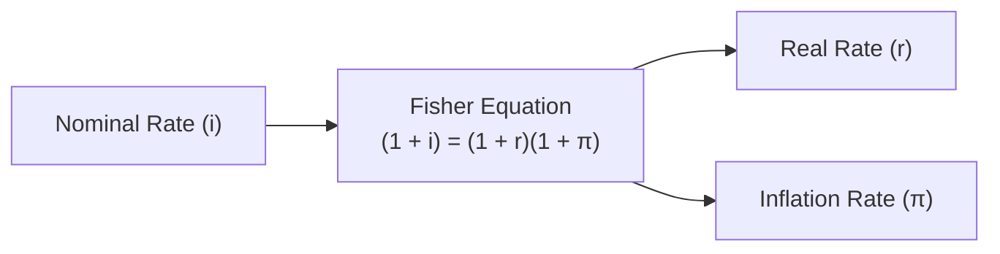

## Introduction
If someone had told me a few years ago that there’s a difference between the interest rate you see in the newspaper and the “real” return you actually enjoy, I would have raised an eyebrow. After all, an interest rate is just an interest rate, right? Well—sort of. In finance, we differentiate between nominal and real interest rates to determine how much of our return is simply accounting for inflation (i.e., rising prices of goods and services) and how much of the return is truly boosting our purchasing power. Understanding this distinction is crucial because it helps you see if your money is effectively growing faster than the prices of the things you need and want to buy.

You’ll notice we keep referencing “purchasing power.” In an inflationary environment, the same amount of money buys fewer goods and services over time. And that’s why comparing nominal rates—those you commonly see quoted for bank accounts, bonds, and loans—to inflation helps us figure out whether we’re gaining or losing ground. This section dives deep into nominal vs. real interest rates, walks you through the relevant equations and theoretical insights, and ends with some hands-on examples and exam tips. Let’s get to it.

## Nominal Interest Rates
A nominal interest rate, often labeled as i, is the stated rate on any debt instrument (like a bond or loan) or the quoted rate on bank deposits and other financial products. It’s the “headline” number you see in the market. For instance, if you see a 5% annual interest rate on a savings account, that 5% is the nominal interest rate.

Although nominal rates are convenient for quick reference, they do not tell the whole story. They combine the “real” return of your money plus compensation for expected or actual inflation. Put differently, nominal rates are typically structured as:

• Real component (what you truly earn in purchasing power)
• Plus some premium for expected inflation
• Possibly other risk premiums (as discussed in Section 1.2, regarding real risk-free rates and risk premiums)

In practice, it’s straightforward to see a nominal rate on a certificate of deposit or the yield on a bond. But if you want to know how well off you actually are, you’ll need to convert it to a real rate.

## Real Interest Rates
The real interest rate, often labeled as r, is the part of the nominal rate that goes beyond inflation. It measures the change in your effective purchasing power after adjusting for rising prices (or, in rare cases, falling prices, which is deflation). If your nominal return is 5% but inflation is 3%, your real return is definitely not 5%. And if inflation is 6%, well, your 5% nominal return will lead to a negative real rate. In other words, you’d actually be losing purchasing power.

The idea behind the real interest rate is: “Okay, but after accounting for the fact that goods and services cost more tomorrow than they do today, how much am I actually profiting?” This question is fundamental for investors who aim to preserve or grow their wealth over time. 

## The Fisher Equation
When economists and finance professionals talk about connecting nominal and real interest rates, they use the Fisher equation. Formally, the Fisher equation is expressed as:


(1 + i) = (1 + r)(1 + \pi)


Where:
- \\( i \\) = nominal interest rate
- \\( r \\) = real interest rate
- \\( \pi \\) = inflation rate (often associated with the expected inflation rate, but it can also apply to realized inflation)

This formula states that your total nominal growth in money—\\((1 + i)\\)—equals the product of your real growth factor \\((1 + r)\\) and the growth factor due to inflation \\((1 + \pi)\\). Rearranging the original expression gives:


1 + i = (1 + r)(1 + \pi) = 1 + r + \pi + r\pi


So if you want to solve for \\( r \\), you could do something like:


r = \frac{(1 + i)}{(1 + \pi)} - 1


In plain English, this means: if you earn \\( i \\) in nominal terms while prices go up by \\( \pi \\), your purchasing power changes by \\((1 + i)/(1 + \pi)\\) minus 1.

## The Approximation
Now, you might have heard about (or used) the approximate version:


i \approx r + \pi


This simplified formula works well when both \\( r \\) and \\( \pi \\) are relatively small. In day-to-day use, many analysts will say something like, “Real rate = nominal minus inflation.” They’re doing a back-of-the-envelope approximation of the Fisher equation. Technically, the exact formula must include the product \\( r \times \pi \\), but if your real rate and inflation rate are modest (like 0.02 and 0.03), that product is small (0.0006). So, the difference between \\( i - \pi \\) and \\( r \\) ends up negligible in many cases.

Here’s a quick numeric example: If the nominal rate is 5% and expected inflation is 3%, the approximate real rate is 2%. The exact real rate using the full Fisher equation is:


\frac{1 + 0.05}{1 + 0.03} - 1 = \frac{1.05}{1.03} - 1 \approx 0.0194 \text{ or } 1.94\%


The difference—2.00% vs. 1.94%—is small enough that professionals typically don’t worry, especially for broad investment planning. However, for large sums or high rates, the distinction might matter more.

## Visualizing the Relationship



In this diagram:
• A["Nominal Rate (i)"] flows into B["Fisher Equation"],  
• which ultimately splits into C["Real Rate (r)"] and D["Inflation Rate (π)"].

## Inflation-Indexed Bonds (TIPS)
Inflation-Indexed Bonds—like Treasury Inflation-Protected Securities (TIPS) in the U.S.—offer a direct way for investors to target a guaranteed real interest rate. TIPS adjust the principal or coupon payments by the inflation rate. This means if inflation is higher than expected, the bond’s principal amount is scaled up, ensuring that investors receive both the principal and interest that reflect changes in price levels.

For instance, let’s say you purchase a 5-year TIPS with a coupon rate that’s intended to be 2% above inflation. If consumer prices rise 3%, your principal is automatically increased by something close to that 3%. The 2% coupon (real rate) is then paid on the new principal amount. This feature makes TIPS a handy “inflation hedge.”

When comparing TIPS yields to nominal Treasury yields, we can gauge the market’s expected inflation. The difference between nominal Treasury yield and TIPS yield is often cited as the “breakeven inflation rate.” If inflation ends up being higher than that breakeven level, TIPS outperform nominal Treasuries. If inflation winds up lower, TIPS underperform.

## Negative Real Rates
Sometimes, nominal rates can hover so low that after inflation, the real rate is negative. Imagine a scenario: You have a bank deposit paying 1.5% nominal interest, but inflation turns out to be 2%. The real interest rate is about -0.5%. You might still be “earning” interest in nominal dollars, but you’re actually losing purchasing power. Over time, your money might not keep pace with the rising costs of living.

Why would such a scenario exist? Central banks, in an attempt to stimulate the economy, might drive nominal interest rates lower (occasionally even below zero in certain jurisdictions). The idea is to encourage borrowing and spending rather than saving. But from a personal finance perspective, negative real rates can frustrate savers looking to protect or grow the real value of their capital.

## Central Bank Targets
Central banks primarily use nominal interest rates as a policy lever. In the United States, for instance, the Federal Reserve adjusts the federal funds rate target to steer economic activity. The assumption (based on the Fisher effect) is that if the nominal rate changes, it influences the real rate as well, at least in the short term. High real rates dampen investment and consumption, while negative or very low real rates can encourage borrowing and stimulate the broader economy.

However, one challenge is that inflation expectations (the “\\(\pi\\)” of the equation) may not be fully under a central bank’s direct control. If the market believes that a central bank’s policies go too far, or not far enough, inflation expectations could diverge from what the central bank intended. Nonetheless, if a central bank is credible and effectively communicates a target inflation rate (say 2%), then raising or lowering nominal rates can lead to predictable adjustments in real rates.

## Influence on Investment Decisions
When making capital allocation or portfolio decisions, you generally care about real returns. This is because you want to maintain or increase your ability to buy goods and services in the future. A nominal return can look attractive, say 10%, but if inflation is 9%, you’re gaining only about 1% in real purchasing power. On the other hand, a 4% nominal return in an environment of 1% inflation yields a 3% real return, which is more substantial from a purchasing-power standpoint.

Real rates, therefore, are often used to compare the attractiveness of different assets—particularly those viewed as “inflation hedges.” If you think inflation will be higher than the market expects, an asset offering inflation protection could be an appealing choice. Alternatively, if you forecast inflation to remain modest, you might be satisfied with nominal rate investments that pay a decent spread over likely inflation.

## Practical Examples and Python Snippet
Let’s see a few quick examples. Suppose you have:

• A nominal interest rate (i) = 6%  
• Inflation rate (\\(\pi\\)) = 2.5%

Using the approximation:
• Real rate \\(r \approx 6\% - 2.5\% = 3.5\%\\)

Using the exact Fisher equation:


r = \frac{1.06}{1.025} - 1 \approx 0.0341 \text{ or } 3.41\%


That’s close enough to 3.5% for most analyses, and the small difference of 0.09% might not be essential in many day-to-day decisions.

For those who enjoy tinkering, here’s a straightforward Python snippet that you could use to compare the approximate real rate to the exact one:

```python
def approximate_real_rate(nominal_rate, inflation_rate):
    return nominal_rate - inflation_rate

def exact_real_rate(nominal_rate, inflation_rate):
    return (1 + nominal_rate)/(1 + inflation_rate) - 1

nom = 0.06
infl = 0.025

approx_r = approximate_real_rate(nom, infl)
exact_r = exact_real_rate(nom, infl)

print(f"Approximate Real Rate: {approx_r:.4f} or {approx_r*100:.2f}%")
print(f"Exact Real Rate: {exact_r:.4f} or {exact_r*100:.2f}%")
```

If you run this, you’ll see something like:
• Approximate Real Rate: 0.0350 (3.50%)  
• Exact Real Rate: 0.0341 (3.41%)

## Best Practices and Common Pitfalls
• Never ignore inflation: Quoting only nominal returns can be misleading. Always evaluate where inflation stands or where it might be heading.  
• Use the exact Fisher equation for large exposures: For high inflation or large interest rates, the difference between \\(r \approx i - \pi\\) and the exact formula can become significant.  
• Watch out for unexpected inflation: Even if you do everything by the book, a surprise in inflation can severely erode your real return.  
• Consider inflation-linked instruments: If you want to secure a real rate of return, TIPS, or other inflation-indexed bonds, might be your friend.  
• Don’t forget taxes: In many jurisdictions, taxes are levied on nominal returns, not real returns, which can further reduce your after-tax real return.  

## CFA Exam Relevance
Within the CFA Program, especially at Level I, understanding the difference between nominal and real interest rates is absolutely essential. You’ll see nominal rates throughout bond pricing, time value of money problems, and capital budgeting. Meanwhile, the concept of real rates appears in discussions about growth, inflation, and discount rate selection. The Fisher equation underscores how macroeconomic conditions (i.e., inflation) intertwine with individual asset valuations and returns. 

Remember, if an exam question asks for a “real rate of return,” it’s wise to pay attention to whether it expects you to do an approximate calculation (i.e., nominal minus inflation) or a precise calculation using the full Fisher equation. Also, watch for whether the question references ex ante (expected) or ex post (realized) inflation.

## Final Exam Tips
• Be sure you can rearrange the Fisher equation to isolate any of the three variables (\\(i\\), \\(r\\), or \\(\pi\\)).  
• Memorize the approximate form, \\(i \approx r + \pi\\), but be prepared to do the exact formula for large or extremely accurate calculations.  
• If the CFA exam question specifically mentions “expected inflation,” incorporate that directly into your nominal vs. real rate calculations.  
• TIPS (or inflation-indexed bonds) might appear in item sets that discuss risk-free returns and the role of inflation.  
• Keep an eye out for “negative real rate” scenarios. They frequently show up in central bank policy discussions or questions about economic stimulus.  

## References and Further Reading
- Mishkin, F. (2018). The Economics of Money, Banking, and Financial Markets. Pearson.  
- “Real Interest Rate vs. Nominal Interest Rate.” The Balance:  
  https://www.thebalancemoney.com/nominal-real-interest-rates-4174045  
- “TIPS: What Are Treasury Inflation-Protected Securities?” U.S. Treasury:  
  https://www.treasurydirect.gov/indiv/products/prod_tips_glance.htm  

---

## Practice Questions: Nominal vs. Real Interest Rates Quiz



### Which of the following statements best describes a nominal interest rate?

- [ ] It is the interest rate adjusted for inflation.  
- [x] It is the stated interest rate without adjusting for inflation.  
- [ ] It is always higher than the real interest rate.  
- [ ] It excludes all risk premiums.  

> **Explanation:** A nominal interest rate does not adjust for inflation or changes in purchasing power.  

### Under the Fisher equation, which of the following is correct?

- [x] (1 + i) = (1 + r)(1 + π)  
- [ ] (1 + r) = (1 + i)(1 + π)  
- [ ] (1 + i) = (1 + r + π)  
- [ ] (i - π) = r / (1 + i)  

> **Explanation:** The Fisher equation states (1 + i) = (1 + r)(1 + π).  

### Suppose the nominal interest rate is 4% and the inflation rate is 2%. Using the approximate formula, what is the real rate?

- [ ] 2.00%  
- [x] 2.00% (approximately)  
- [ ] 6.00%  
- [ ] 0.50%  

> **Explanation:** The approximate real rate is i - π = 4% - 2% = 2%.  

### If an investor’s nominal return is 7% and the inflation rate turns out to be 8%, which of the following is true?

- [x] The real interest rate is negative.  
- [ ] The investor’s real return is exactly 8%.  
- [ ] The nominal rate equals the real rate.  
- [ ] It’s impossible to have negative real interest rates.  

> **Explanation:** When inflation (8%) exceeds the nominal rate (7%), the real interest rate is negative.  

### The difference between a nominal Treasury bond yield and a TIPS yield is generally referred to as:

- [ ] The real risk-free rate.  
- [x] The breakeven inflation rate.  
- [ ] The spread due to default risk.  
- [ ] The term premium.  

> **Explanation:** The nominal–TIPS yield spread is typically viewed as the market’s expectation for inflation, often called the “breakeven inflation rate.”  

### Which of the following is a valid rearrangement of the Fisher equation to solve for the real rate (r)?

- [x] r = ((1 + i)/(1 + π)) - 1  
- [ ] r = i - π  
- [ ] r = π - i  
- [ ] r = (i − π) / (1 + π)  

> **Explanation:** The proper rearrangement to solve for r exactly is r = ((1 + i)/(1 + π)) − 1.  

### When does the approximate equation i ≈ r + π break down?

- [ ] When both inflation and the real rate are very low.  
- [ ] When both inflation and the real rate are exactly zero.  
- [x] When inflation or the real rate is large, making r × π significant.  
- [ ] It never breaks down; it is always exact.  

> **Explanation:** The approximation assumes r × π is relatively small. Large values of either r or π make the product noticeable and reduce the accuracy of the approximation.  

### Why might a central bank attempt to push nominal rates below inflation?

- [ ] To encourage deflation.  
- [ ] To lower inflation expectations.  
- [x] To stimulate borrowing, spending, and economic growth.  
- [ ] To ensure investors have high real returns.  

> **Explanation:** Central banks sometimes use negative real rates as stimulus by encouraging spending over saving.  

### Which best describes a benefit of TIPS for investors?

- [x] They maintain purchasing power by adjusting principal for inflation.  
- [ ] They guarantee higher nominal returns than standard Treasuries.  
- [ ] They are only issued by corporate entities in times of high inflation.  
- [ ] They are unaffected by changes in interest rates.  

> **Explanation:** TIPS are designed so investors keep pace with inflation, as principal or coupon payments adjust based on the Consumer Price Index.  

### True or False: A nominal interest rate can be negative if a central bank sets policy rates below zero.

- [x] True  
- [ ] False  

> **Explanation:** In some scenarios (e.g., certain European or Japanese policy measures), nominal rates can indeed be set slightly below zero.  


