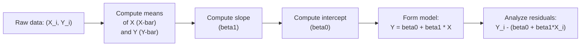

## Overview

In investment analysis, we often encounter situations where we want to understand how one variable influences another—like how a company’s revenue might be affected by advertising expenditure, or how a stock’s daily returns move with changes in a benchmark index. Simple linear regression (SLR) is a great tool to tackle these questions because it allows us to estimate the relationship between a single independent variable (X) and a dependent variable (Y). 

The typical setup is:


Y = \beta_0 + \beta_1 X + \varepsilon,


where:
• \\(\beta_0\\) = intercept  
• \\(\beta_1\\) = slope coefficient  
• \\(\varepsilon\\) = error term (random noise with mean zero)

In this section, you’ll learn the mechanics of how these \\(\beta\\) coefficients are estimated using the least squares criterion and how to interpret them in the context of financial data. Also, we’ll look at common pitfalls and best practices from an investment analyst’s viewpoint, and we’ll explore how this knowledge can be applied in exam scenarios and in everyday finance work.

## Foundations of Simple Linear Regression

### Regression Setup

Imagine you want to estimate how changes in a market index (X), like the S&P 500, might affect an individual stock’s returns (Y). If you gather a series of observations on X and Y (say, 100 days of data), simple linear regression helps you draw the “best” straight line that fits the data. The line should capture the overall trend: when X goes up, Y might also go up (positive correlation) or go down (negative correlation).

So, a quick personal anecdote here: I remember once trying to figure out if changes in oil prices could predict the daily returns of an airline company’s stock. The results weren’t as clear-cut as I expected—there was some relationship, but it wasn’t super strong. That’s typical: real data can be messy, which is why an organized method like least squares is so valuable.

### The Least Squares Criterion

The “least squares” part comes from minimizing the sum of the squared differences between the actual observed values of Y (the airline’s actual daily returns) and the fitted (or predicted) values of Y from the regression line. 

Mathematically for each observation \\(i\\):


e_i = Y_i - \hat{Y}_i = Y_i - (\hat{\beta}_0 + \hat{\beta}_1 X_i).


These \\(e_i\\) are called residuals, and they measure how far off the regression line is for each data point. We define the sum of squared errors (SSE) as:


\text{SSE} = \sum_{i=1}^{n} (Y_i - \hat{Y}_i)^2.


We find \\(\hat{\beta}_0\\) (estimated intercept) and \\(\hat{\beta}_1\\) (estimated slope) that make this SSE as small as possible.

### Estimating the Coefficients

To estimate the slope \\(\hat{\beta}_1\\):


\hat{\beta}_1 = \frac{\sum_{i=1}^n (X_i - \overline{X})(Y_i - \overline{Y})}{\sum_{i=1}^n (X_i - \overline{X})^2},


where \\(\overline{X}\\) is the average of all \\(X_i\\) values and \\(\overline{Y}\\) is the average of all \\(Y_i\\) values. Once we have \\(\hat{\beta}_1\\), we estimate the intercept:


\hat{\beta}_0 = \overline{Y} - \hat{\beta}_1 \,\overline{X}.


If, for instance, we find that \\(\hat{\beta}_1 = 1.5\\) in the airline example, that could imply that for every 1% change in oil prices (X), the airline’s stock return (Y) is expected to move by +1.5% on average, all else being equal. Meanwhile, \\(\hat{\beta}_0\\) would tell us the average predicted return when oil prices remain at some baseline or near zero change (though typically zero change in oil might not be meaningful in real life—so we interpret with caution).

## Practical Illustration

Let’s do a quick numeric example. Suppose we have five days of data for an airline’s stock return versus changes in the price of oil:

• Day 1: (X = −2%, Y = 4%)  
• Day 2: (X =  0%, Y = 3%)  
• Day 3: (X =  1%, Y = 1%)  
• Day 4: (X =  2%, Y = −1%)  
• Day 5: (X =  5%, Y = 2%)

(Here, X is daily change in oil price, Y is daily stock return.)

1. Compute \\(\overline{X}\\) and \\(\overline{Y}\\):  
   
   \overline{X} = \frac{-2 + 0 + 1 + 2 + 5}{5} = 1.2\%, \quad
   \overline{Y} = \frac{4 + 3 + 1 + (-1) + 2}{5} = 1.8\%.
   

2. Compute the numerator \\(\sum (X_i - \overline{X})(Y_i - \overline{Y})\\). 
   This gets a bit tedious by hand, so for a small data set, you can do a quick summation. Or you can do what many analysts do: open Excel or Python and let the software handle the arithmetic.

3. Estimate \\(\hat{\beta}_1\\). This slope approximates how changes in oil price movement might correlate with the airline’s returns.

4. Estimate \\(\hat{\beta}_0\\). This gives the predicted daily return when the change in oil price is at 1.2% (the average X) or specifically extends to the point where \\(X=0\\).

If you run these five observations in a spreadsheet using, for example, Excel’s “LINEST” function, you’ll get an intercept and slope that best fit the data. The outcome might not be strongly significant with only five observations, but it demonstrates how the process works. 

### Quick Python Example

If you want to see how you might do this in Python:

```python
import numpy as np
import statsmodels.api as sm

X = np.array([-2, 0, 1, 2, 5])  # % changes in oil
Y = np.array([4, 3, 1, -1, 2])  # % changes in airline stock

X = sm.add_constant(X)  # add intercept
model = sm.OLS(Y, X).fit()
print(model.summary())
```

You’ll see output with the estimated slope (\\(\hat{\beta}_1\\)) and intercept (\\(\hat{\beta}_0\\)), plus many diagnostics, like R-squared and t-statistics, which we’ll discuss in upcoming sections (look forward to 10.2, 10.3, and beyond for a deeper dive).

## Visualizing the Approach

Below is a Mermaid diagram that shows a simplified workflow:



You gather the data points, compute the means, then use them to get \\(\hat{\beta}_1\\) and \\(\hat{\beta}_0\\). Finally, you can track how well your model performs by examining residuals.

## Interpretation of Regression Coefficients

### Slope (\\(\beta_1\\))

The slope tells us how much Y is expected to change when X changes by one unit. So if \\(\hat{\beta}_1 = 2\\) for daily returns: for every 1% increase in X (your independent variable), your dependent variable Y (some other return or measure) goes up 2 percentage points on average. 

This “on average” part is key. We’re talking about expected changes in Y, not a guarantee for every single day. Markets are noisy: some days your predictive model will overestimate, other days it’ll underestimate.

### Intercept (\\(\beta_0\\))

The intercept \\(\hat{\beta}_0\\) indicates the expected value of Y when the independent variable X is zero. But watch out: in finance, sometimes \\(X=0\\) might lie outside the data’s practical range or might not be meaningful at all (for example, “zero interest rate” environment or “zero GDP growth” might be relevant or might not be). Interpreting intercepts often requires domain knowledge.

I recall being slightly confused by an intercept in a bond-yield regression once, because the intercept suggested negative yield at times when inflation rates were near zero. It was a clue that the model might be simplified or that something else was going on in the market—like risk premium factors we hadn’t included. 

## Assessing Fit and Reliability

Though this section focuses primarily on estimating \\(\hat{\beta}_0\\) and \\(\hat{\beta}_1\\), in practice you won't just stop there—you’ll want to check how well the model fits the data. That typically involves:

1. R-squared – a measure of fit.  
2. Standard errors – to assess the variability of the estimates.  
3. t-statistics – to test hypotheses on whether coefficients are statistically significant.  
4. Residual plots – to see if the residuals exhibit patterns that violate the standard regression assumptions (like homoscedasticity, normality, etc.).

We’ll explore these in Chapter 10.3 (Residual Analysis and Model Diagnostics) and in Chapter 10.4 (Measures of Fit), so stay tuned.

## Common Pitfalls and Best Practices

• Overfitting: Even in simple linear regression, we might read too much into a small dataset. Watch out if you have a very small sample or if your variables are non-stationary (like some macroeconomic time series).  
• Omitted Variable Bias: If you suspect other factors explain Y (like interest rates, exchange rates, or inflation), ignoring them could mean your slope \\(\hat{\beta}_1\\) is biased.  
• Extrapolation: The fitted line might look great within your data’s range, but if you extrapolate far beyond the range of X, the predictions can mislead you.  
• Interpretation of Intercept: As mentioned, be careful. If \\(X=0\\) is not in the data’s range, \\(\hat{\beta}_0\\) might not have a meaningful real-world interpretation.  
• Unit Scales: Always confirm the units—like whether your X is in percentages or decimal form. A slope of 0.02 means something very different if X is in decimals vs. percentages.  
• Violations of Regression Assumptions: Non-constant variance in residuals or correlation of errors over time can produce unreliable standard errors, affecting inference. See Chapter 10.2 and 10.3 for how to detect and handle these.

## Practical Steps in Software

1. Gather and Clean Data: Make sure your dataset is accurate. Missing or erroneous data can cause big headaches.  
2. Input into Software: In Excel, you can use LINEST or data analysis pack. In Python, try packages like StatsModels or scikit-learn. In R, use `lm(Y ~ X)`.  
3. Interpret Output: Look at your slope and intercept, but also check fit statistics like R-squared.  
4. Diagnostic Checks: Examine residuals, consider plotting them. If the residuals reveal patterns, consider transformations, or incorporate additional predictors.  
5. Document or Communicate Findings: Many times, the biggest challenge is explaining these regression coefficients to decision-makers who might not be stats-savvy. Always keep your explanation tied to the real-world phenomenon.

## Finance Angle: When to Use Simple Linear Regression

Simple linear regression is particularly handy when you want to examine a primary driver of returns, like how interest rate changes might influence bond fund performance or how a currency pair might affect an importer’s stock price. However, in real capital markets, multiple influences often exist. That’s why more advanced models (multiple regression, factor models, etc.) can provide broader insights. Still, as the initial building block, SLR is indispensable.

## Exam Tips (Time Management and Strategy)

• You might encounter a constructed-response question where you’re given a small data set and asked to calculate the slope. Prep by practicing short calculations and memorizing the slope and intercept formulas.  
• For item sets, you might be interpreting regression output. Expect questions about the meaning of the slope, intercept, SSE, or how to minimize SSE.  
• Always keep an eye on conceptual traps: Don’t assume correlation implies causation, and be mindful of the domain-specific meaning of the intercept.  
• Practice explaining the regression line in plain English. This is crucial in portfolio management contexts (e.g., “beta” in the Capital Asset Pricing Model is basically the slope of a regression of stock returns on market returns).

## References

• Wooldridge, J. M. (2020). Introductory Econometrics: A Modern Approach. Cengage Learning.  
• Montgomery, D. C., Peck, E. A., & Vining, G. G. (2021). Introduction to Linear Regression Analysis. Wiley.  
• Penn State Online–STAT 501: https://online.stat.psu.edu/stat501/lesson  

## Test Your Knowledge: Least Squares Criterion and Regression Coefficients



### Which of the following best describes the purpose of the least squares criterion in simple linear regression?

- [x] It minimizes the sum of the squared differences between observed and predicted values of Y.
- [ ] It guarantees zero correlation between X and the residuals.
- [ ] It selects the regression line that maximizes correlation between X and Y.
- [ ] It ensures that regression coefficients have the lowest standard errors possible.

> **Explanation:** The least squares criterion explicitly seeks to minimize the sum of squared residuals, i.e., the vertical distances between observed and fitted values of Y.

### In the simple linear regression equation Y = β₀ + β₁X + ε, which coefficient is typically interpreted as the change in Y per unit change in X?

- [ ] β₀
- [x] β₁
- [ ] ε
- [ ] R-squared

> **Explanation:** β₁ (the slope) represents how much Y changes for a one-unit change in X.

### Suppose a regression yields a slope coefficient (β₁) of 1.25. Which statement is the best interpretation in a financial context?

- [ ] A zero value of X leads to an expected Y of 1.25.
- [ ] Y is guaranteed to rise by 1.25 units every time X changes.
- [x] On average, for each one-unit increase in X, Y is expected to rise by 1.25 units.
- [ ] The regression always explains 100% of the variation in Y.

> **Explanation:** The slope in regression is always interpreted as an “on average” change in Y for a one-unit increase in X, not a guaranteed or universal change.

### If your regression has five data points, which of the following is the biggest concern?

- [x] The regression might not provide reliable estimates due to a small sample size.
- [ ] The slope must be zero if SSE is minimized.
- [ ] There is no intercept to interpret.
- [ ] The slope and intercept must sum to zero.

> **Explanation:** Small sample size is a prime concern; it reduces the precision of the slope and intercept estimates.

### Which step occurs first when estimating a simple linear regression model via the least squares approach?

- [x] Calculate the mean values of X and Y.
- [ ] Compute the slope coefficient β₁ using residuals.
- [ ] Subtract SSE from TSS to get R-squared.
- [ ] Interpret the slope in percentage terms.

> **Explanation:** You start by calculating the means (X̄ and Ȳ), which you then use in computing β₁.

### In a regression of stock returns on market returns, an intercept (β₀) significantly different from zero could indicate:

- [x] The presence of an abnormal return not explained by the market index.
- [ ] Perfect correlation between the stock returns and the market returns.
- [ ] The slope must be negative.
- [ ] The SSE is necessarily very large.

> **Explanation:** A non-zero intercept might be interpreted as an “alpha” in finance, suggesting returns beyond what the market alone would predict.

### Which of the following can inflate the slope coefficient’s estimate or lead to incorrect inferences?

- [x] Omitted variable bias.
- [ ] Perfect homoscedasticity of the residuals.
- [ ] A large sample size with no outliers.
- [ ] Mean reversion in the intercept.

> **Explanation:** Omitting relevant variables may bias the slope’s estimate because part of the variation in Y is incorrectly attributed solely to X.

### You run a regression analysis in Excel and observe SSE = 0. Which conclusion is most appropriate?

- [ ] Your model is completely useless.
- [ ] No correlation exists between X and Y.
- [x] The regression line perfectly fits all data points in the sample.
- [ ] The slope must be negative.

> **Explanation:** SSE = 0 means the residuals are all zero, so every observed Y lies exactly on the fitted line (a perfect fit situation).

### Which best describes a residual in the context of regression?

- [ ] The fitted value of Y for a given X.
- [x] The difference between the actual Y and the predicted Y.
- [ ] The sample mean of Y.
- [ ] The slope coefficient for a unit change in X.

> **Explanation:** A residual is Yᵢ − (β₀ + β₁Xᵢ)—the difference between the observed outcome and the predicted outcome.

### True or False: The least squares method requires that the independent variable X be normally distributed.

- [x] True
- [ ] False

> **Explanation:** Actually, strict normality in X is not a requirement for consistency of the OLS estimators, although in certain inference contexts, normality assumptions about Y and ε are often invoked. However, many references still mention normal distribution of the regressors when deriving certain classical inference results.  


