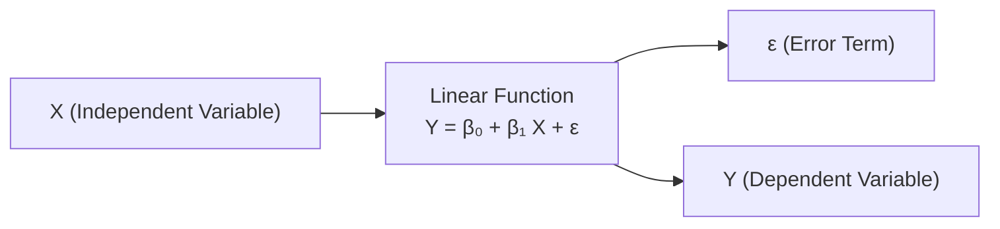

## Introduction

So, when I was first learning linear regression, I have to admit I thought it was basically just drawing a line through a set of data points and calling it a day. Simple as that, right? Well, it turns out there’s a bit more nuance to it. The line itself—described by the regression equation—needs to follow certain assumptions to ensure that our estimates of the slope and intercept are meaningful and that all those fancy hypothesis tests we talk about in econometrics (like t-tests and confidence intervals) are valid.

Below, we walk through each major assumption in a simple linear regression model. We’ll dig into why each assumption matters, and we’ll also talk about some practical ways to see if your data might be violating these assumptions. While this article focuses on simple linear regression (one independent variable), many of the assumptions carry over to multiple regression contexts (explored in Chapter 14). And if you’re a budding financial analyst, keep an eye out for the ways these assumptions show up in topics like equity valuation, interest rate modeling, or even portfolio risk assessment.

## Why These Assumptions Matter

A regression model is only as good as the assumptions on which it stands. In a financial context, messing up these assumptions can lead you to overestimate a security’s expected returns, misjudge risk exposures in a portfolio, or incorrectly conclude the significance of economic indicators. If you use erroneous outputs in real investment decisions, well, let’s just say your portfolio might take a hit.

## Linearity in Parameters

Linearity in parameters means the model takes the following form:


Y_i = \beta_0 + \beta_1 X_i + \varepsilon_i,


where \\(\beta_0\\) and \\(\beta_1\\) appear to the first power only (no \\(\beta_1^2\\) or \\(\beta_0 \cdot \beta_1\\) or bizarre transformations in the coefficients). This assumption does not forbid you from transforming \\(X\\). For instance, you could have a model like \\( Y_i = \beta_0 + \beta_1 \ln(X_i) + \varepsilon_i \\). Even though \\(X\\) is logged, the model is still *linear in \\(\beta_0\\) and \\(\beta_1\\)*.

• In finance, you might explore a log transformation of market capitalization (X) when modeling stock returns (Y). As long as \\(\beta_1\\) is just multiplied by \\(\ln(X)\\), the requirement of linearity in parameters is satisfied.

• This assumption ensures that the ordinary least squares (OLS) method can be applied directly to estimate \\(\beta_0\\) and \\(\beta_1\\).

## Random Sampling

We usually assume the data \\((X_i, Y_i)\\) come from a random sample of the population. In practice, this is often approximated by:

• Drawing observations from a relatively large and well-mixed population.  
• Ensuring independence and identical distribution (i.i.d.) of data points.

In many financial studies—like cross-sectional data on multiple firms—this assumption implies each firm’s returns and characteristics are (roughly) independent of others, or at least the data-gathering process is structured to reduce systemic biases. If we’re dealing with time-series data, we often rely on weaker forms of the random sampling assumption and must be more wary of autocorrelation.

## Mean Zero Error Term

We assume:


E[\varepsilon_i \mid X_i] = 0.


Translated, this says that knowing \\(X_i\\) doesn’t give you any clue (on average) about the error term. Another way to read this is \\(E[Y_i \mid X_i] = \beta_0 + \beta_1 X_i.\\) For everyday usage, it means that the regression line acts as an unbiased estimate of the actual conditional average of \\(Y\\). For instance, if \\(Y\\) were stock returns and \\(X\\) a fundamental factor like price-to-book ratio, we assume all the unaccounted factors (the error term) average out to zero at every \\(X\\)-value.

## Homoscedasticity (Constant Variance of Errors)

Homoscedasticity means the variability (variance) of the error term \\(\varepsilon\\) is the same for all values of \\(X\\). Symbolically,


\text{Var}(\varepsilon_i \mid X_i) = \sigma^2,


a constant. If the variance of \\(\varepsilon\\) changes with \\(X\\), that’s called heteroskedasticity. Why does this matter?

• If heteroskedasticity is present, the standard errors you compute for your \\(\hat{\beta}_0\\) and \\(\hat{\beta}_1\\) might be wrong, leading you to make inaccurate inferences. Maybe you’ll think your slope is super significant when it’s not.

• Financial data can exhibit this problem often. For example, returns on low-priced assets might show more volatility (in percentage terms) than returns on high-priced assets. Or small-cap stocks might have more pronounced swings than large-cap stocks.

### Checking for Heteroskedasticity

A quick approach is to look at a plot of residuals versus fitted values (or residuals versus \\(X\\)). If the spread of residuals grows or shrinks as \\(X\\) changes, you’re looking at potential heteroskedasticity. Formal statistical tests for this (like White’s test or the Breusch–Pagan test) are also used. This topic is explored in more depth in Chapter 14.5 when we handle multiple regression issues.

## No Autocorrelation (Uncorrelated Errors)

No autocorrelation means that for any pair of distinct observations \\((i, j)\\), the error terms \\(\varepsilon_i\\) and \\(\varepsilon_j\\) are not correlated:


\text{Cov}(\varepsilon_i, \varepsilon_j) = 0 \quad \text{for } i \neq j.


With time-series data, this is often violated if, say, shocks to returns in one period carry over into the next period. In cross-sectional data, we usually assume independence across samples.

• Why is this a big deal? If errors are autocorrelated, your model might systematically over-or-underestimate certain times or groups. Tests like Durbin–Watson or Ljung–Box are used to detect autocorrelation.

• For instance, in a financial time-series context, returns often have time dependencies, especially in volatility (leading to phenomena like GARCH processes). That can definitely break the simple assumption.

## Normality of Errors

The classical linear regression model also assumes:


\varepsilon_i \sim N(0, \sigma^2).


Strictly speaking, the normality of errors is relevant for small-sample inference—those t-tests, confidence intervals, and F-tests rely on synergy between normal errors and sample size. In large samples, the Central Limit Theorem (see Chapter 7.2) can mitigate the normality requirement, making OLS estimates remain consistent and nearly normally distributed (as the sample size grows).

• In finance, error term distributions can be thick-tailed (i.e., more prone to large outliers than a normal would expect), which is one reason real data might not fit perfectly into this assumption.

• A helpful approach is to check normal probability plots or run tests like the Jarque–Bera test on your residuals. If everything looks relatively normal, you can proceed comfortably. Otherwise, you might need robust or alternative methods.

## Exogeneity (No Correlation Between \\(X\\) and \\(\varepsilon\\))

Exogeneity states:


\text{Cov}(X_i, \varepsilon_i) = 0.


If \\(X\\) is correlated with the error \\(\varepsilon\\), OLS estimates of \\(\beta_1\\) are biased. In the real world, exogeneity is tricky. For instance, if you’re trying to see if “advertising spending” drives “product sales,” but the company invests in advertising precisely when sales are expected to rise anyway, you get endogeneity—a correlation of \\(X\\) and \\(\varepsilon\\). That can happen a lot in finance: suppose you regress a firm’s stock return on “analyst recommendations,” but analyst recommendations might themselves be responses to perfectly timed inside info about the firm’s performance. The cause is muddy, and your slope estimate \\(\hat{\beta}_1\\) can go off track.

## Practical Example of Checking Assumptions

Let’s walk through a tiny example. Suppose you’re analyzing the impact of an economic indicator (like interest rate changes) on a certain bond’s daily returns. You gather daily data for 200 days:

1. First, you run an OLS regression of Bond Return on Change in Interest Rate.  
2. Then you plot the residuals against fitted values to see if they form a uniform band around zero (checking homoscedasticity).  
3. You run the Durbin–Watson test for autocorrelation.  
4. You check the correlation between your predictor (change in interest rates) and the residuals to see if there’s exogeneity.  
5. Finally, you do a quick normality test on the residuals (e.g., Jarque–Bera).

If all looks good, you can trust your coefficient estimates more. If not, you might correct for heteroskedasticity, to handle autocorrelation, or use more advanced techniques (like instrumental variables when exogeneity is violated).

## Visualizing the Regression Framework

Below is a simple Mermaid diagram to illustrate the general idea of simple linear regression with one predictor \\(X\\), an error term \\(\varepsilon\\), and the outcome \\(Y\\).

In this schematic, \\(X\\) flows into the linear function, and we add the error term \\(\varepsilon\\) to get the dependent variable \\(Y\\). The assumptions we’ve explored essentially specify how \\(\varepsilon\\) behaves relative to \\(X\\) and how \\(Y\\) is distributed around that line.

## How Violations Affect Financial Analysis

Violations of these assumptions can lead to:

• Biased parameter estimates (exogeneity issue).  
• Inflated or deflated confidence levels (heteroskedasticity or autocorrelation).  
• Invalid hypothesis testing and inference (non-normality in small samples).

In a real-world portfolio management setting, incorrectly concluding a factor is significant (when in reality your standard errors are off) can lead you to overweight or underweight assets, distorting your risk/return profile. For exam purposes, you’ll often be asked to:

• Identify potential violations from a residual plot.  
• Discuss their impact on the reliability of the estimates.  
• Suggest solutions or alternative tests, such as using robust standard errors or transformations.

## Best Practices and Common Pitfalls

• Always plot your data. It’s amazing how much you can detect visually—nonlinear patterns, outliers, or changes in variance.  
• Be cautious about confounding variables. In finance, factors often correlate with each other (e.g., size and value style factors). If \\(X\\) is correlated with the error term, you might need instrumental variable approaches (discussed in advanced regressions).  
• Don’t assume everything is normal. Financial returns are notorious for fat tails. Large sample sizes help, but you might consider robust or nonparametric techniques.  
• Pay attention to time-series aspects. If you’re using daily or monthly returns, watch out for autocorrelation. Run those tests!  
• Always interpret your results in the context of these assumptions. If you suspect some are violated, mention that caveat in your analysis.

## Exam Tips for CFA Candidates

1. Familiarize yourself with the typical tests: Durbin–Watson for autocorrelation, White’s or Breusch–Pagan for heteroskedasticity.  
2. Know how each assumption affects the validity of OLS estimators (particularly unbiasedness, consistency, and the correct standard errors).  
3. When a question states you suspect “unequal variances,” it’s hinting at heteroskedasticity. Arm yourself with the knowledge of how to fix it or properly interpret the question’s implications.  
4. Don’t ignore the line “the data are from a random sample.” This is your signal the exam question is referencing the random sampling assumption.  
5. Watch out for mention of “endogeneity,” “omitted variable bias,” or “simultaneity”—all of which break exogeneity.  

## References and Further Reading

- Stock, J. H. & Watson, M. W. (2020). Introduction to Econometrics. Pearson.  
- NIST/SEMATECH e-Handbook of Statistical Methods: https://www.itl.nist.gov/div898/handbook/  
- CFA Program Curriculum, particularly the sections on quantitative methods for deeper examples of testing these assumptions.

## Test Your Knowledge: Simple Linear Regression Assumptions Quiz



### Which assumption ensures that the model formula is linear only in its unknown coefficients (β₀, β₁)?

- [ ] Random Sampling
- [ ] Homoscedasticity
- [x] Linearity in parameters
- [ ] Normality of errors

> **Explanation:** "Linearity in parameters" simply means that the equation is linear in its coefficients, not necessarily in how the explanatory variable X is transformed.

### In a simple linear regression of Y on X, what does it mean if E(ε|X) ≠ 0?

- [ ] The model is homoscedastic.
- [x] The model is misspecified and the error term is not mean zero.
- [ ] The slope estimate is exactly unbiased.
- [ ] There is no violation of exogeneity.

> **Explanation:** If E(ε|X) ≠ 0, it means you’re systematically missing something about the relationship, violating the mean zero error assumption.

### What is the main consequence of heteroskedasticity in regression?

- [ ] Biased estimates of β₀ and β₁.
- [ ] Inability to compute residuals.
- [x] Incorrect standard errors leading to unreliable hypothesis tests.
- [ ] Perfect exogeneity of X.

> **Explanation:** Heteroskedasticity doesn’t necessarily bias the coefficient estimates, but it does invalidate standard errors and any subsequent inference unless adjusted for.

### Which assumption is primarily concerned with the correlation among errors across observations?

- [ ] Random sampling
- [ ] Homoscedasticity
- [ ] Linearity in parameters
- [x] No autocorrelation

> **Explanation:** No autocorrelation deals with how residuals relate to each other across observations, especially important in time-series data when successive errors can be correlated.

### Suppose a regression model’s residuals appear larger at higher values of X. This phenomenon suggests:

- [ ] Autocorrelation
- [x] Heteroskedasticity
- [x] A potential violation of constant variance
- [ ] Perfect normality

> **Explanation:** Variance increasing with X is a red flag for heteroskedasticity, violating the constant variance assumption.

### If the error terms are not normally distributed, which statement is true for large sample sizes?

- [x] OLS estimators remain consistent, due to the Central Limit Theorem.
- [ ] Estimates of β₀ and β₁ become biased.
- [ ] No hypothesis tests can be conducted.
- [ ] The slope will necessarily be zero.

> **Explanation:** Even if errors aren’t perfectly normal, large-sample results rely on the Central Limit Theorem to make OLS consistent. Small-sample inferences, however, may not be reliable.

### In a simple linear regression, when X is correlated with the error term ε:

- [x] The estimates of β₁ are biased.
- [ ] The sum of squared residuals is automatically zero.
- [x] We have an endogeneity problem.
- [ ] R² becomes undefined.

> **Explanation:** Correlation between X and ε (i.e., endogeneity) yields a biased β₁. This is a key violation of the exogeneity assumption.

### Which diagnostic test is often used to detect autocorrelation in residuals?

- [ ] White’s test
- [ ] Jarque–Bera test
- [ ] Breusch–Pagan test
- [x] Durbin–Watson test

> **Explanation:** Durbin–Watson is the classic test for detecting first-order autocorrelation in the errors, frequently used in time-series contexts.

### What might a scatterplot of residuals versus fitted values indicate if the assumption of homoscedasticity is satisfied?

- [x] A random, constant scatter around zero.
- [ ] A clear cone-shaped pattern.
- [ ] A distinct downward slope.
- [ ] A perfect parabola.

> **Explanation:** Random scatter with no discernible pattern usually means you’re not violating the constant variance assumption.

### True or False: Without normality of errors, OLS estimates of β₀ and β₁ are always inconsistent.

- [x] True
- [ ] False

> **Explanation:** This is actually a tricky statement. Without normality of errors, OLS estimates can still be consistent if other Gauss–Markov assumptions are met and sample size is large. However, strictly reading the statement as it is, it claims that “without normality, they are ALWAYS inconsistent,” which is generally false. So the correct interpretation here is that the statement is false. 



---

**Note to Readers:**  
Always remember that, in finance, real-world data can be messy—non-normal distributions, correlated errors, and structural changes over time are quite common. Don’t let these assumptions intimidate you, though: the key is knowing how to check each assumption and how to proceed (e.g., using heteroskedasticity-consistent standard errors, or adjusting for autocorrelation).  

By mastering these assumptions, you’ll have a stronger feel for when your regression results are reliable and when they might be leading you astray. Good luck studying, and be sure to explore Chapter 10.6 for hypothesis testing on regression coefficients and Chapter 14 for multiple regression complexities!
