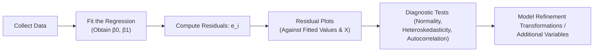

## Introduction
Residual analysis and model diagnostics might sound a bit geeky, but honestly, it's where the rubber meets the road for regression models. Why? Because the whole point of running a regression is to make sense of the relationship between our dependent variable (often called Y) and our explanatory variable (X). Evaluating the residuals—those differences between what your model predicts versus what actually happens—tells you a ton about whether your model is giving you a realistic, unbiased picture. In fact, if your residuals have clear patterns or if they're all over the place in a weird way, it can hint at deeper problems like missing variables or an incorrect functional form.

In simpler terms, residual analysis is a bit like a routine check-up after you build a model: You look at how far off you are and see if there’s anything systematically wrong. That’s why the topic is essential for all aspiring financial analysts, particularly as you prepare for the CFA exams. Let’s explore the main concepts and methods in a slightly relaxed, straightforward tone—one that I wish I'd had when I first started messing around with these models!

## Understanding Residuals
In a simple linear regression, you often establish:

• A dependent variable: Y (for instance, return of a particular stock).  
• An independent variable: X (for example, the market index return).  
• A fitted regression equation:  
  (1)  \\( \hat{Y}_i = \hat{\beta}_0 + \hat{\beta}_1 X_i \\)

The residual for the i-th data point is:


e_i = Y_i - \hat{Y}_i


It's basically the leftover: how much reality deviates from your model’s prediction. Residuals are super important because they should ideally look random and not carry systematic patterns. If they do carry patterns, it’s a big neon sign that the model has some issues.

### Why Do We Care So Much?
• A random scatter of residuals around zero suggests the linear assumptions are not blatantly violated.  
• Non-random patterns might mean you need a transformation of the variables (like taking logarithms) or that your model omitted some important factor.  
• Identifying outliers and influential data points helps you decide whether the data is messing with your model’s slope in an unfair way.

## Common Diagnostic Plots
Sometimes, the best way to get a handle on residuals is simply to visualize them. Let’s check out some top-tier diagnostic plots you’ll likely see in both finance and academic settings.

### Residuals vs. Fitted Values
This is your first go-to. Here, you plot your residuals (vertical axis) against your predicted \\(\hat{Y}_i\\) (horizontal axis). You want a random cloud, ideally. Any clear pattern—like a distinct curve—might mean your linear model is missing something. If the spread of points gets wider as the fitted values increase, that suggests heteroskedasticity (variable variance of errors).

### Normal Q-Q Plot
This Q-Q (quantile-quantile) plot checks if your residuals are normally distributed. If they fall roughly on a straight line, that’s a good sign that the normality assumption holds. Deviations at the tails indicate that your residual distribution might be skewed or heavy-tailed relative to the normal curve.

### Scale-Location Plot
You might alternatively see it called the “Spread-Location” plot. It helps identify whether the variance of residuals is constant. If you see a funnel shape, for instance, that’s an indication of heteroskedasticity. In my first modeling job, I remember nearly overlooking this funnel shape—boy, was that embarrassing when my boss pointed out that I'd basically missed the hallmark sign of non-constant variance.

### Leverage/Influence Plot
No matter how squeaky-clean your dataset is, there’s often a chance a couple of unusual points are steering your regression results. This plot (sometimes called the “hat-values” or “Cook’s distance” plot) highlights observations with high leverage (extreme X-values) or high influence (big residuals that shift the entire regression line). Removing or adjusting for these points can substantially change your regression coefficients.

Below is a quick flowchart summarizing how you might proceed with residual analysis and diagnostics:

## Major Diagnostic Tests

### Durbin–Watson Statistic
For time-series data (or any scenario where consecutive observations might be related in time), the Durbin–Watson statistic is a common measure to check for first-order autocorrelation among consecutive residuals. It is usually denoted \\(DW\\). The simplified formula is:


DW = \frac{\sum_{t=2}^{T} (e_t - e_{t-1})^2}{\sum_{t=1}^{T} e_t^2}


• Values near 2 imply little to no autocorrelation.  
• Values markedly less than 2 indicate positive autocorrelation.  
• Values markedly greater than 2 suggest negative autocorrelation.

### Breusch–Pagan or White Test
These are classic tests for heteroskedasticity—i.e., where the variance of the residuals changes systematically with X. In a finance context, this is key if your dataset includes a wide range of values. For instance, a regression of returns on market capitalization might show increasing variance in residuals as market cap grows—an all-too-common phenomenon.

• If these tests show significant results, you likely have heteroskedasticity.  
• Cutting corners here can give you misleading confidence intervals and p-values.  

### Identifying Outliers and Influential Observations
If you see a data point with a large residual, that’s an outlier. But does it matter? Sometimes outliers are just random flukes in the data that your model can safely ignore. Other times, a single outlier can drastically alter your slope coefficient. That’s a red flag. For instance, in equity analysis, one massive price swing could distort your entire regression if you treat it like typical data.

Influential observations have both a high residual and high leverage. A point with an unusual X-value might “pull” the regression line more strongly toward itself. Tools like Cook’s distance can quantify this.

### Robust and Newey–West Standard Errors
If you find that your residuals are heteroskedastic or autocorrelated, you might correct your standard errors accordingly:

• Robust (White) standard errors: Adjust standard errors to account for heteroskedasticity.  
• Newey–West standard errors: Adjust for both autocorrelation and heteroskedasticity, extremely handy for time-series regressions—like daily or monthly asset returns.

## Corrective Measures and Practical Adjustments
Let’s say you identify a problem. Now what? You’ve got a handful of tools to help fix or at least mitigate the issue:

• Transform Variables: If your residual plots show a curved pattern, you might try \\(\ln(Y)\\) or \\(\ln(X)\\), or polynomial terms like \\(X^2\\).  
• Include Additional Variables: Maybe the real driver is missing from your model. A pure capital asset pricing model might ignore sector or style factors that are relevant for certain stocks.  
• Segment Data or Use Dummy Variables: If the finance environment changes drastically for different regimes (e.g., pre- and post-crisis), consider separate models or incorporate dummy variables.  
• Switch to a Time-Series Model: If you see strong autocorrelation, maybe a simple linear regression is not enough. Tools from time-series analysis (see Chapter 12) might help.  
• Apply Robust or Newey–West Errors: For mild to moderate violations, this might be sufficient to salvage your linear model.

## A Quick Real-World Example
Imagine you’re modeling the daily returns of a small-cap stock (Y) as a function of the market’s returns (X). You run a simple linear regression and quickly realize that your residual plot looks suspiciously like a fan (i.e., very narrow at low fitted values but super wide as fitted values increase). That’s a red flag for heteroskedasticity—something we see quite often in real financial markets, as volatility can scale with returns or index levels.

Next, you test for heteroskedasticity using White’s test. The p-value is basically zero, so you can’t ignore it. You either:

• Use robust standard errors to get valid t-statistics and p-values, or  
• Try transforming your Y (like using log returns or absolute returns) if that better captures the relationship.

If your data is daily and you see a Durbin–Watson of 1.05, that’s also indicative of positive autocorrelation. You might want to use Newey–West standard errors or, better yet, adopt a time-series regression approach with an AR(1) term (autoregressive model) in your analysis. Alternatively, if you suspect that small-cap returns simply follow a more complicated dynamic, you might stand back and check other factors (like liquidity or size anomalies).

## Best Practices and Common Pitfalls
• Don’t Overlook the Basics: Always look at a simple residual vs. fitted plot. It’s perhaps the single biggest red-flag detector.  
• Don’t Overreact to Every Outlier: Some outliers are genuine data points. Investigate if they’re data errors or meaningful events before deciding to remove them.  
• Remember Serial Correlation: For time-series, failing to correct for autocorrelation can lead to very misleading inferences about significance.  
• Use the Right Tools: If non-constant variance or autocorrelation is present, robust your standard errors or pivot to advanced models.  
• Be Wary of Overfitting: Adding extra variables can help, but always check if those variables meaningfully improve your model or just add complexity.  

## Exam Relevance and Final Tips
You’ll likely encounter questions in your CFA exam about interpreting regression output. They might ask you to identify whether a pattern of residuals suggests a violation of linearity, or whether a certain Durbin–Watson statistic indicates autocorrelation. In item set questions, you might be shown a residual plot and asked which conclusion is most appropriate (e.g., “The model is heteroskedastic,” “There is positive autocorrelation,” “No problem”). 

• Be comfortable with the Durbin–Watson thresholds.  
• Familiarize yourself with the significance levels for tests like Breusch–Pagan or White.  
• Know how to interpret and handle outliers vs. high-leverage points.  
• Always keep an eye on whether adjustments or transformations are suggested by your residual analysis.

In addition, watch for the nuance: The presence of some leftover structure in the residuals might hint at a missing variable or a missing time effect. On the exam, a question may demand you to propose a fix—like adding an additional factor. 

Overall, get into the habit of checking plots visually and then using the statistical tests to confirm what you see. That combination—visual plus formal test—makes for a strong approach.

## Additional References
• Kutner, M. H., Nachtsheim, C. J., & Neter, J. (2004). Applied Linear Regression Models. McGraw-Hill.  
• Gujarati, D. N. & Porter, D. C. (2008). Basic Econometrics. McGraw-Hill.  
• CFA Institute. (2025). CFA Program Curriculum Level I, Vol. 1. CFA Institute.  

## Sample Exam Questions on Residual Analysis & Diagnostics



### Which best describes the residual in a regression?

- [ ] The difference between the sample mean of Y and the sample mean of X.
- [ ] The intercept in the regression model.
- [x] The difference between an observed Y and its fitted (predicted) value. 
- [ ] The fitted regression value minus the slope coefficient.

> **Explanation:** By definition, the residual is Y - Ŷ (or Y - (β̂₀ + β̂₁X)) for each data point. It reflects the amount of "error" remaining after fitting the regression.

### A random scatter in the plot of residuals vs. fitted values suggests:

- [x] The linear model is appropriately specified, with no obvious pattern in residuals.
- [ ] The model suffers from severe autocorrelation.
- [ ] The dependent variable is likely categorical.
- [ ] Perfect multicollinearity.

> **Explanation:** A random scatter indicates no systematic pattern is left in the errors, implying the model’s form is, at least visually, appropriate.

### A Q-Q plot of residuals is used primarily to assess:

- [ ] Linearity between Y and X.
- [x] Normality of residuals.
- [ ] Declarative bias in sample means.
- [ ] Presence of categorically scaled data.

> **Explanation:** Normal Q-Q plots show whether the residuals follow a normal distribution. Deviations from the line indicate non-normal errors.

### What do you conclude if the Durbin–Watson statistic is close to 2?

- [x] There is little to no first-order autocorrelation.
- [ ] The model is heteroskedastic.
- [ ] The slope is statistically insignificant.
- [ ] There are no outliers in the dataset.

> **Explanation:** A Durbin–Watson statistic near 2 indicates that residuals are not significantly autocorrelated at lag 1.

### Which statement about heteroskedasticity is correct?

- [ ] It only appears if your independent variable is categorical.
- [ ] It has no effect on the standard errors of regression coefficients.
- [x] It implies non-constant variance in the error terms.
- [ ] It is entirely eliminated by adding more data.

> **Explanation:** “Heteroskedasticity” literally means different spread, i.e., the variance of residuals depends on X or other factors. It generally affects the validity of standard errors.

### Which is a recommended corrective measure when residual plots show a curve?

- [ ] Remove all outliers from the dataset.
- [x] Transform variables (e.g., logs) or add polynomial terms.
- [ ] Ignore the curve if the R-squared is high.
- [ ] Increase the significance level to 10%.

> **Explanation:** A curved pattern in residuals often indicates the relationship is not purely linear; variable transformations or polynomial terms can help fix this mismatch.

### If you detect autocorrelation but not heteroskedasticity, one approach is to:

- [x] Use Newey–West standard errors for the slope estimate.
- [ ] Switch to polynomial cross-sectional regressions.
- [x] Investigate a more appropriate time-series model (e.g., AR(1)).
- [ ] Immediately discard the data and start fresh.

> **Explanation:** In time-series contexts with autocorrelation, standard linear regressions may give incorrect p-values. Newey–West standard errors or advanced time-series models address this.

### A “leverage point” in regression refers to:

- [x] An observation with an extreme X-value that may strongly affect the regression slope.
- [ ] The use of borrowed funds to enhance returns.
- [ ] A data point with zero residual.
- [ ] Correcting for technical chart patterns in trading.

> **Explanation:** A leverage point is an observation whose X-value is quite far from the mean of X, giving it potential to “pull” the regression line.

### What is a valid reason to remove an outlier from your dataset?

- [x] The observation is shown to be a data coding error or anomaly unrepresentative of the population.
- [ ] The outlier significantly lowers the R-squared.
- [ ] The outlier is from a small-cap firm, and you prefer large-cap data.
- [ ] The slope coefficient is negative with the outlier included.

> **Explanation:** Removing outliers should be done with caution. One justifiable reason is when the point is actually an error or is truly not part of the same population being studied.

### True or False: Adding more explanatory variables will always eliminate the presence of autocorrelation.

- [x] True
- [ ] False

> **Explanation:** Actually, this statement is typically false. Merely throwing more variables at the model doesn’t guarantee that autocorrelation disappears. You may need specialized time-series corrections like an AR(1) model or robust standard errors.


