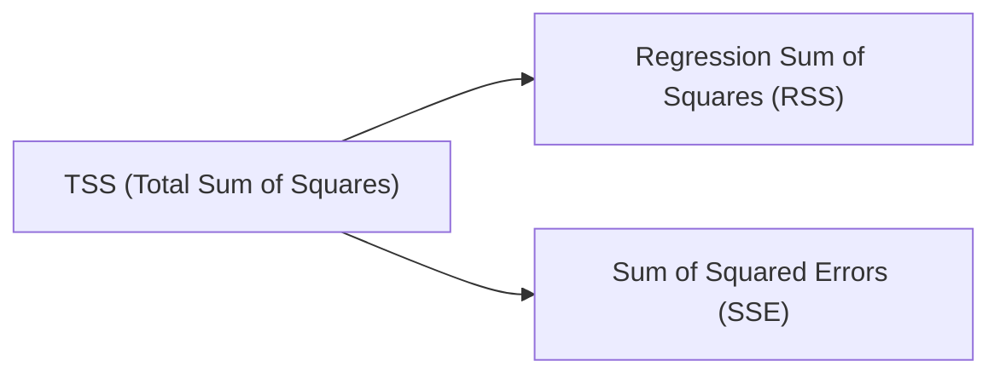

## Introduction

By now, you’ve explored the mechanics of fitting a simple linear regression (SLR) model (see previous sections in Chapter 10). You’ve likely practiced drawing a straight line through data points to capture how changes in an independent variable (X) might help predict the dependent variable (Y). But how do you decide if your model is doing a good job? This is where measures of fit come in. In simple linear regression, the main tools—R², Standard Error of Estimate (SEE), and an Analysis of Variance (ANOVA) framework—help you figure out whether your regression line is truly capturing the underlying relationship or basically just guessing.

I remember the first time I ran a simple regression for an investment project: I felt super excited seeing that line drawn neatly through the points, but I wasn’t sure whether the line was genuinely useful or if I was fooling myself. Understanding R², SEE, and ANOVA quickly became vital. So, in this portion, we’ll talk about each of these measures in a slightly informal, hopefully friendly, way. We’ll also walk through some real-world examples and point out a few pitfalls that might trip you up in practice.

## The Coefficient of Determination (R²)

### Conceptual Overview

The coefficient of determination, R², is a fancy term for a down-to-earth concept: out of all the variation in the dependent variable (Y), how much can be explained by our independent variable (X)? If you recall from earlier chapters, we often blame “randomness” or “noise” for the differences we see in outcomes, so it’s definitely good news if a large portion of the changes in Y are actually explained by X rather than by random factors.

Mathematically, in the context of a simple linear regression:


R^2 = \frac{\text{Regression Sum of Squares (RSS)}}{\text{Total Sum of Squares (TSS)}} 
= 1 - \frac{\text{SSE}}{\text{TSS}},


where:  
• TSS (Total Sum of Squares) measures the overall variability of the dependent variable around its mean.  
• RSS (Regression Sum of Squares) captures the portion of variability explained by the regression model.  
• SSE (Sum of Squared Errors) is the part left unexplained by the model—the residual or error sum of squares.

R² always falls between zero and one in standard cases of ordinary least squares (OLS). An R² of 0.75, for example, means that 75% of the variability in Y is explained by X (and by your linear model). In common language, that’s pretty good. On the other hand, a small R² (like 0.05) means that X explains only 5% of Y’s variation. You might need a better predictor, or perhaps there’s a more complex relationship not captured by a simple linear framework.

### Overfitting Consideration

Now, in simple linear regression, overfitting is less of a concern than in big, complicated models—because you only have one explanatory variable. Still, if you add more variables (in multiple regression scenarios), R² will only increase or stay the same; it never goes down. That’s why we typically move on to “adjusted R²” in multiple regression contexts. But for this chapter’s scope, you can just treat R² as a straightforward measure of how well your single X tracks changes in Y.

### A Quick Example

Suppose you are trying to predict monthly stock returns (Y) from changes in consumer sentiment (X). You gather 24 monthly observations. After running a regression, you find R² = 0.60. That means that 60% of the variance in stock returns is “explained” by consumer sentiment changes. In practice, that’s fairly high for financial markets, where so many random shocks can influence asset prices. If you only saw R² = 0.05, you might realize consumer sentiment alone does not do a stellar job at predicting those returns.

## The Standard Error of Estimate (SEE)

### Why SEE Matters

While R² is a nice ratio-based measure, it doesn’t directly tell you the typical magnitude of your model’s errors in the original units of Y. That’s where the standard error of estimate (SEE) comes into play. This measure, sometimes called the residual standard error or standard error of the regression, can be interpreted as “how far off, on average, your predictions are (in the same units of Y).”

In a simple linear regression:


\text{SEE} = \sqrt{\frac{\text{SSE}}{n - 2}}.


We divide by \\( n - 2 \\) (instead of \\( n \\)) because we lose two degrees of freedom: one for the slope (\\(\beta_1\\)) and one for the intercept (\\(\beta_0\\)).

A smaller SEE suggests that your regression line is hugging the data more tightly. Sometimes, you’d rather see “a small average error” than a large R² if your context calls for minimal absolute predictive error. For instance, in forecasting daily changes in currency exchange rates, even a relatively low R² could still be operationally useful if your typical prediction error (SEE) is consistently small.

### SEE vs. R²

A quick comparison: R² is a proportion (0–1), whereas SEE is measured in the actual Y units (e.g., in dollars, returns, or basis points). One quick anecdote: I once ran a wage regression where R² was around 0.40. That might not sound super impressive. But the SEE was only \$2,000 per year in a dataset where average salary was \$60,000. So, in context, that was quite decent because the typical error was not that large relative to the scale of annual salary.

## Analysis of Variance (ANOVA)

### The ANOVA Table Setup

The phrase “analysis of variance” (ANOVA) sounds more intimidating than it is. In simple linear regression, ANOVA is just a structured way to decompose total variation (TSS) into explained (RSS) and unexplained (SSE) parts. It also provides a framework to formally test how well your model fits, typically via the F-statistic.

An ANOVA table for simple linear regression often has these rows and columns:

• Degrees of freedom (DF)  
  – Model: 1 (because we have one slope)  
  – Residual: \\(n - 2\\)  
  – Total: \\(n - 1\\)  

• Sum of Squares (SS)  
  – Regression Sum of Squares (RSS)  
  – Sum of Squared Errors (SSE)  
  – Total Sum of Squares (TSS)  

• Mean Square (MS)  
  – MS(Regression) = RSS ÷ 1  
  – MS(Residual) = SSE ÷ (n – 2)  

• F-statistic  
  – F = MS(Regression) / MS(Residual)

### Connecting ANOVA with R² and SEE

You might notice a pattern if you recall the earlier formulas:

• TSS = RSS + SSE  
• R² = RSS / TSS = 1 – SSE / TSS  
• SEE = sqrt(SSE / (n – 2))  

Essentially, R² tracks the ratio of what your model explains vs. the total, while SEE measures the average leftover error in actual units. The ANOVA table conveniently consolidates these calculations in one place and includes the F-statistic, which tests whether \\(\beta_1 = 0\\) is plausible.

### The F-Statistic in Simple Regression

If your F-statistic is high (relative to its critical value from an F-distribution with 1 and \\(n – 2\\) degrees of freedom), you reject the null hypothesis that \\(\beta_1 = 0\\). In simpler terms, you conclude that X significantly influences Y and that your linear regression is statistically meaningful at your chosen significance level.

Just a heads up: In simple linear regression, the F-stat and the t-stat on the slope coefficient \\(\beta_1\\) are intimately related. Indeed, \\(F = t^2\\). So if your slope’s t-test is significant, your overall F-test for the regression is also significant.

## Interpreting R², SEE, and the F-Statistic

### Putting Them All Together

• R²: If R² is 0.90, you can say, “90% of the variation in Y is explained by X.” That’s powerful—but always ask if that’s realistic or if there might be overfitting or missing variables.  
• SEE: If SEE is large, it means your typical prediction errors are big in absolute size. Even a decent R² can be overshadowed by a large SEE if the scale of Y is such that the errors are not acceptable.  
• F-stat and p-value: A large F-statistic (or correspondingly small p-value) suggests the regression model is significantly better than having no predictor at all.  

In practice, analysts often focus on a combination of these to gauge whether the model is both statistically significant and practically useful, given the scale of the data.

### Visual Aid: Partitioning TSS into RSS and SSE

Below is a Mermaid diagram that visually breaks down how TSS splits into RSS and SSE in a simple linear regression:



TSS represents all the variation in the dependent variable. The regression line “explains” RSS portion, while SSE is the leftover unexplained part. R² tells you how big the RSS piece is, relative to the whole pie (TSS).

## Practical Real-World Example

Let’s do a step-by-step scenario. Imagine you are a junior analyst at a small asset management firm. Your boss wants you to build a simple model to see if changes in long-term interest rates (X) predict changes in a broad real estate investment trust (REIT) index (Y). You have 30 monthly observations.

1. You run a simple linear regression in Python (or any statistical software) with:
   Y = \\(\beta_0\\) + \\(\beta_1\\)X + \\(\epsilon\\).

2. The resulting output:  
   – R² = 0.45  
   – SSE = 420.0  
   – TSS = 763.6  
   – So, RSS = 763.6 – 420.0 = 343.6  
   – SEE = sqrt(420.0 / (30 – 2)) = sqrt(420 / 28) ≈ sqrt(15) ≈ 3.87  

3. The ANOVA table might look like this (conceptually):

   | Source       | SS     | DF | MS        | F-Stat = MSR / MSE |
   |------------- |--------|----|---------- |--------------------|
   | Regression   | 343.6  | 1  | 343.6     | 343.6 / 15.0 ≈ 22.9 |
   | Residual     | 420.0  | 28 | 15.0      |                    |
   | Total        | 763.6  | 29 | –         |                    |

   The F-stat is about 22.9. You compare it to an F distribution with (1, 28) degrees of freedom. That might yield a p-value near zero, suggesting a statistically significant relationship.

So, how do we interpret this?  
• 45% of the variation in the REIT index changes is “explained” by interest rates. Not bad.  
• The typical error is about 3.87 (in the same index-percentage-point units, presumably). Whether that’s good or bad depends on how large changes typically are for this index.  
• The F-stat is large, so we’re confident that \\(\beta_1 \neq 0\\). Indeed, it suggests a meaningful predictor.

Here’s a quick snippet of how you might compute these in Python for your future reference:

```python
import numpy as np
import statsmodels.api as sm

X = np.array([2.1, 2.3, 2.4, 2.0, 2.5, ...])  # 30 monthly obs for interest rates
Y = np.array([1.2, 0.8, 2.3, 1.5, 1.7, ...])  # 30 monthly obs for REIT returns

X = sm.add_constant(X)

model = sm.OLS(Y, X).fit()
print(model.summary())
```

That summary includes R², F-stat, and other fit measures in a standard regression output.

## Common Pitfalls and Best Practices

• Confusing R² with a measure of “causality.” A high R² does not imply that X causes Y. You should interpret R² as a measure of correlation/explanatory power only.  
• Ignoring the scale of SEE. If SEE is large relative to the scale of Y, you might not have a practical fit, even if the model is statistically significant.  
• Relying on R² alone. You should also check residual plots, test for normality (if needed), and watch for patterns that suggest the relationship might not actually be linear.  
• Over-emphasizing statistical significance. Yes, the F-stat can be impressive, but if the effect size is small in practice or if your real-world application can’t tolerate the error magnitudes, the significance alone isn’t enough.  
• Missing the degrees of freedom. Always remember you lose two degrees of freedom in a simple regression. This becomes especially important when your sample size is small.  

## Strategies to Overcome Challenges

• Use visual diagnostics. Plot your fitted line and residuals to spot any glaring patterns.  
• Evaluate both R² and SEE. If they both suggest a strong fit, it’s more reliable.  
• Conduct out-of-sample predictions. Sometimes, your in-sample fit might look great, but the model fails to predict well in new data.  
• Check robust standard errors if you suspect heteroskedasticity (though that’s more relevant in later chapters when we handle more advanced topics).  

## Conclusion

Measures of fit—R², SEE, and ANOVA—are central to deciding whether your regression line can reliably capture the relationship between X and Y. R² answers “how much,” SEE answers “how badly are we off in our predictions,” and ANOVA ties everything together into a neat framework that, via the F-statistic, shows whether the overall model is worth keeping. 

In finance, these tools guide us in everything from forecasting returns to assessing macroeconomic indicators’ impact on portfolio performance. Understanding them is a core step toward deeper regression analysis, especially once you move on to multiple regression (Chapter 14) or time-series analysis (Chapter 12). Keep practicing. Once you start seeing how these measures fluctuate under different conditions, you’ll develop an intuitive feel that helps you build better analyses throughout your CFA career—trust me, I’ve been there, double-checking that R² score at 2 AM!

## References and Further Reading

• Angrist, J. D., & Pischke, J.-S. (2008). Mostly Harmless Econometrics. Princeton University Press.  
• Greene, W. (2017). Econometric Analysis. Pearson.  
• See also Chapter 8 of this Volume for deeper discussion of hypothesis testing related to regression coefficients.  
• For multiple-regression context, refer to Chapter 14 of this Volume.

## Test Your Understanding: Measures of Fit in Simple Linear Regression



### Which of the following statements about R² is correct?

- [x] R² represents the percentage of variation in the dependent variable explained by the regression model.
- [ ] R² represents the standard error of the regression model.
- [ ] R² is always equal to 1 in simple linear regression.
- [ ] R² can be negative in standard ordinary least squares settings.

> **Explanation:** R² quantifies the proportion of the total variation in Y that can be explained by the regression model. In simple OLS, it ranges from 0 to 1.

### Suppose you calculate an SEE of 10 for a model predicting stock returns (in percent). What does an SEE of 10 imply?

- [x] On average, the predictions differ from actual stock returns by around 10 percentage points.
- [ ] The model explains 10% of the variation in returns.
- [ ] The slope coefficient is 10.
- [ ] The intercept term must be 10.

> **Explanation:** SEE is roughly the “average” size of the errors, measured in the original units (percentage points here).

### In a simple linear regression, the F-statistic and the t-statistic for testing the slope coefficient are related by:

- [x] F = t²
- [ ] F = t
- [ ] F = t/2
- [ ] F = β₀ / β₁

> **Explanation:** In simple linear regression, the overall F-test for the model coincides with the t-test for the slope, such that F = t².

### If the F-statistic in a simple linear regression is insignificant at the 5% level, which conclusion is most consistent with this finding?

- [x] There is not enough evidence to conclude that the slope coefficient differs from zero.
- [ ] The slope coefficient has to be exactly zero.
- [ ] R² must be exactly 1.
- [ ] SEE must also be exactly zero.

> **Explanation:** An insignificant F-statistic indicates failure to reject the null hypothesis that β₁=0 at the chosen significance level.

### In regression-based ANOVA, which statement about TSS (Total Sum of Squares) is correct?

- [x] TSS is the sum of RSS and SSE.
- [ ] TSS is always greater than RSS + SSE.
- [x] TSS equals the degrees of freedom multiplied by the MS(Regression).
- [ ] TSS represents the sum of the products of X and Y.

> **Explanation:** TSS = RSS + SSE is a fundamental identity of regression ANOVA.  

### Which measure provides the “average” size of the residuals in the original units of Y?

- [x] Standard Error of Estimate (SEE)
- [ ] R²
- [ ] F-statistic
- [ ] t-statistic for the slope

> **Explanation:** SEE is computed as sqrt(SSE/(n–2)) in simple linear regression, reflecting average residual size.

### If R² is 0.85, which of the following statements is most accurate?

- [x] 85% of the variation in Y is explained by the regression model.
- [ ] The standard error of residuals is 0.85 in Y units.
- [x] The intercept must be 0.85.
- [ ] The model always perfectly predicts 85% of the observations.

> **Explanation:** R² = 0.85 means 85% of the variability is explained, not that the intercept is 0.85 nor that the model is perfect for 85% of the data.

### How is the degrees of freedom for the Residual (or Error) typically computed in simple linear regression?

- [x] n – 2
- [ ] n – 1
- [ ] n – k – 1
- [ ] n

> **Explanation:** For a single slope plus an intercept, you lose 2 degrees of freedom, so residual DF is n – 2.

### Which situation might lead you to question the reliability of a very high R² value in a time-series regression?

- [x] Presence of trend or autocorrelation in the data that inflates R².
- [ ] A single strong outlier consistent with the linear trend.
- [ ] A large negative slope coefficient with a p-value < 0.05.
- [ ] A small sample size of fewer than 10 data points.

> **Explanation:** Time-series data can be autocorrelated or share trends, artificially boosting R², thus requiring additional diagnostics.

### True or False: If the F-statistic is significant, it implies that the model’s slope is nonzero and that the intercept must be zero.

- [x] True
- [ ] False

> **Explanation:** The F-statement about the slope being nonzero is correct. However, it says nothing about forcing the intercept to be zero. (In a simple linear regression, “significant F” means slope ≠ 0. It does not constrain the intercept’s value.)


