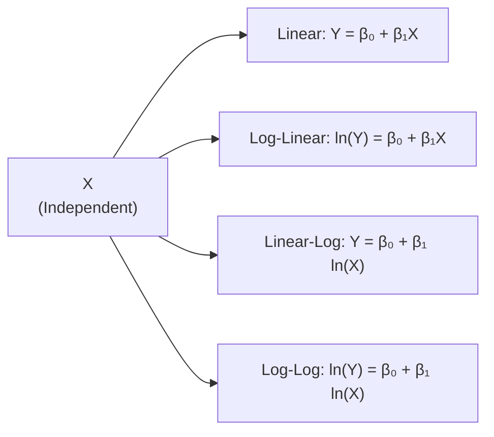

## Overview and Motivation

Let’s talk about something we all love messing with—predictions. If you’re like most of us, you probably got excited the first time you built a regression model that seemed to forecast outcomes—even if you were just fooling around with a small data set in your earlier classes. Now, in this part of your CFA studies, you’ll see how that forecasting power is refined in practice. You’ll also learn one of the biggest watch-outs in regression analysis: distinguishing between predicting an individual new outcome versus estimating the mean response at specific values of your independent variable. They look similar at first glance, but the intervals can differ a lot.

Moreover, you’ll discover that not every scenario calls for a plain old linear relationship: it might be exponential, or perhaps your variable changes on a percentage basis. That’s where functional forms—including log-linear, linear-log, and log-log—come into play. It’s all about customizing your regression to fit the data and the real-world relationships you’re trying to represent.

## Prediction Intervals versus Confidence Intervals for the Mean Response

One of the coolest aspects of linear regression, especially when we tie it back to investments and finance, is turning the model into a forward-looking tool. Suppose you’ve developed a simple regression of monthly returns of a particular stock (Y) against an economic indicator (X). You might want to know, “Given a particular value of my economic indicator, what might the stock’s return be?”

But there’s a big difference between:

• The average response (mean return) you might expect for that value of X.  
• An actual, one-off future observation for a single month’s return.

### Understanding the Difference

Confidence intervals tell you about where the true mean of Y (for a given X) is likely to lie. Prediction intervals, on the other hand, aim to capture the likely range of a single new observation of Y. Because a single new observation can be affected by more variation (think day-to-day volatility in returns), prediction intervals are wider.

When we talk about “wider,” it’s basically because we add the extra uncertainty of the idiosyncratic noise around any single measurement. It’s like telling a friend: “Hey, if you do something a hundred times, the average will likely be in this narrower band—but that single trial outcome might wander off a bit more.”

### The Formula for a Prediction Interval

Let’s say that you have your simple linear regression:

(1)  Y = β₀ + β₁X + ε,

where ε is your random error term (often assumed to be normally distributed with mean zero and variance σ²). If you’ve estimated β₀ and β₁ from a sample, you have an estimated regression line:

(2)  Ŷₓ = b₀ + b₁x,

where b₀ and b₁ are your sample estimates. Now imagine you want to predict a new observation Yₓ₍new₎ at some specific value x₍*₎. The formula for the prediction interval at confidence level (1 – α) typically looks like this:

(3)  Ŷₓ₍*₎ ± t(α/2, n – 2) × √[Var(Ŷₓ₍*₎) + σ²],

where:  
• t(α/2, n – 2) is the critical t-value with (n – 2) degrees of freedom.  
• Var(Ŷₓ₍*₎) is the variance of the fitted value at x₍*₎.  
• σ² is the residual variance (the estimate of the variance of ε).

So that extra “+ σ²” in the square root is what accounts for the additional variability in your new individual observation.

### The Formula for a Confidence Interval for the Mean Response

In contrast, if you want just the average response—say you’re not predicting an individual monthly return but the expected monthly return for many months—your interval might look like this:

(4)  Ŷₓ₍*₎ ± t(α/2, n – 2) × √[Var(Ŷₓ₍*₎)],

where we do not add that extra σ² inside the square root. This typically leads to a narrower interval since you’re focusing on the mean rather than individual outcomes.

## Practical Example: Confidence Interval vs. Prediction Interval

Let’s run through a small hypothetical. Suppose you’re analyzing a portfolio’s monthly return Y against a single factor X (maybe it’s a lagged economic indicator, or the monthly return of a broad market index). After running the regression, you get:

• b₀ = 0.5% (that’s 0.5 percentage points)  
• b₁ = 0.9  
• Residual variance, σ² = (0.02)² = 0.0004 (implying a standard error of 0.02)  
• n = 30 monthly data points, so you have 28 degrees of freedom for the t-distribution.

Now let’s say you want to predict your portfolio’s return if X = 1.5%. So Ŷ₍1.5%₎ = 0.5% + 0.9(1.5%) = 0.5% + 1.35% = 1.85%.

1) For the mean response (confidence interval), you might end up with something like:

   Ŷ₍1.5%₎ ± t(α/2, 28) × SE(Ŷ₍1.5%₎),

   If the standard error of Ŷ₍1.5%₎ is, say, 0.3%, then a 95% CI might be 1.85% ± (2.05 × 0.3%) = 1.85% ± 0.615%, or approximately [1.235%, 2.465%].

2) For a new observation’s prediction interval, you have:

   Ŷ₍1.5%₎ ± t(α/2, 28) × √[Var(Ŷ₍1.5%₎) + σ²].

   Since σ² = 0.0004 (0.02²), you’re now adding that extra variance. The standard error might jump to 0.36% → 1.85% ± (2.05 × 0.36%) = 1.85% ± 0.738%, or approximately [1.112%, 2.588%]. That’s a wider interval, reflecting that a single month’s actual return can deviate more than the average predicted return.

## Residual Variance and Model Diagnostics

One reason we keep harping on residual variance (σ²) is that it drives the spread in both types of intervals. In finance, returns often exhibit volatility clustering and potential heteroskedasticity (variance that changes over time). So you typically want to check the assumptions of your regression, making sure they’re reasonably valid for standard interval formulas to hold.

• Ensure that errors are approximately normally distributed.  
• Confirm homoskedasticity or apply robust standard errors otherwise.  
• Check for outliers or structural changes over the sample period.

## Common Functional Forms in Simple Regression

We’ve been working with Y = β₀ + β₁X for simplicity, but it’s not always the best shape for your data. Sometimes, log transformations or other modifications capture the relationship better. Let’s highlight some widely used functional forms:

### Linear-Linear Model

(5)  Y = β₀ + β₁X.

This is the standard approach. You assume that for every 1-unit change in X, Y changes by β₁ units—straight and direct. In finance, you might use a linear model to explain how the excess return on a commodity might change with an index drawdown, or how net income might change with sales.

### Log-Linear Model

(6)  ln(Y) = β₀ + β₁X.

This implies that Y = e^(β₀ + β₁X). In many financial contexts (for instance, forecasting certain cost structures or certain risk premiums), an exponential-like growth pattern might ring truer. If β₁ is positive, Y grows exponentially as X increases linearly. A typical scenario is if Y is a price or a rating that grows in a multiplicative manner with X.

### Linear-Log Model

(7)  Y = β₀ + β₁ ln(X).

Now X might be huge, or vary over multiple orders of magnitude—like AUM (Assets Under Management) at a fund. The relationship is: a small percentage change in X leads to a linear change in Y. This can be used if you suspect that Y changes systematically for each log-step in X. For instance, you might investigate how a bond’s price changes for each doubling of trade volume.

### Log-Log Model

(8)  ln(Y) = β₀ + β₁ ln(X).

This model is a favorite for measuring elasticity. If Y is an economic variable like consumer spending, and X is an income measure, then β₁ is directly interpreted as “if X changes by 1%, Y changes by approximately β₁%.” In asset pricing, you might similarly interpret the percentage change in price with respect to the percentage change in a macro factor.

## How to Choose Your Functional Form

This is where your expertise—and sometimes your intuition—comes into play. In my early days as a junior analyst, I remember simply plugging data into a plain vanilla linear regression, crossing my fingers, and hoping the line of best fit told the whole story. More often than not, it didn’t. Over time, I learned a few essentials:

• Look at the residuals. If the variance of the residuals appears to grow with X (often a fan shape on a scatter plot), consider a log transformation.  
• Use domain knowledge. Certain processes in economics or finance are known to exhibit multiplicative dynamics (e.g., compounding, interest growth).  
• Evaluate model fit statistics (like R² or the standard error of the regression), plus the standard diagnostic plots. If you see systematic curvature, the model might need a transformation or polynomial term.

## Mermaid Diagram: Visualizing Different Functional Forms

Below is a quick Mermaid diagram to visualize how the dependent variable (Y) might respond to changes in the independent variable (X) for different functional forms. These relationships often help clarify when you might pick log-linear versus linear-log, etc.

Each shape in this diagram emphasizes how the same X can be mapped to Y under different assumptions about the underlying relationship.

## Real-World Scenarios and Practical Examples

1. Forecasting Earnings per Share (EPS):  
   If a company’s earnings growth is roughly exponential (perhaps compounding at a certain rate), a log-linear model might better capture the relationship between time (X) and ln(EPS).

2. Portfolio Return Behavior:  
   Some practitioners use log-returns instead of simple returns because of the properties of compounding and the multiplicative nature of investment growth. A log-log model can help estimate elasticity of changes in a portfolio’s returns relative to changes in a benchmark or macroeconomic variable.

3. Comparative Statics in Bond Pricing:  
   If bond price changes are believed to be linear in the log of interest rates, then you’d rewrite your regression to reflect that. For instance, you might do a linear-log model if you suspect with each doubling of the yield, the bond price changes by a certain fixed number of basis points (it might be approximate, but can be tested).

## Best Practices for Implementation

• Always conduct a thorough residual analysis. If your residuals systematically depart from zero or show patterns, your model might be missing something important in the functional form.  
• Use the domain knowledge test: does your chosen function make sense for the phenomenon you’re modeling?  
• Remember to transform back if needed. For example, if you used ln(Y) in your regression, your predictions for Y require exponentiation.

## Potential Pitfalls and Common Challenges

• Overlooking the distinction between confidence intervals and prediction intervals. In practice, confusions arise especially in the context of portfolio risk: confidence intervals fail to capture the variability of an actual single period’s return.  
• Relying solely on linear-linear when data or theory strongly suggest exponential or percentage-based relationships.  
• Heteroskedasticity or autocorrelation in the data, which can make your standard errors unreliable if not correctly addressed.  
• Ignoring outliers or structural breaks. Particularly in finance, an extraordinary market event (e.g., the onset of a recession or a major liquidity crisis) can fundamentally shift the regression relationship.

## Integration into the CFA Exam Mindset

Even though simple linear regression might appear straightforward compared to advanced topics you’ll tackle (like multi-factor models or simulation-based approaches), it remains foundational. On the CFA exam, especially for Level III (though building from these essential Level I details), you may see item-set questions requiring you to:

• Interpret the meaning of slope and intercept.  
• Provide or compare confidence intervals vs. prediction intervals.  
• Decide whether a log transformation would be appropriate based on data or scenario.  
• Evaluate the correctness of a chosen model’s specification through residual plots.

The exam often tests your ability to choose the correct approach for forecasting and to interpret the intervals properly—particularly under exam pressure, where you might forget that a single new observation’s forecast interval should be wider than the interval for the average predicted value.

## Strategies for Handling Exam Questions

1. Look for Key Phrases:  
   • If the question states “predict a future single observation of Y,” that’s a sign you need a prediction interval.  
   • If it says “estimate the average Y,” or “expected value of Y,” then it’s a confidence interval.  

2. Watch the Functional Form:  
   • If you see something like “investment grows by 8% for every 1% increase in X,” that suggests a log-log model.  
   • “Investment grows by 8% for every unit increase in X” suggests a log-linear structure if we’re speaking specifically about the percentage change in Y.  

3. Do a Sanity Check on Exponential Models:  
   • If your slope is extremely large or negative in a log-linear model, ensure it’s consistent with reality (or the question’s hypothetical setup).

## Brief Numeric Example Combining Predictions and Functional Forms

Let’s suppose you have the following model to predict next month’s percentage return on an emerging markets fund (Y) from its expense ratio (X). You suspect that beyond a certain point, the fund’s expense ratio might erode returns exponentially. So you choose a log-linear model:

ln(Y) = β₀ + β₁X.

Your estimated coefficients from some historical data are:

• β₀ = 3.40,  
• β₁ = –0.35,  
• σ(est) for ln(Y) = 0.12,  
• n = 50 observations.  

Now if X = 1.2%, you get:

ln(Ŷ) = 3.40 – 0.35 × 1.2 = 3.40 – 0.42 = 2.98,  
Ŷ = e^(2.98) ≈ 19.64%.  

To form a confidence or prediction interval, you’d consider not only the standard error of the guess (Var(ln(Ŷ))) but decide: Are we talking about a single month’s return (new observation) or the expected average return at that expense ratio? For a single new month’s observation, you add the noise term inside the exponent. Realizing that ln(Y) is normally distributed with residual variance (0.12)², you might do a quick back-of-the-envelope calculation for a 95% interval by going:

2.98 ± (2.01 × 0.12) → [2.98 ± 0.2412],  
Exponentiating the endpoints gives you a range for Y in percentage terms. In practice, you also have to consider whether the question wants a “mean response” in log-space or an “actual single observation,” which again leads to a slightly different formula (you’d add σ² to Var(Ŷₓ) if you’re dealing with a new observation).

## Final Exam Tips

• Don’t freeze on the difference between t-distribution vs. z-distribution. For large sample sizes, they converge, but the CFA exam typically expects you to use t when the variance is estimated from the sample and the sample size is not massive.  
• Write out your steps. If you see a question that looks complicated, break down each part: interpret the regression, figure out if it’s confidence or prediction interval, then carefully plug into the formula.  
• In item-set style questions, watch for them giving you partial data: they might give you the standard error of the regression or the standard error of the forecast. Make sure you identify which part goes into which piece of the formula.  
• If the question references a transformation (like ln(Y)), ensure you interpret the coefficient in the correct transformed sense. Don’t revert to the original scale without exponentiating or applying the appropriate transformation.

## References and Further Reading

• Kennedy, P. (2008). A Guide to Econometrics. Wiley-Blackwell.  
• [UCLA Statistics Online](https://stats.oarc.ucla.edu/) – Provides excellent step-by-step guides to building and interpreting prediction/confidence intervals in regression.  
• CFA Institute Level I and II Curriculum, sections on Regression Analysis (specifically “Machine Learning,” although focusing more advanced, does circle back to transformations).  
• Greene, W. (2012). Econometric Analysis (7th ed.). Pearson.  

## Practice Questions: Test Your Understanding of Prediction Intervals and Regression Functional Forms



### Which statement best describes the difference between a confidence interval and a prediction interval in simple linear regression?

- [x] A prediction interval includes the individual error term for a new observation, while a confidence interval is narrower because it only reflects the uncertainty around the mean response.  
- [ ] A confidence interval is always wider than a prediction interval.  
- [ ] Both intervals have the same width but differ in interpretation.  
- [ ] A confidence interval is used for out-of-sample testing, while a prediction interval is for in-sample testing only.

> **Explanation:** Prediction intervals incorporate additional variance (for the single new observation), making them wider. Confidence intervals focus on the population mean of Y at a given X.

### Suppose you have a simple linear regression model Y = β₀ + β₁X. Which formula correctly represents the 95% prediction interval for a new Y when X = x₍*₎?

- [x] Ŷ₍x*₎ ± t(0.025, n–2) × √[Var(Ŷ₍x*₎) + σ²].  
- [ ] Ŷ₍x*₎ ± z(0.025, n) × √[Var(Ŷ₍x*₎)].  
- [ ] Ŷ₍x*₎ ± t(0.025, n–1) × √[Var(Ŷ₍x*₎)].  
- [ ] Ŷ₍x*₎ ± t(0.025, n–2) × √[Var(Ŷ₍x*₎)].

> **Explanation:** For a new observation, you add the residual variance σ² inside the square root alongside Var(Ŷ₍x*₎). Typically, degrees of freedom are (n – 2) in simple linear regression.

### In a log-linear model ln(Y) = β₀ + β₁X, what is the main interpretation of coefficient β₁?

- [x] For a one-unit increase in X, Y changes by approximately 100β₁ percent.  
- [ ] For a one-unit increase in X, ln(Y) changes by exactly β₁ units, implying Y changes by β₁ units.  
- [ ] Y changes by β₁% with a 1% change in X.  
- [ ] The model does not allow for an interpretation of β₁ in terms of Y; it only applies to ln(Y).

> **Explanation:** In a log-linear model, a one-unit change in X results in a β₁ change in ln(Y), meaning Y changes by approximately 100 × β₁ percent (assuming β₁ is small).

### If you suspect that large values of X cause increasingly larger variation in Y, which functional form might help stabilize the variance of residuals in a regression?

- [x] Using log transformation on Y or X (i.e., log-linear or linear-log).  
- [ ] Restricting the data set to smaller values of X.  
- [ ] Switching from t-tests to z-tests.  
- [ ] Performing partial correlation.

> **Explanation:** When the variance of Y increases with X, a log transformation is a common remedy (log-linear or linear-log), helping to manage heteroskedasticity in many financial contexts.

### In financial modeling, which scenario would most likely call for a log-log model ln(Y) = β₀ + β₁ ln(X)?

- [x] You want to measure elasticity, where a 1% change in X leads to a β₁% change in Y.  
- [ ] You expect Y to change additively with X.  
- [ ] You have a strong reason to believe Y is negative for large values of X.  
- [ ] You have no transformation concerns but want simpler interpretation of coefficients.

> **Explanation:** Log-log models directly measure elasticity: the slope coefficient β₁ is interpreted as the percentage change in Y for a 1% change in X.

### You’re given a predictor X in a linear-log model Y = β₀ + β₁ ln(X). How do you interpret β₁?

- [x] A 1% increase in X changes Y by an absolute amount of β₁ × (0.01).  
- [ ] A 1-unit increase in X changes ln(Y) by β₁.  
- [ ] Y changes by β₁% when X increases by 1%.  
- [ ] Y changes by a factor of e^(β₁) for each increase of 1% in X.

> **Explanation:** From Y = β₀ + β₁ ln(X), an ln(X) increase of 0.01 means X increases by 1%. Thus, Y changes by 0.01 × β₁ in absolute terms for a 1% increase in X.

### At a certain X-value, your regression model yields a confidence interval of [4%, 6%] for the mean response of Y. Which of the following intervals is most plausible for a prediction interval for a single new observation of Y at the same X-value?

- [x] [3%, 7%].  
- [ ] [4.5%, 5.5%].  
- [ ] [6%, 8%].  
- [ ] [10%, 12%].

> **Explanation:** A prediction interval should be wider than the confidence interval for the mean, so something like [3%, 7%] is plausible.

### What is the primary reason a prediction interval is wider than a confidence interval for the same X-value?

- [x] The prediction interval includes the irreducible error component of a single new observation, adding variance to the forecast interval.  
- [ ] We have fewer degrees of freedom.  
- [ ] The slope coefficient is typically negative.  
- [ ] The standard error is multiplied by a higher t-value.

> **Explanation:** A single observation includes individual noise, whereas the mean response does not. That extra term in the formula increases the width of the prediction interval.

### Which statement best captures a common pitfall when selecting functional forms for finance data?

- [x] Using a simple linear form despite clear multiplicative or exponential behavior in the real-world process.  
- [ ] Always picking log-log because it has a convenient interpretation.  
- [ ] Assuming a polynomial model is never appropriate in finance.  
- [ ] Selecting the model with the smallest R².

> **Explanation:** Many real-world financial processes behave in a multiplicative manner, so ignoring those signals can produce biased or inconsistent estimates.

### True or False: If the residuals of your linear regression consistently show an upward trend over X, it indicates you likely have the correct functional form.

- [x] False  
- [ ] True

> **Explanation:** An upward or downward trend in residuals typically indicates that a linear form may not be capturing all the patterns in the data, prompting consideration for alternative functional forms or transformations.


