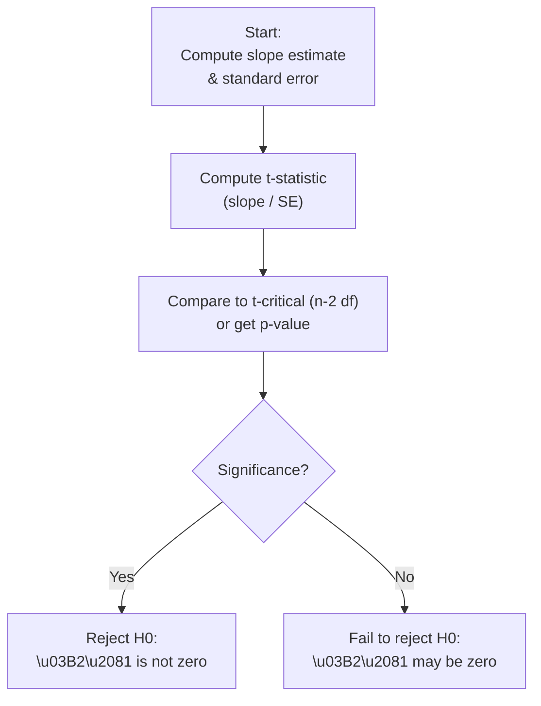

## Overview and Motivation

So, you’ve estimated a simple linear regression model. You’ve got an intercept (often called \\(\beta_0\\)) and a slope (\\(\beta_1\\)) that you believe describes the relationship between an independent variable \\(X\\) (maybe the market returns) and a dependent variable \\(Y\\) (possibly a stock’s returns). The next question is classic in statistics: Are these estimated coefficients actually meaningful, or could they just be the result of random noise?

This section explores how to conduct hypothesis tests on both the slope and intercept of a simple linear regression model. We’ll talk about the famous t-test, confidence intervals, and the interpretation that connects them all back to real-world financial analysis, such as deciding if there’s a significant linear relationship between market movements and an asset’s returns.

We’ll keep it slightly informal. I remember when I first started analyzing stock market data, I got excited whenever I saw a slope that wasn’t zero. But then—whoa—I realized that just because it’s not zero in my tiny sample doesn’t mean it’s “actually” not zero in the population. Hypothesis testing was my wake-up call, teaching me to quantify my uncertainty.

## Recap: Simple Linear Regression Setup

Recall from previous sections like 10.1 (The Least Squares Criterion) and 10.2 (Assumptions of the Simple Linear Regression Model) that if we’ve modeled:

Y = \beta_0 + \beta_1 X + \varepsilon,

then \\(\hat{\beta}_0\\) and \\(\hat{\beta}_1\\) are the estimated coefficients via ordinary least squares (OLS). We typically want to test:
1. Is \\(\beta_1\\) meaningfully different from zero? (That checks if \\(X\\) is associated with \\(Y\\).)  
2. Is \\(\beta_0=0\\)? (That can matter in special contexts—but more on that soon.)

## Testing the Slope (\\(\beta_1\\)) for Significance

### Formulating the Hypotheses

Most commonly, we start with the slope. We can think of a real-world scenario where \\(X\\) might be a market factor, such as a broad equity index, and \\(Y\\) is a specific asset’s returns. If \\(\beta_1\\) is significantly greater than zero, that suggests a positive linear relationship.

• Null Hypothesis (\\(H_0\\)):  

\beta_1 = 0 \quad (\text{no linear relationship}).


• Alternative Hypothesis (\\(H_a\\)):  

\beta_1 \neq 0 \quad (\text{two-sided test}),
  
or  

\beta_1 > 0 \quad \text{(one-sided test, if we suspect a positive relationship)},  
  

\beta_1 < 0 \quad \text{(one-sided test, if we suspect a negative relationship)}.


In capital market contexts, you might often see a two-sided test because you’re open to the possibility that \\(\beta_1\\) could be positive or negative.

### The t-Statistic

We compute the t-value for \\(\hat{\beta}_1\\) like this:  

t = \frac{\hat{\beta}_1 - 0}{\mathrm{SE}(\hat{\beta}_1)}.
  
The denominator \\(\mathrm{SE}(\hat{\beta}_1)\\) is the standard error of \\(\hat{\beta}_1\\). For a sample of \\(n\\) observations and one independent variable, \\(\mathrm{SE}(\hat{\beta}_1)\\) often comes from the residual variance divided by the total variation in \\(X\\).

You compare that computed t-value against a critical t-value from the \\(t\\)-distribution with \\(n-2\\) degrees of freedom (because in simple linear regression, we lose 2 degrees of freedom—one for the intercept, one for the slope). Or, equivalently, you can look at the p-value. If the p-value is less than your chosen significance level (like \\(\alpha = 0.05\\)), you reject \\(H_0\\). In practice, software will do all the heavy lifting: just read “Pr > |t|” or something similar in the output.

### Finance Example

Let’s imagine you have 20 monthly data points for an exchange-traded fund (ETF) that tracks technology stocks. You regress the ETF’s monthly returns (\\(Y\\)) on the S&P 500 monthly returns (\\(X\\)). Suppose your software yields:

• \\(\hat{\beta}_1 = 1.10\\)  
• \\(\mathrm{SE}(\hat{\beta}_1)=0.20\\)  
• \\(n=20\\)

Then,

t = \frac{1.10}{0.20} = 5.50.


With 18 degrees of freedom (\\(n-2=18\\)) and a typical \\(\alpha=0.05\\), a t-stat of 5.50 is huge. We quickly see the p-value is very small, so we’d reject \\(H_0\colon \beta_1=0\\). Interpretation? The ETF returns move strongly in line with the market, with an estimated slope of 1.10. That means, for a 1% move in the market, the ETF moves about 1.10% on average.

## Testing the Intercept (\\(\beta_0\\)) for Significance

### Why Test the Intercept?

A lot of times, people aren’t super interested in the intercept. If you’re analyzing a stock’s returns versus the market, the intercept might be interpreted as the asset’s alpha. Testing if \\(\beta_0 = 0\\) is effectively testing if the alpha is zero. But in other contexts, maybe the regression is about supply and demand, or about cost when \\(X=0\\). If you want to see if the cost is truly zero at the baseline, you might test that intercept.

### Formulating the Hypotheses

It’s basically the same approach as with the slope:

• Null Hypothesis (\\(H_0\\)):  

\beta_0 = 0.


• Alternative Hypothesis (\\(H_a\\)):  

\beta_0 \neq 0, \quad \beta_0 > 0, \quad \beta_0 < 0,
  
depending on whether it’s two-sided or one-sided.

### The t-Statistic for the Intercept


t = \frac{\hat{\beta}_0 - 0}{\mathrm{SE}(\hat{\beta}_0)},
  
and again we compare to a \\(t\\)-distribution with \\(n-2\\) degrees of freedom. 

In finance, if you’re testing for alpha, a significantly positive \\(\hat{\beta}_0\\) indicates that, when the market factor is zero, your returns are significantly above zero—i.e., you may have a positive alpha. But be cautious; if your slope is large and the data points for \\(X\approx 0\\) are limited, the intercept test might be less meaningful.

## Confidence Intervals for \\(\beta_1\\)

### Basic Formula

You might prefer constructing a confidence interval (CI) around \\(\hat{\beta}_1\\) rather than just deciding to reject or not reject \\(H_0\\). A common \\((1-\alpha)\\)\\(\times 100\%\\) CI is:

\hat{\beta}_1 \pm t_{\alpha/2,\,n-2} \times \mathrm{SE}(\hat{\beta}_1).

For instance, a 95% confidence interval for \\(\beta_1\\) is:

\hat{\beta}_1 \pm t_{0.025,\,n-2} \times \mathrm{SE}(\hat{\beta}_1).

If this interval does not include 0, that implies you would reject \\(H_0 : \beta_1 = 0\\) at the 5% level.

### Interpretation in Finance

Having an interval for a regression slope is often more informative. In practice, if you’re analyzing a bond fund vs. an aggregate bond index, you might decide that if the slope is between 0.90 and 1.10, you classify your fund as having “normal” sensitivity. If your slope’s CI is significantly higher than 1.10, you might say your bond fund is more sensitive to interest rate changes than the aggregate index.

## Diagrams: Hypothesis Testing Flow

Below is a simple Mermaid diagram representing a top-level flow of how you might proceed with testing the slope coefficient in a linear regression:



## Practical Interpretation

### Significance Levels and p-Values

• If the p-value is below \\(\alpha\\) (often 0.05 or 0.01), we say the result is “statistically significant.”  
• “Statistically significant” doesn’t always mean “important.” Practitioners should consider economic significance (is the slope big enough to matter in practical portfolio decisions?).

### Common Pitfalls

• Overemphasis on the Intercept Test: Testing \\(\beta_0 = 0\\) might not always be that insightful unless you have a domain reason (e.g., alpha).  
• Type II Errors (Insufficient Power): Not finding significance doesn’t automatically prove there’s no relationship. Maybe your sample size is just too small.  
• Data Snooping: If you keep testing many different relationships, some might appear significant by chance. Always keep track of how many hypotheses you truly test.

### A Quick Python Snippet (Optional)

If you’re curious how you might code a t-test for slope in a quick script:

```python
import numpy as np
from scipy import stats

beta_hat = 1.10
SE_beta_hat = 0.20
df = 18  # degrees of freedom, n-2

t_stat = beta_hat / SE_beta_hat
p_value = (1 - stats.t.cdf(abs(t_stat), df=df)) * 2  # two-sided

print("t-statistic:", t_stat)
print("p-value:", p_value)
```

This snippet uses SciPy to compute a p-value. If the p-value’s below your alpha, you reject the null.

## Connections to Other Chapters

• Chapter 8 (Hypothesis Testing) includes more about significance levels, Type I and II errors, and parametric test procedures like t-tests.  
• In multiple regression contexts (see Chapter 14), you’ll simultaneously test many slopes (\\(\beta_1,\beta_2,\dots\\)). The concept remains similar; each coefficient has a t-value.  
• Chapter 3 (Statistical Measures of Asset Returns) is a nice refresher on sample means and variances, building up to regression analysis.

## Exam Tips and Common Challenges

• Prepare to do quick mental or calculator-based t-tests on the exam. You might see a vignette with a partial regression output table asking you to evaluate whether the slope is significant.  
• Know exactly how to interpret the p-value and confidence intervals: if the 95% CI for \\(\beta_1\\) excludes zero, you’d reject the null at the 5% level.  
• Watch for trick questions about the intercept: sometimes exam questions revolve around whether alpha is significantly different from zero.  
• Time management: in a constructed-response setting, be succinct yet precise. Mention the null, the alternative, the computed statistic, how it compares to the critical value or p-value, and your conclusion.

## References

- Maddala, G. S., & Lahiri, K. (2009). Introduction to Econometrics. Wiley.  
- [Penn State Online–STAT 501: Regression Inference](https://online.stat.psu.edu/stat501/lesson/7)  

-----

## Test Your Knowledge: Hypothesis Testing on Slope and Intercept



### Which of the following best represents the typical null hypothesis for the slope in a simple linear regression?

- [ ] H₀: β₁ ≠ 0
- [ ] H₀: β₁ > 0
- [x] H₀: β₁ = 0
- [ ] H₀: β₁ < 0

> **Explanation:** The most common null hypothesis is that there is no relationship (β₁ = 0).

### When conducting a two-sided t-test for β₁ ≠ 0, which rejection region is appropriate at the 5% significance level for n-2 degrees of freedom?

- [ ] |t| < t₀.₀₂₅
- [x] |t| > t₀.₀₂₅
- [ ] t < -t₀.₀₂₅
- [ ] t > t₀.₀₂₅

> **Explanation:** For a two-sided test with α = 0.05, we reject H₀ if the absolute value of our t-statistic exceeds the critical value t₀.₀₂₅.

### In testing the intercept, which of the following statements is correct?

- [ ] The intercept is always critical in every regression model.
- [ ] If the intercept is tested, the total degrees of freedom for the slope disappears.
- [x] Testing the intercept follows a similar t-test structure, using SE(β₀).
- [ ] The confidence interval for the intercept is always centered at 0.

> **Explanation:** Testing β₀ = 0 uses the same procedure: (estimated intercept – hypothesized value) / SE(β₀).

### A researcher obtains a slope of 0.25 with a standard error of 0.05 from 30 data points. Which of the following is the correct t-statistic?

- [x] 5.0
- [ ] 0.20
- [ ] 1.25
- [ ] 2.5

> **Explanation:** t = 0.25 / 0.05 = 5.0.

### Suppose you have a 95% confidence interval for β₁ that is (0.10, 0.50). Which one of the following conclusions is most appropriate?

- [ ] You fail to reject H₀: β₁ = 0 because 0 is always considered more plausible.
- [ ] The slope is not statistically significant.
- [ ] The intercept must be zero.
- [x] You reject H₀: β₁ = 0 because the interval does not include 0.

> **Explanation:** If zero is not in the CI, the test rejects the null at that significance level.

### What does a p-value represent when testing the slope?

- [ ] The guaranteed truth of the null hypothesis.
- [ ] The probability the null hypothesis is true.
- [x] The probability of obtaining a test statistic at least as extreme as the one observed, assuming H₀ is correct.
- [ ] The probability the alternative hypothesis is false.

> **Explanation:** p-values measure how likely it is to see data at least as extreme as what you observed, under the assumption the null hypothesis holds.

### When would a one-sided test on β₁ be more appropriate than a two-sided test?

- [x] When theory strongly indicates the slope should only be positive or only be negative.
- [ ] When the intercept is definitely zero.
- [x] When we have prior knowledge that β₁ cannot be negative or cannot be positive.
- [ ] When the sample size is small.

> **Explanation:** If you have good reason to suspect that β₁ > 0 (or < 0) and no interest in the other direction, you can use a one-sided test.

### Which of the following is NOT a potential pitfall of interpreting a non-significant slope?

- [ ] The sample size might be too small.
- [x] Concluding that β₁ is definitely zero.
- [ ] The test might be under-powered.
- [ ] There could be measurement error in the data.

> **Explanation:** Failing to reject H₀ does not confirm that β₁ is exactly zero; it just means you don’t have enough evidence to say it’s different from zero.

### In a regression model examining alpha for a mutual fund, testing the intercept for significance primarily seeks to determine:

- [x] If the fund’s alpha is significantly different from zero.
- [ ] If β₁ = 1.
- [ ] The optimal weighting of the fund in a portfolio.
- [ ] The shape of the distribution of residuals.

> **Explanation:** In finance, the regression intercept often represents alpha. A significant positive intercept suggests alpha is above zero.

### True or False: A 99% confidence interval for β₁ will always be narrower than a 95% confidence interval for β₁.

- [ ] True
- [x] False

> **Explanation:** A higher confidence level (99% vs. 95%) yields a wider interval, not a narrower one.


