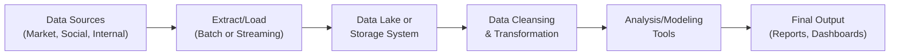

## Introduction
Data can be a goldmine or a headache—sometimes both. In the financial realm, we see an explosion of data from all sorts of places: trades, social media, corporate filings, website traffic, you name it. I remember my first project that involved parsing thousands of lines of messy CSV data from multiple market data providers, and it felt like wrestling jellyfish—every time I thought I had a handle on it, something would slip away. But hey, that’s half the fun, right?

In this section, let’s walk through the why and how of collecting and cleansing data for financial applications. We’ll talk about where you can get that data, how to build data pipelines, how to ensure the data stays healthy and consistent, and what pitfalls you might want to watch out for. We’ll also cover some best practices that are now standard across big data and data engineering. Our end goal? Make sure you have a roadmap to keep your data organized, accurate, and ready for the next step—analysis, modeling, or whatever you need to do.

## Sources of Financial Big Data
Financial data isn’t just about price and volume numbers anymore. It’s about everything that informs those metrics—behavioral trends, company fundamentals, macroeconomic indicators, or even real-time satellite imagery.

### Market Data Providers
Services like Bloomberg, Refinitiv, and S&P Global (to name a few) deliver massive streams of market quotes and fundamental datasets. These are typically well-structured, but the fees can get expensive, and proprietary data feeds sometimes have unique nuances. For instance, if you’re building a bond portfolio model, you’ll need accurate time series for yields across maturities. At times, differences in data vendors’ cleaning or rounding processes can lead to small but meaningful discrepancies.

### Exchanges and Brokerage Networks
Exchange data can come directly from order books, transaction logs, or real-time event streams. In high-frequency trading contexts, nanoseconds matter. Also, keep in mind that regulatory frameworks around the world require that certain transaction data be published in near real-time (though specifics vary by jurisdiction). Watch out for inconsistent classifications or delayed data from cross-border exchanges.

### Social Media Platforms
Twitter, LinkedIn, Reddit forums, and specialized communities can act like the “pulse” of market sentiment. Some firms even scrape social media sentiment daily to gauge investor mood. Obviously, be careful—the noise can be massive, and a single rumor can send you on a wild goose chase. That said, if harnessed well, these sources can provide alpha signals for strategies like event-driven trading or brand sentiment analysis.

### Alternative Data Sources
Satellite imagery, credit card receipts, geolocation information, or even shipping data can all hint at company performance or broader market trends well before official earnings reports. I once saw an investment manager analyze the parking lot traffic at a nationwide chain of department stores—counting cars via satellite images—to predict holiday sales. The potential here is huge, but the data is often unstructured and may require specialized skills to make sense of it.

### Internal Organizational Systems
Any firm’s own CRM (Customer Relationship Management) or ERP (Enterprise Resource Planning) systems can also produce uniquely valuable data. For instance, a bank’s trove of transactional data can inform credit risk models, or a wealth management firm’s internal dashboards might supply client profiles for a better marketing strategy. Integrating these internal data points with external feeds can lead to strong predictive analytics or a more holistic view of your client base.

## Ingestion and Integration
Collecting data is one thing; getting it consistently into your own systems is another. Whether we’re talking about real-time streaming or daily batch jobs, a robust data pipeline can help you keep everything synced and ready for prime time.

### Building Data Pipelines
A data pipeline is basically a sequence of steps from the point you grab the data to the point you store or analyze it. Below is a simple high-level diagram illustrating a data pipeline for financial applications:



#### Batch vs. Real-Time
• Batch Processing: You ingest large blocks of data at regular intervals (e.g., daily or weekly), which is often suitable for historical trend analysis or portfolio rebalancing.  
• Streaming Data: Real-time ingestion of market data feeds, social media streams, or IoT sensors (if you’re using alternative data). Trading desks with an ultra-low-latency requirement thrive on such pipelines, but the infrastructure is complex—one small glitch might disrupt everything.

### Methods of Data Collection
• APIs: Commonly offered by data vendors; you can code scripts that call on these interfaces, retrieving updates periodically or continuously.  
• Web Crawlers: Tools that systematically visit and extract data from websites. Good for unstructured data like news headlines, though you must be mindful of legality (robots.txt, usage rights, etc.).  
• Direct Feeds: Direct integration with exchange servers or proprietary aggregator networks. Usually the fastest but can be cost-intensive.

Below is a short Python snippet that shows how you might set up a simple data ingestion using an API (hypothetical endpoint for demonstration):

```python
import requests
import pandas as pd
import datetime

API_KEY = 'your_api_key'
API_URL = 'https://api.premiumdata.com/v1/marketdata'

def fetch_market_data(symbol, start_date, end_date):
    params = {
        'symbol': symbol,
        'start': start_date.strftime('%Y-%m-%d'),
        'end': end_date.strftime('%Y-%m-%d'),
        'api_key': API_KEY
    }
    response = requests.get(API_URL, params=params)
    
    if response.status_code == 200:
        data_json = response.json()
        df = pd.DataFrame(data_json['prices'])
        return df
    else:
        raise Exception(f"Failed to fetch data, error code: {response.status_code}")

df_data = fetch_market_data('AAPL', datetime.date(2025,1,1), datetime.date(2025,3,1))
print(df_data.head())
```

This code is obviously very simplified, but it demonstrates how easy it can be to connect to a vendor’s API, parse the JSON response, and convert it to a DataFrame for further processing.

## Data Cleansing and Preprocessing
Once you’ve got all the data into your environment, you often realize it’s not quite perfect. Maybe you have missing prices for certain timestamps, or half the tweets are in a foreign language you don’t care about. This is where data cleansing steps in, ensuring that your data is consistent and analysis-ready.

### Handling Missing Data
• Interpolation: Estimate missing values using linear or other methods. Can be practical for stable time series.  
• Forward/Backward Fill: Take the last known value and carry it forward (or backward). Common in financial modeling but be sure you’re not introducing bias.  
• Imputation: For more complex datasets, especially with alternative data, you can model missing values using machine learning.  

### Outlier Detection and Treatment
Financial data often has spikes—especially during volatile markets or unexpected news events. You might keep them if they reflect real events. But sometimes weird outliers indicate data errors. Techniques include:  
• Z-score thresholds (e.g., removing data points that are more than 3 standard deviations from the mean).  
• Winsorizing (capping the top and bottom of your distribution).  
• Using robust estimators (median-based) that are less sensitive to outliers.

### Data Transformation
Normalization or standardization becomes crucial if you’re feeding the data into models that assume certain statistical distributions (like logistic regression or neural networks). For categorical fields—for instance, sectors or countries—a simple label encoding or one-hot encoding can do the trick. For example, you might transform a “Sector” column into multiple columns of zeros and ones, each representing a different sector.

### Deduplication
It can happen that, in your pipeline, you load the same record multiple times, or multiple data vendors supply the same content. Duplicates can lead to overcounting or inaccurate weighting in your models. A robust deduplication step—often just grouping by a unique ID or timestamp and removing repeats—can fix that.

## Quality Checks
Data quality can degrade quickly with the sheer volume of updates, potential system issues, or vendor errors. Setting up automated checks helps you spot problems before they spread through your entire pipeline.

### Accuracy, Completeness, Timeliness, and Consistency
These are the four pillars of data quality. For instance, do your bond yields match the official source from the U.S. Treasury website (accuracy)? Do you have a price for every trading day (completeness)? Are you capturing daily data shortly after the close (timeliness)? Are your currency quotes consistent across the entire data set (consistency)?

### Automated and Ongoing Validation
Many institutional data teams build scripts that cross-check multiple data feeds. If a suspiciously large gap appears between two providers, the system raises an alert. Setting up scheduled jobs or real-time triggers for these checks is vital. The earlier you catch errors, the easier they are to fix.

## Data Governance
With great data comes great responsibility. Data governance ensures you have clear processes for how data flows, how it’s stored, who can access it, and how it’s ultimately used.

### Metadata and Lineage
You want to track the origin of each dataset, what transformations it went through, and where it ends up. In the event of an audit, robust lineage details can help you demonstrate compliance with relevant regulations. Tools exist (like Apache Atlas or AWS Glue) that can automate a large chunk of this documentation.

### Version Control and Documentation
Admittedly, it might feel like overkill to version-control your data, but in finance, small changes can lead to big differences in analytics and compliance obligations. If your historical dataset is updated or corrected, you should maintain a record of that version and the reason for the change. This can be as simple as labeling your data with version tags or as elaborate as using specialized data lake frameworks that embed versioning.

Remember that from a CFA Institute Code of Ethics perspective, you also have a responsibility to handle client data carefully and maintain confidentiality of sensitive data. Overlooking these obligations could breach professional conduct standards.

## Common Pitfalls
You might face these pitfalls—or see them show up in exam scenario-based questions—when dealing with data:

• Over-Reliance on One Vendor: Relying on a single provider might reduce integration headaches, but if that feed has a major outage, you’re stuck.  
• Ignoring Data Drift: Data changes over time. If you’re not re-checking distributions or re-training models, you may make flawed decisions down the line.  
• Underestimating Storage and Compute: As your historical database grows, so do your infrastructure costs. Plan capacity carefully.  
• Lacking a Recovery Plan: Suppose your main pipeline breaks. Do you have a backup? Or a historical snapshot you can revert to?

## Glossary
**Data Pipeline** – A sequence of steps to move data from acquisition to analysis or storage.  
**Data Cleansing** – Identifying and fixing (or removing) incorrect, incomplete, or inconsistent data.  
**API (Application Programming Interface)** – A set of protocols for building and interacting with software applications.  
**Data Governance** – Policies and processes ensuring data is high-quality, secure, and properly used.  
**Data Drift** – Changes in data distributions or relationships over time, potentially impacting model performance.  
**Batch Processing** – Periodic processing of large sets of data.  
**Streaming Data** – Data that arrives continuously in real time.

## References and Further Reading
• Wes McKinney, Python for Data Analysis, O’Reilly Media, 2018.  
• Jules J. Berman, Principles of Big Data: Preparing, Sharing, and Analyzing Complex Information, Morgan Kaufmann, 2013.  
• Online resources on data engineering from Databricks: https://databricks.com/

## Test Your Knowledge: Data Collection & Cleansing in Finance



### Which of the following is an example of a structured financial data source?
- [ ] Social media streams
- [x] Market data feeds from providers like Bloomberg or Refinitiv
- [ ] Satellite imagery of company parking lots
- [ ] Web-scraped blog posts

> **Explanation:** Structured financial data typically comes in a defined format, such as CSV or JSON, often supplied by commercial data providers.

### A “forward fill” approach to handle missing stock prices means:
- [ ] Assuming 0 for any missing value
- [ ] Removing all missing entries from the dataset
- [x] Filling the missing timeslot with the last known price
- [ ] Using the average of all known prices

> **Explanation:** Forward fill propagates the last recorded value to the missing timestamps, a common practice in many time-series analyses.

### When normalizing data for certain analytical models, the primary objective is:
- [x] Scaling variables so they have comparable ranges or distributions
- [ ] Eliminating outliers above a specific threshold
- [ ] Converting text to numeric labels
- [ ] Reducing the size of the dataset for cost savings

> **Explanation:** Normalization ensures each feature contributes proportionately in models that assume similar scales across input dimensions.

### Data drift can occur if:
- [ ] The data pipeline is always stable and never changes
- [x] The underlying data distribution changes over time
- [ ] No transformations are applied to the data
- [ ] Data is never updated

> **Explanation:** Over time, real-world conditions change and can cause shifts in data distribution, which impacts model performance.

### Which best describes a potential pitfall of relying on a single data vendor?
- [x] Vulnerability to outages or data feed disruptions
- [ ] Enhanced data verification
- [ ] Reduced storage costs
- [ ] Guaranteed improved data quality from consistent sources

> **Explanation:** A single vendor solution can leave you without alternatives if that provider experiences downtime or quality issues.

### Deduplication mainly addresses:
- [x] Eliminating repeated records in your dataset
- [ ] Increasing the dimension of your feature set
- [ ] Decreasing the total number of columns
- [ ] Introducing artificial outliers for robust models

> **Explanation:** Deduplication focuses on removing repeated entries, preventing inaccurate weighting or skewed analyses.

### Outlier detection tools, such as z-score thresholds, can help:
- [x] Identify data points that deviate significantly from the mean
- [ ] Fill missing values via forward fill
- [x] Decide whether to cap or remove spurious values
- [ ] Force the data into a standard scale

> **Explanation:** Z-score thresholds help identify extremely high or low values; you can choose how to handle those outliers (e.g., remove, winsorize).

### Data governance ensures:
- [x] Proper data usage, security, and lineage tracking
- [ ] Data is loaded faster
- [ ] API calls are always free
- [ ] Outliers are automatically removed

> **Explanation:** Governance involves policies and frameworks aimed at data integrity, control, and compliance.

### In finance, streaming data ingestion is particularly critical for:
- [x] High-frequency trading strategies and real-time risk monitoring
- [ ] Long-term buy-and-hold investors only
- [ ] Academic research with stable data
- [ ] Post-trade accounting processes

> **Explanation:** Real-time or streaming data is crucial for fast-paced and time-sensitive trading and risk management decisions.

### True or False: Metadata tracking (data lineage) is essential for audit and compliance reasons.
- [x] True
- [ ] False

> **Explanation:** Metadata and lineage provide transparency and traceability, addressing both regulatory and operational needs.


