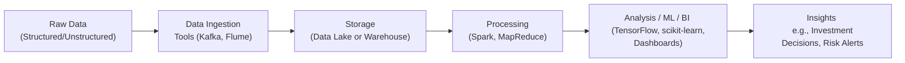

## Introduction

So, let me start by admitting something: when I first heard the words “Big Data,” I was honestly somewhat overwhelmed. I pictured these massive server farms humming away, and I thought, “This is so different from what we do in day-to-day finance.” Well, as it turns out, Big Data is definitely a big deal in investment management, equity research, risk analytics—you name it! By leveraging distributed processing frameworks, advanced analytics tools, and specialized database systems, practitioners can extract insights from enormous amounts of information. And because the finance world generates staggering amounts of data (think of daily transaction records, price movements, economic indicators, and more), it’s becoming essential to master these new technologies if you want to stay relevant.

Even if you are a little skeptical, the entire data landscape is shifting. In earlier chapters, like our discussion of simulation methods in Chapter 6 or time-series modeling in Chapter 12, we saw how complex computations can be. Now imagine doing that in real time on trillions of data points! That’s where Big Data comes in. Let’s walk through some of the most common techniques and tools, focusing on how they translate into better investment decisions, more robust risk management, and improved operational efficiency in a financial setting.

## Distributed Computing Frameworks

### Hadoop (HDFS + MapReduce)

Chances are, you’ve heard of Hadoop. It’s kind of the “classic” open-source framework that jump-started the Big Data revolution. Hadoop has two main pillars: the Hadoop Distributed File System (HDFS) for storing data spread across many machines, and a programming model called MapReduce for processing all that data in parallel.

• HDFS allows you to store files that are way too large for any single server by breaking them into smaller chunks, distributing them across multiple nodes, and replicating them for fault tolerance. If you’re dealing with historical price data for thousands of securities or daily transaction logs from millions of trades, HDFS can handle it.  
• MapReduce is basically a programming model that splits a large job into small tasks (the “map” step) and then combines or reduces the results during the “reduce” step. Think of it like analyzing each stock’s trading volume separately (map) and then aggregating all those volumes to produce a daily summary (reduce).

For example, suppose your firm wants to process five years of historical intraday ticks for 3,000 global equities. With a traditional single-server approach, it may take an eternity—maybe days or even weeks if the dataset is massive. But with Hadoop, you can spin up a cluster of commodity machines, push your tasks to each node, and get your results much faster.

### Apache Spark

If Hadoop is the granddaddy of Big Data frameworks, Spark is the sprightly younger sibling who does everything in-memory for even faster results. Spark also has the concept of “map” and “reduce,” but it stores intermediate computations in RAM rather than writing them back to disk at every step. Spark is especially powerful for iterative algorithms such as machine learning workflows or complex portfolio risk simulations where data needs to be re-accessed multiple times.

In finance, teams often leverage Spark’s in-memory approach for tasks such as:  
• Pricing complicated structured products with Monte Carlo simulations.  
• Building machine learning models for credit risk or default probability.  
• Handling real-time streaming data from market feeds (e.g., Spark Streaming) and updating portfolio analytics on the fly.

## Data Storage Systems

### NoSQL Databases (e.g., Cassandra, MongoDB)

Traditional relational databases (like MySQL or PostgreSQL) can be excellent at storing structured data, but they may struggle when you have unstructured or semi-structured data that doesn’t fit neat rows and columns—say text from earnings calls, social media sentiment, or logs from algorithmic trading engines. That’s where NoSQL databases come in. They’re designed for high scalability, flexible schema definitions, and quick read or write operations.

• Cassandra is often chosen for time-series data because it’s distributed in a “masterless” way, so you don’t have a single point of failure. That’s ideal for globally distributed financial data.  
• MongoDB is more document-oriented. Let’s say you’re collecting news articles, financial press releases, or user data from a fintech app. You can store each piece of data as a “document” with fields for title, author, date, content, etc., without needing a rigid schema.

### Data Lakes vs. Data Warehouses

If you’re anything like me, you probably used the term “Data Lake” as a buzzword at first. But there’s a real difference between data lakes and data warehouses.

• Data Lake: A giant repository of raw data in its original format. This might include log files, structured tables, images, or text data. Data lakes are flexible—so you can load data quickly and worry about structure later (schema-on-read).  
• Data Warehouse: A highly structured, curated database optimized for complex queries and reporting. Data warehouses often require a defined schema at the time of loading (schema-on-write).

For financial analysts, data warehouses might be great when you have well-defined, consistent data structures like daily portfolio holdings or monthly performance reports. If you’re uncertain about the precise format or schema, or if you’re collecting raw unstructured data (like real-time option chain updates or social media feeds), a data lake can give you more freedom to experiment and figure out what your analyses will look like later.

## Data Transformation and Analysis

### MapReduce Paradigm

Even though Spark is kind of the next big thing, the principle behind MapReduce is still fundamental. You break large tasks into small tasks that can be run in parallel, map them out across a cluster, and then combine results. This is the essence of parallelizing the workload. So if you’re analyzing, say, credit card transactions for fraud detection, you can run a mapping function that flags anomalies on each chunk of data, and then reduce by aggregating suspicious transactions across the entire dataset.

### Stream Processing (Kafka, Flink)

In many financial scenarios—like real-time trade surveillance or high-frequency trading—waiting until the end of the day to run your queries just won’t cut it. That’s where tools like Apache Kafka and Apache Flink come in. Kafka is primarily a distributed messaging system that captures data streams and feeds them to consumer applications. Flink is a processing engine for real-time (and batch) data that can do advanced operations—like windowing and stateful computations—on the go.

Picture reading new transactions or price quotes in near real time, processing them through your anomaly detection or event-driven risk triggers, and then storing results in a live dashboard. These technologies make it possible to respond quickly, which is crucial for risk management and compliance tasks that need immediate attention.

### Graph Analytics (e.g., Neo4j)

Honestly, graph databases felt like magic to me at first. They are specialized for relationships, so if you’re analyzing networks—like corporate ownership ties, social networks between top investors, or chain-of-custody relationships in clearinghouses—a graph database is fantastic for seeing those connections. For instance, you might use Neo4j to detect hidden relationships in insider trading networks, or to see complicated linkages between thousands of entities in a conglomerate. You can store nodes and edges that represent entities and their relationships, then run powerful graph algorithms to find connections or anomalies extremely efficiently.

## Machine Learning Libraries and Platforms

### TensorFlow and PyTorch

Deep learning has made a splash in finance for tasks like natural language processing (think parsing annual reports or analyzing social media sentiment) and image recognition (yes, even in finance, but typically for things like satellite imagery of store parking lots). TensorFlow (by Google) and PyTorch (by Meta) are two popular libraries that allow you to build and deploy neural networks at scale.

In an investment analysis context, you might be training a recurrent neural network (RNN) on time-series data to forecast risk factors or market movements. Or maybe you want to embed textual data from earnings calls into vector representations to feed into a portfolio optimization model. These libraries handle all the nitty-gritty linear algebra for you, so you can focus on experimentation and iterative improvements.

### Scikit-learn

If you’re just starting in machine learning or need a reliable library for classical approaches (like linear regression, logistic regression, random forests, support vector machines, etc.), you can’t really go wrong with scikit-learn in Python. It’s user-friendly, and it integrates nicely with data manipulation libraries (like pandas).

I love using scikit-learn for quick proofs-of-concept—like building a classification model to detect fraudulent transactions or a regression model to predict next-day price changes. Because scikit-learn is so popular, there’s a ton of documentation and community support. If you get stuck, you can usually find an existing solution on GitHub or Stack Overflow.

### AutoML

AutoML is the concept that appeals to many who don’t want to spend hours hyper-tuning parameters or selecting from dozens of algorithmic approaches. Tools like Google Cloud AutoML, H2O.ai, or Automated Machine Learning in Azure can handle a lot of the routine tasks—feature selection, hyperparameter optimization, even model architecture in deep learning. This can free you up to do more high-level analytics and interpret results. That said, you still need a firm grasp on data quality, domain knowledge, and the underlying business logic. AutoML doesn’t solve everything, but it sure can accelerate your turnaround time.

## Cloud-Based Offerings

You’ve probably heard of AWS, Azure, and Google Cloud. Seriously, all three have extensive platforms for Big Data. You can spin up managed clusters of Hadoop or Spark, store data in S3 or Azure Blob Storage, and tap into built-in ML frameworks. The benefit is the pay-as-you-go model, which can be more cost-effective than maintaining your own on-premise servers—especially if you anticipate sporadic or bursty workload demands for certain analytics tasks.

In a portfolio management setting, you could rely on AWS EMR (Elastic MapReduce) to process large data sets about security prices and fundamental data, use AWS Glue to orchestrate ETL (extract-transform-load) processes, and finally push everything to a model hosted on SageMaker. Or, if you prefer Microsoft’s ecosystem, you could combine Azure Synapse Analytics with Azure ML services. The point is, modern cloud providers allow you to pick and choose components that fit your needs without having to physically manage your own hardware.

## Resource Management and Optimization

Managing a fleet of computing resources can feel a bit like juggling. Tools such as Kubernetes and Docker help by “containerizing” your applications so you can easily deploy, run, and scale them across multiple machines. In container orchestration, you define how many replicas of a service you want, and Kubernetes ensures they stay up and running.

Monitoring usage is another big piece. Visualization dashboards (like Grafana, Kibana, or even built-in dashboards from cloud providers) can track CPU usage, memory usage, storage, and network throughput. With automated scaling, your clusters can expand or contract as demand fluctuates. That’s super handy if your risk analytics workloads spike during a market event—think major rate announcements or sudden geopolitical tensions.

## A Quick Visual: Typical Big Data Pipeline

This simplified pipeline shows how data flows from a source to ingestion tools, then to some storage environment (lake or warehouse), followed by data processing at scale using Spark or MapReduce. After that, it’s typically consumed by analytics or machine learning pipelines, culminating in real-time or batch insights that shape portfolio allocations, alpha generation, or risk mitigation strategies.

## Best Practices and Pitfalls

• Data Quality: Garbage in, garbage out. Real-time streaming data can be messy. Always have robust validation checks.  
• Security and Compliance: Especially in finance, data is often sensitive. Make sure your pipelines comply with regulations (like GDPR).  
• Scalability vs. Cost: While cloud solutions give you flexibility, watch your spending to avoid unpleasant surprises on your monthly bill.  
• Model Risk: Overfitting can be a real menace. Even advanced Big Data solutions won’t save you if your modeling approach is flawed.  
• Interpretability: Complex models (like deep learning) can be tricky to interpret, which could raise compliance concerns in some jurisdictions.  

## Glossary

• “Hadoop Distributed File System (HDFS)”: A file system designed for scalable, fault-tolerant data storage across a cluster of commodity machines.  
• “MapReduce”: A parallel computing paradigm that maps large datasets into smaller chunks for local processing and then reduces partial results into a final output.  
• “In-memory Computing”: Storing data in RAM for faster processing speeds compared to traditional disk-based systems.  
• “NoSQL”: A database category that eschews the rigid schemas of relational databases. Particularly useful for storing unstructured or variable-schema data.  
• “Data Lake”: A centralized repository to hold huge volumes of raw data in multiple formats (structured, unstructured, or semi-structured).  
• “Data Warehouse”: A structured repository designed for complex queries and high-performance analytics against curated data.  
• “AutoML”: Automated Machine Learning platforms that streamline model selection and tuning, accelerating model development.

## Further Reading

• Tom White, Hadoop: The Definitive Guide, O’Reilly Media.  
• Dean Wampler & Jason Gorman, Programming Scala, O’Reilly Media (for functional programming approaches in large-scale data).  
• Documentation for Apache Spark: https://spark.apache.org/docs/latest/  
• Official Kubernetes docs: https://kubernetes.io/docs/home/  
• For basic to advanced ML, see scikit-learn docs: https://scikit-learn.org  

## Final Exam Tips

• Watch for exam questions that delve into the specifics of distributed computing frameworks. Understand the difference between MapReduce and Spark’s in-memory transformations.  
• Be mindful of which storage solution is best for different data types—NoSQL might pop up in a case study or scenario-based question.  
• Expect a question on data lakes vs. data warehouses. They love testing your knowledge of design trade-offs.  
• Clarify how real-time stream processing differs from batch analysis, especially in volatile market conditions.  
• Familiarize yourself with the metrics of resource management, like cluster usage and cost, since practical finance applications live in an environment of constant resource balancing.

And that’s it! If there’s one key takeaway, it’s that Big Data tools aren’t just hype. From credit-risk modeling to high-frequency trading, these frameworks and platforms can make our lives a lot easier. You can start small—maybe with a single-node Spark setup or a trial on a cloud provider—and expand as you need. The main thing is to remain open-minded as you explore how these techniques can streamline your analytics and improve your investment decisions.

---

## Test Your Knowledge: Big Data Tools and Techniques



### Which feature of Hadoop allows for fault-tolerant storage of massive datasets?

- [ ] MapReduce
- [x] HDFS
- [ ] Spark Streaming
- [ ] Kafka

> **Explanation:** Hadoop Distributed File System (HDFS) replicates data across nodes, preventing data loss even if a node fails, thereby offering fault tolerance for huge datasets.

### What is a key advantage of using Apache Spark over traditional MapReduce systems?

- [ ] Spark cannot handle in-memory processing.
- [x] Spark uses in-memory computing for iterative workloads.
- [ ] Spark does not support distributed computing.
- [ ] Spark does not integrate with machine learning libraries.

> **Explanation:** Apache Spark processes data in memory, which speeds up iterative tasks and is more efficient than the disk-intensive MapReduce approach.

### Which database type is most suitable for unstructured or semi-structured data when high scalability is needed?

- [ ] Relational Database (SQL)
- [x] NoSQL Database
- [ ] Flat Files
- [ ] In-house Data Warehouse

> **Explanation:** NoSQL databases like Cassandra or MongoDB can scale horizontally and do not require rigid schemas, making them ideal for unstructured or semi-structured data.

### In a financial context, which system is best suited for real-time stream processing of trade data?

- [ ] HDFS
- [ ] Apache Hive
- [x] Apache Kafka or Apache Flink
- [ ] Batch ETL using MapReduce

> **Explanation:** Kafka is a distributed event streaming platform, while Flink can handle real-time data analytics and streaming. This combination is commonly used for instantaneous processing of market transactions.

### What is the main difference between a data lake and a data warehouse?

- [x] A data lake stores raw data in its native format, whereas a data warehouse typically stores structured data.
- [ ] A data lake cannot store unstructured data.
- [x] A data warehouse often requires a predefined schema (schema-on-write).
- [ ] A data lake requires schema-on-write.

> **Explanation:** Data lakes preserve data in raw form with flexible schemas (schema-on-read), while data warehouses are structured for specific use cases and typically enforce a schema upon data ingestion.

### Which framework is commonly used for container orchestration to manage and scale applications?

- [ ] Hadoop
- [ ] Spark
- [x] Kubernetes
- [ ] MySQL

> **Explanation:** Kubernetes is the de facto standard for orchestrating containers, ensuring high availability and scalability of distributed services.

### What advantage might deep learning frameworks like TensorFlow or PyTorch offer to financial analysts?

- [x] They enable advanced neural network architectures for tasks like NLP and forecasting.
- [ ] They completely replace all existing machine learning methods.
- [x] They cannot handle image or text data.
- [ ] They preclude the need for domain expertise.

> **Explanation:** Deep learning frameworks can handle text, images, and time-series data, making them ideal for tasks like sentiment analysis of earnings calls or advanced quantitative forecasting.

### How does AutoML assist data practitioners?

- [ ] It replaces the need for any machine learning skills.
- [ ] It is only used for image recognition tasks.
- [ ] It eliminates the need for data cleaning.
- [x] It automates model selection and hyperparameter tuning.

> **Explanation:** AutoML can help speed up the machine learning workflow by automating repetitive tasks like algorithm selection or parameter searching, but it still requires oversight and domain knowledge.

### What is a major consideration when running Big Data workflows on the cloud?

- [ ] Physical on-site server constraints
- [x] Monitoring usage and cost escalation
- [ ] Inability to scale horizontally
- [ ] Incompatible with large datasets

> **Explanation:** Cloud providers typically use a pay-as-you-go model. While that allows for scalability, it’s essential to keep an eye on resource usage to avoid unexpected high bills.

### True or False: NoSQL databases always have rigid schema requirements just like relational databases.

- [x] True
- [ ] False

> **Explanation:** Actually, this is false in principle. NoSQL databases generally have flexible or schema-less approaches, making it easier to handle variable data structures. The statement above is contradictory, and the correct stance is that NoSQL is more flexible, not more rigid. 


