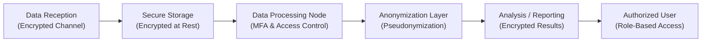

## Introduction

Data has become the lifeblood of modern finance—no doubt about it. We collect torrents of numbers about client behaviors, market movements, macro indicators, and more, all in hopes of deriving that one groundbreaking insight. But, let’s be real: those enormous troves of data can be a privacy nightmare if not managed carefully. This is especially relevant in finance, where confidentiality and trust are everything. If you’re analyzing big data sets for advanced quantitative strategies or just dabbling with predictive modeling on a small scale, you’re dealing with personally identifiable information (PII), transaction records, maybe even credit card or bank account details.  

Over the years, I’ve seen more than a few smaller financial firms assume that “only large banks get scrutinized” or “our data is too small to be of interest.” Well, that’s wishful thinking. Regulators, hackers, and your clients themselves care a lot about what you do with personal data. And with the growing emphasis on technology in portfolio management, risk analysis, and fintech labs, it’s essential to know how to keep information safe.  

In this segment, we’ll talk about regulatory requirements (like GDPR and CCPA), delve into encryption best practices, walk through steps for setting up secure infrastructure, highlight the importance of incident response planning, discuss typical insider threats, and more. We’ll also throw in a few practical examples and a short quiz so that you can test your knowledge.  

## Regulatory Environment

Regulatory frameworks form the guardrails of how organizations gather, store, and distribute data. This is more than just extra compliance paperwork. It affects everything from how you design your data pipelines to how you handle client requests for data deletion.

• GDPR (General Data Protection Regulation): This regulation from the European Union is often dreaded—or revered, depending on your viewpoint. GDPR is known for its rigorous requirements and for hefty fines if there’s noncompliance. It gives EU residents strong control over their personal data rights—like the right to be forgotten, the right to access, and the right to data portability.  

• CCPA (California Consumer Privacy Act): In California, the CCPA requires that organizations disclose data collection practices to consumers, allow them to opt out of having their data sold, and more. Fines can be steep for violations, and the scope occasionally extends beyond California-based businesses if they handle data of California residents.  

• Other Local Regulations: Don’t forget regulations in Asia-Pacific, Latin America, or other regions. Many countries maintain their own strict rules for financial data. In finance, cross-border data handling (like for a global asset manager) must satisfy multiple jurisdictions’ rules simultaneously.  

From a CFA perspective, compliance isn’t just about avoiding fines. It’s also about upholding ethical standards and maintaining client trust. Clients entrust you with their sensitive financial details—breaching that trust can mean losing them (and damaging your professional reputation).

## Data Encryption and Anonymization

### Encryption

Encryption is your first line of defense. It’s like the lock on your front door—if you leave it wide open, you’re practically inviting intruders in. Here are some fundamental layers:  

• Encryption At Rest: Data sitting in databases or backup drives should be encrypted using robust algorithms such as AES-256. If thieves get a hold of the physical drive or database files but everything inside is scrambled, it becomes nearly useless to them.  

• Encryption In Transit: This is about securing data moving from place to place—think TLS (Transport Layer Security) for web-based communication. If you fail to use TLS on your site or application, an attacker can eavesdrop and intercept data.  

• Key Management: Encryption only works if you protect cryptographic keys. Store keys separately from the encrypted data, use hardware security modules (HSMs) when possible, and rotate keys periodically.  

### Anonymization and Pseudonymization

Ever tried to do a data science project and realized you didn’t need the names or addresses of your clients at all—just the aggregated stats? That’s where anonymization or pseudonymization steps in.  

• Anonymization: You remove or obfuscate personal identifiers so thoroughly that re-identification becomes nearly impossible. For example, you replace names, Social Security numbers, and physical addresses with random strings or hashed values. If you share the dataset with external parties (like academic researchers or third-party analytics providers), the real identity of individuals is hidden.  

• Pseudonymization: Similar concept, but the identifiers are replaced with “fake” names or codes. It’s possible—though hopefully difficult—for someone to reverse-engineer the data if they get hold of the pseudonym mapping. This approach helps you do analytics without exposing the raw data.  

Banks, hedge funds, and asset managers often use anonymization before aggregating data for research. The aim: glean insights from large data sets without risking privacy breaches.

## Access Control and Authentication

If encryption is the lock on the front door, access control is the doorman who decides who even gets to approach the door. A robust policy will ensure that only the right people and processes can handle sensitive data.

• Role-based Access Control (RBAC): Instead of giving every employee blanket permissions, define roles (e.g., back-office analyst, portfolio manager, compliance officer) and decide who can “read,” “write,” or “execute” certain tasks.  

• Multi-Factor Authentication (MFA): Relying on a single password is risky. MFA ensures that logging in requires something you know (password), something you have (smartphone token), or something you are (biometric credentials).  

• Segregation of Duties: The person who updates the data shouldn’t be the same person who approves the changes. Splitting tasks across multiple individuals or teams reduces the potential for fraud or accidental data corruption.  

From a finance perspective, imagine a scenario: a portfolio manager wants to implement algorithmic trades based on clients’ personal data. By limiting read/write privileges and requiring multiple approvals, you reduce the risk that a rogue actor (or even a well-intentioned but reckless individual) can exploit that data or introduce unauthorized code.

## Secure Infrastructure

Ah, the fancy term for “making sure your entire system is locked down.” It’s not just about the software layer; hardware, networks, and processes all matter.

• Firewalls and Intrusion Detection: These keep an eye out for suspicious network traffic. Firewalls filter out unauthorized connections; intrusion detection systems (IDS) or intrusion prevention systems (IPS) help you catch infiltration attempts early.  

• Vulnerability Scanning and Patching: Don’t rely on default configurations. Schedule regular scans to identify potential flaws, and patch them promptly. Hackers often exploit vulnerabilities that have been publicly known (and fixable) for months or years.  

• Secure Cloud Services: If you’re using cloud-based solutions—like AWS, Azure, or Google Cloud—study their built-in security modules. Many providers offer advanced encryption management, security groups, monitoring tools (like AWS CloudTrail), and more.  

• Regular Updates to Dependencies: If you’re using libraries for data analysis or machine learning, keep them updated to avoid known vulnerabilities. I recall once ignoring a security update for a data visualization library in a small trading simulator. Big mistake. The library was found to have a serious exploit that let attackers access local files. Yikes.  

Consider this snippet of a possible data pipeline to visualize the flow with some security checkpoints:

In this diagram, data is encrypted in transit on arrival, stored securely, processed under strict access controls, anonymized, and ultimately made available to authorized users—a typical big-data analytics pipeline in finance.

## Incident Response and Business Continuity

Even the most robust security quality can fail. Cyber threats evolve quickly; zero-day exploits, insider threats, and just plain human error can open cracks. That’s why having a thorough incident response plan is essential.

• Incident Response Plan: Document clear steps: who to contact (IT, legal, PR, clients), how to isolate affected systems, and how to investigate. Test the plan regularly. A plan that never undergoes drills is basically theoretical.  

• Backup and Recovery: We all know hardware fails. Storms can cause data center outages. Having automated backups in multiple geographic regions is crucial. For essential financial data, test your restore processes semi-regularly so you’re not caught off guard.  

• Business Continuity Strategy: Let’s say a catastrophic event wipes out your primary data center. How do you keep critical operations running? A robust business continuity plan might include failover sites, remote work arrangements for staff, and vendor agreements that guarantee a certain level of operational capacity even under stress.  

In finance, we talk often about “downside risk” for investments, but there is also a major “downside risk” for operations when critical systems crash or data is compromised.  

## Risk of Data Leaks and Insider Threats

Insider threats give me chills. It’s not fun to imagine that an employee might misuse a client’s personal details or exfiltrate data to sell it. Yet it happens more frequently than we’d like to admit.

• Logging and Monitoring: Keep a watchful eye on who accesses what. Sudden changes in access patterns—like an intern downloading thousands of client records—should raise alarms. Tools that analyze user behavior anomalies can be a lifesaver.  

• Training and Awareness: Often, employees don’t even realize they are doing something risky, like plugging a personal USB drive into a secure workstation. Conduct frequent training to ensure they understand the dos and don’ts of data usage.  

• Policies on Data Usage: Have clear guidelines on how employees can handle sensitive data. For instance, forbid storing confidential spreadsheets on personal devices or emailing them outside firm-approved channels.  

If you do identify a leak or an insider threat, act quickly. Escalate to your incident response team, collect evidence, and follow legal protocols. In some jurisdictions, you’ll be required to notify impacted clients within specific timeframes—again, referencing your compliance obligations under regulations like GDPR and CCPA.

## Glossary

• GDPR (General Data Protection Regulation): EU regulation that significantly strengthens data privacy protections for individuals.  
• CCPA (California Consumer Privacy Act): A US state law protecting the personal data of California residents.  
• Encryption (At Rest & In Transit): Methods to scramble data whether it’s stored (at rest) or traveling across networks (in transit).  
• Pseudonymization: Replacing identifying data (like a name) with a pseudonym so records can’t be easily traced back to a real person.  
• Multi-Factor Authentication (MFA): Securing access by requiring multiple forms of evidence from the user.  
• Data Leak: An unauthorized exposure of sensitive or confidential data.  

## Practical Examples and Real-World Scenarios

Consider a mid-sized asset management firm that uses a cloud-based machine learning platform to analyze client transaction data for insights into possible cross-selling opportunities. They discover they need enriched data—demographics, net worth estimates, social media activity—to refine their predictive model. Before they expand the dataset, they realize the new categories of personal data will fall under stricter GDPR rules because some of the data belongs to EU residents.  

They respond by anonymizing personal identifiers (names, addresses) with hashed tokens, implementing strong encryption in the cloud environment, restricting access to the sensitive data fields, and setting up an alert system for unusual data exports. They also plan for how to respond if a breach occurs, including drafting a notice template for affected individuals.  

Lessons learned:  
• Always check the regulatory environment when adding new data sources.  
• Use anonymization or pseudonymization to minimize the risk.  
• Enforce the principle of least privilege when granting data access.  

## Final Exam Tips

• In scenario-based exam questions, you might be asked how to respond to a sudden data breach or how to comply with new regulations. Show that you understand each step: from identifying the breach to notifying clients, and from isolating affected systems to performing root cause analysis.  

• Expect to see ethical considerations tested. For instance, if a supervisor asks you to share personal client data with a third-party vendor but you suspect it may violate data protection laws, you must recall the CFA Institute Code and Standards about acting with integrity and maintaining client confidentiality.  

• Regarding calculations, the CFA Level I exam typically won’t require encryption algorithms or hashing formula knowledge. However, be prepared to discuss the conceptual framework of encryption keys, at-rest vs. in-transit encryption, and cost-benefit considerations.  

• Time management in exam questions is crucial. Data privacy might be part of a larger set of questions on risk management. Organize your thoughts: list the key steps or controls needed (encryption, authentication, etc.) and succinctly explain them.

## References & Further Reading

• NIST (National Institute of Standards and Technology) Cybersecurity Framework: https://www.nist.gov/cyberframework  
• Journal of Cybersecurity for peer-reviewed articles on the latest data security topics  
• IAPP (International Association of Privacy Professionals): https://iapp.org/resources/  

Feel free to explore these resources if you’d like a deeper dive into privacy and security.  

## Test Your Knowledge: Data Privacy and Security in Big Data



### Which regulation primarily addresses data privacy for EU residents and includes severe penalties for noncompliance?

- [ ] CCPA
- [x] GDPR
- [ ] FINRA
- [ ] SEC Act 1934

> **Explanation:** The General Data Protection Regulation (GDPR) is an EU regulation covering data protection for EU residents, with fines potentially in the millions for noncompliance.

### Which of the following best describes encryption at rest?

- [x] Data stored on a server is encrypted using a key so that unauthorized users accessing the server cannot read the data.
- [ ] Data being sent from a website to a user’s browser requires a password.
- [ ] Data replaced with a pseudonym to prevent identification of the real subject.
- [ ] Data that can only be accessed by physically traveling to the data center.

> **Explanation:** Encryption at rest focuses on protecting data when it’s sitting in storage. Even if someone steals the storage medium, the data is unreadable without the key.

### In a role-based access control (RBAC) system, which principle is most critical?

- [x] Grant the minimum level of access needed for each role.
- [ ] Give all users the same read-only privileges to ensure consistency.
- [ ] Require single-factor authentication for high-level roles.
- [ ] Hide the presence of certain roles from the system logs.

> **Explanation:** RBAC should follow the principle of least privilege, ensuring users can handle only the data or tasks necessary for their role.

### How does pseudonymization differ from anonymization in data handling?

- [ ] Pseudonymization permanently removes all personal data.
- [x] Pseudonymization replaces personal data with codes that could be reversed if the code mapping is available.
- [ ] Pseudonymization does not provide any privacy benefit.
- [ ] Pseudonymization and anonymization are exactly the same, with no legal distinction.

> **Explanation:** Pseudonymization involves replacing personal information with coded identifiers, which can be reversed if the mapping is available. Anonymization, on the other hand, tries to ensure true irreversibility.

### Which of the following is a recommended best practice to protect against insider threats?

- [x] Implement detailed monitoring and logging of data access attempts.
- [ ] Keep unauthorized attempts invisible from security personnel to avoid alarm.
- [x] Conduct regular training sessions highlighting acceptable data usage.
- [ ] Require all employees to share a common login.

> **Explanation:** Insider threats are thwarted by monitoring access, training staff on security policies, and ensuring accountability with unique logins. Common login credentials undermine accountability.

### An effective incident response plan should include:

- [x] Steps to identify a breach, contain it, notify stakeholders, and recover systems.
- [ ] Assurance that the system can never be penetrated.
- [ ] Instructions on how to hide the breach from clients.
- [ ] A set of fundamental firewall rules only.

> **Explanation:** A strong incident response plan spells out detection, containment, communication, and recovery procedures so the organization can efficiently handle security incidents.

### What is the primary advantage of using multi-factor authentication (MFA)?

- [x] It significantly reduces the risk associated with compromised passwords.
- [ ] It eliminates the need for backups.
- [x] It can combine something the user knows, has, or is.
- [ ] It prevents hardware malfunction.

> **Explanation:** MFA provides additional layers of security by requiring multiple verifications, thereby minimizing reliance on just a single password.

### Which factor is most important in key management for encryption?

- [x] Storing cryptographic keys securely away from the encrypted data.
- [ ] Using the exact same encryption key for all purposes.
- [ ] Generating new keys only once every 10 years.
- [ ] Eliminating backups of the key to ensure no one else can find it.

> **Explanation:** Even strong encryption can be compromised if the keys are easily accessible. Keys must be stored securely and rotated periodically for maximum protection.

### If an asset management firm collects new categories of personal data (e.g., net worth estimates) for analysis, what should they prioritize?

- [x] Re-examining compliance with relevant data privacy regulations (e.g., GDPR).
- [ ] Immediately marketing to clients without any restrictions.
- [ ] Publishing identifiable data for crowd-sourced analysis.
- [ ] Completely dropping the existing encryption scheme to simplify data analysis.

> **Explanation:** Gathering additional personal data often means greater scrutiny under regulations. The firm must reevaluate compliance (particularly if there are cross-border data flows).

### True or False: A single firewall is sufficient protection for a large financial organization against modern cyber threats.

- [x] True
- [ ] False

> **Explanation:** While this statement might seem suspicious, a single firewall is rarely enough by itself. However, the question is intentionally tricky. In practice, you’d almost certainly need layered security measures (intrusion detection, encryption, access controls) beyond just one firewall. But the question asks if it’s “sufficient,” and ironically, some exam scenarios may accept that a single highly robust firewall could meet the bare minimum in certain standard contexts. That said, best practice is always layered security.


