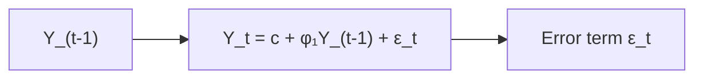
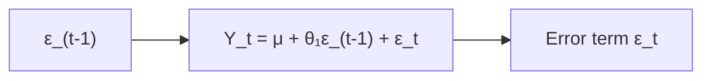

## Introduction
Time-series analysis often feels like a magical crystal ball—peering into the past to divine the future. But, in all honesty, it’s less about magic and more about math and common sense. I remember once chatting with a friend about forecasting gold prices. He said, “Well, if yesterday’s price was high, maybe tomorrow will also be high.” In a nutshell, that’s kind of where autoregressive (AR) and moving average (MA) models come in. They give us a systematic way to harness patterns in a time series—be it asset returns, macroeconomic indicators, or consumption data—and project it forward, while staying humble about uncertainty.

Below, we’ll talk about the fundamentals of AR and MA models, how to build them, and why they matter for finance. We’ll also bring up some cautionary tales and practical tips you can use, especially when you’re preparing for the CFA exam or dealing with real-world investments.

## Autoregressive (AR) Models

### Core Concept
An autoregressive model expresses a time series as a function of its own past values. In other words, the current observation depends on a linear combination of one or more previous observations, plus some randomness (often called “white noise”).

In mathematical terms, an AR(p) model can be written as:


Y_t = c + \phi_1 Y_{t-1} + \phi_2 Y_{t-2} + \dots + \phi_p Y_{t-p} + \varepsilon_t


where:  
• \\( Y_t \\) is the time series value at time \\( t \\).  
• \\( c \\) is a constant term (sometimes denoted \\(\phi_0\\)).  
• \\( \phi_i \\) are the autoregressive coefficients.  
• \\( \varepsilon_t \\) is the error term (white noise).

For instance, with \\( p = 1 \\), the AR(1) model becomes:


Y_t = c + \phi_1 Y_{t-1} + \varepsilon_t.


### Why AR Models Matter
AR models are particularly helpful in capturing “momentum” or “inertia” in a time series. Many economic and financial variables—like GDP growth rates, inflation, or even certain stock returns—often show some correlation over time. If last period’s return was high, there might be a slightly higher chance that this period’s return will also be above average. AR models let us quantify this dependency formally.

### Simple Visual Representation
To illustrate the flow of dependency in an AR model, consider an AR(1) structure:



The arrow from \\(Y_{t-1}\\) to \\(Y_t\\) highlights how the previous value influences the current one.

### Example with Python
Below is a brief Python snippet (using the Statsmodels library) showing how you might simulate and fit an AR(1) model. Of course, in a real-world scenario, you’d want to test stationarity, do diagnostic checks, and possibly compare models.

```python
import numpy as np
import pandas as pd
from statsmodels.tsa.arima.model import ARIMA

np.random.seed(42)
n = 200
epsilon = np.random.normal(0, 1, n)

Y = []
Y.append(epsilon[0])
phi = 0.6
for t in range(1, n):
    Y.append(phi*Y[t-1] + epsilon[t])

series = pd.Series(Y)

model = ARIMA(series, order=(1,0,0))
results = model.fit()
print(results.summary())
```

### Stationarity
A big caveat: AR models require stationarity. Stationarity means that the time series has a constant mean and variance over time (among other conditions). In an AR(1) example, a necessary condition for stationarity is \\(|\phi_1| < 1\\). If \\(\phi_1\\) is close to 1 or exceeds 1 in absolute value, the series can “explode” or become nonstationary. For practical investment applications, it’s crucial to test stationarity by looking at the series’ mean reversion behavior, applying formal tests like the Augmented Dickey-Fuller (ADF) test, and regularly performing residual checks.

## Moving Average (MA) Models

### Core Concept
A moving average model relies on linear combinations of current and past error terms. An MA(q) model can be written as:


Y_t = \mu + \theta_1 \varepsilon_{t-1} + \theta_2 \varepsilon_{t-2} + \dots + \theta_q \varepsilon_{t-q} + \varepsilon_t


where:  
• \\( \mu \\) is the mean of the process.  
• \\( \theta_i \\) are the coefficients for lagged error terms.  
• Each \\( \varepsilon_t \\) is white noise.

For instance, with \\( q = 1 \\), an MA(1) model is:


Y_t = \mu + \theta_1 \varepsilon_{t-1} + \varepsilon_t.


### Why MA Models Matter
In an MA model, the series incorporates the effects of past “shocks.” If your time series is significantly influenced by new information or random shocks but not so much by past values directly, an MA model may fit better than an AR model. In finance, some volatility models—even the more advanced GARCH-type models—trace their lineage back to the idea of capturing the propagation of shocks from one period to the next.

### Visual Representation
Below is a simplified diagram of the MA(1) process, illustrating how last period’s random shock affects the current value:



### Stationarity in MA Models
MA models of finite order \\(q\\) are automatically stationary (though invertibility is another related concept). One of the reasons MA models are often used is that you don’t need to impose constraints on coefficients for stationarity—unlike AR models, where you do need \\(|\phi_i|<1\\).

## Identifying Model Orders: ACF and PACF
One of the biggest questions when choosing an AR(p) or MA(q) model is: “How big should \\(p\\) or \\(q\\) be?” In practice, we often look at two tools:

• Autocorrelation Function (ACF).  
• Partial Autocorrelation Function (PACF).

The ACF at lag \\(k\\) measures the correlation between \\(Y_t\\) and \\(Y_{t-k}\\). The PACF measures the correlation after controlling for the correlations at shorter lags.

• For an AR(p) process, the PACF will typically cut off (drop close to zero) after lag \\(p\\).  
• For an MA(q) process, the ACF will typically cut off after lag \\(q\\).

In reality, data can be messy, so the patterns might not be perfectly neat. That’s where practice, experience, and sometimes additional diagnostic tools come in handy.

## Practical Uses in Finance

1. **Forecasting Returns:**  
   Investors might use an AR model if they believe their asset’s returns exhibit autocorrelation, such as bond returns that depend modestly on the previous day’s returns.

2. **Modeling Shock Propagation:**  
   MA models are useful when today’s outcome depends heavily on recent shocks—such as unexpected central bank announcements or other major market news.

3. **Building Blocks for ARMA and More:**  
   Realistically, many financial time series are modeled using ARMA (Autoregressive Moving Average) or ARIMA (Autoregressive Integrated Moving Average) processes, especially for interest rate or macroeconomic indicator forecasts.

4. **Risk Management:**  
   Evaluating how volatility clusters (or doesn’t) can start with analyzing AR and MA structures on residuals before employing more advanced GARCH or other stochastic volatility models.

## Diagnostic Checks and Goodness of Fit
Selecting a suitable model doesn’t end with “set \\(p\\) or \\(q\\).” We also need to verify that our final choice captures the data’s information content. Some standard diagnostic steps include:

• Plotting residuals over time to ensure they look like white noise (no patterns).  
• Checking ACF and PACF of residuals to confirm they’re roughly zero at all lags.  
• Using information criteria like Akaike Information Criterion (AIC) or Bayesian Information Criterion (BIC) to compare models. Smaller AIC or BIC values often indicate better balance between fit quality and model complexity.

## Common Pitfalls
1. **Overfitting:**  
   It can be tempting to add more lags until you match every wiggle in the historical data. But a “perfect” fit in-sample often means poor predictive power out-of-sample.

2. **Nonstationarity:**  
   If your time series isn’t stationary (e.g., you’re working with price levels that trend upward over time), applying these techniques directly could lead to spurious forecasts. Consider differencing or other transformations.

3. **Ignoring Structural Changes:**  
   Financial markets can shift behavior after major regulatory or geopolitical changes. A single AR(1) or MA(1) might not hold across drastically different regimes.

4. **Violating the CFA Institute Code of Ethics and Standards of Professional Conduct:**  
   If you’re presenting forecast performance, ensure no data snooping or misrepresentation. Provide standard disclosures and disclaimers regarding model uncertainty and assumptions.

## Final Exam Tips
When facing time-series questions on the CFA exam (even though this is often introduced at Level I, time-series might appear again with deeper complexity in advanced levels), keep these strategies in mind:

• **Identify Stationarity:** Check if you need to difference your series or remove trends to ensure stationarity.  
• **Know the ACF/PACF Patterns:** Relate AR to PACF cutoff, MA to ACF cutoff.  
• **Watch for Overfitting:** The exam might show you a scenario where an overly complex model yields suspiciously good in-sample results.  
• **Interpret Coefficients Cautiously:** A significant AR(1) coefficient doesn’t always guarantee real-world predictability.  
• **Use Clear Time Management:** On exam day, quickly recall formulas and rules for identifying AR vs. MA. Then proceed to interpret, test, and communicate the results or limitations.  

## References and Further Reading
• Box, G.E.P., Jenkins, G.M., & Reinsel, G.C. (2015). “Time Series Analysis: Forecasting and Control.”  
• Tsay, R.S. (2010). “Analysis of Financial Time Series.”  
• CFA Institute curriculum readings on quantitative methods, specifically time-series analysis.  
• Hyndman, R.J., & Athanasopoulos, G. (2021). “Forecasting: Principles and Practice.” [https://otexts.com/fpp2/](https://otexts.com/fpp2/)

## Test Your Knowledge: Autoregressive and Moving Average Models



### Which characteristic best describes an Autoregressive (AR) process of order p?

- [ ] The current value depends on q past shocks.
- [ ] The current value only depends on the sample mean.
- [ ] The current value depends only on the random error term at time t.
- [x] The current value depends on its own p previous values plus a noise term.

> **Explanation:** By definition, an AR(p) process models the current value of the series as a function of its previous p observations plus an error term.

### In an MA(q) model, which of the following forms is correct?

- [x] Yₜ = μ + θ₁εₜ₋₁ + … + θqεₜ₋q + εₜ
- [ ] Yₜ = μ + θ₁Yₜ₋₁ + … + θqYₜ₋q + εₜ
- [ ] Yₜ = μ + φ₁εₜ₋₁ + … + φqεₜ₋q + Yₜ₋₁
- [ ] Yₜ = φ₁Yₜ₋₁ + φ₂Yₜ₋₂ + … + φqYₜ₋q + εₜ

> **Explanation:** An MA(q) model uses the past q error terms, not the past q observations of Y.

### Stationarity in AR(1) demands which condition on the coefficient φ₁?

- [x] |φ₁| < 1
- [ ] φ₁ = 1
- [ ] |φ₁| = 1
- [ ] φ₁ > 1

> **Explanation:** For an AR(1) process to be stationary, the absolute value of φ₁ must be strictly less than 1.

### When examining the Partial Autocorrelation Function (PACF) for determining the appropriate order of an AR model, what pattern might we look for?

- [ ] A gradual decay in the PACF after lag q.
- [x] A sharp cutoff in the PACF after lag p.
- [ ] A sharp cutoff in the ACF after lag p.
- [ ] A linear pattern in the PACF for all lags.

> **Explanation:** AR models typically exhibit a sharp or significant cutoff in the PACF at the order p, whereas MA models show a cutoff in the ACF.

### Choose the best statement about MA(q) processes:

- [ ] They are never stationary regardless of q.
- [x] They are typically stationary by definition if q is finite.
- [ ] They require the absolute value of θ₁ to be less than 1.
- [ ] They only include past values of the observed time series.

> **Explanation:** MA(q) processes are usually assumed to be stationary because they are a finite sum of white-noise terms.

### Which technique helps choose between competing models by penalizing unnecessary complexity?

- [ ] Augmented Dickey-Fuller test
- [ ] PACF
- [x] AIC/BIC
- [ ] Ljung-Box test

> **Explanation:** AIC (Akaike Information Criterion) and BIC (Bayesian Information Criterion) both penalize additional parameters, steering us toward a simpler but effective model.

### A time series with a strong linear trend and increasing variance over time is best dealt with by:

- [ ] Fitting a simple MA(q) model.
- [ ] Fitting an AR(1) model without any modification.
- [x] Transforming or differencing the data to achieve stationarity, then considering AR(MA) models.
- [ ] Dismissing the data as unusable for forecasting.

> **Explanation:** Strong trends and non-constant variance typically indicate nonstationarity. Differencing or other transformations (e.g., log transform) are standard approaches to proceed with AR/MA modeling.

### You see that the ACF of a time series cuts off after lag 2, while the PACF shows a gradual decline. This pattern suggests:

- [ ] AR(1) model
- [x] MA(2) model
- [ ] ARMA(1,1) model
- [ ] Non-stationary data

> **Explanation:** A sharp cutoff in the ACF and a gradual decline in the PACF typically indicates an MA(q) process, with q=2 in this case.

### Which of the following is NOT true about white noise?

- [ ] It has mean zero.
- [ ] It has constant variance.
- [x] It has perfect correlation with the past error terms.
- [ ] It has zero autocorrelation at all lags.

> **Explanation:** By definition, white noise terms are uncorrelated across time. If they had perfect correlation with past errors, they wouldn’t be white noise.

### True or False: An AR(1) model can be “explosive” if the coefficient on the lagged term is greater than 1 in magnitude.

- [x] True
- [ ] False

> **Explanation:** An explosive AR(1) occurs when |φ₁| ≥ 1, leading to nonstationary behavior.


