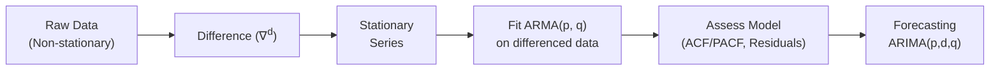

## Introduction

Time-series analysis often plays a central role in financial modeling—whether you’re attempting to forecast stock prices, GDP growth, inflation rates, or other economic indicators. In Chapter 12, we introduced key concepts about stationarity and common time-series models. This section goes one step further by focusing on two powerful modeling approaches: Autoregressive Moving Average (ARMA) models and Autoregressive Integrated Moving Average (ARIMA) models. These techniques are cornerstones in statistical forecasting for financial analysts worldwide. 

So, suppose you’re trying to predict next month’s returns for a market index. You might notice patterns that can be modeled using autoregressive terms (dependence on past values) and moving-average terms (dependence on past error terms). Alternatively, your series might show a trend that drifts over time, suggesting you need to take differences to make it stationary. That’s when ARIMA comes to rescue.   

In my early days as an analyst, I remember struggling with raw time series—some had trends, some had seasonal patterns, and I found it tricky. Once I discovered ARMA and ARIMA (and overcame the fear of “differencing”), it felt like a revelation. Let’s unpack these models together. 

## ARMA(p, q) Models

An ARMA(p, q) model combines two fundamental processes:

1. Autoregressive (AR) component of order p: The current value depends on its own previous p values.  
2. Moving Average (MA) component of order q: The current value depends on q past errors.

### Model Specification

Mathematically, an ARMA(p, q) model can be written as:


Y_t = c + \phi_1 Y_{t-1} + \phi_2 Y_{t-2} + \dots + \phi_p Y_{t-p} \;+\; \theta_1 \varepsilon_{t-1} + \dots + \theta_q \varepsilon_{t-q} \;+\; \varepsilon_t


where:  
• \\(c\\) is a constant (sometimes omitted if centered around zero).  
• \\(\phi_i\\) are the AR coefficients (i = 1, 2, …, p).  
• \\(\theta_j\\) are the MA coefficients (j = 1, 2, …, q).  
• \\(\varepsilon_t\\) is white noise (error term with mean zero, constant variance, no autocorrelation).

The autoregressive part captures how historical observations of \\(Y\\) feed into present values, while the moving-average part captures how past error terms influence present observations.

### Identification via ACF and PACF

Identifying p (AR order) and q (MA order) often involves looking at the autocorrelation function (ACF) and partial autocorrelation function (PACF) plots:

• Pure AR(p) processes often have a “cut-off” in the PACF after lag p and a “gradual decay” in the ACF.  
• Pure MA(q) processes often have a “cut-off” in the ACF after lag q and a “gradual decay” in the PACF.  

With ARMA models, these patterns can be more mixed, so there’s a bit of trial and error. You want to watch out for overfitting—piling on too many parameters can degrade out-of-sample forecasting.

As a quick personal tip: The first time I tried to identify p and q just by looking at the ACF/PACF, I ended up with a bizarre model that “fit” the data but predicted nonsense. Iterative checks and experience matter—a lot.

## ARIMA(p, d, q) Models

### Differencing and Integration

Many real-world financial and economic time series are not stationary. They show trends, random walks, or unit roots. To handle non-stationarity, we can difference the series \\(d\\) times until it becomes (approximately) stationary. If one differencing (d = 1) does the trick, we have a first-order integrated process. 

We then apply an ARMA model to the differenced data:


\underbrace{\nabla^d Y_t}_{\text{d-th differenced series}} \;=\; (1 - B)^d Y_t


where \\(B\\) is the backward shift operator (\\(BY_t = Y_{t-1}\\)), and \\(\nabla\\) is the differencing operator.

Hence, an ARIMA(p, d, q) model is essentially an ARMA(p, q) model applied to a series that has been differenced \\(d\\) times. 

### ARIMA(p, d, q) in Practice

If your time series has a clear upward or downward trend (like a slowly drifting interest rate or monthly GDP growth), differencing once (setting \\(d=1\\)) might be enough to achieve stationarity. If the trend is more complex, you might need \\(d=2\\). More than 2 differences in financial modeling are relatively rare, but still possible if the data is especially wiggly.

You might say, “But wait, can’t I just do a polynomial or log transformation?” Absolutely, that’s also an approach. However, differencing remains a go-to tool because it’s straightforward to interpret.  

## Model Selection and Parameter Estimation

### Searching Over p, d, q

We typically test plausible values of \\(p\\), \\(d\\), and \\(q\\) in a systematic way, looking at the ACF/PACF. Then we fit these candidate models to the data, checking:

• Mean Squared Error (MSE)  
• Akaike Information Criterion (AIC)  
• Bayesian Information Criterion (BIC)  

This helps us avoid overfitting by penalizing models with unnecessary parameters. You can think of it like cooking—adding more ingredients might ruin the dish, so a simpler recipe often tastes better (and generalizes better).

### Diagnostic Checks

After fitting the model, always examine residuals. Ideally, the residuals should behave like white noise: no strong autocorrelation, no glaring patterns. 

In practice, many financial analysts rely on specialized econometric software that can automate a large portion of these steps—though experts caution that “auto-modeling” can lead to fancy but meaningless results if you don’t interpret them carefully.

## Inverse Roots and Model Stability

### Stability and Invertibility Conditions

For ARMA or ARIMA models to produce meaningful forecasts, they must be stable and invertible. Stability means the autoregressive polynomial has roots outside the unit circle; invertibility means the moving-average polynomial has roots outside the unit circle. Checking these is a bit like ensuring your boat has no holes before you set sail. 

If you use Python’s statsmodels or R’s forecast package, the software often reports whether your model’s roots satisfy these conditions. If they don’t, the software might protest, or you’ll see bizarre coefficient estimates (like extremely large or negative values that make no sense physically or financially).

### Visual Representation

Sometimes it helps to see the conceptual flow of how ARIMA models wrap differencing around ARMA. Here’s a quick Mermaid diagram:



In the above flow, you can see how differencing transforms your non-stationary data into something stable enough for ARMA modeling.

## Forecasting with ARMA and ARIMA

### Forecasting Logic

Once an ARMA or ARIMA model is built, you can forecast future time points by iteratively plugging in estimated parameters and relevant past data (and past errors for the moving-average part). For financial time series such as stock returns, the model uses the assumption that next period’s return depends on a linear combination of (some function of) prior returns, plus some random noise.

### Practical Example

Let’s say you’ve fitted an ARIMA(1,1,1) model to your stock returns series \\(Y_t\\). Then the first difference is \\(\nabla Y_t = Y_t - Y_{t-1}\\). We might end up with an equation like:


\nabla Y_t = 0.02 + 0.6 \nabla Y_{t-1} + 0.4 \varepsilon_{t-1} + \varepsilon_t


To forecast \\(\nabla Y_{t+1}\\), you use the last available differenced data point \\(\nabla Y_t\\) and the most recent error \\(\varepsilon_t\\), which might be inferred from the model’s fitted residuals. You can then reverse the differencing to arrive at \\(\hat{Y}_{t+1}\\). The steps for multi-step forecasts proceed in a similar iterative fashion.

In real life, you can do this in Python:

```python
import pandas as pd
import statsmodels.api as sm

model = sm.tsa.ARIMA(df['returns'], order=(1,1,1))
results = model.fit()
forecast_values = results.forecast(steps=5)  # Forecast 5 future points
print(forecast_values)
```

Easy enough, right? The real challenge is making sure your data is properly processed (stationary, cleaned, etc.) and that your model assumptions hold well.

## Practical Considerations and Common Pitfalls

• Overdifferencing: Differencing too many times can destroy a valid signal along with the trend, yielding a stationery series that’s artificially white noise.  
• Seasonal Effects: If your series has seasonal behavior (e.g., monthly sales or certain cyclical patterns in volatility), you may need a SARIMA (Seasonal ARIMA) approach.  
• Structural Breaks and Regime Shifts: Real-world financial data can shift due to policy changes or economic shocks, so your ARIMA model might suddenly underperform.  
• Overfitting: Adding too many parameters can fit historical data well but predict new data poorly.

## Summary of Key Terminologies

• **Autoregressive (AR) Model**: Uses past values of the series.  
• **Moving Average (MA) Model**: Uses past error terms.  
• **ARMA(p, q)**: Combines AR(p) and MA(q).  
• **ARIMA(p, d, q)**: Incorporates differencing \\(d\\) times before applying ARMA(p, q).  
• **Stationarity**: The series’ mean, variance, and autocorrelation structure do not change over time.  
• **Invertibility**: Ensures the MA part can be expressed as an infinite AR process.  
• **ACF and PACF**: Tools to help identify p, q, and any leftover patterns.  
• **MSE, AIC, BIC**: Criteria used to evaluate and compare models.

## Final Exam Tips

• Be prepared to see item-set questions that require you to choose the most appropriate ARIMA(p, d, q) specification based on sample ACF and PACF plots.  
• Show your time-series reasoning clearly in any constructed-response answers. The grader wants to see you understand how differencing, AR, and MA components each relate to the data’s patterns.  
• For hypothesis-testing angles (like checking if a time series has a unit root), you might refer to augmented Dickey–Fuller tests or other unit root tests, which can quickly appear in the context of whether differencing is required.  
• Demonstrate knowledge of stationarity conditions and ensure you don’t pick a combination of \\(p, d, q\\) that is obviously invalidate by the data.

## References and Suggested Readings

• Hamilton, J.D. (1994). “Time Series Analysis.”  
• Brockwell, P.J. & Davis, R.A. (2016). “Introduction to Time Series and Forecasting.”  
• CFA Institute materials on econometrics and time-series forecasting.  
• Hyndman, R.J. “Unit Roots and Extended Forecasting.” [https://robjhyndman.com/papers/unitroot.pdf](https://robjhyndman.com/papers/unitroot.pdf)

---

## Test Your Knowledge: ARMA and ARIMA Processes



### Which of the following equations best describes an ARMA(2,1) model?

- [ ] Yₜ = c + ϕ₁Yₜ₋₁ + ϕ₂Yₜ₋₂ + θ₁εₜ + εₜ₋₁
- [x] Yₜ = c + ϕ₁Yₜ₋₁ + ϕ₂Yₜ₋₂ + θ₁εₜ₋₁ + εₜ
- [ ] Yₜ = c + ϕ₁Yₜ₋₁ + θ₁εₜ₋₁ + εₜ₋₁
- [ ] Yₜ = ϕ₁Yₜ₋₁ + ϕ₂Yₜ₋₂ + εₜ

> **Explanation:** ARMA(2,1) means two autoregressive terms and one moving average term. Therefore, the current value depends on Yₜ₋₁, Yₜ₋₂, one past error term εₜ₋₁, plus the new error term.

### You have a non-stationary series that becomes stationary after first differencing. Which model order for “d” is appropriate in an ARIMA(p, d, q) model?

- [ ] d = 0
- [ ] d = 2
- [x] d = 1
- [ ] d = −1

> **Explanation:** If a single differencing step transforms the series into stationarity, then d=1 is taken in ARIMA(p, d, q).

### In ARIMA(p, d, q), the “I” stands for Integrated. What operation is it referring to?

- [ ] Integration with respect to time
- [x] Differencing until stationarity
- [ ] Combining AR and MA
- [ ] Summation of lags

> **Explanation:** “Integrated” specifically means that we difference the series d times to achieve stationarity before applying ARMA.

### If you see a sharp cutoff in the ACF after lag 2 and a gradual decay in the PACF, which process is most likely?

- [x] MA(2)
- [ ] AR(1)
- [ ] ARMA(1,1)
- [ ] AR(2)

> **Explanation:** A moving-average process with order q often shows a cutoff in the ACF at lag q. A pure MA(2) would see a cutoff at lag 2.

### Which statement about ARMA model fitting is correct?

- [ ] You only need to look at the AIC, ignoring the residuals.
- [x] Residuals should ideally be white noise after fitting.
- [ ] Overfitting means using fewer parameters than needed.
- [ ] p, q must each always be ≥ 2.

> **Explanation:** Diagnostic tests typically check if residuals behave like white noise (no autocorrelation, mean zero, constant variance). This helps indicate the model is capturing key patterns without leaving leftover structure.

### In ARIMA(p, d, q), how do you interpret the “p” parameter?

- [x] Number of autoregressive terms
- [ ] Number of differences
- [ ] Number of moving-average terms
- [ ] Number of partial autocorrelation lags

> **Explanation:** The “p” in ARIMA(p, d, q) indicates the order of the autoregressive component.

### Suppose your model is ARIMA(1,1,1). Which of the following steps is correct for forecasting?

- [x] Difference the data once, fit an ARMA(1,1), then invert the differencing for final forecasts
- [ ] Use the raw data in a pure AR(1) model and ignore the difference
- [ ] Use a pure MA(1) model, ignoring any AR terms
- [ ] List all possible (p, d, q) and pick the largest values

> **Explanation:** ARIMA(1,1,1) means differencing once, then modeling the differenced series with ARMA(1,1), and reversing the differencing to get predictions on the original scale.

### If the residuals of an ARMA model show significant autocorrelation, what does that suggest?

- [ ] The series is stationary.
- [x] The model is likely underfitted or missing structure.
- [ ] The model is correctly specified.
- [ ] The model has too high an order.

> **Explanation:** Significant autocorrelation in residuals indicates that the model hasn’t adequately captured the data’s structure.

### A large negative root in the autoregressive part of the polynomial suggests:

- [x] Potential issues with model stability
- [ ] The model is definitely well-specified
- [ ] The model must have d=2
- [ ] Guaranteed overfitting

> **Explanation:** If the AR component has a root with absolute value less or equal to 1, it may violate stationarity conditions, indicating instability in the model.

### ARIMA models forecast future values by considering both past data and previous errors. True or False?

- [x] True
- [ ] False

> **Explanation:** ARIMA combines AR and MA components. The AR part looks at past Y values; the MA part looks at past errors, plus differencing (if d>0).


