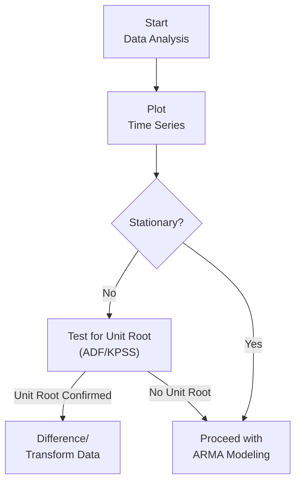

## Introduction
If you’ve ever tried to model or forecast financial time series—like stock prices, exchange rates, or macroeconomic indicators—you’ve probably heard the buzz around whether your data is “stationary.” The stationarity concept might sound intimidating at first. But no worries, we’ll clarify what it means and why it’s a pretty big deal for your models. More specifically, we’ll explore how unit roots can turn your time series into a random walk, muddling your regression results and leading to poor forecasts. Trust me, you’ll want to keep reading—stationarity is one of those topics that can make or break a time-series analysis.

In earlier sections (see Section 12.1 on Autoregressive and Moving Average Models, and Section 12.2 on ARMA and ARIMA Processes), we dissected the building blocks for modeling time-series data. Now we shift our focus to an essential condition: stationarity. Along the way, we’ll touch on ways to test for unit roots (like the Augmented Dickey-Fuller test), transform non-stationary data, and highlight how all of this impacts the reliability of your forecasts.

## Why Stationarity Matters
Stationarity basically means that a process—let’s call it {Yₜ}—has a constant mean, variance, and autocorrelation structure over time. Formally, if you shift the window of observation, nothing about the statistical properties of your series changes. If a time series is stationary, many standard techniques, such as ARMA or advanced statistical tests, remain valid. Deviate from stationarity, and the door to “spurious regression” flies open.

Spurious regression is every econometrician’s nightmare: you get artificially significant relationships that vanish as soon as you realize your variables were drifting all along without any true economic link. For instance, imagine you regress two random walks on each other and find a very high R²—only to discover it’s just a coincidence of these drifting “unanchored” processes.

### Stationarity: Formal Definition
In simpler terms, a time-series process {Yₜ} is strictly stationary if its joint probability distribution does not change over time. Weak (or covariance) stationarity requires:
• E[Yₜ] = μ, a constant mean.  
• Var(Yₜ) = σ², a constant variance.  
• Cov(Yₜ, Yₜ₋ₖ) depends only on the lag k, not on time t.

When stationarity fails, the parameters you estimate can become unreliable or meaningless.

## The Concept of Unit Roots
So what causes non-stationarity? One of the most common culprits is the presence of a “unit root.” A unit root suggests your time series can wander indefinitely because it lacks an anchor pulling it back to an equilibrium level or trend.

### Random Walk Example
Consider the process:  
Yₜ = Yₜ₋₁ + εₜ  
where εₜ ~ i.i.d. (0, σ²). This is the famous random walk. Observe that:
• Any shock to Yₜ is permanent—there’s no mechanism to revert it.  
• The variance of Yₜ grows over time.  
• The mean of Yₜ changes as the series evolves, so it’s non-stationary.

From a characteristic equation standpoint, the associated polynomial for an autoregressive model must have roots that lie strictly outside the unit circle for stationarity. If one root equals 1, you’re dealing with a unit root.

### More Complex Cases
Sometimes, the random walk might have a drift:  
Yₜ = c + Yₜ₋₁ + εₜ  
Or it might have a deterministic time trend:  
Yₜ = α + βt + Yₜ₋₁ + εₜ  
Both are forms of non-stationary processes but can be made stationary under certain transformations (like differencing once).

## Dickey-Fuller Tests
Well, if you’re like me, the first time you read about the Dickey-Fuller test, you probably asked, “Why do I need a special test? Why not just run a plain old t-test?” The problem is that standard t-distributions no longer apply when we suspect a unit root. Your test statistic ends up following a whole different distribution.

### The Basic Dickey-Fuller Test
The simplest (non-augmented) Dickey-Fuller test can be demonstrated using:
(Yₜ − Yₜ₋₁) = δYₜ₋₁ + εₜ,  
which you can rewrite as ΔYₜ = δYₜ₋₁ + εₜ.

• Null hypothesis (H₀): δ = 0 (i.e., there is a unit root, making the series non-stationary).  
• Alternative hypothesis (H₁): δ < 0 (stationary).

If the null is rejected, you conclude that the series does not have a unit root and is likely stationary (or stationary around a mean/trend). If you can’t reject it, you suspect the presence of a unit root.

### Augmented Dickey-Fuller (ADF) Variation
Often, real-world data exhibits autocorrelation in the residuals. That’s where the “augmented” part steps in. The ADF test includes lagged differences of Yₜ on the right-hand side to soak up any higher-order correlation. It’s a more robust test than the basic version, especially for financial data that’s rarely free of correlation in the error terms.

### Other Tests
• KPSS (Kwiatkowski-Phillips-Schmidt-Shin): the null is that the series is stationary.  
• Phillips-Perron: accounts for serial correlation and heteroskedasticity differently than ADF.  

In many textbooks and the CFA curriculum, the ADF is the go-to approach, though you might see these alternative tests pop up in research. 

## Forecasting with Stationary vs. Non-Stationary Data
Forecasting is the bread and butter of time-series analysis—especially for financial analysts aiming to predict asset prices, interest rates, or macro variables. Using a non-stationary series:

• Makes it tough to guarantee the reliability of model coefficients.  
• May lead to inflated R² values that don’t hold up out-of-sample.  
• Often yields residuals that violate key regression assumptions (leading to biased standard errors).

### Differencing to Achieve Stationarity
An ARIMA(1,1,0) model, for instance, simply differences once:  
ΔYₜ = φ(ΔYₜ₋₁) + ... + εₜ  
If differencing once is sufficient to remove the unit root, the differenced series might be stationary, letting you model and forecast more reliably. This is the hallmark of ARIMA (AutoRegressive Integrated Moving Average) where “I” stands for the integrated component that captures how many times you difference until stationarity is achieved.

### Spurious Regression Example
I once had a dataset of tech stock prices that skyrocketed over a few years. I ran a naive regression that related the share price of TechStock A to TechStock B. R² was unbelievably high. Turned out, both followed random walks with upward drift, so the high correlation was meaningless. Differencing the levels turned the regressions into something more sensible (though less “sexy” because the correlation plummeted!).

## Practical Steps in Testing and Transforming Data
It’s one thing to talk about ADF and stationarity, and quite another to see it in the data. Here’s a quick workflow you’ll often see in practice:



1. Visualize your data: Does it look like a random walk or show an obvious trend?  
2. Use formal tests (ADF/KPSS) to see if you have a unit root.  
3. If non-stationary, difference or transform your data (log transformations can help if variances are non-constant).  
4. Confirm stationarity with diagnostics (re-run the ADF or plot the differenced series).  
5. Model the now-stationary series using appropriate ARMA or ARIMA frameworks.  
6. Forecast and evaluate out-of-sample performance.

### Python Snippet for ADF Test
Below is a short snippet you might use in Python. Nothing fancy, but it helped me the first time I tried to systematically check stationarity:

```python
import pandas as pd
import numpy as np
from statsmodels.tsa.stattools import adfuller

result = adfuller(df['asset_price'].dropna(), autolag='AIC')
print('ADF Statistic:', result[0])
print('p-value:', result[1])
for key, value in result[4].items():
    print(f'Critial Values {key}, {value}')
```

If the p-value is below your significance threshold (commonly 0.05), you reject H₀ (presence of a unit root) and conclude stationarity.

## Cointegration and Error Correction
At times, you’ll find multiple non-stationary series that drift together. This scenario is called cointegration—a concept introduced in advanced time-series frameworks. Two series can each have a unit root but remain stable in some linear combination. For instance, if two stock indexes in different countries move in lockstep due to integrated capital markets, you might see them cointegrated. 

In such a case, you typically use an error correction model (ECM) that incorporates both the short-term dynamics (through differencing) and the long-term relationship. Indeed, economic theory often suggests variables “should” be linked over the long run (like consumption and income). 

## Common Pitfalls
• Relying solely on plots: Visual inspection can mislead if you have short windows or seasonal fluctuations.  
• Failing to difference enough: Some series might require second differencing (ARIMA with higher “I”).  
• Overdifferencing: You might remove vital long-term info by differencing too much.  
• Misinterpreting p-values: Remember that unit root tests have unusual critical values.  
• Neglecting cointegration: If two or more series move together, differencing them all might lose meaningful relationships.

## Humble Advice and Personal Anecdotes
I once encountered a colleague who swore by always differencing stock prices. In fairness, stock prices often have a unit root, but not everything does. Over the years, I realized it’s wise to test for stationarity for each dataset instead of blindly applying a technique. Also, be mindful of the possibility of structural breaks—like a big financial crisis or policy change—that can alter your series’ stationarity properties. I guess you could say I’ve learned the hard way not to rely on “always do X” rules when it comes to time-series. 

## Conclusion and Exam Tips
Stationarity is the beating heart of time-series econometrics, especially in finance. Without confirming stationarity, your ARMA or regression coefficients might be all glitter, no gold. A thorough exam or real-world assignment solution would typically:

• Plot the data to look for trends or shifts.  
• Run an ADF test (or related test) to confirm or deny the presence of a unit root.  
• If non-stationary, transform or difference the data and re-check.  
• Carefully interpret test results, mindful of edge cases like structural breaks or cointegration.

On the CFA exam, watch for questions where you see a time-series regression with suspiciously high R² or odd residual patterns. They might be testing your understanding of stationarity and ways to rectify non-stationary data. Always keep time constraints in mind: if you see “unit root” in the question, consider differencing or transformations. Provide a succinct but precise explanation of how you tested for stationarity and what the results imply for your forecasts or investment decisions.

## References for Further Study
• Enders, W. (2014). Applied Econometric Time Series.  
• Official CFA Institute curriculum readings on Time-Series Analysis.  
• Online Resource on Unit Roots: https://people.duke.edu/~rnau/411diff.htm  

--------------------------------------------------------------------------------

## Test Your Knowledge: Unit Roots, Stationarity, and Forecasting



### 1. Which of the following characteristics must hold true for a time series to be considered weakly stationary?
- [x] Constant mean, constant variance, and autocorrelation that depends only on lag.
- [ ] Constant mean and autocorrelation that depends on time t.
- [ ] Constant variance but mean that changes linearly with time.
- [ ] Constant variance and autocorrelation that changes non-linearly with time.

> **Explanation:** Weak (or covariance) stationarity requires the mean and variance to remain the same across time and the autocovariance to depend solely on the lag, not the specific time.

### 2. Which of the following processes typically indicates a unit root?
- [x] Yₜ = Yₜ₋₁ + εₜ
- [ ] Yₜ = 0.5 Yₜ₋₁ + εₜ
- [ ] Yₜ = 2 + 0.8 Yₜ₋₁ + εₜ
- [ ] Yₜ = εₜ

> **Explanation:** Yₜ = Yₜ₋₁ + εₜ is the classic random walk with a root of 1 in the characteristic equation, signifying a unit root.

### 3. The null hypothesis in the basic Dickey-Fuller test is:
- [ ] The series is stationary around a deterministic trend.
- [x] The series has a unit root (i.e., non-stationary).
- [ ] The variance is heteroskedastic.
- [ ] The autocorrelation is zero at all lags.

> **Explanation:** In Dickey-Fuller testing, the formal null is that a unit root is present, indicating the series is non-stationary.

### 4. If an asset price series is determined to have a unit root, the first step to achieve stationarity is usually:
- [x] Differencing the time series once.
- [ ] Employing a GARCH model.
- [ ] Searching for cointegration with another series.
- [ ] Dropping outliers and re-estimating the model.

> **Explanation:** When a series has a unit root, differencing is typically the first remedy. This converts a random walk or trend process into (hopefully) a stationary series.

### 5. Which of the following best describes “spurious regression”?
- [x] Observing a high correlation between two random-walk variables that do not have a meaningful relationship.
- [ ] Modeling economic variables in a single-equation linear regression.
- [ ] Failing to transform variables that have already been differenced.
- [ ] Conducting a standard t-test for significance of slope coefficients.

> **Explanation:** Spurious regression arises when non-stationary series are regressed against each other, leading to misleadingly high R² and apparently significant relationships.

### 6. Which outcome supports rejecting the null hypothesis in an Augmented Dickey-Fuller test at the 5% level?
- [x] A test statistic less than the critical value at 5%.
- [ ] A test statistic greater than the critical value at 1%.
- [ ] A p-value larger than 0.10.
- [ ] Stationary residuals in an AR(5) model.

> **Explanation:** For the ADF test, if the test statistic is more negative than the 5% critical value, you reject the null hypothesis (i.e., you conclude the series is likely stationary).

### 7. If a random walk with drift is detected, which approach is generally most appropriate?
- [x] Apply a first difference to remove the random walk component.
- [ ] Estimate a GARCH(1,1) model immediately.
- [x] Consider whether a trend-stationary model might be suitable.
- [ ] Transform to logs and re-run the same regression.

> **Explanation:** A random walk with drift may need differencing; however, if the drift component is deterministic, a trend-stationary model could be viable. Often, practitioners test both differencing and detrending.

### 8. What is one reason that financial data is frequently modeled with ARIMA instead of a simple AR or MA model?
- [x] Financial data often exhibits non-stationary behavior that an “Integrated” model can address.
- [ ] Stakeholders prefer ARIMA because it has more computational complexity.
- [ ] ARIMA always outperforms AR and MA in-sample.
- [ ] ARIMA is easier to interpret than AR or MA models.

> **Explanation:** Because many financial time series display random-walk-like tendencies (non-stationary characteristics), ARIMA models help by differencing the data (the “I” part).

### 9. Which test has a null hypothesis that the series is stationary (no unit root)?
- [ ] Augmented Dickey-Fuller test
- [ ] Phillips-Perron test
- [x] KPSS test
- [ ] Ljung-Box test

> **Explanation:** The KPSS test flips the usual script; its null hypothesis states a process is stationary, whereas Dickey-Fuller and Phillips-Perron have non-stationary as the null.

### 10. True or False: Cointegration between two non-stationary series implies their linear combination is stationary.
- [x] True
- [ ] False

> **Explanation:** Cointegration refers to the situation where two or more non-stationary series move together in such a way that a linear combination of them is stationary.


