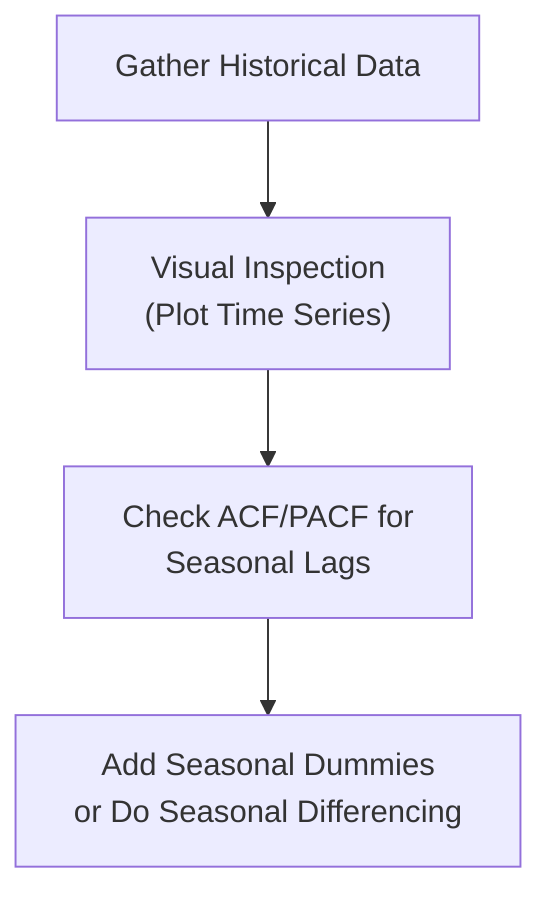

## Introduction

Seasonality and trend analysis might sound a bit like looking for patterns in your favorite sports team’s performance—sometimes you see cyclical ups and downs, and occasionally a steady climb (or sad decline) over the years. In time-series finance, the stakes can be a bit higher than a friendly sports wager. Identifying and modeling these components is crucial for effective portfolio management, forecasting future asset prices, and mitigating risk. So let’s talk about how we can detect and quantify seasonality and trends in financial data—and why that matters for a CFA® candidate at Level I (and beyond).

Fundamentally, seasonality refers to regular and predictable patterns that happen over a fixed interval (e.g., monthly, quarterly, or annually). For instance, certain sectors—think retail—often see spikes in Q4 due to holiday shopping, while some commodities witness their busiest season during planting or harvesting times. Then there’s the question of a general trend: Does the data show a persistent upward or downward drift through time? If so, should we treat that trend as deterministic (like a simple linear slope) or something a bit more random, possibly requiring differencing? 

Below, we’ll break down the key concepts of seasonality, trend analysis, and some popular modeling choices, including SARIMA (Seasonal Auto-Regressive Integrated Moving Average). We’ll fold in real-world examples from equity returns, commodity pricing, and macroeconomic indicators to help illustrate how you might apply these ideas on the CFA exam—and in practice.  

## Core Concepts of Seasonality

Seasonality is all about repetitive patterns at set intervals. In equity markets, you might hear about the “January effect” or “sell in May, go away” phenomenon—some folks believe these seasonal tendencies persist, though data can be mixed. In commodities, seasonal effects are often more pronounced: agricultural commodities exhibit planting and harvesting phases, causing cyclical price movements. From an exam standpoint, you want to recognize how these patterns can distort raw data and how to adjust for them.

• Seasonal dummy variables. One common approach is to incorporate binary (dummy) variables into a regression model. For example, if you have monthly data, you could create 11 seasonal dummies to capture each month’s “effect” relative to a baseline month. This is especially helpful if your data shows strong but predictable monthly fluctuations.

• Seasonal differencing. Another approach is to difference the series based on the seasonal period. Let’s say you suspect monthly seasonality. Then you might look at (Yₜ − Yₜ₋₁₂). This helps to remove cyclical swings that recur every 12 months. It’s a direct (yet powerful) technique—especially in the context of ARIMA models, where we can incorporate a “seasonal differencing” component.

• Seasonal analysis in practice. Let’s get a bit personal. I once worked with a commodity fund that specialized in grains. We always knew that Q2 was planting time, and Q4 was harvest time. We inevitably saw an uptick in volatility and volume during those months. The day I realized how consistent these patterns were—year in, year out—was genuinely surprising. Once we put a seasonal dummy model in place, our forecasts began to capture those cyclical swings more accurately, and that translated to better hedging strategies.

### Detecting Seasonality  

So how do we spot it in the data? Here are practical steps:

1. Plot your data. Often, you’ll see it visually: cyclical peaks and valleys repeating at consistent intervals.  
2. Examine autocorrelation at seasonal lags. If you have monthly data, check the sample autocorrelation function (ACF) at lag 12. A large spike at lag 12 (and possibly multiples of 12) signals seasonality.  
3. Conduct formal tests. If needed, you can incorporate the presence of seasonal dummies in a regression and test their joint significance, or you can use specialized statistical tests that differentiate between purely random fluctuations and cyclical patterns.

Below is a simple Mermaid flowchart illustrating a rough process for identifying seasonality:



## Understanding Trend Analysis

Besides seasonality, many financial series display an overall upward or downward drift. For instance, equity indices often drift upward over the long run due to growth in company earnings and economies, whereas some commodities might drift sideways or downward.

### Deterministic Trend

A deterministic trend is usually captured by a simple time variable, t. For example, you might model:

Yₜ = α + βt + εₜ

where t = 1,2,3,... for equally spaced intervals. The slope coefficient β tells us if there’s a stable upward or downward direction. If the data strictly adheres to this form, you can interpret β as a steady growth or decline rate.

### Stochastic Trend (Unit Roots)

But what if the trend is not purely deterministic? That’s where the concept of a unit root enters. If a time series has a unit root, it tends to wander or drift, and any shock can create a lasting impression. The series might look “trendy,” but it’s really a random walk with drift. In such a scenario, we typically difference the data (e.g., Yₜ − Yₜ₋₁) to make it stationary.  

In practice, we check for a unit root using tests like:

• Augmented Dickey-Fuller (ADF) test.  
• Phillips-Perron test.  

Out in real-world markets, you may see trends that appear stable for a while but then shift abruptly. So we’ve got to remain vigilant. Hey, I once tried to run a simple linear trend model on an exchange rate series—surprise, it failed the unit root test. That was a humbling moment reminding me that currency series often behave as random walks with drift.  

## Putting It Together: SARIMA Modeling

Sometimes you have both a seasonal pattern and a potential unit root. Standard ARIMA (Auto-Regressive Integrated Moving Average) models incorporate differencing to address non-stationarity. But what if there’s a unique seasonal cycle that also requires differencing or additional AR/MA terms? That’s when we use SARIMA (Seasonal ARIMA), usually denoted as:

ARIMA(p, d, q)(P, D, Q)ₘ

• p, d, q capture the non-seasonal AR, differencing, and MA terms, respectively.  
• P, D, Q capture the seasonal AR, differencing, and MA terms.  
• m is the number of periods in each season (e.g., 12 for monthly data, 4 for quarterly).  

For example, ARIMA(1,1,1)(1,1,1)₁₂ would mean:  
1. You difference the series once (the “d=1”) to handle any non-seasonal unit root.  
2. You difference the series once again at lag 12 (the “D=1”) to handle seasonal unit roots.  
3. You include an AR(1) and MA(1) term for non-seasonal lags.  
4. You do an additional AR(1) and MA(1) run at the seasonal lag of 12.  

### Practical SARIMA Example  

Imagine monthly data for a retail company’s sales. You suspect a consistent holiday spike every December. You test the data, see strong autocorrelation at lag 12, and also suspect a unit root. You might attempt an ARIMA(0,1,1)(0,1,1)₁₂. If that model’s fit is strong (based on, say, the lowest Akaike Information Criterion, AIC), you have an objective measure to describe the seasonal pattern and the underlying drift. Then you can forecast upcoming months, factoring in that December holiday surge.  

A snippet of Python code might look like this:

```python
import pandas as pd
from statsmodels.tsa.statespace.sarimax import SARIMAX

model = SARIMAX(df['sales'], order=(0,1,1), seasonal_order=(0,1,1,12))
results = model.fit()
print(results.summary())
```

This output would give you insight into which terms are statistically significant and how well the seasonal components explain the data.  

## Best Practices and Common Pitfalls

• Overfitting. With so many seasonal and non-seasonal parameters, it’s tempting to chase a perfect fit. Resist the urge. Overfitting can degrade your out-of-sample performance and hamper your ability to use the model for robust portfolio decisions.  

• Not verifying stationarity. If you don’t address a unit root properly, your regression results might be spurious. Always test for stationarity (or use an approach like differencing).  

• Ignoring economic rationale. While seasonal patterns often exist, they sometimes fade as markets become more efficient or as data conditions change. Always pair statistical methods with economic or fundamental reasoning.  

• Data snooping. If you rummage through a time series database looking for patterns with no prior hypothesis, you might find “patterns” that don’t really exist. This can lead you to put capital into unsubstantiated strategies.  

## Exam Relevance

On the CFA exam, especially at the advanced levels, you’ll encounter time-series models for forecasting and analyzing economic or market data. While you might not do an in-depth Box-Jenkins methodology in the Level I exam setting, it’s essential to know broad strokes:  
• Identifying and handling seasonality (dummy variables vs. seasonal differencing).  
• Distinguishing between deterministic and stochastic trends.  
• Recognizing the basics of SARIMA notation.  

Time-series questions might appear in item sets or short-response questions. They often ask you to interpret regression output, identify whether a model is well-specified, or test for the presence of a unit root.  

## Ethical and Regulatory Considerations

Modeling time-series data, especially with an eye toward forecast returns, must be approached ethically and within regulatory guidelines. Under the CFA Institute Code of Ethics and Standards of Professional Conduct, employing “data mining” to justify a preset conclusion or to overstate potential performance is unacceptable. You are expected to present honest, unbiased forecasts and to diligently validate your assumptions.

## Final Exam Tips

• Look for hints of seasonality (repeated patterns in the data description, mention of monthly or quarterly cycles).  
• If you see a regression with a time variable or differencing, suspect the presence of trend or unit roots.  
• Don’t forget that the best-fitting model (lowest sum of squared residuals) might not be the best predictor out of sample. Evaluate your model’s parsimony: fewer parameters can often yield better generalization.  
• Practice writing short, clear justifications for why you included (or excluded) seasonal terms.  

## References and Suggested Readings

• Shumway, R.H. & Stoffer, D.S. (2017). Time Series Analysis and Its Applications.  
• Box, G.E.P., Jenkins, G.M., & Reinsel, G.C. (2015). Time Series Analysis: Forecasting and Control.  
• Online resource for seasonality: [https://otexts.com/fpp2/seasonal.html](https://otexts.com/fpp2/seasonal.html)  
• CFA Institute Levels I & II curriculum sections on time-series and econometrics.  

Remember, the secret sauce to mastering seasonality and trend analysis lies in a healthy mix of data savvy, economic intuition, and practical experience. The next time you look at a chart with monthly or quarterly data, keep an eye out for those cyclical humps and that upward tilt—chances are, it’s not just your eyes playing tricks on you.

---

## Practice Questions on Seasonality and Trend Analysis



### Which statement best describes seasonality in a time series?

- [ ] A random fluctuation that dissipates quickly and never repeats.  
- [ ] A trend caused by major structural breaks in the economy.  
- [x] A recurring pattern in the data at fixed intervals (e.g., every quarter).  
- [ ] A random walk driven by unpredictable shocks.  

> **Explanation:** Seasonality is defined as a recurring pattern at fixed intervals. It’s notably different from random fluctuations or structural breaks.

### Which of the following is a common method to incorporate seasonality into a regression model?

- [x] Using dummy variables for each season.  
- [ ] Dropping all seasonal data points from the sample.  
- [ ] Dividing the data into stationary components by partial autocorrelation.  
- [ ] Constrained linear optimization.  

> **Explanation:** Seasonal dummy variables are frequently used to isolate each season’s effect. Dropping data points could remove potentially critical information.

### A time series exhibits a clear upward trend that does not go away when you difference the data (Yₜ – Yₜ₋₁). What type of trend might this suggest?

- [ ] It definitely has no trend at all.  
- [ ] It must be seasonal.  
- [ ] It is purely deterministic and removable by differencing.  
- [x] It could be a deterministic trend, requiring a time variable (e.g., t) in the model.  

> **Explanation:** If first differencing does not remove the trend, it’s likely a deterministic trend instead of a stochastic one. You might need to include t directly as a regressor.

### Which of the following statements about SARIMA modeling is correct?

- [x] SARIMA extends ARIMA by adding seasonal AR and MA terms with a seasonal differencing component.  
- [ ] SARIMA uses spectral analysis exclusively to detect cycles.  
- [ ] SARIMA cannot handle short-run seasonality.  
- [ ] SARIMA only applies to daily financial data with no autocorrelation.  

> **Explanation:** SARIMA is ARIMA plus seasonal AR/MA components and seasonal differencing. It’s immensely flexible for short- and long-run cyclical patterns.

### In ARIMA(p, d, q)(P, D, Q)12, what does the subscript “12” denote?

- [ ] The total number of AR plus MA terms.  
- [x] The length of the seasonal period (e.g., a 12-month cycle).  
- [ ] The total data points used in each regression.  
- [ ] The model is only valid for 12 months of data.  

> **Explanation:** In seasonal ARIMA notation, the subscript “m” is how many time units form one season—for monthly data, m=12.

### Which test commonly checks for a unit root in a time series?

- [x] Augmented Dickey-Fuller (ADF) test.  
- [ ] Kolmogorov-Smirnov test.  
- [ ] Ljung-Box test.  
- [ ] Chi-square test of independence.  

> **Explanation:** The Augmented Dickey-Fuller test is the most recognized test for assessing unit roots (i.e., non-stationarity).

### In a monthly financial dataset, you suspect strong seasonal effects around the holidays. How might you confirm this suspicion?

- [x] Inspect plots and ACF at lag 12.  
- [ ] Run a simple t-test on daily returns.  
- [x] Create monthly dummy variables and see if they are statistically significant.  
- [ ] Only examine an entirely different dataset to confirm.  

> **Explanation:** Checking lag-12 autocorrelations and using dummy variables are two major ways to confirm monthly seasonality.

### If a model’s residuals still show a strong seasonal pattern after estimation, what does this imply?

- [x] The model is missing key seasonal components.  
- [ ] The model perfectly captures the seasonality.  
- [ ] Seasonality is no longer relevant.  
- [ ] There is no need to refine the model.  

> **Explanation:** Residual seasonality indicates inadequate modeling of seasonal components. You may need more terms (or differencing).

### When might a model require seasonal differencing (e.g., Yₜ − Yₜ₋ₘ)?

- [x] When the series is non-stationary due to repeating seasonal cycles.  
- [ ] When there is a structural break at time t.  
- [ ] Only when the data are weekly.  
- [ ] Whenever you see a negative trend.  

> **Explanation:** Seasonal differencing is used to remove repeating patterns every m periods. It helps achieve stationarity if those patterns lead to a unit root at seasonal lags.

### True or False: If a time series is non-stationary due to a stochastic trend, it can often be made stationary by first differencing.

- [x] True  
- [ ] False  

> **Explanation:** Stochastic (unit-root) trends are typically removed by differencing once (or possibly multiple times). This is a key concept in ARIMA modeling.


