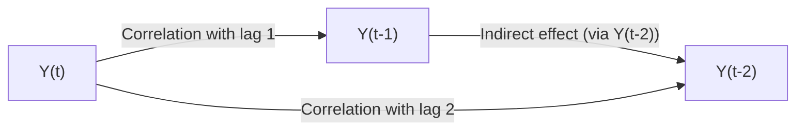

## Introduction
Time-series analysis often feels a bit like detective work—you're basically peeking into a financial market’s historical data to uncover structural clues. Autocorrelation and partial autocorrelation functions, commonly referred to as ACF and PACF, are among the most powerful tools you have for this detective work. These functions dig into the past values of your time series to see if they influence the present and, if so, how strongly.

I remember back when I was first learning about time-series analysis: I kept mixing up the difference between “autocorrelation” and “partial autocorrelation.” It felt a bit like I was stumbling around in the dark, not fully grasping which tool helped with AR terms and which helped with MA terms. If you’re in that boat, no worries—plenty of experienced analysts still have to pause and think for a second when choosing between the two. In this section, we’ll clarify the difference, show you how the ACF and PACF can help you fit better models, and illustrate how they come into play in a real-world finance setting.

## Autocorrelation: Detecting Patterns Over Lags
Autocorrelation measures how related the time series is with itself at different points in the past. In formal terms, the autocorrelation function at lag k, sometimes denoted ρₖ or Corr(Yₜ, Yₜ₋ₖ), tells you how well the data at time t aligns with the data at time t−k. 

When analyzing time series, you typically look at autocorrelation values for several different lags—1, 2, 3, and so on. You can think of it like checking if the market’s return this month is related to last month’s return, or even last quarter’s return. This can be particularly relevant if you suspect that certain cyclical or seasonal factors affect your data.

### Mathematical Definition
For a covariance-stationary time series {Yₜ}, the sample autocorrelation at lag k can be written as:


\rho_k = \frac{\sum_{t=k+1}^{T} (Y_t - \bar{Y})(Y_{t-k} - \bar{Y})}{\sum_{t=1}^{T} (Y_t - \bar{Y})^2},


where T is the total number of observations and \\(\bar{Y}\\) is the sample mean. This ratio normalizes the covariance at lag k by the variance of the entire series.

### What Large ACF Values Imply
• If the ACF at lag k is significantly different from zero, that implies a strong relationship between Yₜ and Yₜ₋ₖ.  
• In model selection, a spike (or significantly high value) in the ACF at lag k can suggest including an MA(k) component in an ARMA model. (Though that’s not a hard rule—it’s a starting clue for further investigation.)

Autocorrelations that remain large for multiple lags—especially ones that slowly decay—may indicate that your data have a long memory or could fit an AR process with a particular order.

## Partial Autocorrelation: Stripping Out Intervening Effects
Partial autocorrelation is basically autocorrelation but after controlling (or “partialling out”) for the presence of all other intervening lags. It can help you pinpoint the specific direct effect of a lag k on the current value, independent of any indirect effects through intermediate lags.

A personal anecdote: once, I was analyzing a monthly returns series for an equity portfolio. The naive ACF showed strong correlations at lags 1 and 2, but the partial autocorrelation indicated that only lag 1 truly had a significant direct influence once you accounted for the chain of relationships. Without the PACF in my toolbox, I might have incorrectly included a second-order term that wasn’t really necessary.

### Mathematical Definition
The partial autocorrelation for lag k, often denoted \\(\phi_{k,k}\\), is the coefficient of Yₜ₋ₖ in an autoregression of order k after you’ve accounted for all the lags from 1 to k−1. In other words, you run a regression like:


Y_t = c + \phi_{k,1} Y_{t-1} + \phi_{k,2} Y_{t-2} + \dots + \phi_{k,k} Y_{t-k} + \epsilon_t,


and then \\(\phi_{k,k}\\) is your partial autocorrelation at lag k. This coefficient stands in for the “clean” effect of lag k on Yₜ.

### Why PACF Is Critical
• Large partial autocorrelations at lag p might suggest an AR(p) structure.  
• If you want to find the minimal AR order for your time series, you look at where the PACF cuts off. For example, if you see that the partial autocorrelation is significant at lags 1 through p but not afterward, an AR(p) model might fit well.

## Graphical Tools: ACF and PACF Plots
You’ll commonly see ACF and PACF displayed as bar charts called correlograms. The ACF plot shows correlations for lags on the x-axis and their magnitudes on the y-axis, while the PACF plot displays partial correlations for the same lags.

Most statistical software provides confidence bands—usually around ±1.96/√T if you assume the series is white noise or near-white noise. Spikes that exceed these bands indicate that the correlation is significantly different from zero at the 5% level. If an ACF bar for lag 3, for instance, shoots out wildly beyond the band, that’s a big neon sign telling you that your time series is correlated with its own value three steps in the past.

### Typical “Signatures” of AR, MA, and ARMA
1. AR(p) models often show a PACF that cuts off after p lags, while the ACF decays exponentially or in some other smooth pattern.  
2. MA(q) models often show an ACF that cuts off abruptly at lag q, while the PACF decays more slowly.  
3. ARMA(p, q) can have more complex patterns in both ACF and PACF—neither entirely cuts off immediately, but commonly both do some sort of decay. 

Below is a simplified Mermaid diagram illustrating how financial data might show lagged relationships:



## Why All This Matters in Finance
Autocorrelation and partial autocorrelation can be the difference between a profitable forecast and a money-losing guess for portfolio managers, quantitative analysts, and risk managers alike. If you can recognize that lag 1 has a strong partial autocorrelation while lags 2 and 3 are negligible, you might adopt an AR(1) model. Misspecifying the order can lead to underfitting or overfitting your forecasts, which might compound the errors in your portfolio allocation and risk management decisions.

Imagine you’re in charge of risk modeling for a large mutual fund. You want to forecast next month’s returns so you can stress test for possible drawdowns. If your model captures the correct autocorrelation structure, your volatility forecasts and drawdown predictions are likely more accurate—meaning fewer nasty surprises for your risk committees.

## Illustration: Equity Returns Example
Let’s say you have a monthly equity return series for a certain market index (e.g., the S&P 500) over 10 years, giving you 120 observations. You might do the following:

1. Compute the ACF for, say, lags 1 through 12.  
2. Examine the PACF for lags 1 through 12.  
3. Check if there are large spikes at lags 1, 2, or 3 that exceed ±1.96/√120.  
4. Identify a potential model—maybe an AR(1) or AR(2), or perhaps an MA(1), or something more complex like ARMA(1,1).

In practice, you’ll combine the insights from these plots with additional knowledge: AIC or BIC criteria, domain expertise about the market, and in-sample or out-of-sample backtesting results. But the ACF and PACF plots are always near the top of your diagnostic checklist.

## Model Identification via ACF and PACF
When diagnosing ARIMA (AutoRegressive Integrated Moving Average) models, or even more advanced ARMA-GARCH setups, the patterns in the ACF and PACF can point to the right combos of AR and MA terms:

• An AR(p) portion typically shows a significant partial autocorrelation at lags up to p, but then it falls off.  
• An MA(q) portion often has a significant autocorrelation for lags up to q, after which it becomes negligible.  
• For an ARMA(p, q), you look for complex patterns in both.  

If the data are non-stationary, you might see patterns that only become clear after differencing the series. (See the earlier discussions on stationarity if you need a refresher.)

## Residual Diagnostics
One of the best uses of ACF and PACF is in checking your residuals after fitting a model. Essentially, if your chosen model is adequate, the residuals (the difference between the actual data and your model’s fitted values) should look like white noise—meaning minimal autocorrelation and partial autocorrelation. If you see large, persistent correlation in the residuals, that’s a sign your model hasn’t captured something in the data. 

A typical routine goes like this:
1. Fit, say, an AR(1) to your data.  
2. Look at the ACF and PACF of the residuals.  
3. If you still see big spikes, it’s a red flag—maybe you need an AR(2) or an ARMA(1,1).  
4. Refit until the residual correlograms look random—no significant spikes.  

## Practical Example with Python
For those comfortable with code, the Python “statsmodels” library offers neat functions like acf() and pacf(). A quick snippet:

```python
import numpy as np
import pandas as pd
import statsmodels.api as sm
from statsmodels.graphics.tsaplots import plot_acf, plot_pacf
import matplotlib.pyplot as plt

# Example: returns = pd.Series(your_data)

fig, ax = plt.subplots(2, 1, figsize=(10, 8))
plot_acf(returns, lags=12, ax=ax[0])
plot_pacf(returns, lags=12, ax=ax[1])
plt.show()
```

This script generates the two key plots. You can eyeball the spikes to see which lags are significant before plugging that knowledge into an ARIMA model. If you test it out on real data, you’ll find that it speeds up your model-selection process, letting you zero in on plausible parameter choices quickly.

## Best Practices and Common Pitfalls
• Don’t rely solely on ACF or PACF plots: use information criteria (AIC, BIC) and holdout tests to confirm your model choice.  
• Be wary of overfitting: just because you see a suspicious spike at lag 10 doesn’t mean you automatically jump to an AR(10) without good reason.  
• Watch out for structural breaks or regime changes: correlation patterns might shift if there’s a market crisis, major policy change, or other external shock.  
• Ensure stationarity before interpreting ACF and PACF. Differencing or detrending might be necessary.

## A Note on Ethical and Professional Standards
Time-series analyses, including the use of ACF and PACF, should comply with the CFA Institute’s Code of Ethics and Standards of Professional Conduct, especially around diligence and thoroughness. Ensure that any forecasts or risk metrics you produce for clients or internal stakeholders are accompanied by a clear disclosure of their limitations. If your model’s residual checks are still showing strong autocorrelations, it’s important not to present your forecasts as more reliable than they truly are.

## Putting It All Together
Autocorrelation and partial autocorrelation are fundamental to diagnosing the underlying structure of time series. Think of them like X-rays and MRIs for your data—the ACF is the big-picture scan for correlations at different lags, while the PACF is the more focused view that helps pin down direct relationships after controlling for the in-betweens. In combination, they’re incredibly powerful for identifying whether your data demand an AR, MA, or ARMA approach and for confirming that your final model’s residuals look like random noise.

Ultimately, better modeling leads to better financial decisions, be it for forecasting, portfolio optimization, or risk management. In real-world finance, every small improvement in your predictive accuracy can have magnified effects on returns—and that’s why it’s worth investing time to master these techniques.

## Final Exam Tips
• Always start your time-series model selection by plotting ACF and PACF of both your raw data and residuals.  
• For the CFA® exam, prepare to interpret a given ACF/PACF plot and identify a likely model structure.  
• Remember that significant spikes in the ACF at lag q typically suggests an MA(q), whereas spikes in the PACF at lag p suggest an AR(p).  
• Once you think you have the correct model, always check the residual plots’ ACF and PACF to confirm that you haven’t missed anything.  
• If you get a question that shows the ACF or PACF systematically crossing significance lines for a certain number of lags, link that insight directly to possible AR or MA orders.  

## References for Further Study
• Mills, T.C. (2019). “Applied Time Series Analysis: A Practical Guide to Modeling and Forecasting.”  
• CFA Institute readings on time-series model diagnostics and forecasting methods.  
• Online correlogram guide: [https://people.duke.edu/~rnau/411arim3.htm](https://people.duke.edu/~rnau/411arim3.htm)  
• For advanced uses of the ACF and PACF in GARCH or hybrid models, see the relevant chapters in “Quantitative Methods for Investment Analysis” by the CFA Institute.

## Test Your Knowledge: Autocorrelation and Partial Autocorrelation Functions Quiz



### Which statement best describes the autocorrelation function (ACF)?

- [ ] It measures how a variable is correlated with other economic variables in the same period.  
- [x] It measures how a time series is correlated with its own past values at specific lags.  
- [ ] It only applies to non-stationary data sets with differencing applied.  
- [ ] It is a function that corrects for the influence of intermediate lags.  

> **Explanation:** The ACF measures how a time series correlates with itself over different lags. If Yₜ is correlated with Yₜ₋ₖ, the ACF can detect this relationship.

### How can the partial autocorrelation function (PACF) be interpreted in time-series analysis?

- [ ] It measures moving averages at various lags of the data.  
- [x] It captures the correlation with a specific lag after removing the effects of lower-order lags.  
- [ ] It ensures the series is stationary by differencing.  
- [ ] It has no role in AR model identification.  

> **Explanation:** PACF is used to measure correlation at lag k after controlling for the effects of intermediate lags. This helps in identifying AR terms.

### In identifying an MA(q) model, which correlogram pattern is typically observed?

- [x] The ACF shows a significant cutoff at lag q, while the PACF decays more gradually.  
- [ ] The ACF is dominated by a slow decay, and the PACF shows an immediate drop.  
- [ ] Both ACF and PACF cut off immediately after lag q.  
- [ ] The ACF spikes at lag q but so does the PACF.  

> **Explanation:** MA(q) models often produce an ACF that has a clear cutoff at lag q, with the PACF trailing off in a typical exponential or sinusoidal decay.

### What might a large spike at lag 2 in the PACF indicate?

- [ ] The time series is definitely non-stationary.  
- [x] The time series may have an AR(2) structure.  
- [ ] The time series is purely white noise.  
- [ ] The time series has no direct effect from lag 1.  

> **Explanation:** A large spike in the PACF at lag 2 often suggests that the second lag exerts a direct effect, which is consistent with an AR(2) component.

### Which approach describes one way to confirm you have correctly identified the model order?

- [x] Check that the ACF and PACF of the residuals show no significant spikes.  
- [ ] Estimate a nearly infinite number of plausible orders and compare them visually.  
- [ ] Always pick the model with the smallest number of parameters.  
- [ ] Always pick the model with the greatest number of parameters.  

> **Explanation:** One should confirm model adequacy by examining residuals’ ACF and PACF. If the residuals look like white noise, the model is likely correct.

### Why is partial autocorrelation especially useful compared to autocorrelation alone?

- [ ] It automatically detects seasonality in a time series.  
- [ ] It is less dependent on the stationarity assumption.  
- [x] It reveals the direct effect of lag k by removing influences of intermediate lags.  
- [ ] It provides half the correlation, based on partial data.  

> **Explanation:** PACF strips out lag-to-lag chain reactions so you can see the direct correlation at a specific lag.

### If a time series has a strong ACF at lag 1, and a negligible partial autocorrelation for lag 1, what does this suggest?

- [x] A possible MA(1) structure.  
- [ ] A definite AR(1) structure.  
- [ ] No correlation at all.  
- [x] A direct effect from lag 2 only.  

> **Explanation:** A strong ACF at lag 1 but a small partial autocorrelation at lag 1 is often a sign of an MA(1) pattern rather than an AR(1). (Note: If the partial autocorrelation at lag 1 is negligible, an AR(1) might be less likely.)

### When residuals from an AR(1) fit still show significant autocorrelation at lag 2, what could be your next step?

- [x] Increase the order to AR(2) and re-check the residuals.  
- [ ] Assume the model is fine and proceed.  
- [ ] Immediately jump to a maximum-likelihood test for AR(10).  
- [ ] Conclude the data are white noise.  

> **Explanation:** Residuals with lingering correlation at lag 2 might indicate your model is missing an AR(2) component. Adjust the model and test again.

### What is the “signature” of an AR(p) model in the partial autocorrelation function?

- [x] A distinct cutoff or sharp drop in the PACF after p lags.  
- [ ] A distinct cutoff in the ACF after p lags.  
- [ ] Gradual exponential decay in both the ACF and PACF.  
- [ ] No correlation at the first p lags in the partial autocorrelation function.  

> **Explanation:** AR(p) models typically exhibit a clear cutoff in the PACF at lag p.

### True or False: A slow exponential decay in the ACF and a clear cutoff in the PACF strongly suggests an AR model.

- [x] True  
- [ ] False  

> **Explanation:** AR processes typically show gradual decay (or oscillation) in the ACF and a sharp cutoff in the PACF, indicative of direct influences only up to lag p.


